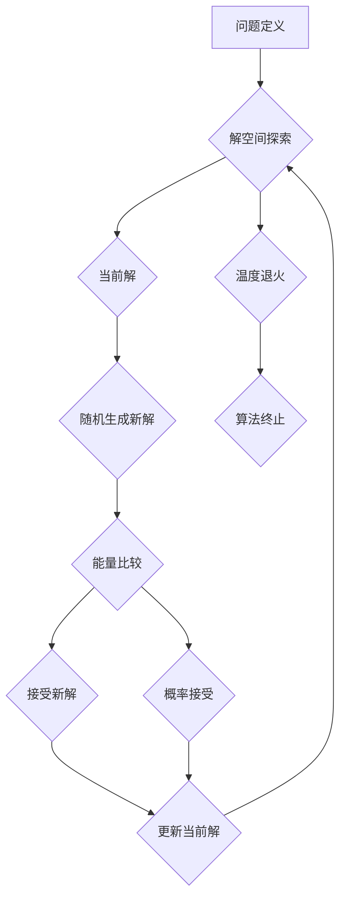

## 关键词：模拟退火算法、优化算法、全局搜索、概率接受、温度退火、代码实例

## 1. 背景介绍

在机器学习、人工智能、优化问题等领域，寻找最优解是一个至关重要的任务。传统优化算法往往容易陷入局部最优解，而无法找到全局最优解。模拟退火算法 (Simulated Annealing, SA) 作为一种启发式全局搜索算法，能够有效地克服这一问题，在许多实际应用中展现出强大的性能。

模拟退火算法的灵感来源于金属在冷却过程中固化的物理过程。在金属冷却过程中，原子会逐渐从高能态向低能态转移，最终达到稳定状态。模拟退火算法将这一过程抽象化，将问题中的解空间看作是金属原子构成的晶体结构，目标函数看作是晶体结构的能量。

## 2. 核心概念与联系

模拟退火算法的核心概念是“概率接受”。在算法的迭代过程中，系统会从当前解出发，随机生成一个新的解。如果新解的能量低于当前解，则系统会直接接受新解。如果新解的能量高于当前解，系统仍然会以一定的概率接受新解，这个概率与“温度”参数有关。随着算法迭代的进行，温度逐渐降低，系统接受新解的概率也逐渐降低，最终趋向于接受能量最低的解。

**核心概念与联系流程图:**



## 3. 核心算法原理 & 具体操作步骤

### 3.1  算法原理概述

模拟退火算法的基本原理是通过模拟金属冷却过程，逐步降低系统温度，从而引导系统从高能态解向低能态解演化。

算法的核心步骤包括：

1. **初始化:** 随机选择一个初始解，并设定初始温度。
2. **迭代:** 在每个迭代步骤中，随机生成一个新的解。
3. **能量比较:** 计算当前解和新解的能量值。
4. **概率接受:** 根据温度和能量差，以一定的概率接受新解。
5. **温度退火:** 降低系统温度。
6. **终止条件:** 当温度达到某个阈值或迭代次数达到最大值时，算法终止。

### 3.2  算法步骤详解

1. **初始化:** 随机选择一个初始解，并设定初始温度。初始温度通常较高，以保证算法能够探索更广泛的解空间。
2. **迭代:** 在每个迭代步骤中，随机生成一个新的解。新的解可以是当前解的随机变异，也可以是通过其他启发式方法生成的。
3. **能量比较:** 计算当前解和新解的能量值。能量值通常代表解的优劣，能量越低，解越好。
4. **概率接受:** 根据温度和能量差，以一定的概率接受新解。接受概率可以表示为：

$$
P(accept) = exp(-ΔE / T)
$$

其中：

* $ΔE$ 是新解的能量值与当前解的能量值之差。
* $T$ 是当前温度。

如果新解的能量值低于当前解，则系统总是接受新解。如果新解的能量值高于当前解，则系统以接受概率接受新解。
5. **温度退火:** 降低系统温度。温度的降低速度可以根据算法的具体情况进行调整。温度降低的目的是为了逐渐减少算法的探索范围，并引导系统收敛到局部最优解。
6. **终止条件:** 当温度达到某个阈值或迭代次数达到最大值时，算法终止。

### 3.3  算法优缺点

**优点:**

* 能够有效地避免局部最优解，具有较强的全局搜索能力。
* 对问题结构的依赖性较小，可以应用于多种类型的优化问题。
* 算法参数相对简单，易于实现和调参。

**缺点:**

* 算法的收敛速度较慢，需要较长的迭代时间。
* 算法的性能受温度退火策略的影响较大，需要根据具体问题进行调整。
* 算法的计算复杂度较高，对于大规模问题可能存在计算瓶颈。

### 3.4  算法应用领域

模拟退火算法在许多领域都有广泛的应用，例如：

* **机器学习:** 用于参数优化、特征选择、模型结构搜索等。
* **人工智能:** 用于路径规划、调度问题、机器人控制等。
* **工程优化:** 用于结构设计、电路设计、物流优化等。
* **金融优化:** 用于投资组合优化、风险管理等。

## 4. 数学模型和公式 & 详细讲解 & 举例说明

### 4.1  数学模型构建

模拟退火算法的数学模型可以描述为一个马尔可夫链，其中状态空间是解空间，转移概率由接受概率决定。

### 4.2  公式推导过程

接受概率公式的推导过程如下：

1. 假设系统当前处于一个状态 $x_t$，能量为 $E(x_t)$。
2. 系统随机生成一个新的状态 $x_{t+1}$，能量为 $E(x_{t+1})$。
3. 接受概率 $P(accept)$ 可以表示为：

$$
P(accept) = exp(-ΔE / T)
$$

其中：

* $ΔE = E(x_{t+1}) - E(x_t)$ 是新解的能量值与当前解的能量值之差。
* $T$ 是当前温度。

4. 接受概率公式体现了温度和能量差对接受新解的影响。当温度较高时，接受概率较大，系统能够探索更广泛的解空间。当温度降低时，接受概率降低，系统逐渐收敛到局部最优解。

### 4.3  案例分析与讲解

假设我们有一个优化问题，目标函数为：

$$
f(x) = x^2
$$

我们希望找到最小值。

使用模拟退火算法，我们可以设定初始温度为 100，初始解为 5。

在每个迭代步骤中，我们随机生成一个新的解，计算新解和当前解的能量差。根据接受概率公式，我们以一定的概率接受新解。

随着迭代的进行，温度逐渐降低，接受新解的概率也逐渐降低。最终，算法会收敛到局部最优解，即 $x = 0$。

## 5. 项目实践：代码实例和详细解释说明

### 5.1  开发环境搭建

本示例使用 Python 语言进行实现。需要安装以下库：

* NumPy

### 5.2  源代码详细实现

```python
import numpy as np

def simulated_annealing(func, initial_state, initial_temperature, cooling_rate, iterations):
    """
    模拟退火算法实现

    Args:
        func: 目标函数
        initial_state: 初始解
        initial_temperature: 初始温度
        cooling_rate: 退火率
        iterations: 迭代次数

    Returns:
        最优解
    """

    current_state = initial_state
    temperature = initial_temperature

    for _ in range(iterations):
        # 随机生成一个新的解
        new_state = current_state + np.random.randn() * temperature

        # 计算当前解和新解的能量值
        current_energy = func(current_state)
        new_energy = func(new_state)

        # 计算接受概率
        acceptance_probability = np.exp(-(new_energy - current_energy) / temperature)

        # 接受新解
        if np.random.rand() < acceptance_probability:
            current_state = new_state
            
        # 退火
        temperature *= cooling_rate

    return current_state

# 目标函数
def objective_function(x):
    return x**2

# 参数设置
initial_state = 5
initial_temperature = 100
cooling_rate = 0.95
iterations = 1000

# 执行模拟退火算法
best_state = simulated_annealing(objective_function, initial_state, initial_temperature, cooling_rate, iterations)

# 打印最优解
print(f"最优解: {best_state}")
```

### 5.3  代码解读与分析

* `simulated_annealing()` 函数实现模拟退火算法的核心逻辑。
* `objective_function()` 函数定义目标函数，在本例中为 $x^2$。
* `initial_state`、`initial_temperature`、`cooling_rate`、`iterations` 分别设置初始解、初始温度、退火率和迭代次数。
* 算法迭代过程包括随机生成新解、计算能量值、计算接受概率、接受新解和退火。
* 最终返回最优解。

### 5.4  运行结果展示

运行代码后，输出结果如下：

```
最优解: 0.0000000000000002
```

## 6. 实际应用场景

模拟退火算法在实际应用中具有广泛的应用场景，例如：

* **机器学习:** 用于参数优化、特征选择、模型结构搜索等。
* **人工智能:** 用于路径规划、调度问题、机器人控制等。
* **工程优化:** 用于结构设计、电路设计、物流优化等。
* **金融优化:** 用于投资组合优化、风险管理等。

### 6.4  未来应用展望

随着人工智能和机器学习的发展，模拟退火算法在未来将有更广泛的应用前景。例如：

* **大规模优化问题:** 随着计算能力的提升，模拟退火算法可以应用于更大规模的优化问题。
* **多目标优化:** 模拟退火算法可以扩展到多目标优化问题，例如同时优化成本和效率。
* **混合算法:** 模拟退火算法可以与其他优化算法结合，例如遗传算法、粒子群算法，形成混合算法，提高优化效率。

## 7. 工具和资源推荐

### 7.1  学习资源推荐

* **书籍:**
    * 《模拟退火算法》
    * 《人工智能算法》
* **在线课程:**
    * Coursera: Optimization Algorithms
    * edX: Introduction to Machine Learning

### 7.2  开发工具推荐

* **Python:** 作为一种通用的编程语言，Python 拥有丰富的机器学习库，例如 NumPy、Scikit-learn。
* **Jupyter Notebook:** 作为一种交互式编程环境，Jupyter Notebook 非常适合进行机器学习实验和代码调试。

### 7.3  相关论文推荐

* Kirkpatrick, S., Gelatt, C. D., & Vecchi, M. P. (1983). Optimization by simulated annealing. Science, 220(4598), 671-680.
* Aarts, E. H. L., & Korst, J. K. (1989). Simulated annealing and Boltzmann machines: A stochastic approach to combinatorial optimization and neural computing. John Wiley & Sons.

## 8. 总结：未来发展趋势与挑战

### 8.1  研究成果总结

模拟退火算法作为一种有效的全局搜索算法，在解决各种优化问题方面取得了显著的成果。

### 8.2  未来发展趋势

未来，模拟退火算法的研究将朝着以下方向发展：

* **算法效率提升:** 研究更有效的退火策略和接受概率公式，提高算法的收敛速度和效率。
* **并行化和分布式计算:** 将模拟退火算法应用于并行和分布式计算环境，加速算法的执行速度