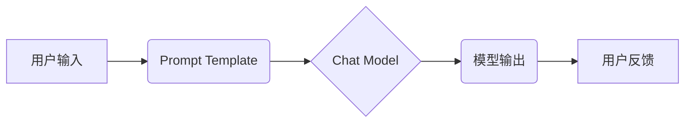

## 深入理解 Chat Model 和 Chat Prompt Template

> 关键词：ChatGPT, 语言模型, 聊天机器人, Prompt Engineering, 自然语言处理, Transformer, 

## 1. 背景介绍

近年来，人工智能领域取得了令人瞩目的进展，其中自然语言处理 (NLP) 领域尤为突出。 聊天机器人作为 NLP 领域的重要应用之一，已经从简单的问答系统发展成为能够进行自然、流畅对话的智能助手。 

ChatGPT 作为一款基于 Transformer 架构的强大语言模型，代表了这一领域的最新成果。它能够理解和生成人类语言，并能够在各种对话场景中表现出色。 然而，仅仅拥有强大的模型能力还不够，如何有效地与 ChatGPT 进行交互，引导它生成高质量的回复，是决定其应用效果的关键。 

这就是 Prompt Engineering 的重要性。 

## 2. 核心概念与联系

**2.1  Chat Model**

Chat Model 指的是能够理解和生成人类语言的深度学习模型。 它们通常基于 Transformer 架构，并通过大量的文本数据进行训练。 

**2.2  Prompt Template**

Prompt Template 是用于引导 Chat Model 生成特定类型回复的文本结构。 它可以包含一系列关键词、指示词、示例对话等信息，帮助模型理解用户意图并生成更准确、更有针对性的回复。

**2.3  关系图**



## 3. 核心算法原理 & 具体操作步骤

**3.1  算法原理概述**

Chat Model 的核心算法原理是基于 Transformer 架构的 self-attention 机制。 

Self-attention 允许模型在处理文本序列时，关注不同词语之间的关系，从而更好地理解上下文信息。 

通过训练大量的文本数据，Chat Model 学习了语言的语法规则、语义关系以及各种表达方式，从而能够生成流畅、自然的文本。

**3.2  算法步骤详解**

1. **输入处理:** 用户输入的文本首先会被转换为数字表示，以便模型进行处理。
2. **Embedding:** 将数字表示转换为向量表示，每个词语都对应一个向量。
3. **Encoder:** Encoder 部分负责对输入文本进行编码，提取文本的语义信息。
4. **Decoder:** Decoder 部分负责根据编码后的信息生成回复文本。
5. **输出生成:** 将生成的向量表示转换为文本，并输出给用户。

**3.3  算法优缺点**

**优点:**

* 能够处理长文本序列，理解上下文信息。
* 生成文本流畅自然，语法正确。
* 可迁移学习，在不同任务上表现出色。

**缺点:**

* 训练成本高，需要大量的计算资源和数据。
* 生成文本可能存在偏差或错误，需要进行后续的校对和优化。

**3.4  算法应用领域**

* 聊天机器人
* 文本摘要
* 机器翻译
* 代码生成
* 文本创作

## 4. 数学模型和公式 & 详细讲解 & 举例说明

**4.1  数学模型构建**

Chat Model 通常使用 Transformer 架构，其核心是 self-attention 机制。 

**4.2  公式推导过程**

Self-attention 机制通过以下公式计算每个词语与其他词语之间的注意力权重：

$$
Attention(Q, K, V) = \frac{exp(Q \cdot K^T / \sqrt{d_k})}{exp(Q \cdot K^T / \sqrt{d_k})} \cdot V
$$

其中：

* $Q$：查询矩阵
* $K$：键矩阵
* $V$：值矩阵
* $d_k$：键向量的维度

**4.3  案例分析与讲解**

假设我们有一个句子 "The cat sat on the mat"， 

每个词语都对应一个向量表示。 

通过 self-attention 机制，模型可以计算每个词语与其他词语之间的注意力权重，例如 "cat" 与 "sat" 之间的权重较高，因为它们在语义上相关。

## 5. 项目实践：代码实例和详细解释说明

**5.1  开发环境搭建**

* Python 3.7+
* PyTorch 或 TensorFlow
* CUDA (可选)

**5.2  源代码详细实现**

```python
import torch
import torch.nn as nn

class Transformer(nn.Module):
    def __init__(self, vocab_size, embedding_dim, num_heads, num_layers):
        super(Transformer, self).__init__()
        self.embedding = nn.Embedding(vocab_size, embedding_dim)
        self.transformer_layers = nn.ModuleList([
            nn.TransformerEncoderLayer(embedding_dim, num_heads)
            for _ in range(num_layers)
        ])
        self.decoder = nn.Linear(embedding_dim, vocab_size)

    def forward(self, x):
        x = self.embedding(x)
        x = self.transformer_layers(x)
        x = self.decoder(x)
        return x
```

**5.3  代码解读与分析**

* `Transformer` 类定义了 Transformer 模型的结构。
* `embedding` 层将词语转换为向量表示。
* `transformer_layers` 是一个列表，包含多个 Transformer Encoder Layer。
* `decoder` 层将编码后的信息转换为输出文本。

**5.4  运行结果展示**

通过训练上述模型，可以实现文本生成、机器翻译等任务。

## 6. 实际应用场景

**6.1  聊天机器人**

ChatGPT 可以用于构建各种类型的聊天机器人，例如客服机器人、陪伴机器人、游戏机器人等。

**6.2  文本摘要**

ChatGPT 可以根据给定的文本生成简洁的摘要，用于快速了解文章内容。

**6.3  机器翻译**

ChatGPT 可以用于将文本从一种语言翻译成另一种语言。

**6.4  未来应用展望**

ChatGPT 的应用场景还在不断扩展，未来可能应用于教育、医疗、法律等领域。

## 7. 工具和资源推荐

**7.1  学习资源推荐**

* **论文:** "Attention Is All You Need"
* **博客:** OpenAI Blog
* **课程:** Stanford CS224N

**7.2  开发工具推荐**

* **Hugging Face Transformers:** 提供预训练的 Transformer 模型和工具。
* **TensorFlow:** 深度学习框架。
* **PyTorch:** 深度学习框架。

**7.3  相关论文推荐**

* "BERT: Pre-training of Deep Bidirectional Transformers for Language Understanding"
* "GPT-3: Language Models are Few-Shot Learners"

## 8. 总结：未来发展趋势与挑战

**8.1  研究成果总结**

Chat Model 和 Prompt Engineering 取得了显著进展，为自然语言处理带来了革命性的改变。

**8.2  未来发展趋势**

* 更强大的模型架构和训练方法
* 更有效的 Prompt Engineering 技术
* 更广泛的应用场景

**8.3  面临的挑战**

* 模型的可解释性和透明度
* 模型的公平性和偏见问题
* 模型的安全性和可靠性

**8.4  研究展望**

未来研究将继续探索更强大的 Chat Model 和更有效的 Prompt Engineering 技术，以解决自然语言处理中的各种挑战。

## 9. 附录：常见问题与解答

**9.1  如何选择合适的 Prompt Template?**

选择合适的 Prompt Template 需要根据具体的应用场景和任务需求。 

**9.2  如何优化 Prompt Template?**

可以通过 A/B 测试、反馈收集等方式优化 Prompt Template。

**9.3  Chat Model 会不会产生虚假信息?**

Chat Model 的输出可能存在虚假信息，需要进行后续的校对和验证。


作者：禅与计算机程序设计艺术 / Zen and the Art of Computer Programming 
