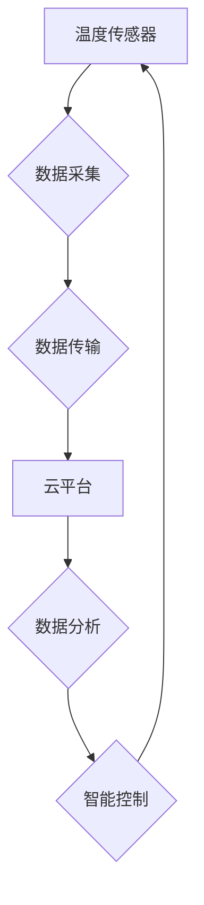

## 物联网(IoT)技术和各种传感器设备的集成：温度传感器的运用

> 关键词：物联网、传感器、温度传感器、数据采集、MQTT、云平台、数据分析、应用场景

## 1. 背景介绍

物联网 (IoT) 技术的快速发展，使得各种传感器设备得以广泛应用，为我们提供了收集和分析环境数据的新途径。其中，温度传感器作为一种基础的传感器，在工业控制、智能家居、农业监测等领域发挥着至关重要的作用。

随着物联网技术的成熟，温度传感器不再局限于简单的温度测量，而是被赋予了更丰富的功能，例如远程监控、数据分析、智能控制等。本文将深入探讨物联网技术与温度传感器的集成，分析其核心概念、算法原理、项目实践以及实际应用场景，并展望其未来发展趋势。

## 2. 核心概念与联系

### 2.1 物联网 (IoT)

物联网是指通过传感器、网络、数据处理和智能应用等技术，将物理世界中的物体连接到互联网，实现数据采集、传输、分析和应用的网络系统。

### 2.2 传感器

传感器是一种能够将物理量转化为电信号的装置。温度传感器是一种专门用于测量温度的传感器。

### 2.3 数据采集

数据采集是指从温度传感器等传感器设备中获取温度数据的过程。

### 2.4 数据传输

数据传输是指将采集到的温度数据从传感器设备传输到云平台或其他数据处理中心的过程。

### 2.5 云平台

云平台是一个提供计算、存储、网络等资源的虚拟化平台，可以用于存储、分析和管理物联网数据。

### 2.6 数据分析

数据分析是指对采集到的温度数据进行处理和分析，以发现其中的规律和趋势。

### 2.7 智能控制

智能控制是指根据温度数据分析结果，自动调节设备运行状态，以实现温度控制目标。

**核心概念与联系流程图**



## 3. 核心算法原理 & 具体操作步骤

### 3.1 算法原理概述

温度传感器的核心算法原理是将温度转换为电信号。常见的温度传感器类型包括电阻温度传感器 (RTD)、热电偶和集成电路温度传感器 (IC)。

* **电阻温度传感器 (RTD):** 这种传感器利用电阻随温度变化的特性进行测量。当温度升高时，电阻值也会升高。通过测量电阻值，可以计算出温度。

* **热电偶:** 热电偶利用热电效应进行测量。当热电偶两端温度不同时，会产生微小的电压。通过测量电压值，可以计算出温度。

* **集成电路温度传感器 (IC):** 这种传感器利用集成电路技术实现温度测量。它们通常具有较高的精度和稳定性。

### 3.2 算法步骤详解

1. **选择合适的温度传感器:** 根据应用场景选择合适的温度传感器类型。

2. **连接温度传感器:** 将温度传感器连接到微控制器或其他数据采集设备。

3. **读取温度数据:** 通过串口、I2C 或 SPI 等接口读取温度传感器输出的电信号。

4. **转换温度数据:** 将电信号转换为温度值。可以使用传感器提供的公式或曲线进行转换。

5. **存储和传输温度数据:** 将温度数据存储到本地存储器或传输到云平台。

### 3.3 算法优缺点

**优点:**

* 精度高: 温度传感器可以提供高精度的温度测量结果。
* 稳定性好: 温度传感器具有良好的稳定性，可以长期稳定工作。
* 响应速度快: 温度传感器可以快速响应温度变化。

**缺点:**

* 容易受到环境干扰: 温度传感器容易受到温度、湿度、振动等环境因素的影响。
* 寿命有限: 温度传感器有一定的使用寿命，需要定期更换。

### 3.4 算法应用领域

温度传感器广泛应用于以下领域:

* **工业控制:** 用于监测和控制工业设备的温度。
* **智能家居:** 用于监测和控制家庭环境的温度。
* **农业监测:** 用于监测土壤温度、植物温度等。
* **医疗保健:** 用于监测人体温度、医疗设备温度等。

## 4. 数学模型和公式 & 详细讲解 & 举例说明

### 4.1 数学模型构建

温度传感器的数学模型通常基于传感器的工作原理。例如，电阻温度传感器 (RTD) 的数学模型可以表示为：

$$R_T = R_{0} (1 + \alpha (T - T_0))$$

其中:

* $R_T$ 是温度 $T$ 时电阻值。
* $R_{0}$ 是参考温度 $T_0$ 时电阻值。
* $\alpha$ 是温度系数。

### 4.2 公式推导过程

温度系数 $\alpha$ 是一个材料的特性，表示电阻随温度变化的比例。

### 4.3 案例分析与讲解

假设一个电阻温度传感器 (RTD) 的参考温度为 $25^\circ C$，参考电阻值为 $100 \Omega$，温度系数为 $0.00393 \ 1/^\circ C$。当温度升高到 $50^\circ C$ 时，电阻值是多少？

$$R_{50} = 100 \Omega (1 + 0.00393 \ 1/^\circ C (50^\circ C - 25^\circ C))$$

$$R_{50} = 100 \Omega (1 + 0.00393 \ 1/^\circ C (25^\circ C))$$

$$R_{50} = 100 \Omega (1 + 0.09825)$$

$$R_{50} = 100 \Omega (1.09825)$$

$$R_{50} = 109.825 \Omega$$

因此，当温度升高到 $50^\circ C$ 时，电阻值将升高到 $109.825 \Omega$。

## 5. 项目实践：代码实例和详细解释说明

### 5.1 开发环境搭建

本项目使用 Arduino 平台进行开发。需要准备 Arduino 开发板、温度传感器 (例如 DHT11) 和 USB 数据线。

### 5.2 源代码详细实现

```cpp
#include <DHT.h>

#define DHTPIN 2     // DHT11 连接到 Arduino 的引脚 2
#define DHTTYPE DHT11 // DHT11 传感器类型

DHT dht(DHTPIN, DHTTYPE);

void setup() {
  Serial.begin(9600);
  dht.begin();
}

void loop() {
  // 读取温度和湿度数据
  float humidity = dht.readHumidity();
  float temperature = dht.readTemperature();

  // 检查数据是否有效
  if (isnan(humidity) || isnan(temperature)) {
    Serial.println("Failed to read from DHT sensor!");
    return;
  }

  // 打印数据到串口
  Serial.print("Humidity: ");
  Serial.print(humidity);
  Serial.print("%  Temperature: ");
  Serial.print(temperature);
  Serial.println("°C");

  delay(2000);
}
```

### 5.3 代码解读与分析

* `#include <DHT.h>` 包含 DHT 库，用于控制 DHT11 传感器。
* `#define DHTPIN 2` 定义 DHT11 传感器连接到 Arduino 的引脚 2。
* `#define DHTTYPE DHT11` 定义 DHT11 传感器类型。
* `DHT dht(DHTPIN, DHTTYPE);` 创建 DHT 对象，用于控制 DHT11 传感器。
* `dht.begin();` 初始化 DHT11 传感器。
* `dht.readHumidity();` 读取湿度数据。
* `dht.readTemperature();` 读取温度数据。
* `isnan(humidity) || isnan(temperature)` 检查数据是否有效。
* `Serial.print();` 打印数据到串口。
* `delay(2000);` 延迟 2 秒。

### 5.4 运行结果展示

程序运行后，会在串口监视器中显示温度和湿度数据。

## 6. 实际应用场景

### 6.1 智能家居

温度传感器可以用于监测家庭环境的温度，并根据设定温度自动调节空调、暖气等设备，实现智能温度控制。

### 6.2 工业控制

温度传感器可以用于监测工业设备的温度，例如机器、炉子、管道等，确保设备正常运行，并及时发现温度异常情况。

### 6.3 农业监测

温度传感器可以用于监测土壤温度、植物温度等，帮助农民了解作物生长环境，并进行科学的灌溉、施肥等管理。

### 6.4 其他应用场景

温度传感器还可以应用于医疗保健、食品安全、环境监测等领域。

## 7. 工具和资源推荐

### 7.1 学习资源推荐

* **书籍:**
    * 《物联网技术》
    * 《嵌入式系统编程》
* **网站:**
    * Arduino 官方网站: https://www.arduino.cc/
    * Adafruit 学习平台: https://learn.adafruit.com/

### 7.2 开发工具推荐

* **Arduino IDE:** Arduino 开发环境
* **PlatformIO:** 跨平台嵌入式开发环境
* **MQTT Broker:** MQTT 消息代理服务器

### 7.3 相关论文推荐

* **物联网温度传感器的应用研究**
* **基于 MQTT 的物联网温度监测系统设计**

## 8. 总结：未来发展趋势与挑战

### 8.1 研究成果总结

物联网技术与温度传感器的集成取得了显著成果，为我们提供了更加智能、高效的温度监测和控制解决方案。

### 8.2 未来发展趋势

* **更精准的温度传感器:** 随着传感器技术的进步，温度传感器的精度和稳定性将进一步提高。
* **更智能的温度控制:** 基于人工智能和机器学习技术的温度控制将更加智能化，能够根据实际需求自动调节温度。
* **更广泛的应用场景:** 温度传感器将应用于更多领域，例如医疗保健、食品安全、环境监测等。

### 8.3 面临的挑战

* **数据安全:** 物联网数据安全是一个重要的挑战，需要采取有效的措施保护数据安全。
* **网络可靠性:** 物联网设备的网络连接需要保持稳定可靠，才能保证数据的实时传输。
* **成本控制:** 物联网设备的成本仍然较高，需要进一步降低成本，才能推广应用。

### 8.4 研究展望

未来，我们将继续研究物联网技术与温度传感器的集成，探索更精准、更智能、更安全、更可靠的温度监测和控制解决方案。

## 9. 附录：常见问题与解答

### 9.1 为什么温度传感器数据不准确？

温度传感器数据不准确的原因可能包括：

* 传感器本身精度问题
* 环境温度波动过大
* 传感器安装位置不合适
* 数据采集和处理过程中的误差

### 9.2 如何选择合适的温度传感器？

选择合适的温度传感器需要考虑以下因素:

* 测量范围
* 精度要求
* 响应速度
* 工作环境
* 连接方式

### 9.3 如何解决温度传感器数据传输问题？

温度传感器数据传输问题可以通过以下方式解决:

* 使用可靠的网络连接
* 使用数据加密技术
* 使用数据缓冲机制

作者：禅与计算机程序设计艺术 / Zen and the Art of Computer Programming


