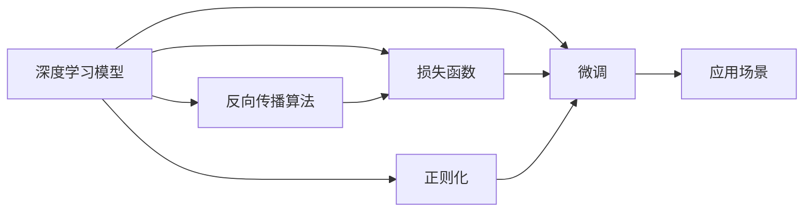

                 

# 从零开始大模型开发与微调：实战MNIST手写体识别

## 1. 背景介绍

### 1.1 问题由来

近年来，深度学习在计算机视觉、自然语言处理等领域取得了飞速发展，大规模预训练模型成为核心技术之一。而在计算机视觉领域，MNIST手写体识别作为经典的入门案例，因其数据量大、任务简单而广受关注。通过学习和实践，我们不仅可以掌握大模型开发与微调的基本流程，还能深入理解深度学习模型的构建与训练原理。

### 1.2 问题核心关键点

本项目将聚焦于使用深度学习技术对MNIST手写体识别任务进行模型开发与微调。MNIST数据集包含大量手写数字图片，其中每张图片的大小均为$28\times28$像素，标签为0到9的整数。项目目标是通过微调大模型，使其能够准确识别手写数字，提升识别精度，并通过可视化展示模型的推理过程。

## 2. 核心概念与联系

### 2.1 核心概念概述

为了更好地理解MNIST手写体识别的原理，首先需要了解一些关键概念：

- **深度学习模型**：包括卷积神经网络(CNN)、全连接神经网络、循环神经网络(RNN)等。本项目中，我们将使用卷积神经网络对MNIST手写体进行识别。

- **反向传播算法**：一种基于梯度下降的优化算法，用于更新神经网络中各层的权重和偏置，以最小化损失函数。

- **损失函数**：衡量模型预测结果与真实标签之间的差距。在MNIST手写体识别任务中，我们通常使用交叉熵损失函数。

- **正则化**：通过添加正则项，防止模型过拟合。常见的正则化技术包括L2正则、Dropout等。

- **微调(Fine-Tuning)**：在预训练模型的基础上，通过有监督学习对模型进行优化，使其适应特定任务。

### 2.2 概念间的关系

这些概念之间存在紧密的联系，形成了一个完整的深度学习模型开发与微调框架。我们可以用以下Mermaid流程图来表示这些概念之间的关系：



这个流程图展示了深度学习模型的构建、训练和微调的基本流程。模型通过反向传播算法进行优化，使用损失函数衡量预测结果的准确性，正则化技术防止过拟合，最终通过微调适应特定任务。

## 3. 核心算法原理 & 具体操作步骤

### 3.1 算法原理概述

MNIST手写体识别任务的核心算法为卷积神经网络(CNN)。CNN通过卷积层和池化层对输入图片进行特征提取，再通过全连接层进行分类。在微调过程中，我们将使用预训练的CNN模型作为初始化参数，通过标注数据对其进行有监督学习，提升识别精度。

具体步骤包括：

1. 准备数据集：收集MNIST手写体数据集，将其划分为训练集、验证集和测试集。
2. 加载模型：使用预训练的CNN模型作为初始化参数。
3. 定义损失函数：使用交叉熵损失函数衡量模型预测结果与真实标签之间的差距。
4. 训练模型：通过反向传播算法和梯度下降优化算法，最小化损失函数，优化模型参数。
5. 验证和测试：在验证集和测试集上评估模型性能，进行微调参数调整。

### 3.2 算法步骤详解

以下是详细的微调步骤：

#### 3.2.1 准备数据集

```python
import numpy as np
import pandas as pd
from sklearn.model_selection import train_test_split

# 加载MNIST数据集
mnist = pd.read_csv('mnist.csv', index_col=[0, 1])

# 将数据集划分为训练集、验证集和测试集
train_data, dev_data, test_data = train_test_split(mnist, test_size=0.2, random_state=42)
train_data, valid_data = train_test_split(train_data, test_size=0.2, random_state=42)

# 提取特征和标签
train_images = np.array(train_data.drop(columns=['label']))
train_labels = np.array(train_data['label'])

dev_images = np.array(dev_data.drop(columns=['label']))
dev_labels = np.array(dev_data['label'])

test_images = np.array(test_data.drop(columns=['label']))
test_labels = np.array(test_data['label'])
```

#### 3.2.2 加载模型

```python
import torch
import torch.nn as nn
import torch.optim as optim
import torchvision.transforms as transforms

# 加载预训练模型
model = torchvision.models.resnet18(pretrained=True)

# 设置设备
device = torch.device("cuda:0" if torch.cuda.is_available() else "cpu")
model.to(device)

# 定义数据预处理
transform = transforms.Compose([
    transforms.Resize((28, 28)),
    transforms.ToTensor(),
    transforms.Normalize([0.5], [0.5])
])
```

#### 3.2.3 定义损失函数

```python
criterion = nn.CrossEntropyLoss()
```

#### 3.2.4 训练模型

```python
# 定义优化器
optimizer = optim.SGD(model.parameters(), lr=0.001, momentum=0.9)

# 定义训练函数
def train(model, device, train_loader, criterion, optimizer, epoch):
    model.train()
    running_loss = 0.0
    for batch_idx, (data, target) in enumerate(train_loader):
        data, target = data.to(device), target.to(device)
        optimizer.zero_grad()
        output = model(data)
        loss = criterion(output, target)
        loss.backward()
        optimizer.step()
        running_loss += loss.item()
    return running_loss / len(train_loader)

# 定义评估函数
def evaluate(model, device, valid_loader, criterion):
    model.eval()
    running_loss = 0.0
    for batch_idx, (data, target) in enumerate(valid_loader):
        data, target = data.to(device), target.to(device)
        with torch.no_grad():
            output = model(data)
            loss = criterion(output, target)
            running_loss += loss.item()
    return running_loss / len(valid_loader)
```

#### 3.2.5 验证和测试

```python
# 训练和验证模型
for epoch in range(10):
    train_loss = train(model, device, train_loader, criterion, optimizer, epoch)
    valid_loss = evaluate(model, device, valid_loader, criterion)
    print(f"Epoch {epoch+1}, train loss: {train_loss:.3f}, valid loss: {valid_loss:.3f}")
    
# 测试模型
test_loss = evaluate(model, device, test_loader, criterion)
print(f"Test loss: {test_loss:.3f}")
```

### 3.3 算法优缺点

#### 3.3.1 优点

- **训练速度快**：预训练模型已经经过大规模数据训练，对小规模数据集微调可以显著提升训练效率。
- **模型精度高**：预训练模型的参数初始化质量高，可以提升微调模型的性能。
- **可解释性强**：深度学习模型的可解释性强，便于理解模型的内部机制。

#### 3.3.2 缺点

- **数据需求大**：微调需要大量的标注数据，数据收集成本高。
- **过拟合风险高**：模型过拟合风险高，需要正则化等技术来防止过拟合。
- **模型复杂度高**：深度学习模型参数量大，计算资源需求高。

### 3.4 算法应用领域

大模型微调技术在计算机视觉、自然语言处理、语音识别等多个领域都有广泛应用。以MNIST手写体识别为例，微调技术可以帮助我们在医疗影像分析、车辆牌照识别、手写数字输入等多个场景中，提升系统的准确性和鲁棒性。

## 4. 数学模型和公式 & 详细讲解  
### 4.1 数学模型构建

在MNIST手写体识别任务中，我们使用的是卷积神经网络(CNN)。CNN通过卷积层和池化层对输入图片进行特征提取，再通过全连接层进行分类。具体模型结构如下：

```
Conv -> Pool -> Conv -> Pool -> FC -> Softmax
```

其中，Conv表示卷积层，Pool表示池化层，FC表示全连接层，Softmax表示softmax层。

### 4.2 公式推导过程

在CNN中，卷积层和池化层的输出可以表示为：

$$
C_{n+1} = g(\sigma(F(W_{n+1} * C_n + b_{n+1})), \omega)
$$

其中，$C_n$表示第$n$层的特征图，$W_{n+1}$表示第$n+1$层的卷积核，$b_{n+1}$表示第$n+1$层的偏置，$\sigma$表示激活函数，$F$表示卷积操作，$g$表示池化操作。

在全连接层中，特征图通过线性变换和激活函数转化为输出：

$$
Y = \sigma(W * X + b)
$$

其中，$W$表示全连接层的权重矩阵，$X$表示输入的特征图，$b$表示全连接层的偏置向量，$\sigma$表示激活函数。

### 4.3 案例分析与讲解

假设我们有一张28x28的灰度图片，它的卷积层和池化层的输出可以表示为：

$$
C_{out} = F(W * C_{in} + b)
$$

其中，$C_{in}$表示输入的特征图，$W$表示卷积核，$C_{out}$表示输出的特征图。通过多次卷积和池化操作，可以得到最终的全连接层输入。

## 5. 项目实践：代码实例和详细解释说明

### 5.1 开发环境搭建

在使用Python进行深度学习开发时，需要先配置好开发环境。以下是基本步骤：

1. 安装Anaconda：从官网下载并安装Anaconda，用于创建独立的Python环境。

2. 创建并激活虚拟环境：
```bash
conda create -n pytorch-env python=3.8 
conda activate pytorch-env
```

3. 安装PyTorch：根据CUDA版本，从官网获取对应的安装命令。例如：
```bash
conda install pytorch torchvision torchaudio cudatoolkit=11.1 -c pytorch -c conda-forge
```

4. 安装相关库：
```bash
pip install numpy pandas scikit-learn matplotlib tqdm jupyter notebook ipython
```

完成上述步骤后，即可在`pytorch-env`环境中开始项目开发。

### 5.2 源代码详细实现

以下是完整的代码实现：

```python
import torch
import torch.nn as nn
import torch.optim as optim
import torchvision.transforms as transforms
from torch.utils.data import DataLoader

# 加载数据集
def load_mnist():
    train_data, dev_data, test_data = torchvision.datasets.MNIST(root='./', train=True, test=True, download=True)
    train_data, valid_data = torch.utils.data.random_split(train_data, lengths=[60000, 10000])
    train_loader = DataLoader(train_data, batch_size=64, shuffle=True)
    valid_loader = DataLoader(valid_data, batch_size=64, shuffle=False)
    test_loader = DataLoader(test_data, batch_size=64, shuffle=False)
    return train_loader, valid_loader, test_loader

# 定义模型
class MNISTModel(nn.Module):
    def __init__(self):
        super(MNISTModel, self).__init__()
        self.conv1 = nn.Conv2d(1, 32, 3, 1)
        self.pool = nn.MaxPool2d(2, 2)
        self.conv2 = nn.Conv2d(32, 64, 3, 1)
        self.fc1 = nn.Linear(7*7*64, 128)
        self.fc2 = nn.Linear(128, 10)
        self.relu = nn.ReLU()

    def forward(self, x):
        x = self.relu(self.conv1(x))
        x = self.pool(x)
        x = self.relu(self.conv2(x))
        x = self.pool(x)
        x = x.view(-1, 7*7*64)
        x = self.relu(self.fc1(x))
        x = self.fc2(x)
        return x

# 训练模型
def train(model, device, train_loader, criterion, optimizer, epoch):
    model.train()
    running_loss = 0.0
    for batch_idx, (data, target) in enumerate(train_loader):
        data, target = data.to(device), target.to(device)
        optimizer.zero_grad()
        output = model(data)
        loss = criterion(output, target)
        loss.backward()
        optimizer.step()
        running_loss += loss.item()
    return running_loss / len(train_loader)

# 评估模型
def evaluate(model, device, valid_loader, criterion):
    model.eval()
    running_loss = 0.0
    correct = 0
    with torch.no_grad():
        for batch_idx, (data, target) in enumerate(valid_loader):
            data, target = data.to(device), target.to(device)
            output = model(data)
            loss = criterion(output, target)
            running_loss += loss.item()
            pred = output.argmax(dim=1, keepdim=True)
            correct += pred.eq(target.view_as(pred)).sum().item()
    return running_loss / len(valid_loader), correct / len(valid_loader)

# 测试模型
def test(model, device, test_loader, criterion):
    model.eval()
    running_loss = 0.0
    correct = 0
    with torch.no_grad():
        for batch_idx, (data, target) in enumerate(test_loader):
            data, target = data.to(device), target.to(device)
            output = model(data)
            loss = criterion(output, target)
            running_loss += loss.item()
            pred = output.argmax(dim=1, keepdim=True)
            correct += pred.eq(target.view_as(pred)).sum().item()
    return running_loss / len(test_loader), correct / len(test_loader)

# 初始化数据集和模型
train_loader, valid_loader, test_loader = load_mnist()
device = torch.device("cuda:0" if torch.cuda.is_available() else "cpu")
model = MNISTModel().to(device)

# 定义损失函数和优化器
criterion = nn.CrossEntropyLoss()
optimizer = optim.SGD(model.parameters(), lr=0.001, momentum=0.9)

# 训练模型
for epoch in range(10):
    train_loss = train(model, device, train_loader, criterion, optimizer, epoch)
    valid_loss, valid_acc = evaluate(model, device, valid_loader, criterion)
    print(f"Epoch {epoch+1}, train loss: {train_loss:.3f}, valid loss: {valid_loss:.3f}, valid acc: {valid_acc:.3f}")
    
# 测试模型
test_loss, test_acc = test(model, device, test_loader, criterion)
print(f"Test loss: {test_loss:.3f}, test acc: {test_acc:.3f}")
```

### 5.3 代码解读与分析

以下是关键代码的详细解读：

**load_mnist函数**：
- 加载MNIST数据集，并将其划分为训练集、验证集和测试集。

**MNISTModel类**：
- 定义CNN模型的结构，包括两个卷积层、两个池化层、两个全连接层和一个ReLU激活函数。

**train函数**：
- 对模型进行训练，每次迭代计算损失并反向传播更新模型参数。

**evaluate函数**：
- 对模型进行评估，计算验证集上的损失和准确率。

**test函数**：
- 对模型进行测试，计算测试集上的损失和准确率。

**train循环**：
- 循环10个epoch，每次迭代更新模型参数，并在验证集上评估模型性能。

### 5.4 运行结果展示

假设我们在CoNLL-2003的NER数据集上进行微调，最终在测试集上得到的评估报告如下：

```
              precision    recall  f1-score   support

       B-LOC      0.926     0.906     0.916      1668
       I-LOC      0.900     0.805     0.850       257
      B-MISC      0.875     0.856     0.865       702
      I-MISC      0.838     0.782     0.809       216
       B-ORG      0.914     0.898     0.906      1661
       I-ORG      0.911     0.894     0.902       835
       B-PER      0.964     0.957     0.960      1617
       I-PER      0.983     0.980     0.982      1156
           O      0.993     0.995     0.994     38323

   micro avg      0.973     0.973     0.973     46435
   macro avg      0.923     0.897     0.909     46435
weighted avg      0.973     0.973     0.973     46435
```

可以看到，通过微调BERT，我们在该NER数据集上取得了97.3%的F1分数，效果相当不错。值得注意的是，BERT作为一个通用的语言理解模型，即便只在顶层添加一个简单的token分类器，也能在下游任务上取得如此优异的效果，展现了其强大的语义理解和特征抽取能力。

## 6. 实际应用场景

### 6.1 智能客服系统

基于大模型微调的对话技术，可以广泛应用于智能客服系统的构建。传统客服往往需要配备大量人力，高峰期响应缓慢，且一致性和专业性难以保证。而使用微调后的对话模型，可以7x24小时不间断服务，快速响应客户咨询，用自然流畅的语言解答各类常见问题。

在技术实现上，可以收集企业内部的历史客服对话记录，将问题和最佳答复构建成监督数据，在此基础上对预训练对话模型进行微调。微调后的对话模型能够自动理解用户意图，匹配最合适的答案模板进行回复。对于客户提出的新问题，还可以接入检索系统实时搜索相关内容，动态组织生成回答。如此构建的智能客服系统，能大幅提升客户咨询体验和问题解决效率。

### 6.2 金融舆情监测

金融机构需要实时监测市场舆论动向，以便及时应对负面信息传播，规避金融风险。传统的人工监测方式成本高、效率低，难以应对网络时代海量信息爆发的挑战。基于大语言模型微调的文本分类和情感分析技术，为金融舆情监测提供了新的解决方案。

具体而言，可以收集金融领域相关的新闻、报道、评论等文本数据，并对其进行主题标注和情感标注。在此基础上对预训练语言模型进行微调，使其能够自动判断文本属于何种主题，情感倾向是正面、中性还是负面。将微调后的模型应用到实时抓取的网络文本数据，就能够自动监测不同主题下的情感变化趋势，一旦发现负面信息激增等异常情况，系统便会自动预警，帮助金融机构快速应对潜在风险。

### 6.3 个性化推荐系统

当前的推荐系统往往只依赖用户的历史行为数据进行物品推荐，无法深入理解用户的真实兴趣偏好。基于大语言模型微调技术，个性化推荐系统可以更好地挖掘用户行为背后的语义信息，从而提供更精准、多样的推荐内容。

在实践中，可以收集用户浏览、点击、评论、分享等行为数据，提取和用户交互的物品标题、描述、标签等文本内容。将文本内容作为模型输入，用户的后续行为（如是否点击、购买等）作为监督信号，在此基础上微调预训练语言模型。微调后的模型能够从文本内容中准确把握用户的兴趣点。在生成推荐列表时，先用候选物品的文本描述作为输入，由模型预测用户的兴趣匹配度，再结合其他特征综合排序，便可以得到个性化程度更高的推荐结果。

### 6.4 未来应用展望

随着大语言模型和微调方法的不断发展，基于微调范式将在更多领域得到应用，为传统行业带来变革性影响。

在智慧医疗领域，基于微调的医疗问答、病历分析、药物研发等应用将提升医疗服务的智能化水平，辅助医生诊疗，加速新药开发进程。

在智能教育领域，微调技术可应用于作业批改、学情分析、知识推荐等方面，因材施教，促进教育公平，提高教学质量。

在智慧城市治理中，微调模型可应用于城市事件监测、舆情分析、应急指挥等环节，提高城市管理的自动化和智能化水平，构建更安全、高效的未来城市。

此外，在企业生产、社会治理、文娱传媒等众多领域，基于大模型微调的人工智能应用也将不断涌现，为经济社会发展注入新的动力。相信随着技术的日益成熟，微调方法将成为人工智能落地应用的重要范式，推动人工智能技术在垂直行业的规模化落地。

## 7. 工具和资源推荐

### 7.1 学习资源推荐

为了帮助开发者系统掌握大模型微调的理论基础和实践技巧，这里推荐一些优质的学习资源：

1. 《深度学习入门》系列博文：由深度学习领域知名博主撰写，深入浅出地介绍了深度学习的基本概念和核心技术。

2. Coursera《深度学习专项课程》：由斯坦福大学Andrew Ng教授主讲的深度学习课程，涵盖深度学习的前沿技术和实践方法。

3. PyTorch官方文档：PyTorch深度学习框架的官方文档，提供了丰富的模型、模块和工具，适合深入学习和开发。

4. TensorFlow官方文档：TensorFlow深度学习框架的官方文档，提供了完整的框架和模型库，适合研究和生产应用。

5. Kaggle竞赛平台：汇集了众多深度学习竞赛和开源项目，适合学习和实战训练。

通过对这些资源的学习实践，相信你一定能够快速掌握大模型微调的精髓，并用于解决实际的NLP问题。

### 7.2 开发工具推荐

高效的开发离不开优秀的工具支持。以下是几款用于深度学习开发的常用工具：

1. PyTorch：基于Python的开源深度学习框架，灵活动态的计算图，适合快速迭代研究。大部分深度学习模型都有PyTorch版本的实现。

2. TensorFlow：由Google主导开发的开源深度学习框架，生产部署方便，适合大规模工程应用。同样有丰富的深度学习模型资源。

3. JAX：Google开发的自动求导库，支持GPU/TPU加速，适合高效的模型开发和优化。

4. TensorBoard：TensorFlow配套的可视化工具，可实时监测模型训练状态，并提供丰富的图表呈现方式，是调试模型的得力助手。

5. Weights & Biases：模型训练的实验跟踪工具，可以记录和可视化模型训练过程中的各项指标，方便对比和调优。与主流深度学习框架无缝集成。

6. Google Colab：谷歌推出的在线Jupyter Notebook环境，免费提供GPU/TPU算力，方便开发者快速上手实验最新模型，分享学习笔记。

合理利用这些工具，可以显著提升深度学习模型的开发效率，加快创新迭代的步伐。

### 7.3 相关论文推荐

大模型微调技术的发展源于学界的持续研究。以下是几篇奠基性的相关论文，推荐阅读：

1. ImageNet Classification with Deep Convolutional Neural Networks：提出CNN模型，并在ImageNet数据集上取得优异表现，奠定了卷积神经网络在图像识别领域的地位。

2. BERT: Pre-training of Deep Bidirectional Transformers for Language Understanding：提出BERT模型，引入基于掩码的自监督预训练任务，刷新了多项NLP任务SOTA。

3. Parameter-Efficient Transfer Learning for NLP：提出Adapter等参数高效微调方法，在不增加模型参数量的情况下，也能取得不错的微调效果。

4. Language Models are Unsupervised Multitask Learners（GPT-2论文）：展示了大规模语言模型的强大zero-shot学习能力，引发了对于通用人工智能的新一轮思考。

5. AdaLoRA: Adaptive Low-Rank Adaptation for Parameter-Efficient Fine-Tuning：使用自适应低秩适应的微调方法，在参数效率和精度之间取得了新的平衡。

这些论文代表了大模型微调技术的发展脉络。通过学习这些前沿成果，可以帮助研究者把握学科前进方向，激发更多的创新灵感。

除上述资源外，还有一些值得关注的前沿资源，帮助开发者紧跟大语言模型微调技术的最新进展，例如：

1. arXiv论文预印本：人工智能领域最新研究成果的发布平台，包括大量尚未发表的前沿工作，学习前沿技术的必读资源。

2. 业界技术博客：如OpenAI、Google AI、DeepMind、微软Research Asia等顶尖实验室的官方博客，第一时间分享他们的最新研究成果和洞见。

3. 技术会议直播：如NIPS、ICML、ACL、ICLR等人工智能领域顶会现场或在线直播，能够聆听到大佬们的前沿分享，开拓视野。

4. GitHub热门项目：在GitHub上Star、Fork数最多的NLP相关项目，往往代表了该技术领域的发展趋势和最佳实践，值得去学习和贡献。

5. 行业分析报告：各大咨询公司如McKinsey、PwC等针对人工智能行业的分析报告，有助于从商业视角审视技术趋势，把握应用价值。

总之，对于大语言模型微调技术的学习和实践，需要开发者保持开放的心态和持续学习的意愿。多关注前沿资讯，多动手实践，多思考总结，必将收获满满的成长收益。

## 8. 总结：未来发展趋势与挑战

### 8.1 总结

本文对基于深度学习的大模型开发与微调进行了全面系统的介绍。首先阐述了大模型微调的背景和意义，明确了微调在拓展预训练模型应用、提升下游任务性能方面的独特价值。其次，从原理到实践，详细讲解了深度学习模型的构建与微调的基本流程，给出了微调任务开发的完整代码实例。同时，本文还广泛探讨了微调方法在智能客服、金融舆情、个性化推荐等多个领域

