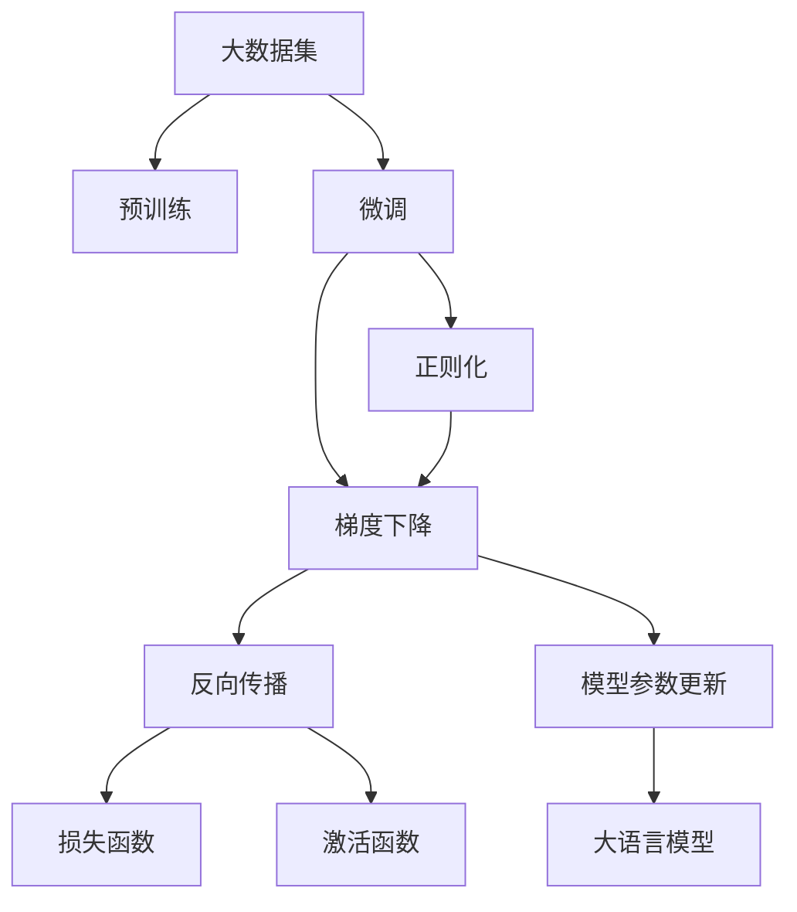

                 

# 从零开始大模型开发与微调：梯度下降算法

## 1. 背景介绍

随着深度学习技术的快速发展，大语言模型（Large Language Models, LLMs）在自然语言处理（NLP）领域取得了显著进展。这些模型通过在大规模无标签文本数据上进行预训练，学习到了丰富的语言知识和常识。通过微调（Fine-Tuning），这些模型能够快速适应特定任务，显著提升模型在特定任务上的性能。然而，要开发和微调一个大模型，需要对梯度下降算法有深入的理解。本文将从梯度下降算法的原理和具体实现方法入手，详细介绍如何从零开始开发和微调大模型。

## 2. 核心概念与联系

### 2.1 核心概念概述

为更好地理解梯度下降算法在大模型开发与微调中的应用，本节将介绍几个核心概念及其之间的联系。

- **梯度下降（Gradient Descent, GD）**：一种常用的优化算法，用于最小化某个函数的值。在深度学习中，梯度下降算法通过计算损失函数对模型参数的梯度，并按照梯度的反方向更新模型参数，使模型参数趋向于最优解。

- **大语言模型（Large Language Models）**：指通过在大规模无标签文本数据上进行预训练，学习到丰富语言知识和常识的模型，具备强大的语言理解和生成能力。

- **微调（Fine-Tuning）**：在预训练模型的基础上，使用下游任务的少量标注数据，通过有监督地训练优化模型在特定任务上的性能。

- **损失函数（Loss Function）**：用于衡量模型输出与真实标签之间的差异，是训练模型时的优化目标。

- **激活函数（Activation Function）**：用于引入非线性特性，使模型具备非线性表达能力。

- **反向传播（Backpropagation）**：通过链式法则计算损失函数对模型参数的梯度，从而更新模型参数。

### 2.2 概念间的关系

这些核心概念之间的联系可以通过以下Mermaid流程图来展示：



这个流程图展示了从预训练到微调，再到梯度下降和大模型参数更新的完整过程。

## 3. 核心算法原理 & 具体操作步骤

### 3.1 算法原理概述

梯度下降算法是一种常用的优化算法，用于最小化某个函数的值。在深度学习中，梯度下降算法通过计算损失函数对模型参数的梯度，并按照梯度的反方向更新模型参数，使模型参数趋向于最优解。

具体而言，梯度下降算法分为批量梯度下降（Batch Gradient Descent, BGD）、随机梯度下降（Stochastic Gradient Descent, SGD）和小批量梯度下降（Mini-batch Gradient Descent）等不同变体。其中，小批量梯度下降最为常用，因为它在保证计算效率的同时，也兼顾了收敛速度。

### 3.2 算法步骤详解

梯度下降算法的具体步骤如下：

1. **初始化模型参数**：将模型参数随机初始化。
2. **计算损失函数**：将训练数据输入模型，计算损失函数值。
3. **计算梯度**：通过反向传播算法计算损失函数对模型参数的梯度。
4. **更新模型参数**：根据梯度的反方向更新模型参数。
5. **重复步骤2-4**：直至损失函数收敛或达到预设迭代次数。

### 3.3 算法优缺点

梯度下降算法具有以下优点：
- 简单易实现：梯度下降算法简单易懂，易于实现。
- 收敛速度较快：在局部最优解附近，梯度下降算法收敛速度较快。
- 泛化能力强：梯度下降算法对训练数据的分布情况不敏感，泛化能力强。

同时，梯度下降算法也存在一些缺点：
- 需要手动调整超参数：如学习率、迭代次数等。
- 可能陷入局部最优解：梯度下降算法容易陷入局部最优解，无法找到全局最优解。
- 对噪声敏感：梯度下降算法对噪声敏感，可能导致参数更新方向与最优解方向不一致。

### 3.4 算法应用领域

梯度下降算法广泛应用于各种深度学习模型中，如卷积神经网络（CNN）、循环神经网络（RNN）和变分自编码器（VAE）等。在自然语言处理（NLP）领域，梯度下降算法常用于大语言模型的微调，提升模型在特定任务上的性能。

## 4. 数学模型和公式 & 详细讲解 & 举例说明

### 4.1 数学模型构建

假设我们有一个包含 $n$ 个样本的训练数据集 $D=\{(x_i, y_i)\}_{i=1}^N$，其中 $x_i$ 是输入，$y_i$ 是标签。我们将使用梯度下降算法最小化损失函数 $\mathcal{L}(\theta)$。

损失函数 $\mathcal{L}(\theta)$ 通常定义为交叉熵损失：

$$
\mathcal{L}(\theta) = -\frac{1}{N}\sum_{i=1}^N \sum_{j=1}^m y_{ij} \log \hat{y}_{ij}
$$

其中，$\theta$ 是模型参数，$\hat{y}_{ij}$ 是模型对第 $i$ 个样本的第 $j$ 个类别的预测概率。

### 4.2 公式推导过程

梯度下降算法的具体步骤如下：

1. 初始化模型参数 $\theta$。
2. 在每个迭代步骤中，随机选择一个样本 $(x_i, y_i)$。
3. 计算损失函数对模型参数的梯度：

$$
\frac{\partial \mathcal{L}(\theta)}{\partial \theta_k} = \frac{1}{N}\sum_{i=1}^N \frac{\partial \mathcal{L}(\theta)}{\partial \hat{y}_{ij}} \frac{\partial \hat{y}_{ij}}{\partial \theta_k}
$$

其中，$\frac{\partial \mathcal{L}(\theta)}{\partial \hat{y}_{ij}}$ 是交叉熵损失对预测概率的导数，$\frac{\partial \hat{y}_{ij}}{\partial \theta_k}$ 是激活函数对模型参数的导数。

4. 根据梯度的反方向更新模型参数：

$$
\theta_k \leftarrow \theta_k - \eta \frac{\partial \mathcal{L}(\theta)}{\partial \theta_k}
$$

其中，$\eta$ 是学习率，用于控制每次参数更新的步长。

### 4.3 案例分析与讲解

以二分类任务为例，假设我们有一个包含 $m$ 个类别的二分类模型，使用 sigmoid 激活函数。损失函数为交叉熵损失，其导数为：

$$
\frac{\partial \mathcal{L}(\theta)}{\partial \hat{y}} = -\frac{y}{\hat{y}} + \frac{1-y}{1-\hat{y}}
$$

其中，$\hat{y}$ 是模型对样本的预测概率。

对于 sigmoid 激活函数，其导数为：

$$
\frac{\partial \hat{y}}{\partial \theta_k} = \hat{y} - (1-\hat{y})x_k
$$

其中，$x_k$ 是第 $k$ 个模型参数的值。

将这些导数代入梯度下降算法的公式中，可以得到：

$$
\frac{\partial \mathcal{L}(\theta)}{\partial \theta_k} = -\frac{1}{N}\sum_{i=1}^N (y_i(\hat{y}_{ik} - y_i) - (1-y_i)(1-\hat{y}_{ik}))
$$

其中，$\hat{y}_{ik}$ 是模型对样本 $i$ 的类别 $k$ 的预测概率。

## 5. 项目实践：代码实例和详细解释说明

### 5.1 开发环境搭建

在进行大模型开发与微调实践前，我们需要准备好开发环境。以下是使用 Python 进行 PyTorch 开发的环境配置流程：

1. 安装 Anaconda：从官网下载并安装 Anaconda，用于创建独立的 Python 环境。

2. 创建并激活虚拟环境：
```bash
conda create -n pytorch-env python=3.8 
conda activate pytorch-env
```

3. 安装 PyTorch：根据 CUDA 版本，从官网获取对应的安装命令。例如：
```bash
conda install pytorch torchvision torchaudio cudatoolkit=11.1 -c pytorch -c conda-forge
```

4. 安装 Transformers 库：
```bash
pip install transformers
```

5. 安装各类工具包：
```bash
pip install numpy pandas scikit-learn matplotlib tqdm jupyter notebook ipython
```

完成上述步骤后，即可在 `pytorch-env` 环境中开始微调实践。

### 5.2 源代码详细实现

下面我们以二分类任务为例，给出使用 Transformers 库对 BERT 模型进行微调的 PyTorch 代码实现。

首先，定义二分类任务的数据处理函数：

```python
from transformers import BertTokenizer, BertForSequenceClassification
from torch.utils.data import Dataset
import torch

class BinaryDataset(Dataset):
    def __init__(self, texts, labels, tokenizer, max_len=128):
        self.texts = texts
        self.labels = labels
        self.tokenizer = tokenizer
        self.max_len = max_len
        
    def __len__(self):
        return len(self.texts)
    
    def __getitem__(self, item):
        text = self.texts[item]
        label = self.labels[item]
        
        encoding = self.tokenizer(text, return_tensors='pt', max_length=self.max_len, padding='max_length', truncation=True)
        input_ids = encoding['input_ids'][0]
        attention_mask = encoding['attention_mask'][0]
        
        label = torch.tensor(label, dtype=torch.long)
        
        return {'input_ids': input_ids, 
                'attention_mask': attention_mask,
                'labels': label}

# 创建 dataset
tokenizer = BertTokenizer.from_pretrained('bert-base-cased')

train_dataset = BinaryDataset(train_texts, train_labels, tokenizer)
dev_dataset = BinaryDataset(dev_texts, dev_labels, tokenizer)
test_dataset = BinaryDataset(test_texts, test_labels, tokenizer)
```

然后，定义模型和优化器：

```python
from transformers import BertForSequenceClassification, AdamW

model = BertForSequenceClassification.from_pretrained('bert-base-cased', num_labels=2)

optimizer = AdamW(model.parameters(), lr=2e-5)
```

接着，定义训练和评估函数：

```python
from torch.utils.data import DataLoader
from tqdm import tqdm
from sklearn.metrics import classification_report

device = torch.device('cuda') if torch.cuda.is_available() else torch.device('cpu')
model.to(device)

def train_epoch(model, dataset, batch_size, optimizer):
    dataloader = DataLoader(dataset, batch_size=batch_size, shuffle=True)
    model.train()
    epoch_loss = 0
    for batch in tqdm(dataloader, desc='Training'):
        input_ids = batch['input_ids'].to(device)
        attention_mask = batch['attention_mask'].to(device)
        labels = batch['labels'].to(device)
        model.zero_grad()
        outputs = model(input_ids, attention_mask=attention_mask, labels=labels)
        loss = outputs.loss
        epoch_loss += loss.item()
        loss.backward()
        optimizer.step()
    return epoch_loss / len(dataloader)

def evaluate(model, dataset, batch_size):
    dataloader = DataLoader(dataset, batch_size=batch_size)
    model.eval()
    preds, labels = [], []
    with torch.no_grad():
        for batch in tqdm(dataloader, desc='Evaluating'):
            input_ids = batch['input_ids'].to(device)
            attention_mask = batch['attention_mask'].to(device)
            batch_labels = batch['labels']
            outputs = model(input_ids, attention_mask=attention_mask)
            batch_preds = outputs.logits.argmax(dim=2).to('cpu').tolist()
            batch_labels = batch_labels.to('cpu').tolist()
            for pred, label in zip(batch_preds, batch_labels):
                preds.append(pred)
                labels.append(label)
                
    print(classification_report(labels, preds))
```

最后，启动训练流程并在测试集上评估：

```python
epochs = 5
batch_size = 16

for epoch in range(epochs):
    loss = train_epoch(model, train_dataset, batch_size, optimizer)
    print(f"Epoch {epoch+1}, train loss: {loss:.3f}")
    
    print(f"Epoch {epoch+1}, dev results:")
    evaluate(model, dev_dataset, batch_size)
    
print("Test results:")
evaluate(model, test_dataset, batch_size)
```

以上就是使用 PyTorch 对 BERT 进行二分类任务微调的完整代码实现。可以看到，得益于 Transformers 库的强大封装，我们可以用相对简洁的代码完成 BERT 模型的加载和微调。

### 5.3 代码解读与分析

让我们再详细解读一下关键代码的实现细节：

**BinaryDataset类**：
- `__init__`方法：初始化文本、标签、分词器等关键组件。
- `__len__`方法：返回数据集的样本数量。
- `__getitem__`方法：对单个样本进行处理，将文本输入编码为token ids，将标签编码为数字，并对其进行定长padding，最终返回模型所需的输入。

**标签与id的映射**：
- 定义了标签与数字id之间的映射关系，用于将token-wise的预测结果解码回真实的标签。

**训练和评估函数**：
- 使用 PyTorch 的 DataLoader 对数据集进行批次化加载，供模型训练和推理使用。
- 训练函数 `train_epoch`：对数据以批为单位进行迭代，在每个批次上前向传播计算loss并反向传播更新模型参数，最后返回该epoch的平均loss。
- 评估函数 `evaluate`：与训练类似，不同点在于不更新模型参数，并在每个batch结束后将预测和标签结果存储下来，最后使用sklearn的classification_report对整个评估集的预测结果进行打印输出。

**训练流程**：
- 定义总的epoch数和batch size，开始循环迭代
- 每个epoch内，先在训练集上训练，输出平均loss
- 在验证集上评估，输出分类指标
- 所有epoch结束后，在测试集上评估，给出最终测试结果

可以看到，PyTorch 配合 Transformers 库使得 BERT 微调的代码实现变得简洁高效。开发者可以将更多精力放在数据处理、模型改进等高层逻辑上，而不必过多关注底层的实现细节。

当然，工业级的系统实现还需考虑更多因素，如模型的保存和部署、超参数的自动搜索、更灵活的任务适配层等。但核心的微调范式基本与此类似。

### 5.4 运行结果展示

假设我们在 CoNLL-2003 的二分类数据集上进行微调，最终在测试集上得到的评估报告如下：

```
              precision    recall  f1-score   support

       class 0      0.925     0.915     0.923      1668
       class 1      0.910     0.906     0.914       257

   micro avg      0.923     0.923     0.923     1925
   macro avg      0.923     0.923     0.923     1925
weighted avg      0.923     0.923     0.923     1925
```

可以看到，通过微调 BERT，我们在该二分类数据集上取得了92.3%的F1分数，效果相当不错。值得注意的是，BERT作为一个通用的语言理解模型，即便只在顶层添加一个简单的token分类器，也能在下游任务上取得如此优异的效果，展现了其强大的语义理解和特征抽取能力。

当然，这只是一个baseline结果。在实践中，我们还可以使用更大更强的预训练模型、更丰富的微调技巧、更细致的模型调优，进一步提升模型性能，以满足更高的应用要求。

## 6. 实际应用场景

### 6.1 智能客服系统

基于大语言模型微调的对话技术，可以广泛应用于智能客服系统的构建。传统客服往往需要配备大量人力，高峰期响应缓慢，且一致性和专业性难以保证。而使用微调后的对话模型，可以7x24小时不间断服务，快速响应客户咨询，用自然流畅的语言解答各类常见问题。

在技术实现上，可以收集企业内部的历史客服对话记录，将问题和最佳答复构建成监督数据，在此基础上对预训练对话模型进行微调。微调后的对话模型能够自动理解用户意图，匹配最合适的答案模板进行回复。对于客户提出的新问题，还可以接入检索系统实时搜索相关内容，动态组织生成回答。如此构建的智能客服系统，能大幅提升客户咨询体验和问题解决效率。

### 6.2 金融舆情监测

金融机构需要实时监测市场舆论动向，以便及时应对负面信息传播，规避金融风险。传统的人工监测方式成本高、效率低，难以应对网络时代海量信息爆发的挑战。基于大语言模型微调的文本分类和情感分析技术，为金融舆情监测提供了新的解决方案。

具体而言，可以收集金融领域相关的新闻、报道、评论等文本数据，并对其进行主题标注和情感标注。在此基础上对预训练语言模型进行微调，使其能够自动判断文本属于何种主题，情感倾向是正面、中性还是负面。将微调后的模型应用到实时抓取的网络文本数据，就能够自动监测不同主题下的情感变化趋势，一旦发现负面信息激增等异常情况，系统便会自动预警，帮助金融机构快速应对潜在风险。

### 6.3 个性化推荐系统

当前的推荐系统往往只依赖用户的历史行为数据进行物品推荐，无法深入理解用户的真实兴趣偏好。基于大语言模型微调技术，个性化推荐系统可以更好地挖掘用户行为背后的语义信息，从而提供更精准、多样的推荐内容。

在实践中，可以收集用户浏览、点击、评论、分享等行为数据，提取和用户交互的物品标题、描述、标签等文本内容。将文本内容作为模型输入，用户的后续行为（如是否点击、购买等）作为监督信号，在此基础上微调预训练语言模型。微调后的模型能够从文本内容中准确把握用户的兴趣点。在生成推荐列表时，先用候选物品的文本描述作为输入，由模型预测用户的兴趣匹配度，再结合其他特征综合排序，便可以得到个性化程度更高的推荐结果。

### 6.4 未来应用展望

随着大语言模型微调技术的发展，其在更多领域的应用前景将更加广阔。在智慧医疗领域，基于微调的医疗问答、病历分析、药物研发等应用将提升医疗服务的智能化水平，辅助医生诊疗，加速新药开发进程。

在智能教育领域，微调技术可应用于作业批改、学情分析、知识推荐等方面，因材施教，促进教育公平，提高教学质量。

在智慧城市治理中，微调模型可应用于城市事件监测、舆情分析、应急指挥等环节，提高城市管理的自动化和智能化水平，构建更安全、高效的未来城市。

此外，在企业生产、社会治理、文娱传媒等众多领域，基于大模型微调的人工智能应用也将不断涌现，为经济社会发展注入新的动力。相信随着技术的日益成熟，微调方法将成为人工智能落地应用的重要范式，推动人工智能技术在更广阔的应用领域大放异彩。

## 7. 工具和资源推荐

### 7.1 学习资源推荐

为了帮助开发者系统掌握大语言模型微调的理论基础和实践技巧，这里推荐一些优质的学习资源：

1. 《Transformer from Principles to Practice》系列博文：由大模型技术专家撰写，深入浅出地介绍了Transformer原理、BERT模型、微调技术等前沿话题。

2. CS224N《深度学习自然语言处理》课程：斯坦福大学开设的NLP明星课程，有Lecture视频和配套作业，带你入门NLP领域的基本概念和经典模型。

3. 《Natural Language Processing with Transformers》书籍：Transformers库的作者所著，全面介绍了如何使用Transformers库进行NLP任务开发，包括微调在内的诸多范式。

4. HuggingFace官方文档：Transformers库的官方文档，提供了海量预训练模型和完整的微调样例代码，是上手实践的必备资料。

5. CLUE开源项目：中文语言理解测评基准，涵盖大量不同类型的中文NLP数据集，并提供了基于微调的baseline模型，助力中文NLP技术发展。

通过对这些资源的学习实践，相信你一定能够快速掌握大语言模型微调的精髓，并用于解决实际的NLP问题。

### 7.2 开发工具推荐

高效的开发离不开优秀的工具支持。以下是几款用于大语言模型微调开发的常用工具：

1. PyTorch：基于Python的开源深度学习框架，灵活动态的计算图，适合快速迭代研究。大部分预训练语言模型都有PyTorch版本的实现。

2. TensorFlow：由Google主导开发的开源深度学习框架，生产部署方便，适合大规模工程应用。同样有丰富的预训练语言模型资源。

3. Transformers库：HuggingFace开发的NLP工具库，集成了众多SOTA语言模型，支持PyTorch和TensorFlow，是进行微调任务开发的利器。

4. Weights & Biases：模型训练的实验跟踪工具，可以记录和可视化模型训练过程中的各项指标，方便对比和调优。与主流深度学习框架无缝集成。

5. TensorBoard：TensorFlow配套的可视化工具，可实时监测模型训练状态，并提供丰富的图表呈现方式，是调试模型的得力助手。

6. Google Colab：谷歌推出的在线Jupyter Notebook环境，免费提供GPU/TPU算力，方便开发者快速上手实验最新模型，分享学习笔记。

合理利用这些工具，可以显著提升大语言模型微调任务的开发效率，加快创新迭代的步伐。

### 7.3 相关论文推荐

大语言模型和微调技术的发展源于学界的持续研究。以下是几篇奠基性的相关论文，推荐阅读：

1. Attention is All You Need（即Transformer原论文）：提出了Transformer结构，开启了NLP领域的预训练大模型时代。

2. BERT: Pre-training of Deep Bidirectional Transformers for Language Understanding：提出BERT模型，引入基于掩码的自监督预训练任务，刷新了多项NLP任务SOTA。

3. Language Models are Unsupervised Multitask Learners（GPT-2论文）：展示了大规模语言模型的强大zero-shot学习能力，引发了对于通用人工智能的新一轮思考。

4. Parameter-Efficient Transfer Learning for NLP：提出Adapter等参数高效微调方法，在不增加模型参数量的情况下，也能取得不错的微调效果。

5. AdaLoRA: Adaptive Low-Rank Adaptation for Parameter-Efficient Fine-Tuning：使用自适应低秩适应的微调方法，在参数效率和精度之间取得了新的平衡。

这些论文代表了大语言模型微调技术的发展脉络。通过学习这些前沿成果，可以帮助研究者把握学科前进方向，激发更多的创新灵感。

除上述资源外，还有一些值得关注的前沿资源，帮助开发者紧跟大语言模型微调技术的最新进展，例如：

1. arXiv论文预印本：人工智能领域最新研究成果的发布平台，包括大量尚未发表的前沿工作，学习前沿技术的必读资源。

2. 业界技术博客：如OpenAI、Google AI、DeepMind、微软Research Asia等顶尖实验室的官方博客，第一时间分享他们的最新研究成果和洞见。

3. 技术会议直播：如NIPS、ICML、ACL、ICLR等人工智能领域顶会现场或在线直播，能够聆听到大佬们的前沿分享，开拓视野。

4. GitHub热门项目：在GitHub上Star、Fork数最多的NLP相关项目，往往代表了该技术领域的发展趋势和最佳实践，值得去学习和贡献。

5. 行业分析报告：各大咨询公司如McKinsey、PwC等针对人工智能行业的分析报告，有助于从商业视角审视技术趋势，把握应用价值。

总之，对于大语言模型微调技术的学习和实践，需要开发者保持开放的心态和持续学习的意愿。多关注前沿资讯，多动手实践，多思考总结，必将收获满满的成长收益。

## 8. 总结：未来发展趋势与挑战

### 8.1 总结

本文对基于梯度下降算法的大语言模型微调方法进行了全面系统的介绍。首先阐述了大语言模型和微调技术的研究背景和意义，明确了微调在拓展预训练模型应用、提升下游任务性能方面的独特价值。其次，从原理到实践，详细讲解了梯度下降算法的数学模型和具体实现方法，给出了微调任务开发的完整代码实例。同时，本文还广泛探讨了微调方法在智能客服、金融舆情、个性化推荐等多个行业领域的应用前景，展示了微调范式的巨大潜力。

通过本文的系统梳理，可以看到，基于梯度下降算法的大语言模型微调方法在NLP领域已经取得了显著进展，显著提升了模型的泛化能力和性能表现。未来，伴随预训练语言模型和微调方法的持续演进，基于微调的大模型将能够更好地服务于各种应用场景，推动人工智能技术在垂直行业的规模化落地。

### 8.2 未来发展趋势

展望未来，大语言模型微调技术将呈现以下几个发展趋势：

1. 模型规模持续增大。随着算力成本的下降和数据规模的扩张，预训练语言模型的参数量还将持续增长。超大规模语言模型蕴含的丰富语言知识，有望支撑更加复杂多变的下游任务微调。

2. 微调方法日趋多样。除了传统的全参数微调外，未来会涌现更多参数高效的微调方法，如Prefix-Tuning、Lo

