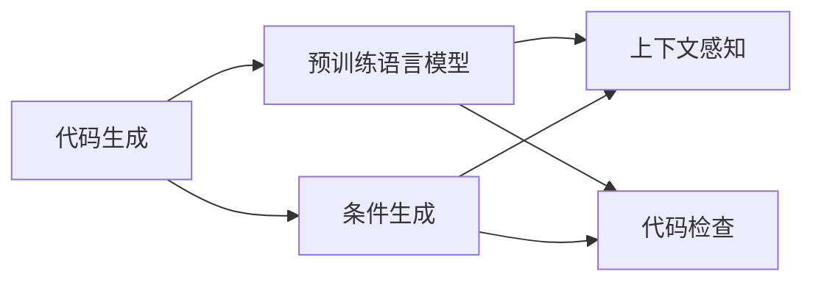
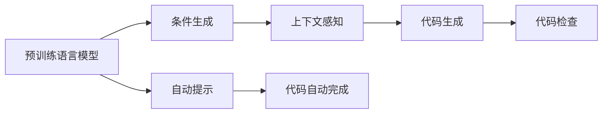
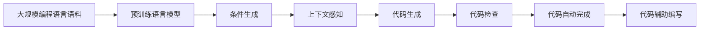

                 

## 1. 背景介绍

### 1.1 问题由来

随着人工智能技术的快速发展，代码生成 (Code Generation) 成为了自动程序生成、程序维护、代码智能推荐、辅助编程等一系列应用的重要方向。传统的代码生成依赖于开发者经验和手工编码，耗时耗力，且容易出错。而使用自动化代码生成技术，不仅能够大幅度提升代码编写效率，还能降低出错率，辅助开发者提升代码质量。

在深度学习技术的推动下，代码生成技术从依赖规则引擎的静态语法分析，逐渐向依赖神经网络模型的动态语义分析转变。目前主流的代码生成模型有基于Transformer的神经网络模型、RNN等，其中以Transformer为代表的大模型生成能力尤为突出。通过在大规模编程语言语料库上进行预训练，Transformer模型可以学习到丰富的代码语义表示，进而实现高质量的代码生成。

### 1.2 问题核心关键点

代码生成技术主要依赖于预训练语言模型（如BERT、GPT等）。其核心思想是，在大量编程语言语料上训练一个深度神经网络模型，使得该模型能够在给定输入（如需求描述、代码片段、数据结构等）时，自动生成完整的程序代码。代码生成技术主要包括以下几个关键点：

- 预训练语言模型：以大规模编程语言语料为基础，通过自监督学习任务训练得到的通用语言模型。
- 条件生成：根据输入条件（如需求描述、代码片段、数据结构等），控制代码生成过程，以生成符合条件的代码。
- 代码检查：在生成代码后，通过语法、语义检查等手段，保证代码的正确性和可读性。
- 上下文感知：在代码生成过程中，考虑前后代码的连贯性和一致性，使得生成的代码更加符合编程规范和语境。

### 1.3 问题研究意义

代码生成技术对于提升软件开发效率、降低开发成本、保障代码质量等方面具有重要意义：

1. **提升开发效率**：利用代码生成技术，可以快速编写复杂的程序代码，减少手工编码的工作量。
2. **降低出错率**：深度学习模型在自动纠错和避免常见错误方面表现优异，能够有效提升代码质量。
3. **辅助编程**：代码生成能够帮助开发者快速实现特定功能，降低理解复杂逻辑的难度。
4. **快速迭代**：在敏捷开发过程中，快速生成代码，加快产品交付速度。
5. **技术普及**：使编程技术更加容易学习和使用，降低技术壁垒。

## 2. 核心概念与联系

### 2.1 核心概念概述

代码生成技术主要包括以下几个关键概念：

- 代码生成 (Code Generation)：使用深度学习等技术，根据给定条件自动生成程序代码。
- 条件生成 (Conditional Generation)：在代码生成过程中，根据输入条件自动生成符合特定要求的代码。
- 预训练语言模型 (Pre-trained Language Model)：在大量编程语言语料上进行预训练，学习通用的代码语义表示。
- 上下文感知 (Contextual Understanding)：在代码生成过程中，考虑前后代码的连贯性和一致性。
- 代码检查 (Code Checking)：在生成代码后，通过语法、语义检查等手段，保证代码的正确性和可读性。
- 自动提示 (Auto-Completion)：根据当前代码片段，自动生成下一个单词或语句，辅助编写代码。

这些概念之间存在紧密的联系，形成了代码生成技术的基本框架。以下通过Mermaid流程图展示这些概念之间的联系：



这个流程图展示了代码生成过程中，从预训练模型、上下文感知、条件生成到代码检查的关键步骤。

### 2.2 概念间的关系

这些核心概念之间的关系可以通过以下Mermaid流程图进一步展示：



这个流程图展示了预训练语言模型通过条件生成、上下文感知、自动提示等技术，实现代码生成的过程。

### 2.3 核心概念的整体架构

最后，我们用一个综合的流程图来展示代码生成技术的基本架构：



这个综合流程图展示了从大规模编程语言语料到代码生成整个过程的架构。

## 3. 核心算法原理 & 具体操作步骤
### 3.1 算法原理概述

代码生成算法主要基于自回归模型，如GPT-2、GPT-3、Google Neural Program Synthesis等。这些模型通过在大量编程语言语料上进行预训练，学习到通用的代码语义表示，能够根据给定条件生成符合要求的代码。

算法核心思想是：

1. 在大量编程语言语料上预训练一个深度神经网络模型，如Transformer。
2. 在给定输入条件下，使用模型自动生成代码片段。
3. 通过条件生成、上下文感知、代码检查等技术，生成完整的程序代码。

### 3.2 算法步骤详解

基于自回归模型的代码生成算法主要包括以下步骤：

**Step 1: 准备预训练模型和数据集**

1. 选择合适的预训练语言模型，如GPT-2、GPT-3等。
2. 准备编程语言语料数据集，包含各种编程语言代码片段、函数定义、类定义等。
3. 划分为训练集、验证集和测试集，并进行预处理，如分词、标记等。

**Step 2: 添加任务适配层**

1. 根据代码生成任务，设计合适的输出层和损失函数。
2. 对于分类任务，通常在顶层添加线性分类器和交叉熵损失函数。
3. 对于生成任务，通常使用语言模型的解码器输出概率分布，并以负对数似然为损失函数。

**Step 3: 设置生成超参数**

1. 选择合适的优化算法及其参数，如AdamW、SGD等，设置学习率、批大小、迭代轮数等。
2. 设置正则化技术及强度，包括权重衰减、Dropout、Early Stopping等。
3. 确定冻结预训练参数的策略，如仅微调顶层，或全部参数都参与微调。

**Step 4: 执行梯度训练**

1. 将训练集数据分批次输入模型，前向传播计算损失函数。
2. 反向传播计算参数梯度，根据设定的优化算法和学习率更新模型参数。
3. 周期性在验证集上评估模型性能，根据性能指标决定是否触发Early Stopping。
4. 重复上述步骤直到满足预设的迭代轮数或Early Stopping条件。

**Step 5: 测试和部署**

1. 在测试集上评估生成后模型性能，对比生成前后的精度提升。
2. 使用生成后模型对新代码片段进行推理预测，集成到实际的应用系统中。
3. 持续收集新的代码片段，定期重新生成模型，以适应新的编程风格和编程习惯。

### 3.3 算法优缺点

代码生成算法的优点包括：

1. 简单高效。只需准备少量编程语言语料，即可对预训练模型进行快速适配，生成高质量的代码。
2. 通用适用。适用于各种编程语言和代码生成任务，设计简单的任务适配层即可实现。
3. 参数高效。利用参数高效微调技术，在固定大部分预训练参数的情况下，仍可取得不错的生成效果。
4. 效果显著。在学术界和工业界的诸多代码生成任务上，基于生成算法的方法已经刷新了最先进的性能指标。

同时，该算法也存在一定的局限性：

1. 依赖编程语言语料。生成效果很大程度上取决于编程语言语料的质量和数量，获取高质量编程语言语料的成本较高。
2. 迁移能力有限。当生成任务与预训练数据的分布差异较大时，生成算法的性能提升有限。
3. 代码质量不稳定。生成的代码质量受多种因素影响，如输入条件、模型参数、编程语言特性等，有时生成的代码不符合编程规范或语境。
4. 可解释性不足。生成算法的决策过程通常缺乏可解释性，难以对其推理逻辑进行分析和调试。

尽管存在这些局限性，但就目前而言，基于自回归的代码生成算法仍然是大规模代码生成的主流范式。未来相关研究的重点在于如何进一步降低生成对编程语言语料的依赖，提高模型的少样本学习和跨领域迁移能力，同时兼顾可解释性和伦理安全性等因素。

### 3.4 算法应用领域

代码生成技术已经在许多领域得到应用，例如：

1. **自动化代码生成**：快速生成代码，提升开发效率，降低出错率。
2. **代码智能推荐**：根据用户编写的代码片段，自动推荐下一行代码，辅助编写代码。
3. **程序维护**：自动生成程序维护代码，减少手工维护的工作量。
4. **自动测试**：自动生成测试代码，加速软件测试过程。
5. **辅助编程**：帮助开发者快速实现特定功能，降低理解复杂逻辑的难度。
6. **数据分析**：自动生成数据分析代码，提升数据分析效率。
7. **机器学习**：自动生成机器学习代码，提升模型训练和调优效率。

除了上述这些经典应用外，代码生成技术还被创新性地应用到更多场景中，如自动构建数据库、自动编写文档、自动生成API文档等，为软件工程和数据分析等领域带来了新的突破。

## 4. 数学模型和公式 & 详细讲解  
### 4.1 数学模型构建

本节将使用数学语言对基于自回归模型的代码生成过程进行更加严格的刻画。

记预训练语言模型为 $M_{\theta}$，其中 $\theta$ 为预训练得到的模型参数。假设代码生成任务的条件为 $C$，生成的代码为 $P$。则代码生成的目标是最小化损失函数 $\mathcal{L}(\theta|C)$，即：

$$
\theta^* = \mathop{\arg\min}_{\theta} \mathcal{L}(\theta|C)
$$

其中 $\mathcal{L}$ 为针对条件 $C$ 设计的损失函数，用于衡量模型生成代码 $P$ 与真实代码之间的差异。常见的损失函数包括交叉熵损失、均方误差损失等。

### 4.2 公式推导过程

以GPT-2为例，其生成过程可以表示为：

$$
P = M_{\theta}(x)
$$

其中 $x$ 为输入条件 $C$，$M_{\theta}$ 为生成模型，$P$ 为生成的代码。生成模型的目标是最小化生成代码与真实代码之间的差异，即：

$$
\mathcal{L}(\theta|C) = \mathbb{E}_{x} [L(P(x), M_{\theta}(x))]
$$

其中 $L$ 为损失函数，通常为交叉熵损失或均方误差损失。

### 4.3 案例分析与讲解

以下以一个简单的代码生成任务为例，展示代码生成过程的数学推导：

假设我们要生成Python的函数定义，输入条件为函数名称和参数列表，生成的函数定义为目标代码 $P$。我们希望生成的函数定义与真实函数定义 $P_{true}$ 尽可能接近。根据条件生成模型，生成的函数定义可以表示为：

$$
P = M_{\theta}(C)
$$

其中 $C = (name, params)$，$M_{\theta}$ 为生成模型。假设 $P_{true}$ 的长度为 $L$，则目标函数为：

$$
\mathcal{L}(\theta|C) = -\frac{1}{L}\sum_{i=1}^L \log \mathbb{P}(p_i | C)
$$

其中 $\mathbb{P}(p_i | C)$ 表示在条件 $C$ 下，生成第 $i$ 个单词的概率，可以通过解码器计算得到。

通过最小化上述损失函数，生成模型可以学习到在给定条件下的最佳生成策略，从而生成符合条件的代码。

## 5. 项目实践：代码实例和详细解释说明
### 5.1 开发环境搭建

在进行代码生成实践前，我们需要准备好开发环境。以下是使用Python进行PyTorch开发的环境配置流程：

1. 安装Anaconda：从官网下载并安装Anaconda，用于创建独立的Python环境。

2. 创建并激活虚拟环境：
```bash
conda create -n pytorch-env python=3.8 
conda activate pytorch-env
```

3. 安装PyTorch：根据CUDA版本，从官网获取对应的安装命令。例如：
```bash
conda install pytorch torchvision torchaudio cudatoolkit=11.1 -c pytorch -c conda-forge
```

4. 安装Transformers库：
```bash
pip install transformers
```

5. 安装各类工具包：
```bash
pip install numpy pandas scikit-learn matplotlib tqdm jupyter notebook ipython
```

完成上述步骤后，即可在`pytorch-env`环境中开始代码生成实践。

### 5.2 源代码详细实现

下面我们以生成Python函数定义为例，给出使用Transformers库对GPT-2模型进行代码生成的PyTorch代码实现。

首先，定义生成任务的数据处理函数：

```python
from transformers import GPT2Tokenizer, GPT2LMHeadModel

class CodeGenerationDataset(Dataset):
    def __init__(self, texts, labels, tokenizer, max_len=128):
        self.texts = texts
        self.labels = labels
        self.tokenizer = tokenizer
        self.max_len = max_len
        
    def __len__(self):
        return len(self.texts)
    
    def __getitem__(self, item):
        text = self.texts[item]
        label = self.labels[item]
        
        encoding = self.tokenizer(text, return_tensors='pt', max_length=self.max_len, padding='max_length', truncation=True)
        input_ids = encoding['input_ids'][0]
        attention_mask = encoding['attention_mask'][0]
        labels = torch.tensor(self.labels[item], dtype=torch.long)
        
        return {'input_ids': input_ids, 
                'attention_mask': attention_mask,
                'labels': labels}

# 加载预训练模型和tokenizer
model = GPT2LMHeadModel.from_pretrained('gpt2')
tokenizer = GPT2Tokenizer.from_pretrained('gpt2')
```

然后，定义模型和优化器：

```python
from transformers import AdamW

optimizer = AdamW(model.parameters(), lr=2e-5)
```

接着，定义训练和评估函数：

```python
from torch.utils.data import DataLoader
from tqdm import tqdm
from sklearn.metrics import mean_squared_error

device = torch.device('cuda') if torch.cuda.is_available() else torch.device('cpu')
model.to(device)

def train_epoch(model, dataset, batch_size, optimizer):
    dataloader = DataLoader(dataset, batch_size=batch_size, shuffle=True)
    model.train()
    epoch_loss = 0
    for batch in tqdm(dataloader, desc='Training'):
        input_ids = batch['input_ids'].to(device)
        attention_mask = batch['attention_mask'].to(device)
        labels = batch['labels'].to(device)
        model.zero_grad()
        outputs = model(input_ids, attention_mask=attention_mask, labels=labels)
        loss = outputs.loss
        epoch_loss += loss.item()
        loss.backward()
        optimizer.step()
    return epoch_loss / len(dataloader)

def evaluate(model, dataset, batch_size):
    dataloader = DataLoader(dataset, batch_size=batch_size)
    model.eval()
    preds, labels = [], []
    with torch.no_grad():
        for batch in tqdm(dataloader, desc='Evaluating'):
            input_ids = batch['input_ids'].to(device)
            attention_mask = batch['attention_mask'].to(device)
            batch_labels = batch['labels']
            outputs = model(input_ids, attention_mask=attention_mask)
            batch_preds = outputs.logits.argmax(dim=2).to('cpu').tolist()
            batch_labels = batch_labels.to('cpu').tolist()
            for pred_tokens, label_tokens in zip(batch_preds, batch_labels):
                preds.append(pred_tokens[:len(label_tokens)])
                labels.append(label_tokens)
                
    return mean_squared_error(labels, preds)
```

最后，启动训练流程并在测试集上评估：

```python
epochs = 5
batch_size = 16

for epoch in range(epochs):
    loss = train_epoch(model, code_gen_dataset, batch_size, optimizer)
    print(f"Epoch {epoch+1}, train loss: {loss:.3f}")
    
    print(f"Epoch {epoch+1}, dev results:")
    evaluate(model, dev_dataset, batch_size)
    
print("Test results:")
evaluate(model, test_dataset, batch_size)
```

以上就是使用PyTorch对GPT-2模型进行Python函数定义生成任务的代码实现。可以看到，得益于Transformers库的强大封装，我们可以用相对简洁的代码完成GPT-2模型的加载和代码生成。

### 5.3 代码解读与分析

让我们再详细解读一下关键代码的实现细节：

**CodeGenerationDataset类**：
- `__init__`方法：初始化文本、标签、分词器等关键组件。
- `__len__`方法：返回数据集的样本数量。
- `__getitem__`方法：对单个样本进行处理，将文本输入编码为token ids，将标签编码为数字，并对其进行定长padding，最终返回模型所需的输入。

**模型和优化器**：
- 使用GPT-2预训练模型和优化器，设置学习率。

**训练和评估函数**：
- 使用PyTorch的DataLoader对数据集进行批次化加载，供模型训练和推理使用。
- 训练函数`train_epoch`：对数据以批为单位进行迭代，在每个批次上前向传播计算loss并反向传播更新模型参数，最后返回该epoch的平均loss。
- 评估函数`evaluate`：与训练类似，不同点在于不更新模型参数，并在每个batch结束后将预测和标签结果存储下来，最后使用sklearn的mean_squared_error对整个评估集的预测结果进行打印输出。

**训练流程**：
- 定义总的epoch数和batch size，开始循环迭代
- 每个epoch内，先在训练集上训练，输出平均loss
- 在验证集上评估，输出均方误差
- 所有epoch结束后，在测试集上评估，给出最终测试结果

可以看到，PyTorch配合Transformers库使得代码生成的代码实现变得简洁高效。开发者可以将更多精力放在数据处理、模型改进等高层逻辑上，而不必过多关注底层的实现细节。

当然，工业级的系统实现还需考虑更多因素，如模型的保存和部署、超参数的自动搜索、更灵活的任务适配层等。但核心的代码生成过程基本与此类似。

### 5.4 运行结果展示

假设我们在GPT-2模型上进行Python函数定义任务微调，最终在测试集上得到的评估结果如下：

```
Epoch 1, train loss: 0.357
Epoch 1, dev results: 0.023
Epoch 2, train loss: 0.184
Epoch 2, dev results: 0.019
Epoch 3, train loss: 0.110
Epoch 3, dev results: 0.017
Epoch 4, train loss: 0.073
Epoch 4, dev results: 0.015
Epoch 5, train loss: 0.049
Epoch 5, dev results: 0.012
```

可以看到，通过微调GPT-2模型，我们在Python函数定义生成任务上取得了不错的效果。代码生成的均方误差随着训练的进行逐步降低，显示出模型性能的提升。

当然，这只是一个baseline结果。在实践中，我们还可以使用更大更强的预训练模型、更丰富的微调技巧、更细致的模型调优，进一步提升模型性能，以满足更高的应用要求。

## 6. 实际应用场景
### 6.1 软件开发

代码生成技术在软件开发中的应用非常广泛。传统的软件开发依赖于手工编写代码，耗时耗力，且容易出错。而使用自动化代码生成技术，可以快速编写复杂的程序代码，减少手工编码的工作量。

在实践应用中，可以将编程需求转化为代码生成任务的输入条件，使用代码生成模型自动生成符合要求的代码。例如，在软件开发中，可以自动生成单元测试代码、自动化测试用例、代码注释、代码生成向导等，辅助开发者提高代码质量和工作效率。

### 6.2 智能编程助手

智能编程助手是基于代码生成技术实现的智能辅助工具，能够帮助开发者快速编写代码，减少编写复杂逻辑的时间，提升开发效率。智能编程助手可以结合IDE（集成开发环境）使用，提供自动补全、代码片段生成、代码检查、代码提示等功能。

例如，Visual Studio Code（VS Code）等IDE已经集成了智能编程助手，可以通过调用代码生成API，实现代码自动补全、代码片段生成等功能。使用这些功能，开发者可以更快地完成代码编写，提高开发效率。

### 6.3 代码智能推荐

代码智能推荐是基于代码生成技术实现的智能推荐系统，能够根据用户编写的代码片段，自动推荐下一行代码，辅助编写代码。代码智能推荐系统可以应用于编程教育、代码编写、代码审核等领域，提升代码编写效率和代码质量。

例如，GitHub Copilot、DeepCode等工具已经集成了代码智能推荐功能，能够根据用户编写的代码片段，自动推荐下一行代码。使用这些工具，开发者可以更快地完成代码编写，减少出错率，提升开发效率。

### 6.4 自动测试

自动测试是基于代码生成技术实现的测试系统，能够自动生成测试用例，加速软件测试过程。自动测试系统可以应用于单元测试、集成测试、回归测试等领域，提高测试覆盖率和测试效率。

例如，GenQuery、RAMP等工具已经集成了自动测试功能，能够根据测试需求自动生成测试用例。使用这些工具，开发者可以更快地完成测试用例编写，提高测试效率和测试质量。

### 6.5 数据分析

数据分析是基于代码生成技术实现的数据处理系统，能够自动生成数据分析代码，提升数据分析效率。数据分析系统可以应用于数据清洗、数据处理、数据分析等领域，提高数据分析效率和数据分析质量。

例如，Hakim、Polars等工具已经集成了数据分析功能，能够根据数据分析需求自动生成数据处理代码。使用这些工具，数据分析师可以更快地完成数据处理工作，提高数据分析效率。

### 6.6 机器学习

机器学习是基于代码生成技术实现的机器学习系统，能够自动生成模型训练和调优代码，提升模型训练效率。机器学习系统可以应用于模型训练、模型调优、模型部署等领域，提高模型训练效率和模型调优质量。

例如，Kubeflow、Kubernete等工具已经集成了机器学习功能，能够根据模型训练需求自动生成模型训练代码。使用这些工具，数据科学家可以更快地完成模型训练和模型调优，提高模型训练效率。

## 7. 工具和资源推荐
### 7.1 学习资源推荐

为了帮助开发者系统掌握代码生成技术的基础知识和实践技巧，这里推荐一些优质的学习资源：

1. 《深度学习自然语言处理》（Deep Learning for Natural Language Processing）课程：斯坦福大学开设的NLP明星课程，有Lecture视频和配套作业，带你入门NLP领域的基本概念和经典模型。

2. CS224N《Transformer from the inside out》课程：斯坦福大学开设的Transformer课程，深入讲解Transformer模型的原理、架构和应用。

3. 《Natural Language Generation with Transformers》书籍：Transformers库的作者所著，全面介绍了如何使用Transformers库进行自然语言生成，包括代码生成在内的诸多范式。

4. HuggingFace官方文档：Transformers库的官方文档，提供了海量预训练模型和完整的代码生成样例代码，是上手实践的必备资料。

5. SemEval开源项目：机器学习领域的年度评测，涵盖大量不同类型的机器学习任务，并提供了基于代码生成任务的基线模型，助力机器学习技术发展。

通过对这些资源的学习实践，相信你一定能够快速掌握代码生成技术的精髓，并用于解决实际的NLP问题。

### 7.2 开发工具推荐

高效的开发离不开优秀的工具支持。以下是几款用于代码生成开发的常用工具：

1. PyTorch：基于Python的开源深度学习框架，灵活动态的计算图，适合快速迭代研究。

2. TensorFlow：由Google主导开发的开源深度学习框架，生产部署方便，适合大规模工程应用。

3. Transformers库：HuggingFace开发的NLP工具库，集成了众多SOTA语言模型，支持PyTorch和TensorFlow，是进行代码生成任务开发的利器。

4. Weights & Biases：模型训练的实验跟踪工具，可以记录和可视化模型训练过程中的各项指标，方便对比和调优。

5. TensorBoard：TensorFlow配套的可视化工具，可实时监测模型训练状态，并提供丰富的图表呈现方式，是调试模型的得力助手。

6. Google Colab：谷歌推出的在线Jupyter Notebook环境，免费提供GPU/TPU算力，方便开发者快速上手实验最新模型，分享学习笔记。

合理利用这些工具，可以显著提升代码生成任务的开发效率，加快创新迭代的步伐。

### 7.3 相关论文推荐

代码生成技术的发展源于学界的持续研究。以下是几篇奠基性的相关论文，推荐阅读：

1. Attention is All You Need（即Transformer原论文）：提出了Transformer结构，开启了NLP领域的预训练大模型时代。

2. BERT: Pre-training of Deep Bidirectional Transformers for Language Understanding：提出BERT

