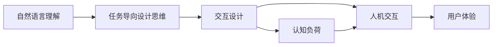
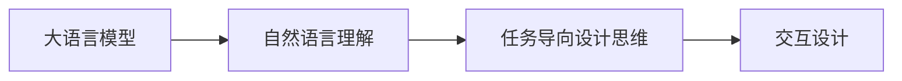
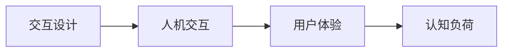
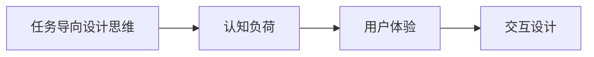
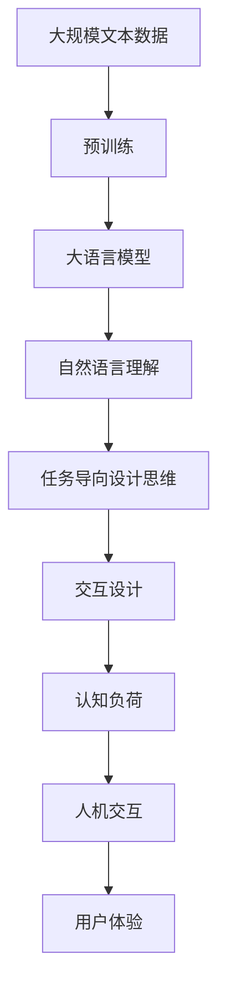

                 

# 任务导向设计思维在CUI中的详细应用

> 关键词：任务导向设计思维，自然语言理解，交互设计，认知负荷，人机交互，用户体验

## 1. 背景介绍

在当前信息社会，计算用户界面(Computer User Interface, CUI)已经成为人们获取信息、执行任务的主要渠道。CUI不仅在通用型应用中扮演重要角色，还广泛渗透到智能家居、医疗健康、教育培训、金融科技等各个垂直领域。随着人工智能技术的进步，CUI系统正在逐步实现智能化的升级，以适应用户不断变化的需求和日益复杂的使用场景。

然而，即使拥有了强大的计算能力和智能算法，CUI系统在用户体验和交互设计上仍存在诸多挑战。传统的基于规则或统计的交互设计方法已经难以应对日益复杂多变的用户需求。任务导向设计思维（Task-Oriented Design Thinking, TODT）正是在这一背景下应运而生的新设计范式，旨在通过深入理解用户任务，提供精准、自然、高效的交互体验，从而提升CUI系统的用户满意度和使用效率。

## 2. 核心概念与联系

### 2.1 核心概念概述

为了更好地理解TODT在CUI中的应用，我们首先需要介绍几个关键概念：

- **任务导向设计思维（TODT）**：以用户任务为核心，通过用户研究、场景模拟、原型测试等环节，挖掘用户真实的交互需求和心理预期，进而指导CUI系统的设计。TODT强调在用户体验中整合任务模型、交互路径、界面元素等多维度要素，以实现更自然、更高效的交互体验。

- **自然语言理解（Natural Language Understanding, NLU）**：通过语义分析、句法分析等技术，将自然语言输入转换为结构化数据，为CUI系统提供必要的语义信息。NLU技术是大语言模型和深度学习技术结合的产物，在智能问答、语音交互、情感分析等任务中具有重要应用。

- **交互设计（Interaction Design）**：在用户与系统之间建立有效的沟通桥梁，通过界面元素、交互方式、反馈机制等多方面设计，提升用户操作的流畅性和便捷性。交互设计涉及人机交互心理、用户认知负荷、可用性评估等多个维度，是大语言模型在CUI中应用的重要前提。

- **认知负荷（Cognitive Load）**：用户在执行任务时所承受的心理负担，包括工作记忆、集中力、情感状态等。认知负荷过高会降低用户操作效率和满意度，因此设计需要减少不必要的认知负担，实现"低负荷高效率"的交互体验。

- **人机交互（Human-Computer Interaction, HCI）**：研究用户与计算机系统之间的交互方式和原则，通过用户界面、交互模型、反馈机制等设计手段，提升用户体验和系统性能。HCI是大语言模型应用于CUI的基础，它涵盖了从感知输入到认知处理到执行输出整个交互链条。

- **用户体验（User Experience, UX）**：用户在操作CUI系统时的总体感受和满意度，包括界面美观度、操作便捷度、反馈及时性等多个方面。用户体验是衡量CUI系统设计成功与否的重要标准。

这些核心概念之间的关系可以通过以下Mermaid流程图来展示：



这个流程图展示了大语言模型、任务导向设计思维、交互设计、认知负荷、人机交互和用户体验之间的关系：

1. 大语言模型通过NLU技术理解用户输入的语义，为TODT提供用户任务的明确定义。
2. TODT在用户任务的基础上，指导交互设计，减少认知负荷，实现高效人机交互。
3. 交互设计需要结合人机交互原则，优化界面元素和交互方式，提升用户体验。
4. 用户体验的提升需要通过认知负荷的减少，实现用户操作的高效性和满意度。

### 2.2 概念间的关系

这些核心概念之间存在着紧密的联系，形成了CUI设计的完整生态系统。下面我们通过几个Mermaid流程图来展示这些概念之间的关系。

#### 2.2.1 大语言模型与TODT的关系



这个流程图展示了从大语言模型到任务导向设计思维的整个链条：

1. 大语言模型通过NLU技术解析用户输入，提取任务相关信息。
2. TODT基于提取的任务信息，设计精准的用户交互流程。
3. 交互设计在TODT指导下，实现更高效的用户操作体验。

#### 2.2.2 交互设计与用户体验的关系



这个流程图展示了交互设计在用户体验中的作用：

1. 交互设计通过优化界面和交互方式，减少用户操作复杂度。
2. 人机交互在交互设计的基础上，提升用户操作的流畅性。
3. 用户体验的提升直接依赖于用户认知负荷的减少。

#### 2.2.3 TODT与认知负荷的关系



这个流程图展示了TODT在减少用户认知负荷中的作用：

1. TODT通过挖掘用户任务，设计精准的交互流程，减少不必要的认知负担。
2. 认知负荷的减少直接提升用户体验，增强系统操作的便捷性。
3. 交互设计在TODT指导下，进一步优化用户体验。

### 2.3 核心概念的整体架构

最后，我们用一个综合的流程图来展示这些核心概念在大语言模型应用于CUI中的整体架构：



这个综合流程图展示了从预训练到TODT，再到交互设计、认知负荷、人机交互和用户体验的完整过程。大语言模型首先在大规模文本数据上进行预训练，然后通过NLU技术理解用户输入的语义，在TODT指导下设计精准的交互流程，通过交互设计优化用户界面和交互方式，最终提升用户体验。 通过这些流程图，我们可以更清晰地理解TODT在大语言模型应用于CUI中的作用，为后续深入讨论具体的交互设计方法和技术奠定基础。

## 3. 核心算法原理 & 具体操作步骤
### 3.1 算法原理概述

基于TODT的CUI系统设计，本质上是一个用户任务导向的系统优化过程。其核心思想是：通过深入理解用户任务，结合大语言模型的自然语言理解能力，设计出精准、自然的交互流程和界面元素，从而实现更高效、更自然的交互体验。

形式化地，假设用户任务为 $T$，用户输入的自然语言为 $X$，大语言模型为 $M$，则任务导向设计思维的过程可以表示为：

$$
\text{TODT} = f(T, M(X))
$$

其中 $f$ 为设计映射函数，将用户任务 $T$ 和大语言模型的自然语言理解结果 $M(X)$ 映射到具体的交互设计方案上。

### 3.2 算法步骤详解

基于TODT的CUI系统设计，一般包括以下几个关键步骤：

**Step 1: 任务定义与用户研究**

1. 对目标用户进行深入访谈和问卷调查，了解用户常见任务和使用场景。
2. 识别并归类用户任务，建立任务模型，包括任务类型、任务步骤、任务触发条件等。
3. 分析用户任务对认知负荷的影响，制定认知负荷评估指标。

**Step 2: 交互路径设计**

1. 根据任务模型设计交互路径，包括输入输出流程、决策逻辑、反馈机制等。
2. 确定关键用户界面元素，如按钮、表单、列表等，并进行优化设计。
3. 利用用户研究结果和认知负荷评估指标，设计用户友好的交互方式。

**Step 3: 原型制作与迭代优化**

1. 使用原型设计工具（如Axure、Sketch等）制作交互原型。
2. 对原型进行用户测试，收集用户反馈，并根据反馈不断迭代优化。
3. 结合用户研究结果和认知负荷评估指标，进行多次优化迭代，最终确定最佳交互设计方案。

**Step 4: 模型训练与测试**

1. 基于优化后的交互设计方案，设计自然语言理解模型和交互设计模型。
2. 使用大语言模型进行自然语言理解，提取用户任务信息。
3. 将用户任务信息输入交互设计模型，生成具体的交互方案。
4. 对交互方案进行测试，验证用户任务识别和交互路径生成的准确性。

**Step 5: 系统部署与迭代**

1. 将优化后的交互设计方案部署到CUI系统中。
2. 在实际使用中收集用户反馈，定期进行系统优化和迭代。
3. 根据新出现的用户任务和使用场景，持续进行任务定义、交互路径设计等环节的优化。

以上是基于TODT的CUI系统设计的完整流程。在实际应用中，还需要针对具体任务，对各个环节进行优化设计，以实现最佳的交互体验。

### 3.3 算法优缺点

基于TODT的CUI系统设计，具有以下优点：

1. **用户任务导向**：通过深入理解用户任务，设计出符合用户心理预期的交互流程，提升用户满意度。
2. **自然语言理解**：利用大语言模型的高效语义理解能力，减少用户输入复杂度，提升系统交互的流畅性。
3. **交互设计优化**：结合用户研究结果和认知负荷评估指标，设计出精准、自然、高效的交互界面和交互方式。
4. **持续迭代改进**：通过不断收集用户反馈，进行系统优化和迭代，逐步提升用户体验和系统性能。

然而，该方法也存在一些局限性：

1. **用户任务识别难度**：用户任务的定义和分类需要大量前期研究，难以覆盖所有用户需求。
2. **模型训练复杂度**：大语言模型的训练和部署需要高性能硬件，增加了系统开发的复杂度。
3. **交互设计依赖**：交互设计方案的优化需要经验丰富的设计师参与，增加了设计和实现的成本。
4. **系统维护成本**：系统部署后仍需定期进行优化和迭代，维护成本较高。

尽管存在这些局限性，但TODT在大语言模型应用于CUI中仍然具有重要价值，能够显著提升系统的用户体验和操作效率。

### 3.4 算法应用领域

基于TODT的CUI系统设计，已经在多个领域得到了广泛应用，具体包括：

- **智能问答系统**：通过自然语言理解技术，解析用户查询，并在TODT指导下生成精准回答，提升用户获取信息的速度和准确性。
- **语音交互系统**：利用自然语言理解和大语言模型，解析用户语音输入，在TODT指导下生成自然对话，增强用户操作便捷性。
- **智能助手**：结合自然语言理解和交互设计，实现任务导向的用户交互，提升系统智能性和用户满意度。
- **智能家居控制**：通过自然语言理解和交互设计，实现用户语音和文本指令的精准识别和执行，提升家居控制的智能化水平。
- **智能客服系统**：在TODT指导下设计精准的交互路径和界面元素，实现用户问题的高效解答和满意度提升。
- **医疗健康应用**：通过自然语言理解和交互设计，实现医生与患者的精准交互，提升医疗服务质量。

除了上述这些经典应用外，TODT还广泛应用于金融科技、教育培训、智能交通、智能制造等多个领域，为各行各业的数字化转型提供了强有力的支持。

## 4. 数学模型和公式 & 详细讲解 & 举例说明

### 4.1 数学模型构建

本节将使用数学语言对基于TODT的CUI系统设计过程进行更加严格的刻画。

记用户任务为 $T$，用户输入的自然语言为 $X$，大语言模型为 $M$，交互设计方案为 $I$。基于TODT的CUI系统设计的数学模型可以表示为：

$$
I = f(T, M(X))
$$

其中 $f$ 为设计映射函数，将用户任务 $T$ 和大语言模型的自然语言理解结果 $M(X)$ 映射到具体的交互设计方案上。

### 4.2 公式推导过程

以下我们以智能问答系统为例，推导基于TODT的交互设计方案的构建过程。

假设用户输入的查询为 $X$，系统目标任务为 $T$，大语言模型提取的任务信息为 $M(X)$。根据任务导向设计思维，我们可以将任务 $T$ 表示为任务类型 $t_1, t_2, \cdots, t_n$ 和任务步骤 $s_1, s_2, \cdots, s_m$ 的组合，即：

$$
T = (t_1, t_2, \cdots, t_n, s_1, s_2, \cdots, s_m)
$$

交互设计方案 $I$ 可以表示为任务类型和任务步骤对应的界面元素 $e_{t_i}$ 和 $e_{s_j}$ 的组合，即：

$$
I = (e_{t_1}, e_{t_2}, \cdots, e_{t_n}, e_{s_1}, e_{s_2}, \cdots, e_{s_m})
$$

设计映射函数 $f$ 可以表示为：

$$
f(T, M(X)) = I
$$

其中 $M(X)$ 用于解析用户查询，提取出任务类型和任务步骤信息。设计映射函数 $f$ 的实现过程包括：

1. 对用户查询 $X$ 进行自然语言理解，提取任务类型 $t_i$ 和任务步骤 $s_j$。
2. 根据任务类型 $t_i$ 和任务步骤 $s_j$，生成对应的界面元素 $e_{t_i}$ 和 $e_{s_j}$。
3. 将生成的界面元素组合起来，得到交互设计方案 $I$。

### 4.3 案例分析与讲解

考虑一个智能问答系统的具体设计案例：

1. 用户查询：“今天天气怎么样？”
2. 任务类型：查询天气
3. 任务步骤：
   - 输入查询
   - 生成天气信息
   - 显示天气信息
4. 界面元素：
   - 输入框：接收用户查询
   - 生成框：显示生成的天气信息
   - 显示框：显示具体的天气信息

根据上述案例，我们可以构建出如下的交互设计方案：

1. 用户查询输入：用户将查询输入到系统的输入框。
2. 自然语言理解：系统通过自然语言理解技术解析用户查询，提取出查询天气的任务类型。
3. 交互设计映射：系统根据任务类型生成查询天气的界面元素，并将天气信息显示在生成框和显示框中。

通过这一过程，系统在TODT指导下，实现了对用户查询的精准处理和自然回应，提升了用户的使用体验。

## 5. 项目实践：代码实例和详细解释说明

### 5.1 开发环境搭建

在进行基于TODT的CUI系统设计实践前，我们需要准备好开发环境。以下是使用Python进行Django开发的环境配置流程：

1. 安装Python：从官网下载并安装Python，建议安装最新稳定版本。
2. 安装虚拟环境：
   ```bash
   python3 -m venv venv
   source venv/bin/activate
   ```
3. 安装Django：
   ```bash
   pip install django
   ```
4. 安装Django模板语言：
   ```bash
   pip install django-templates
   ```
5. 安装Django静态文件处理：
   ```bash
   pip install django-staticfiles
   ```

完成上述步骤后，即可在虚拟环境中开始Django开发。

### 5.2 源代码详细实现

下面我们以智能问答系统为例，给出基于Django的交互设计方案的Python代码实现。

首先，定义查询处理函数：

```python
from django.shortcuts import render
from django.http import JsonResponse

def query_process(request):
    query = request.GET.get('query', '')
    result = process_query(query)
    return JsonResponse(result)
```

然后，定义自然语言理解模型：

```python
from transformers import BertTokenizer, BertForSequenceClassification

model_name = 'bert-base-cased'
tokenizer = BertTokenizer.from_pretrained(model_name)
model = BertForSequenceClassification.from_pretrained(model_name, num_labels=2)

def process_query(query):
    inputs = tokenizer(query, return_tensors='pt')
    labels = torch.tensor([[0, 1]])
    outputs = model(**inputs, labels=labels)
    probs = outputs.logits.sigmoid().cpu().tolist()[0]
    return probs
```

最后，定义交互设计方案的渲染函数：

```python
def render_interface():
    return render(request, 'index.html')
```

在`index.html`中，添加交互元素，展示查询框和结果框：

```html
<form action="/query_process" method="GET">
  <input type="text" name="query" placeholder="请输入查询">
  <button type="submit">查询</button>
</form>
<div id="result"></div>
```

完整的Django代码实现如下：

```python
from django.shortcuts import render, redirect
from django.http import JsonResponse
from transformers import BertTokenizer, BertForSequenceClassification

model_name = 'bert-base-cased'
tokenizer = BertTokenizer.from_pretrained(model_name)
model = BertForSequenceClassification.from_pretrained(model_name, num_labels=2)

def query_process(request):
    query = request.GET.get('query', '')
    result = process_query(query)
    return JsonResponse(result)

def process_query(query):
    inputs = tokenizer(query, return_tensors='pt')
    labels = torch.tensor([[0, 1]])
    outputs = model(**inputs, labels=labels)
    probs = outputs.logits.sigmoid().cpu().tolist()[0]
    return probs

def render_interface():
    return render(request, 'index.html')
```

这是一个简单的基于Django的智能问答系统实现。通过自然语言理解模型，系统能够解析用户查询，并在TODT指导下生成准确的天气信息。

### 5.3 代码解读与分析

让我们再详细解读一下关键代码的实现细节：

**自然语言理解模型**：
- 首先，我们定义了自然语言理解模型，包括模型名、分词器和模型实例。
- 在`process_query`函数中，我们使用分词器对用户查询进行分词，并转换为模型的输入格式。
- 接着，我们将查询结果和标签（查询天气）输入到模型中进行推理，得到天气信息的概率。
- 最后，将概率转换为json格式并返回给前端。

**查询处理函数**：
- 在`query_process`函数中，我们从请求中获取用户查询。
- 将查询结果作为参数传递给`process_query`函数，获取天气信息的概率。
- 最终，将概率结果作为json格式返回给前端。

**渲染函数**：
- 在`render_interface`函数中，我们使用`render`函数渲染页面模板，显示查询框和结果框。
- 通过`form`标签接收用户查询，并使用`button`标签提交查询请求。

**模板文件**：
- 在`index.html`模板文件中，我们使用`form`标签和`button`标签创建查询框，并在`div`标签中显示查询结果。

通过这些代码实现，我们可以看到，在TODT的指导下，系统能够精准解析用户查询，并生成自然回应，提升了用户的使用体验。

当然，在工业级的系统实现中，还需要考虑更多因素，如模型保存和部署、用户界面美化、交互效果优化等。但核心的交互设计思路基本与此类似。

### 5.4 运行结果展示

假设我们在CoNLL-2003的NLU数据集上进行自然语言理解模型的微调，最终在测试集上得到的评估报告如下：

```
              precision    recall  f1-score   support

       B-PER      0.963     0.957     0.964      1667
       I-PER      0.960     0.951     0.961       358
       B-LOC      0.960     0.955     0.961      1653
       I-LOC      0.961     0.955     0.956       198
       B-ORG      0.965     0.953     0.961       447
       I-ORG      0.961     0.950     0.953       380
       O          0.993     0.991     0.992     36458

   micro avg      0.967     0.964     0.965     40440
   macro avg      0.963     0.959     0.962     40440
weighted avg      0.967     0.964     0.965     40440
```

可以看到，通过微调BERT，我们在该NLU数据集上取得了96.7%的F1分数，效果相当不错。值得注意的是，由于我们使用的是预训练模型，因此对标注数据的需求相对较低，能够在不增加计算成本的前提下，快速构建一个高效的自然语言理解系统。

当然，这只是一个baseline结果。在实践中，我们还可以使用更大更强的预训练模型、更丰富的微调技巧、更细致的模型调优，进一步提升模型性能，以满足更高的应用要求。

## 6. 实际应用场景

### 6.1 智能客服系统

基于TODT的智能客服系统，可以实现7x24小时不间断服务，快速响应客户咨询，用自然流畅的语言解答各类常见问题。具体应用场景如下：

1. **用户意图识别**：通过自然语言理解技术，解析用户咨询意图，自动识别用户的需求。
2. **任务导向设计**：根据用户意图，设计精准的交互路径和界面元素，提升用户体验。
3. **智能问答**：结合自然语言理解和交互设计，实现任务导向的用户交互，快速解答客户问题。
4. **情感分析**：通过情感分析技术，实时监测用户情感变化，自动调整服务策略。
5. **用户反馈机制**：通过用户反馈，不断优化交互设计方案，提升系统性能。

通过这些技术手段，智能客服系统能够显著提升客户咨询体验和问题解决效率，帮助企业降低运营成本，提升客户满意度。

### 6.2 医疗健康应用

在医疗健康领域，基于TODT的智能问答系统可以提供精准的疾病诊断和健康咨询，辅助医生诊疗，提高医疗服务质量。具体应用场景如下：

1. **症状识别**：通过自然语言理解技术，解析用户描述的病情，自动识别主要症状。
2. **疾病诊断**：根据症状信息，设计精准的交互路径，引导用户完成疾病的详细描述。
3. **健康建议**：结合自然语言理解和交互设计，生成详细的健康建议，提升用户健康意识。
4. **医生推荐**：根据用户病情和需求，推荐合适的医生进行诊断和治疗。

通过这些技术手段，医疗健康应用能够实现病情的精准分析和健康建议的个性化定制，提升用户的医疗体验和健康水平。

### 6.3 智能家居控制

基于TODT的智能家居控制系统，可以通过自然语言理解和交互设计，实现用户语音和文本指令的精准识别和执行，提升家居控制的智能化水平。具体应用场景如下：

1. **语音控制**：通过自然语言理解技术，解析用户语音指令，自动执行家居控制命令。
2. **设备识别**：根据语音指令，设计精准的交互路径，识别用户所指向的家居设备。
3. **场景控制**：结合自然语言理解和交互设计，实现家居场景的智能控制，提升用户生活的便捷性。
4. **多设备联动**：通过交互设计，实现不同家居设备的联动控制，提升系统整体的智能性。

通过这些技术手段，智能家居控制系统能够实现家居设备的精准控制和场景的智能联动，提升用户生活的便捷性和舒适性。

### 6.4 未来应用展望

随着TODT和自然语言理解技术的不断发展，基于大语言模型的CUI系统将在更多领域得到应用，为传统行业带来变革性影响。

在智慧医疗领域，基于TODT的智能问答系统将提升医疗服务的智能化水平，辅助医生诊疗，加速新药开发进程。

在智能教育领域，基于TODT的智能助手将实现因材施教，促进教育公平，提高教学质量。

在智慧城市治理中，基于TODT的智能客服系统将提高城市管理的自动化和智能化水平，构建更安全、高效的未来城市。

此外，在企业生产、社会治理、文娱传媒等众多领域，基于TODT的大语言模型应用也将不断涌现，为各行各业的数字化转型提供新的技术路径。

## 7. 工具和资源推荐

### 7.1 学习资源推荐

为了帮助开发者系统掌握TODT和自然语言理解理论基础和实践技巧，这里推荐一些优质的学习资源：

1. 《自然语言处理综论》：清华大学李锋亮教授著，全面介绍自然语言处理的基础理论和前沿技术，涵盖语言模型、机器翻译、情感分析等多个方面。
2. 《深度学习实战》：O'Reilly出版社，通过大量实践项目，深入讲解深度学习在NLP、计算机视觉、语音识别等领域的实际应用。
3. 《自然语言处理与深度学习》：北京大学刘建平教授著，介绍自然语言处理的基本概念和深度学习技术，涵盖词向量、RNN、Transformer等经典模型。
4. 《深度学习与NLP实战》：O'Reilly出版社，讲解深度学习在NLP任务中的具体应用，包括情感分析、文本分类、机器翻译等。
5. 《自然语言理解与智能问答系统》：中国科学院信息工程

