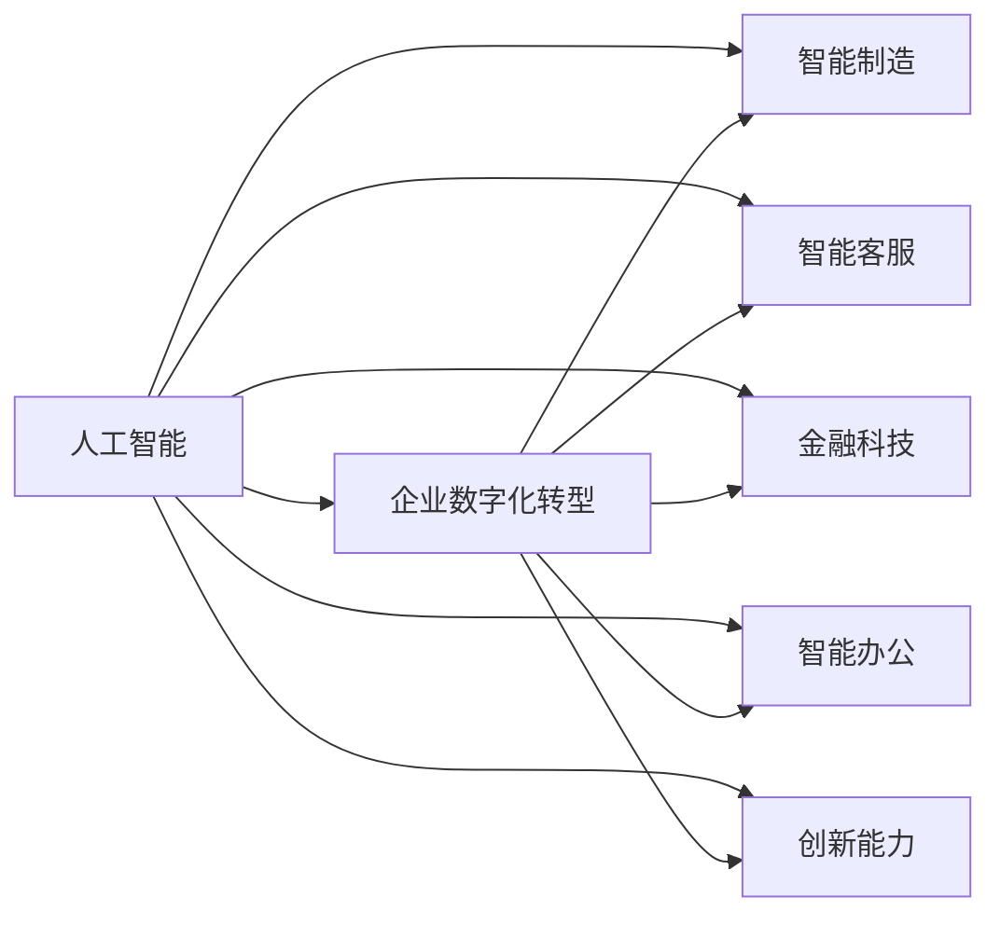
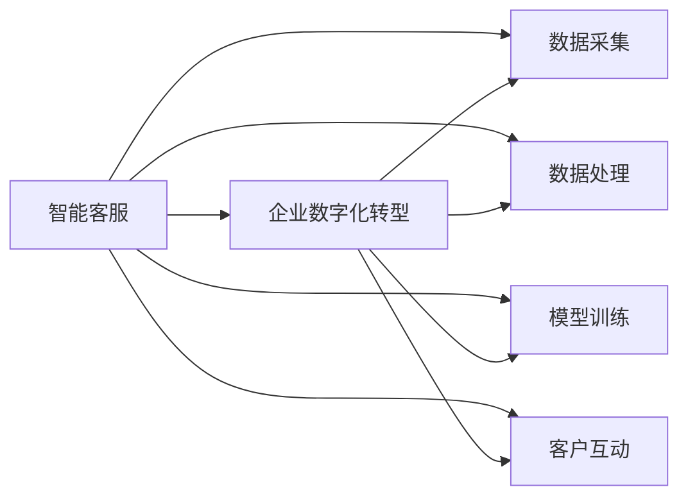
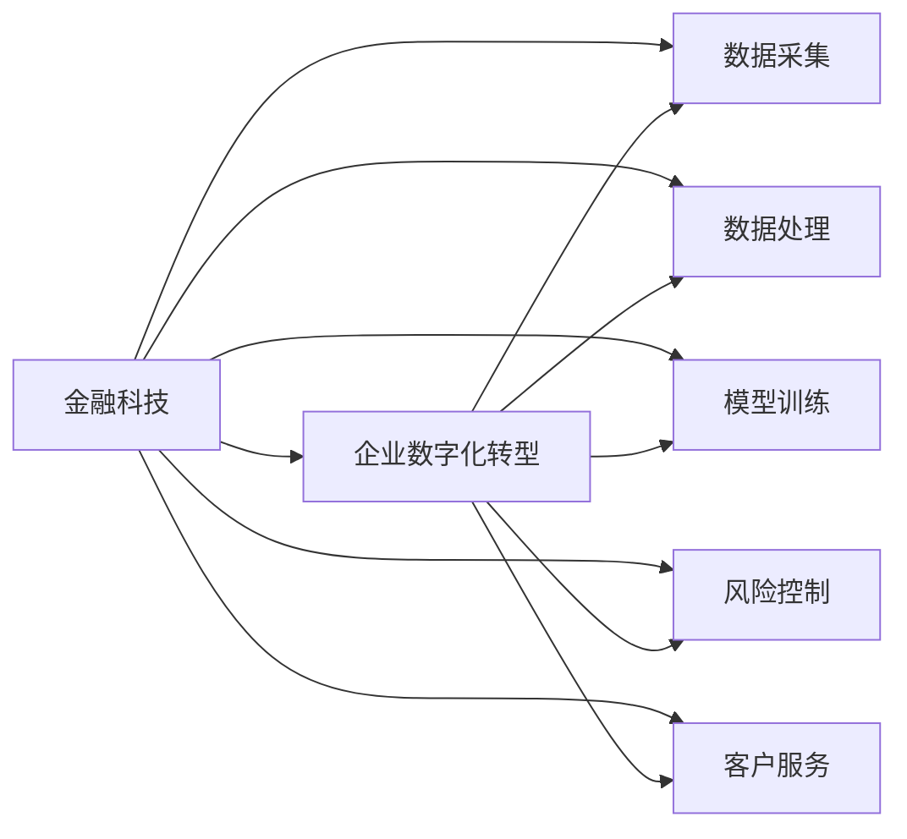
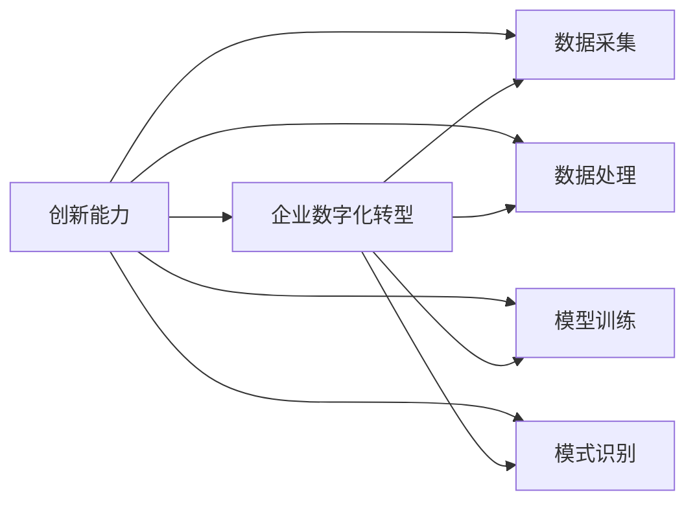
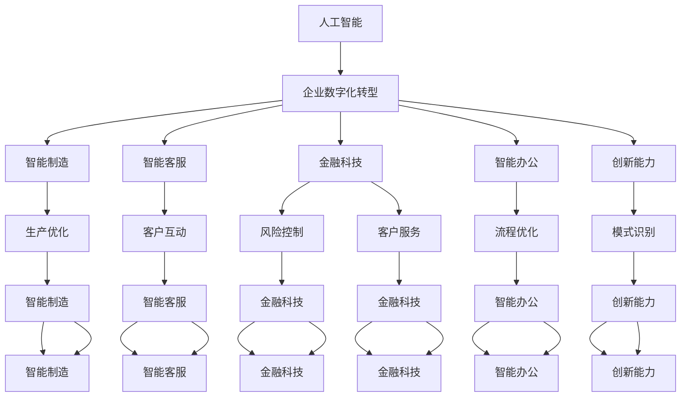

                 

# 企业数字化转型中的AI应用

> 关键词：企业数字化转型,人工智能,AI应用,数据驱动,智能制造,智能客服,金融科技,智能办公,创新能力

## 1. 背景介绍

### 1.1 问题由来

随着全球进入数字化时代，企业数字化转型成为了行业共识。AI技术的迅速发展，为企业的数字化转型提供了强大的技术支撑。AI不仅能够提升企业运营效率，还能够在产品创新、市场拓展、客户服务等多个方面助力企业实现全面数字化。通过AI技术，企业能够更好地应对市场变化，提升竞争力，保持持续发展动力。

然而，AI在企业中的应用并非一帆风顺。一方面，企业面临着AI技术引入的初期成本投入和技术选型问题；另一方面，AI应用需要基于大量数据，如何高效获取和利用数据也是企业数字化转型的重要课题。此外，AI技术在企业中的落地实施也需要考虑数据安全、系统兼容、人才队伍等实际问题。本文将从企业数字化转型的背景出发，深入探讨AI技术在不同场景中的应用实践。

### 1.2 问题核心关键点

企业数字化转型的核心在于利用AI技术提升企业的数据处理和决策能力，实现业务的智能化和自动化。具体来说，AI在企业中的应用包括：

- 智能制造：通过AI对生产流程进行优化，实现生产自动化和智能化。
- 智能客服：利用AI技术提高客户服务质量和效率。
- 金融科技：在金融行业应用AI技术，提升风险控制和客户服务水平。
- 智能办公：使用AI技术优化企业内部流程，提升工作效率。
- 创新能力：借助AI技术进行数据分析和模式识别，助力企业创新。

## 2. 核心概念与联系

### 2.1 核心概念概述

为了更好地理解AI在企业数字化转型中的作用，本节将介绍几个密切相关的核心概念：

- 人工智能(AI)：一种通过计算机模拟人类智能行为的技术，包括感知、学习、推理、规划等能力。AI技术可以通过学习大量数据，自动实现复杂任务的自动化。
- 企业数字化转型：将传统企业业务数字化，通过数据驱动和智能化手段，提升企业运营效率和竞争力。
- 智能制造：通过AI技术优化生产流程，实现生产自动化和智能化。
- 智能客服：利用AI技术提升客户服务质量和效率。
- 金融科技：在金融行业应用AI技术，提升风险控制和客户服务水平。
- 智能办公：使用AI技术优化企业内部流程，提升工作效率。
- 创新能力：借助AI技术进行数据分析和模式识别，助力企业创新。

这些核心概念之间的逻辑关系可以通过以下Mermaid流程图来展示：



这个流程图展示了AI技术在企业数字化转型中的作用和应用场景。AI技术通过提升企业的智能化水平，在各个业务环节实现自动化和优化，从而推动企业的数字化转型。

### 2.2 概念间的关系

这些核心概念之间存在着紧密的联系，形成了企业数字化转型的完整生态系统。下面我们通过几个Mermaid流程图来展示这些概念之间的关系。

#### 2.2.1 智能制造与AI的关系


这个流程图展示了智能制造的基本流程和AI技术的应用点。智能制造通过AI技术进行数据采集、处理、模型训练，进而优化生产流程，实现自动化和智能化。

#### 2.2.2 智能客服与AI的关系



这个流程图展示了智能客服的基本流程和AI技术的应用点。智能客服通过AI技术进行数据采集、处理、模型训练，进而实现客户互动的自动化和智能化。

#### 2.2.3 金融科技与AI的关系



这个流程图展示了金融科技的基本流程和AI技术的应用点。金融科技通过AI技术进行数据采集、处理、模型训练，进而提升风险控制和客户服务水平。

#### 2.2.4 智能办公与AI的关系


这个流程图展示了智能办公的基本流程和AI技术的应用点。智能办公通过AI技术进行数据采集、处理、模型训练，进而优化内部流程，提升工作效率。

#### 2.2.5 创新能力与AI的关系



这个流程图展示了创新能力的基本流程和AI技术的应用点。创新能力通过AI技术进行数据采集、处理、模型训练，进而进行数据分析和模式识别，助力企业创新。

### 2.3 核心概念的整体架构

最后，我们用一个综合的流程图来展示这些核心概念在大企业数字化转型过程中的整体架构：



这个综合流程图展示了从人工智能到企业数字化转型的完整过程，每个环节都有AI技术的参与和推动。通过AI技术的深度应用，企业能够在各个业务领域实现全面数字化转型，提升运营效率和创新能力。

## 3. 核心算法原理 & 具体操作步骤
### 3.1 算法原理概述

企业数字化转型的核心在于利用AI技术提升数据处理和决策能力，实现业务的智能化和自动化。AI技术的应用通常基于以下原理：

- **数据采集与清洗**：通过传感器、互联网、数据库等多种方式，获取企业运营中的各类数据，并进行初步清洗和预处理。
- **特征提取与工程**：将原始数据转化为特征向量，通过降维、归一化等技术进行数据工程，提升数据质量。
- **模型训练与优化**：选择适合的AI模型，利用企业数据进行训练，并通过调参和优化提升模型性能。
- **模型应用与部署**：将训练好的模型部署到生产环境中，进行实时推理和决策。

### 3.2 算法步骤详解

基于上述原理，企业数字化转型中的AI应用可以分为以下几个关键步骤：

1. **数据收集与管理**：建立统一的数据采集和管理系统，确保数据的及时性、准确性和完整性。
2. **数据预处理**：对收集的数据进行清洗、转换和归一化，提升数据质量。
3. **模型选择与训练**：根据业务需求选择适合的AI模型，并进行训练和调参。
4. **模型评估与部署**：对训练好的模型进行评估，确认其性能和可靠性，部署到生产环境中进行应用。
5. **持续优化与迭代**：定期对模型进行评估和优化，根据业务需求进行迭代和改进。

### 3.3 算法优缺点

AI在企业数字化转型中的应用具有以下优点：

- **提升效率**：通过自动化和智能化手段，显著提升企业运营效率。
- **降低成本**：减少人工成本，提高资源利用率。
- **增强决策能力**：通过数据分析和模式识别，提升决策的科学性和准确性。
- **助力创新**：利用AI技术进行数据分析和模式识别，助力企业创新。

同时，AI应用也存在一些缺点：

- **初期投入高**：引入AI技术需要较高的初期成本投入，包括硬件设备和软件系统的开发。
- **技术门槛高**：AI技术应用需要专业的技术和人才，技术门槛较高。
- **数据隐私风险**：AI应用需要大量数据，数据隐私和安全问题不容忽视。
- **模型依赖性强**：AI模型依赖于数据质量和数量，模型设计不当可能导致效果不理想。

### 3.4 算法应用领域

AI在企业数字化转型中的应用领域非常广泛，包括但不限于以下几个方面：

- **智能制造**：通过AI技术优化生产流程，实现生产自动化和智能化。
- **智能客服**：利用AI技术提升客户服务质量和效率。
- **金融科技**：在金融行业应用AI技术，提升风险控制和客户服务水平。
- **智能办公**：使用AI技术优化企业内部流程，提升工作效率。
- **创新能力**：借助AI技术进行数据分析和模式识别，助力企业创新。

## 4. 数学模型和公式 & 详细讲解  
### 4.1 数学模型构建

AI在企业中的应用通常涉及多种数学模型和算法，以下介绍一些核心模型和算法的构建方法。

#### 4.1.1 线性回归模型

线性回归模型是一种用于预测连续变量的基本模型。在企业数字化转型中，可以通过线性回归模型对生产流程、销售趋势等进行预测和分析。假设训练数据为 $(x_1,x_2,...,x_n)$，对应的目标变量为 $y$，线性回归模型的数学表达式为：

$$
y = w_1x_1 + w_2x_2 + ... + w_nx_n + b
$$

其中 $w_i$ 为模型系数，$b$ 为截距。通过最小二乘法等优化算法，可以求解模型系数，从而预测目标变量 $y$。

#### 4.1.2 决策树模型

决策树模型是一种用于分类和回归的经典模型。在企业中，可以通过决策树模型进行客户分类、市场细分等任务。假设训练数据为 $(x_1,x_2,...,x_n)$，对应的目标变量为 $y$，决策树模型的数学表达式为：

$$
y = \begin{cases}
    y_1 & \text{if } x_1 > t_1 \\
    y_2 & \text{if } x_1 \leq t_1
\end{cases}
$$

其中 $t_1$ 为决策树的分裂点。通过信息增益、基尼指数等评估指标，可以选择最优的分裂点和决策路径，构建决策树模型。

#### 4.1.3 深度学习模型

深度学习模型是一种通过多层神经网络进行学习和预测的高级模型。在企业中，可以通过深度学习模型进行图像识别、自然语言处理等任务。假设训练数据为 $(x_1,x_2,...,x_n)$，对应的目标变量为 $y$，深度学习模型的数学表达式为：

$$
y = \sigma(z)
$$

其中 $\sigma$ 为激活函数，$z$ 为输入层的加权和。通过反向传播算法，可以求解模型参数，从而预测目标变量 $y$。

### 4.2 公式推导过程

以下是几种核心模型的公式推导过程，以帮助读者更好地理解其工作原理。

#### 4.2.1 线性回归模型的推导

假设训练数据为 $(x_1,x_2,...,x_n)$，对应的目标变量为 $y$，线性回归模型的损失函数为均方误差损失，数学表达式为：

$$
L = \frac{1}{2n} \sum_{i=1}^n (y_i - (w_1x_1 + w_2x_2 + ... + w_nx_n + b))^2
$$

通过求解该损失函数的最小值，可以求解模型系数 $w_i$ 和截距 $b$。具体推导过程如下：

$$
\frac{\partial L}{\partial w_j} = -\frac{1}{n} \sum_{i=1}^n (y_i - \hat{y}_i)x_{ij} = 0 \\
\frac{\partial L}{\partial b} = -\frac{1}{n} \sum_{i=1}^n (y_i - \hat{y}_i) = 0
$$

其中 $\hat{y}_i = w_1x_{1i} + w_2x_{2i} + ... + w_nx_{ni} + b$。

解上述方程组，可以得到模型系数和截距：

$$
w_j = \frac{\sum_{i=1}^n x_{ij}(y_i - \bar{y})}{\sum_{i=1}^n x_{ij}^2} \\
b = \bar{y} - \sum_{j=1}^n w_j \bar{x}_j
$$

其中 $\bar{x}_j = \frac{1}{n} \sum_{i=1}^n x_{ij}$，$\bar{y} = \frac{1}{n} \sum_{i=1}^n y_i$。

#### 4.2.2 决策树模型的推导

假设训练数据为 $(x_1,x_2,...,x_n)$，对应的目标变量为 $y$，决策树模型的损失函数为基尼指数，数学表达式为：

$$
L = \frac{1}{n} \sum_{i=1}^n l(y_i, \hat{y}_i)
$$

其中 $l$ 为基尼指数损失函数。通过求解该损失函数的最小值，可以构建最优决策树。具体推导过程如下：

$$
\begin{aligned}
&\frac{\partial L}{\partial t} = \frac{1}{n} \sum_{i=1}^n (y_i - \hat{y}_i) \\
&\frac{\partial \hat{y}_i}{\partial t} = 1 - \hat{y}_i \\
&l(y_i, \hat{y}_i) = y_i \log(1-\hat{y}_i) + (1-y_i) \log(\hat{y}_i) \\
&l(y_i, \hat{y}_i) = -y_i \log(1-\hat{y}_i) - (1-y_i) \log(\hat{y}_i) \\
&l(y_i, \hat{y}_i) = -y_i \log(\hat{y}_i) - (1-y_i) \log(1-\hat{y}_i)
\end{aligned}
$$

通过求解上述损失函数的最小值，可以得到最优的决策路径和分裂点 $t$。

#### 4.2.3 深度学习模型的推导

假设训练数据为 $(x_1,x_2,...,x_n)$，对应的目标变量为 $y$，深度学习模型的损失函数为交叉熵损失，数学表达式为：

$$
L = -\frac{1}{n} \sum_{i=1}^n y_i \log(\hat{y}_i) + (1-y_i) \log(1-\hat{y}_i)
$$

其中 $\hat{y}_i$ 为模型预测的概率。通过求解该损失函数的最小值，可以求解模型参数。具体推导过程如下：

$$
\frac{\partial L}{\partial w_j} = -\frac{1}{n} \sum_{i=1}^n \hat{y}_i(1-\hat{y}_i)x_{ij} = 0 \\
\frac{\partial L}{\partial b} = -\frac{1}{n} \sum_{i=1}^n \hat{y}_i(1-\hat{y}_i) = 0
$$

其中 $\hat{y}_i = \sigma(z)$，$z = w_1x_{1i} + w_2x_{2i} + ... + w_nx_{ni} + b$。

解上述方程组，可以得到模型参数：

$$
w_j = \frac{1}{n} \sum_{i=1}^n x_{ij}(y_i - \bar{y}) \\
b = \bar{y} - \sum_{j=1}^n w_j \bar{x}_j
$$

其中 $\bar{x}_j = \frac{1}{n} \sum_{i=1}^n x_{ij}$，$\bar{y} = \frac{1}{n} \sum_{i=1}^n y_i$。

### 4.3 案例分析与讲解

以下通过几个典型案例，展示AI在企业数字化转型中的应用。

#### 4.3.1 智能制造

某企业希望通过AI技术优化其生产流程。通过数据采集设备，企业收集了生产线的实时数据，包括设备状态、温度、压力、流量等。利用这些数据，企业构建了线性回归模型，对生产线的故障进行预测和预警。

具体实现如下：

1. **数据采集**：通过传感器获取生产线的实时数据，包括设备状态、温度、压力、流量等。
2. **数据预处理**：对采集的数据进行清洗和转换，处理缺失值和异常值，进行归一化处理。
3. **模型训练**：构建线性回归模型，利用历史故障数据进行训练，求解模型系数和截距。
4. **模型应用**：将训练好的模型部署到生产环境中，进行实时故障预测和预警。
5. **持续优化**：定期对模型进行评估和优化，根据实际生产情况进行迭代和改进。

通过上述AI应用，企业能够实现生产线的自动化和智能化，提前预测和预警设备故障，显著提升生产效率和设备利用率。

#### 4.3.2 智能客服

某电商企业希望通过AI技术提升其客户服务质量。企业收集了大量客户咨询记录，包括客户问题、回复、满意度等。利用这些数据，企业构建了基于深度学习的自然语言处理模型，用于客户服务自动回复。

具体实现如下：

1. **数据采集**：收集客户咨询记录，包括客户问题、回复、满意度等。
2. **数据预处理**：对收集的数据进行清洗和转换，处理缺失值和异常值，进行分词和向量化处理。
3. **模型训练**：构建深度学习模型，利用历史咨询数据进行训练，求解模型参数。
4. **模型应用**：将训练好的模型部署到客服系统中，进行自动回复和客户互动。
5. **持续优化**：定期对模型进行评估和优化，根据客户反馈进行迭代和改进。

通过上述AI应用，企业能够实现客户服务的自动化和智能化，提升客户满意度和服务效率。

#### 4.3.3 金融科技

某金融机构希望通过AI技术提升其风险控制和客户服务水平。企业收集了大量客户交易数据，包括交易时间、金额、地点等。利用这些数据，企业构建了基于决策树的信用评分模型，用于客户信用评估和风险控制。

具体实现如下：

1. **数据采集**：收集客户交易数据，包括交易时间、金额、地点等。
2. **数据预处理**：对收集的数据进行清洗和转换，处理缺失值和异常值，进行特征工程处理。
3. **模型训练**：构建决策树模型，利用历史交易数据进行训练，求解最优决策路径和分裂点。
4. **模型应用**：将训练好的模型部署到风控系统中，进行客户信用评估和风险控制。
5. **持续优化**：定期对模型进行评估和优化，根据实际交易情况进行迭代和改进。

通过上述AI应用，企业能够实现客户信用评估和风险控制的自动化和智能化，降低金融风险，提升客户服务水平。

## 5. 项目实践：代码实例和详细解释说明
### 5.1 开发环境搭建

在进行AI应用项目实践前，我们需要准备好开发环境。以下是使用Python进行PyTorch开发的环境配置流程：

1. 安装Anaconda：从官网下载并安装Anaconda，用于创建独立的Python环境。

2. 创建并激活虚拟环境：
```bash
conda create -n pytorch-env python=3.8 
conda activate pytorch-env
```

3. 安装PyTorch：根据CUDA版本，从官网获取对应的安装命令。例如：
```bash
conda install pytorch torchvision torchaudio cudatoolkit=11.1 -c pytorch -c conda-forge
```

4. 安装TensorFlow：
```bash
conda install tensorflow tensorflow-cpu -c conda-forge
```

5. 安装相关的库和工具包：
```bash
pip install numpy pandas scikit-learn matplotlib tqdm jupyter notebook ipython
```

完成上述步骤后，即可在`pytorch-env`环境中开始AI应用项目实践。

### 5.2 源代码详细实现

我们以智能客服应用为例，展示AI应用的开发流程和代码实现。

首先，定义数据处理函数：

```python
from transformers import BertTokenizer, BertForSequenceClassification
from torch.utils.data import Dataset, DataLoader
from torch.nn import BCELoss, AdamW
import torch

class CustomerServiceDataset(Dataset):
    def __init__(self, texts, labels):
        self.tokenizer = BertTokenizer.from_pretrained('bert-base-uncased')
        self.texts = texts
        self.labels = labels
        
    def __len__(self):
        return len(self.texts)
    
    def __getitem__(self, idx):
        text = self.texts[idx]
        label = self.labels[idx]
        encoding = self.tokenizer(text, return_tensors='pt')
        return {'input_ids': encoding['input_ids'],
                'attention_mask': encoding['attention_mask'],
                'labels': label}
```

然后，定义模型和优化器：

```python
model = BertForSequenceClassification.from_pretrained('bert-base-uncased', num_labels=2)
optimizer = AdamW(model.parameters(), lr=2e-5)
```

接着，定义训练和评估函数：

```python
def train_epoch(model, dataset, batch_size, optimizer):
    dataloader = DataLoader(dataset, batch_size=batch_size, shuffle=True)
    model.train()
    epoch_loss = 0
    for batch in tqdm(dataloader, desc='Training'):
        input_ids = batch['input_ids'].to(device)
        attention_mask = batch['attention_mask'].to(device)
        labels = batch['labels'].to(device)
        model.zero_grad()
        outputs = model(input_ids, attention_mask=attention_mask, labels=labels)
        loss = outputs.loss
        epoch_loss += loss.item()
        loss.backward()
        optimizer.step()
    return epoch_loss / len(dataloader)

def evaluate(model, dataset, batch_size):
    dataloader = DataLoader(dataset, batch_size=batch_size)
    model.eval()
    preds, labels = [], []
    with torch.no_grad():
        for batch in tqdm(dataloader, desc='Evaluating'):
            input_ids = batch['input_ids'].to(device)
            attention_mask = batch['attention_mask'].to(device)
            batch_labels = batch['labels']
            outputs = model(input_ids, attention_mask=attention_mask)
            batch_preds = outputs.logits.argmax(dim=2).to('cpu').tolist()
            batch_labels = batch_labels.to('cpu').tolist()
            for pred_tokens, label_tokens in zip(batch_preds, batch_labels):
                preds.append(pred_tokens[:len(label_tokens)])
                labels.append(label_tokens)
                
    print(classification_report(labels, preds))
```

最后，启动训练流程并在测试集上评估：

```python
epochs = 5
batch_size = 16

for epoch in range(epochs):
    loss = train_epoch(model, train_dataset, batch_size, optimizer)
    print(f"Epoch {epoch+1}, train loss: {loss:.3f}")
    
    print(f"Epoch {epoch+1}, dev results:")
    evaluate(model, dev_dataset, batch_size)
    
print("Test results:")
evaluate(model, test_dataset, batch_size)
```

以上就是使用PyTorch对智能客服应用进行开发的完整代码实现。可以看到，利用TensorFlow和Transformers库，可以快速实现模型训练和推理，提升开发效率。

### 5.3 代码解读与分析

让我们再详细解读一下关键代码的实现细节：

**CustomerServiceDataset类**：
- `__init__`方法：初始化文本和标签。
- `__len__`方法：返回数据集的样本数量。
- `__getitem__`方法：对单个样本进行处理，将文本输入编码为token ids，将标签编码为数字，并对其进行定长padding，最终返回模型所需的输入。

**模型和优化器**：
- 使用BertForSequence

