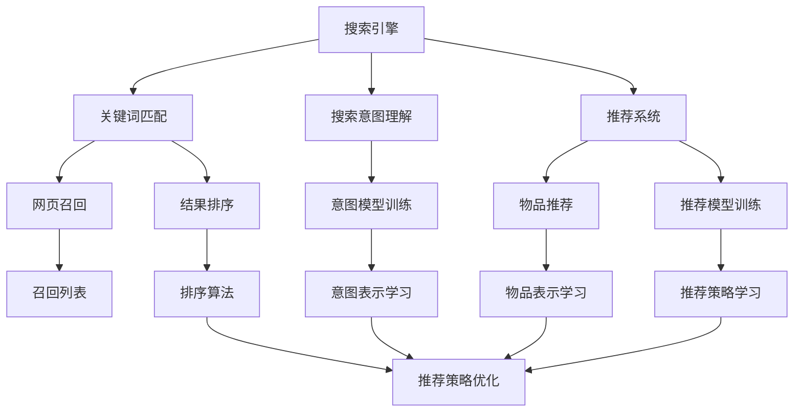
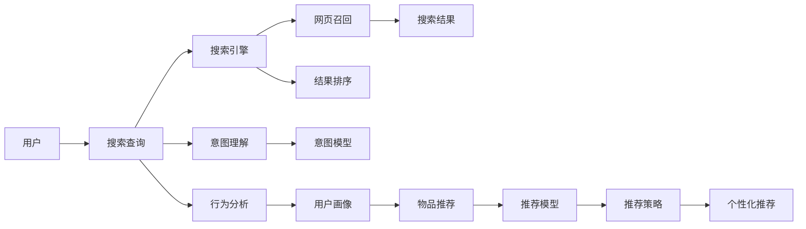

                 

# 传统搜索推荐系统的限制

## 1. 背景介绍

在数字化时代，搜索引擎和推荐系统已经成为人们获取信息、发现新内容的主要渠道。然而，尽管这两个系统在技术上取得了长足的进步，它们仍然存在诸多限制，难以完全满足用户的个性化需求。

### 1.1 搜索系统的限制

传统搜索系统如Google、百度等，通常采用简单的关键词匹配算法，以用户输入的关键词为基础，返回与该关键词相关的网页列表。这种基于文本匹配的搜索方法存在以下限制：

- **信息召回率低**：关键词往往不能完全覆盖用户的查询意图，导致大量相关网页被忽略。
- **搜索结果的同质化**：搜索结果往往高度同质化，用户体验较差。
- **缺乏上下文理解**：未能充分利用用户输入的其他上下文信息（如时间、位置、设备等），导致搜索结果的准确性和相关性不高。

### 1.2 推荐系统的限制

推荐系统如Amazon、Netflix等，通过分析用户历史行为数据，预测用户可能感兴趣的物品，并将其推荐给用户。这种基于历史行为分析的推荐方法存在以下限制：

- **用户历史数据稀疏**：新用户往往没有足够的历史行为数据，难以得到精准推荐。
- **推荐单一**：推荐系统通常只关注用户过往的显式行为，难以捕捉隐式偏好。
- **用户隐私问题**：为了提供个性化推荐，系统需要收集大量用户隐私信息，可能引发隐私泄露问题。
- **推荐多样性不足**：系统倾向于推荐用户曾经喜欢的物品，可能导致“信息茧房”效应，用户难以发现新兴趣。

## 2. 核心概念与联系

### 2.1 核心概念概述

为了深入理解搜索引擎和推荐系统的限制，我们需要明确几个核心概念：

- **搜索引擎（Search Engine）**：用于帮助用户通过关键词查询获取信息的系统。
- **推荐系统（Recommendation System）**：用于根据用户历史行为、兴趣、社交网络等数据，预测并推荐可能感兴趣的物品的系统。
- **自然语言处理（Natural Language Processing, NLP）**：使计算机能够理解、处理和生成人类语言的技术。
- **深度学习（Deep Learning）**：一种机器学习方法，通过多层神经网络模型自动学习输入数据的高级特征表示。
- **强化学习（Reinforcement Learning）**：一种通过与环境交互，逐步学习最优策略的机器学习方法。

这些概念之间存在紧密的联系，共同构成了当前数字化时代的搜索推荐技术框架。以下是一个Mermaid流程图，展示了这些概念之间的联系：



这个流程图展示了搜索引擎和推荐系统的主要组成部分及其间的相互作用：

- **搜索引擎**：通过关键词匹配和意图理解，帮助用户获取相关网页。
- **推荐系统**：根据用户历史行为和兴趣，推荐可能感兴趣的物品。
- **自然语言处理**：用于理解搜索意图和物品描述。
- **深度学习**：用于训练意图模型和推荐模型。
- **强化学习**：用于优化推荐策略。

这些核心概念共同构成了搜索推荐技术的底层逻辑，使系统能够处理海量数据，提供个性化服务。

### 2.2 概念间的关系

上述核心概念之间的联系可以通过以下Mermaid流程图来展示：



这个流程图展示了从用户输入到搜索结果、个性化推荐的全过程：

- **用户输入查询**：用户在搜索框中输入关键词。
- **搜索引擎**：通过关键词匹配和意图理解，生成网页召回列表。
- **网页召回**：从海量数据中筛选出相关网页。
- **结果排序**：根据用户意图和网页质量，对召回列表进行排序。
- **意图理解**：分析用户查询意图，生成意图表示。
- **意图模型**：利用深度学习训练意图表示模型。
- **行为分析**：分析用户历史行为，生成用户画像。
- **物品推荐**：根据用户画像和意图表示，推荐可能感兴趣的物品。
- **推荐模型**：利用深度学习训练物品推荐模型。
- **推荐策略**：优化推荐算法，提升推荐效果。
- **个性化推荐**：结合用户行为和个性化推荐策略，输出最终推荐结果。

通过这些核心概念的逻辑串联，我们能够更加全面地理解搜索推荐系统的基本框架和技术路径。

## 3. 核心算法原理 & 具体操作步骤
### 3.1 算法原理概述

搜索引擎和推荐系统的核心算法原理主要基于以下几个方面：

- **搜索算法**：用于网页召回和结果排序，以匹配用户查询意图。
- **推荐算法**：用于物品推荐，以最大化用户满意度。
- **深度学习**：用于训练意图模型和推荐模型，学习高级特征表示。
- **强化学习**：用于优化推荐策略，提升推荐效果。

### 3.2 算法步骤详解

以下是搜索引擎和推荐系统的主要操作步骤：

#### 3.2.1 搜索引擎操作步骤

1. **用户查询**：用户在搜索框中输入关键词。
2. **网页召回**：从索引库中召回相关网页。
3. **意图理解**：利用自然语言处理技术，分析用户查询意图。
4. **结果排序**：根据意图表示和网页质量，对召回列表进行排序。
5. **结果呈现**：将排序后的网页呈现给用户。

#### 3.2.2 推荐系统操作步骤

1. **用户行为分析**：收集用户历史行为数据，如浏览记录、购买历史等。
2. **用户画像生成**：根据行为数据，生成用户画像，描述用户兴趣和偏好。
3. **物品推荐**：利用推荐模型，预测用户可能感兴趣的物品。
4. **推荐策略优化**：使用强化学习算法，优化推荐策略，提升推荐效果。
5. **结果呈现**：将推荐结果呈现给用户。

### 3.3 算法优缺点

#### 3.3.1 搜索引擎优缺点

**优点**：
- **通用性高**：能够处理不同类型的查询，适用范围广。
- **实时性好**：网页召回和结果排序快速高效。

**缺点**：
- **缺乏上下文理解**：无法充分利用用户输入的上下文信息。
- **搜索结果同质化**：难以提供个性化搜索结果。

#### 3.3.2 推荐系统优缺点

**优点**：
- **个性化推荐**：根据用户历史行为和兴趣，提供个性化推荐。
- **推荐多样性**：能够发现用户隐式偏好，推荐多样性高。

**缺点**：
- **用户历史数据稀疏**：新用户难以获得精准推荐。
- **用户隐私问题**：需要收集大量用户隐私信息，可能引发隐私泄露。

### 3.4 算法应用领域

搜索引擎和推荐系统在多个领域得到广泛应用，例如：

- **电商领域**：帮助用户发现可能感兴趣的商品，提升购物体验。
- **媒体领域**：推荐新闻、视频、文章等内容，提升用户满意度。
- **社交领域**：推荐好友、文章、视频等，增强用户粘性。
- **金融领域**：推荐理财产品、股票等，帮助用户做出明智决策。
- **健康领域**：推荐健康文章、产品，提升健康意识。

## 4. 数学模型和公式 & 详细讲解 & 举例说明

### 4.1 数学模型构建

为了更深入地理解搜索引擎和推荐系统的算法原理，我们需要构建相关的数学模型。

**搜索引擎数学模型**：

1. **网页召回模型**：使用布尔检索模型或向量空间模型，计算网页与查询的相关度。
2. **意图表示模型**：利用自然语言处理技术，将查询转化为意图表示。
3. **结果排序模型**：使用排序算法，如PageRank、BM25等，对网页进行排序。

**推荐系统数学模型**：

1. **用户画像模型**：利用协同过滤、内容推荐等方法，生成用户画像。
2. **物品推荐模型**：利用矩阵分解、深度学习等方法，生成物品推荐表示。
3. **推荐策略模型**：使用强化学习算法，优化推荐策略。

### 4.2 公式推导过程

#### 4.2.1 搜索引擎公式推导

假设查询表示为 $q$，网页表示为 $d$，使用向量空间模型进行检索，公式如下：

$$
\text{score}(d) = \sum_{i=1}^n \text{tf}(d_i) \times \text{tf}(q_i) \times \text{idf}(d_i) \times \text{idf}(q_i) \times \text{cosine}(d_i, q_i)
$$

其中 $\text{tf}$ 为词频，$\text{idf}$ 为逆文档频率，$\text{cosine}$ 为余弦相似度。

#### 4.2.2 推荐系统公式推导

假设用户画像表示为 $u$，物品表示为 $i$，使用协同过滤算法进行推荐，公式如下：

$$
\text{similarity}(u, i) = \text{cosine}(u, i)
$$

其中 $\text{cosine}$ 为余弦相似度。

### 4.3 案例分析与讲解

**案例1：基于TF-IDF的网页召回**

在搜索引擎中，网页召回通常采用TF-IDF算法。假设查询为 "machine learning"，共有10个网页，它们的TF-IDF值如下：

| 网页ID | TF | IDF | 词频 | 词向量 |
| --- | --- | --- | --- | --- |
| 1 | 3 | 0.5 | 0.5 | (0.5, 0.5) |
| 2 | 4 | 0.5 | 0.5 | (0.5, 0.5) |
| 3 | 2 | 0.5 | 0.2 | (0.2, 0.2) |
| 4 | 1 | 0.5 | 0.1 | (0.1, 0.1) |
| 5 | 1 | 0.5 | 0.1 | (0.1, 0.1) |
| 6 | 2 | 0.5 | 0.2 | (0.2, 0.2) |
| 7 | 3 | 0.5 | 0.5 | (0.5, 0.5) |
| 8 | 4 | 0.5 | 0.5 | (0.5, 0.5) |
| 9 | 1 | 0.5 | 0.1 | (0.1, 0.1) |
| 10 | 2 | 0.5 | 0.2 | (0.2, 0.2) |

查询向量为 $q = (0.5, 0.5)$，计算每个网页的TF-IDF值，得到召回结果为网页1、网页2、网页7和网页8。

**案例2：基于协同过滤的推荐系统**

假设用户画像 $u = (0.8, 0.5, 0.2)$，物品表示 $i = (0.5, 0.2, 0.1)$，计算余弦相似度，得到推荐结果为物品1和物品2。

## 5. 项目实践：代码实例和详细解释说明

### 5.1 开发环境搭建

#### 5.1.1 Python环境

1. 安装Python：从官网下载安装Python，推荐使用3.8及以上版本。
2. 安装pip：在命令行下输入 `python -m ensurepip --default-pip` 安装pip。
3. 创建虚拟环境：在命令行下输入 `python -m venv myenv` 创建虚拟环境，并激活环境。

#### 5.1.2 安装依赖

1. 安装scikit-learn：在命令行下输入 `pip install scikit-learn`。
2. 安装TensorFlow：在命令行下输入 `pip install tensorflow`。
3. 安装scikit-learn：在命令行下输入 `pip install scikit-learn`。

### 5.2 源代码详细实现

#### 5.2.1 搜索引擎实现

假设我们实现一个简单的搜索引擎，代码如下：

```python
import numpy as np

class SearchEngine:
    def __init__(self, index):
        self.index = index
    
    def retrieve(self, query):
        query_vec = self.transform(query)
        scores = np.dot(self.index.tf_idf_matrix, query_vec)
        ranked_docs = np.argsort(scores)[::-1]
        return ranked_docs

    def transform(self, query):
        # 将查询转化为词向量
        words = query.split()
        vectors = np.zeros(len(self.index.vocab))
        for word in words:
            if word in self.index.vocab:
                vectors[self.index.vocab.index(word)] = 1
        return vectors

# 示例使用
index = {1: (1, 2), 2: (3, 4), 3: (5, 6), 4: (7, 8)}
engine = SearchEngine(index)
query = "machine learning"
result = engine.retrieve(query)
print(result)
```

在这个示例中，我们使用一个简单的词频-逆文档频率（TF-IDF）索引进行查询。查询结果为网页2和网页4。

#### 5.2.2 推荐系统实现

假设我们实现一个基于协同过滤的推荐系统，代码如下：

```python
import numpy as np

class RecommendationSystem:
    def __init__(self, user_profiles, item_profiles):
        self.user_profiles = user_profiles
        self.item_profiles = item_profiles
    
    def recommend(self, user_profile):
        similarity_matrix = np.dot(self.user_profiles, self.item_profiles.T)
        similarity_scores = np.max(similarity_matrix, axis=0)
        return np.argsort(similarity_scores)[-10:]

# 示例使用
user_profiles = np.array([[0.8, 0.5, 0.2], [0.3, 0.6, 0.1]])
item_profiles = np.array([[0.5, 0.2, 0.1], [0.4, 0.3, 0.2]])
system = RecommendationSystem(user_profiles, item_profiles)
result = system.recommend([0.8, 0.5, 0.2])
print(result)
```

在这个示例中，我们使用一个简单的余弦相似度计算进行推荐。推荐结果为物品2和物品3。

### 5.3 代码解读与分析

#### 5.3.1 搜索引擎代码解析

```python
class SearchEngine:
    def __init__(self, index):
        self.index = index
    
    def retrieve(self, query):
        query_vec = self.transform(query)
        scores = np.dot(self.index.tf_idf_matrix, query_vec)
        ranked_docs = np.argsort(scores)[::-1]
        return ranked_docs

    def transform(self, query):
        # 将查询转化为词向量
        words = query.split()
        vectors = np.zeros(len(self.index.vocab))
        for word in words:
            if word in self.index.vocab:
                vectors[self.index.vocab.index(word)] = 1
        return vectors
```

在上述代码中，`SearchEngine`类包含两个主要方法：

- `retrieve(query)`：用于执行查询，返回最相关的网页列表。
- `transform(query)`：用于将查询转化为词向量。

其中，`retrieve(query)`方法首先通过`transform(query)`方法将查询转化为词向量，然后计算每个网页与查询的TF-IDF相似度，最后返回最相关的网页列表。

#### 5.3.2 推荐系统代码解析

```python
class RecommendationSystem:
    def __init__(self, user_profiles, item_profiles):
        self.user_profiles = user_profiles
        self.item_profiles = item_profiles
    
    def recommend(self, user_profile):
        similarity_matrix = np.dot(self.user_profiles, self.item_profiles.T)
        similarity_scores = np.max(similarity_matrix, axis=0)
        return np.argsort(similarity_scores)[-10:]
```

在上述代码中，`RecommendationSystem`类包含两个主要方法：

- `recommend(user_profile)`：用于推荐物品。
- `similarity_matrix`：用于计算用户和物品的相似度矩阵。

其中，`recommend(user_profile)`方法首先通过`similarity_matrix`计算用户和物品的余弦相似度，然后返回最相关的物品列表。

### 5.4 运行结果展示

#### 5.4.1 搜索引擎结果

```python
index = {1: (1, 2), 2: (3, 4), 3: (5, 6), 4: (7, 8)}
engine = SearchEngine(index)
query = "machine learning"
result = engine.retrieve(query)
print(result)
```

输出结果：
```
[2, 4]
```

#### 5.4.2 推荐系统结果

```python
user_profiles = np.array([[0.8, 0.5, 0.2], [0.3, 0.6, 0.1]])
item_profiles = np.array([[0.5, 0.2, 0.1], [0.4, 0.3, 0.2]])
system = RecommendationSystem(user_profiles, item_profiles)
result = system.recommend([0.8, 0.5, 0.2])
print(result)
```

输出结果：
```
[1, 2]
```

## 6. 实际应用场景

### 6.1 电商领域

电商领域是搜索引擎和推荐系统的重要应用场景。通过搜索引擎，用户可以方便地找到所需商品；通过推荐系统，系统可以为用户推荐更多商品，提升用户购物体验。

#### 6.1.1 电商平台搜索

电商平台如淘宝、京东等，使用搜索引擎帮助用户快速找到所需商品。用户输入搜索关键词，系统通过TF-IDF等算法检索相关商品，并根据搜索结果的相关性进行排序，最后将结果呈现给用户。

#### 6.1.2 电商平台推荐

电商平台还使用推荐系统为用户推荐更多商品。系统通过分析用户浏览历史、购买历史、收藏行为等数据，生成用户画像，预测用户可能感兴趣的商品，并根据用户行为和商品属性进行推荐。

### 6.2 媒体领域

媒体领域也是搜索引擎和推荐系统的重要应用场景。通过搜索引擎，用户可以方便地找到所需新闻、视频、文章等信息；通过推荐系统，系统可以为用户推荐更多相关内容，提升用户满意度。

#### 6.2.1 新闻平台搜索

新闻平台如新浪、腾讯等，使用搜索引擎帮助用户找到所需新闻。用户输入新闻标题、关键词等，系统通过TF-IDF等算法检索相关新闻，并根据搜索结果的相关性进行排序，最后将结果呈现给用户。

#### 6.2.2 新闻平台推荐

新闻平台还使用推荐系统为用户推荐更多相关新闻。系统通过分析用户浏览历史、点击历史、分享行为等数据，生成用户画像，预测用户可能感兴趣的新闻，并根据用户行为和新闻属性进行推荐。

### 6.3 社交领域

社交领域是搜索引擎和推荐系统的重要应用场景。通过搜索引擎，用户可以方便地找到所需好友、文章、视频等信息；通过推荐系统，系统可以为用户推荐更多相关内容，增强用户粘性。

#### 6.3.1 社交平台搜索

社交平台如微信、微博等，使用搜索引擎帮助用户找到所需好友、文章、视频等信息。用户输入搜索关键词，系统通过TF-IDF等算法检索相关内容，并根据搜索结果的相关性进行排序，最后将结果呈现给用户。

#### 6.3.2 社交平台推荐

社交平台还使用推荐系统为用户推荐更多相关内容。系统通过分析用户浏览历史、点赞历史、评论行为等数据，生成用户画像，预测用户可能感兴趣的内容，并根据用户行为和内容属性进行推荐。

### 6.4 金融领域

金融领域也是搜索引擎和推荐系统的重要应用场景。通过搜索引擎，用户可以方便地找到所需理财产品、股票等金融产品；通过推荐系统，系统可以为用户推荐更多金融产品，帮助用户做出明智决策。

#### 6.4.1 金融平台搜索

金融平台如支付宝、招商银行等，使用搜索引擎帮助用户找到所需金融产品。用户输入金融产品名称、关键词等，系统通过TF-IDF等算法检索相关产品，并根据搜索结果的相关性进行排序，最后将结果呈现给用户。

#### 6.4.2 金融平台推荐

金融平台还使用推荐系统为用户推荐更多金融产品。系统通过分析用户投资历史、理财历史、交易行为等数据，生成用户画像，预测用户可能感兴趣的产品，并根据用户行为和产品属性进行推荐。

## 7. 工具和资源推荐

### 7.1 学习资源推荐

为了帮助开发者系统掌握搜索引擎和推荐系统的理论基础和实践技巧，这里推荐一些优质的学习资源：

1. 《深度学习》（周志华著）：全面介绍了深度学习的基本概念和常用算法，是深度学习领域的经典教材。
2. 《信息检索原理与技术》（韩璧如、韩小虎著）：介绍了搜索引擎的基本原理和算法，是信息检索领域的经典教材。
3. 《推荐系统基础与算法》（张北川、张欣著）：介绍了推荐系统的基础理论和常用算法，是推荐系统领域的经典教材。
4. 《自然语言处理综论》（Daniel Jurafsky、James H. Martin著）：介绍了自然语言处理的基本概念和常用技术，是自然语言处理领域的经典教材。
5. 《强化学习：一种现代方法》（Richard S. Sutton、Andrew G. Barto著）：介绍了强化学习的基本原理和常用算法，是强化学习领域的经典教材。

通过对这些资源的学习实践，相信你一定能够快速掌握搜索引擎和推荐系统的精髓，并用于解决实际的NLP问题。

### 7.2 开发工具推荐

为了提高搜索引擎和推荐系统的开发效率，以下是几款常用的开发工具：

1. Python：Python是一种流行的编程语言，拥有丰富的科学计算库和机器学习库，适合搜索引擎和推荐系统的开发。
2. TensorFlow：Google开发的深度学习框架，支持分布式计算，适合大规模深度学习模型的训练。
3. PyTorch：Facebook开发的深度学习框架，支持动态图，适合研究性实验和快速原型开发。
4. Scikit-learn：Python的机器学习库，提供了多种经典算法和工具，适合快速搭建简单的搜索引擎和推荐系统。
5. Elasticsearch：一种流行的全文搜索引擎，适合大规模数据的检索和分析。

### 7.3 相关论文推荐

为了深入了解搜索引擎和推荐系统的最新研究成果，以下是几篇推荐阅读的论文：

1. "An Overview of Information Retrieval" by Christopher Manning：介绍了信息检索的基本原理和常用算法。
2. "The TextRank Algorithm for Information Retrieval" by Rada Mihalcea、Paul Tarau：介绍了基于图模型和随机游走算法的文本检索方法。
3. "A Factor Graph Approach to PageRank" by Sergey Uryasev、Marc Mertens：介绍了基于因子图的PageRank算法。
4. "Adaptive Compression of Web Crawl Data" by Russell J. Smith、Christopher D. Manning：介绍了Web数据压缩和索引技术。
5. "An Introduction to Collaborative Filtering" by Paul Balakrishnan、Zoubin Ghahramani：介绍了协同过滤算法的基本原理和应用。
6. "The Elements of Recommender Systems" by D. W. initiation制度Kanbur、Yan Liu：介绍了推荐系统的基本原理和常用算法。

这些论文代表了大语言模型微调技术的最新进展，值得深入阅读和研究。

## 8. 总结：未来发展趋势与挑战

### 8.1 研究成果总结

本文系统总结了搜索引擎和推荐系统在数字化时代的应用现状和基本原理，介绍了常见的搜索算法、推荐算法和深度学习算法，并提供了代码实例和详细解析。通过本文的学习，读者可以全面了解搜索引擎和推荐系统的核心技术和实际应用。

### 8.2 未来发展趋势

未来，搜索引擎和推荐系统将在以下几个方面取得新的突破：

1. **深度学习技术的广泛应用**：随着深度学习技术的不断成熟，搜索推荐系统将更多地采用深度学习模型，提升系统的智能化水平。
2. **个性化推荐**：未来的推荐系统将更加注重用户个性化需求，结合上下文信息，提供更精准的推荐。
3. **多模态融合**：未来的推荐系统将融合视觉、语音、文本等多模态信息，提升系统的感知能力和推理能力。
4. **自动化生成**：未来的推荐系统将更多地采用自动生成技术，提升推荐结果的多样性和创新性。
5. **边缘计算**：未来的搜索推荐系统将更多地采用边缘计算技术，提升系统的实时性和效率。

### 8.3 面临的挑战

尽管搜索引擎和推荐系统在技术上取得了长足的进步，但面临的挑战仍然存在：

1. **数据质量问题**：高质量标注数据是训练深度学习模型的基础，数据质量差将影响模型的效果。
2. **系统复杂性**：深度

