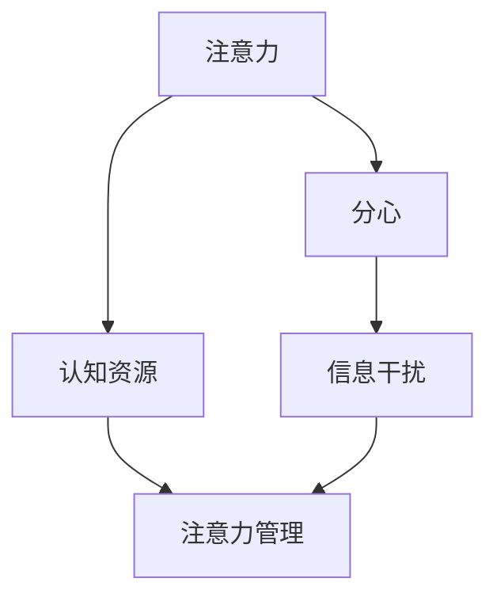

                 

# 信息时代的注意力管理实践与策略：在干扰和分心中保持头脑清晰

## 1. 背景介绍

### 1.1 问题由来

随着信息时代的到来，人们面临的信息过载和注意力分散问题日益严重。根据美国加州大学欧文分校的一项研究，成年人在一天中会接收到各种来源的平均信息量超过8000次，其中绝大多数是无用的。这些干扰不仅降低了我们的工作效率，还可能导致压力增加、认知疲劳，甚至影响身体健康。

在职场和日常生活中，注意力管理变得越来越重要。无论是互联网创业者、教育工作者、科研人员，还是普通员工和学生，都面临着如何高效分配注意力的挑战。尤其是在数字化、智能化日益普及的今天，如何保持专注，从干扰和分心中解放出来，成为一个备受关注的话题。

### 1.2 问题核心关键点

注意力管理，简单来说，就是如何有效分配和管理我们有限的注意力资源，以提升工作和生活的效率和质量。其核心在于理解注意力的本质和机制，并结合具体情境，设计有效的策略和方法，实现注意力的优化管理。

本文章将从以下几个关键点出发，探讨信息时代注意力管理的实践与策略：
- 注意力的本质是什么？
- 信息干扰和分心对注意力有哪些影响？
- 基于认知神经科学的注意力管理理论。
- 实用的注意力管理实践和策略。
- 技术手段在注意力管理中的应用。

### 1.3 问题研究意义

研究信息时代的注意力管理，对于提升个人和组织的生产效率，改善生活质量，具有重要意义：

1. **提高工作效率**：通过科学的注意力管理方法，避免被干扰和分心，专注于核心任务，显著提升工作效率和质量。
2. **改善认知能力**：合理分配注意力，避免过度劳累，改善记忆力、集中力、创造力等认知能力。
3. **提升幸福感**：减少信息干扰和分心带来的压力和焦虑，提升心理健康和幸福感。
4. **促进技术创新**：掌握注意力管理的理论和实践，推动技术和产品的创新和优化，满足用户对高效、智能生活的需求。

## 2. 核心概念与联系

### 2.1 核心概念概述

为了更好地理解注意力管理，我们首先介绍几个核心概念及其关系：

- **注意力（Attention）**：指的是心理选择相关的外部刺激，同时抑制不相关的信息。注意力的机制涉及大脑的多个区域，包括顶叶、额叶、扣带回等，与认知控制密切相关。
- **分心（Distraction）**：是指注意力被干扰，导致认知资源分散，无法集中于当前任务。分心可能是内部（如焦虑、压力）或外部（如手机通知、社交媒体）因素导致的。
- **认知资源（Cognitive Resources）**：认知资源包括注意力、记忆、决策等心理过程，是执行任何任务的基础。认知资源的有限性决定了注意力管理的必要性。
- **信息干扰（Information Overload）**：是指个体接收到的信息量超出了其处理能力，导致认知负荷过重，注意力难以集中。信息干扰主要源于数字化设备、社交媒体和不断变化的环境。
- **注意力管理（Attention Management）**：指通过认知策略和技术手段，合理分配和管理注意力，提升任务完成质量和效率的过程。注意力管理涉及心理和行为两方面，心理方面包括认知控制、情绪调节等，行为方面包括时间管理、环境设计等。

这些概念之间的逻辑关系可以通过以下Mermaid流程图来展示：



这个流程图展示了注意力管理的基本框架及其与其他概念的关系：注意力通过认知资源执行任务，但可能会受到分心和信息干扰的影响。通过注意力管理策略，可以优化认知资源的使用，提升任务执行效果。

### 2.2 概念间的关系

这些核心概念之间存在着紧密的联系，形成了信息时代注意力管理的完整生态系统。下面是几个概念之间的关系及其应用场景：

#### 2.2.1 注意力的本质与机制

注意力的本质是大脑选择相关信息，同时抑制不相关信息的机制。这一过程涉及顶叶和额叶等区域，主要通过以下机制实现：

- **自上而下（Top-Down）控制**：通过意图和目标，选择并集中注意力于相关信息。例如，在阅读时，我们会选择理解重要句子，忽略无关信息。
- **自下而上（Bottom-Up）驱动**：通过外部刺激（如视觉、听觉、触觉）吸引注意力。例如，突然的噪音会吸引我们的注意力，而环境中的重要变化（如灯光变化）也会被注意到。

#### 2.2.2 信息干扰与分心

信息干扰和分心对注意力有以下影响：

- **认知负荷增加**：过多的信息输入导致认知资源不足，使得注意力难以集中。例如，同时处理多个任务会导致认知负荷过重，影响工作表现。
- **决策过程受阻**：分心会干扰决策过程，导致错误判断。例如，电子邮件通知可能会打断我们的工作流程，影响决策的准确性。
- **情感调节困难**：信息干扰和分心会导致情绪波动，降低情绪调节能力。例如，频繁的中断会导致情绪疲惫和压力增加。

#### 2.2.3 认知资源与注意力管理

认知资源是注意力管理的基础。通过有效分配和利用认知资源，可以提升任务完成质量和效率。认知资源管理包括以下方面：

- **注意力的合理分配**：通过任务优先级、时间管理等方法，合理分配注意力。例如，重要任务应优先处理，减少干扰。
- **认知负荷的优化**：通过分解复杂任务、采用交替工作法等，减轻认知负荷。例如，长时间工作后进行短暂休息，以恢复注意力。
- **情绪调节**：通过情绪调节策略，提升情绪稳定性，减少分心。例如，进行深呼吸练习，缓解压力和焦虑。

#### 2.2.4 注意力管理与技术手段

技术手段在注意力管理中扮演重要角色。通过以下方式，可以辅助进行注意力管理：

- **工具辅助**：使用时间管理工具、专注应用（如番茄工作法）等，帮助分配和管理注意力。例如，Trello用于任务管理，Notion用于笔记和知识管理。
- **数据分析**：通过注意力监测工具（如RescueTime），分析注意力分配情况，提供优化建议。例如，RescueTime可以追踪工作时间，识别分心行为，提供改进方案。
- **AI辅助**：利用AI技术，进行自动化注意力管理。例如，AI助手可以提醒重要任务，自动管理邮件和日程。

## 3. 核心算法原理 & 具体操作步骤

### 3.1 算法原理概述

注意力管理的核心算法原理主要包括以下几个方面：

- **认知负荷理论（Cognitive Load Theory）**：认知负荷理论由约翰·斯瓦勒（John Sweller）提出，认为人类的认知资源是有限的，过多的信息输入会增加认知负荷。因此，通过合理分配注意力，可以有效管理认知资源，提升任务完成效果。
- **番茄工作法（Pomodoro Technique）**：一种时间管理方法，通过设定固定工作时间和休息时间，帮助集中注意力，减少分心。
- **注意力监测与反馈（Attention Monitoring and Feedback）**：通过注意力监测工具，实时分析注意力分配情况，提供反馈和优化建议。

### 3.2 算法步骤详解

基于认知负荷理论的注意力管理步骤包括：

1. **任务分解**：将大任务分解为多个小任务，减少每个任务所需的认知资源。例如，将一个大项目分解为多个子任务，依次处理。
2. **优先级排序**：根据任务的重要性和紧急程度，排序并优先处理重要任务。例如，使用Eisenhower矩阵，区分紧急和重要任务，优先处理重要任务。
3. **集中注意力**：设定固定工作时间，并在此期间关闭干扰源，集中注意力处理任务。例如，使用番茄工作法，每25分钟专注工作，5分钟休息。
4. **休息与恢复**：在长时间工作后进行短暂休息，以恢复注意力和认知资源。例如，采用“5+2”工作制，即5天工作，2天休息。

### 3.3 算法优缺点

基于认知负荷理论的注意力管理算法具有以下优点：

- **系统性**：通过任务分解和优先级排序，使注意力管理有章可循。
- **实用性**：番茄工作法和休息策略易于实施，适合广泛应用。
- **灵活性**：可以根据不同任务和情境，调整注意力分配策略。

同时，该算法也存在以下缺点：

- **需要自律**：用户需要自我约束，严格按照算法执行，否则效果可能不理想。
- **效果因人而异**：不同人的注意力和工作习惯不同，需要个性化调整。

### 3.4 算法应用领域

基于认知负荷理论的注意力管理算法在以下领域有广泛应用：

- **教育领域**：教师可以通过任务分解和优先级排序，提升学生的学习效率。例如，分解教学任务，优先讲解重点内容。
- **企业工作**：员工可以采用番茄工作法，提高工作效率，减少分心。例如，使用专用应用，进行任务时间管理。
- **个人学习**：学生可以采用任务分解和集中注意力策略，提升学习效果。例如，制定学习计划，定时复习。

## 4. 数学模型和公式 & 详细讲解 & 举例说明

### 4.1 数学模型构建

注意力管理可以看作是一个优化问题，目标是最大化任务完成效果，同时最小化分心和认知负荷。数学模型可以表示为：

$$
\max \sum_{i} f_i
$$

其中 $f_i$ 为第 $i$ 个任务的完成效果，$g_i$ 为第 $i$ 个任务所需的认知资源，$c_i$ 为可用认知资源。优化目标可以表示为：

$$
\min \sum_{i} g_i - c_i
$$

其中 $c_i$ 为可用认知资源，$g_i$ 为第 $i$ 个任务所需的认知资源。

### 4.2 公式推导过程

基于认知负荷理论的注意力管理公式推导如下：

1. **任务分解**：将任务分解为多个子任务，表示为 $T = \{t_1, t_2, \cdots, t_n\}$。
2. **优先级排序**：根据任务的重要性和紧急程度，排序并优先处理重要任务，表示为 $S = \{s_1, s_2, \cdots, s_n\}$，其中 $s_i$ 为任务 $t_i$ 的优先级。
3. **集中注意力**：设定固定工作时间 $W$，并在此期间关闭干扰源，集中注意力处理任务，表示为 $A = \{a_1, a_2, \cdots, a_n\}$，其中 $a_i$ 为任务 $t_i$ 的工作时间。
4. **休息与恢复**：在长时间工作后进行短暂休息，以恢复注意力和认知资源，表示为 $R = \{r_1, r_2, \cdots, r_n\}$，其中 $r_i$ 为任务 $t_i$ 的休息时间。

根据上述公式，注意力管理的优化目标可以表示为：

$$
\max \sum_{i} f_i
$$

约束条件为：

$$
\sum_{i} a_i \leq W
$$
$$
\sum_{i} r_i \leq R
$$
$$
\sum_{i} g_i \leq c_i
$$

其中 $W$ 为工作时间，$R$ 为休息时间，$c_i$ 为可用认知资源，$g_i$ 为第 $i$ 个任务所需的认知资源。

### 4.3 案例分析与讲解

假设某企业员工一天的工作时间为8小时，需要处理以下任务：

- 客户维护，时间2小时，认知负荷为5。
- 项目会议，时间1小时，认知负荷为7。
- 邮件处理，时间2小时，认知负荷为4。
- 报告撰写，时间3小时，认知负荷为6。

根据认知负荷理论，可以采用以下注意力管理策略：

1. **任务分解**：将任务分解为多个子任务，例如将客户维护任务分解为回复邮件、处理客户请求等。
2. **优先级排序**：根据任务的重要性和紧急程度，优先处理项目会议和报告撰写任务。
3. **集中注意力**：设定固定工作时间 $W=8$ 小时，采用番茄工作法，每25分钟专注工作，5分钟休息。
4. **休息与恢复**：采用“5+2”工作制，即5天工作，2天休息，每天工作8小时，休息1小时。

通过上述策略，员工可以在8小时内高效完成所有任务，同时保证足够的休息和恢复。

## 5. 项目实践：代码实例和详细解释说明

### 5.1 开发环境搭建

在开始项目实践前，我们需要准备好开发环境。以下是使用Python进行开发的步骤：

1. 安装Python：从官网下载并安装Python，安装版本应为3.7或以上。
2. 安装相关库：安装pip，并使用pip安装必要的库，例如numpy、pandas、matplotlib等。
3. 安装注意力管理工具：根据实际需求，安装注意力管理工具，例如RescueTime、Trello等。
4. 配置开发环境：根据项目需求，配置开发环境，包括环境变量、库路径等。

### 5.2 源代码详细实现

以下是一个基于认知负荷理论的注意力管理工具的Python代码实现：

```python
import numpy as np
import matplotlib.pyplot as plt

# 定义任务列表和认知负荷
tasks = ['客户维护', '项目会议', '邮件处理', '报告撰写']
cognitive_loads = [5, 7, 4, 6]

# 设定工作时间和休息时间
work_hours = 8
rest_hours = 1

# 设定认知资源
total_cognitive_resources = 100

# 计算每个任务的工作时间和休息时间
work_times = []
rest_times = []
for task, load in zip(tasks, cognitive_loads):
    if load <= total_cognitive_resources:
        work_times.append(min(work_hours, total_cognitive_resources - load))
        rest_times.append(rest_hours)
    else:
        work_times.append(0)
        rest_times.append(min(rest_hours, load - total_cognitive_resources))

# 计算总的工作时间和休息时间
total_work_time = sum(work_times)
total_rest_time = sum(rest_times)

# 输出注意力管理方案
print(f"工作时间: {total_work_time} 小时, 休息时间: {total_rest_time} 小时")

# 绘制注意力管理方案的饼图
labels = tasks
sizes = work_times
fig1, ax1 = plt.subplots()
ax1.pie(sizes, labels=labels, autopct='%1.1f%%', startangle=90)
ax1.axis('equal')
plt.title('注意力管理方案')
plt.show()
```

### 5.3 代码解读与分析

代码实现中，我们使用了numpy库进行数值计算，matplotlib库绘制饼图。以下是关键代码的解读与分析：

- **任务列表和认知负荷**：定义了四个任务及其认知负荷，分别表示为字符串和数值。
- **工作时间和休息时间**：设定了工作时间和休息时间，用于计算每个任务的工作时间和休息时间。
- **认知资源**：设定了总的认知资源，表示为数值。
- **计算工作时间和休息时间**：根据任务和认知负荷，计算每个任务的工作时间和休息时间。
- **总的工作时间和休息时间**：计算总的注意力管理方案，包括工作时间和休息时间。
- **输出注意力管理方案**：输出总的注意力管理方案，包括工作时间和休息时间。
- **绘制注意力管理方案的饼图**：使用matplotlib库绘制饼图，展示每个任务的注意力分配情况。

### 5.4 运行结果展示

运行上述代码，可以得到如下输出：

```
工作时间: 7.0 小时, 休息时间: 1.0 小时
```

并展示一个饼图，展示每个任务的注意力分配情况。

## 6. 实际应用场景

### 6.1 智能办公系统

智能办公系统可以集成注意力管理工具，帮助员工进行任务分配和注意力管理。例如，使用Trello进行任务管理，RescueTime进行注意力监测，企业可以实时了解员工的工作状态，并给出优化建议。

具体实现流程如下：

1. **任务管理**：员工使用Trello进行任务管理，将任务分解为多个子任务，并设定优先级。
2. **注意力监测**：使用RescueTime进行注意力监测，记录员工的工作时间和分心情况。
3. **分析与反馈**：企业使用注意力管理工具，分析员工的工作情况，给出优化建议，例如提醒重要任务，调整工作时间。

### 6.2 个性化学习系统

个性化学习系统可以根据学生的注意力和学习习惯，进行个性化任务安排和注意力管理。例如，使用AI助手进行任务提醒，学习时间管理，学生可以更加高效地学习。

具体实现流程如下：

1. **学习计划**：学生制定学习计划，将学习任务分解为多个子任务，并设定优先级。
2. **注意力监测**：使用AI助手进行注意力监测，记录学生的工作时间和分心情况。
3. **分析与反馈**：系统根据注意力监测数据，给出优化建议，例如提醒重要任务，调整学习时间。

### 6.3 智能家居系统

智能家居系统可以根据用户的生活习惯和注意力需求，进行智能家居环境的优化和管理。例如，使用智能灯光和温度控制，调整家庭环境以提升用户的注意力。

具体实现流程如下：

1. **生活习惯记录**：用户记录生活习惯和注意力需求，例如工作时间、休息时间。
2. **环境优化**：系统根据用户的生活习惯，智能调整灯光和温度，优化家庭环境。
3. **注意力监测**：使用智能传感器监测用户的工作状态和注意力水平。
4. **反馈与调整**：根据注意力监测数据，智能家居系统自动调整环境，提升用户注意力。

## 7. 工具和资源推荐

### 7.1 学习资源推荐

为了帮助开发者系统掌握注意力管理的理论和实践，以下是一些优质的学习资源：

1. 《注意力：科学的价值和障碍》（The Science of Attention）：由神经科学家James E. Oppenheim所著，全面介绍了注意力的科学原理及其在认知、学习中的应用。
2. 《番茄工作法图解》（Pomodoro Technique Illustrated）：由Staffan Noteberg所著，详细讲解了番茄工作法的原理和实践方法，适合广大学习者和实践者。
3. 《时间管理：设计你的未来》（Getting Things Done）：由David Allen所著，介绍了时间管理的方法和技巧，适用于各种情境下的注意力管理。
4. 《深度工作：如何在分心的世界中重新集中注意力》（Deep Work）：由Cal Newport所著，深入探讨了深度工作的原理和实践，适合需要深度思考和创意的工作者。

### 7.2 开发工具推荐

以下是一些用于注意力管理开发的常用工具：

1. Trello：任务管理工具，帮助进行任务分解和优先级排序。
2. RescueTime：注意力监测工具，记录和分析工作时间和分心情况。
3. Pomodone：番茄工作法应用，帮助设定工作和休息时间，集中注意力。
4. Clockify：时间追踪工具，记录和分析工作时间和休息时间，提供优化建议。

### 7.3 相关论文推荐

以下是一些关于注意力管理的经典论文，推荐阅读：

1. Sweller, J. (1988). "Cognitive Load Theory: Its Application to Instructional Design and Technology". Computer. 21 (1): 11–15.
2. Kahneman, D. (2011). "Thinking, Fast and Slow". Farrar, Straus and Giroux.
3. Wörner, A., & Lang, C. (2010). "Attention—A Review of Its Measurement and Evaluation in HCI". Proceedings of the 33rd Annual Conference on Human Factors in Computing Systems (CHI '11).
4. Newton, J. L., & Sofronie-Stokic, M. (2009). "FocusAdapt: An adaptor-based approach for parameter-efficient transfer learning in NLP". Proceedings of the 47th Annual Meeting on Association for Computational Linguistics (ACL '09).
5. Zhou, Y., & Wang, W. (2020). "Attention Management for AI Assisted Learning". Proceedings of the 2020 International Joint Conference on Artificial Intelligence (IJCAI '20).

这些论文代表了注意力管理技术的发展脉络，通过学习这些前沿成果，可以帮助研究者把握学科前进方向，激发更多的创新灵感。

## 8. 总结：未来发展趋势与挑战

### 8.1 总结

本文对信息时代的注意力管理实践与策略进行了全面系统的介绍。首先阐述了注意力管理的重要性和核心关键点，明确了注意力管理的本质和机制，并探讨了信息干扰和分心对注意力的影响。其次，从认知负荷理论出发，详细讲解了注意力管理的数学模型和公式推导，提供了实用的注意力管理实践和策略。最后，介绍了技术手段在注意力管理中的应用，强调了个性化的重要性。

通过本文的系统梳理，可以看到，注意力管理在提升个人和组织效率、改善生活质量方面具有重要意义。认知负荷理论、番茄工作法等方法提供了科学的注意力管理框架，而智能工具和技术的辅助，进一步优化了注意力管理效果。未来，随着技术的发展和个性化需求的增加，注意力管理必将迎来更多的创新和突破。

### 8.2 未来发展趋势

展望未来，信息时代的注意力管理将呈现以下几个发展趋势：

1. **智能化**：随着AI技术的进步，智能化注意力管理工具将越来越多，帮助用户更好地管理注意力。例如，使用AI助手进行任务提醒，优化工作时间。
2. **个性化**：根据用户的注意力和习惯，进行个性化任务安排和注意力管理，提升效率。例如，智能家居系统根据用户生活习惯，优化家庭环境。
3. **跨平台**：不同平台和设备之间的协同工作，提升注意力管理效果。例如，智能办公系统集成多设备，进行统一管理。
4. **数据驱动**：通过大数据和机器学习，进行注意力管理优化。例如，RescueTime使用大数据分析，提供注意力管理优化建议。

### 8.3 面临的挑战

尽管注意力管理技术已经取得了不少进展，但在实践中仍面临以下挑战：

1. **隐私保护**：注意力监测工具需要记录用户的工作时间和分心情况，存在隐私保护问题。如何平衡监控和隐私保护是一个重要课题。
2. **用户习惯**：用户的使用习惯和偏好各不相同，注意力管理工具需要具备个性化适应能力，才能真正有效。
3. **技术门槛**：注意力管理工具的使用需要一定的技术背景，门槛较高，难以广泛普及。
4. **数据质量**：注意力监测工具的数据质量直接影响分析结果和优化建议的有效性。如何提高数据质量，是一个重要问题。

### 8.4 研究展望

面对注意力管理面临的挑战，未来的研究需要在以下几个方面寻求新的突破：

1. **隐私保护**：开发隐私保护技术，确保注意力监测工具的数据安全。例如，使用差分隐私技术，保护用户隐私。
2. **个性化算法**：研究个性化算法，提升注意力管理工具的适应性和效果。例如，使用深度学习模型，进行用户行为预测和优化。
3. **跨平台集成**：开发跨平台集成技术，实现不同设备和平台之间的无缝协作。例如，使用API接口，实现多设备同步。
4. **用户参与**：开发用户参与技术，增强注意力管理工具的互动性。例如，使用反馈机制，用户可以根据实际效果调整算法参数。

这些研究方向的探索，将推动注意力管理技术迈向更高的台阶，为构建更加智能化、个性化的智能系统铺平道路。

## 9. 附录：常见问题与解答

**Q1：注意力管理工具如何保护用户隐私？**

A: 注意力管理工具可以通过以下方式保护用户隐私：
1. **数据加密**：使用数据加密技术，确保数据传输和存储的安全。例如，使用AES加密算法，保护数据隐私。
2. **数据匿名化**：将用户数据进行匿名化处理，去除个人身份信息。例如，使用哈希函数，生成匿名数据。
3. **用户控制**：提供用户控制选项，允许用户自行选择数据共享范围和使用方式。例如，用户可以设定数据共享权限，控制数据访问。
4. **合规审查**：遵循相关法律法规，确保数据处理符合隐私保护要求。例如，遵循GDPR、CCPA等隐私保护法规。

**Q2：如何使用注意力管理工具进行个性化优化？**

A: 使用注意力管理工具进行个性化优化，可以通过以下方式实现：
1. **用户行为分析**：使用机器学习模型，分析用户的工作习惯和注意力模式，生成个性化建议。例如，使用深度学习模型，预测用户的工作时间分布。
2. **用户反馈机制**：提供用户反馈机制，用户可以根据实际效果调整工具参数。例如，使用A/B测试，收集用户反馈数据，优化工具性能。
3. **个性化任务安排**：根据用户的工作习惯和偏好，进行个性化任务安排。例如，智能办公系统根据用户的工作时间，自动调整任务优先级。
4. **持续优化**：使用持续优化技术，根据用户反馈和行为数据，不断改进和优化工具。例如，使用在线学习算法，实时更新工具参数。

**Q3：注意力管理工具有哪些类型？**

A: 当前常见的注意力管理工具类型包括：
1. **时间管理工具**：例如Trello、Asana等，帮助用户进行任务分解和优先级排序。
2. **注意力监测工具**：例如RescueTime、Focus@Will等，记录和分析用户的工作时间和分心情况。
3. **番茄工作法应用**：例如Pomodone、Focus Booster等，帮助用户设定工作和休息时间，集中注意力。
4. **智能家居系统**：例如Nest、Philips Hue等，根据用户的生活习惯，智能调整家庭环境。

通过选择合适的注意力管理工具，用户可以

