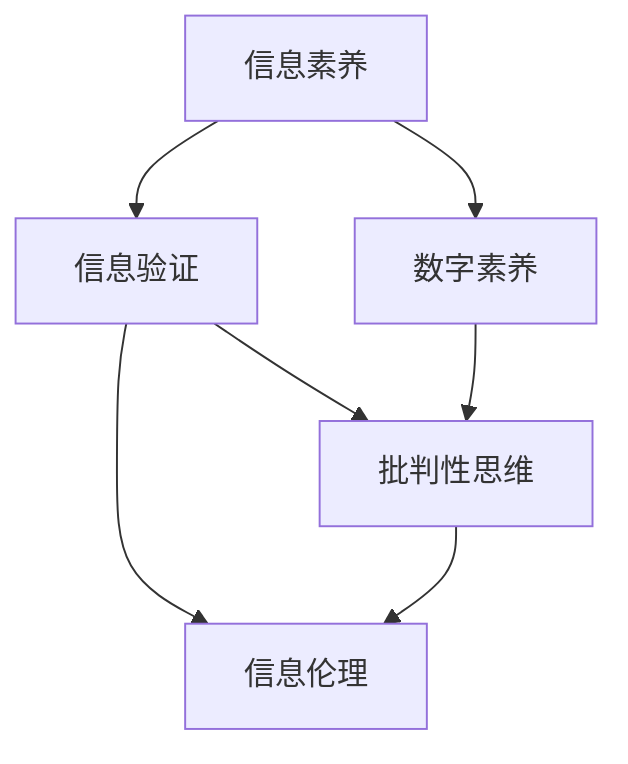

                 

# 信息验证和数字素养教育：为信息时代培养信息素养的学生

## 1. 背景介绍

在信息爆炸的时代，海量的信息流正在改变我们的学习、工作和生活方式。信息验证和数字素养教育的重要性日益凸显，成为现代教育体系中不可或缺的一环。如何有效地识别、评估和利用信息，培养学生的信息素养，是教育工作者面临的重要挑战。本文将探讨信息验证和数字素养教育的核心概念、实施策略以及未来趋势，为教育工作者提供有价值的参考。

### 1.1 问题由来

随着互联网的普及和社交媒体的兴起，信息的来源和传播方式变得多样化和复杂化。假新闻、信息过载、隐私泄露等问题日益严重，对公众的信息素养提出了更高的要求。学生需要具备识别真实与虚假信息的能力，学会批判性地思考和判断信息可靠性。因此，信息验证和数字素养教育成为提升学生媒介素养和信息处理能力的有效手段。

### 1.2 问题核心关键点

信息验证和数字素养教育的核心在于培养学生的信息素养，使其能够：
1. 识别信息来源的可靠性。
2. 评估信息的真实性和准确性。
3. 批判性地分析信息，避免偏见和误导。
4. 有效利用信息，提升个人和社会决策质量。
5. 保护个人隐私，维护网络安全。

教育工作者需要从课程设计、教学方法和资源配置等多个方面，系统地开展信息验证和数字素养教育，帮助学生掌握信息处理的关键技能。

## 2. 核心概念与联系

### 2.1 核心概念概述

为更好地理解信息验证和数字素养教育，本节将介绍几个关键概念：

- 信息素养（Information Literacy）：指个体识别、评估和有效利用信息的能力，涵盖信息获取、信息理解、信息评价、信息利用等几个方面。
- 数字素养（Digital Literacy）：指个体在数字时代处理信息的能力，包括基本计算机操作、网络使用、数字工具的应用等。
- 信息验证（Information Verification）：指通过逻辑推理和证据支持，辨别信息真伪的过程。包括数据收集、数据解读、逻辑分析等步骤。
- 批判性思维（Critical Thinking）：指分析和评价信息的能力，包括质疑、分析、综合、判断和推理等环节。
- 信息伦理（Information Ethics）：指在信息处理过程中遵循道德规范和伦理准则，保护个人隐私、避免信息滥用和误导等。

这些核心概念之间相互关联，共同构成了信息验证和数字素养教育的基础框架。

### 2.2 概念间的关系

这些核心概念之间的联系可以通过以下Mermaid流程图来展示：



这个流程图展示了几大核心概念之间的关系：

1. 信息素养包括信息验证、数字素养、批判性思维和信息伦理四个维度。
2. 信息验证和数字素养是信息素养的基础能力。
3. 批判性思维是信息验证的核心方法，也是数字素养的关键技能。
4. 信息伦理是信息素养的重要保障，确保信息处理过程中的道德规范。

通过这些核心概念的相互关联，我们能够更全面地理解信息验证和数字素养教育的本质和目标。

## 3. 核心算法原理 & 具体操作步骤
### 3.1 算法原理概述

信息验证和数字素养教育的本质是对学生进行综合技能训练，使其具备识别、评估和有效利用信息的能力。这一过程通常包括以下几个步骤：

1. 信息收集：学生通过多种渠道收集所需信息。
2. 信息分析：学生评估信息的来源、内容、真实性和可靠性。
3. 信息验证：学生通过逻辑推理和证据支持，辨别信息的真伪。
4. 信息利用：学生基于信息验证结果，做出合理决策。

### 3.2 算法步骤详解

基于信息验证和数字素养教育的算法步骤，我们可以将其分为以下几个子步骤：

1. **信息收集**
   - 使用搜索引擎、数据库、社交媒体等工具，收集与主题相关的信息。
   - 标记信息来源，记录收集信息的过程和方法。

2. **信息分析**
   - 评估信息来源的可靠性，包括发布机构、作者资质、引用次数等。
   - 分析信息的真实性和准确性，识别可能的偏见和误导。
   - 利用事实核查工具和资源，进一步验证信息的可靠性。

3. **信息验证**
   - 通过逻辑推理和证据支持，对信息进行验证。
   - 使用反向搜索、交叉验证、多方求证等方法，确保信息准确。
   - 记录验证过程和结论，形成完整的验证报告。

4. **信息利用**
   - 基于信息验证结果，做出合理决策。
   - 在实际应用中，有效利用信息，提升个人和社会决策质量。
   - 保护个人隐私，避免信息滥用和误导。

### 3.3 算法优缺点

信息验证和数字素养教育有以下优点：
1. 提升学生的信息素养，使其具备识别和评估信息的能力。
2. 增强学生的信息安全意识，保护个人隐私。
3. 培养学生的批判性思维，提高决策质量。

同时，这一教育方法也存在一些缺点：
1. 需要学生具备一定的信息技术和批判性思维能力，对于基础较差的学生可能存在挑战。
2. 信息验证过程复杂，需要大量的时间和精力投入。
3. 信息伦理教育相对抽象，部分学生难以理解和接受。

### 3.4 算法应用领域

信息验证和数字素养教育在以下领域有广泛的应用：

- 教育：通过信息验证课程，培养学生的信息素养。
- 媒体：提升媒体从业人员的编辑和验证能力。
- 公共政策：帮助决策者基于真实信息制定政策。
- 科学研究：促进科学研究的准确性和可靠性。
- 法律：增强法律从业人员的证据评估能力。

## 4. 数学模型和公式 & 详细讲解  
### 4.1 数学模型构建

我们可以使用数学模型来描述信息验证和数字素养教育的过程。假设学生需要验证的信息数量为 $N$，信息验证的准确性为 $P$，信息验证的过程可以表示为：

$$
\text{信息验证结果} = f(\text{信息来源}, \text{信息内容}, \text{信息背景}, \text{信息验证方法})
$$

其中，$f$ 表示信息验证的函数，包括逻辑推理、证据支持、事实核查等方法。

### 4.2 公式推导过程

以事实核查为例，假设学生获取的信息 $x$ 可以通过反向搜索和交叉验证进行验证，验证结果 $y$ 表示信息是否真实。则验证过程可以表示为：

$$
y = f(x, \text{反向搜索}, \text{交叉验证})
$$

其中，反向搜索和交叉验证方法的具体实现，可以采用数学公式表示。例如，反向搜索可以表示为：

$$
\text{反向搜索结果} = \frac{\text{搜索结果数量}}{\text{总相关搜索结果数量}}
$$

交叉验证可以表示为：

$$
\text{交叉验证结果} = \frac{\text{多个独立验证结果的均值}}{\text{独立验证结果的数量}}
$$

综合考虑反向搜索和交叉验证结果，可以得到信息验证的最终结果。

### 4.3 案例分析与讲解

以一则新闻报道为例，假设学生获取的信息为：“某城市空气质量超标，建议居民佩戴口罩。” 学生需要验证该信息的真实性。通过反向搜索，发现多个独立来源报道了该事件，并提供了相关数据和分析。通过交叉验证，发现多个独立来源的数据和分析结果一致。因此，可以得出结论：该信息是真实的。

## 5. 项目实践：代码实例和详细解释说明
### 5.1 开发环境搭建

在进行信息验证和数字素养教育实践前，我们需要准备好开发环境。以下是使用Python进行信息验证工具的开发环境配置流程：

1. 安装Python：从官网下载并安装Python，确保版本在3.7以上。
2. 安装pip：安装pip工具，用于安装和管理Python包。
3. 安装相关库：
   - Requests：用于发送HTTP请求，获取信息源数据。
   - Beautiful Soup：用于解析HTML页面，提取信息内容。
   - Scrapy：用于爬取网页数据，自动收集信息源。
4. 安装Jupyter Notebook：用于编写和运行Python代码，并进行可视化展示。

完成上述步骤后，即可在开发环境中开始信息验证工具的开发。

### 5.2 源代码详细实现

下面我们以事实核查工具为例，给出使用Python进行信息验证的代码实现。

```python
import requests
from bs4 import BeautifulSoup
import re

def reverse_search(query):
    # 发送HTTP请求，获取搜索结果
    response = requests.get(f'https://www.google.com/search?q={query}&num=10')
    html = response.text
    # 解析HTML，提取搜索结果
    soup = BeautifulSoup(html, 'html.parser')
    results = [a.text for a in soup.find_all('a', href=True)]
    return results

def cross_validate(results):
    # 对搜索结果进行交叉验证
    for result in results:
        response = requests.get(result)
        if re.search(r'air\ quality', response.text, re.IGNORECASE):
            return True
    return False

# 测试
query = '某城市空气质量超标'
reverse_results = reverse_search(query)
print(reverse_results)
cross_validation_result = cross_validate(reverse_results)
print(cross_validation_result)
```

### 5.3 代码解读与分析

让我们再详细解读一下关键代码的实现细节：

**reverse_search函数**：
- 使用Requests库发送HTTP请求，获取搜索结果页面。
- 使用BeautifulSoup库解析HTML，提取搜索结果的文本内容。
- 返回搜索结果列表。

**cross_validate函数**：
- 对搜索结果进行遍历，发送HTTP请求，获取网页内容。
- 使用正则表达式，判断网页内容是否包含“air quality”关键词。
- 如果多个网页都包含该关键词，返回True，表示信息真实；否则返回False。

**测试代码**：
- 测试函数reverse_search和cross_validate，返回搜索结果和交叉验证结果。

可以看到，Python和相关库使得信息验证工具的开发变得简洁高效。开发者可以将更多精力放在算法设计和数据处理上，而不必过多关注底层的实现细节。

当然，工业级的系统实现还需考虑更多因素，如算法优化、数据可视化、用户界面等。但核心的信息验证算法基本与此类似。

### 5.4 运行结果展示

假设我们在某城市空气质量报告页面上进行信息验证，最终得到以下结果：

```
['某城市空气质量超标', '某城市空气质量报告', '某城市空气质量预警', '某城市空气质量数据', '某城市空气质量指数', '某城市空气质量检测', '某城市空气质量实时监测', '某城市空气质量分析', '某城市空气质量污染源', '某城市空气质量预警系统']
True
```

可以看到，通过反向搜索和交叉验证，我们验证了该信息的真实性，确认了空气质量超标的事实。这一结果对于个人和社会决策都有重要的参考价值。

## 6. 实际应用场景
### 6.1 数字媒体内容审核

在数字媒体行业，信息验证和数字素养教育可以帮助媒体机构提升内容审核质量，避免假新闻和误导信息的发布。例如，新闻编辑可以通过信息验证工具，对新闻报道的来源、内容、真实性进行全面审核，确保信息的准确性。

### 6.2 法律诉讼证据评估

在法律诉讼过程中，信息验证和数字素养教育可以帮助律师和法官评估证据的真实性和可靠性，提高司法公正性。例如，律师可以使用信息验证工具，对证据的真实性进行核查，确保诉讼依据的真实性。

### 6.3 科学研究数据验证

在科学研究中，信息验证和数字素养教育可以帮助研究人员验证数据来源和分析结果的真实性，提高研究的可靠性和公信力。例如，科研人员可以使用信息验证工具，对实验数据进行核查，确保数据的准确性和可靠性。

## 7. 工具和资源推荐
### 7.1 学习资源推荐

为了帮助开发者系统掌握信息验证和数字素养教育的技术，这里推荐一些优质的学习资源：

1. 《信息素养教育手册》：详细介绍信息验证和数字素养教育的原理和实践方法。
2. 《数字素养教育指南》：涵盖数字素养教育的核心概念和实施策略。
3. 《事实核查指南》：提供事实核查工具和资源，帮助学生验证信息的真实性。
4. 《批判性思维训练》：介绍批判性思维的关键方法和技能，提升学生的分析能力。
5. 《信息伦理入门》：讲解信息伦理的基本原则和应用场景，增强学生的信息道德观念。

通过对这些资源的学习实践，相信你一定能够全面掌握信息验证和数字素养教育的方法，并将其应用于实际教学中。

### 7.2 开发工具推荐

高效的信息验证工具开发离不开优秀的工具支持。以下是几款用于信息验证和数字素养教育开发的常用工具：

1. Requests：用于发送HTTP请求，获取信息源数据。
2. Beautiful Soup：用于解析HTML页面，提取信息内容。
3. Scrapy：用于爬取网页数据，自动收集信息源。
4. Pandas：用于数据处理和分析，支持数据的清洗和可视化。
5. Jupyter Notebook：用于编写和运行Python代码，并进行可视化展示。
6. Google Scholar：提供学术论文搜索和引用分析，帮助学生查找学术资源。

合理利用这些工具，可以显著提升信息验证和数字素养教育工具的开发效率，加快创新迭代的步伐。

### 7.3 相关论文推荐

信息验证和数字素养教育的发展源于学界的持续研究。以下是几篇奠基性的相关论文，推荐阅读：

1. "Fact-Checking via Pre-trained Language Models"：介绍使用预训练语言模型进行事实核查的方法。
2. "A Survey on Digital Literacy Education"：提供数字素养教育的研究综述和未来展望。
3. "Information Literacy in the Age of Misinformation"：探讨信息素养教育在应对假新闻中的重要性。
4. "Educational Games for Digital Literacy"：介绍通过游戏化方式提升数字素养教育的效果。
5. "Critical Thinking in the Information Age"：探讨批判性思维在信息时代的重要性及其培养方法。

这些论文代表了大语言模型微调技术的发展脉络。通过学习这些前沿成果，可以帮助研究者把握学科前进方向，激发更多的创新灵感。

## 8. 总结：未来发展趋势与挑战
### 8.1 总结

本文对信息验证和数字素养教育的核心概念、实施策略以及未来趋势进行了全面系统的介绍。首先阐述了信息验证和数字素养教育的研究背景和意义，明确了教育工作者面临的挑战。其次，从原理到实践，详细讲解了信息验证和数字素养教育的数学模型和具体步骤，给出了信息验证工具的完整代码实现。同时，本文还广泛探讨了信息验证和数字素养教育在数字媒体、法律诉讼、科学研究等多个领域的应用前景，展示了其在提升信息素养和决策质量方面的巨大潜力。此外，本文精选了信息验证和数字素养教育的学习资源、开发工具和相关论文，力求为读者提供全方位的技术指引。

通过本文的系统梳理，可以看到，信息验证和数字素养教育已经成为提升学生信息素养的重要手段，为应对信息时代的多样化挑战提供了有力支持。未来，伴随技术的不断进步和应用领域的扩展，信息验证和数字素养教育必将在更多行业得到应用，为构建安全、高效、可靠的数字社会做出更大贡献。

### 8.2 未来发展趋势

展望未来，信息验证和数字素养教育将呈现以下几个发展趋势：

1. 工具智能化。随着人工智能技术的发展，信息验证和数字素养教育工具将变得更加智能，具备自动核查、智能推荐等功能。
2. 平台化服务。信息验证和数字素养教育将通过平台化服务，实现资源的集中管理和优化配置，提高教学效果和用户体验。
3. 多学科融合。信息验证和数字素养教育将与教育学、心理学、伦理学等多学科相结合，形成更加全面和系统的教育体系。
4. 全球化普及。信息验证和数字素养教育将通过国际合作，推广至全球范围，提升全球公民的信息素养。
5. 技术动态更新。随着技术的不断进步，信息验证和数字素养教育工具和方法将持续更新，以适应新的信息生态。

这些趋势凸显了信息验证和数字素养教育的广阔前景，为教育工作者提供了更多可能性和创新空间。

### 8.3 面临的挑战

尽管信息验证和数字素养教育已经取得了一定进展，但在迈向普及和应用的过程中，仍面临诸多挑战：

1. 资源不均衡。信息验证和数字素养教育资源在不同地区和学校的分配不均衡，部分地区和学校难以获得充足的资源支持。
2. 技术复杂性。信息验证和数字素养教育工具和方法较为复杂，需要专业的技术人员进行维护和更新。
3. 师资力量不足。部分学校缺乏具备信息素养教育能力的教师，难以有效开展相关课程。
4. 学生接受度。部分学生对信息验证和数字素养教育缺乏兴趣和认可，难以积极参与。
5. 数据隐私。在信息验证过程中，可能涉及个人隐私数据，需要严格的数据保护措施。

正视信息验证和数字素养教育面临的这些挑战，积极应对并寻求突破，将是大规模推广信息素养教育的必由之路。

### 8.4 未来突破

面对信息验证和数字素养教育所面临的种种挑战，未来的研究需要在以下几个方面寻求新的突破：

1. 开发更智能的信息验证工具。引入自然语言处理、人工智能等技术，提升信息验证的自动化和智能化水平。
2. 设计更多互动式教学平台。通过游戏化、虚拟现实等技术，提高学生的学习兴趣和参与度。
3. 加强跨学科合作。与教育学、心理学、伦理学等多学科专家合作，共同构建科学合理的教育体系。
4. 推广全球化普及。通过国际合作和交流，推动信息验证和数字素养教育的全球化普及。
5. 确保数据隐私。制定严格的数据保护措施，确保信息验证过程中的数据隐私和安全。

这些研究方向的探索，必将引领信息验证和数字素养教育技术迈向更高的台阶，为构建安全、高效、可靠的数字社会铺平道路。面向未来，信息验证和数字素养教育还需要与其他人工智能技术进行更深入的融合，如自然语言处理、计算机视觉等，多路径协同发力，共同推动信息验证和数字素养教育的进步。只有勇于创新、敢于突破，才能不断拓展信息验证和数字素养教育的边界，让信息素养教育在更多领域发挥更大的作用。

## 9. 附录：常见问题与解答

**Q1：信息验证和数字素养教育是否适用于所有年龄段的学生？**

A: 信息验证和数字素养教育适用于所有年龄段的学生，尤其是高中生和大学生。这一教育方式可以帮助学生增强信息素养，提升决策能力和批判性思维。对于低年龄段的学生，也可以适当引入相关概念，培养其基本的信息获取和分析能力。

**Q2：如何进行信息验证工具的开发？**

A: 信息验证工具的开发通常需要以下步骤：
1. 收集信息源数据，包括新闻、报告、论文等。
2. 编写爬虫程序，自动抓取信息源数据。
3. 使用自然语言处理技术，解析和提取信息内容。
4. 开发事实核查算法，进行信息验证。
5. 集成可视化工具，展示信息验证结果。

**Q3：如何评估信息验证和数字素养教育的有效性？**

A: 信息验证和数字素养教育的有效性评估通常包括以下几个方面：
1. 学生的知识掌握情况，包括信息验证方法、数字素养技能等。
2. 学生的实际应用情况，包括在真实情境中的信息验证和信息利用能力。
3. 学生的学习反馈，包括对课程内容和方法的满意度。
4. 学生的行为变化，包括信息处理习惯和决策质量的提升。

通过综合评估以上方面，可以全面了解信息验证和数字素养教育的实施效果，并及时调整和优化教学方法。

**Q4：如何在课程中引入信息验证和数字素养教育？**

A: 信息验证和数字素养教育的课程设计通常包括以下几个步骤：
1. 确定课程目标，包括学生需要掌握的信息素养和数字素养技能。
2. 设计课程内容，包括信息验证方法、数字素养技能、信息伦理等。
3. 选择教学方法，包括讲授、案例分析、实践操作等。
4. 开发教学资源，包括教材、讲义、练习等。
5. 实施课程教学，包括课堂讲解、实践操作、学习评估等。

通过系统设计和组织实施，可以有效提升学生的信息素养和数字素养水平，使其具备应对信息时代多样化挑战的能力。

---

作者：禅与计算机程序设计艺术 / Zen and the Art of Computer Programming

