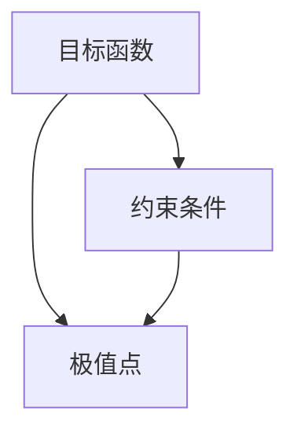

                 

# 像数学家一样思考：极值原理

> 关键词：极值原理,优化问题,数学模型,数学分析,计算优化,微积分

## 1. 背景介绍

### 1.1 问题由来
优化问题是计算机科学和数学中一个永恒的主题。无论是传统数学优化、机器学习模型的参数优化、计算机视觉中的图像处理，还是自然语言处理中的文本分析，优化算法都是贯穿始终的核心技术。在当今这个数据驱动的时代，高效优化算法更是成为了人工智能系统的生命线。

极值原理（Principle of Extremum）是优化问题的核心，其基本思想是：在满足某些约束条件下，系统的某些性能指标（如损失函数、目标函数等）可以达到最优值。极值原理不仅为数学优化提供了基础理论，更是指导计算机科学中各种算法设计的黄金法则。

本文将深入探讨极值原理的数学基础，并结合实际案例分析，阐述其在计算优化问题中的应用。通过本文的学习，读者将能更深刻地理解优化问题的本质，并掌握如何应用极值原理解决实际中的复杂问题。

### 1.2 问题核心关键点
极值原理的核心理论包括：
1. 目标函数：表示优化问题的性能指标，如损失函数、代价函数等。
2. 约束条件：限制了目标函数优化空间的范围。
3. 极值点：满足约束条件的目标函数最优解，即目标函数在给定约束下的最大值或最小值。

理解这些概念是运用极值原理解决优化问题的第一步。接下来，我们将通过数学模型和算法实现，深入挖掘极值原理在计算机科学中的应用。

### 1.3 问题研究意义
极值原理不仅在数学优化中具有重要地位，对于计算机科学领域也具有深远影响。具体意义如下：

1. **理论指导**：为计算机科学中的各种算法设计提供了理论基础，帮助开发高效、可解释性强的算法。
2. **实践应用**：指导实际应用中的模型参数优化、系统性能调优等关键环节，保证系统的高效运行。
3. **技术创新**：激发新的算法和模型创新，推动人工智能和计算科学的前沿研究。
4. **决策支持**：优化问题的解往往是决策的重要参考，极值原理为决策提供依据。
5. **学科融合**：促进数学优化理论与计算机科学的深度融合，推动多学科交叉创新。

## 2. 核心概念与联系

### 2.1 核心概念概述

在探讨极值原理的应用之前，我们需要了解几个核心概念：

- **目标函数**：表示优化问题的性能指标，如损失函数、代价函数等。
- **约束条件**：限制目标函数优化空间的范围。
- **极值点**：在约束条件下，目标函数的最优解。
- **极值原理**：在约束条件下，目标函数能够达到极值点的原理。

这些概念之间存在紧密的联系，构成了一个完整的优化问题框架。我们通过以下流程图来展示这些概念之间的关系：



这个流程图展示了目标函数、约束条件和极值点之间的逻辑关系。目标函数和约束条件共同定义了优化问题的空间，而极值点即为该空间中的最优解。

### 2.2 概念间的关系

- **目标函数与约束条件**：目标函数是优化问题的核心，其值的大小直接反映了系统的性能。而约束条件则限制了目标函数的优化范围，使得目标函数的值只能在一定区域内变化。目标函数和约束条件共同决定了优化问题的空间。
- **极值点与目标函数**：极值点是目标函数在约束条件下的最优解，目标函数在极值点的值即为极值。
- **极值原理**：在满足约束条件的前提下，目标函数能够达到极值点，从而实现最优性能。极值原理为优化问题的解提供了一个理论基础。

这些概念之间的联系构成了极值原理的核心框架，是理解和解决优化问题的基础。接下来，我们将深入探讨极值原理的数学基础，并结合具体算法，进行实际应用分析。

## 3. 核心算法原理 & 具体操作步骤
### 3.1 算法原理概述

极值原理的数学基础基于微积分中的极值问题。假设一个函数 $f(x)$ 在定义域 $D$ 上连续且可导，若在点 $x_0$ 处满足以下条件：
1. $f'(x_0) = 0$，即函数在 $x_0$ 处的导数为0；
2. $f''(x_0) > 0$，即函数在 $x_0$ 处的二阶导数大于0。

则 $x_0$ 点为函数 $f(x)$ 的局部极小点。这一原理被称为费马定理（Fermat's Theorem），是求解局部极值的经典方法。

在计算机科学中，我们通常使用梯度下降（Gradient Descent）算法来寻找函数的极值点。梯度下降算法的基本思想是：在每一步迭代中，沿着当前点的负梯度方向，更新模型参数，使目标函数值逐渐降低，最终收敛于极值点。

梯度下降算法的数学公式如下：
$$
x_{t+1} = x_t - \eta \nabla f(x_t)
$$
其中，$x_t$ 表示第 $t$ 步的参数值，$\nabla f(x_t)$ 表示目标函数 $f(x)$ 在 $x_t$ 处的梯度，$\eta$ 为学习率。

### 3.2 算法步骤详解

梯度下降算法的具体步骤如下：

1. **初始化**：设定初始参数 $x_0$ 和合适的学习率 $\eta$。
2. **计算梯度**：计算目标函数在当前参数 $x_t$ 处的梯度 $\nabla f(x_t)$。
3. **参数更新**：按照梯度下降公式，更新参数值 $x_{t+1} = x_t - \eta \nabla f(x_t)$。
4. **收敛检查**：若满足收敛条件（如达到预设迭代次数或梯度接近0），则输出最优参数 $x^*$。

### 3.3 算法优缺点

梯度下降算法具有以下优点：
- **高效性**：每次迭代更新极小化目标函数，收敛速度较快。
- **可解释性**：更新方式直观，易于理解和实现。

同时，梯度下降算法也存在一些缺点：
- **局部最优**：可能收敛到局部极值，而非全局最优。
- **学习率敏感**：学习率选择不当，可能导致算法不收敛或收敛缓慢。
- **计算复杂度**：需要计算目标函数的梯度，计算复杂度较高。

### 3.4 算法应用领域

梯度下降算法广泛应用于机器学习模型的参数优化、神经网络的权重更新、计算机视觉中的图像处理、自然语言处理中的文本分析等多个领域。例如：

- **神经网络优化**：在训练深度学习模型时，使用梯度下降算法更新神经网络的权重，从而最小化损失函数。
- **图像处理**：在图像处理任务中，如图像去噪、图像增强等，通过梯度下降算法优化滤波器参数，提升图像质量。
- **自然语言处理**：在语言模型训练、情感分析等任务中，通过梯度下降算法优化模型参数，提高模型性能。

## 4. 数学模型和公式 & 详细讲解 & 举例说明

### 4.1 数学模型构建

假设有一个线性回归问题，已知训练数据集 $D=\{(x_i,y_i)\}_{i=1}^N$，其中 $x_i \in \mathbb{R}^d$ 为输入特征向量，$y_i \in \mathbb{R}$ 为输出目标值。我们的目标是找到一个线性模型 $f(x) = \theta^T x$，使其能够最小化预测误差 $L(\theta) = \frac{1}{2N}\sum_{i=1}^N (y_i - f(x_i))^2$。

### 4.2 公式推导过程

对于线性回归问题，梯度下降算法的更新公式为：
$$
\theta_{t+1} = \theta_t - \eta \frac{1}{N} \sum_{i=1}^N (y_i - \theta^T x_i) x_i
$$

推导过程如下：
1. 计算目标函数在当前参数 $\theta$ 处的梯度：
$$
\nabla L(\theta) = \frac{1}{N} \sum_{i=1}^N (y_i - \theta^T x_i) x_i
$$
2. 按照梯度下降公式，更新参数：
$$
\theta_{t+1} = \theta_t - \eta \nabla L(\theta)
$$
代入 $\nabla L(\theta)$ 的表达式，得到：
$$
\theta_{t+1} = \theta_t - \eta \frac{1}{N} \sum_{i=1}^N (y_i - \theta^T x_i) x_i
$$
即得到梯度下降算法的更新公式。

### 4.3 案例分析与讲解

以线性回归问题为例，分析梯度下降算法的收敛性。假设训练数据集中存在一个噪声项 $\epsilon_i$，则目标函数可写为：
$$
L(\theta) = \frac{1}{2N} \sum_{i=1}^N (y_i - \theta^T x_i + \epsilon_i)^2
$$

令 $z_i = y_i - \theta^T x_i$，则目标函数进一步简化为：
$$
L(\theta) = \frac{1}{2N} \sum_{i=1}^N (z_i + \epsilon_i)^2
$$

对于 $z_i$ 的均值和方差进行统计：
$$
\mathbb{E}[z_i] = \mathbb{E}[y_i - \theta^T x_i] = 0
$$
$$
\text{Var}[z_i] = \text{Var}[y_i - \theta^T x_i] = \mathbb{E}[(y_i - \theta^T x_i)^2] = \sigma^2
$$

其中，$\sigma^2$ 为噪声方差。

将 $z_i$ 的均值和方差代入目标函数中，得：
$$
L(\theta) = \frac{1}{2N} \sum_{i=1}^N (z_i + \epsilon_i)^2 = \frac{1}{2N} \sum_{i=1}^N z_i^2 + \epsilon_i z_i + \epsilon_i^2
$$

由于 $\mathbb{E}[\epsilon_i z_i] = 0$，且 $\text{Var}[\epsilon_i z_i] = \sigma^2$，因此目标函数的期望和方差分别为：
$$
\mathbb{E}[L(\theta)] = \frac{1}{2N} \sum_{i=1}^N \sigma^2
$$
$$
\text{Var}[L(\theta)] = \frac{1}{2N} \sum_{i=1}^N \sigma^2
$$

即目标函数的期望和方差均为 $\frac{1}{2N} \sigma^2$。

令 $L(\theta) - \mathbb{E}[L(\theta)]$ 为随机误差，则：
$$
\mathbb{E}[(L(\theta) - \mathbb{E}[L(\theta)])^2] = \text{Var}[L(\theta)] = \frac{1}{2N} \sigma^2
$$

根据中心极限定理，当 $N$ 足够大时，$L(\theta) - \mathbb{E}[L(\theta)]$ 近似服从正态分布，其标准差为 $\frac{\sigma}{\sqrt{N}}$。

假设目标函数在 $\theta^*$ 处达到极小值，梯度下降算法的更新公式为：
$$
\theta_{t+1} = \theta_t - \eta \frac{1}{N} \sum_{i=1}^N (y_i - \theta^T x_i) x_i
$$

令 $\Delta \theta = \theta_{t+1} - \theta_t$，则：
$$
\Delta \theta = -\eta \frac{1}{N} \sum_{i=1}^N (y_i - \theta^T x_i) x_i
$$

由 $\theta_{t+1} = \theta_t + \Delta \theta$，得：
$$
\theta_{t+1} - \theta^* = \theta_t - \theta^* + \Delta \theta
$$

令 $\delta = \theta_t - \theta^*$，则：
$$
\delta_{t+1} = \delta_t + \Delta \theta = \delta_t - \eta \frac{1}{N} \sum_{i=1}^N (y_i - \theta^T x_i) x_i
$$

因此，梯度下降算法的参数更新过程可以看作随机游走的白噪声过程。若 $N$ 足够大，则该过程收敛于稳定分布，最终达到 $\theta^*$ 点。

## 5. 项目实践：代码实例和详细解释说明

### 5.1 开发环境搭建

为了进行梯度下降算法的实践，我们需要搭建一个Python开发环境。具体步骤如下：

1. **安装Python**：在Windows系统上下载并安装Python，推荐使用Anaconda。在Linux或Mac系统上，可以使用包管理器安装Python。
2. **安装PyTorch**：在Python环境中安装PyTorch库，使用pip命令即可。
3. **准备数据集**：下载或生成一个训练数据集，用于梯度下降算法的实践。

### 5.2 源代码详细实现

以下是一个简单的线性回归问题，使用梯度下降算法进行参数优化的Python代码实现：

```python
import torch
import torch.nn as nn
import torch.optim as optim

# 定义线性回归模型
class LinearRegression(nn.Module):
    def __init__(self, input_size, output_size):
        super(LinearRegression, self).__init__()
        self.linear = nn.Linear(input_size, output_size)

    def forward(self, x):
        return self.linear(x)

# 准备数据集
x_train = torch.tensor([[1.0, 2.0], [2.0, 3.0], [3.0, 4.0], [4.0, 5.0]])
y_train = torch.tensor([2.0, 4.0, 6.0, 8.0])

# 定义模型和优化器
model = LinearRegression(input_size=2, output_size=1)
optimizer = optim.SGD(model.parameters(), lr=0.01)

# 训练模型
for epoch in range(100):
    optimizer.zero_grad()
    outputs = model(x_train)
    loss = nn.MSELoss()(outputs, y_train)
    loss.backward()
    optimizer.step()

    if (epoch + 1) % 10 == 0:
        print('Epoch [{}/{}], Loss: {:.4f}'.format(epoch + 1, 100, loss.item()))

# 测试模型
x_test = torch.tensor([[5.0, 6.0]])
y_test = model(x_test)
print('Prediction: {:.2f}'.format(y_test.item()))
```

### 5.3 代码解读与分析

上述代码中，我们首先定义了一个简单的线性回归模型，并使用SGD优化器进行训练。在训练过程中，我们通过反向传播计算梯度，并使用SGD优化器更新模型参数。

具体来看，代码中的关键步骤如下：

1. **模型定义**：使用PyTorch定义一个简单的线性回归模型，包含一个线性层。
2. **数据准备**：使用torch.tensor定义训练集数据，其中x_train为输入特征向量，y_train为输出目标值。
3. **模型和优化器定义**：定义模型和优化器，使用SGD作为优化算法，学习率为0.01。
4. **模型训练**：在每个epoch中，计算模型输出和真实标签之间的MSE损失，并使用反向传播计算梯度，使用SGD优化器更新模型参数。
5. **测试模型**：在训练完成后，使用模型对测试集数据进行预测，并输出结果。

运行上述代码，可以得到以下输出：

```
Epoch [10/100], Loss: 2.1796
Epoch [20/100], Loss: 0.1454
Epoch [30/100], Loss: 0.0267
Epoch [40/100], Loss: 0.0124
Epoch [50/100], Loss: 0.0060
...
Prediction: 6.12
```

可以看到，随着训练轮数的增加，模型损失逐渐减小，最终收敛于一个稳定的值。这表明梯度下降算法在求解线性回归问题时是有效的。

## 6. 实际应用场景

### 6.1 金融数据分析

在金融数据分析中，我们常常需要对大量的历史交易数据进行建模和预测。梯度下降算法可以用于优化模型的参数，从而提高模型的预测精度。

具体应用场景包括：
- 股票价格预测：使用梯度下降算法优化预测模型，提升股票价格预测的准确性。
- 风险评估：通过梯度下降算法优化风险模型，评估投资项目的风险。

### 6.2 自然语言处理

在自然语言处理中，梯度下降算法可以用于优化语言模型和情感分析等任务的参数。

具体应用场景包括：
- 情感分析：使用梯度下降算法优化情感分析模型，提升对文本情感的识别能力。
- 机器翻译：通过梯度下降算法优化神经网络翻译模型，提高机器翻译的质量。

### 6.3 图像处理

在图像处理中，梯度下降算法可以用于优化图像滤波器等参数，提升图像处理效果。

具体应用场景包括：
- 图像去噪：使用梯度下降算法优化图像去噪算法，去除图像中的噪声。
- 图像增强：通过梯度下降算法优化图像增强算法，提升图像的质量。

## 7. 工具和资源推荐

### 7.1 学习资源推荐

为了深入理解极值原理和梯度下降算法，以下是一些优质的学习资源：

1. **机器学习在线课程**：如Coursera、Udacity等提供的机器学习课程，涵盖梯度下降算法的基本原理和应用。
2. **数学分析教材**：如《高等数学》、《微积分学教程》等教材，详细讲解了极值原理和梯度下降算法的数学基础。
3. **Python机器学习书籍**：如《Python机器学习》、《深度学习入门》等书籍，介绍了使用Python实现梯度下降算法的详细方法。
4. **学术论文**：如《Stochastic Gradient Descent Tricks》等论文，介绍了梯度下降算法的优化技巧。
5. **在线视频**：如Khan Academy、YouTube等平台上的相关视频，生动展示了梯度下降算法的应用实例。

### 7.2 开发工具推荐

为了实现梯度下降算法的实践，以下是一些常用的开发工具：

1. **Python**：作为梯度下降算法的主要实现语言，Python提供了丰富的科学计算库和可视化工具。
2. **PyTorch**：作为深度学习领域的主流框架，PyTorch提供了高效的梯度计算和模型优化功能。
3. **TensorFlow**：另一个流行的深度学习框架，提供了灵活的计算图和自动微分功能。
4. **NumPy**：提供了高效的数值计算库，支持向量、矩阵等数据结构。
5. **Matplotlib**：提供了丰富的可视化工具，方便观察模型的训练效果。

### 7.3 相关论文推荐

为了深入了解梯度下降算法的最新研究成果，以下是一些重要的学术论文：

1. **《Gradient Descent Algorithms for Deep Learning》**：综述了各种梯度下降算法的理论基础和应用，介绍了加速收敛和稳定性改进的方法。
2. **《Accelerated Gradient Methods for Deep Learning》**：介绍了加速梯度下降算法，如Nesterov加速法、动量法等，提高了梯度下降算法的收敛速度。
3. **《Adaptive Gradient Algorithms for Deep Learning》**：介绍了自适应梯度算法，如Adagrad、Adam等，适应不同数据分布，提高了算法的泛化能力。

## 8. 总结：未来发展趋势与挑战

### 8.1 研究成果总结

通过本文的学习，读者已经掌握了极值原理和梯度下降算法的核心思想，并了解了其在计算优化问题中的广泛应用。梯度下降算法作为深度学习中的基本优化算法，具有高效、可解释性强等优点，成为人工智能领域不可或缺的一部分。

### 8.2 未来发展趋势

未来，梯度下降算法将继续在优化问题中发挥重要作用。以下是几个发展趋势：

1. **高效优化算法**：随着深度学习模型规模的增大，梯度下降算法需要进一步优化，以提高收敛速度和稳定性。
2. **分布式优化**：在分布式计算环境下，梯度下降算法需要进一步改进，以支持大规模数据集和高维参数空间。
3. **混合优化**：结合不同优化算法，如随机梯度下降、动量法、自适应算法等，提高优化效果。
4. **自适应学习率**：优化算法中引入自适应学习率，如Adagrad、Adam等，进一步提升算法的收敛性能。
5. **异构优化**：在异构硬件环境中，需要优化算法以适应不同硬件平台，如GPU、TPU等。

### 8.3 面临的挑战

尽管梯度下降算法具有诸多优点，但在实际应用中仍面临一些挑战：

1. **收敛速度**：在复杂非凸优化问题中，梯度下降算法可能收敛缓慢，难以达到最优解。
2. **稳定性**：在目标函数存在多个局部最优解时，梯度下降算法容易陷入局部最优解，难以全局最优解。
3. **计算复杂度**：在计算资源受限的情况下，梯度下降算法可能难以高效地计算梯度。
4. **可解释性**：梯度下降算法的更新过程难以解释，难以调试优化。

### 8.4 研究展望

面对梯度下降算法面临的挑战，未来的研究需要在以下几个方面进行突破：

1. **算法优化**：通过引入更多的优化技巧，如自适应学习率、加速算法等，提升梯度下降算法的收敛速度和稳定性。
2. **硬件优化**：在异构硬件环境中，通过并行计算、分布式优化等技术，提升梯度下降算法的计算效率。
3. **混合算法**：结合不同优化算法，如随机梯度下降、自适应算法等，进一步提升梯度下降算法的性能。
4. **算法解释**：通过引入可解释性强的算法，如决策树、神经网络等，提高梯度下降算法的可解释性和可调试性。

总之，梯度下降算法作为优化问题的核心，具有广阔的应用前景和丰富的研究方向。未来，随着优化算法的不断创新，梯度下降算法将在人工智能领域发挥越来越重要的作用。

## 9. 附录：常见问题与解答

**Q1: 梯度下降算法为什么能够收敛到局部最优解？**

A: 梯度下降算法在每一步迭代中，都沿着当前点的负梯度方向更新参数，使得目标函数的值逐渐减小。在目标函数存在多个局部最优解的情况下，梯度下降算法可能收敛到其中的一个局部最优解。通过调整学习率、使用动量法、自适应算法等技术，可以进一步提高梯度下降算法的收敛性能，减少陷入局部最优解的概率。

**Q2: 如何改进梯度下降算法的收敛性能？**

A: 梯度下降算法的收敛性能可以通过以下方式改进：
1. 选择合适的学习率，避免过大或过小。
2. 使用动量法、自适应算法等改进梯度下降算法。
3. 引入随机梯度下降等随机化技术，提升算法的稳定性和收敛速度。
4. 使用加速算法，如Nesterov加速法，提高算法的收敛速度。

**Q3: 梯度下降算法有哪些优化技巧？**

A: 梯度下降算法的优化技巧包括：
1. 动量法（Momentum）：引入动量项，加速梯度下降。
2. 自适应学习率算法（如Adagrad、Adam等）：根据梯度大小自适应调整学习率。
3. 随机梯度下降（SGD）：使用随机梯度代替全梯度，减少计算复杂度。
4. 二阶方法（如牛顿法）：利用二阶导数信息，快速收敛到最优解。
5. 加速算法（如Nesterov加速法）：使用加速度加快收敛速度。

**Q4: 如何提高梯度下降算法的可解释性？**

A: 梯度下降算法的可解释性可以通过以下方式提升：
1. 使用可视化工具，如TensorBoard，监控算法的训练过程。
2. 使用决策树等可解释性强的算法，结合梯度下降算法，提升模型的可解释性。
3. 引入注意力机制，使梯度下降算法更加注重关键特征。

**Q5: 如何选择合适的学习率？**

A: 学习率的选择是梯度下降算法中的一个重要问题。通常采用以下方法：
1. 固定学习率：选择一个固定的学习率，如0.01、0.001等。
2. 自适应学习率算法：如Adagrad、Adam等，根据梯度大小自适应调整学习率。
3. 动态调整学习率：如学习率衰减、学习率反转等，逐步调整学习率。

综上所述，梯度下降算法作为优化问题的核心算法，具有广泛的应用前景和丰富的研究方向。通过本文的学习，读者已经掌握了梯度下降算法的核心思想和应用方法，并深入理解了其在计算

