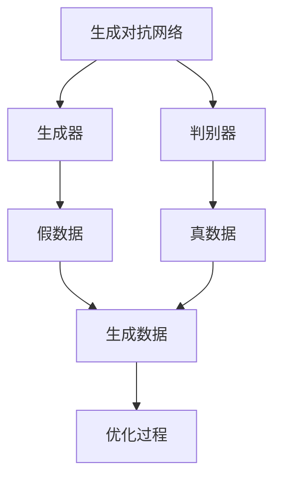
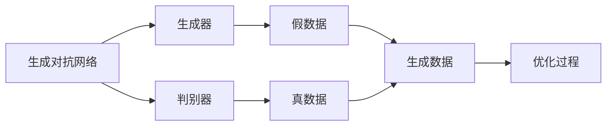
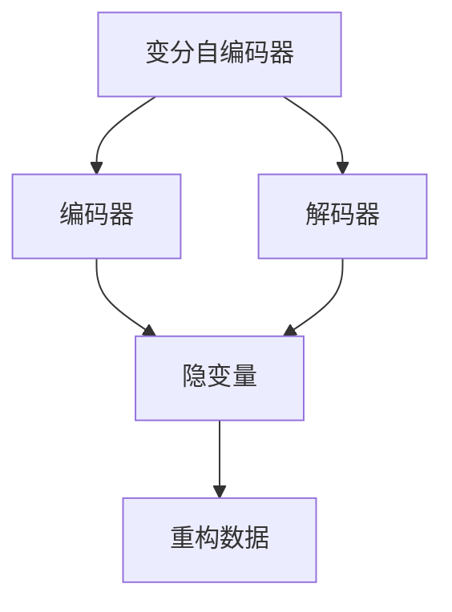
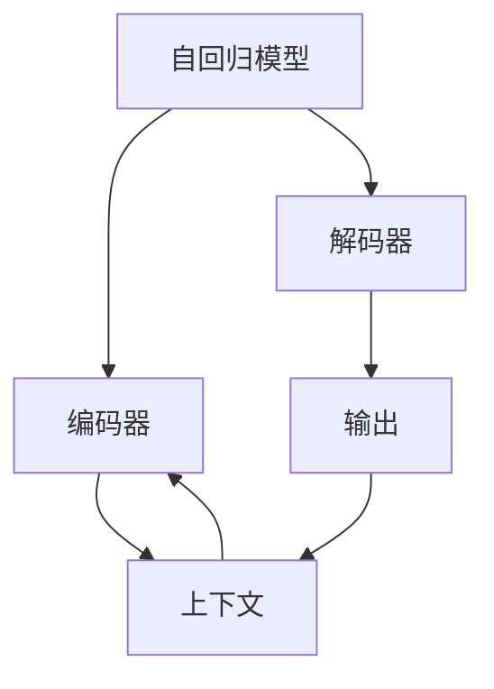
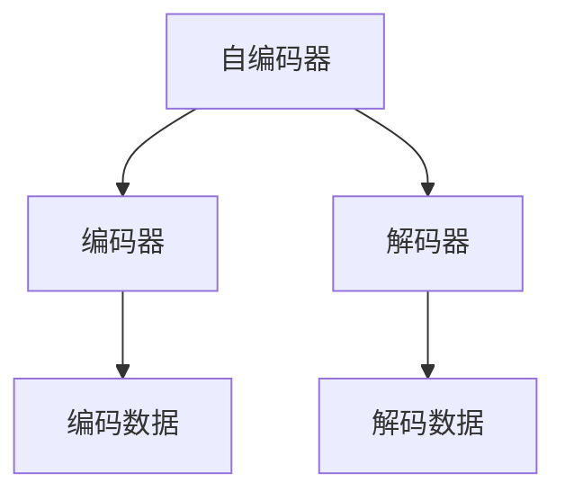
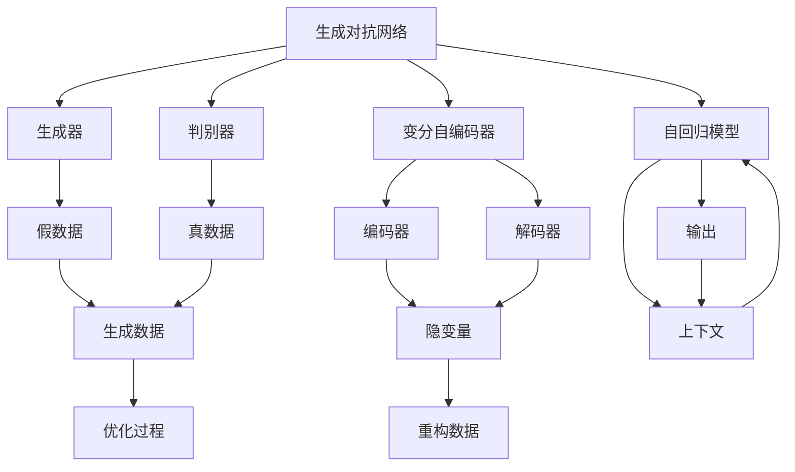

                 

# 全球范围内掀起生成式AI浪潮

## 1. 背景介绍

### 1.1 问题由来
近年来，随着深度学习技术的快速发展，生成式人工智能（Generative AI）已经成为人工智能领域的一个热门话题。生成式AI技术，特别是生成对抗网络（GANs）和变分自编码器（VAEs），使得生成高质量的人工图像、文本、音频等内容成为可能。这些技术的突破不仅推动了艺术创作、内容生成、游戏开发等领域的创新，还逐渐渗透到教育、医疗、金融等多个行业，为社会带来深刻变革。

### 1.2 问题核心关键点
生成式AI的核心在于通过训练模型，使其能够生成与真实数据高度相似的新数据。其核心算法包括生成对抗网络（GANs）和变分自编码器（VAEs）。GANs通过生成器和判别器之间的对抗学习，生成与真实数据相似的新数据；VAEs则通过变分推断，将数据映射到一个低维隐变量空间，从而进行数据生成和重构。

生成式AI技术的快速发展，离不开其在图像生成、自然语言处理、音乐生成等多个领域的应用。图像生成领域中的GANs，能够生成高质量、高逼真度的图像，广泛应用于艺术创作、游戏开发等场景；自然语言处理领域的VAEs，能够生成连贯、语法正确的文本，推动了内容生成、机器翻译等技术的发展；音乐生成领域的生成模型，能够创作出具有情感、风格的多样化音乐作品，为音乐创作和娱乐产业注入新活力。

生成式AI技术的出现，使得AI不再只是数据的处理工具，而是成为能够生成新数据的"创作者"。这一转变，预示着AI将更加深入地融入各行各业，带来更深层次的智能化变革。

### 1.3 问题研究意义
生成式AI技术的研究和应用，对于推动人工智能技术的普及和落地具有重要意义：

1. **降低创作门槛**：生成式AI能够自动生成高质量内容，降低创作者的技术门槛，激发更多人的创造力。
2. **提升创作效率**：通过自动生成内容，大大提高内容创作的效率，缩短创作周期。
3. **拓展应用范围**：生成式AI技术可以应用于多个行业，推动各行业的数字化转型和智能化升级。
4. **促进跨学科融合**：生成式AI技术的发展，促进了不同学科之间的融合，加速了科学创新和技术突破。
5. **赋能艺术与娱乐产业**：生成式AI技术为艺术创作、音乐、电影等行业带来新工具和新方法，推动这些产业的繁荣发展。

## 2. 核心概念与联系

### 2.1 核心概念概述

为更好地理解生成式AI的核心概念，本节将介绍几个密切相关的核心概念：

- 生成对抗网络（GANs）：一种通过生成器和判别器之间对抗学习的生成模型。生成器生成假数据，判别器区分假数据与真数据，两者通过反复迭代，逐步提升生成质量。
- 变分自编码器（VAEs）：一种通过变分推断学习隐变量分布的生成模型。VAEs将数据映射到一个低维隐变量空间，从而进行数据生成和重构。
- 自回归模型（AR）：一种通过前文信息预测当前文字的生成模型。常见的自回归模型包括RNN、LSTM、Transformer等。
- 自编码器（AE）：一种通过编码器-解码器结构进行数据重构的生成模型。自编码器通过学习输入与输出之间的映射关系，实现数据压缩和重构。
- 变分自编码器（VAEs）：一种基于自编码器的生成模型，通过学习数据在隐变量空间中的分布，实现高质量的数据生成。

这些核心概念之间的逻辑关系可以通过以下Mermaid流程图来展示：



这个流程图展示了GANs的基本原理，即生成器生成假数据，判别器区分假数据与真数据，两者通过对抗学习不断提升生成质量。

### 2.2 概念间的关系

这些核心概念之间存在着紧密的联系，形成了生成式AI的整体框架。下面我们通过几个Mermaid流程图来展示这些概念之间的关系。

#### 2.2.1 生成对抗网络



这个流程图展示了GANs的基本原理，即生成器生成假数据，判别器区分假数据与真数据，两者通过对抗学习不断提升生成质量。

#### 2.2.2 变分自编码器



这个流程图展示了VAEs的基本原理，即通过编码器将数据映射到隐变量空间，通过解码器将隐变量映射回数据空间，从而实现数据生成和重构。

#### 2.2.3 自回归模型



这个流程图展示了AR模型的基本原理，即通过编码器-解码器结构，利用上下文信息预测当前单词或像素，实现序列生成或图像生成。

#### 2.2.4 自编码器



这个流程图展示了AE模型的基本原理，即通过编码器将输入数据压缩为隐变量，通过解码器将隐变量重构为输出数据，从而实现数据重构。

### 2.3 核心概念的整体架构

最后，我们用一个综合的流程图来展示这些核心概念在生成式AI中的整体架构：



这个综合流程图展示了生成式AI中的多个核心概念及其之间的联系。通过这些概念，我们可以更好地理解生成式AI的基本原理和应用场景。

## 3. 核心算法原理 & 具体操作步骤
### 3.1 算法原理概述

生成式AI的核心算法包括生成对抗网络（GANs）和变分自编码器（VAEs）。本节将详细解释这两种算法的原理。

#### 3.1.1 生成对抗网络（GANs）

生成对抗网络由生成器和判别器两部分组成，通过对抗学习的方式，不断提升生成器生成数据的逼真度。

生成器的目标是从随机噪声中生成与真实数据相似的数据。生成器的输入是一个随机向量 $z$，通过多层神经网络映射到输出数据 $x$。

判别器的目标是将生成器生成的数据与真实数据区分开来。判别器输入为数据 $x$，输出一个概率值，表示 $x$ 是真实数据的可能性。

生成器和判别器通过对抗学习的方式进行训练。生成器希望欺骗判别器，使其认为生成的数据是真实数据；判别器希望区分真实数据和生成数据。两者之间的对抗不断进行，最终生成器能够生成与真实数据相似的数据。

#### 3.1.2 变分自编码器（VAEs）

变分自编码器通过学习数据在隐变量空间中的分布，实现数据生成和重构。

编码器的目标是将输入数据 $x$ 映射到一个低维隐变量 $z$。编码器输出隐变量 $z$，并通过解码器将隐变量 $z$ 重构为输出数据 $x'$。

VAEs通过优化变分下界来训练模型。变分下界的目标是最大化 $p(z)$，即隐变量的分布概率，同时最大化 $p(x'|z)$，即隐变量在解码器输出上的概率。

变分推断是通过最大化 $p(z|x)$，即在给定数据 $x$ 的情况下，隐变量的概率分布。通过最大化变分下界，VAEs可以实现高质量的数据生成和重构。

### 3.2 算法步骤详解

#### 3.2.1 生成对抗网络（GANs）

1. **初始化生成器和判别器**：随机初始化生成器和判别器的权重。
2. **训练生成器**：使用判别器作为标签，训练生成器生成逼真数据。
3. **训练判别器**：使用生成器生成的数据和真实数据作为标签，训练判别器区分数据。
4. **迭代优化**：不断优化生成器和判别器，直到生成器生成的数据逼真度达到目标。

#### 3.2.2 变分自编码器（VAEs）

1. **初始化编码器和解码器**：随机初始化编码器和解码器的权重。
2. **训练编码器**：将数据 $x$ 映射到隐变量 $z$。
3. **训练解码器**：将隐变量 $z$ 重构为数据 $x'$。
4. **优化变分下界**：最大化 $p(z)$ 和 $p(x'|z)$，最小化重构误差和隐变量分布的KL散度。
5. **迭代优化**：不断优化编码器和解码器，直到数据生成和重构质量达到目标。

### 3.3 算法优缺点

生成式AI技术在生成高质量数据方面具有显著优势，但也存在一些缺点：

#### 优点

1. **生成高质量数据**：生成式AI能够生成与真实数据高度相似的新数据，广泛应用于艺术创作、内容生成等领域。
2. **数据增强**：生成式AI可以生成大量虚拟数据，用于数据增强，提升模型性能。
3. **多模态生成**：生成式AI可以生成多种类型的数据，如图像、文本、音频等，促进多模态数据融合。

#### 缺点

1. **生成样本多样性不足**：生成式AI生成的数据往往缺乏多样性，难以覆盖所有数据分布。
2. **生成样本质量不稳定**：生成式AI生成的数据质量受训练数据和超参数的影响较大，质量不稳定。
3. **对抗攻击易受攻击**：生成式AI生成的数据可能受到对抗攻击，生成错误的数据。

### 3.4 算法应用领域

生成式AI技术已经在多个领域得到了广泛应用，涵盖了艺术创作、内容生成、图像处理、自然语言处理等多个方向。

#### 3.4.1 艺术创作

生成式AI技术在艺术创作领域取得了显著成果。例如，通过GANs生成的高质量图像和视频，可以用于电影特效、游戏开发等场景。通过VAEs生成的音乐和艺术作品，可以用于音乐创作、艺术展览等。

#### 3.4.2 内容生成

生成式AI技术能够自动生成高质量的文本、图片、音频等内容，广泛应用于内容生成、广告制作等领域。例如，通过GANs生成的逼真图像，可以用于广告创意设计；通过VAEs生成的文本，可以用于自动摘要、机器翻译等。

#### 3.4.3 图像处理

生成式AI技术可以生成高质量的图像，广泛应用于医学影像、遥感图像等领域。例如，通过GANs生成的高质量医学影像，可以辅助医生进行诊断；通过VAEs生成的高分辨率图像，可以用于遥感数据分析等。

#### 3.4.4 自然语言处理

生成式AI技术可以生成连贯、语法正确的文本，广泛应用于机器翻译、摘要生成等领域。例如，通过VAEs生成的摘要，可以用于新闻文章的自动化生成；通过GANs生成的对话，可以用于智能客服系统等。

## 4. 数学模型和公式 & 详细讲解  
### 4.1 数学模型构建

生成式AI技术的数学模型主要基于生成对抗网络和变分自编码器两种框架。下面将详细解释这两种模型的数学模型构建。

#### 4.1.1 生成对抗网络（GANs）

GANs的数学模型包括生成器和判别器两部分。生成器 $G$ 的数学模型为：

$$
G(z) = \mu(G) + \sigma(G)z
$$

其中，$\mu(G)$ 和 $\sigma(G)$ 分别为生成器 $G$ 的均值和标准差，$z$ 为随机向量。

判别器 $D$ 的数学模型为：

$$
D(x) = \mu(D) + \sigma(D)\sqrt{1 + \epsilon(x)}
$$

其中，$\epsilon(x)$ 为判别器 $D$ 的激活函数，$\mu(D)$ 和 $\sigma(D)$ 分别为判别器 $D$ 的均值和标准差，$x$ 为输入数据。

GANs的目标函数为：

$$
\mathcal{L}_{GAN}(G, D) = \mathbb{E}_{x \sim p_{data}}[D(x)] - \mathbb{E}_{z \sim p(z)}[D(G(z))]
$$

其中，$p_{data}$ 为真实数据的分布，$p(z)$ 为随机向量的分布。

#### 4.1.2 变分自编码器（VAEs）

VAEs的数学模型包括编码器 $E$、解码器 $D$ 和变分推断部分。编码器 $E$ 的数学模型为：

$$
\mu(E) + \sigma(E)z
$$

其中，$\mu(E)$ 和 $\sigma(E)$ 分别为编码器 $E$ 的均值和标准差，$z$ 为隐变量。

解码器 $D$ 的数学模型为：

$$
D(z) = \mu(D) + \sigma(D)w
$$

其中，$\mu(D)$ 和 $\sigma(D)$ 分别为解码器 $D$ 的均值和标准差，$w$ 为解码器输出。

VAEs的目标函数为：

$$
\mathcal{L}_{VAE}(E, D, q(z|x)) = \mathbb{E}_{z \sim q(z|x)}[\mathbb{E}_{z \sim p(z)}[\log p(x'|z)] - \log p(x'|z) + \frac{\beta}{2}(KL(q(z|x) || p(z))]
$$

其中，$p(x'|z)$ 为解码器输出的概率分布，$q(z|x)$ 为变分推断的隐变量分布，$KL(q(z) || p(z))$ 为隐变量分布的KL散度。

### 4.2 公式推导过程

#### 4.2.1 生成对抗网络（GANs）

生成对抗网络的公式推导过程如下：

1. **生成器损失函数**：

$$
\mathcal{L}_G = -\mathbb{E}_{z \sim p(z)}[\log D(G(z))]
$$

其中，$p(z)$ 为随机向量的分布。

2. **判别器损失函数**：

$$
\mathcal{L}_D = -\mathbb{E}_{x \sim p_{data}}[\log D(x)] + \mathbb{E}_{z \sim p(z)}[\log (1 - D(G(z))]
$$

其中，$p_{data}$ 为真实数据的分布。

3. **对抗损失函数**：

$$
\mathcal{L}_{GAN} = \mathcal{L}_G + \mathcal{L}_D
$$

其中，$\mathcal{L}_G$ 和 $\mathcal{L}_D$ 分别为生成器和判别器的损失函数。

#### 4.2.2 变分自编码器（VAEs）

变分自编码器的公式推导过程如下：

1. **编码器损失函数**：

$$
\mathcal{L}_E = \mathbb{E}_{z \sim q(z|x)}[\log p(x'|z)] - \log p(x'|z) + \frac{\beta}{2}(KL(q(z|x) || p(z)))
$$

其中，$p(x'|z)$ 为解码器输出的概率分布，$q(z|x)$ 为变分推断的隐变量分布，$KL(q(z) || p(z))$ 为隐变量分布的KL散度。

2. **解码器损失函数**：

$$
\mathcal{L}_D = \mathbb{E}_{z \sim q(z|x)}[\log p(x'|z)] - \log p(x'|z)
$$

其中，$p(x'|z)$ 为解码器输出的概率分布。

3. **VAEs总损失函数**：

$$
\mathcal{L}_{VAE} = \mathcal{L}_E + \mathcal{L}_D
$$

其中，$\mathcal{L}_E$ 和 $\mathcal{L}_D$ 分别为编码器和解码器的损失函数。

### 4.3 案例分析与讲解

#### 4.3.1 生成对抗网络（GANs）

GANs的案例分析：

1. **DCGAN**：DCGAN（Deep Convolutional GANs）是一种基于卷积神经网络的生成对抗网络。它使用卷积层代替全连接层，生成高质量的图像。

2. **CycleGAN**：CycleGAN是一种可以学习跨域映射的生成对抗网络，可以实现不同数据域之间的图像转换。

#### 4.3.2 变分自编码器（VAEs）

VAEs的案例分析：

1. **CVAE**：CVAE（Conditional Variational Autoencoder）是一种带有条件输入的变分自编码器，可以生成与条件相关的数据。

2. **Beta-VAE**：Beta-VAE是一种优化变分下界的变分自编码器，可以生成具有多样性的数据。

## 5. 项目实践：代码实例和详细解释说明
### 5.1 开发环境搭建

在进行生成式AI项目实践前，我们需要准备好开发环境。以下是使用Python进行PyTorch开发的环境配置流程：

1. 安装Anaconda：从官网下载并安装Anaconda，用于创建独立的Python环境。

2. 创建并激活虚拟环境：
```bash
conda create -n pytorch-env python=3.8 
conda activate pytorch-env
```

3. 安装PyTorch：根据CUDA版本，从官网获取对应的安装命令。例如：
```bash
conda install pytorch torchvision torchaudio cudatoolkit=11.1 -c pytorch -c conda-forge
```

4. 安装TensorFlow：
```bash
pip install tensorflow
```

5. 安装TensorBoard：
```bash
pip install tensorboard
```

6. 安装transformers库：
```bash
pip install transformers
```

完成上述步骤后，即可在`pytorch-env`环境中开始生成式AI实践。

### 5.2 源代码详细实现

这里我们以GANs的图像生成为例，给出使用PyTorch实现DCGAN的代码实现。

首先，定义GANs的生成器和判别器：

```python
import torch
import torch.nn as nn
import torch.nn.functional as F

class Generator(nn.Module):
    def __init__(self):
        super(Generator, self).__init__()
        self.model = nn.Sequential(
            nn.Linear(100, 256),
            nn.LeakyReLU(0.2, inplace=True),
            nn.Linear(256, 512),
            nn.BatchNorm1d(512),
            nn.LeakyReLU(0.2, inplace=True),
            nn.Linear(512, 1024),
            nn.BatchNorm1d(1024),
            nn.LeakyReLU(0.2, inplace=True),
            nn.Linear(1024, 3 * 64 * 64),
            nn.Tanh()
        )

    def forward(self, x):
        x = self.model(x)
        x = x.view(x.size(0), 3, 64, 64)
        return x

class Discriminator(nn.Module):
    def __init__(self):
        super(Discriminator, self).__init__()
        self.model = nn.Sequential(
            nn.Conv2d(3, 64, 4, 2, 1),
            nn.LeakyReLU(0.2, inplace=True),
            nn.Conv2d(64, 128, 4, 2, 1),
            nn.LeakyReLU(0.2, inplace=True),
            nn.Conv2d(128, 256, 4, 2, 1),
            nn.LeakyReLU(0.2, inplace=True),
            nn.Conv2d(256, 1, 4, 1, 0),
            nn.Sigmoid()
        )

    def forward(self, x):
        x = self.model(x)
        return x.view(x.size(0))
```

然后，定义GANs的训练函数：

```python
import torch.optim as optim

def train_gan(generator, discriminator, data_loader, num_epochs, batch_size):
    device = torch.device('cuda' if torch.cuda.is_available() else 'cpu')
    generator.to(device)
    discriminator.to(device)

    for epoch in range(num_epochs):
        for i, (images, _) in enumerate(data_loader):
            images = images.to(device)

            # 训练判别器
            discriminator.zero_grad()
            real_images = images.view(-1, 3, 64, 64)
            fake_images = generator(torch.randn(batch_size, 100).to(device))
            real_labels = torch.ones(batch_size, 1).to(device)
            fake_labels = torch.zeros(batch_size, 1).to(device)

            disc_real = discriminator(real_images)
            disc_fake = discriminator(fake_images)
            d_loss = -torch.mean(torch.log(disc_real) + torch.log(1 - disc_fake))

            d_loss.backward()
            discriminator_optimizer.step()

            # 训练生成器
            generator.zero_grad()
            disc_fake = discriminator(fake_images)
            g_loss = -torch.mean(torch.log(disc_fake))

            g_loss.backward()
            generator_optimizer.step()

        if (i + 1) % 100 == 0:
            print('Epoch [{}/{}], Step [{}/{}], d_loss: {:.4f}, g_loss: {:.4f}'
                  .format(epoch + 1, num_epochs, i + 1, len(data_loader), d_loss.item(), g_loss.item()))
```

最后，启动GANs的训练流程：

```python
import os
from torchvision import datasets, transforms

# 设置数据集路径和转换
data_path = '/path/to/cifar10'
transform = transforms.Compose([
    transforms.Resize(64),
    transforms.ToTensor(),
    transforms.Normalize((0.5, 0.5, 0.5), (0.5, 0.5, 0.5))
])

# 加载CIFAR-10数据集
train_loader = torch.utils.data.DataLoader(
    datasets.CIFAR10(data_path, train=True, download=True, transform=transform),
    batch_size=batch_size, shuffle=True, num_workers=4)

# 设置超参数
num_epochs = 200
learning_rate = 0.0002
beta1 = 0.5

# 初始化优化器
generator_optimizer = optim.Adam(generator.parameters(), lr=learning_rate, betas=(beta1, 0.999))
discriminator_optimizer = optim.Adam(discriminator.parameters(), lr=learning_rate, betas=(beta1, 0.999))

# 训练GANs
train_gan(generator, discriminator, train_loader, num_epochs, batch_size)
```

以上就是使用PyTorch实现DCGAN的完整代码实现。可以看到，PyTorch提供了强大的自动微分和优化器功能，使得GANs的实现变得简洁高效。

### 5.3 代码解读与分析

让我们再详细解读一下关键代码的实现细节：

**Generator类**：
- 定义了生成器的神经网络结构，包括多个卷积层和激活函数，将随机向量转换为图像。
- 通过`forward`方法实现生成器的前向传播，返回生成的图像。

**Discriminator类**：
- 定义了判别器的神经网络结构，包括多个卷积层和激活函数，判断输入图像是真实图像还是生成图像。
- 通过`forward`方法实现判别器的前向传播，返回判别器对图像的判别结果。

**train_gan函数**：
- 定义了GANs的训练函数，包含两个循环，分别训练生成器和判别器。
- 在每个epoch内，使用`data_loader`获取批量数据，将真实图像和生成图像输入判别器，计算判别器的损失函数。
- 在训练判别器后，将生成图像输入判别器，计算生成器的损失函数。
- 通过`backward`方法计算梯度，使用`optimizer`更新模型参数。
- 每100步输出一次训练进度和损失值。

**main函数**：
- 设置数据集路径和转换，使用`torchvision.datasets.CIFAR10`加载CIFAR-10数据集。
- 设置训练参数，包括epoch数、学习率、优化器等。
- 初始化优化器。
- 调用

