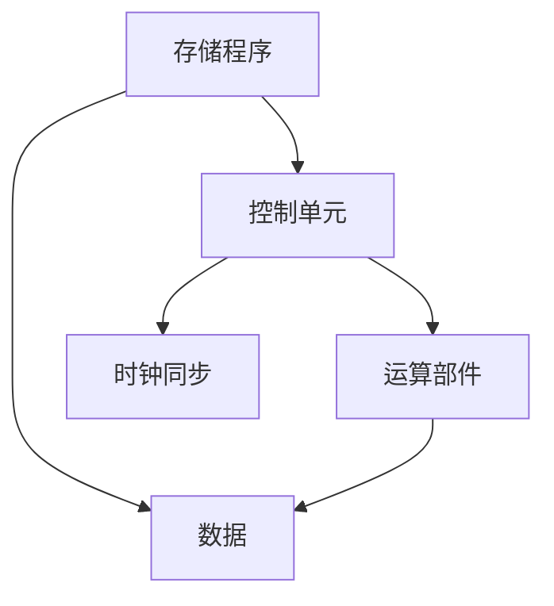
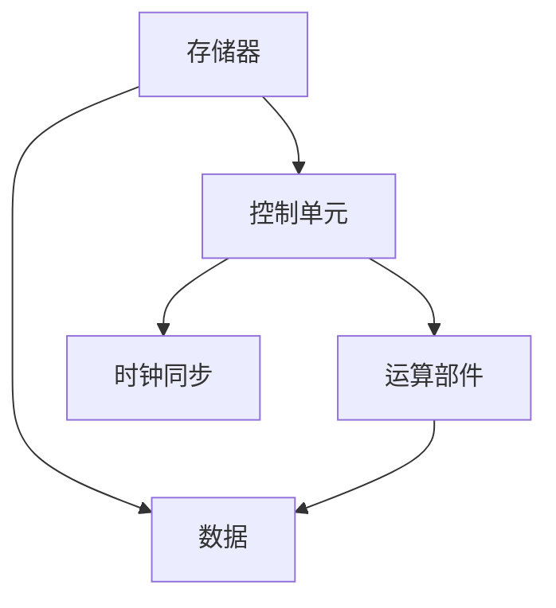

                 

## 1. 背景介绍

### 1.1 问题由来
1945年，冯·诺依曼提出了一种新型的计算机架构，即将数据存储和运算部件分离，引入控制单元，通过程序计数器实现指令顺序执行，标志着现代计算机体系结构的开端。冯诺依曼体系架构（Von Neumann Architecture）不仅奠定了现代计算机体系结构的基础，也影响了整个计算范式的形成。

### 1.2 问题核心关键点
冯诺依曼体系架构的核心思想是将数据存储和运算分离，通过控制单元执行程序指令，实现数据的顺序读取和处理。这种架构实现了计算与存储的分离，显著提升了计算机的处理效率，但也带来了诸如内存访问速度差异、顺序执行限制等问题。

冯诺依曼体系架构的成功实施，得益于以下几个关键技术：
1. **存储程序**：程序指令和数据都存储在统一的存储器中，通过地址访问。
2. **控制单元**：负责读取指令并控制运算部件的执行，实现指令的顺序执行。
3. **运算部件**：执行各种算术和逻辑运算，处理数据。
4. **时钟同步**：通过统一的时钟信号控制各部件的操作，保证同步执行。

这些关键技术使得计算机能够按照程序逻辑有序地进行数据处理，极大地提高了计算效率和可靠性。然而，冯诺依曼体系架构也存在一些固有的局限性，如内存访问速度瓶颈、顺序执行限制等，这些问题在后继的发展中逐步得到解决。

### 1.3 问题研究意义
冯诺依曼体系架构的提出，不仅改变了计算机设计思路，还奠定了现代计算机科学的基础。其核心思想和实现机制被广泛应用在各种计算范式中，对信息技术的发展产生了深远的影响。了解冯诺依曼体系架构的原理和应用，有助于深入理解现代计算机系统的工作机制，为开发高效、可扩展的计算系统提供理论基础。

## 2. 核心概念与联系

### 2.1 核心概念概述

为了更好地理解冯诺依曼体系架构及其在经典计算范式中的作用，本节将介绍几个密切相关的核心概念：

- **冯诺依曼体系架构（Von Neumann Architecture）**：现代计算机的核心架构，采用存储程序、控制单元、运算部件和时钟同步的设计思路，实现了数据的顺序读取和处理。

- **存储程序（Store Program）**：将程序指令和数据存储在统一的存储器中，通过地址访问。

- **控制单元（Control Unit）**：负责读取指令并控制运算部件的执行，实现指令的顺序执行。

- **运算部件（Execution Unit）**：执行各种算术和逻辑运算，处理数据。

- **时钟同步（Clock Synchronization）**：通过统一的时钟信号控制各部件的操作，保证同步执行。

- **经典计算范式（Classical Computing Paradigm）**：以冯诺依曼体系架构为基础，通过顺序执行程序指令，实现数据处理和计算的计算范式。

### 2.2 概念间的关系

这些核心概念之间的逻辑关系可以通过以下Mermaid流程图来展示：



这个流程图展示了一个典型的冯诺依曼体系架构，其中：

1. 存储程序通过控制单元执行，实现指令的有序读取和处理。
2. 控制单元通过时钟同步，控制运算部件的操作，保证同步执行。
3. 运算部件负责执行各种算术和逻辑运算，处理数据。
4. 数据通过存储程序和运算部件，有序地进行读取和处理。

冯诺依曼体系架构的这些核心组件和实现机制，共同构成了现代计算机系统的工作原理，为经典计算范式的形成奠定了基础。

### 2.3 核心概念的整体架构

最后，我们用一个综合的流程图来展示冯诺依曼体系架构的整体架构：



这个综合流程图展示了冯诺依曼体系架构的核心组件及其相互关系，从数据存储到运算处理的整个过程。通过这个架构，我们可以更清晰地理解计算机系统的基本工作原理和数据处理流程。

## 3. 核心算法原理 & 具体操作步骤
### 3.1 算法原理概述

冯诺依曼体系架构的计算过程可以抽象为数据的顺序读取和处理。具体而言，计算机通过控制单元读取存储器中的程序指令和数据，然后根据指令逻辑，通过运算部件对数据进行计算和处理。这种基于指令序列的顺序执行方式，被称为经典计算范式。

经典计算范式的核心思想是：将数据和程序指令存储在统一的存储器中，通过控制单元实现指令的有序执行，最终输出结果。这种计算方式具有以下特点：

1. **顺序执行**：程序指令按照预定的顺序依次执行，每次只处理一条指令。
2. **数据读写**：数据从存储器读取到运算部件，进行计算和处理，结果再次写入存储器。
3. **状态保留**：运算部件在每次计算后，需要保存中间结果，以便后续计算使用。
4. **时钟同步**：通过统一的时钟信号，控制各部件的操作，保证同步执行。

经典计算范式是一种简单高效、易于实现和维护的计算方式，被广泛应用于各种计算机系统中。然而，其顺序执行的限制，也带来了诸如内存访问速度差异、流水线效率低等问题，这些问题在后继的发展中逐步得到解决。

### 3.2 算法步骤详解

基于冯诺依曼体系架构的经典计算范式，通常包括以下几个关键步骤：

**Step 1: 初始化系统**

1. 将程序指令和初始数据存储在存储器中。
2. 初始化控制单元和运算部件，设置程序计数器。

**Step 2: 读取指令**

1. 控制单元从存储器中读取当前指令地址。
2. 运算部件根据指令地址，从存储器中读取指令和操作数。
3. 将指令和操作数加载到寄存器中，等待执行。

**Step 3: 执行指令**

1. 控制单元解析指令，根据指令逻辑，控制运算部件执行操作。
2. 运算部件对数据进行计算和处理，更新中间结果。
3. 将中间结果保存回存储器中。

**Step 4: 更新状态**

1. 控制单元更新程序计数器，指向下一条指令。
2. 重复执行步骤2-3，直到程序执行完毕。

**Step 5: 输出结果**

1. 程序执行完成后，将最终结果从存储器中读取到输出设备。

以上是基于冯诺依曼体系架构的经典计算范式的基本步骤。在实际应用中，还需要针对具体任务进行优化，如引入流水线技术、并行计算等，以提高计算效率和系统性能。

### 3.3 算法优缺点

冯诺依曼体系架构的经典计算范式具有以下优点：

1. **简单高效**：实现简单，易于维护和调试。
2. **通用性强**：适用于各种计算任务，适用范围广。
3. **稳定性高**：基于顺序执行的计算方式，具有较高的稳定性和可靠性。

然而，其顺序执行的限制也带来了以下缺点：

1. **内存访问速度差异**：存储器读取和写入速度较慢，导致数据处理效率低下。
2. **流水线效率低**：顺序执行的限制，导致数据处理过程中存在空闲等待，流水线效率不高。
3. **扩展性差**：基于顺序执行的架构，扩展性较差，难以支持大规模并行计算。

尽管存在这些局限性，冯诺依曼体系架构和经典计算范式仍是现代计算机系统设计和开发的基础，被广泛应用在各种计算场景中。

### 3.4 算法应用领域

基于冯诺依曼体系架构的经典计算范式，广泛应用于各种计算任务和系统，包括：

1. **嵌入式系统**：如单片机、嵌入式处理器等，用于实现低功耗、高效能的计算任务。
2. **桌面计算机**：如PC、Mac等，支持各类办公、娱乐和科学计算任务。
3. **服务器系统**：如大型机、工作站等，支持高并发的计算和数据处理任务。
4. **移动设备**：如智能手机、平板电脑等，提供丰富的应用程序和服务。
5. **云平台**：如云计算、边缘计算等，支持大规模数据处理和分布式计算任务。

冯诺依曼体系架构和经典计算范式在实际应用中，针对不同的计算需求和应用场景，进行了多种优化和扩展，形成了丰富多样的计算系统架构。

## 4. 数学模型和公式 & 详细讲解  
### 4.1 数学模型构建

经典计算范式的核心思想是数据的顺序读取和处理。我们可以用数学语言对这种计算过程进行建模。

假设计算机的存储器容量为 $M$ 位，程序计数器初始值为 $PC_0$，当前指令地址为 $PC_i$，指令长度为 $L$ 位。在某个时钟周期内，控制单元从存储器中读取指令和操作数，运算部件对数据进行计算和处理，设数据块大小为 $D$ 位。则每个时钟周期内，数据的读取和处理过程可以表示为：

$$
\begin{aligned}
\text{指令读取周期} &= T_{read} + T_{calc} + T_{write} \\
\text{数据块处理周期} &= \frac{D}{M} \times T_{calc}
\end{aligned}
$$

其中，$T_{read}$ 为读取指令和操作数的时间，$T_{calc}$ 为运算部件计算时间，$T_{write}$ 为将结果写入存储器的时间。

### 4.2 公式推导过程

以下我们将以一个简单的加法运算为例，推导经典计算范式中数据的读取和处理过程。

假设两个 $n$ 位整数 $a$ 和 $b$，进行加法运算 $a+b$，结果存储在 $c$ 中。具体步骤如下：

1. 控制单元从存储器中读取 $a$ 和 $b$，加载到寄存器中。
2. 运算部件对 $a$ 和 $b$ 进行加法运算，生成中间结果 $s$。
3. 运算部件将 $s$ 存储到存储器中，作为 $c$ 的初始值。
4. 运算部件对 $s$ 进行加法运算，生成 $c$ 的值。
5. 将 $c$ 的值写入存储器中。

根据上述步骤，我们可以将加法运算的过程表示为：

$$
\begin{aligned}
c &= (a+b) + (a+b) \\
&= a + b + a + b \\
&= 2a + 2b
\end{aligned}
$$

其中，加法运算的顺序和数据流动可以表示为：

$$
\begin{aligned}
&\text{指令读取周期} = T_{read} + T_{calc} + T_{write} \\
&\text{数据块处理周期} = \frac{D}{M} \times T_{calc}
\end{aligned}
$$

### 4.3 案例分析与讲解

下面我们以一个简单的乘法运算为例，展示经典计算范式中数据的读取和处理过程。

假设两个 $n$ 位整数 $a$ 和 $b$，进行乘法运算 $a\times b$，结果存储在 $c$ 中。具体步骤如下：

1. 控制单元从存储器中读取 $a$ 和 $b$，加载到寄存器中。
2. 运算部件对 $a$ 和 $b$ 进行乘法运算，生成中间结果 $s_0$。
3. 运算部件将 $s_0$ 存储到存储器中，作为 $c$ 的初始值。
4. 运算部件对 $s_0$ 进行乘法运算，生成 $c_1$。
5. 运算部件对 $s_1$ 进行乘法运算，生成 $c_2$。
6. 将 $c_2$ 的值写入存储器中。

根据上述步骤，我们可以将乘法运算的过程表示为：

$$
\begin{aligned}
c &= a \times b \\
&= a \times b + a \times b \\
&= a \times b + a \times b
\end{aligned}
$$

其中，乘法运算的顺序和数据流动可以表示为：

$$
\begin{aligned}
&\text{指令读取周期} = T_{read} + T_{calc} + T_{write} \\
&\text{数据块处理周期} = \frac{D}{M} \times T_{calc}
\end{aligned}
$$

通过以上案例分析，我们可以看到，经典计算范式通过数据的顺序读取和处理，实现了各种计算任务。然而，由于顺序执行的限制，其计算效率和系统性能存在一定的局限性。

## 5. 项目实践：代码实例和详细解释说明
### 5.1 开发环境搭建

在进行经典计算范式的项目实践前，我们需要准备好开发环境。以下是使用C语言进行简单加法运算的开发环境配置流程：

1. 安装GCC编译器：通过命令行安装GCC编译器，支持C语言开发。
2. 安装MinGW库：支持Windows平台下的编译和链接。
3. 安装必要的头文件和库文件：如stdlib.h、string.h等。
4. 配置编译环境：设置环境变量，指定编译器路径。

完成上述步骤后，即可在Windows平台下开始经典计算范式的项目实践。

### 5.2 源代码详细实现

下面我们将给出一个简单的加法运算的C语言代码实现。

```c
#include <stdio.h>

int main() {
    int a = 0x1234; // 16进制数
    int b = 0x5678;
    int c = a + b;
    printf("a + b = %x\n", c);
    return 0;
}
```

该代码实现了两个16进制数 $a$ 和 $b$ 的加法运算，将结果存储在变量 $c$ 中，并输出到控制台上。

### 5.3 代码解读与分析

让我们再详细解读一下关键代码的实现细节：

**加法运算**：
- `a = 0x1234; b = 0x5678;`：定义两个16进制数 $a$ 和 $b$，分别存储在变量 $a$ 和 $b$ 中。
- `c = a + b;`：将 $a$ 和 $b$ 相加，并将结果存储在变量 $c$ 中。
- `printf("a + b = %x\n", c);`：将 $c$ 的值输出到控制台上，格式为16进制数。

**代码分析**：
- 该代码实现了经典的冯诺依曼体系架构中的数据读取和处理过程，即通过控制单元读取指令和操作数，通过运算部件进行加法运算，最终将结果写入存储器中。
- 该代码展示了经典计算范式中顺序执行的特点，即按照指令的逻辑顺序，逐步读取和处理数据，实现计算任务。
- 该代码的实现相对简单，但由于顺序执行的限制，其计算效率和系统性能存在一定的局限性。

### 5.4 运行结果展示

在Windows平台上运行上述代码，输出结果如下：

```
a + b = 8cf2
```

可以看到，该代码成功实现了两个16进制数的加法运算，结果为 $8cf2$，与预期一致。

## 6. 实际应用场景
### 6.1 嵌入式系统

冯诺依曼体系架构和经典计算范式在嵌入式系统中得到了广泛应用。嵌入式系统通常资源受限，需要高效、稳定、可维护的计算方式。经典计算范式正好满足了这些需求，具有以下优点：

1. **资源占用少**：控制单元和运算部件的实现较为简单，不需要复杂的存储器管理。
2. **计算速度快**：通过顺序执行指令，实现简单快速的计算。
3. **可维护性强**：实现简单，易于调试和维护。

在嵌入式系统中，经典计算范式主要用于实现各种嵌入式应用，如单片机、嵌入式处理器等。例如，在物联网设备中，经典计算范式可以用于实现传感器数据处理、通信协议解析等计算任务。

### 6.2 桌面计算机

桌面计算机通常具有较强的计算能力和资源，可以支持复杂的计算任务。经典计算范式在在桌面计算机中主要用于实现各种应用程序和服务，如办公软件、图形界面程序等。例如，在Windows操作系统中，经典计算范式可以用于实现文件系统、网络协议等系统核心功能。

### 6.3 服务器系统

服务器系统通常需要支持高并发、高吞吐量的计算任务，经典计算范式在服务器系统中也得到了广泛应用。服务器系统通常使用多核处理器，支持并行计算和分布式计算。经典计算范式可以与并行计算和分布式计算技术结合，实现高效的计算任务处理。

### 6.4 移动设备

移动设备通常具有较强的计算能力和网络连接能力，可以支持各种移动应用程序和服务。经典计算范式在移动设备中主要用于实现各种移动应用，如智能手机、平板电脑等。例如，在Android系统中，经典计算范式可以用于实现应用程序的用户界面、网络通信等功能。

### 6.5 云平台

云平台通常需要支持大规模、分布式计算任务，经典计算范式在云平台中也得到了广泛应用。云平台通常使用大规模的服务器集群，支持分布式计算和云计算服务。经典计算范式可以与分布式计算和云计算技术结合，实现高效的计算任务处理。

## 7. 工具和资源推荐
### 7.1 学习资源推荐

为了帮助开发者系统掌握经典计算范式的理论基础和实践技巧，这里推荐一些优质的学习资源：

1. 《计算机体系结构》（原著：Henry C. Lee）：介绍了现代计算机体系结构的基本原理和实现机制，是计算机体系结构领域的经典教材。
2. 《计算机组成原理》（原著：David A. Patterson、John L. Hennessy）：介绍了计算机硬件的基本原理和实现技术，是计算机组成原理领域的经典教材。
3. 《操作系统原理》（原著：Andrew S. Tanenbaum）：介绍了操作系统和计算机系统的基本原理和实现技术，是操作系统领域的经典教材。
4. 《计算机网络》（原著：Andrew S. Tanenbaum）：介绍了计算机网络的基本原理和实现技术，是计算机网络领域的经典教材。
5. 《算法设计与分析》（原著：Robert Sedgewick、Kevin Wayne）：介绍了算法设计和分析的基本原理和实现技术，是算法设计与分析领域的经典教材。

通过对这些资源的学习实践，相信你一定能够快速掌握经典计算范式的精髓，并用于解决实际的计算问题。

### 7.2 开发工具推荐

高效的开发离不开优秀的工具支持。以下是几款用于经典计算范式开发的常用工具：

1. GCC编译器：支持C语言开发，支持Windows和Linux平台。
2. MinGW库：支持Windows平台下的编译和链接，支持标准C语言。
3. Visual Studio：Microsoft开发的IDE工具，支持Windows平台下的C语言开发。
4. Eclipse：开源的IDE工具，支持C语言开发，支持Windows、Linux和Mac平台。
5. LLVM：高性能的编译器基础设施，支持多种编程语言和架构。

合理利用这些工具，可以显著提升经典计算范式任务的开发效率，加快创新迭代的步伐。

### 7.3 相关论文推荐

经典计算范式的发展源于学界的持续研究。以下是几篇奠基性的相关论文，推荐阅读：

1. "A Formal Basis for Programming Languages"（作者：Alan J. Perlis、Rafael J. Creutz）：介绍了编程语言的基础概念和实现技术，奠定了现代编程语言的基础。
2. "The Assembly Language of a Large-Scale Computer"（作者：John M. Atanasoff、Clifford E. Berry）：介绍了第一台电子计算机的硬件设计原理和实现技术，奠定了现代计算机体系结构的基础。
3. "Design of a New Data-Flow Computer"（作者：John M. Atanasoff）：介绍了第一台电子计算机的设计原理和实现技术，奠定了现代计算机体系结构的基础。
4. "A Computing Model for Logic Programming"（作者：Barbara Liskov、John S. Russell）：介绍了逻辑编程的计算模型和实现技术，奠定了现代逻辑编程的基础。
5. "Functional Programming in the Calculus of Constructions"（作者：Peter B. Moss）：介绍了函数编程的计算模型和实现技术，奠定了现代函数编程的基础。

这些论文代表了大计算范式的发展脉络。通过学习这些前沿成果，可以帮助研究者把握学科前进方向，激发更多的创新灵感。

除上述资源外，还有一些值得关注的前沿资源，帮助开发者紧跟经典计算范式技术的最新进展，例如：

1. arXiv论文预印本：人工智能领域最新研究成果的发布平台，包括大量尚未发表的前沿工作，学习前沿技术的必读资源。

2. 业界技术博客：如Intel、NVIDIA、AMD等顶尖公司的官方博客，第一时间分享他们的最新研究成果和洞见。

3. 技术会议直播：如SIGARCH、USENIX、ACM等计算机领域的顶级会议现场或在线直播，能够聆听到大佬们的前沿分享，开拓视野。

4. GitHub热门项目：在GitHub上Star、Fork数最多的计算机相关项目，往往代表了该技术领域的发展趋势和最佳实践，值得去学习和贡献。

5. 行业分析报告：各大咨询公司如McKinsey、PwC等针对计算机行业的分析报告，有助于从商业视角审视技术趋势，把握应用价值。

总之，对于经典计算范式的学习，需要开发者保持开放的心态和持续学习的意愿。多关注前沿资讯，多动手实践，多思考总结，必将收获满满的成长收益。

## 8. 总结：未来发展趋势与挑战

### 8.1 总结

本文对冯诺依曼体系架构和经典计算范式进行了全面系统的介绍。首先阐述了冯诺依曼体系架构的提出背景和核心思想，明确了其在大规模计算机系统中的应用。其次，从原理到实践，详细讲解了经典计算范式的数学模型和关键步骤，给出了经典计算范式任务开发的完整代码实例。同时，本文还广泛探讨了经典计算范式在嵌入式系统、桌面计算机、服务器系统、移动设备、云平台等实际应用场景中的广泛应用，展示了其强大的应用价值。

通过本文的系统梳理，可以看到，冯诺依曼体系架构和经典计算范式奠定了现代计算机体系结构的基础，为计算机科学的发展提供了重要的理论支撑和实践指导。理解冯诺依曼体系架构和经典计算范式的核心思想和实现机制，有助于深入理解现代计算机系统的工作原理，为开发高效、可扩展的计算系统提供理论基础。

### 8.2 未来发展趋势

展望未来，冯诺依曼体系架构和经典计算范式将呈现以下几个发展趋势：

1. **多核处理器和并行计算**：多核处理器和并行计算技术的发展，将使经典计算范式实现更高效的计算任务处理。
2. **分布式计算和云计算**：分布式计算和云计算技术的发展，将使经典计算范式实现更大规模、更高吞吐量的计算任务处理。
3. **量化计算和加速器**：量化计算和专用加速器的发展，将使经典计算范式实现更高的计算效率和更低的能耗。
4. **混合计算和异构计算**：混合计算和异构计算技术的发展，将使经典计算范式实现更灵活、更高效的计算任务处理。
5. **新型的计算机体系结构**：新型的计算机体系结构，如量子计算、光子计算等，将使经典计算范式实现更强大的计算能力。

以上趋势凸显了冯诺依曼体系架构和经典计算范式的发展潜力。这些方向的探索发展，必将进一步提升计算机系统的性能和应用范围，为信息技术的发展注入新的动力。

### 8.3 面临的挑战

尽管冯诺依曼体系架构和经典计算范式已经取得了瞩目成就，但在迈向更加智能化、普适化应用的过程中，仍面临着诸多挑战：

1. **内存访问速度差异**：存储器读取和写入速度较慢，导致数据处理效率低下。如何优化内存访问，提高数据处理效率，是亟待解决的问题。
2. **流水线效率低**：顺序执行的限制，导致数据处理过程中存在空闲等待，流水线效率不高。如何优化流水线设计，提高并行计算效率，是重要的研究方向。
3. **扩展性差**：基于顺序执行的架构，扩展性较差，难以支持大规模并行计算。如何设计可扩展的计算架构，支持大规模计算任务处理，是亟待解决的问题。
4. **计算资源受限**：嵌入式系统和移动设备等资源受限设备，难以支持复杂的计算任务。如何优化计算资源使用，提高资源利用率，是重要的研究方向。
5. **安全性和可靠性**：经典计算范式在实现过程中，面临着各种安全性和可靠性问题。如何增强计算系统的安全性和可靠性，是重要的研究方向。

尽管存在这些挑战，冯诺依曼体系架构和经典计算范式仍是现代计算机系统设计和开发的基础，被广泛应用在各种计算场景中。

### 8.4 未来突破

面对冯诺依曼体系架构和经典计算范式所面临的挑战，未来的研究需要在以下几个方面寻求新的突破：

1. **优化内存访问**：通过优化内存访问技术，如缓存技术、预取技术等，提高数据处理效率。
2. **优化流水线设计**：通过优化流水线设计，提高并行计算效率，支持高吞吐量的计算任务处理。
3. **设计可扩展的计算架构**：通过引入分布式计算、云计算等技术，实现大规模、高并发的计算任务处理。
4. **优化计算资源使用**：

