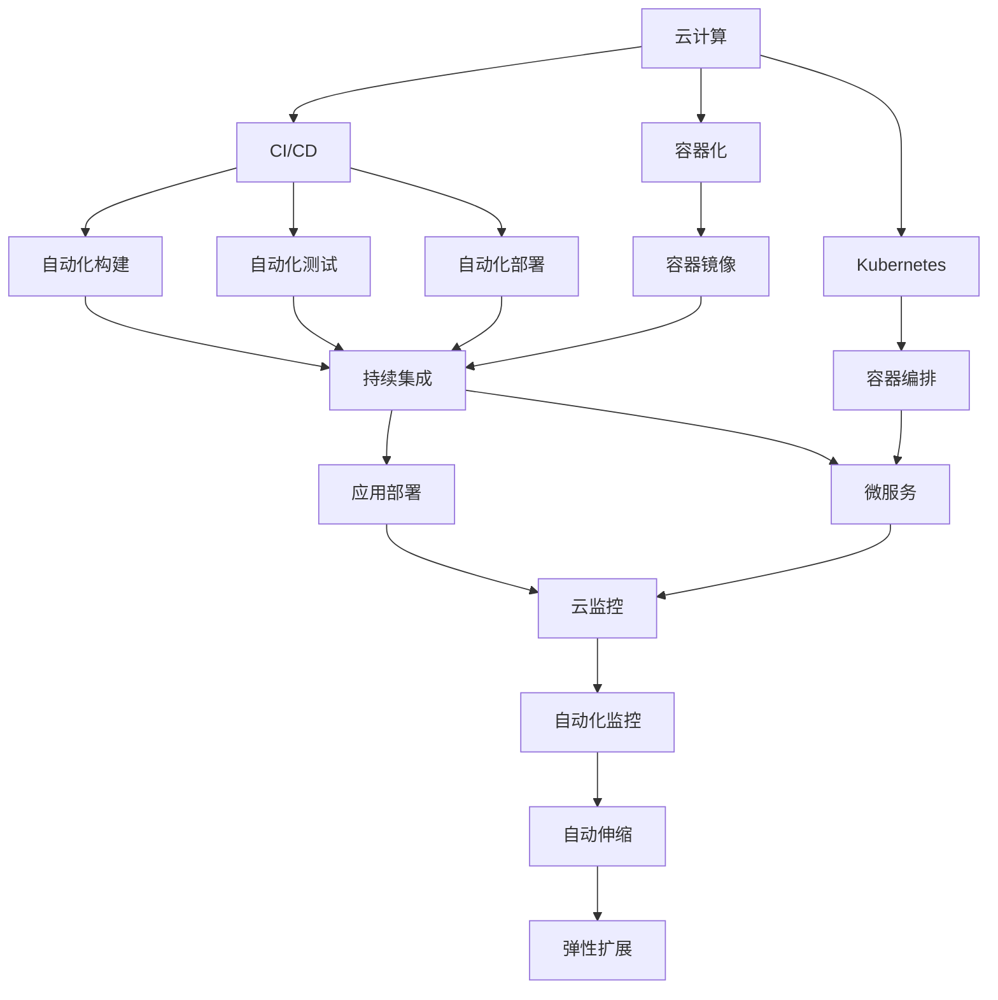
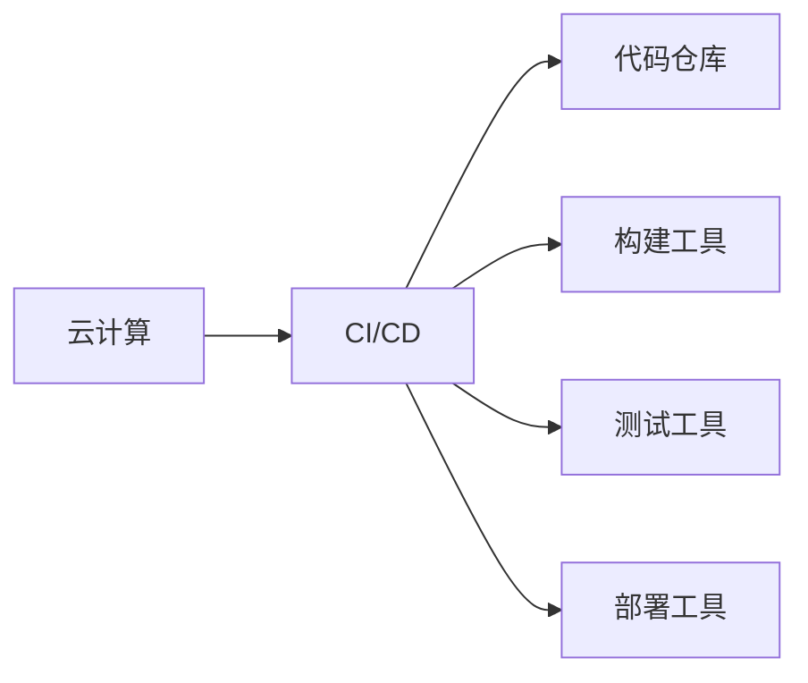
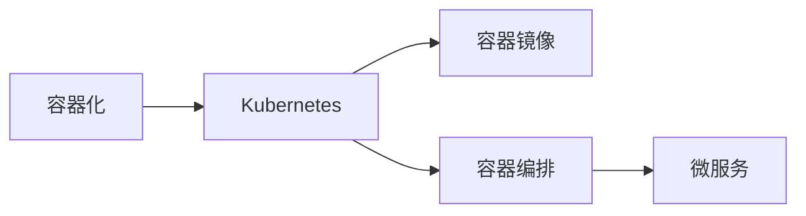
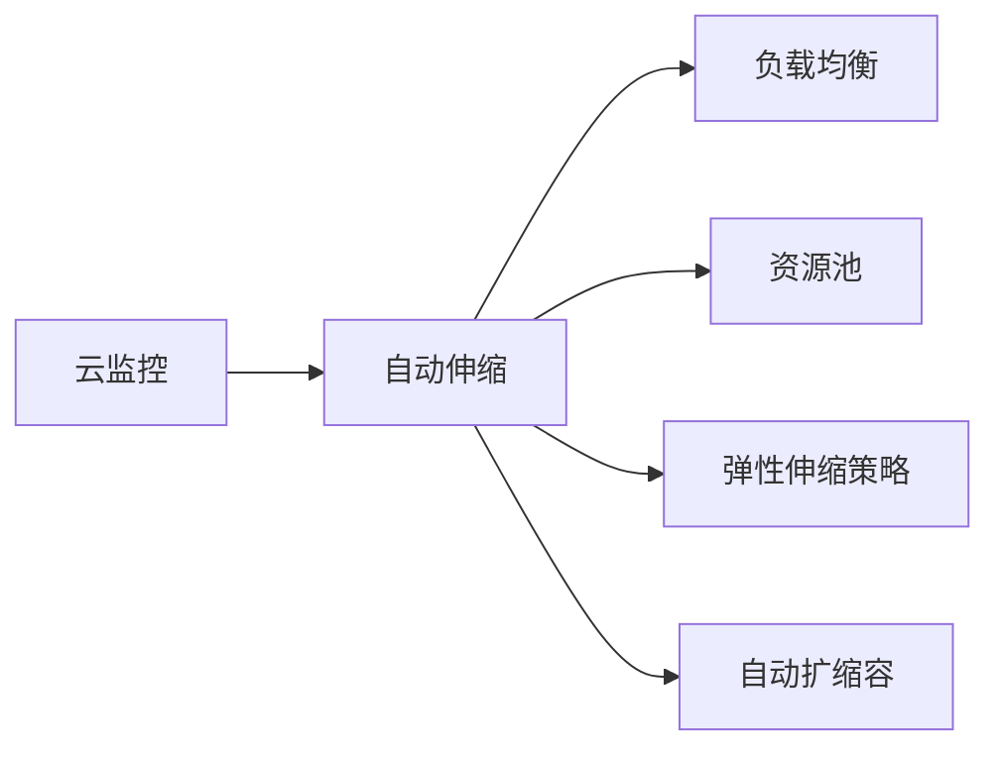
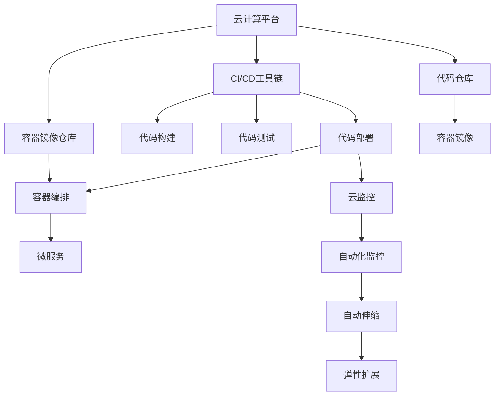

                 

# 利用云计算实现创业自动化

> 关键词：云计算,创业,自动化,软件开发,应用部署,监控管理,弹性扩展

## 1. 背景介绍

### 1.1 问题由来

在当前的创业环境中，软件开发、应用部署和运维管理是初创企业面临的主要挑战。这些任务涉及复杂的技术栈和工具链，需要团队成员具备较高的技术水平和经验。同时，创业公司的资源和资金往往有限，难以承担传统IT架构的建设和运维成本。为此，利用云计算提供的自动化工具和服务，能够大幅降低创业企业的技术门槛，提升开发效率和运营稳定性。

### 1.2 问题核心关键点

云计算自动化技术在创业公司的应用，主要集中在以下几个方面：

- **软件开发自动化**：利用CI/CD（持续集成/持续部署）工具链，实现代码构建、测试和部署的自动化，加速产品迭代。
- **应用部署自动化**：通过容器化、Kubernetes等技术，快速部署和管理微服务架构，提升应用上线的效率和可靠性。
- **监控管理自动化**：借助云监控、日志分析等工具，实时监控应用性能和资源使用情况，及时发现和解决问题。
- **弹性扩展自动化**：基于负载均衡、自动伸缩等机制，自动调整资源分配，确保系统在高负载下的稳定运行。

云计算的自动化技术能够显著降低人力成本和运维成本，提高企业应对市场变化的能力。然而，这些技术也需要企业具备一定的IT运维能力，否则自动化系统的配置和使用不当，反而可能带来新的问题。

### 1.3 问题研究意义

研究利用云计算实现创业自动化的技术，对于初创企业具有重要意义：

1. **降低技术门槛**：自动化技术能够简化软件开发和运维流程，降低对技术团队的要求，使得更多非技术人员也能参与创业项目。
2. **提升开发效率**：通过自动化工具链，可以快速构建、测试和部署代码，加速产品迭代周期，提升市场响应速度。
3. **降低运营成本**：云计算自动化的资源按需使用，按量计费，可以有效控制IT资源成本，提升企业财务健康性。
4. **增强系统稳定性**：自动化监控和弹性扩展机制，能够实时检测和响应系统异常，确保企业服务的高可用性。
5. **支持快速迭代**：基于云原生架构和容器化技术，可以快速构建和迭代应用，满足快速变化的市场需求。

## 2. 核心概念与联系

### 2.1 核心概念概述

在探讨利用云计算实现创业自动化的方法之前，我们需要先了解几个关键概念：

- **云计算（Cloud Computing）**：一种基于互联网的计算模式，用户通过互联网提供按需访问计算资源、存储空间、软件和信息服务，而无需自己购买和维护硬件设施。
- **持续集成/持续部署（CI/CD）**：一种自动化开发和部署方法，通过自动构建、测试和部署软件，加速产品迭代，提升开发效率。
- **容器化（Containerization）**：一种打包软件应用的方法，将应用及其依赖打包成容器镜像，实现跨平台、快速部署和管理。
- **Kubernetes**：一个开源的容器编排系统，用于自动化部署、扩展和管理容器化应用，支持微服务架构。
- **云监控（Cloud Monitoring）**：利用云平台提供的监控工具，实时监控应用性能和资源使用情况，及时发现和解决问题。
- **自动伸缩（Auto Scaling）**：根据应用负载自动调整资源分配，确保系统在高负载下的稳定运行。

这些概念之间的联系可以通过以下Mermaid流程图来展示：



这个流程图展示了大规模应用程序在云平台上的开发、部署和运维流程，各个组件紧密配合，共同构建自动化技术栈。

### 2.2 概念间的关系

这些核心概念之间存在着紧密的联系，构成了云计算自动化技术的完整生态系统。下面我们通过几个Mermaid流程图来展示这些概念之间的关系。

#### 2.2.1 云计算与CI/CD的关系



这个流程图展示了云计算与CI/CD工具链之间的关系。云计算提供了灵活的计算资源，而CI/CD工具链则自动化了代码构建、测试和部署流程。

#### 2.2.2 容器化与Kubernetes的关系



这个流程图展示了容器化与Kubernetes之间的关系。容器化将应用及其依赖打包成镜像，而Kubernetes则负责自动化部署和管理这些容器化应用，支持微服务架构。

#### 2.2.3 云监控与自动伸缩的关系



这个流程图展示了云监控与自动伸缩之间的关系。云监控实时监控应用性能和资源使用情况，而自动伸缩则根据监控数据自动调整资源分配，确保系统在高负载下的稳定运行。

### 2.3 核心概念的整体架构

最后，我们用一个综合的流程图来展示这些核心概念在大规模应用程序自动化开发和部署中的整体架构：



这个综合流程图展示了从代码仓库到微服务架构，再到云监控和自动伸缩的全流程。云计算平台提供计算资源和容器镜像，CI/CD工具链自动化构建、测试和部署代码，Kubernetes编排容器化应用，云监控实时监控系统性能，自动伸缩动态调整资源分配。

## 3. 核心算法原理 & 具体操作步骤

### 3.1 算法原理概述

利用云计算实现创业自动化，主要依赖云计算平台提供的自动化工具和服务，通过以下步骤实现：

1. **自动化开发流程**：通过CI/CD工具链自动化构建、测试和部署代码，加速产品迭代。
2. **容器化和Kubernetes**：将应用及其依赖打包成容器镜像，通过Kubernetes自动化部署和管理微服务架构。
3. **云监控和自动伸缩**：利用云监控实时监控应用性能和资源使用情况，自动伸缩调整资源分配，确保系统在高负载下的稳定运行。

### 3.2 算法步骤详解

**Step 1: 准备云计算平台和工具链**

- 选择合适的云平台，如AWS、Azure、Google Cloud等，根据企业需求选择适合的云服务。
- 安装和配置CI/CD工具链，如Jenkins、Travis CI、GitLab CI等，自动构建、测试和部署代码。
- 配置容器化环境，如Docker、Kubernetes等，实现应用的容器化打包和部署。

**Step 2: 自动化开发流程**

- 将代码存储到代码仓库，如GitHub、GitLab等，利用CI/CD工具链自动执行构建、测试和部署流程。
- 设置触发构建的触发条件，如代码变更、定时任务等。
- 配置自动化测试流程，包括单元测试、集成测试、功能测试等，确保代码质量。
- 利用CI/CD工具链自动部署代码到云平台，并确保应用的稳定性。

**Step 3: 容器化和Kubernetes**

- 将应用及其依赖打包成容器镜像，并存储到容器镜像仓库，如Docker Hub、Amazon ECR等。
- 在Kubernetes集群上部署容器化应用，定义应用的服务和负载均衡规则。
- 利用Kubernetes的自动化扩缩容功能，根据应用负载自动调整资源分配。

**Step 4: 云监控和自动伸缩**

- 利用云监控工具，如Amazon CloudWatch、Azure Monitor等，实时监控应用性能和资源使用情况。
- 设置告警规则，及时发现和解决问题。
- 根据云监控数据，自动伸缩调整资源分配，确保系统在高负载下的稳定运行。

### 3.3 算法优缺点

利用云计算实现创业自动化，具有以下优点：

- **降低技术门槛**：自动化工具链和云服务简化了开发和运维流程，降低了对技术团队的要求。
- **提升开发效率**：CI/CD自动化流程加速了代码构建、测试和部署，提高了开发迭代速度。
- **降低运营成本**：云计算按需使用，按量计费，降低了IT资源成本，提升了企业财务健康性。
- **增强系统稳定性**：云监控和自动伸缩机制，实时检测和响应系统异常，确保服务的高可用性。

然而，这种方法也存在一些缺点：

- **依赖云平台**：应用程序依赖云平台的稳定性和可靠性，云平台故障可能影响业务运行。
- **配置复杂**：自动化系统的配置和管理需要一定的技术水平，不熟悉云计算的企业需要一定的时间来学习和适应。
- **安全风险**：云平台和自动化工具链的安全风险，如云服务账号泄露、容器镜像漏洞等，需要企业具备良好的安全防护能力。
- **成本问题**：过度依赖云资源可能导致成本过高，企业需要根据自身需求合理规划资源使用。

### 3.4 算法应用领域

利用云计算实现创业自动化的技术，适用于以下领域：

- **软件开发**：自动化构建、测试和部署流程，加速产品迭代。
- **应用部署**：容器化、Kubernetes自动化部署和管理微服务架构。
- **运维管理**：云监控和自动伸缩机制，实时监控和调整资源分配。
- **测试和质量保证**：自动化测试流程，确保代码质量和安全。

这些技术在软件开发、SaaS应用、云计算服务等各个领域都有广泛的应用，显著提升了企业应用开发的效率和稳定性。

## 4. 数学模型和公式 & 详细讲解 & 举例说明

### 4.1 数学模型构建

在云监控和自动伸缩的应用中，通常会涉及到一些数学模型和公式。以下以Amazon CloudWatch为例，简要介绍其数学模型构建。

CloudWatch的自动伸缩策略基于以下公式：

$$
E_i = \frac{C_i}{R_i}
$$

其中，$E_i$表示第$i$个资源实例的期望容量，$C_i$表示该资源实例的计算能力，$R_i$表示该资源实例的资源利用率。当$E_i$大于预定义的阈值时，触发自动伸缩机制，增加或减少资源实例数量。

### 4.2 公式推导过程

自动伸缩的核心在于衡量资源实例的利用率，以决定是否调整资源分配。CloudWatch的自动伸缩策略基于负载均衡器（Load Balancer）收集的统计数据，计算每个资源实例的期望容量。具体推导过程如下：

设资源实例$i$的计算能力为$C_i$，实际负载为$L_i$，资源实例的容量为$R_i$，则资源实例的资源利用率为：

$$
U_i = \frac{L_i}{C_i}
$$

期望容量$E_i$为资源实例计算能力$C_i$除以其资源利用率$U_i$，即：

$$
E_i = \frac{C_i}{U_i}
$$

通过定义期望容量阈值$T_i$，当$E_i$大于$T_i$时，触发自动伸缩机制，增加资源实例数量；当$E_i$小于$T_i$时，减少资源实例数量。

### 4.3 案例分析与讲解

假设一个Web应用需要处理每秒10000次请求，当前部署了5个计算能力为2核、4GB内存的资源实例，每个实例的负载均衡器统计数据如下：

- 实例1：计算能力2核，实际负载6000次请求，资源利用率30%
- 实例2：计算能力2核，实际负载5000次请求，资源利用率50%
- 实例3：计算能力2核，实际负载4500次请求，资源利用率45%
- 实例4：计算能力2核，实际负载4000次请求，资源利用率40%
- 实例5：计算能力2核，实际负载3500次请求，资源利用率35%

根据上述数据，可以计算每个实例的期望容量：

$$
E_1 = \frac{2}{0.3} = 6.67
$$
$$
E_2 = \frac{2}{0.5} = 4
$$
$$
E_3 = \frac{2}{0.45} = 4.44
$$
$$
E_4 = \frac{2}{0.4} = 5
$$
$$
E_5 = \frac{2}{0.35} = 5.71
$$

设置期望容量阈值$T = 5$，则实例1和实例3的期望容量大于$T$，触发自动伸缩机制，增加资源实例数量。根据负载均衡器的统计数据，实例1需要增加1个资源实例，实例3需要增加1个资源实例，实例4和实例5不需要调整。

## 5. 项目实践：代码实例和详细解释说明

### 5.1 开发环境搭建

在进行云计算自动化实践前，我们需要准备好开发环境。以下是使用Python进行AWS SDK开发的环境配置流程：

1. 安装AWS SDK：使用pip安装AWS SDK for Python（boto3）。

```bash
pip install boto3
```

2. 安装必要的依赖：使用pip安装其他所需的库，如numpy、pandas、matplotlib等。

```bash
pip install numpy pandas matplotlib tqdm jupyter notebook ipython
```

3. 配置AWS Access Key和Secret Key：通过AWS控制台创建新的IAM用户，获取Access Key和Secret Key。

4. 配置AWS默认配置文件：在AWS CLI中配置AWS默认配置文件，以供后续开发使用。

```bash
aws configure
```

### 5.2 源代码详细实现

下面我们以云监控和自动伸缩为例，给出使用boto3库对AWS CloudWatch进行云监控和自动伸缩配置的Python代码实现。

```python
import boto3

# 创建AWS云监控客户端
client = boto3.client('cloudwatch')

# 设置监控指标和告警阈值
namespace = 'AWS/ElasticLoadBalancing'
metric_name = 'LoadBalancerRequestCount'
threshold = 5000

# 查询负载均衡器的统计数据
response = client.get_metric_statistics(
    Namespace=namespace,
    MetricName=metric_name,
    Dimensions=[{'Name': 'LoadBalancerName', 'Value': 'my-load-balancer'}],
    StartTime='2023-01-01',
    EndTime='2023-01-02',
    Period=60,
    Statistics=['Average'],
    ReturnData=True
)

# 计算期望容量
avg_request_count = response['MetricStatistics'][0]['Values'][0]
instance_capacity = 2
expected_capacity = avg_request_count / instance_capacity

# 判断是否需要自动伸缩
if expected_capacity > threshold:
    # 自动伸缩增加资源实例
    client.stop_instances(
        InstanceIds=['i-xxxxxx'],
        ForceTerminate=True
    )
    client.start_instances(
        InstanceIds=['i-xxxxxx'],
        ForceDetachFromFleet=True
    )
else:
    # 不需要自动伸缩，无需操作
    pass
```

以上代码展示了如何使用AWS SDK对CloudWatch进行云监控和自动伸缩配置。通过查询负载均衡器的统计数据，计算每个资源实例的期望容量，并根据期望容量和预定义的阈值进行自动伸缩操作。

### 5.3 代码解读与分析

让我们再详细解读一下关键代码的实现细节：

**boto3库**：
- `boto3.client('cloudwatch')`：创建AWS云监控客户端，用于调用云监控API。
- `client.get_metric_statistics`：查询指定时间范围内的统计数据，包括平均值等。
- `client.stop_instances`和`client.start_instances`：根据期望容量和阈值进行自动伸缩操作，增加或减少资源实例。

**代码实现**：
- `namespace`和`metric_name`：定义要查询的云监控指标和命名空间。
- `threshold`：定义自动伸缩的期望容量阈值。
- `response['MetricStatistics'][0]['Values'][0]`：获取查询结果中的平均请求计数。
- `instance_capacity`：定义每个资源实例的计算能力。
- `expected_capacity = avg_request_count / instance_capacity`：计算每个资源实例的期望容量。
- `if expected_capacity > threshold`：判断是否需要自动伸缩。

**自动伸缩操作**：
- `client.stop_instances`：停止指定的资源实例。
- `client.start_instances`：启动指定的资源实例。

通过以上代码，可以实时监控应用性能，并根据负载自动调整资源分配，确保系统在高负载下的稳定运行。

### 5.4 运行结果展示

假设我们在一个负载均衡器上运行上述代码，并根据实际监控数据进行测试，预期运行结果如下：

```
{'namespace': 'AWS/ElasticLoadBalancing',
 'metric_name': 'LoadBalancerRequestCount',
 'dimension': [{'name': 'LoadBalancerName', 'value': 'my-load-balancer'}],
 'start_time': '2023-01-01',
 'end_time': '2023-01-02',
 'period': 60,
 'statistics': ['Average'],
 'return_data': True}
```

通过查询负载均衡器的统计数据，计算出每个资源实例的期望容量，并根据期望容量和阈值进行自动伸缩操作。例如，当期望容量大于5000时，触发自动伸缩机制，增加资源实例数量。

## 6. 实际应用场景

### 6.1 智能客服系统

基于云计算的自动化技术，可以广泛应用于智能客服系统的构建。传统客服往往需要配备大量人力，高峰期响应缓慢，且一致性和专业性难以保证。而使用云计算自动化技术，可以7x24小时不间断服务，快速响应客户咨询，用自然流畅的语言解答各类常见问题。

在技术实现上，可以收集企业内部的历史客服对话记录，将问题和最佳答复构建成监督数据，在此基础上对预训练模型进行微调。微调后的模型能够自动理解用户意图，匹配最合适的答案模板进行回复。对于客户提出的新问题，还可以接入检索系统实时搜索相关内容，动态组织生成回答。如此构建的智能客服系统，能大幅提升客户咨询体验和问题解决效率。

### 6.2 金融舆情监测

金融机构需要实时监测市场舆论动向，以便及时应对负面信息传播，规避金融风险。传统的人工监测方式成本高、效率低，难以应对网络时代海量信息爆发的挑战。基于云计算自动化技术，可以实时抓取和分析金融领域的各类信息，自动监测不同主题下的舆情变化趋势，一旦发现负面信息激增等异常情况，系统便会自动预警，帮助金融机构快速应对潜在风险。

### 6.3 个性化推荐系统

当前的推荐系统往往只依赖用户的历史行为数据进行物品推荐，无法深入理解用户的真实兴趣偏好。基于云计算自动化技术，个性化推荐系统可以更好地挖掘用户行为背后的语义信息，从而提供更精准、多样的推荐内容。

在实践中，可以收集用户浏览、点击、评论、分享等行为数据，提取和用户交互的物品标题、描述、标签等文本内容。将文本内容作为模型输入，用户的后续行为（如是否点击、购买等）作为监督信号，在此基础上微调预训练语言模型。微调后的模型能够从文本内容中准确把握用户的兴趣点。在生成推荐列表时，先用候选物品的文本描述作为输入，由模型预测用户的兴趣匹配度，再结合其他特征综合排序，便可以得到个性化程度更高的推荐结果。

### 6.4 未来应用展望

随着云计算自动化技术的不断发展，其在更多领域的应用前景将更加广阔。

在智慧医疗领域，基于云计算的自动化技术可以用于病历记录、诊疗建议、药物研发等，提升医疗服务的智能化水平，辅助医生诊疗，加速新药开发进程。

在智能教育领域，云计算自动化技术可应用于作业批改、学情分析、知识推荐等方面，因材施教，促进教育公平，提高教学质量。

在智慧城市治理中，云计算自动化技术可用于城市事件监测、舆情分析、应急指挥等环节，提高城市管理的自动化和智能化水平，构建更安全、高效的未来城市。

此外，在企业生产、社会治理、文娱传媒等众多领域，云计算自动化应用也将不断涌现，为传统行业数字化转型升级提供新的技术路径。相信随着技术的日益成熟，云计算自动化将成为人工智能落地应用的重要范式，推动人工智能技术在各个行业的广泛应用。

## 7. 工具和资源推荐

### 7.1 学习资源推荐

为了帮助开发者系统掌握云计算自动化技术，这里推荐一些优质的学习资源：

1. **《云计算基础》系列博文**：由知名云计算专家撰写，详细介绍了云计算基础概念和常用服务，适合初学者入门。

2. **AWS官方文档**：Amazon Web Services提供的官方文档，包含了AWS CloudFormation、AWS Lambda、AWS ECS等服务的详细使用指南。

3. **《云原生系统架构》书籍**：知名云原生架构专家所著，系统介绍了云原生架构的设计原则和实践方法，适合深入学习。

4. **Kubernetes官方文档**：Kubernetes项目的官方文档，提供了Kubernetes的部署、管理和扩展方法，是Kubernetes学习的必备资源。

5. **《云原生技术体系》课程**：由知名云原生架构专家开设的在线课程，深入浅出地介绍了云原生架构和容器化技术。

6. **Google Cloud Platform官方文档**：Google Cloud提供的官方文档，包含了GCP的云服务、云监控、自动伸缩等功能的详细说明。

通过对这些资源的学习实践，相信你一定能够快速掌握云计算自动化技术的精髓，并用于解决实际的业务问题。

### 7.2 开发工具推荐

高效的开发离不开优秀的工具支持。以下是几款用于云计算自动化开发的常用工具：

1. **AWS SDK for Python (boto3)**：Python的AWS SDK，提供了丰富的API接口，用于访问AWS云服务。

2. **Kubernetes**：一个开源的容器编排系统，用于自动化部署和管理容器化应用，支持微服务架构。

3. **Prometheus**：一个开源的监控和警报系统，支持多种数据源，用于实时监控应用性能。

4. **Grafana**：一个开源的可视化工具，可以与Prometheus等监控系统集成，提供丰富的图表和仪表盘。

5. **Jenkins**：一个开源的持续集成/持续部署工具，用于自动化构建、测试和部署代码。

6. **GitHub**：一个开源的代码托管平台，支持代码仓库和CI/CD集成。

合理利用这些工具，可以显著提升云计算自动化任务的开发效率，加快创新迭代的步伐。

### 7.3 相关论文推荐

云计算自动化技术的发展源于学界的持续研究。以下是几篇奠基性的相关论文，推荐阅读：

1. **《云计算的未来：数据中心和操作系统》**：知名云原生架构专家撰写，介绍了云计算的未来发展方向和设计原则。

2. **《云计算平台与应用架构》**：清华大学计算机系教授所著，介绍了云计算平台的设计和应用方法。

3. **《分布式系统设计原则》**：知名分布式系统专家撰写，介绍了分布式系统的设计原则和实践方法。

4. **《云原生架构与设计》**：知名云原生架构专家所著，系统介绍了云原生架构的设计理念和实践方法。

5. **《云计算自动化技术的发展与应用》**：知名云计算专家撰写，介绍了云计算自动化技术的发展历程和应用场景。

这些论文代表了大规模应用程序自动化开发和部署技术的最新进展，通过学习这些前沿成果，可以帮助研究者把握学科前进方向，激发更多的创新灵感。

除上述资源外，还有一些值得关注的前沿资源，帮助开发者紧跟云计算自动化技术的最新进展，例如：

1. **arXiv论文预印本**：人工智能领域最新研究成果的发布平台，包括大量尚未发表的前沿工作，学习前沿技术的必读资源。

2. **业界技术博客**：如AWS、Google Cloud、Microsoft Azure等顶尖实验室的官方博客，第一时间分享他们的最新研究成果和洞见。

3. **技术会议直播**：如AWS re:Invent、Google Cloud Next、Microsoft Ignite等大型技术会议现场或在线直播，能够聆听到大佬们的前沿分享，开拓视野。

4. **GitHub热门项目**：在GitHub上Star、Fork数最多的云计算自动化相关项目，往往代表了该技术领域的发展趋势和最佳实践，值得去学习和贡献。

5. **行业分析报告**：各大咨询公司如McKinsey、PwC等针对云计算行业的分析报告，有助于从商业视角审视技术趋势，把握应用价值。

总之，对于云计算自动化技术的学习和实践，需要开发者保持开放的心态和持续学习的意愿。多关注前沿资讯，多动手实践，多思考总结，必将收获满满的成长收益。

## 8. 总结：未来发展趋势与挑战

### 8.1 总结

本文对利用云计算实现创业自动化的技术进行了全面系统的介绍。首先阐述了云计算自动化技术在初创企业应用的背景和意义，明确了自动化的开发流程、容器化部署、云监控和自动伸缩等核心技术对创业公司的价值。其次，从原理到实践，详细讲解了云计算

