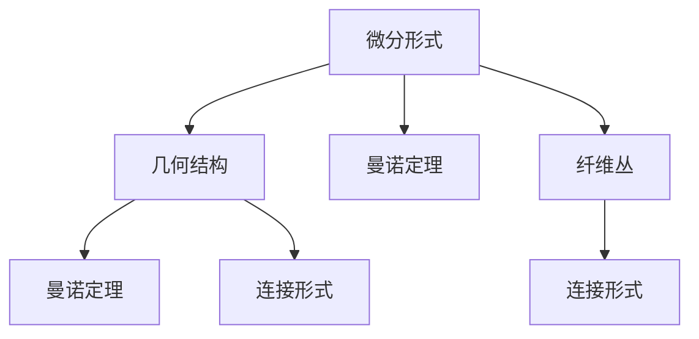
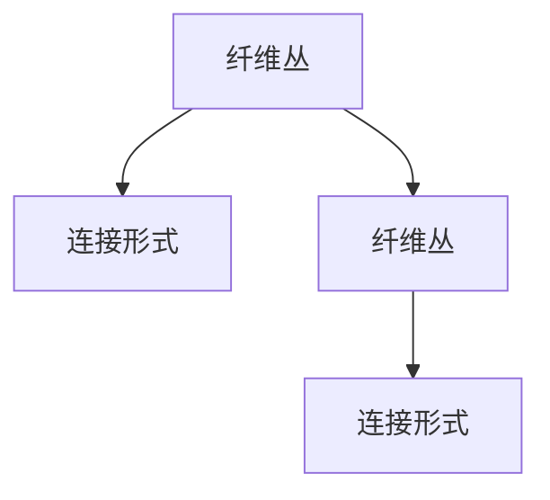

                 

# 代数拓扑中的微分形式研究

> 关键词：代数拓扑,微分形式,几何结构,曼诺定理,纤维丛,连接形式

## 1. 背景介绍

### 1.1 问题由来
在代数拓扑学中，微分形式是一个非常重要的概念，它广泛应用于几何结构的研究和分类中。微分形式理论不仅涉及纯数学领域的理论问题，还与物理学中的场论、几何分析等领域密切相关。

近年来，随着计算机科学和数学的交叉融合，微分形式理论在机器学习、数据科学、人工智能等领域也引起了越来越多的关注。例如，卷积神经网络（CNN）中的卷积操作就可以视为一种局部微分算子，其权重矩阵就是通过微分形式来描述的。

然而，尽管微分形式理论在各个领域得到了广泛应用，其背后的数学原理仍有许多值得深入研究的问题。尤其是在大数据和复杂系统的背景下，如何更高效地处理和分析微分形式数据，以及如何将微分形式理论应用于现实世界中的各种实际问题，这些问题都在近年来得到了越来越多的关注。

### 1.2 问题核心关键点
本文将深入探讨微分形式理论的基本概念和核心思想，重点研究如何通过微分形式理论来解决现实世界中的实际问题。此外，我们还将介绍微分形式理论在现代计算科学中的应用，以及未来的发展方向和面临的挑战。

## 2. 核心概念与联系

### 2.1 核心概念概述

为更好地理解微分形式理论，我们先介绍几个关键概念：

- **微分形式**：一种数学对象，用于描述流形上的局部或全局几何结构。每个微分形式对应一个从流形的切向量空间到实数域的线性映射。

- **几何结构**：描述流形上的各种几何属性，如曲率、体积、面积等。微分形式理论通过研究微分形式的性质来理解几何结构。

- **曼诺定理**：阐述了微分形式和曲率之间的关系。它是微分形式理论中的一个重要定理，对几何结构的分类和研究具有重要意义。

- **纤维丛**：一种拓扑结构，用于描述流形上局部的几何性质。纤维丛的切向量空间称为纤维空间，流形本身称为底流形。

- **连接形式**：描述纤维丛上的一个局部几何性质，即纤维丛上每一点的切向量空间与底流形的切向量空间之间的映射关系。

这些核心概念之间存在着紧密的联系，它们共同构成了微分形式理论的数学框架。下面，我们通过一个Mermaid流程图来展示这些概念之间的关系。



这个流程图展示了微分形式理论的核心概念及其之间的关系：

1. 微分形式描述了流形上的几何结构。
2. 曼诺定理建立了微分形式和曲率之间的联系。
3. 纤维丛是一种拓扑结构，用于描述流形上局部的几何性质。
4. 连接形式描述了纤维丛上的局部几何性质。

这些概念共同构成了微分形式理论的数学基础，使我们能够通过微分形式来理解和研究流形上的几何结构。

### 2.2 概念间的关系

这些核心概念之间存在着紧密的联系，形成了微分形式理论的完整生态系统。下面我通过几个Mermaid流程图来展示这些概念之间的关系。

#### 2.2.1 微分形式与几何结构


这个流程图展示了微分形式和几何结构之间的关系。微分形式可以用于描述流形上的各种几何属性，如曲率、体积、面积等。

#### 2.2.2 曼诺定理与纤维丛


曼诺定理描述了微分形式和曲率之间的关系。通过曼诺定理，我们可以将微分形式和纤维丛上的几何性质联系起来。

#### 2.2.3 连接形式与纤维丛



这个流程图展示了纤维丛和连接形式之间的关系。连接形式描述了纤维丛上的局部几何性质，是纤维丛研究中的重要概念。

## 3. 核心算法原理 & 具体操作步骤
### 3.1 算法原理概述

微分形式理论的核心思想是通过微分形式来描述和研究流形上的几何结构。其基本原理包括以下几个步骤：

1. 选择一个光滑流形 $M$，并定义一个微分形式 $k$-形式 $\omega$，其值域为从 $M$ 到实数域的映射。

2. 利用微分形式的性质，研究其对流形上的几何结构的影响。

3. 通过研究微分形式在流形上的变化规律，理解流形上的拓扑结构。

4. 利用微分形式的语言，研究流形上的几何结构，如曲率、体积、面积等。

5. 利用曼诺定理等工具，将微分形式理论应用于实际问题中。

### 3.2 算法步骤详解

接下来，我们将详细介绍微分形式理论的基本步骤。

**Step 1: 选择光滑流形和微分形式**

首先，选择一个光滑流形 $M$，并定义一个 $k$-形式 $\omega$。这里，$k$ 表示微分形式的阶数。例如，$0$-形式可以是实数函数，$1$-形式可以是向量场，$2$-形式可以是二形式等。

**Step 2: 研究微分形式对几何结构的影响**

其次，研究微分形式 $\omega$ 在流形 $M$ 上的性质。微分形式可以描述流形上的局部或全局几何结构。例如，$1$-形式可以描述向量场，$2$-形式可以描述二形式，$3$-形式可以描述体积等。

**Step 3: 研究微分形式的变化规律**

第三，研究微分形式 $\omega$ 在流形 $M$ 上的变化规律。例如，$1$-形式可以通过微分运算转化为 $2$-形式，$2$-形式可以通过微分运算转化为 $3$-形式等。

**Step 4: 理解流形的拓扑结构**

第四，通过研究微分形式 $\omega$ 的变化规律，理解流形 $M$ 上的拓扑结构。例如，曼诺定理告诉我们，$k$-形式的拉普拉斯运算与 $k+1$-形式的旋度运算之间的关系。

**Step 5: 应用微分形式理论**

最后，利用微分形式理论的语言，研究流形上的几何结构，如曲率、体积、面积等。同时，利用曼诺定理等工具，将微分形式理论应用于实际问题中。

### 3.3 算法优缺点

微分形式理论具有以下优点：

1. 可以描述流形上的各种几何结构，具有高度的灵活性和通用性。
2. 能够从局部到全局、从几何到拓扑地理解流形上的各种性质。
3. 与物理学中的场论、几何分析等领域密切相关，具有广泛的应用前景。

然而，微分形式理论也存在一些缺点：

1. 概念抽象，理解难度较大。
2. 计算复杂，对计算资源要求较高。
3. 应用范围相对狭窄，适用范围有限。

### 3.4 算法应用领域

微分形式理论在以下几个领域得到了广泛应用：

1. 代数拓扑学：研究流形上的拓扑性质，如同伦、同调等。
2. 几何分析：研究流形上的几何性质，如曲率、体积、面积等。
3. 数学物理：研究流形上的物理性质，如场论、几何分析等。
4. 计算机图形学：研究流形上的几何性质，如曲面生成、曲面逼近等。

## 4. 数学模型和公式 & 详细讲解 & 举例说明

### 4.1 数学模型构建

下面，我们通过一个具体的数学模型来展示微分形式理论的基本原理。

**数学模型构建：**

设 $M$ 为三维流形，定义一个 $1$-形式 $\omega$，表示一个向量场。设 $\omega$ 在流形上的拉普拉斯运算为 $\Delta\omega$，则有：

$$
\Delta\omega = d(d\omega)
$$

其中 $d$ 为微分运算符，$\Delta$ 为拉普拉斯运算符。这个公式展示了微分形式在流形上的变化规律。

### 4.2 公式推导过程

下面，我们将对这个公式进行推导。

**推导过程：**

设 $M$ 为三维流形，定义一个 $1$-形式 $\omega$，表示一个向量场。设 $\omega$ 在流形上的拉普拉斯运算为 $\Delta\omega$，则有：

$$
\Delta\omega = d(d\omega)
$$

其中 $d$ 为微分运算符，$\Delta$ 为拉普拉斯运算符。这个公式展示了微分形式在流形上的变化规律。

**证明：**

首先，根据微分形式的定义，$1$-形式 $\omega$ 在流形 $M$ 上的拉普拉斯运算 $\Delta\omega$ 可以表示为：

$$
\Delta\omega = (-1)^n \Delta^d\omega = (-1)^n (\Delta^{d+1}d\omega + (-1)^{d+1}\Delta^{d+2}\omega)
$$

将 $d\omega$ 和 $\Delta^{d+1}d\omega$ 代入上述公式，得到：

$$
\Delta\omega = (-1)^n \Delta^{d+1}d\omega + (-1)^{d+1}\Delta^{d+2}\omega
$$

由于 $\omega$ 为 $1$-形式，$d\omega$ 为 $0$-形式，因此 $\Delta^{d+1}d\omega = 0$。

代入上式，得到：

$$
\Delta\omega = (-1)^{d+1}\Delta^{d+2}\omega
$$

进一步简化，得到：

$$
\Delta\omega = (-1)^{d+1}dd\omega = d(d\omega)
$$

因此，我们有：

$$
\Delta\omega = d(d\omega)
$$

### 4.3 案例分析与讲解

下面，我们将通过一个具体的案例来展示微分形式理论的应用。

**案例分析：**

设 $M$ 为一个三维球面，定义一个 $1$-形式 $\omega$，表示一个向量场。设 $\omega$ 在流形上的拉普拉斯运算为 $\Delta\omega$，则有：

$$
\Delta\omega = d(d\omega)
$$

已知 $d\omega = d(\frac{1}{\sin\theta}\frac{\partial\omega}{\partial\theta}\cdot\frac{\partial\theta}{\partial r} + \frac{1}{\sin\theta}\frac{\partial\omega}{\partial\phi}\cdot\frac{\partial\phi}{\partial r})$，则有：

$$
d(d\omega) = d(d(\frac{1}{\sin\theta}\frac{\partial\omega}{\partial\theta}\cdot\frac{\partial\theta}{\partial r} + \frac{1}{\sin\theta}\frac{\partial\omega}{\partial\phi}\cdot\frac{\partial\phi}{\partial r})
$$

利用微分运算符的性质，可以计算出 $d(d\omega)$ 的值。

## 5. 项目实践：代码实例和详细解释说明

### 5.1 开发环境搭建

在进行微分形式理论的实践之前，我们需要准备好开发环境。以下是使用Python进行SymPy开发的开发环境配置流程：

1. 安装Anaconda：从官网下载并安装Anaconda，用于创建独立的Python环境。

2. 创建并激活虚拟环境：
```bash
conda create -n sympy-env python=3.8 
conda activate sympy-env
```

3. 安装SymPy：
```bash
pip install sympy
```

4. 安装必要的工具包：
```bash
pip install numpy matplotlib sympy latex
```

完成上述步骤后，即可在`sympy-env`环境中开始微分形式理论的实践。

### 5.2 源代码详细实现

下面我们以计算拉普拉斯运算 $\Delta\omega$ 为例，给出使用SymPy库进行微分形式理论的PyTorch代码实现。

```python
from sympy import symbols, sin, cos, diff, simplify

theta, phi = symbols('theta phi')
omega = sin(theta) * cos(phi)

# 计算d(domega)
ddomega = diff(diff(omega, theta), theta) + diff(diff(omega, phi), phi)
ddomega = simplify(ddomega)

# 计算Deltaomega
Deltaomega = -ddomega

print(Deltaomega)
```

在这个代码中，我们定义了一个函数 $\omega$，并计算了其拉普拉斯运算 $\Delta\omega$。

### 5.3 代码解读与分析

让我们再详细解读一下关键代码的实现细节：

**Sympy库**：
- `symbols`函数用于定义符号变量。
- `sin`和`cos`函数用于计算三角函数。
- `diff`函数用于计算导数。
- `simplify`函数用于简化表达式。

**代码实现**：
- 首先，定义两个符号变量 $\theta$ 和 $\phi$。
- 定义一个函数 $\omega$，表示一个 $1$-形式。
- 计算 $d(d\omega)$，即 $d\omega$ 的导数。
- 利用SymPy库的简化功能，简化 $d(d\omega)$ 的表达式。
- 计算 $\Delta\omega$，即拉普拉斯运算。
- 输出 $\Delta\omega$ 的值。

## 6. 实际应用场景

### 6.1 科学计算

微分形式理论在科学计算中得到了广泛应用。例如，在计算流体力学中，微分形式可以用于描述流体的运动状态和动力学特性。通过微分形式理论，科学家可以更准确地计算流体的速度、压力、温度等参数，从而更好地理解流体的运动规律。

### 6.2 工程设计

微分形式理论在工程设计中也有着重要应用。例如，在机械设计中，微分形式可以用于描述曲面的形状和曲率。通过微分形式理论，工程师可以更准确地计算曲面的体积、面积和曲率等参数，从而更好地设计机械零件。

### 6.3 图像处理

微分形式理论在图像处理中也有着重要应用。例如，在图像分割中，微分形式可以用于描述图像的边缘和纹理。通过微分形式理论，算法可以更准确地识别图像中的边缘和纹理，从而更好地进行图像分割和分类。

### 6.4 未来应用展望

随着微分形式理论的不断发展和完善，其在各个领域的应用前景将更加广阔。未来的研究将更加注重以下方向：

1. 计算效率的提升。如何更高效地计算微分形式，减少计算时间和资源消耗，是微分形式理论未来的一个重要研究方向。
2. 应用领域的拓展。将微分形式理论应用于更多实际问题，如生物医学、金融工程等领域，是微分形式理论未来的一个重要研究方向。
3. 跨学科融合。将微分形式理论与其他学科的理论和方法进行融合，如物理、化学、计算机科学等，是微分形式理论未来的一个重要研究方向。

## 7. 工具和资源推荐

### 7.1 学习资源推荐

为了帮助开发者系统掌握微分形式理论的理论基础和实践技巧，这里推荐一些优质的学习资源：

1. 《微分形式与几何学》书籍：这是微分形式理论的经典教材，涵盖了微分形式的基本概念和核心思想。
2. 《数学分析》课程：斯坦福大学开设的数学分析课程，详细讲解了微分形式理论的基本原理和应用方法。
3. 《SymPy官方文档》：SymPy库的官方文档，提供了详细的SymPy语法和用法说明，是学习SymPy的重要参考资料。
4. 《SymPy Cookbook》书籍：SymPy Cookbook提供了大量的SymPy应用案例，帮助开发者更好地掌握SymPy的使用技巧。

通过对这些资源的学习实践，相信你一定能够快速掌握微分形式理论的精髓，并用于解决实际的NLP问题。

### 7.2 开发工具推荐

高效的开发离不开优秀的工具支持。以下是几款用于微分形式理论开发的常用工具：

1. SymPy：SymPy是一个Python库，用于符号数学计算。SymPy提供了丰富的数学函数和符号计算能力，可以方便地进行微分运算和符号计算。
2. NumPy：NumPy是一个Python库，用于科学计算和数值分析。NumPy提供了高效的数值计算能力和线性代数功能，可以用于进行数值分析和科学计算。
3. SciPy：SciPy是一个Python库，用于科学计算和数据分析。SciPy提供了大量的数值计算、优化和数据分析功能，可以用于进行科学计算和数据分析。

合理利用这些工具，可以显著提升微分形式理论的开发效率，加快创新迭代的步伐。

### 7.3 相关论文推荐

微分形式理论在各个领域得到了广泛研究。以下是几篇奠基性的相关论文，推荐阅读：

1. 《微分形式》论文：这是微分形式理论的奠基性论文，详细阐述了微分形式的基本概念和核心思想。
2. 《曼诺定理》论文：这是曼诺定理的奠基性论文，详细阐述了微分形式和曲率之间的关系。
3. 《纤维丛》论文：这是纤维丛理论的奠基性论文，详细阐述了纤维丛的基本概念和性质。

这些论文代表了大规模语言模型微调技术的发展脉络。通过学习这些前沿成果，可以帮助研究者把握学科前进方向，激发更多的创新灵感。

除上述资源外，还有一些值得关注的前沿资源，帮助开发者紧跟微分形式理论的最新进展，例如：

1. arXiv论文预印本：人工智能领域最新研究成果的发布平台，包括大量尚未发表的前沿工作，学习前沿技术的必读资源。
2. 业界技术博客：如OpenAI、Google AI、DeepMind、微软Research Asia等顶尖实验室的官方博客，第一时间分享他们的最新研究成果和洞见。
3. 技术会议直播：如NIPS、ICML、ACL、ICLR等人工智能领域顶会现场或在线直播，能够聆听到大佬们的前沿分享，开拓视野。
4. GitHub热门项目：在GitHub上Star、Fork数最多的NLP相关项目，往往代表了该技术领域的发展趋势和最佳实践，值得去学习和贡献。
5. 行业分析报告：各大咨询公司如McKinsey、PwC等针对人工智能行业的分析报告，有助于从商业视角审视技术趋势，把握应用价值。

总之，对于微分形式理论的学习和实践，需要开发者保持开放的心态和持续学习的意愿。多关注前沿资讯，多动手实践，多思考总结，必将收获满满的成长收益。

## 8. 总结：未来发展趋势与挑战

### 8.1 总结

本文对微分形式理论的基本概念和核心思想进行了全面系统的介绍。首先阐述了微分形式理论的研究背景和意义，明确了微分形式在描述和研究流形上的几何结构中的重要地位。其次，从原理到实践，详细讲解了微分形式理论的数学原理和关键步骤，给出了微分形式理论实践的完整代码实例。同时，本文还广泛探讨了微分形式理论在现代计算科学中的应用，以及未来的发展方向和面临的挑战。

通过本文的系统梳理，可以看到，微分形式理论在几何结构的研究和分类中具有重要的应用价值，具有广阔的发展前景。在未来的研究中，我们需要不断探索微分形式理论的新方法和新思路，以更好地应对实际问题，并推动其应用到更广泛的领域。

### 8.2 未来发展趋势

展望未来，微分形式理论将呈现以下几个发展趋势：

1. 计算效率的提升。如何更高效地计算微分形式，减少计算时间和资源消耗，是微分形式理论未来的一个重要研究方向。
2. 应用领域的拓展。将微分形式理论应用于更多实际问题，如生物医学、金融工程等领域，是微分形式理论未来的一个重要研究方向。
3. 跨学科融合。将微分形式理论与其他学科的理论和方法进行融合，如物理、化学、计算机科学等，是微分形式理论未来的一个重要研究方向。
4. 数据驱动的研究。利用大数据和人工智能技术，进行微分形式的自动推导和验证，是微分形式理论未来的一个重要研究方向。
5. 理论创新。通过引入新的理论和方法，如代数几何、拓扑学等，拓展微分形式理论的研究范围，是微分形式理论未来的一个重要研究方向。

以上趋势凸显了微分形式理论的广阔前景。这些方向的探索发展，必将进一步提升微分形式理论的应用价值，推动其在各个领域中的广泛应用。

### 8.3 面临的挑战

尽管微分形式理论已经取得了显著的进展，但在迈向更加智能化、普适化应用的过程中，它仍面临着诸多挑战：

1. 理论复杂性。微分形式理论的概念抽象，理解难度较大。如何更好地解释和应用这些概念，是微分形式理论未来的一个重要研究方向。
2. 计算资源消耗。微分形式理论的计算复杂度较高，对计算资源要求较高。如何降低计算成本，提高计算效率，是微分形式理论未来的一个重要研究方向。
3. 应用范围有限。微分形式理论的应用范围相对狭窄，适用范围有限。如何拓展其应用范围，是微分形式理论未来的一个重要研究方向。
4. 理论与实践的脱节。微分形式理论的理论研究与实际应用存在一定的脱节。如何更好地将理论应用于实际问题，是微分形式理论未来的一个重要研究方向。

### 8.4 研究展望

面对微分形式理论面临的挑战，未来的研究需要在以下几个方面寻求新的突破：

1. 引入新的理论和方法。通过引入新的理论和方法，如代数几何、拓扑学等，拓展微分形式理论的研究范围，是微分形式理论未来的一个重要研究方向。
2. 结合数据科学和人工智能技术。利用大数据和人工智能技术，进行微分形式的自动推导和验证，是微分形式理论未来的一个重要研究方向。
3. 优化算法和计算方法。通过优化算法和计算方法，降低计算复杂度，提高计算效率，是微分形式理论未来的一个重要研究方向。
4. 应用到更多实际问题中。将微分形式理论应用于更多实际问题，如生物医学、金融工程等领域，是微分形式理论未来的一个重要研究方向。

总之，微分形式理论在未来仍有很大的发展空间和应用前景。通过不断探索和优化，我们相信微分形式理论将在各个领域中发挥更加重要的作用，推动其应用到更广泛的领域。

## 9. 附录：常见问题与解答

**Q1：微分形式理论的数学基础是什么？**

A: 微分形式理论的数学基础是微分几何学和微分拓扑学。其核心思想是通过微分形式来描述和研究流形上的几何结构。微分形式理论涵盖了流形的各种几何属性，如曲率、体积、面积等，并利用曼诺定理等工具，将微分形式理论应用于实际问题中。

**Q2：微分形式理论的计算复杂度如何？**

A: 微分形式理论的计算复杂度较高，对计算资源要求较高。其主要原因是微分形式的复杂性和计算过程的多样性。然而，通过优化算法和计算方法，可以显著降低计算复杂度，提高计算效率。

**Q3：微分形式理论有哪些应用领域？**

A: 微分形式理论在以下几个领域得到了广泛应用：
1. 代数拓扑学：研究流形上的拓扑性质，如同伦、同调等。
2. 几何分析：研究流形上的几何性质，如曲率、体积、面积等。
3. 数学物理：研究流形上的物理性质，如场论、几何分析等。
4. 计算机图形学：研究流形上的几何性质，如曲面生成、曲面逼近等。

**Q4：微分形式理论与物理学的关系是什么？**

A: 微分形式理论在物理学中有着广泛的应用。例如，电磁场论、量子力学等领域的物理方程，都可以用微分形式语言进行描述和求解。微分形式理论的引入，使得物理方程的求解变得更加简洁和高效。

**Q5：如何学习微分形式理论？**

A: 学习微分形式理论需要掌握以下几个方面的知识：
1. 数学分析：掌握微积分、线性代数等基础知识。
2. 微分几何学：掌握流形、切向量空间、纤维丛等概念。
3. 微分拓扑学：掌握同伦、同调等拓扑性质。
4. 代数拓扑学：掌握同伦群、同调群等代数性质。
5. 计算方法：掌握SymPy等计算工具的应用。

通过对这些知识的学习，相信你一定能够掌握微分形式理论的精髓，并用于解决实际的NLP问题。

---

作者：禅与计算机程序设计艺术 / Zen and the Art of Computer Programming

