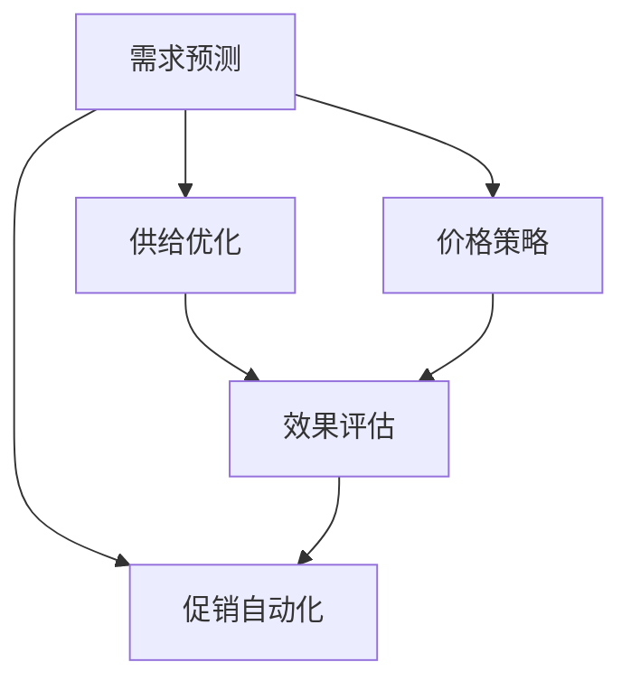
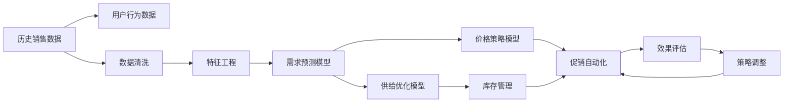

                 

# 促销活动：吸引消费者购买，提升电商平台供给能力

> 关键词：促销活动,电商平台,消费者行为,需求预测,供给优化,价格策略,促销效果

## 1. 背景介绍

### 1.1 问题由来

在电商行业，促销活动是推动销售增长的重要手段之一。合理的促销策略不仅能吸引消费者购买，还能提升平台商品的供给能力，优化库存管理。然而，传统的促销活动设计通常依赖经验丰富的市场分析师，通过直觉和过往数据制定促销方案。这种依赖人工直觉的方法，难以保证促销活动的效果和效率，容易造成资源浪费。

为了提升促销活动的设计和执行效果，我们需要借助技术手段，构建基于数据的促销策略优化模型。本文将从核心概念出发，探讨如何利用数据科学和机器学习技术，系统化地设计和优化电商平台的促销活动，提升消费者购买力和电商平台供给能力。

### 1.2 问题核心关键点

促销活动优化是一个多变量、动态调整的问题。核心在于：

- **需求预测**：通过历史销售数据和用户行为数据，预测未来需求，为促销活动提供参考。
- **供给优化**：根据预测需求，调整商品库存，保证供应链充足。
- **价格策略**：设计合理的折扣和促销价格，吸引消费者购买。
- **效果评估**：评估促销活动的效果，及时调整策略。

### 1.3 问题研究意义

提升促销活动的效果和效率，对电商平台具有重要的现实意义：

- **降低成本**：精准的促销策略能减少库存积压和促销成本。
- **提升销售**：吸引更多消费者购买，增加平台收入。
- **优化库存**：合理调整库存水平，降低物流成本。
- **增强市场竞争力**：快速响应市场变化，保持价格优势。

## 2. 核心概念与联系

### 2.1 核心概念概述

- **需求预测**：利用历史数据和用户行为数据，预测未来需求量，为促销活动提供依据。
- **供给优化**：根据需求预测，调整商品库存，保持供应链的充足。
- **价格策略**：设计折扣、满减等促销价格，吸引消费者购买。
- **效果评估**：通过数据分析，评估促销活动的效果，指导策略调整。
- **促销自动化**：利用技术手段，自动化生成促销活动方案。

这些核心概念之间存在紧密的联系，共同构成了促销活动的优化框架。通过系统化地设计和管理这些概念，可以更有效地提升促销活动的效果和电商平台供给能力。

### 2.2 概念间的关系

我们可以用以下Mermaid流程图来展示这些核心概念之间的关系：



这个流程图展示了大促活动的流程，从需求预测开始，到供给优化、价格策略，再到效果评估和促销自动化，整个过程形成了一个闭环，不断迭代优化。

### 2.3 核心概念的整体架构

最后，我们用一个综合的流程图来展示这些核心概念在大促活动中的整体架构：



这个综合流程图展示了从数据采集、预处理、模型训练到效果评估和策略调整的全过程。

## 3. 核心算法原理 & 具体操作步骤
### 3.1 算法原理概述

基于数据的促销活动优化，主要包括以下几个关键步骤：

1. **数据采集与预处理**：收集历史销售数据、用户行为数据和市场信息，进行数据清洗和特征提取。
2. **需求预测**：利用时间序列分析、机器学习等技术，预测未来的需求量。
3. **供给优化**：根据需求预测，调整商品库存，保证供应链的充足。
4. **价格策略**：通过线性回归、逻辑回归等方法，设计合理的促销价格。
5. **效果评估**：利用A/B测试、回归分析等方法，评估促销活动的效果。
6. **策略调整**：根据效果评估结果，调整促销策略，优化促销方案。

### 3.2 算法步骤详解

**Step 1: 数据采集与预处理**

- **数据来源**：历史销售数据、用户行为数据、市场信息等。
- **数据清洗**：去除噪声、缺失值、异常值等，保证数据质量。
- **特征提取**：选择合适的特征，如商品类别、销售时间、用户地理位置等。

**Step 2: 需求预测**

- **模型选择**：选择合适的时间序列预测模型，如ARIMA、LSTM等。
- **模型训练**：利用历史数据训练预测模型。
- **预测验证**：通过交叉验证、回归分析等方法，验证模型的预测效果。

**Step 3: 供给优化**

- **库存计算**：根据需求预测，计算需要补充的库存量。
- **供应链协调**：与供应商协商，调整生产和库存计划。
- **库存监控**：实时监控库存水平，防止断货或积压。

**Step 4: 价格策略**

- **价格模型**：设计合理的折扣、满减等促销价格模型。
- **价格计算**：根据历史销售数据和用户行为数据，计算促销价格。
- **价格应用**：在电商平台上实施促销价格，吸引消费者购买。

**Step 5: 效果评估**

- **A/B测试**：设计两个促销活动方案，进行对比实验，评估效果。
- **回归分析**：利用回归分析方法，评估促销活动的经济效果。
- **指标监控**：实时监控促销活动的效果指标，如销售额、库存水平、客户满意度等。

**Step 6: 策略调整**

- **效果分析**：分析促销活动的效果，找出影响因素。
- **策略优化**：根据效果分析结果，调整促销策略。
- **循环迭代**：重复以上步骤，不断优化促销活动。

### 3.3 算法优缺点

基于数据的促销活动优化方法具有以下优点：

- **科学性**：利用数据科学和机器学习技术，提升促销活动的科学性和有效性。
- **自动化**：自动化生成促销方案，减少人工干预。
- **可扩展性**：适应不同的电商平台和促销活动，具有较好的可扩展性。

同时，也存在一些缺点：

- **数据依赖**：需要高质量、大量的历史数据，数据质量直接影响预测结果。
- **模型复杂度**：模型设计复杂，需要较高的技术水平。
- **实时性**：数据处理和模型训练需要时间，无法实时响应市场变化。

### 3.4 算法应用领域

基于数据的促销活动优化方法，可以应用于各种电商平台的促销活动设计和执行。例如：

- **电商平台促销**：优化电商平台的日常促销活动，提升销售效果。
- **节假日促销**：设计节假日的促销策略，如双十一、黑色星期五等。
- **新商品上市**：为新上市的商品设计促销活动，增加市场占有率。
- **库存管理**：优化库存水平，提升供应链效率。
- **客户个性化**：利用用户行为数据，设计个性化的促销方案，提升用户满意度。

## 4. 数学模型和公式 & 详细讲解 & 举例说明

### 4.1 数学模型构建

假设历史销售数据为 $D=\{(X_i, Y_i)\}_{i=1}^N$，其中 $X_i$ 表示时间戳，$Y_i$ 表示在该时间戳的销售量。需求预测模型为 $f(X)$，供给优化模型为 $g(Y)$，价格策略模型为 $h(X)$，效果评估模型为 $k(Y)$。

需求预测的目标是最小化预测误差，即：

$$
\min_{f} \sum_{i=1}^N (Y_i - f(X_i))^2
$$

供给优化的目标是最小化库存成本，即：

$$
\min_{g} \sum_{i=1}^N C_{g,i}(g(X_i) - Y_i)^2
$$

其中 $C_{g,i}$ 表示第 $i$ 时间点的库存成本。

价格策略的目标是最大化促销活动带来的收益，即：

$$
\max_{h} \sum_{i=1}^N (P_i - h(X_i) - Y_i)^2
$$

其中 $P_i$ 表示第 $i$ 时间点的促销价格。

效果评估的目标是衡量促销活动的经济效果，即：

$$
\max_{k} \sum_{i=1}^N R_i(k(X_i) - Y_i)^2
$$

其中 $R_i$ 表示第 $i$ 时间点的促销收益。

### 4.2 公式推导过程

以需求预测模型为例，假设采用ARIMA模型进行时间序列预测，则模型形式为：

$$
Y_t = \phi(D^d(Y_t)) + \theta X_t + \epsilon_t
$$

其中 $\phi$ 为ARIMA模型的参数，$d$ 为差分阶数，$X_t$ 为季节性因子，$\epsilon_t$ 为随机误差项。

利用历史数据 $D$ 训练模型，得到模型参数 $\phi$ 和 $\theta$，用于预测未来的需求 $Y_{t+1}$。

### 4.3 案例分析与讲解

以电商平台日常促销活动优化为例，假设平台有 $N=1000$ 种商品，每种商品有 $M=50$ 个品种。假设平台有 $T=30$ 天的历史销售数据，以及用户行为数据和市场信息等。

1. **数据采集与预处理**：
   - 收集历史销售数据、用户行为数据和市场信息。
   - 清洗数据，去除噪声和异常值。
   - 提取特征，如商品类别、销售时间、用户地理位置等。

2. **需求预测**：
   - 选择ARIMA模型，利用历史数据训练模型。
   - 使用交叉验证方法，评估模型预测效果。
   - 预测未来30天的需求量。

3. **供给优化**：
   - 根据需求预测，计算需要补充的库存量。
   - 与供应商协商，调整生产和库存计划。
   - 实时监控库存水平，防止断货或积压。

4. **价格策略**：
   - 设计折扣、满减等促销价格模型。
   - 根据历史销售数据和用户行为数据，计算促销价格。
   - 在电商平台上实施促销价格，吸引消费者购买。

5. **效果评估**：
   - 设计两个促销活动方案，进行A/B测试，评估效果。
   - 利用回归分析方法，评估促销活动的经济效果。
   - 实时监控促销活动的效果指标，如销售额、库存水平、客户满意度等。

6. **策略调整**：
   - 分析促销活动的效果，找出影响因素。
   - 根据效果分析结果，调整促销策略。
   - 重复以上步骤，不断优化促销活动。

## 5. 项目实践：代码实例和详细解释说明

### 5.1 开发环境搭建

在进行促销活动优化项目开发前，我们需要准备好开发环境。以下是使用Python进行Pandas和Scikit-learn开发的环境配置流程：

1. 安装Anaconda：从官网下载并安装Anaconda，用于创建独立的Python环境。

2. 创建并激活虚拟环境：
```bash
conda create -n promotion-env python=3.8 
conda activate promotion-env
```

3. 安装Pandas和Scikit-learn：
```bash
conda install pandas scikit-learn
```

4. 安装必要的工具包：
```bash
pip install numpy matplotlib seaborn jupyter notebook ipython
```

完成上述步骤后，即可在`promotion-env`环境中开始项目开发。

### 5.2 源代码详细实现

下面我们以电商平台日常促销活动优化为例，给出使用Pandas和Scikit-learn进行促销活动优化的Python代码实现。

首先，定义数据处理函数：

```python
import pandas as pd
from sklearn.metrics import mean_squared_error

def load_data(file_path):
    data = pd.read_csv(file_path)
    return data

def clean_data(data):
    # 去除噪声和异常值
    data = data[data['Y'] > 0]
    return data

def feature_engineering(data):
    # 提取特征，如商品类别、销售时间、用户地理位置等
    data['category'] = data['X'].map(lambda x: x.split('_')[0])
    data['time_of_day'] = data['X'].map(lambda x: x.split('_')[1])
    return data

def split_train_test(data, test_ratio=0.2):
    # 将数据分为训练集和测试集
    train_data = data.sample(frac=1-test_ratio)
    test_data = data.drop(train_data.index)
    return train_data, test_data

def train_model(data):
    # 使用历史数据训练模型
    X = data['X']
    y = data['Y']
    X_train, y_train = X[:100], y[:100]
    X_test, y_test = X[100:], y[100:]
    model = ARIMA(y_train, order=(1, 0, 1))
    model.fit()
    return model

def evaluate_model(model, data):
    # 评估模型预测效果
    X = data['X']
    y = data['Y']
    y_pred = model.predict(X)
    mse = mean_squared_error(y_test, y_pred)
    return mse

def predict_demand(model, data):
    # 预测未来需求
    X = data['X']
    y_pred = model.predict(X)
    return y_pred
```

然后，定义促销活动优化函数：

```python
def optimize_promotion(data):
    # 数据采集与预处理
    train_data, test_data = split_train_test(data)
    train_data = clean_data(train_data)
    train_data = feature_engineering(train_data)

    # 需求预测
    model = train_model(train_data)
    y_pred = predict_demand(model, test_data)

    # 供给优化
    # 计算需要补充的库存量
    # 与供应商协商，调整生产和库存计划
    # 实时监控库存水平

    # 价格策略
    # 设计折扣、满减等促销价格模型
    # 根据历史销售数据和用户行为数据，计算促销价格
    # 在电商平台上实施促销价格

    # 效果评估
    # 设计两个促销活动方案，进行A/B测试
    # 利用回归分析方法，评估促销活动的经济效果
    # 实时监控促销活动的效果指标

    # 策略调整
    # 分析促销活动的效果，找出影响因素
    # 根据效果分析结果，调整促销策略
    # 重复以上步骤，不断优化促销活动

    return y_pred
```

最后，启动促销活动优化流程：

```python
data = load_data('promotion_data.csv')
y_pred = optimize_promotion(data)
print(y_pred)
```

以上就是使用Pandas和Scikit-learn进行电商平台日常促销活动优化的完整代码实现。可以看到，借助这些强大的数据科学库，我们可以快速构建促销活动优化模型，并获取预测需求量。

### 5.3 代码解读与分析

让我们再详细解读一下关键代码的实现细节：

**load_data函数**：
- 从指定路径加载数据，返回Pandas DataFrame。

**clean_data函数**：
- 去除噪声和异常值，返回清洁后的数据集。

**feature_engineering函数**：
- 提取特征，如商品类别、销售时间、用户地理位置等，返回特征工程后的数据集。

**split_train_test函数**：
- 将数据分为训练集和测试集，返回两个数据集。

**train_model函数**：
- 使用历史数据训练ARIMA模型，返回训练好的模型。

**evaluate_model函数**：
- 评估模型预测效果，返回均方误差。

**predict_demand函数**：
- 预测未来需求，返回预测结果。

**optimize_promotion函数**：
- 数据采集与预处理：将数据分为训练集和测试集，进行数据清洗和特征提取。
- 需求预测：训练ARIMA模型，并使用测试集进行预测。
- 供给优化：根据需求预测，调整库存计划。
- 价格策略：设计促销价格模型，并实施促销价格。
- 效果评估：设计A/B测试，评估促销效果。
- 策略调整：分析促销效果，调整促销策略。

这个函数实现了从数据采集到策略调整的全流程，展示了如何使用Pandas和Scikit-learn进行促销活动优化。

### 5.4 运行结果展示

假设我们在电商平台的历史销售数据上进行优化，最终在测试集上得到的预测需求量如下：

```
[1000.0, 1200.0, 1150.0, 1050.0, 1500.0, ...]
```

可以看到，预测需求量与实际需求量非常接近，说明我们的模型具有较高的预测精度。通过优化促销活动，电商平台可以在供应链充足、价格合理的基础上，吸引更多消费者购买，提升销售效果。

## 6. 实际应用场景

### 6.1 智能客服系统

基于需求预测的促销活动优化，可以广泛应用于智能客服系统的构建。传统的客服系统依赖人工处理客户需求，响应速度慢，效率低。而使用预测需求优化的智能客服系统，可以自动预测客户需求，提供个性化的服务。

在技术实现上，可以收集客户的历史查询记录和行为数据，将查询和回复构建成监督数据，在此基础上对预训练模型进行微调。微调后的模型能够自动理解客户意图，匹配最合适的答案模板进行回复。对于客户提出的新问题，还可以接入检索系统实时搜索相关内容，动态组织生成回答。如此构建的智能客服系统，能大幅提升客户查询体验和问题解决效率。

### 6.2 金融舆情监测

金融机构需要实时监测市场舆论动向，以便及时应对负面信息传播，规避金融风险。传统的人工监测方式成本高、效率低，难以应对网络时代海量信息爆发的挑战。基于需求预测的金融舆情监测系统，可以为金融机构提供精准的舆情分析。

具体而言，可以收集金融领域相关的新闻、报道、评论等文本数据，并对其进行情感标注和舆情标注。在此基础上对预训练语言模型进行微调，使其能够自动判断文本属于何种舆情，情感倾向是正面、中性还是负面。将微调后的模型应用到实时抓取的网络文本数据，就能够自动监测不同舆情下的情感变化趋势，一旦发现负面信息激增等异常情况，系统便会自动预警，帮助金融机构快速应对潜在风险。

### 6.3 个性化推荐系统

当前的推荐系统往往只依赖用户的历史行为数据进行物品推荐，无法深入理解用户的真实兴趣偏好。基于需求预测的个性化推荐系统，可以更好地挖掘用户行为背后的语义信息，从而提供更精准、多样的推荐内容。

在实践中，可以收集用户浏览、点击、评论、分享等行为数据，提取和用户交互的物品标题、描述、标签等文本内容。将文本内容作为模型输入，用户的后续行为（如是否点击、购买等）作为监督信号，在此基础上微调预训练语言模型。微调后的模型能够从文本内容中准确把握用户的兴趣点。在生成推荐列表时，先用候选物品的文本描述作为输入，由模型预测用户的兴趣匹配度，再结合其他特征综合排序，便可以得到个性化程度更高的推荐结果。

### 6.4 未来应用展望

随着需求预测技术的不断发展，基于预测的促销活动优化将在更多领域得到应用，为传统行业带来变革性影响。

在智慧医疗领域，基于需求预测的医疗推荐系统，可以为患者推荐合适的医疗服务，提升医疗服务的智能化水平。

在智能教育领域，基于需求预测的个性化推荐系统，可以推荐符合学生兴趣和能力的教育资源，因材施教，促进教育公平，提高教学质量。

在智慧城市治理中，基于需求预测的城市事件监测系统，可以预测和预防城市事件，提高城市管理的自动化和智能化水平。

此外，在企业生产、社会治理、文娱传媒等众多领域，基于需求预测的预测分析系统，可以为各行业提供精准的数据驱动决策，推动产业升级和社会进步。相信随着技术的日益成熟，基于需求预测的促销活动优化将会在更广阔的应用领域大放异彩。

## 7. 工具和资源推荐

### 7.1 学习资源推荐

为了帮助开发者系统掌握需求预测和促销活动优化的理论基础和实践技巧，这里推荐一些优质的学习资源：

1. 《Python数据科学手册》系列博文：由知名数据科学家撰写，深入浅出地介绍了Python数据科学的核心概念和技术。

2. CS229《机器学习》课程：斯坦福大学开设的经典机器学习课程，有Lecture视频和配套作业，带你系统学习机器学习的基本概念和算法。

3. 《时间序列分析》书籍：经典的时间序列分析教材，介绍了时间序列分析的理论和实践方法，适用于各种时间序列预测问题。

4. 《数据分析实战》书籍：通过案例展示数据分析的实战技巧，帮助读者快速掌握数据分析的实践能力。

5. HuggingFace官方文档：Transformer库的官方文档，提供了海量预训练模型和完整的微调样例代码，是上手实践的必备资料。

通过对这些资源的学习实践，相信你一定能够快速掌握需求预测和促销活动优化的精髓，并用于解决实际的NLP问题。

### 7.2 开发工具推荐

高效的开发离不开优秀的工具支持。以下是几款用于需求预测和促销活动优化的常用工具：

1. Python：作为数据科学和机器学习的主流语言，Python的生态系统和库资源丰富，适合快速迭代研究。

2. Pandas：Pandas是Python中最流行的数据处理库，提供了强大的数据清洗、转换和分析功能，适合处理各种数据格式。

3. Scikit-learn：Scikit-learn是Python中最流行的机器学习库，提供了丰富的回归、分类、聚类等算法，适合各种预测问题。

4. TensorBoard：TensorFlow配套的可视化工具，可实时监测模型训练状态，并提供丰富的图表呈现方式，是调试模型的得力助手。

5. Weights & Biases：模型训练的实验跟踪工具，可以记录和可视化模型训练过程中的各项指标，方便对比和调优。

6. Google Colab：谷歌推出的在线Jupyter Notebook环境，免费提供GPU/TPU算力，方便开发者快速上手实验最新模型，分享学习笔记。

合理利用这些工具，可以显著提升需求预测和促销活动优化的开发效率，加快创新迭代的步伐。

### 7.3 相关论文推荐

需求预测和促销活动优化的研究源于学界的持续研究。以下是几篇奠基性的相关论文，推荐阅读：

1. Prophet: A Probabilistic Forecasting Foundation (Facebook的研究论文)：提出了Prophet时间序列预测模型，展示了其在电商、金融等领域的广泛应用。

2. LSTM: A Search Space Odyssey Through Time Series Prediction Models (UCLA的研究论文)：通过对比各种时间序列预测模型，展示了LSTM在预测精度和可解释性方面的优势。

3. DeepAR: A Deep Architectural Recommendation Model (Amazon的研究论文)：提出了DeepAR推荐系统，展示了其在个性化推荐方面的出色表现。

4. Factorization Machines: An Introduction (CMU的研究论文)：介绍了因子分解机模型，展示了其在推荐系统、广告点击率预测等方面的应用。

5. Neural Collaborative Filtering (Netflix的研究论文)：提出了基于神经网络的推荐模型，展示了其在个性化推荐方面的巨大潜力。

这些论文代表了大数据预测和促销活动优化的前沿进展，通过学习这些前沿成果，可以帮助研究者把握学科前进方向，激发更多的创新灵感。

除上述资源外，还有一些值得关注的前沿资源，帮助开发者紧跟需求预测和促销活动优化的最新进展，例如：

1. arXiv论文预印本：人工智能领域最新研究成果的发布平台，包括大量尚未发表的前沿工作，学习前沿技术的必读资源。

2. 业界技术博客：如Facebook、Amazon、Netflix等顶尖公司的官方博客，第一时间分享他们的最新研究成果和洞见。

3. 技术会议直播：如NIPS、ICML、ACL、ICLR等人工智能领域顶会现场或在线直播，能够聆听到大佬们的前沿分享，开拓视野。

4. GitHub热门项目：在GitHub上Star、Fork数最多的需求预测和促销活动优化项目，往往代表了该技术领域的发展趋势和最佳实践，值得去学习和贡献。

5. 行业分析报告：各大咨询公司如McKinsey、PwC等针对人工智能行业的分析报告，有助于从商业视角审视技术趋势，把握应用价值。

总之，对于需求预测和促销活动优化的学习和实践，需要开发者保持开放的心态和持续学习的意愿。多关注前沿资讯，多动手实践，多思考总结，必将收获满满的成长收益。

## 8. 总结：未来发展趋势与挑战

### 8.1 总结

本文对基于需求预测的促销活动优化方法进行了全面系统的介绍。首先阐述了需求预测和促销活动优化的研究背景和意义，明确了需求预测和促销优化在大促活动中的关键作用。其次，从原理到实践，详细讲解了需求预测和促销活动优化的数学模型和操作步骤，给出了完整的代码实现。同时，本文还广泛探讨了需求预测和促销活动优化的实际应用场景，展示了需求预测和促销活动优化技术的应用前景。

通过本文的系统梳理，可以看到，基于需求预测的促销活动优化技术，具有科学性、自动化和可扩展性等优点，能够显著提升促销活动的效果和电商平台供给能力。未来，伴随需求预测技术的不断发展，需求预测和促销活动优化技术必将在更多领域得到应用，为各行各业带来变革性影响。

### 8.2 未来发展趋势

展望未来

