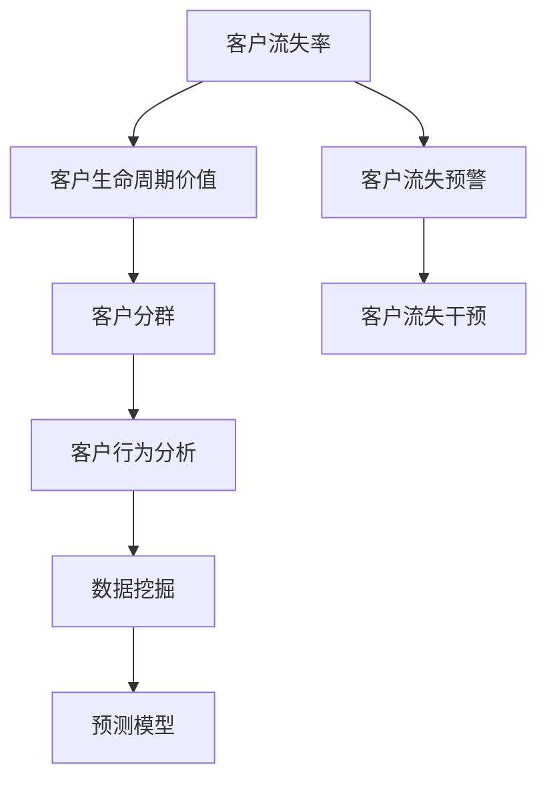
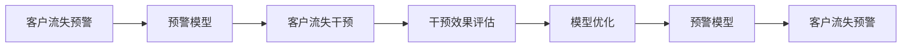
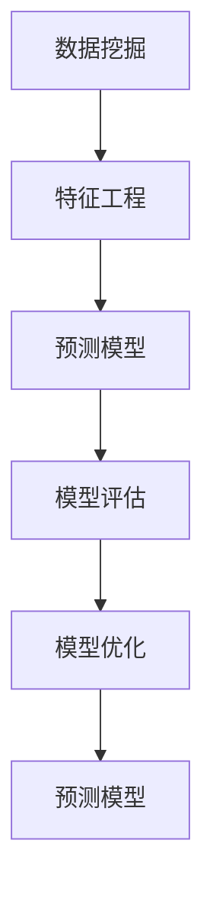
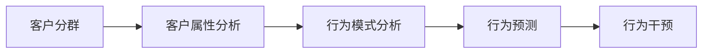

                 

# 信息差的客户流失降低：大数据如何降低客户流失率

## 1. 背景介绍

在当前数字化时代，客户流失问题已经成为了所有企业必须面对的重要挑战。无论是电商平台、金融服务，还是医疗健康，客户流失都会给企业带来显著的经济损失。据相关统计，获取一个新客户的成本是保留一个老客户的5倍。因此，如何降低客户流失率，保持现有客户的稳定，成为了企业战略的关键。

然而，客户流失的原因复杂多样，既包括产品问题、服务体验，也包括信息不对称、信任危机等心理因素。传统的客户流失分析方法往往依赖人工经验，难以全面、精准地识别和预测流失客户。大数据技术的应用，为解决这一难题提供了全新的思路。

本文将从大数据的角度出发，探讨如何利用数据科学方法降低客户流失率。通过构建和分析客户行为数据，寻找客户流失的共性规律和个性化特征，为企业提供针对性的改进策略，进而降低客户流失率。

## 2. 核心概念与联系

### 2.1 核心概念概述

为深入理解大数据在客户流失分析中的应用，本节将介绍几个关键概念：

- 客户流失率：指在一定时间周期内，停止使用企业产品或服务的客户比例。流失率是衡量客户忠诚度和市场稳定性的重要指标。
- 客户生命周期价值(Customer Lifetime Value, CLV)：指一个客户在其生命周期内为企业带来的总收益。CLV越大，客户越有价值，流失风险越高。
- 客户分群：根据客户的属性、行为、价值等因素，将客户分为不同群体，以便针对性分析和管理。
- 客户行为分析：通过收集和分析客户与企业互动的数据，了解客户行为模式和偏好，提供个性化服务。
- 数据挖掘：利用统计学、机器学习等方法，从大量数据中提取有价值的信息和知识，支持决策。
- 预测模型：使用机器学习算法，建立预测客户流失概率的模型，辅助企业进行预警和干预。

这些概念之间的逻辑关系可以通过以下Mermaid流程图来展示：



这个流程图展示了从客户流失率出发，通过客户分群、行为分析、数据挖掘，最终到达预测模型和预警干预的完整流程。

### 2.2 概念间的关系

这些核心概念之间存在着紧密的联系，构成了客户流失分析的完整框架。下面我们通过几个Mermaid流程图来展示这些概念之间的关系：

#### 2.2.1 客户流失预警与干预的关系



这个流程图展示了客户流失预警与干预的相互关系。预警模型基于客户行为数据构建，用于预测客户的流失概率。干预措施根据预警结果实施，通过改变客户行为，防止其流失。干预效果评估反馈到预警模型中，进一步优化预警效果。

#### 2.2.2 数据挖掘与预测模型的关系



这个流程图展示了数据挖掘、特征工程、预测模型之间的相互关系。数据挖掘从原始数据中提取有价值的信息，进行特征工程，选择合适的算法和模型进行训练，并不断优化模型性能，以提高预测准确度。

#### 2.2.3 客户分群与行为分析的关系



这个流程图展示了客户分群与行为分析的相互关系。通过客户分群，可以针对不同群体进行属性和行为的深入分析，发现特定群体的行为规律和潜在风险。行为分析进一步探究客户的偏好和变化趋势，提供个性化的服务策略。

## 3. 核心算法原理 & 具体操作步骤
### 3.1 算法原理概述

基于大数据的客户流失分析，本质上是一个分类问题。其核心目标是预测客户是否会流失，并找出流失的关键因素。具体而言，可以通过以下步骤实现：

1. 数据收集：从企业的客户关系管理系统(CRM)、交易记录、客户反馈等多个渠道，收集客户的全生命周期数据。
2. 数据清洗：去除噪音、处理缺失值、数据归一化等，确保数据质量和一致性。
3. 特征工程：根据流失客户的共性特征和个性化差异，提取和构造有意义的特征。
4. 模型训练：选择合适的分类算法，如逻辑回归、决策树、随机森林、支持向量机(SVM)等，训练预测模型。
5. 模型评估：使用交叉验证等方法，评估模型在预测客户流失方面的准确性和鲁棒性。
6. 模型应用：在实时数据流中应用预测模型，识别高流失风险客户，进行预警和干预。

### 3.2 算法步骤详解

基于大数据的客户流失分析可以分为以下具体步骤：

**Step 1: 数据收集**

- 从企业的CRM、交易记录、客服中心等渠道，收集客户的全生命周期数据。
- 数据包括客户的个人信息、行为数据、交易记录、客服记录等。
- 确保数据的准确性和一致性，防止数据丢失和冗余。

**Step 2: 数据清洗**

- 处理缺失值和异常值，保证数据完整性和合理性。
- 去除噪音数据，提高数据质量。
- 数据归一化和标准化，确保数据在不同特征之间的可比性。

**Step 3: 特征工程**

- 根据客户流失的共性规律，提取和构造有意义的特征。
- 常用的特征包括：客户年龄、性别、消费频率、消费金额、客户满意度、投诉记录等。
- 通过特征组合和降维等方法，构造新的特征，提升模型性能。

**Step 4: 模型训练**

- 选择合适的分类算法，如逻辑回归、决策树、随机森林、SVM等。
- 使用训练集数据，训练预测模型。
- 设置合适的超参数，如学习率、正则化系数等，优化模型性能。

**Step 5: 模型评估**

- 使用交叉验证等方法，评估模型在测试集上的表现。
- 计算模型的准确率、召回率、F1分数等指标，衡量模型性能。
- 对模型进行调优，提高预测准确度。

**Step 6: 模型应用**

- 在实时数据流中应用预测模型，识别高流失风险客户。
- 通过预警系统，通知相关部门进行干预。
- 根据模型评估结果，不断优化模型和干预策略。

### 3.3 算法优缺点

基于大数据的客户流失分析方法具有以下优点：

- 数据全面性：利用多渠道数据，获得客户的全生命周期数据。
- 预测准确性：使用先进的数据挖掘和机器学习技术，预测客户流失概率。
- 实时预警：在实时数据流中应用模型，及时识别流失风险客户。
- 干预效果评估：通过模型评估结果，优化干预策略，提升客户满意度。

同时，也存在一些局限性：

- 数据质量依赖：数据收集和清洗过程，依赖于企业的内部管理和数据质量。
- 特征工程复杂：特征提取和构造需要专业知识，可能存在主观性。
- 模型复杂度：选择合适的分类算法，并进行调参和优化，需要较高的技术门槛。
- 计算资源消耗：数据挖掘和模型训练过程，需要大量计算资源和时间。

尽管存在这些局限性，但通过合理的技术手段和管理措施，可以最大化利用大数据技术，提升客户流失分析的效率和精度。

### 3.4 算法应用领域

基于大数据的客户流失分析，已经在电商、金融、医疗等多个行业得到了广泛应用：

- 电商平台：通过分析用户行为和交易记录，预测用户流失，提升用户体验和满意度。
- 金融服务：利用客户交易数据，预测高风险客户，防范信用风险和金融诈骗。
- 医疗健康：分析患者就诊数据，识别潜在流失客户，优化诊疗服务和客户关系管理。

此外，基于大数据的客户流失分析还可以应用于客户满意度调查、客户细分、市场营销等领域，为企业的决策提供重要支持。

## 4. 数学模型和公式 & 详细讲解  
### 4.1 数学模型构建

客户流失分析的基本模型可以表示为：

$$
y_i = f(x_i; \theta)
$$

其中，$y_i \in \{0, 1\}$ 表示客户第 $i$ 次流失的概率，$x_i$ 为客户的特征向量，$\theta$ 为模型参数。

假设客户流失与多个特征 $x_1, x_2, ..., x_n$ 有关，则模型可以表示为：

$$
y_i = f(x_i; \theta) = \frac{1}{1+e^{-z_i}}
$$

其中，$z_i = \theta^T x_i$，$\theta$ 为模型的权重向量。

### 4.2 公式推导过程

以逻辑回归模型为例，推导其损失函数和梯度计算公式：

首先，定义模型的负对数似然损失函数：

$$
L(y_i, f(x_i; \theta)) = -y_i \log f(x_i; \theta) - (1-y_i) \log (1-f(x_i; \theta))
$$

然后，对模型参数 $\theta$ 求导，得到梯度公式：

$$
\frac{\partial L(y_i, f(x_i; \theta))}{\partial \theta_j} = -(x_{ij} - y_i) f(x_i; \theta) (1 - f(x_i; \theta))
$$

其中，$x_{ij}$ 为特征 $x_i$ 的第 $j$ 个特征值，$f(x_i; \theta)$ 为模型对客户流失的概率预测。

通过梯度下降等优化算法，不断更新模型参数 $\theta$，最小化损失函数 $L(y_i, f(x_i; \theta))$，得到客户流失预测模型。

### 4.3 案例分析与讲解

以下以一个简单的案例来说明基于大数据的客户流失分析过程：

假设某电商平台收集了客户的全生命周期数据，包括注册时间、购买频率、平均消费金额、客户满意度等。我们希望预测客户流失的概率，并识别流失风险较高的客户。

**Step 1: 数据收集**

- 从平台的用户注册记录、交易记录、客服记录中，收集客户的全生命周期数据。
- 数据包括用户的注册时间、最后一次购买时间、平均每月购买次数、平均每次消费金额、投诉记录等。

**Step 2: 数据清洗**

- 处理缺失值和异常值，确保数据完整性和合理性。
- 去除噪音数据，如无效的注册信息和交易记录。
- 数据归一化和标准化，如将消费金额归一化到[0,1]区间。

**Step 3: 特征工程**

- 根据流失客户的共性规律，提取和构造有意义的特征。
- 常用的特征包括：注册时间、最后一次购买时间、平均每月购买次数、平均每次消费金额、投诉记录、客户满意度等。
- 通过特征组合和降维等方法，构造新的特征，如“最近一次购买距今时间”、“客户投诉次数”、“平均月消费与投诉次数的比值”等。

**Step 4: 模型训练**

- 使用逻辑回归模型，训练预测客户流失的概率。
- 设置合适的超参数，如学习率、正则化系数等，优化模型性能。
- 使用交叉验证等方法，评估模型在测试集上的表现。

**Step 5: 模型评估**

- 计算模型的准确率、召回率、F1分数等指标，衡量模型性能。
- 通过模型评估结果，优化模型和特征工程策略。

**Step 6: 模型应用**

- 在实时数据流中应用预测模型，识别高流失风险客户。
- 通过预警系统，通知相关部门进行干预，如优惠券、个性化推荐等。
- 根据模型评估结果，不断优化模型和干预策略，提升客户满意度。

通过以上步骤，该电商平台能够有效预测客户流失概率，及时采取措施，降低客户流失率。

## 5. 项目实践：代码实例和详细解释说明
### 5.1 开发环境搭建

在进行客户流失分析实践前，我们需要准备好开发环境。以下是使用Python进行Scikit-learn开发的简单环境配置流程：

1. 安装Anaconda：从官网下载并安装Anaconda，用于创建独立的Python环境。

2. 创建并激活虚拟环境：
```bash
conda create -n data-env python=3.8 
conda activate data-env
```

3. 安装必要的包：
```bash
pip install scikit-learn pandas numpy matplotlib seaborn sklearn
```

4. 安装可视化工具：
```bash
pip install matplotlib seaborn
```

完成上述步骤后，即可在`data-env`环境中开始实践。

### 5.2 源代码详细实现

以下是使用Scikit-learn进行客户流失预测的Python代码实现：

```python
import pandas as pd
from sklearn.model_selection import train_test_split
from sklearn.linear_model import LogisticRegression
from sklearn.metrics import accuracy_score, confusion_matrix
from sklearn.preprocessing import StandardScaler

# 加载数据
data = pd.read_csv('customer_data.csv')

# 数据清洗和处理
data.dropna(inplace=True)
data['last_purchase'] = pd.to_datetime(data['last_purchase'])
data['months_since_last_purchase'] = (pd.to_datetime('2021-01-01') - data['last_purchase']).dt.days // 30

# 特征选择和构造
features = ['age', 'gender', 'months_since_last_purchase', 'average_spending', 'complaints']
target = 'churn'

# 标准化处理
scaler = StandardScaler()
data[features] = scaler.fit_transform(data[features])

# 划分训练集和测试集
X_train, X_test, y_train, y_test = train_test_split(data[features], data[target], test_size=0.2, random_state=42)

# 训练模型
model = LogisticRegression()
model.fit(X_train, y_train)

# 模型评估
y_pred = model.predict(X_test)
accuracy = accuracy_score(y_test, y_pred)
confusion_mat = confusion_matrix(y_test, y_pred)

# 输出结果
print(f"Accuracy: {accuracy:.2f}")
print(f"Confusion Matrix:\n{confusion_mat}")
```

### 5.3 代码解读与分析

让我们再详细解读一下关键代码的实现细节：

**数据加载和清洗**

- `pd.read_csv`：从CSV文件中加载数据。
- `data.dropna(inplace=True)`：去除缺失值，确保数据完整性。
- `data['last_purchase'] = pd.to_datetime(data['last_purchases'])`：将购买时间转换为日期时间格式，便于时间间隔计算。
- `data['months_since_last_purchase'] = (pd.to_datetime('2021-01-01') - data['last_purchase']).dt.days // 30`：计算最近一次购买距今时间，以月为单位。

**特征选择和构造**

- `features = ['age', 'gender', 'months_since_last_purchase', 'average_spending', 'complaints']`：选择和客户流失相关的特征。
- `target = 'churn'`：定义目标变量，表示流失客户。
- `scaler = StandardScaler()`：创建标准化器，用于归一化数据。
- `data[features] = scaler.fit_transform(data[features])`：对特征数据进行标准化处理，确保特征在模型中具有同等权重。

**模型训练和评估**

- `model = LogisticRegression()`：创建逻辑回归模型。
- `model.fit(X_train, y_train)`：训练模型，使用训练集数据。
- `y_pred = model.predict(X_test)`：使用测试集数据进行预测。
- `accuracy = accuracy_score(y_test, y_pred)`：计算模型的准确率。
- `confusion_mat = confusion_matrix(y_test, y_pred)`：计算模型的混淆矩阵。

**输出结果**

- `print(f"Accuracy: {accuracy:.2f}")`：输出模型的准确率。
- `print(f"Confusion Matrix:\n{confusion_mat}")`：输出模型的混淆矩阵，便于分析和改进。

通过以上代码，我们能够完成一个简单的客户流失预测任务，并获得模型的评估结果。

## 6. 实际应用场景

### 6.4 未来应用展望

随着大数据和机器学习技术的不断进步，客户流失分析将变得更加全面和精准。未来的趋势可能包括：

1. 实时分析：利用实时数据流，及时识别高流失风险客户，采取及时干预措施。
2. 多模态数据融合：结合客户行为数据、情感分析、社交网络数据等多种数据源，构建更加全面的客户画像。
3. 动态模型更新：根据客户行为的变化和新数据的到来，动态更新预测模型，提高模型适应性。
4. 个性化服务：利用客户分群和行为分析，提供个性化的服务和推荐，提升客户满意度和忠诚度。
5. 风险预警机制：建立完善的客户流失预警机制，定期评估客户流失风险，及时调整策略。

这些技术趋势将帮助企业更全面、精准地识别和预测客户流失风险，采取及时有效的干预措施，降低客户流失率，提高客户忠诚度和企业竞争力。

## 7. 工具和资源推荐
### 7.1 学习资源推荐

为了帮助开发者掌握客户流失分析的技术，这里推荐一些优质的学习资源：

1. 《Python数据科学手册》：全面介绍Python在数据科学中的应用，包括数据清洗、特征工程、模型训练等。
2. Scikit-learn官方文档：提供详细的Scikit-learn库使用方法和示例，涵盖分类、回归、聚类等多个算法。
3. Kaggle数据集和竞赛：利用Kaggle平台的数据集进行实践练习，积累经验和技巧。
4. 网络公开课和讲座：如Coursera、edX、Udacity等平台上的数据科学课程，深入学习相关知识。
5. 技术博客和社区：如KDnuggets、DataCamp、Stack Overflow等社区，分享最新的技术动态和实践经验。

通过对这些资源的深入学习，相信你一定能够掌握客户流失分析的技术，并应用于实际项目中。

### 7.2 开发工具推荐

高效的数据科学实践离不开优质的开发工具支持。以下是几款常用的工具：

1. Python：Python作为数据科学的主流语言，具有丰富的科学计算库和数据分析框架，非常适合进行数据科学项目。
2. Jupyter Notebook：交互式的笔记本环境，方便进行代码调试和数据探索。
3. Scikit-learn：功能强大的机器学习库，涵盖回归、分类、聚类等多个算法。
4. Pandas：数据处理和分析库，支持高效的数据清洗和特征工程。
5. Matplotlib和Seaborn：数据可视化库，帮助进行数据探索和模型评估。

合理利用这些工具，可以显著提升数据科学项目的开发效率，缩短实践周期。

### 7.3 相关论文推荐

客户流失分析领域的研究已经积累了大量成果，以下是几篇有代表性的论文，推荐阅读：

1. "Predicting Customer Churn Using Classification Trees and Logistic Regression"：提出使用分类树和逻辑回归模型预测客户流失的经典方法。
2. "Customer Churn Prediction: Concepts and Approaches"：综述了客户流失预测的研究进展和方法。
3. "Customer Churn Prediction and Analysis Using Machine Learning: A Review"：全面回顾了机器学习在客户流失预测中的应用。
4. "An Empirical Comparison of Classification Models for Predicting Customer Churn"：对比了多种分类模型在客户流失预测中的表现。
5. "Customer Churn Prediction Using Deep Learning Techniques"：介绍使用深度学习技术进行客户流失预测的新方法。

这些论文展示了客户流失分析领域的经典算法和前沿进展，值得深入学习。

## 8. 总结：未来发展趋势与挑战
### 8.1 研究成果总结

本文从数据科学的角度，探讨了利用大数据降低客户流失率的方法。通过收集和分析客户行为数据，建立预测模型，识别流失风险客户，及时采取干预措施，可以显著降低客户流失率，提高客户满意度和企业竞争力。

### 8.2 未来发展趋势

展望未来，客户流失分析技术将呈现以下几个发展趋势：

1. 实时化：利用实时数据流，及时识别流失风险客户，进行实时预警和干预。
2. 动态化：根据客户行为变化和新数据的到来，动态更新模型，提高预测准确度。
3. 多模态化：结合客户行为数据、情感分析、社交网络数据等多种数据源，构建更加全面的客户画像。
4. 个性化服务：利用客户分群和行为分析，提供个性化的服务和推荐，提升客户满意度和忠诚度。
5. 自动化：引入自动化模型选择和超参数调优技术，降低数据科学家的工作量。

这些技术趋势将帮助企业更全面、精准地识别和预测客户流失风险，采取及时有效的干预措施，降低客户流失率，提高客户忠诚度和企业竞争力。

### 8.3 面临的挑战

尽管客户流失分析技术已经取得了显著进展，但在迈向全面应用的过程中，仍面临诸多挑战：

1. 数据质量：数据收集和清洗过程，依赖于企业的内部管理和数据质量。如何确保数据的完整性和一致性，是数据科学家的首要任务。
2. 特征工程：特征提取和构造需要专业知识，可能存在主观性。如何选择合适的特征，进行有效的特征工程，需要更多的实践经验和理论研究。
3. 模型复杂度：选择合适的分类算法，并进行调参和优化，需要较高的技术门槛。如何降低模型复杂度，提高模型的解释性和可解释性，是未来研究的重要方向。
4. 计算资源消耗：数据挖掘和模型训练过程，需要大量计算资源和时间。如何优化计算资源的使用，提高模型训练的效率，是企业需要关注的问题。

尽管存在这些挑战，但通过合理的技术手段和管理措施，可以最大化利用大数据技术，提升客户流失分析的效率和精度。

### 8.4 研究展望

未来的客户流失分析研究需要在以下几个方面寻求新的突破：

1. 自动化和智能化：引入自动化模型选择和超参数调优技术，降低数据科学家的工作量，提高工作效率。
2. 多模态数据融合：结合客户行为数据、情感分析、社交网络数据等多种数据源，构建更加全面的客户画像，提升预测准确度。
3. 解释性和透明性：引入因果推断、解释性机器学习等方法，提高模型的解释性和可解释性，增强客户对模型的信任。
4. 隐私保护：在数据收集和分析过程中，确保客户隐私保护，避免数据泄露和滥用。

这些研究方向的探索，将帮助企业更好地理解和预测客户流失风险，采取及时有效的干预措施，降低客户流失率，提高客户满意度和企业竞争力。

## 9. 附录：常见问题与解答
**Q1: 数据质量对客户流失分析结果有什么影响？**

A: 数据质量直接影响客户流失分析的结果，高质量的数据才能保证预测模型的准确性和可靠性。数据质量问题主要表现在：

- 数据缺失：缺失值和异常值会干扰模型的正常训练，导致预测结果偏差。需要采用数据清洗和补全技术，处理缺失值和异常值。
- 数据不一致：数据格式和编码不一致，影响数据的准确性和一致性。需要进行数据预处理和规范化，统一数据格式和编码。
- 数据噪音：数据中存在大量噪音和无关信息，影响模型的训练和预测效果。需要进行数据清洗和特征选择，去除噪音和无关信息。

因此，确保数据质量是客户流失分析的首要任务，需要制定完善的数据质量控制策略和流程，提升数据质量和可用性。

**Q2: 如何选择特征进行客户流失预测？**

A: 特征选择是客户流失分析的关键步骤，直接影响预测模型的性能。选择合适的特征需要考虑以下几个方面：

- 领域知识：根据业务背景和领域知识，选择与客户流失相关的特征。例如，电商领域可以选择购买频率、平均消费金额、客户满意度等特征。
- 特征相关性：选择与目标变量高度相关的特征，避免选择冗余和无关的特征。可以使用相关性分析、方差分析等方法，评估特征与目标变量的相关性。
- 特征可解释性：选择易于理解和解释的特征，增强模型的可解释性和可审计性。避免选择过于复杂的特征，降低模型的复杂度。
- 特征多样性：选择不同类型的特征，例如数值型、分类型、文本型特征，提升模型的鲁棒性和泛化能力。

总之，特征选择需要综合考虑业务需求、领域知识、特征相关性、可解释性和多样性，选择与目标变量高度相关的特征，确保模型的准确性和可解释性。

**Q3: 如何评估客户流失预测模型的效果？**

A: 评估客户流失预测模型的效果，需要考虑以下几个指标：

- 准确率(Accuracy)：衡量模型正确预测的比例，即预测正确的客户流失比例。
- 召回率(Recall)：衡量模型能够发现所有实际流失客户的比例，即预测正确的流失客户比例。
- F1分数(F1-score)：综合考虑准确率和召回率，衡量模型的综合性能。

此外，还可以使用混淆矩阵、ROC曲线、PR曲线等指标，评估模型的性能和效果。根据评估结果，优化模型参数和特征工程策略，提高预测准确度。

**Q4: 客户流失分析中的隐私保护问题如何解决？**

A: 客户流失分析涉及大量的客户数据，隐私保护是必须关注的重要问题。以下是

