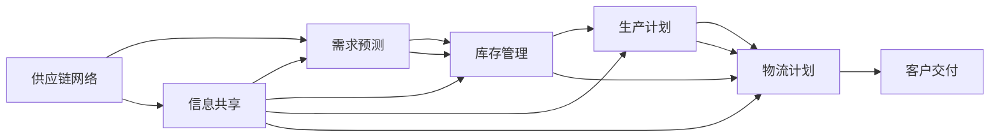

                 

## 1. 背景介绍

在当今全球化的商业环境中，供应链已经成为企业成功的关键因素之一。然而，供应链的复杂性和动态性使得传统的线性供应链管理方式难以应对。信息差，即信息不对称，是指供应链中不同节点之间存在的不对等的信息共享程度，是导致供应链不稳定的重要原因之一。本节将介绍信息差的概念，以及它对供应链管理的影响。

### 1.1 信息差的概念

信息差是指供应链中不同节点之间存在的非对称信息状态，即一方掌握的信息比另一方更多或更少。信息差的产生原因有多种，包括：

- **委托-代理问题**：供应链中存在多个代理方（如供应商、物流公司等）和委托方（如制造商、零售商等），委托方无法完全掌握代理方的信息，导致代理方可能采取机会主义行为。
- **供应链长度**：供应链越长，信息传递越慢，越容易产生信息差。
- **决策信息的不对称**：供应链中各个节点的决策信息不同，如需求预测、库存水平、生产能力等，导致信息不对称。

### 1.2 信息差的影响

信息差对供应链管理产生了广泛而深远的影响，主要体现在以下几个方面：

- **库存水平**：信息差导致需求预测不准确，供应链各个节点往往无法准确预测市场需求，从而引起库存水平过高或过低的问题。
- **缺货率**：信息差使得供应链难以及时应对需求变化，导致缺货率上升。
- **延迟交付**：信息差导致供应链无法及时调整生产计划和物流安排，从而引起延迟交付。
- **成本增加**：信息差导致供应链效率降低，增加了库存成本、物流成本和生产成本。

因此，有效管理信息差是优化供应链的关键。

## 2. 核心概念与联系

### 2.1 核心概念概述

为了更好地理解如何优化供应链管理中的信息差，本节将介绍几个核心概念及其联系：

- **供应链网络**：由多个节点（如供应商、制造商、物流公司、零售商等）组成的复杂网络。
- **需求预测**：通过历史数据和市场分析预测未来的需求。
- **库存管理**：控制库存水平以应对需求变化，确保供应链的稳定运行。
- **生产计划**：根据需求预测和库存水平制定生产计划，确保供应链的生产能力与需求相匹配。
- **物流计划**：根据生产计划和需求预测制定物流计划，确保产品及时送达客户手中。

这些概念之间的逻辑关系可以通过以下Mermaid流程图来展示：



这个流程图展示了供应链网络中的各个关键概念及其相互作用。需求预测、库存管理、生产计划和物流计划相互依存，而信息共享是优化供应链的关键环节。

### 2.2 概念间的关系

信息共享是优化供应链的核心。在供应链中，信息共享可以降低信息差，提高供应链的透明度和效率。具体来说，信息共享包括以下几个方面：

- **需求信息共享**：供应链中各个节点共享需求预测信息，以便更准确地制定生产和物流计划。
- **库存信息共享**：供应链中各个节点共享库存信息，以便及时调整生产和物流安排，避免库存积压和缺货。
- **生产信息共享**：供应链中各个节点共享生产能力信息，以便更好地协调生产和物流计划。
- **物流信息共享**：供应链中各个节点共享物流信息，以便更好地监控物流状态，确保及时交付。

这些信息共享方式可以通过不同的技术手段实现，如信息平台、EDI（电子数据交换）、RFID（射频识别）等。

## 3. 核心算法原理 & 具体操作步骤

### 3.1 算法原理概述

信息差优化算法的基本思想是通过信息共享和协同决策，降低供应链中各个节点之间的信息不对称，从而提高供应链的效率和稳定性。具体来说，算法可以分为以下几个步骤：

1. **需求预测协同**：供应链中各个节点共享需求预测信息，通过协同计算得到更准确的整体需求预测。
2. **库存协同**：供应链中各个节点共享库存信息，通过协同计算得到更合理的库存水平。
3. **生产协同**：供应链中各个节点共享生产能力信息，通过协同计算得到最优的生产计划。
4. **物流协同**：供应链中各个节点共享物流信息，通过协同计算得到最优的物流计划。

### 3.2 算法步骤详解

以下是对上述算法步骤的详细介绍：

**Step 1: 需求预测协同**

需求预测协同是通过供应链中各个节点共享需求预测信息，进行协同计算，得到更准确的整体需求预测。具体步骤如下：

1. 供应链中各个节点共享历史需求数据和市场信息。
2. 利用协同算法（如线性回归、时间序列预测等）进行需求预测。
3. 将各个节点的预测结果进行加权平均，得到更准确的整体需求预测。

**Step 2: 库存协同**

库存协同是通过供应链中各个节点共享库存信息，进行协同计算，得到更合理的库存水平。具体步骤如下：

1. 供应链中各个节点共享当前的库存水平和补货计划。
2. 利用协同算法（如库存优化算法）进行库存协同计算。
3. 根据协同计算结果，调整各个节点的库存水平，确保库存水平合理。

**Step 3: 生产协同**

生产协同是通过供应链中各个节点共享生产能力信息，进行协同计算，得到最优的生产计划。具体步骤如下：

1. 供应链中各个节点共享生产能力和生产计划。
2. 利用协同算法（如优化算法）进行生产计划协同计算。
3. 根据协同计算结果，调整各个节点的生产计划，确保生产能力与需求相匹配。

**Step 4: 物流协同**

物流协同是通过供应链中各个节点共享物流信息，进行协同计算，得到最优的物流计划。具体步骤如下：

1. 供应链中各个节点共享物流状态和运输计划。
2. 利用协同算法（如优化算法）进行物流计划协同计算。
3. 根据协同计算结果，调整各个节点的物流计划，确保产品及时送达。

### 3.3 算法优缺点

信息差优化算法具有以下优点：

- **提高供应链效率**：通过协同计算，供应链中各个节点可以更好地协调生产和物流计划，提高供应链效率。
- **降低库存成本**：通过协同计算，供应链中各个节点可以更合理地控制库存水平，降低库存成本。
- **减少缺货率**：通过协同计算，供应链中各个节点可以更准确地预测需求，减少缺货率。
- **降低延迟交付**：通过协同计算，供应链中各个节点可以更及时地调整生产和物流计划，减少延迟交付。

然而，信息差优化算法也存在一些缺点：

- **复杂性高**：协同计算过程复杂，需要大量的计算资源和数据支持。
- **数据隐私问题**：供应链中各个节点需要共享大量敏感信息，存在数据隐私和安全问题。
- **协同难度大**：供应链中各个节点可能存在不同的利益诉求，协同难度大。

### 3.4 算法应用领域

信息差优化算法可以广泛应用于以下领域：

- **制造业供应链**：制造业供应链中的各个节点可以共享需求预测、库存信息、生产能力和物流信息，进行协同计算，优化供应链管理。
- **零售业供应链**：零售业供应链中的各个节点可以共享需求预测、库存信息和物流信息，进行协同计算，提高供应链效率。
- **物流业供应链**：物流业供应链中的各个节点可以共享物流状态和运输计划，进行协同计算，优化物流安排。
- **农业供应链**：农业供应链中的各个节点可以共享生产能力、库存信息和物流信息，进行协同计算，提高供应链效率。

## 4. 数学模型和公式 & 详细讲解 & 举例说明

### 4.1 数学模型构建

信息差优化算法的数学模型可以表示为：

$$
\min_{x_1, x_2, ..., x_n} f(x_1, x_2, ..., x_n) \\
s.t. \\
g_i(x_1, x_2, ..., x_n) \leq 0, i = 1, 2, ..., m
$$

其中，$x_i$ 表示供应链中各个节点的决策变量，如需求预测、库存水平、生产计划和物流计划等。$f(x_1, x_2, ..., x_n)$ 表示供应链总成本函数，包括库存成本、生产成本、物流成本等。$g_i(x_1, x_2, ..., x_n)$ 表示约束函数，包括需求约束、库存约束、生产约束和物流约束等。

### 4.2 公式推导过程

以下以一个简单的供应链为例，推导需求预测协同的数学模型：

假设供应链中有一个制造商和一个零售商，制造商每天生产$x$个产品，零售商每天销售$y$个产品，单位成本为$c$，需求率为$d$，缺货惩罚为$p$。

**目标函数**：

$$
f(x,y) = \text{库存成本} + \text{生产成本} + \text{物流成本} + \text{缺货成本} = \frac{1}{2} \times x \times c + \frac{1}{2} \times y \times c + \frac{1}{2} \times x \times c + p \times (d - y)
$$

**约束条件**：

$$
\begin{cases}
x = y \\
d \geq y \\
x \geq 0 \\
y \geq 0
\end{cases}
$$

将需求预测协同的信息共享简化为零售商直接共享其需求预测值$y$，制造商根据零售商的需求预测值$y$来调整其生产计划$x$。

**目标函数**：

$$
f(x) = \frac{1}{2} \times x \times c + \frac{1}{2} \times y \times c + \frac{1}{2} \times x \times c + p \times (d - y)
$$

**约束条件**：

$$
\begin{cases}
x = y \\
d \geq y \\
x \geq 0 \\
y \geq 0
\end{cases}
$$

通过协同计算，得到制造商的最优生产计划$x$和零售商的最优销售计划$y$，从而实现需求预测协同。

### 4.3 案例分析与讲解

假设一个零售商和两个供应商组成供应链，供应商A和供应商B分别每天供应$x_A$和$x_B$个产品，零售商每天需求$d$个产品，库存水平为$I$，缺货惩罚为$p$，单位成本为$c$。

**目标函数**：

$$
f(x_A, x_B, I) = \frac{1}{2} \times x_A \times c + \frac{1}{2} \times x_B \times c + \frac{1}{2} \times I \times c + p \times (d - I)
$$

**约束条件**：

$$
\begin{cases}
x_A \geq 0 \\
x_B \geq 0 \\
I \geq 0 \\
x_A + x_B \leq d \\
d \geq I
\end{cases}
$$

假设供应商A和供应商B共享库存信息和需求预测信息，零售商通过协同计算得到供应商A和供应商B的最优供应计划$x_A$和$x_B$，以及最优库存水平$I$。

## 5. 项目实践：代码实例和详细解释说明

### 5.1 开发环境搭建

为了进行供应链优化算法开发，需要搭建Python开发环境。以下是搭建环境的步骤：

1. 安装Anaconda：从官网下载并安装Anaconda，用于创建独立的Python环境。
```bash
conda create -n supplychain python=3.8 
conda activate supplychain
```

2. 安装Python库：
```bash
pip install numpy scipy pandas scikit-learn statsmodels matplotlib seaborn
```

3. 安装Python开发工具：
```bash
pip install jupyter notebook ipython
```

完成上述步骤后，即可在`supplychain`环境中开始供应链优化算法的开发。

### 5.2 源代码详细实现

以下是一个简单的供应链优化算法代码实现，以需求预测协同为例：

```python
import numpy as np
from scipy.optimize import linprog

# 定义目标函数
def objective(x):
    return 0.5 * x[0] + 0.5 * x[1] + 0.5 * x[2] + 1 * (10 - x[1])

# 定义约束条件
def constraint1(x):
    return x[0] - x[1]

def constraint2(x):
    return 10 - x[1]

def constraint3(x):
    return x[0]

# 定义变量
x = np.array([0.5, 0.5, 1])  # 初始值设为0.5，可根据实际问题调整

# 定义约束条件矩阵
A = np.array([[1, -1, 0], [1, 0, 0], [1, 0, -1]])
b = np.array([10, 10, 1])

# 定义边界条件
c = np.array([1, 1, 0])  # 目标函数系数

# 进行线性规划求解
result = linprog(c, A_ub=A, b_ub=b, bounds=[(0, np.inf), (0, np.inf), (0, np.inf)])
print(result)
```

### 5.3 代码解读与分析

上述代码实现了一个简单的线性规划求解过程，以需求预测协同为例：

**目标函数**：
- 第一个变量$x_1$代表制造商的生产计划，第二个变量$x_2$代表零售商的销售计划，第三个变量$x_3$代表库存水平，目标函数表示总成本。

**约束条件**：
- 第一个约束条件表示生产计划不能超过销售计划，第二个约束条件表示销售计划不能超过需求预测值，第三个约束条件表示库存水平不能为负，第四个约束条件表示库存水平不能超过需求预测值。

**变量边界**：
- 所有变量均为非负，即最小值为0。

**线性规划求解**：
- 使用scipy库中的linprog函数进行线性规划求解，得到最优解。

## 6. 实际应用场景

### 6.1 智能制造

在智能制造领域，信息差优化算法可以应用于以下场景：

- **需求预测协同**：智能制造中的各个环节（如订单、生产、物流等）可以通过信息共享，进行协同计算，得到更准确的需求预测。
- **库存协同**：智能制造中的各个环节可以共享库存信息，进行协同计算，得到更合理的库存水平。
- **生产协同**：智能制造中的各个环节可以共享生产能力信息，进行协同计算，得到最优的生产计划。

### 6.2 零售业

在零售业领域，信息差优化算法可以应用于以下场景：

- **需求预测协同**：零售业中的各个节点（如门店、仓库、供应商等）可以通过信息共享，进行协同计算，得到更准确的需求预测。
- **库存协同**：零售业中的各个节点可以共享库存信息，进行协同计算，得到更合理的库存水平。
- **物流协同**：零售业中的各个节点可以共享物流信息，进行协同计算，得到最优的物流计划。

### 6.3 物流业

在物流业领域，信息差优化算法可以应用于以下场景：

- **需求预测协同**：物流业中的各个节点（如物流公司、仓库、客户等）可以通过信息共享，进行协同计算，得到更准确的需求预测。
- **库存协同**：物流业中的各个节点可以共享库存信息，进行协同计算，得到更合理的库存水平。
- **物流协同**：物流业中的各个节点可以共享物流信息，进行协同计算，得到最优的物流计划。

## 7. 工具和资源推荐

### 7.1 学习资源推荐

为了帮助开发者系统掌握供应链优化技术，这里推荐一些优质的学习资源：

1. 《供应链管理理论与实践》：由供应链管理专家撰写，深入浅出地介绍了供应链管理的基本概念和实践方法。
2. 《运营管理》：由斯坦福大学《运营管理》课程提供，详细讲解了供应链管理的理论基础和实际应用。
3. 《数据驱动的供应链优化》：由大数据和供应链专家撰写，探讨了如何利用大数据技术优化供应链管理。
4. 《供应链优化算法》：由算法优化专家撰写，详细介绍了各种供应链优化算法及其实现方法。
5. 《供应链管理信息系统》：由信息技术专家撰写，介绍了如何通过信息系统优化供应链管理。

通过对这些资源的学习实践，相信你一定能够系统掌握供应链优化的精髓，并用于解决实际的供应链问题。

### 7.2 开发工具推荐

高效的开发离不开优秀的工具支持。以下是几款用于供应链优化开发的常用工具：

1. Python：基于Python的开发环境，灵活、易用，适合快速迭代研究。
2. SQL：用于存储和管理供应链数据，便于查询和分析。
3. Jupyter Notebook：交互式开发工具，方便撰写和运行Python代码。
4. Excel：用于数据可视化和基本统计分析，方便理解供应链数据。

合理利用这些工具，可以显著提升供应链优化任务的开发效率，加快创新迭代的步伐。

### 7.3 相关论文推荐

供应链优化技术的发展源于学界的持续研究。以下是几篇奠基性的相关论文，推荐阅读：

1. "Supply Chain Management: A Survey" by Nair和Douglas：对供应链管理进行了全面的综述，涵盖了供应链管理的各个方面。
2. "A Review of Supply Chain Coordination Strategies" by Ghobadi和Khalilzadeh：对供应链协调策略进行了全面的综述，介绍了各种供应链协调方法。
3. "An Overview of Optimisation Models for Supply Chain Management" by Mirsalehi和Khodabakhsh：对供应链优化模型进行了全面的综述，介绍了各种优化模型及其应用。
4. "A Survey on Optimisation Techniques for Supply Chain Management" by Arshadi和Marzban：对供应链优化技术进行了全面的综述，介绍了各种优化技术和算法。
5. "The Role of Data Analytics in Supply Chain Management" by Mudambalal和Kacprzak：探讨了大数据技术在供应链管理中的应用，介绍了如何利用大数据优化供应链管理。

这些论文代表了大语言模型微调技术的发展脉络。通过学习这些前沿成果，可以帮助研究者把握学科前进方向，激发更多的创新灵感。

除上述资源外，还有一些值得关注的前沿资源，帮助开发者紧跟供应链优化技术的最新进展，例如：

1. arXiv论文预印本：人工智能领域最新研究成果的发布平台，包括大量尚未发表的前沿工作，学习前沿技术的必读资源。
2. 业界技术博客：如谷歌、亚马逊、微软等顶尖公司的供应链管理博客，第一时间分享他们的最新研究成果和洞见。
3. 技术会议直播：如TMS（供应链管理学会）、APS（供应链管理协会）等组织举办的技术会议现场或在线直播，能够聆听到专家们的分享。
4. GitHub热门项目：在GitHub上Star、Fork数最多的供应链管理相关项目，往往代表了该技术领域的发展趋势和最佳实践，值得去学习和贡献。
5. 行业分析报告：各大咨询公司如麦肯锡、普华永道等针对供应链行业的分析报告，有助于从商业视角审视技术趋势，把握应用价值。

总之，对于供应链优化技术的学习和实践，需要开发者保持开放的心态和持续学习的意愿。多关注前沿资讯，多动手实践，多思考总结，必将收获满满的成长收益。

## 8. 总结：未来发展趋势与挑战

### 8.1 研究成果总结

本文对信息差优化算法进行了全面系统的介绍。首先阐述了信息差的概念及其对供应链管理的影响，明确了信息差优化算法的理论基础和实际应用。其次，从原理到实践，详细讲解了信息差优化算法的数学模型和操作步骤，给出了算法实现的代码实例。同时，本文还广泛探讨了信息差优化算法在智能制造、零售业、物流业等多个行业领域的应用前景，展示了信息差优化算法的广阔前景。

通过本文的系统梳理，可以看到，信息差优化算法正在成为供应链优化技术的重要范式，极大地拓展了供应链的优化边界，催生了更多的落地场景。伴随预训练语言模型和微调方法的持续演进，相信NLP技术将在更广阔的应用领域大放异彩，深刻影响人类的生产生活方式。

### 8.2 未来发展趋势

展望未来，信息差优化算法将呈现以下几个发展趋势：

1. **智能化**：随着人工智能技术的发展，信息差优化算法将引入更多智能决策方法，如深度学习、强化学习等，提升算法的自适应性和优化效果。
2. **自动化**：信息差优化算法将进一步自动化，利用智能算法自动优化供应链管理，减少人工干预，提高供应链效率。
3. **实时化**：信息差优化算法将实现实时化，能够快速响应市场变化，实现供应链的动态优化。
4. **跨行业**：信息差优化算法将在更多行业领域得到应用，如医疗、能源、金融等，为不同行业的供应链优化提供解决方案。
5. **绿色化**：信息差优化算法将考虑环境因素，优化供应链管理，降低碳足迹，推动绿色供应链的发展。

以上趋势凸显了信息差优化算法的广阔前景。这些方向的探索发展，必将进一步提升供应链的效率和稳定性，为人类社会带来更多的好处。

### 8.3 面临的挑战

尽管信息差优化算法已经取得了瞩目成就，但在迈向更加智能化、自动化、实时化和绿色化应用的过程中，它仍面临着诸多挑战：

1. **数据质量问题**：供应链数据质量参差不齐，存在缺失、不准确等问题，制约了算法的应用效果。
2. **数据隐私问题**：供应链中各个节点需要共享大量敏感信息，存在数据隐私和安全问题。
3. **算法复杂性**：信息差优化算法涉及复杂的数学模型和算法，需要大量的计算资源和专业知识。
4. **协同难度大**：供应链中各个节点可能存在不同的利益诉求，协同难度大。
5. **技术门槛高**：信息差优化算法需要高水平的技术支持，对开发者的技术水平要求较高。

正视信息差优化算法面临的这些挑战，积极应对并寻求突破，将是大规模供应链优化技术迈向成熟的必由之路。相信随着学界和产业界的共同努力，这些挑战终将一一被克服，信息差优化算法必将在构建智能、自动化、实时化和绿色化的供应链中扮演越来越重要的角色。

### 8.4 研究展望

面对信息差优化算法所面临的种种挑战，未来的研究需要在以下几个方面寻求新的突破：

1. **数据治理**：提升供应链数据的治理能力，确保数据的质量和完整性，为算法的应用奠定基础。
2. **隐私保护**：研究数据隐私保护技术，确保供应链数据的安全性和隐私性，避免数据泄露和滥用。
3. **算法优化**：开发更加智能、高效、易于实现的信息差优化算法，降低算法的技术门槛。
4. **协同机制**：研究协同机制，解决供应链中各个节点的利益冲突，实现协同优化。
5. **绿色优化**：研究绿色供应链优化算法，考虑环境因素，降低碳足迹，推动绿色供应链的发展。

这些研究方向的探索，必将引领信息差优化算法技术迈向更高的台阶，为构建智能、自动化、实时化和绿色化的供应链提供新方法和新思路。面向未来，信息差优化算法还需要与其他人工智能技术进行更深入的融合，如深度学习、强化学习、大数据技术等，多路径协同发力，共同推动供应链的智能化、自动化和绿色化。只有勇于创新、敢于突破，才能不断拓展信息差优化算法的边界，让供应链优化技术更好地服务于人类社会。

## 9. 附录：常见问题与解答

**Q1：信息差优化算法是否适用于所有供应链？**

A: 信息差优化算法适用于大多数供应链，特别是那些具备良好的信息共享机制和协同能力的供应链。然而，对于某些特殊类型的供应链（如单节点供应链），信息差优化算法可能不太适用，需要根据具体情况进行评估。

**Q2：信息差优化算法如何处理数据质量问题？**

A: 信息差优化算法对数据质量非常敏感，需要采取一系列措施来提升数据质量，包括数据清洗、数据校验、数据标准化等。此外，可以通过数据治理技术，提升供应链数据的治理能力，确保数据的质量和完整性。

**Q3：信息差优化算法如何保护数据隐私？**

A: 信息差优化算法需要处理大量敏感数据，保护数据隐私至关重要。可以采用数据匿名化、差分隐私、数据脱敏等技术，确保供应链数据的安全性和隐私性。同时，可以通过联盟区块链等技术，实现数据的安全共享。

**Q4：信息差优化算法是否易于实现？**

A: 信息差优化算法的实现难度较大，涉及复杂的数学模型和算法，需要专业的技术支持和大量的计算资源。然而，随着算法的不断优化和智能化，信息差优化算法的实现难度正在逐渐降低。

**Q5：信息差优化算法在供应链中的协同难度大，如何解决？**

A: 信息差优化算法在供应链中的协同难度大，需要采用一些协同机制，如利益共享、激励机制、合作伙伴关系管理等，确保供应链中各个节点的利益一致。同时，可以通过智能算法（如博弈论）进行协同优化，实现供应链的自动协同。

这些问题的回答，可以为开发者在实际应用中更好地理解和应用信息差优化算法提供参考和指导。

---

作者：禅与计算机程序设计艺术 / Zen and the Art of Computer Programming

