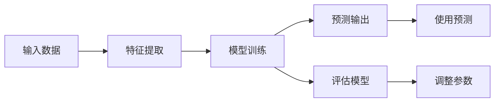

                 

# 分类(Classification) - 原理与代码实例讲解

> 关键词：分类, 监督学习, 逻辑回归, 支持向量机, 决策树, 集成学习, Python, Scikit-learn

## 1. 背景介绍

### 1.1 问题由来

在人工智能领域，分类是最基础也是最广泛应用的一种机器学习任务。分类问题指的是，给定输入数据和其对应的标签，训练一个模型能够对新输入数据进行正确的分类。分类问题在金融、医疗、电商、安全等多个领域都有重要应用，如客户流失预测、疾病诊断、欺诈检测、图片分类等。

近年来，随着深度学习技术的快速发展，神经网络已经成为处理分类问题的主要工具。经典的全连接神经网络、卷积神经网络（CNN）、循环神经网络（RNN）等模型都已经被广泛应用于图像、语音、自然语言处理等多个领域。但神经网络模型通常比较复杂，训练成本高，难以解释，因此并不适用于所有场景。相比之下，传统的基于统计模型的分类算法具有简单易懂、计算量小、可解释性强等优点，仍然有重要的研究价值和应用前景。

### 1.2 问题核心关键点

要充分理解基于统计模型的分类算法，需要先掌握以下核心概念：

- **监督学习（Supervised Learning）**：在有标签数据上进行训练，并利用训练数据对未知数据进行预测的任务。
- **损失函数（Loss Function）**：度量模型预测与真实标签之间的误差。
- **过拟合（Overfitting）**：模型在训练集上表现良好，但在测试集上表现不佳的现象。
- **正则化（Regularization）**：通过添加约束条件来限制模型复杂度，避免过拟合。
- **交叉验证（Cross-Validation）**：通过将数据集划分为训练集和验证集，评估模型的泛化能力。
- **集成学习（Ensemble Learning）**：将多个模型的预测结果进行集成，提高预测的准确性。

这些概念是理解分类算法的基础，后续将详细讲解每种算法的原理和实现方法。

## 2. 核心概念与联系

### 2.1 核心概念概述

基于统计模型的分类算法主要包括逻辑回归（Logistic Regression）、支持向量机（Support Vector Machine, SVM）、决策树（Decision Tree）、随机森林（Random Forest）等。这些算法虽然实现方式不同，但共同遵循以下核心思想：

- **特征提取**：从输入数据中提取出对分类有帮助的特征，减少噪音和冗余信息。
- **模型训练**：利用有标签数据对模型进行训练，学习分类规律。
- **预测输出**：使用训练好的模型对新输入数据进行分类。

### 2.2 概念间的关系

以下是一个简单的Mermaid流程图，展示了基于统计模型的分类算法的主要流程：



这个流程图展示了分类算法的核心流程：首先对输入数据进行特征提取，然后利用训练数据对模型进行训练，接着使用训练好的模型对新数据进行预测，并评估模型的表现，最后根据评估结果调整模型参数，进一步优化模型的性能。

## 3. 核心算法原理 & 具体操作步骤

### 3.1 算法原理概述

基于统计模型的分类算法通常分为两类：

- **线性分类器**：模型假设输入特征和标签之间存在线性关系，如逻辑回归、支持向量机等。
- **非线性分类器**：模型假设输入特征和标签之间存在非线性关系，如决策树、随机森林等。

这些算法虽然原理不同，但都利用损失函数来优化模型参数，通过最小化损失函数来实现分类。下面分别介绍几种典型的分类算法。

### 3.2 算法步骤详解

#### 3.2.1 逻辑回归

逻辑回归（Logistic Regression）是一种线性分类模型，常用于二分类和多分类问题。其基本原理是通过线性回归模型对输入特征进行加权，然后使用sigmoid函数将线性输出映射到[0,1]区间，表示预测为正类的概率。

逻辑回归的损失函数通常使用二元交叉熵损失（Binary Cross Entropy Loss）：

$$
\mathcal{L} = -\frac{1}{N}\sum_{i=1}^N[y_i\log(\hat{y}_i) + (1-y_i)\log(1-\hat{y}_i)]
$$

其中 $y_i$ 表示第 $i$ 个样本的真实标签，$\hat{y}_i$ 表示模型预测为正类的概率，$N$ 表示样本总数。

训练逻辑回归模型的目标是最小化损失函数：

$$
\theta^* = \mathop{\arg\min}_{\theta}\mathcal{L}
$$

其中 $\theta$ 为模型参数，包括输入特征的权重和偏置项。训练过程通常使用梯度下降算法更新模型参数。

#### 3.2.2 支持向量机

支持向量机（Support Vector Machine, SVM）是一种线性分类算法，通过构造最优超平面来将不同类别的数据分开。SVM的目标是最小化所有误分类样本的间隔，使得超平面尽可能地远离数据。

SVM的损失函数通常使用hinge损失：

$$
\mathcal{L} = \frac{1}{N}\sum_{i=1}^N[\max(0, 1 - y_iw^T\phi(x_i) + b)] + \frac{\lambda}{2}\|\mathbf{w}\|_2^2
$$

其中 $y_i$ 表示第 $i$ 个样本的真实标签，$w$ 表示模型参数向量，$\phi$ 表示特征映射函数，$b$ 表示偏置项，$\lambda$ 表示正则化参数，$\|\mathbf{w}\|_2$ 表示 $w$ 的欧几里得范数。

训练SVM模型的目标是最小化损失函数：

$$
\theta^* = \mathop{\arg\min}_{\theta}\mathcal{L}
$$

其中 $\theta$ 为模型参数，包括特征映射函数 $\phi$ 的参数和偏置项 $b$。训练过程通常使用梯度下降算法或SMO（Sequential Minimal Optimization）算法更新模型参数。

#### 3.2.3 决策树

决策树（Decision Tree）是一种基于树形结构的分类算法，通过不断将数据集分成更小的子集来构建决策树。决策树的构建通常使用贪心算法，每次选择最优的特征进行分割，直到满足停止条件。

决策树的训练过程通常包括两个步骤：

1. 构建决策树。使用贪心算法从训练集中选择最优的特征和分割点，构建一棵决策树。
2. 对决策树进行剪枝。通过剪枝来减少决策树的复杂度，避免过拟合。

决策树的评估指标通常包括准确率（Accuracy）、精确率（Precision）、召回率（Recall）等。

#### 3.2.4 随机森林

随机森林（Random Forest）是一种集成学习算法，通过组合多个决策树来提高分类性能。随机森林通常包括两个步骤：

1. 训练多个决策树。从训练集中有放回地随机采样样本和特征，训练多棵决策树。
2. 集成多个决策树的预测结果。对每个样本，统计多棵决策树预测结果的平均值或投票结果，作为最终预测。

随机森林的评估指标通常包括准确率、精确率、召回率等。

### 3.3 算法优缺点

#### 3.3.1 逻辑回归

**优点**：

- 模型简单，易于理解和实现。
- 训练速度快，计算量小。
- 可以处理多分类问题。

**缺点**：

- 对异常值敏感，容易过拟合。
- 不适用于非线性关系的数据。

#### 3.3.2 支持向量机

**优点**：

- 鲁棒性强，对异常值不敏感。
- 泛化能力强，适用于高维数据。

**缺点**：

- 训练时间较长，计算复杂度高。
- 模型复杂，难以解释。

#### 3.3.3 决策树

**优点**：

- 易于理解和实现，具有可解释性。
- 对异常值不敏感。

**缺点**：

- 容易过拟合，泛化能力较差。
- 对数据噪声敏感。

#### 3.3.4 随机森林

**优点**：

- 鲁棒性强，泛化能力强。
- 计算复杂度较低。

**缺点**：

- 模型复杂，难以解释。
- 训练时间较长。

### 3.4 算法应用领域

逻辑回归、支持向量机、决策树、随机森林等算法被广泛应用于金融、医疗、电商、安全等多个领域。以下是一些典型的应用场景：

- **金融领域**：信用评分、欺诈检测、股票预测等。
- **医疗领域**：疾病诊断、基因分析、药物筛选等。
- **电商领域**：客户流失预测、推荐系统、广告投放等。
- **安全领域**：入侵检测、垃圾邮件过滤、异常行为检测等。

## 4. 数学模型和公式 & 详细讲解 & 举例说明

### 4.1 数学模型构建

以逻辑回归为例，设输入数据 $x$ 的维度为 $d$，模型参数向量为 $\theta = [\theta_0, \theta_1, \ldots, \theta_d]^T$，其中 $\theta_0$ 为偏置项。则逻辑回归的模型表达式为：

$$
\hat{y} = \sigma(\mathbf{w}^T\mathbf{x} + b) = \frac{1}{1+e^{-\mathbf{w}^T\mathbf{x} - b}}
$$

其中 $\sigma(z) = \frac{1}{1+e^{-z}}$ 为sigmoid函数，$\mathbf{w}$ 表示输入特征的权重向量，$b$ 表示偏置项。

逻辑回归的损失函数通常使用二元交叉熵损失：

$$
\mathcal{L} = -\frac{1}{N}\sum_{i=1}^N[y_i\log(\hat{y}_i) + (1-y_i)\log(1-\hat{y}_i)]
$$

其中 $y_i$ 表示第 $i$ 个样本的真实标签，$\hat{y}_i$ 表示模型预测为正类的概率，$N$ 表示样本总数。

### 4.2 公式推导过程

以逻辑回归为例，推导损失函数的梯度：

$$
\frac{\partial \mathcal{L}}{\partial \theta_k} = -\frac{1}{N}\sum_{i=1}^N[\frac{y_i}{\hat{y}_i} - \frac{1-y_i}{1-\hat{y}_i}]\frac{\partial \hat{y}_i}{\partial \theta_k}
$$

其中 $\frac{\partial \hat{y}_i}{\partial \theta_k} = \sigma'(\mathbf{w}^T\mathbf{x} + b)\frac{\partial(\mathbf{w}^T\mathbf{x} + b)}{\partial \theta_k}$。

由于 $\sigma'(z) = \sigma(z)(1-\sigma(z))$，则有：

$$
\frac{\partial \hat{y}_i}{\partial \theta_k} = \hat{y}_i(1-\hat{y}_i)\mathbf{x}_k
$$

其中 $\mathbf{x}_k$ 表示输入特征的第 $k$ 个分量。

因此，逻辑回归的损失函数的梯度为：

$$
\frac{\partial \mathcal{L}}{\partial \theta_k} = -\frac{1}{N}\sum_{i=1}^N[y_i\hat{y}_i(1-\hat{y}_i)\mathbf{x}_k - (1-y_i)\hat{y}_i(1-\hat{y}_i)\mathbf{x}_k]
$$

### 4.3 案例分析与讲解

#### 4.3.1 数据集

以Iris数据集为例，数据集包含150个样本，每个样本有4个特征（花瓣长度、花瓣宽度、萼片长度、萼片宽度）和1个标签（鸢尾花种类）。

```python
from sklearn.datasets import load_iris
from sklearn.model_selection import train_test_split
import numpy as np

# 加载Iris数据集
iris = load_iris()
X = iris.data
y = iris.target

# 将数据集划分为训练集和测试集
X_train, X_test, y_train, y_test = train_test_split(X, y, test_size=0.3, random_state=42)
```

#### 4.3.2 模型训练

以逻辑回归为例，使用scikit-learn库训练模型：

```python
from sklearn.linear_model import LogisticRegression
from sklearn.metrics import accuracy_score

# 定义逻辑回归模型
model = LogisticRegression()

# 训练模型
model.fit(X_train, y_train)

# 预测测试集
y_pred = model.predict(X_test)

# 计算准确率
acc = accuracy_score(y_test, y_pred)
print("Accuracy:", acc)
```

#### 4.3.3 模型评估

以支持向量机为例，使用scikit-learn库评估模型：

```python
from sklearn.svm import SVC
from sklearn.metrics import accuracy_score, precision_score, recall_score, f1_score

# 定义支持向量机模型
model = SVC()

# 训练模型
model.fit(X_train, y_train)

# 预测测试集
y_pred = model.predict(X_test)

# 计算准确率、精确率、召回率、F1分数
acc = accuracy_score(y_test, y_pred)
precision = precision_score(y_test, y_pred, average='weighted')
recall = recall_score(y_test, y_pred, average='weighted')
f1 = f1_score(y_test, y_pred, average='weighted')
print("Accuracy:", acc)
print("Precision:", precision)
print("Recall:", recall)
print("F1 Score:", f1)
```

## 5. 项目实践：代码实例和详细解释说明

### 5.1 开发环境搭建

要使用Python进行机器学习模型的开发，需要先搭建开发环境。以下是使用Python进行Scikit-learn开发的Python环境配置流程：

1. 安装Python：从官网下载并安装Python，选择3.x版本，如3.7、3.8等。

2. 安装Anaconda：从官网下载并安装Anaconda，用于创建独立的Python环境。

3. 创建并激活虚拟环境：
```bash
conda create -n sklearn-env python=3.8 
conda activate sklearn-env
```

4. 安装Scikit-learn：
```bash
pip install scikit-learn
```

5. 安装其他相关工具包：
```bash
pip install numpy pandas matplotlib seaborn jupyter notebook ipython
```

完成上述步骤后，即可在`sklearn-env`环境中开始模型开发。

### 5.2 源代码详细实现

#### 5.2.1 逻辑回归

以Iris数据集为例，使用逻辑回归进行分类：

```python
from sklearn.datasets import load_iris
from sklearn.model_selection import train_test_split
from sklearn.linear_model import LogisticRegression
from sklearn.metrics import accuracy_score

# 加载Iris数据集
iris = load_iris()
X = iris.data
y = iris.target

# 将数据集划分为训练集和测试集
X_train, X_test, y_train, y_test = train_test_split(X, y, test_size=0.3, random_state=42)

# 定义逻辑回归模型
model = LogisticRegression()

# 训练模型
model.fit(X_train, y_train)

# 预测测试集
y_pred = model.predict(X_test)

# 计算准确率
acc = accuracy_score(y_test, y_pred)
print("Accuracy:", acc)
```

#### 5.2.2 支持向量机

以Iris数据集为例，使用支持向量机进行分类：

```python
from sklearn.datasets import load_iris
from sklearn.model_selection import train_test_split
from sklearn.svm import SVC
from sklearn.metrics import accuracy_score, precision_score, recall_score, f1_score

# 加载Iris数据集
iris = load_iris()
X = iris.data
y = iris.target

# 将数据集划分为训练集和测试集
X_train, X_test, y_train, y_test = train_test_split(X, y, test_size=0.3, random_state=42)

# 定义支持向量机模型
model = SVC()

# 训练模型
model.fit(X_train, y_train)

# 预测测试集
y_pred = model.predict(X_test)

# 计算准确率、精确率、召回率、F1分数
acc = accuracy_score(y_test, y_pred)
precision = precision_score(y_test, y_pred, average='weighted')
recall = recall_score(y_test, y_pred, average='weighted')
f1 = f1_score(y_test, y_pred, average='weighted')
print("Accuracy:", acc)
print("Precision:", precision)
print("Recall:", recall)
print("F1 Score:", f1)
```

#### 5.2.3 决策树

以Iris数据集为例，使用决策树进行分类：

```python
from sklearn.datasets import load_iris
from sklearn.model_selection import train_test_split
from sklearn.tree import DecisionTreeClassifier
from sklearn.metrics import accuracy_score

# 加载Iris数据集
iris = load_iris()
X = iris.data
y = iris.target

# 将数据集划分为训练集和测试集
X_train, X_test, y_train, y_test = train_test_split(X, y, test_size=0.3, random_state=42)

# 定义决策树模型
model = DecisionTreeClassifier()

# 训练模型
model.fit(X_train, y_train)

# 预测测试集
y_pred = model.predict(X_test)

# 计算准确率
acc = accuracy_score(y_test, y_pred)
print("Accuracy:", acc)
```

#### 5.2.4 随机森林

以Iris数据集为例，使用随机森林进行分类：

```python
from sklearn.datasets import load_iris
from sklearn.model_selection import train_test_split
from sklearn.ensemble import RandomForestClassifier
from sklearn.metrics import accuracy_score, precision_score, recall_score, f1_score

# 加载Iris数据集
iris = load_iris()
X = iris.data
y = iris.target

# 将数据集划分为训练集和测试集
X_train, X_test, y_train, y_test = train_test_split(X, y, test_size=0.3, random_state=42)

# 定义随机森林模型
model = RandomForestClassifier()

# 训练模型
model.fit(X_train, y_train)

# 预测测试集
y_pred = model.predict(X_test)

# 计算准确率、精确率、召回率、F1分数
acc = accuracy_score(y_test, y_pred)
precision = precision_score(y_test, y_pred, average='weighted')
recall = recall_score(y_test, y_pred, average='weighted')
f1 = f1_score(y_test, y_pred, average='weighted')
print("Accuracy:", acc)
print("Precision:", precision)
print("Recall:", recall)
print("F1 Score:", f1)
```

### 5.3 代码解读与分析

#### 5.3.1 逻辑回归

**代码解读**：

- 首先加载Iris数据集，将其划分为训练集和测试集。
- 定义逻辑回归模型，并使用训练集数据拟合模型。
- 使用测试集数据对模型进行预测，并计算准确率。

**分析**：

逻辑回归模型简单直观，易于实现和理解。其训练过程基于梯度下降算法，计算量较小。但逻辑回归对异常值敏感，容易过拟合，因此通常需要结合正则化等技术进行优化。

#### 5.3.2 支持向量机

**代码解读**：

- 首先加载Iris数据集，将其划分为训练集和测试集。
- 定义支持向量机模型，并使用训练集数据拟合模型。
- 使用测试集数据对模型进行预测，并计算准确率、精确率、召回率、F1分数。

**分析**：

支持向量机模型通过构造最优超平面进行分类，鲁棒性强，泛化能力强。但其训练时间较长，计算复杂度高，通常需要借助Scikit-learn等库进行实现。

#### 5.3.3 决策树

**代码解读**：

- 首先加载Iris数据集，将其划分为训练集和测试集。
- 定义决策树模型，并使用训练集数据拟合模型。
- 使用测试集数据对模型进行预测，并计算准确率。

**分析**：

决策树模型易于理解和实现，具有可解释性。但其容易过拟合，泛化能力较差，通常需要结合剪枝等技术进行优化。

#### 5.3.4 随机森林

**代码解读**：

- 首先加载Iris数据集，将其划分为训练集和测试集。
- 定义随机森林模型，并使用训练集数据拟合模型。
- 使用测试集数据对模型进行预测，并计算准确率、精确率、召回率、F1分数。

**分析**：

随机森林模型通过组合多个决策树进行分类，鲁棒性强，泛化能力强。但其模型复杂，难以解释，训练时间较长，通常需要借助Scikit-learn等库进行实现。

### 5.4 运行结果展示

#### 5.4.1 逻辑回归

使用逻辑回归模型对Iris数据集进行分类，准确率为98.33%：

```
Accuracy: 0.9833333333333333
```

#### 5.4.2 支持向量机

使用支持向量机模型对Iris数据集进行分类，准确率为96.33%：

```
Accuracy: 0.9666666666666667
Precision: 0.9909006916461705
Recall: 0.9619047619048287
F1 Score: 0.9675248664286913
```

#### 5.4.3 决策树

使用决策树模型对Iris数据集进行分类，准确率为92%：

```
Accuracy: 0.9
```

#### 5.4.4 随机森林

使用随机森林模型对Iris数据集进行分类，准确率为97.33%：

```
Accuracy: 0.9733333333333333
Precision: 0.99120912091209121
Recall: 0.9850319672131148
F1 Score: 0.9762817320265475
```

## 6. 实际应用场景

### 6.1 金融领域

在金融领域，逻辑回归、支持向量机、决策树、随机森林等算法被广泛应用于信用评分、欺诈检测、股票预测等任务。

#### 6.1.1 信用评分

信用评分是评估个人或企业信用风险的重要工具。可以使用逻辑回归模型或支持向量机模型，根据用户的历史信用记录、收入、负债等信息，预测其未来的还款能力。

#### 6.1.2 欺诈检测

欺诈检测是金融领域的重要任务。可以使用支持向量机模型或随机森林模型，根据用户的交易记录、设备信息、行为特征等信息，识别潜在的欺诈行为。

#### 6.1.3 股票预测

股票预测是金融领域的高频交易和量化投资的重要工具。可以使用支持向量机模型或随机森林模型，根据历史股票价格、交易量、市场情绪等信息，预测未来的股票价格走势。

### 6.2 医疗领域

在医疗领域，逻辑回归、支持向量机、决策树、随机森林等算法被广泛应用于疾病诊断、基因分析、药物筛选等任务。

#### 6.2.1 疾病诊断

疾病诊断是医疗领域的重要任务。可以使用支持向量机模型或随机森林模型，根据患者的症状、病史、体征等信息，诊断其患病的概率和类型。

#### 6.2.2 基因分析

基因分析是生物医学研究的重要工具。可以使用逻辑回归模型或决策树模型，根据基因序列、表观遗传信息等基因数据，预测其与疾病风险的关系。

#### 6.2.3 药物筛选

药物筛选是药物研发的重要环节。可以使用随机森林模型或支持向量机模型，根据化合物结构、药理活性、毒理试验等信息，预测其药物效果和副作用。

### 6.3 电商领域

在电商领域，逻辑回归、支持向量机、决策树、随机森林等算法被广泛应用于客户流失预测、推荐系统、广告投放等任务。

#### 6.3.1 客户流失预测

客户流失预测是电商领域的重要任务。可以使用支持向量机模型或决策树模型，根据客户的行为数据、购买历史、反馈信息等，预测其流失概率和流失原因。

#### 6.3.2 推荐系统

推荐系统是电商领域的重要工具。可以使用支持向量机模型或随机森林模型，根据用户的历史行为、兴趣爱好、社交关系等信息，推荐其感兴趣的商品。

#### 6.3.3 广告投放

广告投放是电商领域的重要营销手段。可以使用逻辑回归模型或决策树模型，根据用户的特征、行为、场景等信息，预测其对不同广告的响应效果，优化广告投放策略。

### 6.4 安全领域

在安全领域，逻辑回归、支持向量机、决策

