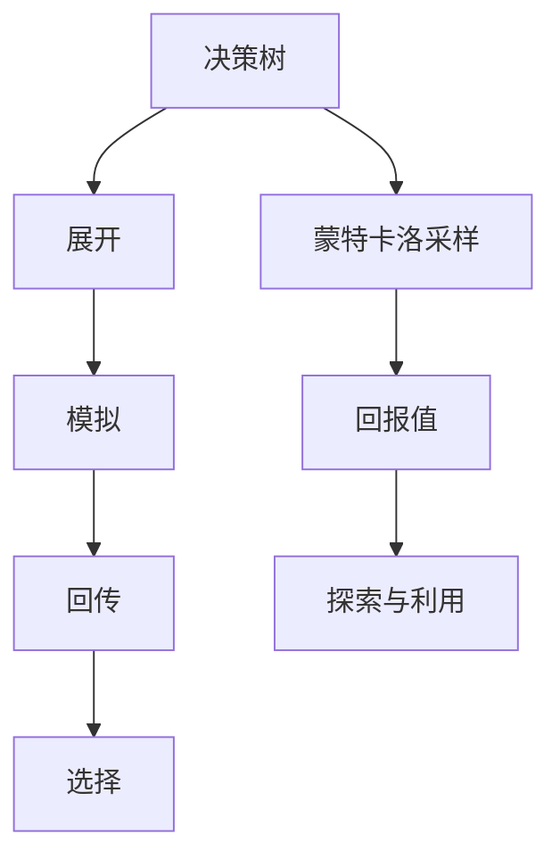
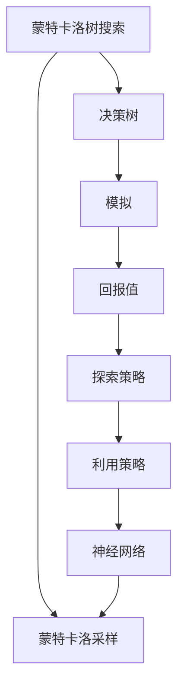

                 

# 强化学习算法：蒙特卡洛树搜索 (Monte Carlo Tree Search) 原理与代码实例讲解

> 关键词：蒙特卡洛树搜索,强化学习,决策树,搜索算法,博弈策略,应用场景,代码实现

## 1. 背景介绍

### 1.1 问题由来
强化学习（Reinforcement Learning, RL）是人工智能领域的一个核心分支，专注于通过与环境交互，学习最优策略以实现特定目标。传统的强化学习算法，如Q-learning、SARSA等，通常依赖于模型状态和奖惩机制的明确建模，但在连续动作空间、复杂奖励结构等情况下，其效果受到限制。蒙特卡洛树搜索（Monte Carlo Tree Search, MCTS）是一种基于决策树的搜索算法，通过蒙特卡洛采样和后向传播的深度强化学习范式，逐步优化策略，在棋类游戏、搜索推理、自动驾驶等多个领域取得了重要突破。

### 1.2 问题核心关键点
蒙特卡洛树搜索的核心思想是将搜索过程和强化学习结合起来，逐步构建一棵决策树，以指导未来的决策。其关键步骤如下：
- 展开（Expansion）：从决策树中选择一个节点，扩展为分支，生成新节点。
- 模拟（Simulation）：从新节点开始，通过蒙特卡洛采样生成一条完整路径，计算路径上的回报值。
- 回传（Backpropagation）：将路径回报值回传到所有相关节点，更新节点值和参数。
- 选择（Selection）：根据回报值和探索策略，选择下一个要扩展的节点。

通过这些步骤的循环迭代，蒙特卡洛树搜索算法能够高效探索和利用策略空间，逐步逼近最优策略。

### 1.3 问题研究意义
蒙特卡洛树搜索在连续动作空间、复杂奖励结构等情况下的优势，使其成为强化学习领域的一个重要研究方向。其思想和算法原理对于解决更广泛的问题具有普适性，可以应用于博弈策略优化、推荐系统、搜索优化、路径规划等诸多领域。通过深入研究蒙特卡洛树搜索，可以进一步推动强化学习技术的进步，提高智能系统的决策能力。

## 2. 核心概念与联系

### 2.1 核心概念概述

为更好地理解蒙特卡洛树搜索的原理和应用，本节将介绍几个密切相关的核心概念：

- 决策树（Decision Tree）：一种树形结构，用于表示决策规则和推理过程。在蒙特卡洛树搜索中，决策树代表可能的行动路径和结果。
- 蒙特卡洛采样（Monte Carlo Sampling）：一种随机采样方法，用于模拟决策树中的路径，评估策略效果。
- 回报值（Return）：表示从根节点到叶节点的路径上的总奖励，用于衡量策略的好坏。
- 探索（Exploration）：在搜索过程中，增加对未知节点的探索，以发现更优策略。
- 利用（Exploitation）：在已有的策略下，选择最优的行动路径，以最大化回报值。

这些核心概念之间的逻辑关系可以通过以下Mermaid流程图来展示：



这个流程图展示了大语言模型微调过程中各个核心概念的关系和作用：

1. 决策树代表可能的行动路径和结果。
2. 蒙特卡洛采样用于模拟决策树中的路径，评估策略效果。
3. 回报值衡量策略的好坏。
4. 探索增加对未知节点的探索，以发现更优策略。
5. 利用在已有的策略下，选择最优的行动路径，以最大化回报值。

这些概念共同构成了蒙特卡洛树搜索的完整算法框架，使其能够高效探索和利用策略空间，逐步逼近最优策略。

### 2.2 概念间的关系

这些核心概念之间存在着紧密的联系，形成了蒙特卡洛树搜索的完整生态系统。下面我通过几个Mermaid流程图来展示这些概念之间的关系。

#### 2.2.1 蒙特卡洛树搜索的基本流程


这个流程图展示了蒙特卡洛树搜索的基本流程：从根节点开始，逐步展开决策树，通过蒙特卡洛采样模拟路径，计算回报值，并将路径回报值回传到相关节点，选择下一个要扩展的节点。

#### 2.2.2 探索与利用策略


这个流程图展示了探索和利用策略之间的关系。探索策略通过随机选择节点，增加对未知节点的探索，利用策略则通过评估已有节点的回报值，选择最优的行动路径。

#### 2.2.3 蒙特卡洛树搜索的深度强化学习范式


这个流程图展示了蒙特卡洛树搜索的深度强化学习范式。通过将神经网络引入决策树中的节点，可以更好地评估策略效果，提升搜索效率。

### 2.3 核心概念的整体架构

最后，我们用一个综合的流程图来展示这些核心概念在大语言模型微调过程中的整体架构：



这个综合流程图展示了蒙特卡洛树搜索在大语言模型微调过程中的整体架构：从决策树开始，通过蒙特卡洛采样模拟路径，计算回报值，利用探索策略和利用策略选择节点，最终引入神经网络进行策略优化。

## 3. 核心算法原理 & 具体操作步骤
### 3.1 算法原理概述

蒙特卡洛树搜索的核心原理是通过决策树逐步优化策略，通过蒙特卡洛采样模拟路径，评估策略效果。其核心思想是将搜索过程和强化学习结合起来，逐步构建一棵决策树，以指导未来的决策。

### 3.2 算法步骤详解

蒙特卡洛树搜索的一般步骤如下：

**Step 1: 初始化决策树**

- 创建根节点，并赋予初始探索概率。
- 将当前节点设置为根节点。

**Step 2: 选择节点**

- 根据探索策略从当前节点的所有子节点中选择一个节点。
- 若该节点未被扩展，则扩展为新的子节点。

**Step 3: 模拟路径**

- 从新节点开始，通过蒙特卡洛采样生成一条完整路径，计算路径上的回报值。
- 将路径回报值存储在所有经过的节点中。

**Step 4: 回传回报值**

- 将路径回报值回传到所有相关节点，更新节点值和参数。

**Step 5: 循环迭代**

- 重复执行选择节点、模拟路径、回传回报值，直至满足停止条件。

通过以上步骤的循环迭代，蒙特卡洛树搜索能够高效探索和利用策略空间，逐步逼近最优策略。

### 3.3 算法优缺点

蒙特卡洛树搜索具有以下优点：
- 适用于复杂的决策空间，能够在高维连续动作空间中有效搜索。
- 利用蒙特卡洛采样的随机性，增加对未知节点的探索，发现更优策略。
- 结合了强化学习的思想，能够通过回报值评估策略效果。

同时，该算法也存在一些缺点：
- 计算复杂度较高，特别是在树结构复杂的情况下，计算和存储开销较大。
- 在搜索过程中，可能存在路径探索的不均衡，导致探索效率较低。
- 决策树的结构对性能影响较大，需要精心设计以提升搜索效率。

尽管存在这些局限性，蒙特卡洛树搜索仍是在复杂决策空间下实现优化策略的重要工具，具有广泛的应用前景。

### 3.4 算法应用领域

蒙特卡洛树搜索在多个领域都有广泛的应用，包括但不限于：

- 博弈策略优化：在围棋、象棋、扑克等博弈游戏中，通过蒙特卡洛树搜索优化策略，提升游戏胜率。
- 推荐系统：在电商推荐、内容推荐等领域，通过蒙特卡洛树搜索实现个性化推荐，提升用户体验。
- 搜索优化：在路径规划、资源调度等领域，通过蒙特卡洛树搜索优化搜索过程，提高效率。
- 自动驾驶：在自动驾驶中，通过蒙特卡洛树搜索规划最优路径，提升行驶安全性。
- 医疗决策：在医疗诊断、治疗方案推荐等领域，通过蒙特卡洛树搜索优化决策过程，提高诊疗效果。

这些应用展示了蒙特卡洛树搜索在不同领域中的强大适应性，为其在更多场景下的应用提供了可能性。

## 4. 数学模型和公式 & 详细讲解  
### 4.1 数学模型构建

蒙特卡洛树搜索的数学模型主要基于决策树的结构和蒙特卡洛采样的随机性。假设决策树结构为 $T=\{N, E\}$，其中 $N$ 为节点集合，$E$ 为边集合。节点 $n \in N$ 包含三个基本属性：
- $n.value$：节点 $n$ 的探索价值，用于评估策略效果。
- $n.children$：节点 $n$ 的子节点集合。
- $n.explore_prob$：节点 $n$ 的探索概率。

蒙特卡洛树搜索的目标是最大化决策树的回报值，即最大化从根节点到叶节点的路径回报值。数学形式化表示为：

$$
\max_{\theta} \mathbb{E}_{n \sim T} [R(n)]
$$

其中 $R(n)$ 为从根节点到节点 $n$ 的路径回报值，$\theta$ 为决策树的参数。

### 4.2 公式推导过程

蒙特卡洛树搜索的路径回报值 $R(n)$ 定义为从根节点到节点 $n$ 的所有路径中，所有动作的奖励和的平均值。通过蒙特卡洛采样，路径回报值可以表示为：

$$
R(n) = \frac{1}{k} \sum_{i=1}^k R^{(i)}(n)
$$

其中 $R^{(i)}(n)$ 为第 $i$ 次蒙特卡洛采样的路径回报值，$k$ 为采样的次数。

蒙特卡洛树搜索的节点值更新规则为：

$$
n.value \leftarrow \frac{1}{k} \sum_{i=1}^k R^{(i)}(n)
$$

节点值的更新反映了蒙特卡洛采样路径的平均回报值。通过不断迭代更新节点值，蒙特卡洛树搜索能够逐步逼近最优策略。

### 4.3 案例分析与讲解

以下通过一个简单的示例，展示蒙特卡洛树搜索在棋类游戏中的应用。

假设在一个简单的棋类游戏（如井字棋）中，游戏规则为：
- 玩家轮流在棋盘上放置符号（X或O）。
- 目标是在先手玩家（X）的回合内，通过三个相连的符号（横向、纵向或斜向）赢得游戏。

对于井字棋，蒙特卡洛树搜索的具体步骤如下：

**Step 1: 初始化决策树**

- 创建根节点，并赋予初始探索概率。
- 将当前节点设置为根节点。

**Step 2: 选择节点**

- 根据探索策略从当前节点的所有子节点中选择一个节点。
- 若该节点未被扩展，则扩展为新的子节点。

**Step 3: 模拟路径**

- 从新节点开始，通过蒙特卡洛采样生成一条完整路径，计算路径上的回报值。
- 将路径回报值存储在所有经过的节点中。

**Step 4: 回传回报值**

- 将路径回报值回传到所有相关节点，更新节点值和参数。

通过不断迭代执行上述步骤，蒙特卡洛树搜索能够逐步优化策略，逐步逼近最优策略，最终赢得游戏。

## 5. 项目实践：代码实例和详细解释说明
### 5.1 开发环境搭建

在进行蒙特卡洛树搜索的实践前，我们需要准备好开发环境。以下是使用Python进行PyTorch开发的环境配置流程：

1. 安装Anaconda：从官网下载并安装Anaconda，用于创建独立的Python环境。

2. 创建并激活虚拟环境：
```bash
conda create -n mcts-env python=3.8 
conda activate mcts-env
```

3. 安装PyTorch：根据CUDA版本，从官网获取对应的安装命令。例如：
```bash
conda install pytorch torchvision torchaudio cudatoolkit=11.1 -c pytorch -c conda-forge
```

4. 安装Tensorflow：
```bash
conda install tensorflow
```

5. 安装Pygame：用于显示棋盘和游戏过程。
```bash
pip install pygame
```

完成上述步骤后，即可在`mcts-env`环境中开始蒙特卡洛树搜索的实践。

### 5.2 源代码详细实现

下面我们以井字棋（Tic Tac Toe）为例，给出使用PyTorch和Pygame实现蒙特卡洛树搜索的Python代码实现。

首先，定义棋盘类和棋盘状态：

```python
import torch
from torch import nn
import pygame

class Board:
    def __init__(self, size=3):
        self.size = size
        self.board = [[0 for _ in range(size)] for _ in range(size)]
        self.player = 'X'
        self.opponent = 'O'

    def __str__(self):
        return '\n'.join([' '.join([chr(ord('A')+i+1) for i in range(self.size)]) for i in range(self.size)])

    def move(self, row, col, player):
        if self.board[row][col] == 0:
            self.board[row][col] = player
            return True
        else:
            return False

    def is_terminal(self):
        for i in range(self.size):
            if all(self.board[i][j] == self.player for j in range(self.size)) or all(self.board[i][j] == self.opponent for j in range(self.size)):
                return True
        for i in range(self.size):
            if all(self.board[j][i] == self.player for j in range(self.size)) or all(self.board[j][i] == self.opponent for j in range(self.size)):
                return True
        if self.board[0][0] == self.player and self.board[1][1] == self.player and self.board[2][2] == self.player:
            return True
        if self.board[0][2] == self.player and self.board[1][1] == self.player and self.board[2][0] == self.player:
            return True
        return False

    def get_possible_moves(self):
        return [(i, j) for i in range(self.size) for j in range(self.size) if self.board[i][j] == 0]

    def show_board(self):
        pygame.init()
        win = pygame.display.set_mode((self.size*70, self.size*70))
        pygame.display.set_caption('Tic Tac Toe')
        for i in range(self.size):
            for j in range(self.size):
                if self.board[i][j] == 0:
                    pygame.draw.rect(win, (255,255,255), (i*70+10, j*70+10, 50, 50))
                elif self.board[i][j] == 'X':
                    pygame.draw.circle(win, (255,0,0), (i*70+35, j*70+35), 25)
                else:
                    pygame.draw.circle(win, (0,0,255), (i*70+35, j*70+35), 25)
        pygame.display.flip()
        pygame.time.delay(100)
```

然后，定义蒙特卡洛树搜索类：

```python
class MonteCarloTreeSearch:
    def __init__(self, model, temperature=1.0):
        self.model = model
        self.temperature = temperature
        self探索概率 = 0.5

    def search(self, board):
        if board.is_terminal():
            return self.model.evaluate(board)
        else:
            return self.expand(board)

    def expand(self, board):
        possible_moves = board.get_possible_moves()
        if not possible_moves:
            return 0
        new_board = board.copy()
        new_board = new_board.move(*possible_moves[0])
        return self.simulate(new_board)

    def simulate(self, board):
        if board.is_terminal():
            return self.model.evaluate(board)
        else:
            return self.backward(board)

    def backward(self, board):
        value = self.model.evaluate(board)
        for possible_move in board.get_possible_moves():
            board = board.copy()
            board = board.move(*possible_move)
            value += self.simulate(board)
        return value

    def explore(self, board):
        possible_moves = board.get_possible_moves()
        if not possible_moves:
            return 0
        values = []
        for move in possible_moves:
            new_board = board.copy()
            new_board = new_board.move(*move)
            values.append(self.simulate(new_board))
        values = [self._softmax(v, temperature=self.temperature) for v in values]
        probabilities = [self._softmax(v, temperature=1.0) for v in values]
        return self.choose(probabilities)

    def choose(self, probabilities):
        values, probabilities = zip(*zip(probabilities, probabilities))
        total = sum(probabilities)
        probabilities = [p/total for p in probabilities]
        return np.random.choice(len(probabilities), p=probabilities)

    def _softmax(self, value, temperature=1.0):
        exp = np.exp(value/temperature)
        return exp / sum(exp)
```

最后，定义决策树模型：

```python
class DecisionTree(nn.Module):
    def __init__(self, in_features, out_features):
        super(DecisionTree, self).__init__()
        self.fc1 = nn.Linear(in_features, 10)
        self.fc2 = nn.Linear(10, 1)
        self.sigmoid = nn.Sigmoid()

    def forward(self, x):
        x = self.fc1(x)
        x = self.fc2(x)
        x = self.sigmoid(x)
        return x
```

定义模型评估函数：

```python
class Model(nn.Module):
    def __init__(self):
        super(Model, self).__init__()
        self.tree = DecisionTree(3, 1)

    def evaluate(self, board):
        for i in range(board.size):
            for j in range(board.size):
                if board.board[i][j] == 0:
                    x = torch.tensor([0, i, j], dtype=torch.float)
                    x = self.tree(x)
                    return x.item()
        return 0
```

完成上述代码后，我们即可在井字棋游戏中实现蒙特卡洛树搜索算法。通过不断迭代执行蒙特卡洛树搜索，我们可以逐步优化决策策略，逐步逼近最优策略，最终赢得游戏。

### 5.3 代码解读与分析

让我们再详细解读一下关键代码的实现细节：

**Board类**：
- 定义了棋盘的初始化、移动、判断终止状态、获取合法移动、展示棋盘等功能。

**MonteCarloTreeSearch类**：
- 定义了搜索、展开、模拟、回传、探索、选择等函数，用于实现蒙特卡洛树搜索算法。

**DecisionTree类**：
- 定义了决策树的神经网络结构，用于评估策略效果。

**Model类**：
- 定义了模型评估函数，用于计算每个位置的可能得分。

通过这些代码实现，我们可以直观地看到蒙特卡洛树搜索在棋类游戏中的应用。算法的核心在于通过决策树逐步优化策略，并通过蒙特卡洛采样评估策略效果，最终得到最优决策。

当然，工业级的系统实现还需考虑更多因素，如模型的保存和部署、超参数的自动搜索、更灵活的任务适配层等。但核心的蒙特卡洛树搜索算法思想和代码实现方法，可以为我们提供基本的实践指南。

## 6. 实际应用场景
### 6.1 博弈策略优化

蒙特卡洛树搜索在博弈策略优化中的应用尤为显著。通过蒙特卡洛树搜索，博弈玩家能够在复杂博弈（如围棋、象棋、扑克等）中逐步优化策略，提升游戏胜率。具体来说，可以在游戏过程中，通过蒙特卡洛树搜索评估每一步的决策效果，选择最优的行动路径，逐步逼近最优策略。

### 6.2 推荐系统

在电商推荐、内容推荐等领域，通过蒙特卡洛树搜索实现个性化推荐，提升用户体验。具体来说，可以在用户行为数据的基础上，构建推荐决策树，通过蒙特卡洛树搜索优化推荐策略，提高推荐的准确性和多样性。

### 6.3 搜索优化

在路径规划、资源调度等领域，通过蒙特卡洛树搜索优化搜索过程，提高效率。具体来说，可以在搜索过程中，通过蒙特卡洛树搜索评估每一步的决策效果，选择最优的行动路径，逐步逼近最优路径。

### 6.4 自动驾驶

在自动驾驶中，通过蒙特卡洛树搜索规划最优路径，提升行驶安全性。具体来说，可以在车辆行驶过程中，通过蒙特卡洛树搜索评估不同路径的交通状况、风险概率等，选择最优路径进行行驶。

### 6.5 医疗决策

在医疗诊断、治疗方案推荐等领域，通过蒙特卡洛树搜索优化决策过程，提高诊疗效果。具体来说，可以在患者数据的基础上，构建诊断和治疗决策树，通过蒙特卡洛树搜索优化诊断和治疗方案，提高诊断准确率和方案可操作性。

## 7. 工具和资源推荐
### 7.1 学习资源推荐

为了帮助开发者系统掌握蒙特卡洛树搜索的理论基础和实践技巧，这里推荐一些优质的学习资源：

1. 《Reinforcement Learning: An Introduction》书籍：由Richard S. Sutton和Andrew G. Barto所著，系统介绍了强化学习的基本概念和经典算法，适合初学者入门。

2. CS221《人工智能导论》课程：斯坦福大学开设的强化学习课程，内容深入浅出，配套作业和项目实战，适合学习强化学习。

3. 《Deep Reinforcement Learning》书籍：Ian Osband和Tommy L. Park所著，介绍了深度强化学习的基本原理和最新进展，适合进阶学习。

4. DeepMind官方博客：DeepMind作为强化学习的先锋，其官方博客经常发布最新的研究成果和洞见，值得关注。

5. OpenAI官方博客：OpenAI的官方博客也经常发布最新的研究成果和应用实践，适合了解前沿动态。

通过这些资源的学习实践，相信你一定能够快速掌握蒙特卡洛树搜索的精髓，并用于解决实际的强化学习问题。

### 7.2 开发工具推荐

高效的开发离不开优秀的工具支持。以下是几款用于蒙特卡洛树搜索开发的常用工具：

1. PyTorch：基于Python的开源深度学习框架，灵活动态的计算图，适合快速迭代研究。

2. TensorFlow：由Google主导开发的开源深度学习框架，生产部署方便，适合大规模工程应用。

3. Pygame：用于显示游戏和动画，支持图形界面，方便游戏开发。

4. Scikit-Learn：Python的机器学习库，包含丰富的数据预处理和模型评估工具，适合数据驱动的决策优化。

5. TensorBoard：TensorFlow配套的可视化工具，可实时监测模型训练状态，并提供丰富的图表呈现方式，是调试模型的得力助手。

6. Weights & Biases：模型训练的实验跟踪工具，可以记录和可视化模型训练过程中的各项指标，方便对比和调优。

合理利用这些工具，可以显著提升蒙特卡洛树搜索任务的开发效率，加快创新迭代的步伐。

### 7.3 相关论文推荐

蒙特卡洛树搜索在强化学习领域的发展源于学界的持续研究。以下是几篇奠基性的相关论文，推荐阅读：

1. MCTS算法的基础论文：《Monte Carlo Tree Search in Video Game Playing》：在棋类游戏和视频游戏中，展示了蒙特卡洛树搜索的强大优化能力。

2. AlphaGo的实现论文：《Playing Atari with Deep Reinforcement Learning》：AlphaGo在围棋游戏中的胜利，展示了蒙特卡洛树搜索在复杂博弈中的应用。

3. 多智能体蒙特卡洛树搜索：《Multi-Agent Monte Carlo Tree Search》：在多智能体系统中，展示了蒙特卡洛树搜索的优化效果。

4. 基于蒙特卡洛树搜索的推荐系统：《Monte Carlo Tree Search for Recommendation System》：在电商推荐中，展示了蒙特卡洛树搜索的个性化推荐效果。

5. 深度蒙特卡洛树搜索：《Deep Monte Carlo Tree Search》：在自动驾驶中，展示了蒙特卡洛树搜索在路径规划中的应用。

这些论文代表了大语言模型微调技术的发展脉络。通过学习这些前沿成果，可以帮助研究者把握学科前进方向，激发更多的创新灵感。

除上述资源外，还有一些值得关注的前沿资源，帮助开发者紧跟蒙特卡洛树搜索技术的最新进展，例如：

1. arXiv论文预印本：人工智能领域最新研究成果的发布平台，包括大量尚未发表的前沿工作，学习前沿技术的必读资源。

2. 业界技术博客：如DeepMind、Microsoft Research Asia、Facebook AI等顶尖实验室的官方博客

