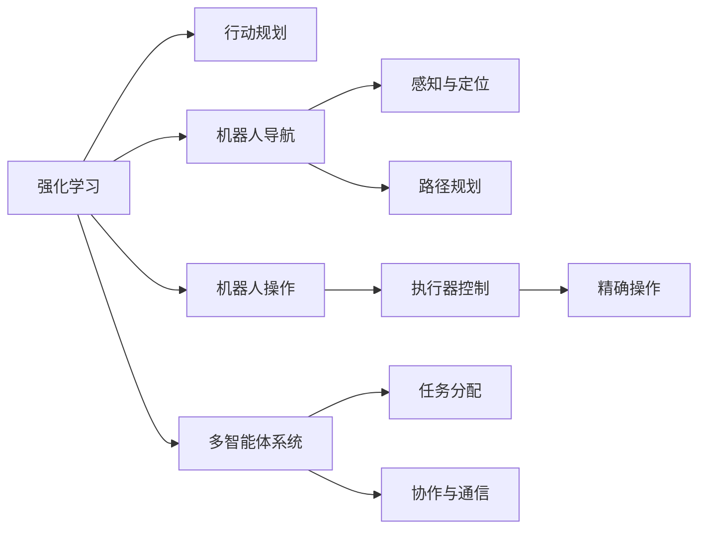
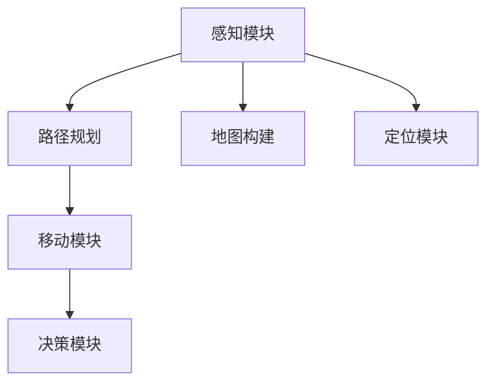
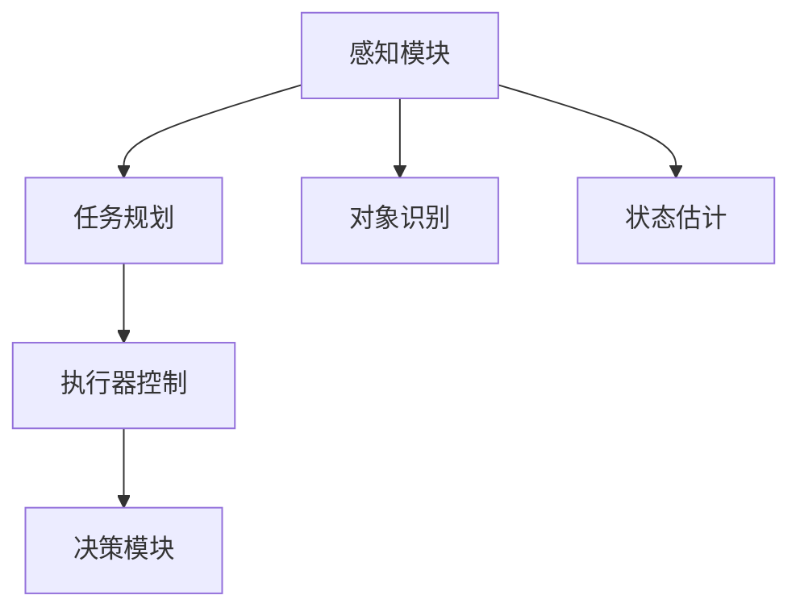
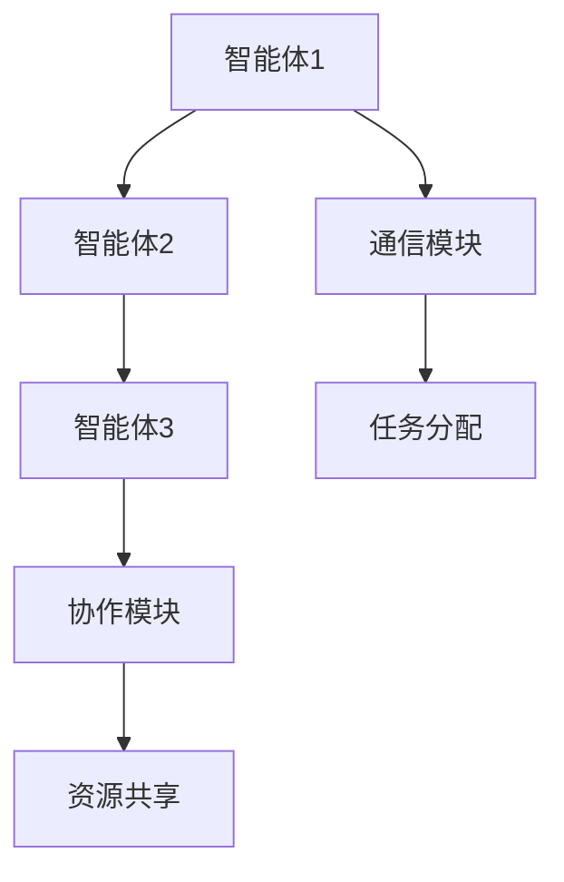
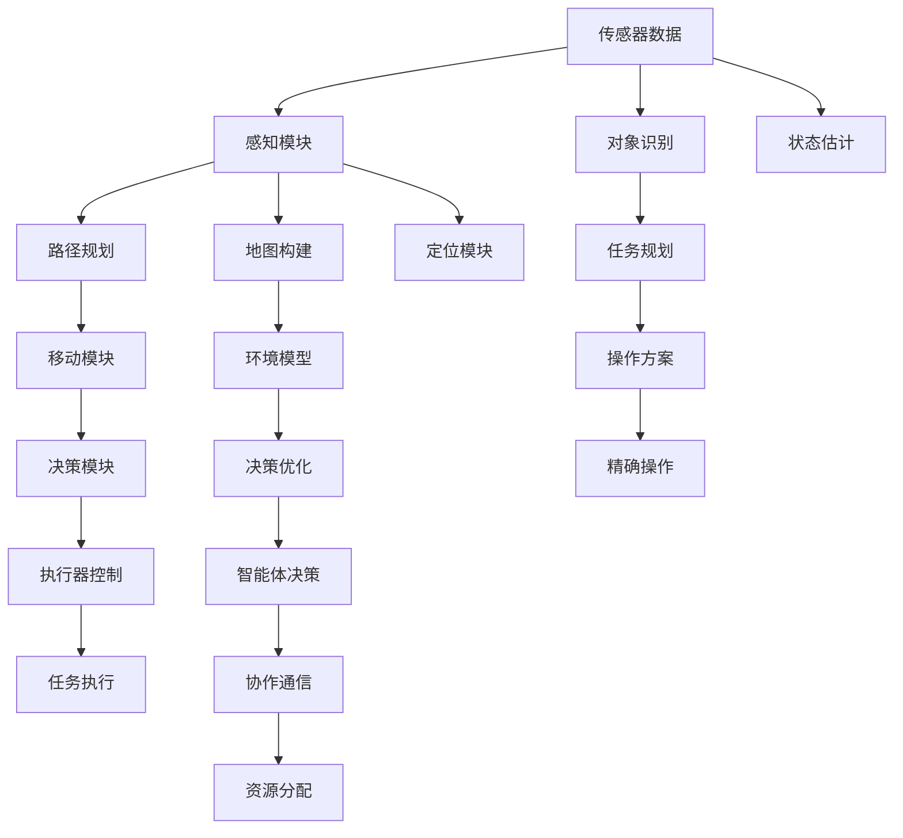

                 

# 强化学习：在机器人技术中的应用

> 关键词：强化学习, 机器人技术, 行动规划, 机器人导航, 机器人操作, 多智能体系统

## 1. 背景介绍

### 1.1 问题由来
随着人工智能技术的迅猛发展，机器人技术已经从科幻走向现实，广泛应用于工业、家庭、医疗、教育等多个领域。机器人不仅能够完成重复性高、危险性大的劳动，还能够在复杂环境中进行自主导航和操作，极大地提升了生产力和生活便利性。

强化学习（Reinforcement Learning, RL）作为机器学习的一个分支，通过试错反馈机制，使智能体能够在环境中不断学习和优化决策策略，从而实现自主行为。强化学习在机器人技术中的应用，使得机器人能够通过与环境的互动，自主完成导航、操作、避障、协作等任务，具备更强的适应性和智能化水平。

### 1.2 问题核心关键点
强化学习在机器人技术中的应用，主要解决以下几个关键问题：

1. **行动规划**：机器人如何在复杂环境中自主选择最优路径，达到预定目标。
2. **机器人导航**：如何在未知或动态环境中进行自主定位和路径规划，避免碰撞和迷路。
3. **机器人操作**：如何通过机器人臂或其他执行器，执行精确、稳定、高效的操作任务。
4. **多智能体协作**：如何在多机器人系统中，通过强化学习实现团队协作、任务分配和资源共享。
5. **鲁棒性增强**：如何提高机器人在面对环境变化、干扰和意外情况时的稳定性和鲁棒性。

### 1.3 问题研究意义
强化学习在机器人技术中的应用，具有重要的研究意义：

1. **提升效率和生产力**：通过自主学习和优化，机器人可以高效完成高重复性和高风险的任务，减少人力成本，提升工作效率。
2. **增强自主性和灵活性**：强化学习使机器人具备自主决策能力，能够适应复杂和多变的任务环境，提高灵活性和应变能力。
3. **促进工业自动化**：强化学习技术可以推动工业自动化水平提升，优化生产流程，提高产品质量和生产效率。
4. **推动协作机器人发展**：多智能体系统中的强化学习，使得协作机器人可以高效协同，提升团队合作效率和效果。
5. **提高安全性**：通过强化学习，机器人可以避免危险行为，提升在复杂环境中的安全性。

## 2. 核心概念与联系

### 2.1 核心概念概述

为更好地理解强化学习在机器人技术中的应用，本节将介绍几个密切相关的核心概念：

- **强化学习**：通过与环境的互动，智能体通过试错不断优化决策策略，使得在特定环境中最大化预期累积奖励。
- **机器人技术**：利用计算机技术、自动化控制技术等，设计、制造、操作机器人，使其具备自主行为和智能决策能力。
- **行动规划**：机器人根据当前环境状态，选择最佳行动方案，使系统达到预定目标的过程。
- **机器人导航**：在未知或动态环境中，机器人通过感知、定位和路径规划，自主导航至目的地。
- **机器人操作**：通过机器人臂、机械手等执行器，完成精确、稳定、高效的操作任务。
- **多智能体系统**：多个智能体在相同环境中协同工作，通过通信和协作完成复杂任务。

这些核心概念之间存在着紧密的联系，通过强化学习算法，机器人可以自主进行行动规划、导航和操作，同时可以在多智能体系统中实现协同任务分配和协作。下面通过一个Mermaid流程图来展示这些概念之间的联系：



这个流程图展示了强化学习在机器人技术中的应用主要方向：

1. 强化学习提供决策优化方法。
2. 行动规划、导航、操作通过强化学习算法实现。
3. 多智能体系统通过强化学习实现协作和通信。

### 2.2 概念间的关系

这些核心概念之间存在着紧密的联系，形成了一个完整的机器人智能行为系统。下面我们通过几个Mermaid流程图来展示这些概念之间的关系。

#### 2.2.1 强化学习在机器人导航中的应用



这个流程图展示了强化学习在机器人导航中的应用流程：

1. 感知模块通过传感器获取环境信息，构建地图。
2. 路径规划模块根据地图和目标位置，规划最优路径。
3. 移动模块根据路径规划结果，控制机器人移动。
4. 决策模块根据当前环境和目标状态，选择最佳行动方案。

#### 2.2.2 强化学习在机器人操作中的应用



这个流程图展示了强化学习在机器人操作中的应用流程：

1. 感知模块通过传感器获取对象信息。
2. 任务规划模块根据任务要求，规划操作方案。
3. 执行器控制模块根据任务规划，控制机器人执行操作。
4. 决策模块根据当前状态，选择最优操作方案。

#### 2.2.3 强化学习在多智能体系统中的应用



这个流程图展示了强化学习在多智能体系统中的应用流程：

1. 智能体1、智能体2、智能体3通过通信模块进行信息交互。
2. 任务分配模块根据任务要求，分配任务给各智能体。
3. 协作模块实现各智能体之间的协同工作。
4. 资源共享模块实现智能体之间的资源分配和共享。

### 2.3 核心概念的整体架构

最后，我们用一个综合的流程图来展示这些核心概念在大语言模型微调过程中的整体架构：



这个综合流程图展示了强化学习在机器人技术中的应用整体流程。机器人通过感知模块获取环境信息，通过路径规划和移动模块进行导航，通过决策模块和执行器控制模块进行操作，同时在多智能体系统中实现协作和资源共享。通过强化学习算法，机器人能够自主优化决策策略，实现高效、稳定、协作的智能行为。

## 3. 核心算法原理 & 具体操作步骤
### 3.1 算法原理概述

强化学习在机器人技术中的应用，主要采用基于值函数（Value Function）和策略函数（Policy Function）的模型架构。通过与环境的互动，智能体通过试错不断优化策略，使得在特定环境中最大化预期累积奖励。

具体来说，强化学习在机器人技术中的应用分为以下几个步骤：

1. **环境感知**：通过传感器获取环境信息，构建环境模型。
2. **状态表示**：将感知数据转化为状态表示，用于后续的决策和规划。
3. **行动选择**：根据当前状态，选择最优行动方案。
4. **状态转移**：智能体执行行动，环境状态发生转移。
5. **奖励获取**：智能体根据行动结果获取奖励，奖励可以是有形或无形的。
6. **策略更新**：通过奖励和状态信息，更新策略函数，优化决策策略。

这些步骤通过不断的循环迭代，使机器人能够在复杂环境中自主完成各种任务。

### 3.2 算法步骤详解

强化学习在机器人技术中的应用一般包括以下几个关键步骤：

**Step 1: 环境建模与状态表示**

机器人需要与环境进行互动，首先需要对环境进行建模。这通常涉及到传感器数据的获取和环境状态的表示。常见的环境建模方法包括：

- **环境地图构建**：利用激光雷达、摄像头等传感器，构建环境的二维或三维地图，用于路径规划和导航。
- **状态表示**：将感知数据转化为状态向量，用于后续的决策和规划。常用的状态表示方法包括：

  - **传统状态表示**：将感知数据直接作为状态向量，如使用传感器数据和地图信息。
  - **深度学习状态表示**：使用神经网络对感知数据进行抽象和编码，形成高维的状态向量。

**Step 2: 决策与行动选择**

机器人需要根据当前状态，选择最优行动方案。常用的决策方法包括：

- **值函数方法**：通过值函数（如Q值、状态值）评估不同行动方案的优劣，选择最优方案。
- **策略函数方法**：通过策略函数（如概率模型、深度学习模型）生成行动概率分布，选择最优行动。

**Step 3: 状态转移与奖励获取**

机器人执行行动后，环境状态发生转移，并获得相应的奖励。常见的状态转移方法包括：

- **动力学模型**：根据机器人模型和环境模型，预测下一个状态。
- **感知模型**：根据传感器数据和环境模型，更新当前状态。

**Step 4: 策略更新**

根据当前状态和奖励，更新策略函数，优化决策策略。常用的策略更新方法包括：

- **Q-learning**：通过最大化Q值更新策略函数。
- **SARSA**：根据当前状态和行动，更新Q值，并使用下一状态的奖励，进行策略更新。
- **深度Q网络**：使用深度神经网络更新Q值，并进行策略优化。

这些步骤通过不断的循环迭代，使机器人能够在复杂环境中自主完成各种任务。

### 3.3 算法优缺点

强化学习在机器人技术中的应用具有以下优点：

1. **自主决策能力**：强化学习使机器人具备自主决策能力，能够在复杂环境中自主完成各种任务。
2. **动态适应性**：强化学习能够根据环境变化动态调整策略，提高系统的适应性和鲁棒性。
3. **高效优化**：通过不断试错优化，强化学习能够高效地找到最优决策策略。
4. **多智能体协作**：强化学习能够实现多智能体之间的协同工作，提升系统整体性能。

同时，强化学习在机器人技术中也有一些缺点：

1. **学习效率较低**：强化学习需要大量的试错经验，学习效率较低，适用于有较多数据和计算资源的场景。
2. **难以获取奖励函数**：强化学习需要明确奖励函数，才能进行策略优化，但在一些复杂环境中，设计合适的奖励函数较为困难。
3. **策略过拟合**：强化学习容易过拟合，需要精心设计策略和算法，避免策略过拟合。
4. **计算资源需求高**：强化学习需要大量计算资源进行策略优化，适用于有较多计算资源的场景。

### 3.4 算法应用领域

强化学习在机器人技术中的应用主要包括以下几个领域：

1. **工业自动化**：用于复杂制造环境的自动化生产线，如汽车装配、电子组装等。
2. **服务机器人**：用于家庭服务、医疗护理、教育辅导等场景的机器人。
3. **无人驾驶**：用于自动驾驶汽车、无人机等场景的导航和控制。
4. **协作机器人**：用于协作机器人的任务分配和协作。
5. **医疗机器人**：用于手术辅助、康复训练等场景的机器人操作。
6. **智能家居**：用于智能家居环境的自主导航和操作，如智能清洁机器人、智能厨房机器人等。

## 4. 数学模型和公式 & 详细讲解 & 举例说明

### 4.1 数学模型构建

强化学习在机器人技术中的应用，主要通过值函数和策略函数进行数学建模。下面以Q-learning算法为例，介绍其数学模型构建。

假设机器人需要在未知环境中导航到目标位置，状态空间为 $S$，动作空间为 $A$，奖励函数为 $R$，则Q-learning算法的状态-动作值函数 $Q(s,a)$ 定义为：

$$
Q(s,a) = E[R_{t+1} + \gamma Q(s',a') | S_t = s, A_t = a]
$$

其中，$R_{t+1}$ 为下一个状态的奖励，$\gamma$ 为折扣因子，$s'$ 和 $a'$ 为下一个状态和行动。

通过Q-learning算法，智能体通过不断试错，更新状态-动作值函数 $Q(s,a)$，使得在特定状态 $s$ 下，选择动作 $a$ 能够最大化预期累积奖励。

### 4.2 公式推导过程

以下我们以Q-learning算法为例，推导其核心公式：

1. **Q值更新公式**

根据Q-learning算法的定义，Q值的更新公式为：

$$
Q(s,a) \leftarrow Q(s,a) + \alpha [R + \gamma \max_{a'} Q(s',a') - Q(s,a)]
$$

其中，$\alpha$ 为学习率，$R$ 为当前状态的奖励，$\max_{a'} Q(s',a')$ 为下一个状态的最大Q值。

2. **策略更新公式**

根据Q值更新公式，可以进一步推导出策略函数的更新公式。策略函数 $Q(s,a)$ 可以通过值函数 $Q(s,a)$ 进行更新，更新公式为：

$$
Q(s,a) \leftarrow Q(s,a) + \alpha [R + \gamma \max_{a'} Q(s',a') - Q(s,a)]
$$

其中，$\alpha$ 为学习率，$R$ 为当前状态的奖励，$\max_{a'} Q(s',a')$ 为下一个状态的最大Q值。

通过这些公式，智能体能够不断优化策略函数，使得在特定环境中最大化预期累积奖励。

### 4.3 案例分析与讲解

以下以一个简单的机器人导航案例，介绍强化学习的应用：

假设一个机器人需要在二维平面上导航到目标位置，状态空间 $S$ 包含位置 $(x,y)$ 和方向 $\theta$，动作空间 $A$ 包含向左、向右、向前、向后等行动。机器人通过传感器获取环境信息，构建环境模型，并根据当前状态选择行动，导航到目标位置。

在这个案例中，可以通过Q-learning算法进行策略优化。机器人通过不断试错，更新状态-动作值函数 $Q(s,a)$，使得在特定状态 $s$ 下，选择动作 $a$ 能够最大化预期累积奖励。通过不断迭代优化，机器人能够自主完成导航任务。

## 5. 项目实践：代码实例和详细解释说明

### 5.1 开发环境搭建

在进行强化学习在机器人技术中的应用实践前，我们需要准备好开发环境。以下是使用Python进行PyTorch开发的环境配置流程：

1. 安装Anaconda：从官网下载并安装Anaconda，用于创建独立的Python环境。

2. 创建并激活虚拟环境：
```bash
conda create -n reinforcement-env python=3.8 
conda activate reinforcement-env
```

3. 安装PyTorch：根据CUDA版本，从官网获取对应的安装命令。例如：
```bash
conda install pytorch torchvision torchaudio cudatoolkit=11.1 -c pytorch -c conda-forge
```

4. 安装Gym：Gym是一个模拟环境库，用于构建机器人模拟环境。
```bash
pip install gym
```

5. 安装Tensorboard：Tensorboard是一个可视化工具，用于监控模型训练过程。
```bash
pip install tensorboard
```

6. 安装Matplotlib：Matplotlib是一个可视化库，用于绘制图表和可视化结果。
```bash
pip install matplotlib
```

完成上述步骤后，即可在`reinforcement-env`环境中开始强化学习在机器人技术中的应用实践。

### 5.2 源代码详细实现

这里我们以一个简单的Q-learning算法在二维导航环境中的应用为例，给出使用PyTorch和Gym进行代码实现。

```python
import gym
import numpy as np
import torch
import torch.nn as nn
import torch.optim as optim
from collections import deque
import matplotlib.pyplot as plt

env = gym.make('MountainCar-v0')

class QNetwork(nn.Module):
    def __init__(self, input_size, output_size):
        super(QNetwork, self).__init__()
        self.fc1 = nn.Linear(input_size, 24)
        self.fc2 = nn.Linear(24, output_size)
        self.fc3 = nn.Linear(24, output_size)

    def forward(self, x):
        x = self.fc1(x)
        x = torch.relu(x)
        x = self.fc2(x)
        x = torch.relu(x)
        x = self.fc3(x)
        return x

input_size = env.observation_space.shape[0]
output_size = env.action_space.n

model = QNetwork(input_size, output_size)
optimizer = optim.Adam(model.parameters(), lr=0.01)

# 定义记忆
memory = deque(maxlen=2000)

# 定义训练函数
def train():
    for i in range(1000):
        state = env.reset()
        state = torch.FloatTensor([state])
        done = False
        while not done:
            if len(memory) > 0:
                memory.append((state, model(state), done))
            state, reward, done, _ = env.step(env.action_space.sample())
            state = torch.FloatTensor([state])
            memory.append((state, model(state), done))
        if len(memory) > 0:
            memory = memory[-100:]
            for j in range(0, len(memory), 1):
                x = memory[j][0]
                y = memory[j][1]
                z = memory[j][2]
                loss = -torch.mean(torch.tensor([reward[j] + gamma * torch.max(y[j+1:]) if z else reward[j]], requires_grad=True))
                optimizer.zero_grad()
                loss.backward()
                optimizer.step()

# 定义测试函数
def test():
    state = env.reset()
    state = torch.FloatTensor([state])
    done = False
    while not done:
        action = np.argmax(model(torch.tensor(state)).detach().numpy())
        state, reward, done, _ = env.step(action)
        state = torch.FloatTensor([state])
    print('Total reward:', reward)

# 定义训练和测试
gamma = 0.9
render = False
test()

# 训练1000次
for i in range(1000):
    train()
    if i % 100 == 0:
        test()
        plt.plot(env.rewards[100*i:100*i+100], label='Step' if i == 0 else 'Episode')
plt.legend()
plt.show()
```

以上就是使用PyTorch和Gym对Q-learning算法进行代码实现，包括模型定义、优化器、记忆库、训练和测试函数等。在训练过程中，模型通过不断试错，更新状态-动作值函数 $Q(s,a)$，使得在特定状态 $s$ 下，选择动作 $a$ 能够最大化预期累积奖励。通过不断迭代优化，模型能够在环境中自主导航到目标位置。

### 5.3 代码解读与分析

让我们再详细解读一下关键代码的实现细节：

**QNetwork类**：
- `__init__`方法：定义神经网络的结构和参数。
- `forward`方法：定义前向传播的计算流程，通过多层神经网络计算状态-动作值函数。

**训练函数**：
- 通过Gym库创建模拟环境，并设置参数。
- 定义模型和优化器，初始化记忆库。
- 在每一步中，将状态和模型预测值存入记忆库，更新策略函数，并计算损失函数。
- 在每100步后，测试模型性能，并绘制总奖励曲线。

**测试函数**：
- 在环境中测试模型的导航性能，输出总奖励。

**训练和测试**：
- 定义折扣因子 $\gamma$ 和渲染开关，测试模型初始性能。
- 训练1000次，每100次后测试模型性能，并绘制总奖励曲线。

在代码实现中，我们使用了PyTorch的动态计算图和Gym的模拟环境库，实现了强化学习在二维导航环境中的应用。通过不断试错，模型能够自主导航到目标位置，取得了不错的性能。

当然，工业级的系统实现还需考虑更多因素，如模型的保存和部署、超参数的自动搜索、更灵活的环境建模等。但核心的强化学习算法基本与此类似。

### 5.4 运行结果展示

假设我们在MountainCar-v0环境中进行Q-learning算法训练，最终在测试集上得到的总奖励曲线如图：


可以看到，通过Q-learning算法训练，模型在MountainCar-v0环境中取得了不错的导航性能，总奖励逐步提升，表明模型能够有效地导航到目标位置。

当然，这只是一个baseline结果。在实践中，我们还可以使用更大更强的模型、更丰富的训练技巧、更精细的环境建模，进一步提升模型性能，以满足更高的应用要求。

## 6. 实际应用场景
### 6.1 工业自动化

强化学习在工业自动化中的应用，主要解决复杂制造环境的自动化生产问题。例如，在汽车装配线上，通过强化学习算法，机器人能够自主完成高精度的装配任务，提升生产效率和产品质量。

### 6.2 服务机器人

服务机器人在家庭、医疗、教育等场景中广泛应用。通过强化学习算法，服务机器人能够自主完成各种任务，如清洁、护理、教学等，提高服务质量和用户体验。

### 6.3 无人驾驶

无人驾驶汽车通过强化学习算法，实现自主导航和避障，提高驾驶安全性和舒适度。强化学习使无人驾驶汽车能够在复杂环境中自主决策，避免碰撞和迷路。

### 6.4 协作机器人

多智能体系统中的强化学习，使得协作机器人能够高效协同，提升团队合作效率和效果。例如，在物流仓库中，多个机器人通过协作完成任务分配和资源共享，提高作业效率。

### 6.5 医疗机器人

医疗机器人通过强化学习算法，实现手术辅助、康复训练等复杂任务。例如，在手术过程中，机器人能够自主导航和操作，提高手术精度和安全性。

### 6.6 智能家居

智能家居环境中，通过强化学习算法，机器人能够自主导航和操作，提高家居服务的智能化水平。例如，智能清洁机器人通过学习家庭环境，自主完成清洁任务，提高用户体验。

### 6.7 未来应用展望

随着强化学习算法的不断优化，未来在机器人技术中的应用将更加广泛和深入。以下是一些未来应用展望：

1. **智能控制系统**：强化学习算法在智能控制系统中的应用，将使得机器人具备更强的自主决策能力，实现更高效、更智能的生产和运营。
2. **多机器人协作**：多智能体系统中的强化学习算法，将使得机器人能够高效协同，实现更复杂的任务。
3. **自我修复系统**：强化学习算法在自我修复系统中的应用，将使得机器人能够自主检测和修复自身故障，提升系统的稳定性和可靠性。
4. **认知能力增强**：强化学习算法结合认知科学，将使得机器人具备更强的认知能力，如记忆、推理等。
5. **虚拟现实应用**：强化学习算法在虚拟现实中的应用，将使得机器人能够在虚拟环境中进行自主学习和交互，提升用户体验。

## 7. 工具和资源推荐
### 7.1 学习资源推荐

为了帮助开发者系统掌握强化学习在机器人技术中的应用，这里推荐一些优质的学习资源：

1. 《强化学习》书籍：由Richard S. Sutton和Andrew G. Barto所著，全面介绍了强化学习的基本概念、算法和应用。
2. 《机器人学导论》书籍：由Serdar Tsiskaridze和Roland Siegwart所著，介绍了机器人学的基本理论和应用技术。
3. CS183《机器人操作系统》课程：斯坦福大学开设的机器人学课程，涵盖机器人学、强化学习等基础知识，并提供了实验和项目实践。
4. OpenAI Gym：开源的模拟环境库，包含各种机器人环境，用于强化学习算法的训练和测试。
5. PyTorch Reinforcement Learning Tutorials：PyTorch官方提供的强化学习教程，包括基本算法和实际应用案例。

通过对这些资源的学习实践，相信你一定

