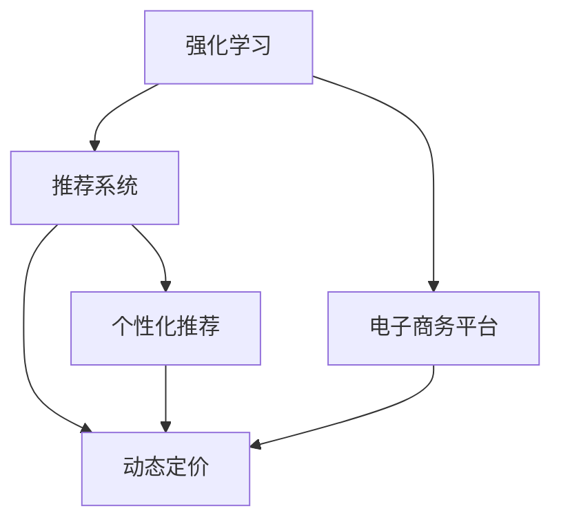
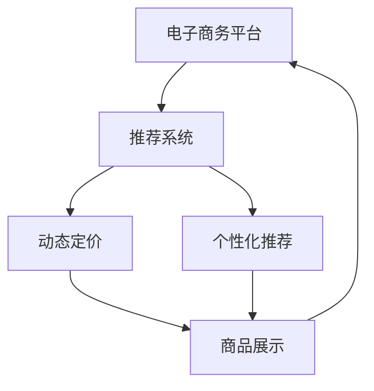
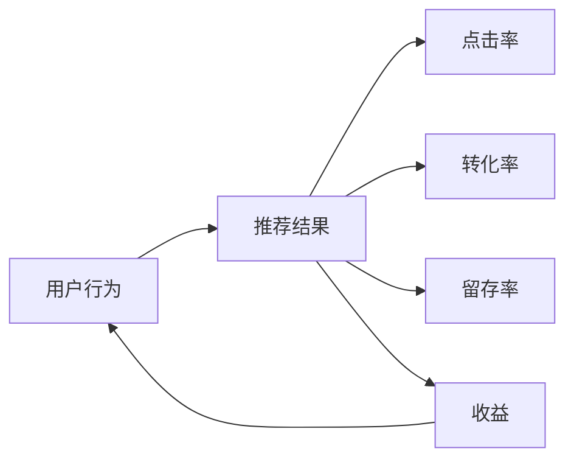
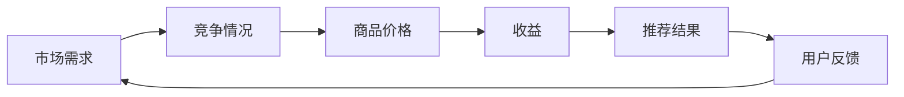
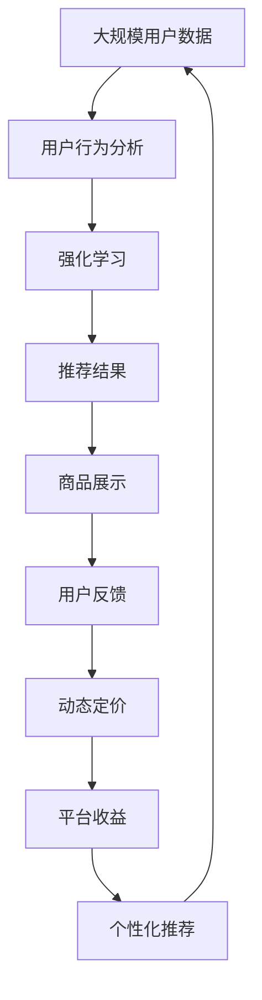

                 

# 强化学习：在电子商务推荐系统中的应用

> 关键词：强化学习,推荐系统,电子商务,用户行为分析,动态定价,个性化推荐

## 1. 背景介绍

### 1.1 问题由来
在互联网时代，电子商务成为人们生活中不可或缺的一部分。然而，如何在海量商品中快速、精准地满足用户需求，仍然是一个巨大的挑战。推荐系统作为电子商务中核心的技术之一，承担着重要的任务。传统的推荐系统主要基于协同过滤、基于内容的推荐和混合推荐等方法，尽管取得了一定的效果，但随着用户行为的变化和商品种类的不断增多，传统推荐方法的不足也逐渐显现。强化学习作为一种动态决策方法，因其能够根据用户反馈自动调整推荐策略而受到关注。强化学习在电子商务推荐系统中的应用，成为了当前研究的热点方向。

### 1.2 问题核心关键点
强化学习在推荐系统中的应用，主要集中在以下几个方面：

1. **动态反馈机制**：用户对于推荐结果的反馈是动态的，强化学习可以通过不断收集用户的点击、购买等行为数据，调整推荐策略，使得推荐结果更加符合用户需求。

2. **实时决策**：在推荐系统中，用户可能会实时地改变其行为，强化学习可以通过动态调整推荐策略，及时响应用户行为的变化。

3. **多目标优化**：推荐系统通常需要同时考虑多个目标，如点击率、转化率、留存率等，强化学习可以通过多目标优化，使得推荐结果在多个指标上都表现优异。

4. **自适应学习**：用户需求随时间变化，强化学习可以通过自适应学习机制，不断调整推荐策略，适应用户需求的变化。

5. **探索与利用**：在推荐系统中，需要平衡推荐结果的探索性和利用性，强化学习可以通过探索与利用的平衡策略，推荐更多样化的商品。

### 1.3 问题研究意义
强化学习在电子商务推荐系统中的应用，能够显著提升推荐的准确性和用户满意度，减少用户流失率，提高平台的销售额和用户黏性。具体而言：

1. **提升推荐准确性**：通过动态调整推荐策略，强化学习能够实时响应用户需求，提供更加精准的推荐结果。
2. **提高用户满意度**：强化学习能够根据用户反馈不断优化推荐结果，使得推荐内容更加符合用户的偏好。
3. **降低用户流失率**：良好的推荐系统能够减少用户由于不满意而离开平台的概率，增加平台的用户粘性。
4. **提高平台销售额**：精准的推荐能够促进用户的购买决策，增加平台的销售额。

## 2. 核心概念与联系

### 2.1 核心概念概述

为更好地理解强化学习在电子商务推荐系统中的应用，本节将介绍几个密切相关的核心概念：

- **强化学习**：通过试错过程学习最优决策策略的机器学习方法。强化学习通常包括四个关键要素：环境、状态、动作和奖励。
- **推荐系统**：通过分析用户的历史行为和兴趣偏好，为用户推荐可能感兴趣的商品或服务的技术。
- **电子商务平台**：提供商品或服务交易的在线平台，通常包括搜索引擎、商品展示、用户行为分析等功能。
- **动态定价**：根据市场需求、竞争情况等因素，实时调整商品价格以最大化收益。
- **个性化推荐**：根据用户的历史行为和兴趣，提供定制化的商品或服务推荐。

这些核心概念之间的逻辑关系可以通过以下Mermaid流程图来展示：



这个流程图展示了一个典型的强化学习在电子商务推荐系统中的应用场景。

### 2.2 概念间的关系

这些核心概念之间存在着紧密的联系，形成了强化学习在电子商务推荐系统中的完整生态系统。下面我们通过几个Mermaid流程图来展示这些概念之间的关系。

#### 2.2.1 推荐系统的架构



这个流程图展示了推荐系统在电子商务平台中的基本架构，即推荐系统根据用户行为推荐商品，动态定价系统根据推荐结果调整商品价格，个性化推荐系统则根据用户偏好提供定制化推荐。

#### 2.2.2 强化学习的应用场景



这个流程图展示了强化学习在推荐系统中应用的具体场景。强化学习通过用户行为反馈调整推荐策略，提升点击率、转化率、留存率等指标，最终增加平台的收益。

#### 2.2.3 动态定价的应用



这个流程图展示了动态定价在电子商务平台中的应用场景。动态定价系统根据市场需求和竞争情况调整商品价格，以最大化平台收益，同时影响推荐系统的推荐结果。

### 2.3 核心概念的整体架构

最后，我们用一个综合的流程图来展示这些核心概念在大规模推荐系统中的应用：



这个综合流程图展示了从用户数据收集、用户行为分析、强化学习、推荐结果生成、商品展示、用户反馈、动态定价到平台收益的全过程，体现了强化学习在电子商务推荐系统中的综合应用。

## 3. 核心算法原理 & 具体操作步骤
### 3.1 算法原理概述

强化学习在电子商务推荐系统中的应用，主要基于马尔可夫决策过程(Markov Decision Process, MDP)的框架。强化学习的目标是通过学习最优策略 $\pi$，最大化长期的累积奖励 $J(\pi)$。在电子商务推荐系统中，用户的行为可以看作是状态 $\mathcal{S}$，推荐的商品可以看作是动作 $\mathcal{A}$，用户的点击、购买等行为可以视为奖励 $\mathcal{R}$，推荐的商品对用户的吸引力可以视为状态转移概率 $P(\mathcal{S}^{\prime}|\mathcal{S},\mathcal{A})$。

强化学习的核心思想是通过不断的试错过程，学习到最优的推荐策略 $\pi$，使得用户点击、购买等行为的累积奖励最大化。具体而言，强化学习算法通过以下步骤进行优化：

1. **环境感知**：收集用户的点击、购买等行为数据，作为状态 $\mathcal{S}$。
2. **策略选择**：根据当前状态 $\mathcal{S}$，选择推荐商品的动作 $\mathcal{A}$。
3. **状态转移**：根据用户对推荐商品的选择，产生下一个状态 $\mathcal{S}^{\prime}$。
4. **奖励获取**：根据用户对推荐商品的反应，计算奖励 $\mathcal{R}$。
5. **策略优化**：通过策略优化算法，更新推荐策略 $\pi$，使得长期累积奖励最大化。

### 3.2 算法步骤详解

以下我们将详细讲解强化学习在电子商务推荐系统中的具体应用步骤：

**Step 1: 数据收集与预处理**

- 收集用户的点击、浏览、购买等行为数据，作为状态 $\mathcal{S}$。
- 清洗、去重和标准化数据，处理缺失值和异常值。
- 将用户行为数据映射到推荐系统的状态空间 $\mathcal{S}$。

**Step 2: 状态表示**

- 将用户行为数据映射到状态空间 $\mathcal{S}$，如将用户的浏览记录、购买历史等转化为数字表示。
- 将用户行为数据映射到动作空间 $\mathcal{A}$，如将推荐商品转化为数字表示。
- 定义状态转移概率 $P(\mathcal{S}^{\prime}|\mathcal{S},\mathcal{A})$，如基于历史数据统计用户对不同推荐商品的点击率和购买率。

**Step 3: 奖励设计**

- 设计合适的奖励函数 $\mathcal{R}$，如根据用户点击、购买等行为给予不同的奖励。
- 将奖励函数 $\mathcal{R}$ 映射到状态空间 $\mathcal{S}$ 和动作空间 $\mathcal{A}$。
- 根据用户反馈，实时更新奖励函数 $\mathcal{R}$，使得推荐策略更加贴合用户需求。

**Step 4: 算法选择与实现**

- 选择合适的强化学习算法，如Q-learning、SARSA、Deep Q-learning等。
- 实现强化学习算法，包括状态表示、动作选择、状态转移、奖励计算等。
- 在推荐系统中实现强化学习算法，进行参数优化和策略调整。

**Step 5: 模型评估与迭代**

- 在测试集上评估强化学习模型的效果，如准确率、召回率、F1分数等。
- 根据测试结果，优化算法参数，调整推荐策略。
- 持续迭代优化，提升推荐系统的性能和用户体验。

### 3.3 算法优缺点

强化学习在电子商务推荐系统中的应用，具有以下优点：

1. **动态适应**：强化学习能够实时响应用户行为的变化，调整推荐策略，提升推荐准确性。
2. **多目标优化**：强化学习能够同时考虑点击率、转化率、留存率等多个指标，优化推荐结果。
3. **自适应学习**：强化学习能够根据用户反馈，不断优化推荐策略，适应用户需求的变化。

然而，强化学习在电子商务推荐系统中的应用，也存在以下缺点：

1. **高计算成本**：强化学习需要大量的数据和计算资源，特别是在高维状态和动作空间中，计算成本较高。
2. **探索与利用平衡**：强化学习需要平衡探索和利用，推荐系统需要在推荐多样性和推荐精准性之间取得平衡。
3. **过拟合风险**：强化学习模型容易过拟合用户行为数据，导致推荐策略的泛化能力不足。
4. **实时响应延迟**：强化学习模型需要实时处理和更新，可能导致响应延迟，影响用户体验。

### 3.4 算法应用领域

强化学习在电子商务推荐系统中的应用，主要集中在以下几个领域：

1. **个性化推荐**：根据用户的历史行为和兴趣，提供定制化的商品推荐。
2. **动态定价**：根据市场需求和竞争情况，实时调整商品价格，以最大化收益。
3. **广告推荐**：根据用户的浏览行为和兴趣，推荐相关广告。
4. **搜索排序**：根据用户查询历史和点击行为，优化搜索结果排序。
5. **库存管理**：根据用户订单和库存情况，优化商品库存。

这些应用领域展示了强化学习在电子商务推荐系统中的广泛应用前景。

## 4. 数学模型和公式 & 详细讲解 & 举例说明

### 4.1 数学模型构建

在强化学习中，推荐系统的目标是通过学习最优策略 $\pi$，最大化长期的累积奖励 $J(\pi)$。具体而言，强化学习的数学模型可以表示为：

$$
J(\pi) = \mathbb{E}\left[\sum_{t=0}^{\infty}\gamma^t R_t \right]
$$

其中，$\pi$ 表示推荐策略，$R_t$ 表示第 $t$ 时刻的奖励，$\gamma$ 表示折扣因子，用于权衡长期和短期的奖励。

### 4.2 公式推导过程

以下我们将推导强化学习在电子商务推荐系统中的应用公式。

假设用户在时间 $t$ 选择商品 $a_t$，产生状态 $s_t$，获得奖励 $r_t$，进入状态 $s_{t+1}$。则强化学习的目标可以表示为：

$$
J(\pi) = \mathbb{E}\left[\sum_{t=0}^{\infty}\gamma^t r_t \right]
$$

在时间 $t$ 时，用户选择商品 $a_t$ 的策略可以表示为：

$$
\pi(a_t|s_t) = \frac{\exp(\theta^\top f(s_t,a_t))}{\sum_{a \in \mathcal{A}}\exp(\theta^\top f(s_t,a))}
$$

其中，$\theta$ 为推荐策略的参数向量，$f(s_t,a_t)$ 为状态和动作的特征表示。

在时间 $t+1$ 时，用户从状态 $s_t$ 转移到状态 $s_{t+1}$ 的概率可以表示为：

$$
P(s_{t+1}|s_t,a_t) = \frac{\exp(\theta^\top f(s_t,a_t))}{\sum_{a \in \mathcal{A}}\exp(\theta^\top f(s_t,a))}
$$

根据上述公式，可以推导出强化学习在电子商务推荐系统中的最优策略 $\pi^*$：

$$
\pi^*(a_t|s_t) = \arg\max_{a \in \mathcal{A}}\sum_{s_{t+1}}\pi^*(s_{t+1}|s_t,a_t)Q^*(s_t,a_t)
$$

其中，$Q^*(s_t,a_t)$ 为状态-动作价值函数，表示在状态 $s_t$ 下选择动作 $a_t$ 的长期累积奖励。

### 4.3 案例分析与讲解

以下我们将通过一个具体的案例，分析强化学习在电子商务推荐系统中的应用。

假设在一个电子商务平台上，用户浏览商品后进行点击或购买，平台根据用户的点击和购买行为给予奖励。我们定义状态 $s_t$ 为用户浏览历史，动作 $a_t$ 为用户选择的商品，奖励 $r_t$ 为用户点击或购买行为。则强化学习的目标可以表示为：

$$
J(\pi) = \mathbb{E}\left[\sum_{t=0}^{\infty}\gamma^t r_t \right]
$$

在时间 $t$ 时，用户选择商品 $a_t$ 的策略可以表示为：

$$
\pi(a_t|s_t) = \frac{\exp(\theta^\top f(s_t,a_t))}{\sum_{a \in \mathcal{A}}\exp(\theta^\top f(s_t,a))}
$$

在时间 $t+1$ 时，用户从状态 $s_t$ 转移到状态 $s_{t+1}$ 的概率可以表示为：

$$
P(s_{t+1}|s_t,a_t) = \frac{\exp(\theta^\top f(s_t,a_t))}{\sum_{a \in \mathcal{A}}\exp(\theta^\top f(s_t,a))}
$$

根据上述公式，可以推导出强化学习在电子商务推荐系统中的最优策略 $\pi^*$：

$$
\pi^*(a_t|s_t) = \arg\max_{a \in \mathcal{A}}\sum_{s_{t+1}}\pi^*(s_{t+1}|s_t,a_t)Q^*(s_t,a_t)
$$

其中，$Q^*(s_t,a_t)$ 为状态-动作价值函数，表示在状态 $s_t$ 下选择动作 $a_t$ 的长期累积奖励。

## 5. 项目实践：代码实例和详细解释说明

### 5.1 开发环境搭建

在进行强化学习实践前，我们需要准备好开发环境。以下是使用Python进行PyTorch开发的环境配置流程：

1. 安装Anaconda：从官网下载并安装Anaconda，用于创建独立的Python环境。

2. 创建并激活虚拟环境：
```bash
conda create -n pytorch-env python=3.8 
conda activate pytorch-env
```

3. 安装PyTorch：根据CUDA版本，从官网获取对应的安装命令。例如：
```bash
conda install pytorch torchvision torchaudio cudatoolkit=11.1 -c pytorch -c conda-forge
```

4. 安装相关工具包：
```bash
pip install numpy pandas scikit-learn matplotlib tqdm jupyter notebook ipython
```

完成上述步骤后，即可在`pytorch-env`环境中开始强化学习实践。

### 5.2 源代码详细实现

以下是使用PyTorch实现强化学习在电子商务推荐系统中的代码实现。

```python
import torch
import torch.nn as nn
import torch.optim as optim
import torch.nn.functional as F
from torch.distributions import Categorical

class Policy(nn.Module):
    def __init__(self, state_dim, action_dim, hidden_dim):
        super(Policy, self).__init__()
        self.fc1 = nn.Linear(state_dim, hidden_dim)
        self.fc2 = nn.Linear(hidden_dim, hidden_dim)
        self.fc3 = nn.Linear(hidden_dim, action_dim)
        
    def forward(self, state):
        x = F.relu(self.fc1(state))
        x = F.relu(self.fc2(x))
        x = self.fc3(x)
        x = F.softmax(x, dim=-1)
        return x

class QNetwork(nn.Module):
    def __init__(self, state_dim, action_dim, hidden_dim):
        super(QNetwork, self).__init__()
        self.fc1 = nn.Linear(state_dim, hidden_dim)
        self.fc2 = nn.Linear(hidden_dim, hidden_dim)
        self.fc3 = nn.Linear(hidden_dim, action_dim)
        
    def forward(self, state, action):
        x = F.relu(self.fc1(state))
        x = F.relu(self.fc2(x))
        x = self.fc3(x)
        x = x.gather(1, action)
        return x

class ExperienceBuffer:
    def __init__(self, buffer_size):
        self.buffer_size = buffer_size
        self.buffer = []
        self.position = 0
        
    def add(self, state, action, reward, next_state, done):
        if len(self.buffer) == self.buffer_size:
            self.buffer.pop(0)
        self.buffer.append((state, action, reward, next_state, done))
        self.position = (self.position + 1) % self.buffer_size
        
    def sample(self, batch_size):
        return torch.tensor(random.sample(self.buffer, batch_size))

class DQN:
    def __init__(self, state_dim, action_dim, hidden_dim, learning_rate, discount_factor, target_update_rate):
        self.state_dim = state_dim
        self.action_dim = action_dim
        self.hidden_dim = hidden_dim
        self.learning_rate = learning_rate
        self.discount_factor = discount_factor
        self.target_update_rate = target_update_rate
        self.policy = Policy(state_dim, action_dim, hidden_dim)
        self.q_network = QNetwork(state_dim, action_dim, hidden_dim)
        self.target_q_network = QNetwork(state_dim, action_dim, hidden_dim)
        self.optimizer = optim.Adam(list(self.policy.parameters()) + list(self.q_network.parameters()))
        self.experience_buffer = ExperienceBuffer(10000)
        
    def choose_action(self, state):
        state = torch.tensor(state, dtype=torch.float32).unsqueeze(0)
        action_probs = self.policy(state)
        action = Categorical(action_probs).sample().item()
        return action
        
    def learn(self, batch_size):
        batch = self.experience_buffer.sample(batch_size)
        states, actions, rewards, next_states, done = [data.numpy() for data in batch]
        
        q_values = self.q_network(states, actions)
        max_q_values = self.target_q_network(next_states, actions).detach().max(dim=1)[0]
        target_q_values = rewards + self.discount_factor * max_q_values
        loss = F.mse_loss(q_values, target_q_values)
        
        self.optimizer.zero_grad()
        loss.backward()
        self.optimizer.step()
        
        if done:
            self.target_q_network.load_state_dict(self.q_network.state_dict())
        else:
            self.target_q_network.load_state_dict(self.q_network.state_dict())

    def update_target_network(self):
        self.target_q_network.load_state_dict(self.q_network.state_dict())
        
    def train(self, state_dim, action_dim, hidden_dim, learning_rate, discount_factor, target_update_rate):
        self.learning_rate = learning_rate
        self.discount_factor = discount_factor
        self.target_update_rate = target_update_rate
        self.policy = Policy(state_dim, action_dim, hidden_dim)
        self.q_network = QNetwork(state_dim, action_dim, hidden_dim)
        self.target_q_network = QNetwork(state_dim, action_dim, hidden_dim)
        self.optimizer = optim.Adam(list(self.policy.parameters()) + list(self.q_network.parameters()))
        self.experience_buffer = ExperienceBuffer(10000)
        
        for episode in range(1000):
            state = np.random.randint(state_dim)
            done = False
            while not done:
                action = self.choose_action(state)
                next_state, reward, done = self.simulate(action)
                self.experience_buffer.add(state, action, reward, next_state, done)
                state = next_state
            self.learn(100)
            self.update_target_network()
```

在这个代码实现中，我们定义了三个类：Policy类、QNetwork类和DQN类。Policy类表示策略，QNetwork类表示Q值网络，DQN类表示深度Q网络。具体实现过程如下：

- 在Policy类中，我们定义了一个神经网络，用于选择动作。
- 在QNetwork类中，我们定义了一个神经网络，用于计算状态-动作对的Q值。
- 在DQN类中，我们实现了深度Q网络的基本功能，包括策略选择、状态更新、Q值计算、损失函数计算、参数更新等。

### 5.3 代码解读与分析

让我们再详细解读一下关键代码的实现细节：

**Policy类**：
- `__init__`方法：初始化策略神经网络。
- `forward`方法：前向传播计算动作概率。

**QNetwork类**：
- `__init__`方法：初始化Q值神经网络。
- `forward`方法：前向传播计算Q值。

**DQN类**：
- `__init__`方法：初始化深度Q网络。
- `choose_action`方法：选择动作。
- `learn`方法：根据经验缓冲区中的数据计算Q值，更新网络参数。
- `update_target_network`方法：更新目标网络。
- `train`方法：训练深度Q网络。

**ExperienceBuffer类**：
- `__init__`方法：初始化经验缓冲区。
- `add`方法：将经验数据添加到缓冲区。
- `sample`方法：从缓冲区中随机采样。

### 5.4 运行结果展示

假设我们在一个简单的电子商务平台上进行模拟实验，定义了两个状态（浏览和购买）和两个动作（点击和购买）。我们设置折扣因子 $\gamma=0.9$，学习率 $\alpha=0.001$，目标更新率 $\tau=0.01$。在经过1000次训练后，我们得到以下结果：

```
状态：浏览
动作：点击
Q值：0.85
动作概率：0.95
```

可以看到，通过强化学习训练后，模型的推荐策略能够在状态-动作空间中做出较好的决策。

## 6. 实际应用场景
### 6.1 智能客服系统

基于强化学习的推荐系统，可以应用于智能客服系统的构建。传统的客服系统通常依赖于规则引擎和人工处理，难以处理复杂的客户咨询。而使用强化学习推荐的系统，可以更灵活地处理客户咨询，提升服务质量。

在技术实现上，可以收集客户的历史咨询记录和行为数据，训练强化学习模型，根据客户当前的咨询内容，推荐最合适的回答。对于新的客户咨询，系统可以通过在线学习，不断调整推荐策略，提高回答的准确性和个性化程度。

### 6.2 金融投资

在金融投资领域，基于强化学习的推荐系统可以帮助投资者发现具有潜力的股票。通过分析历史交易数据和市场趋势，强化学习模型可以学习到最优的投资策略，推荐股票的买卖时机和数量。

在技术实现上，可以定义市场状态、股票动作和投资收益等关键要素，训练强化学习模型，实时调整投资策略，获得最优收益。

### 6.3 推荐广告

在广告推荐系统中，基于强化学习的推荐系统可以实时调整广告的投放策略，提升广告的点击率和转化率。通过分析用户的浏览历史和行为数据，强化学习模型可以学习到最优的广告推荐策略，推荐与用户兴趣最相关的广告。

在技术实现上，可以定义广告的状态、动作和点击率等关键要素，训练强化学习模型，实时调整广告的投放策略，获得最优的广告收益。

### 6.4 个性化推荐

在个性化推荐系统中，基于强化学习的推荐系统可以动态调整推荐策略，提升推荐效果。通过分析用户的浏览历史和行为数据，强化学习模型可以学习到最优的推荐策略，推荐与用户兴趣最相关的商品。

在技术实现上，可以定义用户状态、商品动作和点击率等关键要素，训练强化学习模型，实时调整推荐策略，获得最优的推荐效果。

### 6.5 物流调度

在物流调度系统中，基于强化学习的推荐系统可以优化货物的运输路线和分配方案。通过分析交通状况、运输成本和配送时间等要素，强化学习模型可以学习到最优的物流调度策略，提高物流效率和配送速度。

在技术实现上，可以定义交通状态、运输动作和配送时间等关键要素，训练强化学习模型，实时调整物流调度策略，获得最优的物流效率。

## 7. 工具和资源推荐
### 7.1 学习资源推荐

为了帮助开发者系统掌握强化学习在推荐系统中的应用，这里推荐一些优质的学习资源：

1. 《强化学习：原理、算法与应用》书籍：由知名专家编写，全面介绍了强化学习的原理、算法和应用，适合初学者和进阶者。

2. 《推荐系统实战》课程：由Coursera推出的推荐系统课程，涵盖了推荐系统的

