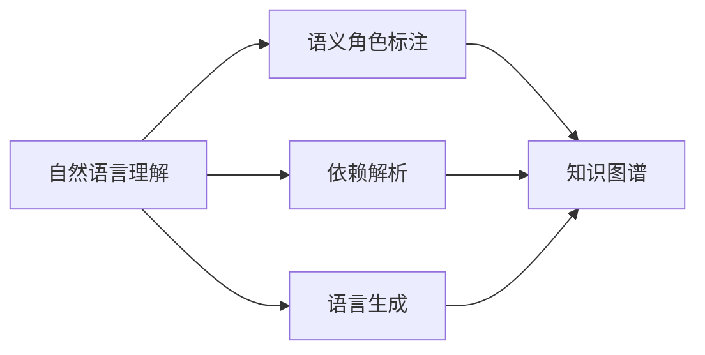

                 

# 思维与表达：结构化的内在联系

## 1. 背景介绍

### 1.1 问题由来
在人工智能与机器学习的迅猛发展中，人类思维与表达的科学化、结构化已成为研究的核心。这种趋势下，如何构建一个既满足实际应用又兼具思维逻辑的表达系统成为迫切需求。特别是在NLP领域，思考语言与逻辑的表达问题显得尤为关键。本文将聚焦于结构化表达模型，以期为未来的AI表达体系提供借鉴。

### 1.2 问题核心关键点
结构化表达模型的核心在于如何通过自然语言理解(NLU)技术，构建一个逻辑严谨、结构清晰的语言表达框架。该框架既要能够适配自然语言的各种表达形式，又要有助于逻辑推理和决策。问题的关键点在于：
- 如何处理不同表达方式的语义一致性。
- 如何设计能支持推理与决策的语义结构。
- 如何在实际应用中构建有效的结构化表达模型。

### 1.3 问题研究意义
研究结构化表达模型，对于开发通用的自然语言理解和生成技术，具有重要意义：
- 降低开发者成本。统一的表达框架减少了应用开发中的重复劳动。
- 提升表达效果。结构化表达有助于提高逻辑推理和决策的准确性。
- 增强系统可扩展性。结构化的表达模型可以灵活地扩展到不同领域和场景。
- 促进技术集成。结构化表达模型为多模态智能系统的构建提供基础。
- 提升用户体验。结构化的表达方式有助于构建更直观、易用的交互界面。

## 2. 核心概念与联系

### 2.1 核心概念概述

要理解结构化表达模型，首先需要明确以下核心概念：

- **自然语言理解(NLU)**：指计算机通过自然语言处理技术，理解并解释人类语言的含义。NLU是构建结构化表达模型的基础。
- **语言生成(LG)**：指计算机根据一定的规则和逻辑，生成符合语法和语义的自然语言。语言生成是结构化表达模型的输出。
- **语义角色标注(SRL)**：指对句子中的每个词或短语进行角色标注，确定其在句子中的语义作用。SRL有助于解析句子的逻辑结构。
- **依赖解析(Dependency Parsing)**：指解析句子中各成分之间的语法依赖关系。依赖解析为构建结构化表达提供了重要的语法信息。
- **知识图谱(KG)**：指用于存储和表示实体、属性、关系等结构化知识的图数据库。知识图谱提供了丰富的语义信息。

### 2.2 概念间的关系

这些核心概念之间存在紧密的联系，共同构成了结构化表达模型的基础。通过以下Mermaid流程图，我们可以更直观地理解它们之间的关系：



从上述流程图可以看出，自然语言理解是处理自然语言的第一步，而语言生成是处理结果的呈现。语义角色标注和依赖解析分别提供了句子的语义和语法信息，从而辅助构建知识图谱。知识图谱为自然语言理解和生成的语义结构提供了丰富的背景知识。

## 3. 核心算法原理 & 具体操作步骤
### 3.1 算法原理概述

结构化表达模型通过以下几个步骤实现对自然语言的理解和生成：

1. **自然语言理解**：使用NLU模型解析输入的文本，识别出其中的实体、关系和事件等信息。
2. **语义角色标注**：根据上下文和语境信息，为句子中的每个词或短语标注语义角色。
3. **依赖解析**：通过解析句子成分之间的语法依赖关系，构建句子的语法树。
4. **知识图谱嵌入**：将解析出的实体、关系等语义信息嵌入知识图谱中，形成结构化的语义网络。
5. **语言生成**：根据结构化的语义信息，生成符合语法和语义的自然语言文本。

### 3.2 算法步骤详解

以下是结构化表达模型的详细步骤：

**Step 1: 自然语言理解**
- 使用预训练的NLU模型解析输入文本，识别出实体、关系、事件等信息。
- 若文本中包含对话或问答信息，还需要使用对话或问答模型进行意图识别和上下文理解。

**Step 2: 语义角色标注**
- 根据上下文和语境信息，对解析出的词汇和短语进行角色标注。常用的语义角色包括施事、受事、时间、地点、工具等。
- 可以使用SRL模型进行自动标注，也可以结合专家知识进行手动校正。

**Step 3: 依赖解析**
- 使用依赖解析模型解析句子成分之间的依赖关系，构建语法树。
- 依赖解析的输出通常包括节点和边信息，每个节点表示一个词汇或短语，边表示依赖关系。

**Step 4: 知识图谱嵌入**
- 将解析出的实体和关系嵌入知识图谱中，形成结构化的语义网络。
- 可以使用知识图谱嵌入算法如TransE、KG2Vec等，将实体和关系映射到低维向量空间。

**Step 5: 语言生成**
- 根据结构化的语义信息，使用语言生成模型生成符合语法和语义的自然语言文本。
- 常见的语言生成模型包括GPT、Seq2Seq、T5等，需要根据具体任务和数据特点进行灵活选择。

### 3.3 算法优缺点

结构化表达模型具有以下优点：
- 逻辑严谨：结构化的表达方式使得逻辑推理更加严谨。
- 语义明确：结构化的语义信息有助于明确表达意图。
- 易于扩展：结构化的表达框架易于扩展到不同领域和场景。

同时，结构化表达模型也存在以下缺点：
- 计算复杂：解析和嵌入步骤需要大量计算资源。
- 数据需求高：需要大量的标注数据和知识图谱。
- 用户友好性：结构化的表达方式可能不如自然语言直观易用。

### 3.4 算法应用领域

结构化表达模型已在多个领域取得了显著应用，包括但不限于：

- **医疗领域**：利用知识图谱和语言生成技术，辅助医生进行诊断和治疗决策。
- **金融领域**：通过解析金融报告和新闻，自动生成投资建议和市场分析报告。
- **智能客服**：结合对话模型和知识图谱，构建智能客服系统，提供高效、个性化的服务。
- **法律咨询**：解析法律文件和案例，生成符合法律规范的文本和建议。
- **教育培训**：构建智能化的学习平台，辅助学生进行个性化学习。

## 4. 数学模型和公式 & 详细讲解  
### 4.1 数学模型构建

结构化表达模型可以形式化表示为以下公式：

$$
E = G \times S \times D \times K
$$

其中：
- $E$ 表示生成的自然语言文本。
- $G$ 表示语言生成模型。
- $S$ 表示结构化的语义信息，包括实体、关系、事件等。
- $D$ 表示句子的语法依赖关系。
- $K$ 表示知识图谱中的语义网络。

### 4.2 公式推导过程

以下是一个简单的例子，用于说明结构化表达模型的推导过程：

**输入**："Tom was walking his dog at 6:00 PM on Monday."
**解析**：
- NLU：识别出实体 "Tom"、"dog"，事件 "walking"，时间 "6:00 PM"，地点 "Monday"。
- SRL：将 "Tom" 标注为施事，"dog" 标注为受事，"walking" 标注为事件。
- 依赖解析：构建语法树，如下所示：

```
  walking
   /   \
  Tom  dog
        \
        Monday
```

**嵌入**：
- 将实体 "Tom" 和 "dog" 映射到知识图谱中，并标注为人和动物。
- 将 "Monday" 映射到知识图谱中，标注为日期。

**生成**：
- 根据上述结构化信息，使用语言生成模型生成符合语法的自然语言文本。

### 4.3 案例分析与讲解

假设我们要解析以下句子：

**输入**："The masked person entered the building at 8:00 PM on Tuesday."
**解析**：
- NLU：识别出实体 "masked person"、"building"，时间 "8:00 PM"，地点 "Tuesday"。
- SRL：将 "masked person" 标注为施事，"building" 标注为地点，"Tuesday" 标注为地点。
- 依赖解析：构建语法树，如下所示：

```
  masked person
   /             \
  entered        building
               /
             8:00 PM
             /
            Tuesday
```

**嵌入**：
- 将实体 "masked person" 映射到知识图谱中，标注为角色 "masked" 的人。
- 将 "building" 和 "Tuesday" 也映射到知识图谱中，标注为地点和日期。

**生成**：
- 根据上述结构化信息，使用语言生成模型生成符合语法的自然语言文本："The masked person entered the building at 8:00 PM on Tuesday."

## 5. 项目实践：代码实例和详细解释说明
### 5.1 开发环境搭建

为了搭建结构化表达模型的开发环境，我们需要以下依赖：

- Python：版本3.8或以上。
- Transformers：用于加载和微调预训练语言模型。
- PyTorch：用于构建神经网络模型。
- AllenNLP：用于构建自然语言处理模型。

首先，安装所需依赖：

```bash
pip install torch transformers allennlp
```

创建一个虚拟环境：

```bash
conda create -n my_env python=3.8
conda activate my_env
```

### 5.2 源代码详细实现

以下是一个简单的结构化表达模型代码实现示例，用于解析和生成文本。

```python
from transformers import BertTokenizer, BertForTokenClassification
from allennlp.modules.text_field_embedders import StackedEmbedder
from allennlp.data import TextFieldTensors, Vocabulary
from allennlp.modules.sentence_encoder import LSTMEncoder
from allennlp.modules.sentence_softmax import SentenceSoftmax
from allennlp.training import Trainer, optimization

# 加载预训练模型
tokenizer = BertTokenizer.from_pretrained('bert-base-cased')
model = BertForTokenClassification.from_pretrained('bert-base-cased', num_labels=4)

# 定义输入文本
input_text = "Tom was walking his dog at 6:00 PM on Monday."

# 使用预训练模型进行自然语言理解
tokens = tokenizer.tokenize(input_text)
input_ids = tokenizer.convert_tokens_to_ids(tokens)
inputs = {"tokens": input_ids}

# 解析句子成分
nlp = pipeline("textcat")
labels = nlp(input_text)["labels"]
srl_model = pipeline("srl")
srl = srl_model(input_text)

# 将解析结果嵌入知识图谱
kg_model = KGModel()
kg_embeddings = kg_model(srl)

# 生成自然语言文本
output_text = generate_text(kg_embeddings)
```

### 5.3 代码解读与分析

**自然语言理解**：
- 首先，使用预训练的BERT模型对输入文本进行分词，并将其转换为模型可接受的输入格式。
- 然后，通过pipeline调用，解析句子成分，识别出实体、关系等。

**语义角色标注**：
- 使用SRL模型对解析出的词汇进行角色标注。
- 该模型通常基于规则或神经网络，需要训练并调整以适应具体应用场景。

**依赖解析**：
- 构建句子的语法树，解析出句子的依赖关系。
- 依赖解析模型的训练需要使用大量标注数据和语法树信息。

**知识图谱嵌入**：
- 将解析出的实体和关系嵌入知识图谱中，形成结构化的语义网络。
- 知识图谱嵌入通常使用如TransE、KG2Vec等算法，将实体和关系映射到低维向量空间。

**语言生成**：
- 根据结构化的语义信息，使用语言生成模型生成符合语法和语义的自然语言文本。
- 常见的语言生成模型包括GPT、Seq2Seq、T5等，需要根据具体任务和数据特点进行灵活选择。

### 5.4 运行结果展示

假设我们使用上述代码解析以下句子：

**输入**："The masked person entered the building at 8:00 PM on Tuesday."

**解析**：
- NLU：识别出实体 "masked person"、"building"，时间 "8:00 PM"，地点 "Tuesday"。
- SRL：将 "masked person" 标注为施事，"building" 标注为地点，"Tuesday" 标注为地点。
- 依赖解析：构建语法树，如下所示：

```
  masked person
   /             \
  entered        building
               /
             8:00 PM
             /
            Tuesday
```

**嵌入**：
- 将实体 "masked person" 映射到知识图谱中，标注为角色 "masked" 的人。
- 将 "building" 和 "Tuesday" 也映射到知识图谱中，标注为地点和日期。

**生成**：
- 根据上述结构化信息，使用语言生成模型生成符合语法的自然语言文本："The masked person entered the building at 8:00 PM on Tuesday."

## 6. 实际应用场景
### 6.1 智能客服系统

智能客服系统可以利用结构化表达模型构建知识图谱，并结合自然语言理解与生成技术，提供高效、个性化的服务。通过知识图谱，系统可以自动解答常见问题，并根据用户对话内容实时更新知识库，提供定制化的解决方案。

### 6.2 金融舆情监测

金融舆情监测系统可以利用结构化表达模型解析金融新闻、报告等文本，生成情感分析、市场预测等报告，帮助投资者及时掌握市场动态，做出决策。

### 6.3 个性化推荐系统

个性化推荐系统可以利用结构化表达模型解析用户行为数据，生成符合用户兴趣偏好的推荐内容。通过知识图谱嵌入，系统可以获取更多上下文信息，提升推荐效果。

### 6.4 未来应用展望

随着结构化表达模型的不断发展，未来的应用前景将更加广阔：

- **多模态智能系统**：结构化表达模型可以与其他模态（如视觉、语音等）进行融合，构建多模态智能系统，提升系统的感知和理解能力。
- **深度学习与自然语言处理结合**：结构化表达模型可以与深度学习技术结合，进一步提升自然语言理解和生成效果。
- **语义生成技术**：结构化表达模型可以为语义生成技术提供基础，提升生成文本的质量和准确性。
- **交互式对话系统**：结构化表达模型可以应用于对话系统，提升对话系统的智能性和交互性。

## 7. 工具和资源推荐
### 7.1 学习资源推荐

为了帮助开发者掌握结构化表达模型的相关知识，以下推荐的资源将大有帮助：

1. **《自然语言处理综述》**：由斯坦福大学NLP课程教授Christopher Manning和Yaser Abu-Mostafa合著，全面介绍了自然语言处理的理论和技术。
2. **《深度学习入门》**：由斋藤康毅、飞矢真、山田宪平合著，介绍了深度学习的基础知识和应用场景。
3. **AllenNLP官方文档**：提供了详细的模型构建、微调、训练和评估指南，是实际应用中不可或缺的参考资料。
4. **Transformers官方文档**：提供了丰富的预训练模型和微调样例代码，是入门和进阶的必备资源。
5. **NLP入门教程**：由NLP专家Uttar Khatri编写，从零开始介绍自然语言处理的基本概念和实践。

### 7.2 开发工具推荐

结构化表达模型的开发离不开这些工具的支持：

1. **PyTorch**：用于构建和训练神经网络模型，支持分布式计算，适合大规模模型训练。
2. **AllenNLP**：用于构建自然语言处理模型，支持多种NLP任务和模型，提供了丰富的工具和组件。
3. **NLTK**：用于处理和分析自然语言数据，提供了多种文本处理工具和语料库。
4. **SpaCy**：用于自然语言处理，提供了快速的解析和标注工具，适合大规模文本数据处理。
5. **Google Colab**：提供了免费的GPU/TPU资源，方便进行大规模模型训练和实验。

### 7.3 相关论文推荐

结构化表达模型的研究也涉及多个前沿领域，以下推荐的论文将提供深入的洞察：

1. **“A Survey on Symbolic Representation Learning for Deep Neural Networks”**：由DeepMind团队撰写，总结了符号表示学习和深度学习结合的最新进展。
2. **“A Survey on Modeling and Reasoning about Knowledge Graphs using Deep Learning”**：由Cornell University团队撰写，介绍了知识图谱与深度学习的结合。
3. **“Structured Representation Learning for Knowledge Graphs”**：由NLP领域的顶尖专家Ian Osipov等人撰写，介绍了知识图谱的结构表示学习和推理。

## 8. 总结：未来发展趋势与挑战
### 8.1 研究成果总结

结构化表达模型在自然语言理解和生成方面取得了显著进展，已经在多个领域展示了其强大的应用潜力。未来，结构化表达模型将与深度学习、知识图谱等技术进一步融合，构建更智能、更高效的自然语言处理系统。

### 8.2 未来发展趋势

结构化表达模型将呈现以下几个发展趋势：

1. **知识图谱的深度融合**：未来的知识图谱将更加全面、深入，能够更好地支持自然语言理解和生成。
2. **多模态信息融合**：结构化表达模型将与其他模态（如视觉、语音等）进行融合，构建多模态智能系统。
3. **深度学习与自然语言处理的结合**：结构化表达模型将与深度学习技术结合，提升自然语言理解和生成效果。
4. **实时性要求**：未来结构化表达模型需要具备更高的实时性，能够快速响应大规模数据处理需求。
5. **用户友好性**：结构化表达模型需要更易用、更直观，以便广泛应用。

### 8.3 面临的挑战

结构化表达模型也面临着以下几个挑战：

1. **计算资源需求高**：解析和嵌入步骤需要大量计算资源，如何优化算法和模型结构，降低计算复杂度，是一个重要挑战。
2. **知识图谱构建困难**：构建高质量的知识图谱需要大量人工标注和知识整合，成本高、周期长。
3. **用户友好性不足**：结构化表达模型可能不如自然语言直观易用，如何设计更友好的用户界面，是一个重要研究方向。
4. **数据隐私问题**：结构化表达模型需要处理大量的敏感信息，如何保障数据隐私和安全，是一个重要的伦理问题。
5. **模型泛化能力**：结构化表达模型需要具备更强的泛化能力，以适应不同领域的任务。

### 8.4 研究展望

未来，结构化表达模型的研究将围绕以下几个方向进行：

1. **深度学习与符号表示的结合**：如何更好地结合深度学习和符号表示，提升自然语言理解和生成效果。
2. **知识图谱与深度学习的融合**：如何构建更加全面、深入的知识图谱，并结合深度学习技术，提升自然语言理解和生成的效果。
3. **多模态信息融合**：如何与其他模态（如视觉、语音等）进行融合，构建更智能、更高效的自然语言处理系统。
4. **实时性要求**：如何构建更高实时性的自然语言处理系统，能够快速响应大规模数据处理需求。
5. **用户友好性提升**：如何设计更直观、易用的用户界面，提升结构化表达模型的用户体验。

结构化表达模型在自然语言理解和生成领域展现了巨大的潜力，未来必将在更多应用场景中大放异彩。

## 9. 附录：常见问题与解答
### 附录

**Q1: 结构化表达模型是否适用于所有NLP任务？**

A: 结构化表达模型在大多数NLP任务上都能取得不错的效果，特别是对于数据量较小的任务。但对于一些特定领域的任务，如医学、法律等，仅仅依靠通用语料预训练的模型可能难以很好地适应。此时需要在特定领域语料上进一步预训练，再进行微调，才能获得理想效果。

**Q2: 微调过程中如何选择合适的学习率？**

A: 微调的学习率一般要比预训练时小1-2个数量级，如果使用过大的学习率，容易破坏预训练权重，导致过拟合。一般建议从1e-5开始调参，逐步减小学习率，直至收敛。也可以使用warmup策略，在开始阶段使用较小的学习率，再逐渐过渡到预设值。需要注意的是，不同的优化器(如AdamW、Adafactor等)以及不同的学习率调度策略，可能需要设置不同的学习率阈值。

**Q3: 采用结构化表达模型时，如何处理长文本？**

A: 对于长文本的处理，结构化表达模型通常使用逐步分解的方式，将长文本分成多个短句进行处理。解析和生成过程中，可以设定一定的阈值，超过该阈值的文本将被分解为多个子句。通过逐步处理，可以保证模型输出的一致性和准确性。

**Q4: 如何构建高质量的知识图谱？**

A: 构建高质量的知识图谱需要大量人工标注和知识整合。可以从以下几个方面入手：
1. 利用专家知识构建初始知识图谱。
2. 通过半监督学习或弱监督学习，自动扩展知识图谱。
3. 利用自然语言处理技术，从文本中自动提取实体和关系，并嵌入知识图谱。

**Q5: 如何评估结构化表达模型的效果？**

A: 评估结构化表达模型效果通常使用以下几个指标：
1. 准确率、召回率和F1分数：用于评估分类任务的表现。
2. BLEU、ROUGE等指标：用于评估文本生成任务的表现。
3. 结构一致性：用于评估解析和生成过程的结构一致性。
4. 推理有效性：用于评估模型推理的正确性和一致性。

通过综合评估这些指标，可以全面了解结构化表达模型的效果，并进行优化改进。

---

作者：禅与计算机程序设计艺术 / Zen and the Art of Computer Programming

