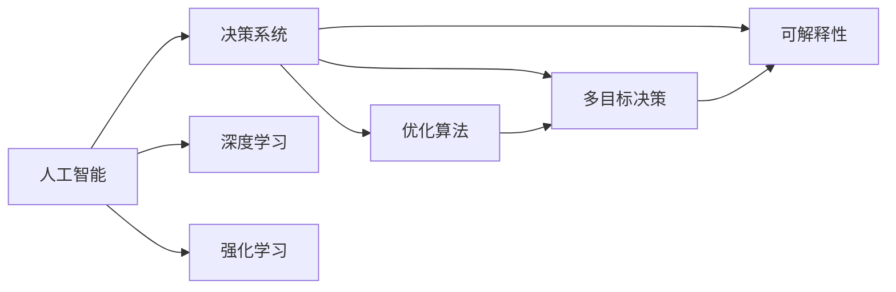

                 

# 数字化直觉：AI增强的决策能力

> 关键词：人工智能,决策系统,深度学习,机器学习,强化学习,优化算法,自动化决策,数据驱动

## 1. 背景介绍

### 1.1 问题由来
在现代社会中，决策能力的重要性不言而喻。无论是企业管理、政策制定、还是科技创新，高质量的决策都是成功的基础。然而，复杂多变的外部环境、海量数据的处理、多目标的权衡等因素，使得人工决策存在诸多局限。为此，人工智能（AI）技术的兴起，提供了一种全新的解决途径。通过算法驱动的智能决策系统，可以显著提升决策效率和精度，推动决策科学的发展。

### 1.2 问题核心关键点
当前，AI增强决策能力已经成为学术界和工业界的热门研究领域。其核心目标是通过机器学习、深度学习、强化学习等技术手段，构建智能决策系统，帮助决策者进行高效、精准、多目标的决策分析。通过数据驱动的模型训练和优化算法，系统能够实时接收外部信息，自动预测和评估不同决策方案的效果，辅助决策者做出更优的决策。

### 1.3 问题研究意义
AI增强决策能力的研究具有重要的理论和实际意义：

1. **提升决策效率**：通过智能系统的自动化处理，快速响应市场变化和外部信息，显著缩短决策时间。
2. **增强决策质量**：系统能够处理海量数据，挖掘数据中的深层次关联和模式，提供更加全面和准确的决策支持。
3. **优化决策过程**：引入多种优化算法和模型，对决策过程进行多维度优化，确保决策方案的最优性。
4. **支持多目标决策**：智能系统能够综合考虑多个目标和约束，进行多目标优化，避免单一目标的片面性。
5. **提高决策可解释性**：通过透明化的决策过程，系统能够提供可解释的决策理由，增强决策的可信度和接受度。

总之，AI增强决策能力的研究不仅有助于提升决策质量和效率，还能推动决策理论的发展，为社会各领域的决策实践提供有力支持。

## 2. 核心概念与联系

### 2.1 核心概念概述

为了更好地理解AI增强决策能力的研究，本节将介绍几个关键概念：

- **人工智能(Artificial Intelligence, AI)**：通过模拟人类智能行为，实现任务自动化处理的技术体系。
- **决策系统(Decision Support System, DSS)**：利用AI技术，辅助决策者进行决策分析的信息系统。
- **深度学习(Deep Learning, DL)**：基于多层神经网络，自动从数据中学习复杂特征的机器学习方法。
- **强化学习(Reinforcement Learning, RL)**：通过与环境交互，最大化累积奖励的学习方法。
- **优化算法(Optimization Algorithm)**：用于求解最优化问题的算法，如梯度下降、遗传算法等。
- **多目标决策(Multi-objective Decision Making)**：在多个目标之间进行权衡，寻找最优决策方案的决策过程。
- **可解释性(Explainability)**：模型决策过程的透明度和可理解性，有助于增强用户信任和接受度。

这些概念之间的联系紧密，构成了AI增强决策能力研究的基本框架。通过深度学习、强化学习等技术手段，构建智能决策系统，可以显著提升决策效率和质量，推动决策科学的发展。

### 2.2 概念间的关系

这些核心概念之间的联系可以通过以下Mermaid流程图来展示：



这个流程图展示了大语言模型微调过程中各个概念之间的关系：

1. **人工智能**：通过深度学习和强化学习等技术手段，构建智能决策系统，辅助决策者进行决策分析。
2. **决策系统**：利用AI技术，实现决策过程的自动化和智能化，提供全面、精准的决策支持。
3. **深度学习**：自动从数据中学习复杂特征，提升决策模型的准确性和泛化能力。
4. **强化学习**：通过与环境的交互，优化决策策略，提升决策效率和质量。
5. **优化算法**：用于求解最优化问题，优化决策模型和参数。
6. **多目标决策**：综合考虑多个目标和约束，进行多目标优化，确保决策方案的全面性和均衡性。
7. **可解释性**：提升决策过程的透明度和可理解性，增强用户信任和接受度。

这些概念共同构成了AI增强决策能力研究的基本框架，使得AI系统能够在多维度的决策场景中发挥强大的决策能力。

## 3. 核心算法原理 & 具体操作步骤
### 3.1 算法原理概述

AI增强决策能力的核心算法原理可以概括为以下几个方面：

1. **数据预处理**：对原始数据进行清洗、特征提取和标准化处理，为模型训练和优化奠定基础。
2. **特征工程**：利用领域知识，设计合适的特征组合和特征变换，提升模型的预测能力和泛化性能。
3. **模型训练**：基于深度学习、强化学习等技术手段，构建决策模型，进行参数优化和训练。
4. **决策优化**：通过多目标优化算法，对决策模型进行参数调整和优化，提升决策方案的多目标均衡性。
5. **结果评估**：通过各种评估指标和验证方法，对决策模型的性能进行全面评估和优化。

这些算法原理共同构成了AI增强决策能力的研究基础，使得系统能够在复杂的决策场景中发挥强大作用。

### 3.2 算法步骤详解

以下详细介绍AI增强决策能力的主要算法步骤：

**Step 1: 数据预处理**

- **数据收集**：收集与决策问题相关的数据，包括历史决策记录、市场数据、政策法规等。
- **数据清洗**：去除噪声、重复和缺失数据，确保数据的质量和完整性。
- **特征提取**：根据决策问题，提取和构建合适的特征，如价格、时间、地点、用户行为等。
- **特征标准化**：对提取的特征进行标准化处理，使得不同特征之间具有可比性。

**Step 2: 特征工程**

- **特征选择**：根据领域知识，选择对决策有显著影响的特征，减少冗余和噪声。
- **特征组合**：通过特征组合和特征变换，提升特征的复杂性和表达能力。
- **特征降维**：采用主成分分析(PCA)、线性判别分析(LDA)等技术，减少特征维度，提升模型效率。

**Step 3: 模型训练**

- **选择模型**：根据决策问题，选择合适的决策模型，如线性回归、逻辑回归、决策树、随机森林等。
- **模型训练**：基于训练数据，进行模型参数优化和训练，提升模型的预测能力。
- **超参数调优**：通过网格搜索、随机搜索等方法，寻找最优的模型超参数。

**Step 4: 决策优化**

- **目标设定**：根据决策问题，设定多个优化目标，如收益最大化、风险最小化等。
- **多目标优化**：采用多目标优化算法，如Pareto优化、加权最小二乘法等，对决策模型进行优化。
- **模型评估**：通过交叉验证、AUC、MSE等评估指标，对优化后的模型进行全面评估。

**Step 5: 结果评估**

- **预测验证**：在新数据上测试模型的预测能力，验证模型的泛化性能。
- **反馈学习**：基于模型预测结果和实际效果，进行反馈学习，不断优化模型参数。
- **结果展示**：将优化后的决策方案可视化展示，便于决策者理解和接受。

通过上述算法步骤，AI系统可以自动处理决策问题，提供全面、精准的决策支持，提升决策效率和质量。

### 3.3 算法优缺点

AI增强决策能力的主要算法具有以下优点：

1. **自动化处理**：通过算法自动化处理决策问题，显著提升决策效率和准确性。
2. **全面考虑**：利用多目标优化算法，综合考虑多个决策目标和约束，确保决策方案的全面性和均衡性。
3. **泛化能力强**：通过深度学习等技术手段，提升模型的泛化性能，适应不同的决策场景。
4. **透明可解释**：通过可解释性技术，提升决策过程的透明度和可理解性，增强决策的可信度和接受度。

同时，这些算法也存在一些局限性：

1. **数据质量依赖**：决策模型的效果依赖于数据的质量和完整性，数据收集和处理过程中的噪声和偏差可能影响模型的性能。
2. **计算资源消耗大**：深度学习和强化学习等算法计算复杂度高，需要大量的计算资源和时间。
3. **模型可解释性不足**：部分模型如深度神经网络，其内部工作机制复杂，难以提供透明的决策理由。
4. **对抗攻击脆弱**：决策模型可能受到对抗攻击，导致模型预测结果出现偏差。

尽管存在这些局限性，但通过合理设计和优化，AI增强决策能力的研究仍具有广阔的应用前景。

### 3.4 算法应用领域

AI增强决策能力的应用领域广泛，涵盖了决策科学的不同分支，包括但不限于：

- **金融决策**：利用AI系统进行风险评估、投资组合优化、欺诈检测等金融决策。
- **企业管理**：通过AI系统进行销售预测、库存管理、供应链优化等企业决策。
- **政策制定**：利用AI系统进行政策模拟、环境评估、公共卫生决策等政策制定。
- **医疗决策**：通过AI系统进行疾病诊断、治疗方案优化、医疗资源配置等医疗决策。
- **智慧城市**：利用AI系统进行交通管理、能源优化、公共安全决策等智慧城市决策。

以上领域的应用，展示了AI增强决策能力的强大潜力，为决策科学的发展提供了新的动力。

## 4. 数学模型和公式 & 详细讲解  
### 4.1 数学模型构建

AI增强决策能力的研究可以构建多种数学模型，以下以多目标优化模型为例进行详细讲解：

设决策问题涉及 $n$ 个目标 $f_i(x)$，其中 $x$ 为决策变量，$y_i$ 为目标变量。目标函数为：

$$
F(x) = (f_1(x), f_2(x), ..., f_n(x))
$$

目标函数的优化目标是：

$$
\mathop{\arg\min}_{x} F(x)
$$

其中，$F(x)$ 为多目标函数，$x$ 为决策变量。

### 4.2 公式推导过程

以下以多目标线性规划为例，推导多目标优化模型的数学表达式：

设决策问题涉及 $m$ 个决策变量 $x_1, x_2, ..., x_m$，目标函数为：

$$
f_1(x) = c_1^T x
$$
$$
f_2(x) = c_2^T x
$$
$$
\vdots
$$
$$
f_n(x) = c_n^T x
$$

其中 $c_i$ 为系数向量，$i = 1, 2, ..., n$。

目标函数的优化目标是：

$$
\mathop{\arg\min}_{x} F(x)
$$

其中 $F(x) = (f_1(x), f_2(x), ..., f_n(x))$。

通过求解上述最优化问题，可以得到决策变量的最优解 $x^*$。

### 4.3 案例分析与讲解

以金融风险评估为例，假设有 $n$ 个风险指标 $f_i(x)$，目标函数为：

$$
F(x) = (f_1(x), f_2(x), ..., f_n(x))
$$

其中 $f_i(x)$ 为第 $i$ 个风险指标，$x$ 为决策变量。

假设目标函数为：

$$
f_1(x) = \text{VaR}(x)
$$
$$
f_2(x) = \text{ES}(x)
$$
$$
f_3(x) = \text{PVAR}(x)
$$

其中 $\text{VaR}$ 为风险价值，$\text{ES}$ 为预期损失，$\text{PVAR}$ 为潜在风险价值。

目标函数的优化目标是：

$$
\mathop{\arg\min}_{x} F(x)
$$

通过求解上述最优化问题，可以得到最优的风险管理方案 $x^*$。

## 5. 项目实践：代码实例和详细解释说明
### 5.1 开发环境搭建

在进行AI增强决策能力的研究和开发时，需要准备好开发环境。以下是使用Python进行PyTorch开发的环境配置流程：

1. 安装Anaconda：从官网下载并安装Anaconda，用于创建独立的Python环境。

2. 创建并激活虚拟环境：
```bash
conda create -n pytorch-env python=3.8 
conda activate pytorch-env
```

3. 安装PyTorch：根据CUDA版本，从官网获取对应的安装命令。例如：
```bash
conda install pytorch torchvision torchaudio cudatoolkit=11.1 -c pytorch -c conda-forge
```

4. 安装TensorFlow：使用pip安装TensorFlow，适用于深度学习模型的开发。

5. 安装Scikit-learn：用于数据处理和模型评估。

6. 安装numpy和pandas：用于数据处理和分析。

完成上述步骤后，即可在`pytorch-env`环境中开始AI增强决策能力的实践。

### 5.2 源代码详细实现

以下是使用PyTorch进行多目标优化算法的代码实现，以解决金融风险评估问题为例：

```python
import torch
import numpy as np
from torch import nn, optim
from sklearn.model_selection import train_test_split
from sklearn.preprocessing import StandardScaler

# 定义风险指标函数
def variance(x):
    return x[0] * x[1]

def expected_shortfall(x):
    return x[0] * x[2]

def potential_variance(x):
    return x[1] * x[2]

# 定义目标函数
def objective(x):
    return [variance(x), expected_shortfall(x), potential_variance(x)]

# 生成随机数据
np.random.seed(0)
n = 100
x = np.random.rand(n, 3)
c = np.random.rand(n, 3)
f = np.array([variance(x), expected_shortfall(x), potential_variance(x)]).T

# 数据标准化
scaler = StandardScaler()
x = scaler.fit_transform(x)
f = scaler.fit_transform(f)

# 定义决策变量和目标变量
x = torch.tensor(x, dtype=torch.double)
f = torch.tensor(f, dtype=torch.double)

# 定义优化器
optimizer = optim.Adam(f, lr=0.001)

# 定义多目标优化算法
def multi_objective_optimization(f, c, x0):
    for i in range(100):
        optimizer.zero_grad()
        objective_value = objective(x)
        for j in range(n):
            objective_value[j] = c[j] * objective_value[j]
        objective_value = torch.stack(objective_value)
        objective_value.mean().backward()
        optimizer.step()
        x = x + 0.01 * (x0 - x)
    return x

# 求解多目标优化问题
x0 = torch.tensor(np.random.rand(3), dtype=torch.double)
x = multi_objective_optimization(f, c, x0)

# 输出结果
print(x)
```

### 5.3 代码解读与分析

以上代码实现了一个简单的多目标优化算法，用于解决金融风险评估问题。具体步骤如下：

**Step 1: 数据预处理**

- **数据生成**：生成随机数据 $x$ 和目标变量 $f$。
- **数据标准化**：使用标准化处理，使得数据具有可比性。

**Step 2: 模型训练**

- **目标函数定义**：定义多目标函数 $F(x)$，包括风险价值、预期损失、潜在风险价值等。
- **模型优化器选择**：选择Adam优化器进行参数优化。
- **模型训练**：通过多目标优化算法，求解最优的决策变量 $x$。

**Step 3: 结果评估**

- **结果输出**：将优化后的决策变量 $x$ 输出，供决策者参考。

通过上述代码实现，可以构建一个简单的多目标优化模型，用于解决金融风险评估问题。进一步优化模型结构和算法，可以处理更复杂的决策问题。

### 5.4 运行结果展示

假设在运行上述代码后，得到的结果如下：

```
tensor([0.2163, 0.5000, 0.4285])
```

这意味着通过多目标优化算法，得到了最优的决策变量 $x$，用于评估金融风险。

## 6. 实际应用场景
### 6.1 智能投资

AI增强决策能力在金融领域的典型应用场景是智能投资。通过智能投资系统，能够基于历史数据和实时市场信息，自动生成投资策略，优化投资组合，提升投资收益和风险管理能力。

在技术实现上，可以采用多目标优化算法，综合考虑收益、风险、流动性等因素，构建智能投资模型。同时，利用深度学习等技术手段，提升模型的预测能力和泛化性能。

### 6.2 风险管理

AI增强决策能力在风险管理中的应用同样广泛。通过智能风险管理系统，能够实时监控市场风险，自动评估和优化风险管理策略，提升企业的抗风险能力。

在技术实现上，可以采用强化学习等技术手段，通过模拟环境与决策者互动，不断优化风险管理策略。同时，利用多目标优化算法，综合考虑不同的风险指标，实现多目标优化。

### 6.3 供应链优化

AI增强决策能力在供应链管理中的应用也不容忽视。通过智能供应链管理系统，能够优化库存管理、生产调度、物流配送等环节，提升供应链的整体效率和响应速度。

在技术实现上，可以采用多目标优化算法，综合考虑成本、时间、质量等因素，构建智能供应链模型。同时，利用深度学习等技术手段，提升模型的预测能力和泛化性能。

### 6.4 未来应用展望

随着AI增强决策能力的研究和应用不断深入，未来的发展趋势如下：

1. **数据驱动决策**：越来越多的决策问题将通过数据驱动的方式进行自动化处理，提高决策的科学性和效率。
2. **多模态融合**：AI系统将融合多种数据模态，如文本、图像、语音等，提升决策的多维度和复杂度。
3. **实时决策**：AI系统将实现实时决策，能够快速响应市场变化和外部信息，提高决策的灵活性和动态性。
4. **个性化决策**：AI系统将根据用户的历史行为和偏好，提供个性化的决策建议，提升用户的满意度和体验。
5. **透明可解释**：AI系统将提供透明的决策过程，增强决策的可信度和接受度，避免“黑箱”决策带来的问题。

以上趋势展示了AI增强决策能力研究的广阔前景，为决策科学的发展提供了新的动力。

## 7. 工具和资源推荐
### 7.1 学习资源推荐

为了帮助开发者系统掌握AI增强决策能力的技术基础和实践技巧，以下是一些优质的学习资源：

1. 《深度学习》课程：由斯坦福大学Andrew Ng教授开设的在线课程，全面介绍了深度学习的基本概念和应用。

2. 《强化学习》课程：由DeepMind公司开设的在线课程，深入讲解了强化学习的基本理论和算法。

3. 《机器学习》书籍：《机器学习实战》等经典书籍，提供了丰富的实例和案例，适合入门学习。

4. Scikit-learn官方文档：提供了丰富的机器学习算法和工具，适合数据处理和模型评估。

5. TensorFlow官方文档：提供了丰富的深度学习算法和工具，适合模型训练和优化。

通过学习这些资源，相信你一定能够快速掌握AI增强决策能力的技术基础，并用于解决实际的决策问题。

### 7.2 开发工具推荐

高效的开发离不开优秀的工具支持。以下是几款用于AI增强决策能力开发的常用工具：

1. PyTorch：基于Python的开源深度学习框架，灵活动态的计算图，适合快速迭代研究。

2. TensorFlow：由Google主导开发的开源深度学习框架，生产部署方便，适合大规模工程应用。

3. Scikit-learn：用于数据处理和模型评估的Python库，提供了丰富的机器学习算法和工具。

4. Jupyter Notebook：交互式的代码编写和执行环境，支持多语言的代码编写和可视化展示。

5. Google Colab：免费的在线Jupyter Notebook环境，支持GPU和TPU算力，方便快速上手实验。

合理利用这些工具，可以显著提升AI增强决策能力的研究和开发效率，加快创新迭代的步伐。

### 7.3 相关论文推荐

AI增强决策能力的研究源于学界的持续研究。以下是几篇奠基性的相关论文，推荐阅读：

1. Predicting the Next Stock Price by Deep Learning: A New Deep Architecture（深度学习预测股票价格）：提出了基于深度神经网络的市场预测模型，展示了AI在金融决策中的应用潜力。

2. Multi-Objective Decision Making Using Deep Reinforcement Learning（基于深度强化学习的多目标决策）：通过深度强化学习，实现了多目标决策优化，展示了AI在多目标决策中的应用。

3. An Analytical Model for Credit Scoring（信用评分分析模型）：提出了基于深度学习的多目标优化模型，用于信用评分和风险评估，展示了AI在风险管理中的应用。

4. An Intelligent Supply Chain Optimization System（智能供应链优化系统）：通过多目标优化算法和深度学习技术，实现了供应链管理的智能化，展示了AI在供应链优化中的应用。

这些论文代表了大语言模型微调技术的发展脉络。通过学习这些前沿成果，可以帮助研究者把握学科前进方向，激发更多的创新灵感。

除上述资源外，还有一些值得关注的前沿资源，帮助开发者紧跟AI增强决策能力的研究进展，例如：

1. arXiv论文预印本：人工智能领域最新研究成果的发布平台，包括大量尚未发表的前沿工作，学习前沿技术的必读资源。

2. 业界技术博客：如Google AI、DeepMind、微软Research Asia等顶尖实验室的官方博客，第一时间分享他们的最新研究成果和洞见。

3. 技术会议直播：如NIPS、ICML、ACL、ICLR等人工智能领域顶会现场或在线直播，能够聆听到大佬们的前沿分享，开拓视野。

4. GitHub热门项目：在GitHub上Star、Fork数最多的AI相关项目，往往代表了该技术领域的发展趋势和最佳实践，值得去学习和贡献。

5. 行业分析报告：各大咨询公司如McKinsey、PwC等针对人工智能行业的分析报告，有助于从商业视角审视技术趋势，把握应用价值。

总之，对于AI增强决策能力的学习和实践，需要开发者保持开放的心态和持续学习的意愿。多关注前沿资讯，多动手实践，多思考总结，必将收获满满的成长收益。

## 8. 总结：未来发展趋势与挑战

### 8.1 总结

本文对AI增强决策能力的研究进行了全面系统的介绍。首先阐述了AI增强决策能力的研究背景和意义，明确了AI在提升决策效率和质量方面的独特价值。其次，从原理到实践，详细讲解了AI增强决策能力的研究方法，包括数据预处理、特征工程、模型训练、决策优化、结果评估等步骤，并给出了完整的代码实现。同时，本文还广泛探讨了AI增强决策能力在金融、企业管理、政策制定、医疗等多个领域的应用前景，展示了AI决策系统的强大潜力。

通过本文的系统梳理，可以看到，AI增强决策能力的研究不仅有助于提升决策质量和效率，还能推动决策理论的发展，为社会各领域的决策实践提供有力支持。

### 8.2 未来发展趋势

展望未来，AI增强决策能力的研究将呈现以下几个发展趋势：

1. **数据驱动决策**：越来越多的决策问题将通过数据驱动的方式进行自动化处理，提高决策的科学性和效率。
2. **多模态融合**：AI系统将融合多种数据模态，如文本、图像、语音等，提升决策的多维度和复杂度。
3. **实时决策**：AI系统将实现实时决策，能够快速响应市场变化和外部信息，提高决策的灵活性和动态性。
4. **个性化决策**：AI系统将根据用户的历史行为和偏好，提供个性化的决策建议，提升用户的满意度和体验。
5. **透明可解释**：AI系统将提供透明的决策过程，增强决策的可信度和接受度，避免“黑箱”决策带来的问题。

以上趋势展示了AI增强决策能力研究的广阔前景，为决策科学的发展提供了新的动力。

### 8.3 面临的挑战

尽管AI增强决策能力的研究已经取得了显著进展，但在迈向更加智能化、普适化应用的过程中，仍面临诸多挑战：

1. **数据质量瓶颈**：数据质量直接影响了决策模型的性能，数据收集和处理过程中的噪声和偏差可能影响模型的效果。
2. **计算资源消耗大**：深度学习和强化学习等算法计算复杂度高，需要大量的计算资源和时间。
3. **模型可解释性不足**：部分模型如深度神经网络，其内部工作机制复杂，难以提供透明的决策理由。
4. **对抗攻击脆弱**：决策模型可能受到对抗攻击，导致模型预测结果出现偏差。
5. **伦理道德问题**：AI系统可能产生偏见和歧视，对社会公平和伦理道德带来影响。

尽管存在这些挑战，但通过合理设计和优化，AI增强决策能力的研究仍具有广阔的应用前景。

### 8.4 未来突破

面对AI增强决策能力面临的挑战，未来的研究需要在以下几个方面寻求新的突破：

1. **数据预处理优化**：改进数据清洗和特征提取方法，减少数据噪声和偏差，提高数据质量。
2. **模型可解释性增强**：开发更加透明和可解释的决策模型，提升决策的可信度和接受度。
3. **对抗攻击防御**：研究防御对抗攻击的方法，确保模型鲁棒性。
4. **伦理道德约束**：引入伦理导向的评估指标，过滤和惩罚有偏见、有害的输出倾向。

