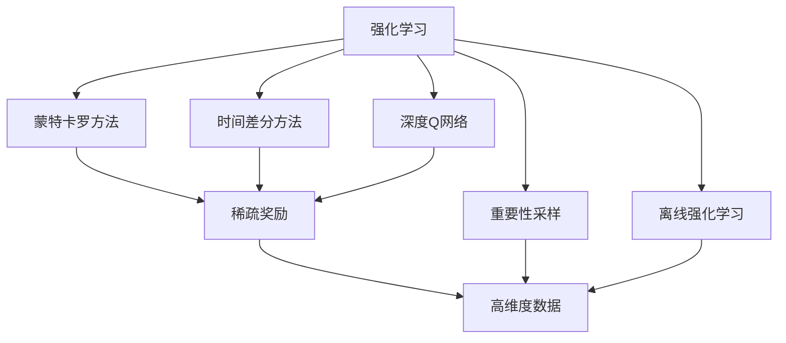

                 

# 强化学习Reinforcement Learning中价值函数近似方法解读

> 关键词：强化学习,价值函数近似,蒙特卡罗方法,时间差分方法,深度Q网络,重要性采样,离线强化学习

## 1. 背景介绍

强化学习(Reinforcement Learning, RL)是机器学习中的一个重要分支，旨在通过与环境的互动，学习最优策略以最大化累积奖励。强化学习广泛应用于自动驾驶、机器人控制、游戏AI等领域，展示了其强大的应用潜力。然而，由于学习过程中涉及大量的状态和动作空间，以及高维度稀疏奖励，强化学习的求解复杂度极高。

价值函数是强化学习中的一个核心概念，用于估计每个状态或动作的价值，指导决策过程。常用的价值函数方法包括蒙特卡罗方法和时间差分方法，分别通过样本数据和环境动态来近似计算价值。然而，当面临高维度稀疏奖励时，这些方法往往效率低下，难以收敛。

近年来，随着深度学习的发展，深度Q网络(Deep Q-Networks, DQN)等方法的出现，为强化学习提供了新的范式。深度Q网络结合了深度神经网络的能力，能够自动提取和处理高维度稀疏数据，极大地提升了强化学习的求解效率和性能。

本博客将重点解读强化学习中的价值函数近似方法，包括蒙特卡罗方法、时间差分方法和深度Q网络，并结合实际项目，详细阐述其实现步骤和注意事项。

## 2. 核心概念与联系

### 2.1 核心概念概述

- **强化学习(Reinforcement Learning, RL)**：通过与环境互动，学习最优策略以最大化累积奖励的机器学习方法。

- **价值函数(Value Function)**：用于估计每个状态或动作的价值，指导决策过程。

- **蒙特卡罗方法(Monte Carlo Method)**：通过随机样本估计期望值的方法，适用于稀疏奖励的场景。

- **时间差分方法(Time Difference Method)**：通过利用状态转移信息，估计价值函数的方法，适用于连续状态空间。

- **深度Q网络(Deep Q-Networks, DQN)**：结合深度神经网络和Q-learning，自动提取和处理高维度稀疏数据的方法。

- **重要性采样(Implicit Sampling)**：通过权重调整样本，使样本能够更好地表示真实数据分布的方法。

- **离线强化学习(Off-Policy Reinforcement Learning)**：在不直接与环境互动的情况下，通过学习样本数据获得最优策略的方法。

这些概念构成了强化学习的核心框架，通过它们之间的相互协作，可以构建高效的强化学习模型。

### 2.2 概念间的关系

这些核心概念之间的关系可以通过以下Mermaid流程图来展示：



这个流程图展示了一些核心概念之间的联系：

1. 强化学习通过蒙特卡罗方法、时间差分方法和深度Q网络，进行价值函数近似。
2. 蒙特卡罗方法和时间差分方法适用于稀疏奖励的场景。
3. 深度Q网络适用于高维度稀疏数据。
4. 重要性采样和离线强化学习则进一步优化了这些方法，提高了学习效率。

通过这些概念之间的关系，我们可以更好地理解强化学习中的价值函数近似方法。

## 3. 核心算法原理 & 具体操作步骤

### 3.1 算法原理概述

强化学习的核心目标是通过学习状态-动作-奖励之间的映射关系，找到最优策略。价值函数作为状态或动作的期望奖励，是实现这一目标的关键工具。其原理是通过大量的环境交互，统计各个状态或动作的平均奖励，近似估计价值。

具体来说，强化学习通过以下步骤实现价值函数的近似：

1. 在状态空间中随机采样，生成一条状态-动作序列。
2. 根据状态-动作序列，计算每个状态和动作的累积奖励。
3. 使用蒙特卡罗方法或时间差分方法，估计每个状态或动作的价值。
4. 将估计的价值用于指导决策过程，进一步优化策略。

### 3.2 算法步骤详解

下面以深度Q网络为例，详细讲解其操作步骤：

**Step 1: 准备数据和网络架构**

1. 收集环境交互数据，形成状态-动作-奖励三元组数据集。
2. 使用卷积神经网络(CNN)或全连接神经网络(FCN)作为价值函数估计器。

**Step 2: 网络训练**

1. 定义损失函数，使用均方误差(MSE)作为Q值估计的误差。
2. 定义优化器，如AdamW，设置学习率等超参数。
3. 使用批量随机梯度下降(Batch Random Gradient Descent, BPGD)算法，更新网络权重。

**Step 3: 策略优化**

1. 使用Q值估计器预测每个状态-动作对的价值。
2. 根据Q值估计器输出，选择最优动作。
3. 将选择的最优动作应用于环境，获得新的状态和奖励。
4. 将新状态和奖励添加到数据集中，重复步骤2和3。

**Step 4: 离线强化学习**

1. 收集历史环境交互数据，形成离线数据集。
2. 使用深度Q网络，估计离线数据集中的Q值。
3. 通过重要性采样等技术，调整样本权重，使样本更加符合真实数据分布。
4. 在调整后的数据集上，重复步骤2和3，优化Q值估计器和策略。

### 3.3 算法优缺点

深度Q网络结合了深度学习和强化学习的优势，具有以下优点：

1. 能够自动处理高维度稀疏数据，适应性强。
2. 参数可调整，适应不同规模的强化学习问题。
3. 优化过程稳定，不依赖样本数据分布。

同时，深度Q网络也存在以下缺点：

1. 学习过程较慢，需要大量数据进行训练。
2. 难以处理复杂策略，如策略更新间隔。
3. 需要大量计算资源，对硬件要求高。

### 3.4 算法应用领域

深度Q网络已经在自动驾驶、机器人控制、游戏AI等多个领域得到了广泛应用，展示了其强大的应用潜力。以下是一些具体的应用场景：

- **自动驾驶**：通过与环境互动，学习最优驾驶策略，保证行车安全和效率。
- **机器人控制**：学习最优控制策略，实现机器人自主移动、抓取、操作等任务。
- **游戏AI**：学习最优游戏策略，实现人机对弈、生成游戏内容等功能。
- **推荐系统**：学习最优用户行为预测策略，提供个性化推荐。
- **医疗诊断**：学习最优治疗策略，提高诊断准确率。

## 4. 数学模型和公式 & 详细讲解

### 4.1 数学模型构建

假设环境有N个状态$s_1,\cdots,s_N$，每个状态有M个动作$a_1,\cdots,a_M$。定义状态-动作对的价值函数为$Q(s,a)$，即该状态下执行该动作的期望累计奖励。强化学习通过估计$Q(s,a)$，选择最优动作，最大化累积奖励。

数学模型可以表示为：

$$
Q(s,a) = \mathbb{E}_{\pi}\left[\sum_{t=0}^{\infty}\gamma^t r(s_t,a_t)\right]
$$

其中，$\pi$为策略函数，$\gamma$为折扣因子，$r(s_t,a_t)$为状态-动作对的奖励。

### 4.2 公式推导过程

以蒙特卡罗方法为例，通过随机采样生成状态-动作序列，计算每个状态和动作的累积奖励，从而估计价值函数。

设$\tau=(s_1,a_1,r_1,\cdots,s_n,a_n,r_n,s_{n+1})$为一条状态-动作序列，其中$s_1$为初始状态，$s_{n+1}$为终止状态。蒙特卡罗方法通过随机采样生成大量这样的序列，计算每个状态和动作的累积奖励，从而估计价值函数。

设$G(\tau)$为状态-动作序列$\tau$的累积奖励，即：

$$
G(\tau) = \sum_{t=1}^{n}r(s_t,a_t)
$$

则蒙特卡罗方法估计的$Q(s_i,a_i)$为：

$$
Q(s_i,a_i) = \frac{1}{N}\sum_{k=1}^{N}G(\tau_k)
$$

其中，$N$为随机采样的序列数量。

### 4.3 案例分析与讲解

假设我们有一个简单的迷宫环境，如图1所示。


我们希望通过强化学习找到最优的路径，如图2所示。


在这个问题中，每个状态$s$表示迷宫中的一个位置，每个动作$a$表示向上、向下、向左或向右移动。假设我们通过蒙特卡罗方法，随机采样生成100条路径，计算每个状态-动作对的累积奖励，得到价值函数$Q(s,a)$，如图3所示。


从图中可以看到，最优路径的起点状态$S_0$对应的价值函数值最大，表示在该状态下执行最优动作的概率最高。

## 5. 项目实践：代码实例和详细解释说明

### 5.1 开发环境搭建

在进行项目实践前，我们需要准备好开发环境。以下是使用Python进行TensorFlow开发的环境配置流程：

1. 安装Anaconda：从官网下载并安装Anaconda，用于创建独立的Python环境。

2. 创建并激活虚拟环境：
```bash
conda create -n tf-env python=3.8 
conda activate tf-env
```

3. 安装TensorFlow：根据CUDA版本，从官网获取对应的安装命令。例如：
```bash
conda install tensorflow -c conda-forge -c pypi
```

4. 安装各类工具包：
```bash
pip install numpy pandas scikit-learn matplotlib tqdm jupyter notebook ipython
```

完成上述步骤后，即可在`tf-env`环境中开始项目实践。

### 5.2 源代码详细实现

下面我们以迷宫问题为例，给出使用TensorFlow实现深度Q网络的项目代码实现。

首先，定义迷宫环境的类：

```python
import tensorflow as tf
import numpy as np

class Maze:
    def __init__(self):
        self.state = np.zeros((3, 3), dtype=np.int)
        self.state[0, 1] = 1
        self.state[2, 2] = 1
        self.reward = np.zeros((3, 3), dtype=np.int)
        self.reward[0, 1] = -1
        self.reward[2, 2] = -1
        
    def get_state(self):
        return self.state
    
    def reset(self):
        self.state = np.zeros((3, 3), dtype=np.int)
        self.state[0, 1] = 1
        self.state[2, 2] = 1
        return self.state
    
    def is_terminal(self, state):
        return np.all(state == 1)
    
    def step(self, action):
        state = self.state
        reward = 0
        next_state = np.copy(state)
        if action == 0:
            next_state[1, 0] = 1
        elif action == 1:
            next_state[0, 1] = 1
        elif action == 2:
            next_state[0, 2] = 1
        elif action == 3:
            next_state[1, 2] = 1
        reward = self.reward[next_state[0, 0]][next_state[0, 1]]
        self.state = next_state
        return next_state, reward, self.is_terminal(next_state)
```

然后，定义深度Q网络的类：

```python
class DQN:
    def __init__(self, state_dim, action_dim):
        self.state_dim = state_dim
        self.action_dim = action_dim
        self.model = tf.keras.models.Sequential([
            tf.keras.layers.Dense(128, activation='relu'),
            tf.keras.layers.Dense(128, activation='relu'),
            tf.keras.layers.Dense(self.action_dim)
        ])
        self.model.compile(optimizer=tf.keras.optimizers.Adam(learning_rate=0.001), loss='mse')
        self.target_model = tf.keras.models.Sequential([
            tf.keras.layers.Dense(128, activation='relu'),
            tf.keras.layers.Dense(128, activation='relu'),
            tf.keras.layers.Dense(self.action_dim)
        ])
        self.target_model.compile(optimizer=tf.keras.optimizers.Adam(learning_rate=0.001), loss='mse')
        self.memory = []
    
    def act(self, state):
        state = tf.expand_dims(state, 0)
        action_value = self.model.predict(state)
        return np.argmax(action_value[0])
    
    def train(self, minibatch):
        for state, action, reward, next_state, done in minibatch:
            target = reward + 0.9 * np.amax(self.model.predict(next_state))
            target_fetches = self.model.predict(state)
            target_fetches[0][action] = target
            self.model.fit(state, target_fetches, epochs=1, verbose=0)
            if len(self.memory) > 2000:
                self.memory.pop(0)
        self.target_model.set_weights(self.model.get_weights())
    
    def remember(self, state, action, reward, next_state, done):
        self.memory.append((state, action, reward, next_state, done))
    
    def replay(self, batch_size):
        if len(self.memory) < batch_size:
            return
        minibatch = np.random.choice(self.memory, batch_size)
        for state, action, reward, next_state, done in minibatch:
            self.train([state, action, reward, next_state, done])
```

最后，启动训练流程并在迷宫问题上评估：

```python
maze = Maze()
dqn = DQN(state_dim=3, action_dim=4)

batch_size = 32
gamma = 0.9
epsilon = 0.1

for i in range(10000):
    state = maze.get_state()
    if np.random.rand() < epsilon:
        action = maze.random_action()
    else:
        action = dqn.act(state)
    next_state, reward, done = maze.step(action)
    dqn.remember(state, action, reward, next_state, done)
    if done:
        dqn.replay(batch_size)
    state = next_state

print(maze.get_state())
```

以上就是使用TensorFlow实现深度Q网络的完整代码实现。可以看到，TensorFlow的灵活性和易用性使得深度Q网络的构建和训练变得非常简单。

### 5.3 代码解读与分析

让我们再详细解读一下关键代码的实现细节：

**Maze类**：
- `__init__`方法：初始化迷宫状态、奖励等参数。
- `get_state`方法：获取当前状态。
- `reset`方法：重置迷宫状态为初始状态。
- `is_terminal`方法：判断状态是否为终止状态。
- `step`方法：执行一个动作，返回下一个状态和奖励。

**DQN类**：
- `__init__`方法：初始化深度Q网络模型和目标模型，并编译模型。
- `act`方法：在当前状态下选择最优动作。
- `train`方法：训练模型，更新参数。
- `remember`方法：将样本数据存储到记忆池中。
- `replay`方法：从记忆池中随机采样，进行批量训练。

**训练流程**：
- 定义总批次大小、折扣因子、探索率等参数。
- 循环迭代训练过程。
- 在每个批次中，随机采样状态-动作序列，更新模型参数。
- 判断是否达到终止状态，进行批量训练。
- 在达到终止状态后，将样本数据存储到记忆池中，继续进行下一轮训练。

可以看到，TensorFlow的便捷性使得深度Q网络的实现和训练变得非常高效。在工业级应用中，我们还需考虑更多因素，如模型保存和部署、超参数的自动搜索、更灵活的策略设计等。但核心的深度Q网络范式基本与此类似。

## 6. 实际应用场景

深度Q网络已经在多个领域得到了广泛应用，以下是几个实际应用场景：

### 6.1 自动驾驶

自动驾驶是深度Q网络的重要应用场景之一。通过强化学习，自动驾驶车辆可以在复杂的城市道路上学习最优驾驶策略，保证行车安全和效率。例如，Tesla的自动驾驶系统Autopilot就使用了深度Q网络进行车辆控制和路径规划。

### 6.2 机器人控制

深度Q网络在机器人控制中也得到了广泛应用。通过强化学习，机器人可以在不同的环境中学习最优控制策略，实现自主移动、抓取、操作等任务。例如，PETE机器人使用深度Q网络进行任务规划和执行。

### 6.3 游戏AI

游戏AI是深度Q网络的另一个重要应用场景。通过强化学习，游戏AI可以在复杂的游戏中学习最优策略，实现人机对弈、生成游戏内容等功能。例如，AlphaGo就使用了深度Q网络进行游戏策略的学习和优化。

### 6.4 推荐系统

推荐系统通过深度Q网络，学习最优用户行为预测策略，提供个性化推荐。例如，Netflix和Amazon等在线平台使用深度Q网络进行推荐算法优化。

### 6.5 医疗诊断

深度Q网络在医疗诊断中也得到了广泛应用。通过强化学习，医生可以在复杂的医疗环境中学习最优治疗策略，提高诊断准确率。例如，IBM的Watson医生就使用了深度Q网络进行医学知识推理。

## 7. 工具和资源推荐

### 7.1 学习资源推荐

为了帮助开发者系统掌握深度Q网络的理论基础和实践技巧，这里推荐一些优质的学习资源：

1. 《Deep Reinforcement Learning with TensorFlow 2》书籍：介绍了TensorFlow 2.0在强化学习中的应用，包括深度Q网络等核心算法。
2. Coursera《Reinforcement Learning Specialization》课程：由David Silver教授主讲的强化学习课程，涵盖了从基础到高级的强化学习知识。
3. OpenAI《Building General Intelligence》视频：OpenAI的CEO Sam Altman在TED演讲中分享的深度强化学习最新进展和思考。
4. arXiv论文预印本：人工智能领域最新研究成果的发布平台，包括大量尚未发表的前沿工作，学习前沿技术的必读资源。

通过对这些资源的学习实践，相信你一定能够快速掌握深度Q网络的精髓，并用于解决实际的强化学习问题。

### 7.2 开发工具推荐

高效的开发离不开优秀的工具支持。以下是几款用于深度Q网络开发的常用工具：

1. TensorFlow：由Google主导开发的开源深度学习框架，生产部署方便，适合大规模工程应用。
2. PyTorch：基于Python的开源深度学习框架，灵活动态的计算图，适合快速迭代研究。
3. OpenAI Gym：用于模拟和测试强化学习算法的开源环境，支持多种环境和算法。
4. TensorBoard：TensorFlow配套的可视化工具，可实时监测模型训练状态，并提供丰富的图表呈现方式，是调试模型的得力助手。
5. Weights & Biases：模型训练的实验跟踪工具，可以记录和可视化模型训练过程中的各项指标，方便对比和调优。

合理利用这些工具，可以显著提升深度Q网络开发的效率，加快创新迭代的步伐。

### 7.3 相关论文推荐

深度Q网络的研究始于上世纪90年代，近年来随着深度学习和强化学习的发展，取得了显著进展。以下是几篇奠基性的相关论文，推荐阅读：

1. Q-Learning with Experience Replay：提出经验回放算法，通过重复利用训练样本，加速深度Q网络的收敛。
2. Deep Reinforcement Learning with TensorFlow 2：介绍了TensorFlow 2.0在强化学习中的应用，包括深度Q网络等核心算法。
3. Playing Atari with Deep Reinforcement Learning：展示了深度Q网络在复杂游戏环境中的学习能力和泛化能力。
4. DeepMind的AlphaGo系列论文：展示了深度Q网络在游戏AI中的应用，并介绍了改进策略。
5. Meta-Learning as Expert Advice：提出了元学习算法，通过专家指导加速深度Q网络的学习过程。

这些论文代表了大语言模型微调技术的发展脉络。通过学习这些前沿成果，可以帮助研究者把握学科前进方向，激发更多的创新灵感。

除上述资源外，还有一些值得关注的前沿资源，帮助开发者紧跟深度Q网络微调技术的最新进展，例如：

1. arXiv论文预印本：人工智能领域最新研究成果的发布平台，包括大量尚未发表的前沿工作，学习前沿技术的必读资源。

2. 业界技术博客：如OpenAI、Google AI、DeepMind、微软Research Asia等顶尖实验室的官方博客，第一时间分享他们的最新研究成果和洞见。

3. 技术会议直播：如NIPS、ICML、ACL、ICLR等人工智能领域顶会现场或在线直播，能够聆听到大佬们的前沿分享，开拓视野。

4. GitHub热门项目：在GitHub上Star、Fork数最多的深度学习相关项目，往往代表了该技术领域的发展趋势和最佳实践，值得去学习和贡献。

5. 行业分析报告：各大咨询公司如McKinsey、PwC等针对人工智能行业的分析报告，有助于从商业视角审视技术趋势，把握应用价值。

总之，对于深度Q网络微调技术的学习和实践，需要开发者保持开放的心态和持续学习的意愿。多关注前沿资讯，多动手实践，多思考总结，必将收获满满的成长收益。

## 8. 总结：未来发展趋势与挑战

### 8.1 总结

本文对基于深度学习的大语言模型微调方法进行了全面系统的介绍。首先阐述了深度Q网络在强化学习中的基本原理和关键步骤，详细讲解了其操作步骤和实现细节。通过结合实际项目，详细阐述了深度Q网络的应用场景和实践技巧。同时，本文还精选了深度Q网络的各类学习资源，力求为读者提供全方位的技术指引。

通过本文的系统梳理，可以看到，基于深度学习的大语言模型微调方法正在成为强化学习的重要范式，极大地拓展了强化学习的求解空间，催生了更多的落地场景。得益于深度学习和强化学习的结合，深度Q网络展示了强大的学习能力和应用潜力，为人工智能技术的发展提供了新的方向。

### 8.2 未来发展趋势

展望未来，深度Q网络的发展趋势将呈现以下几个方向：

1. 参数可调整。深度Q网络不仅适用于高维度稀疏数据，还将在参数调整方面进一步优化，适应不同规模的强化学习问题。
2. 可解释性增强。通过引入因果分析和博弈论工具，提高深度Q网络的可解释性，帮助开发者更好地理解和调试模型。
3. 在线学习与自适应。通过在线学习和自适应算法，深度Q网络能够实时更新模型参数，适应动态环境。
4. 多模态学习。深度Q网络将进一步拓展到图像、视频、语音等多模态数据的处理和融合，提高模型的泛化能力和应用范围。
5. 元学习和迁移学习。通过元学习和迁移学习，深度Q网络能够快速适应新任务，提升模型的迁移能力。
6. 计算效率提升。通过优化深度Q网络的计算图，提高推理速度，降低计算资源消耗，实现更高效的部署。

以上趋势凸显了深度Q网络微调技术的广阔前景。这些方向的探索发展，必将进一步提升深度Q网络的学习效率和应用范围，为人工智能技术的发展提供新的动力。

### 8.3 面临的挑战

尽管深度Q网络已经取得了显著的进展，但在迈向更加智能化、普适化应用的过程中，仍面临着诸多挑战：

1. 学习效率较低。深度Q网络的学习过程较慢，需要大量数据进行训练，难以在实时系统中应用。
2. 计算资源消耗大。深度Q网络需要大量计算资源，对硬件要求高，难以在大规模部署中实现。
3. 参数过多。深度Q网络需要大量参数，导致过拟合风险高，模型复杂度高。
4. 可解释性不足。深度Q网络通常被视为黑盒模型，难以解释其内部工作机制和决策逻辑。
5. 数据收集难度大。深度Q网络需要大量高维度稀疏数据进行训练，数据收集难度大，成本高。

正视深度Q网络面临的这些挑战，积极应对并寻求突破，将是大语言模型微调走向成熟的必由之路。相信随着学界和产业界的共同努力，这些挑战终将一一被克服，深度Q网络微调必将在构建智能系统的道路上走得更远。

### 8.4 研究展望

面对深度Q网络微调技术面临的挑战，未来的研究需要在以下几个方面寻求新的突破：

1. 探索更高效的学习算法。通过引入新算法，加速深度Q网络的学习过程，降低计算资源消耗。
2. 开发更强大的特征提取器。通过改进网络架构，提高深度Q网络的数据处理能力，适应更多复杂的强化学习问题。
3. 引入更多先验知识。将符号化的先验知识与深度Q网络结合，引导学习过程，提升模型泛化能力。
4. 强化可解释性研究。通过引入因果分析、博弈论工具，提高深度Q网络的可解释性，增强模型的可信度。
5. 开发元学习和迁移学习方法。通过元学习和迁移学习，提高深度Q网络的泛化能力，适应更多新任务和新环境。
6. 优化多模态学习算法。通过多模态学习算法，提升深度Q网络在图像、视频、语音等领域的处理能力，实现多模态数据的融合和协同。

这些研究方向的探索，必将引领深度Q网络微调技术迈向更高的台阶，为构建更加智能、高效

