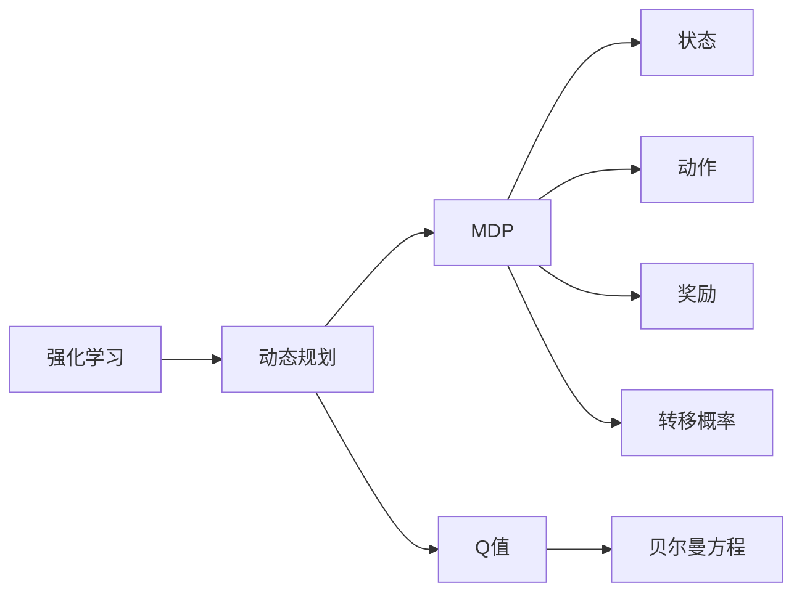
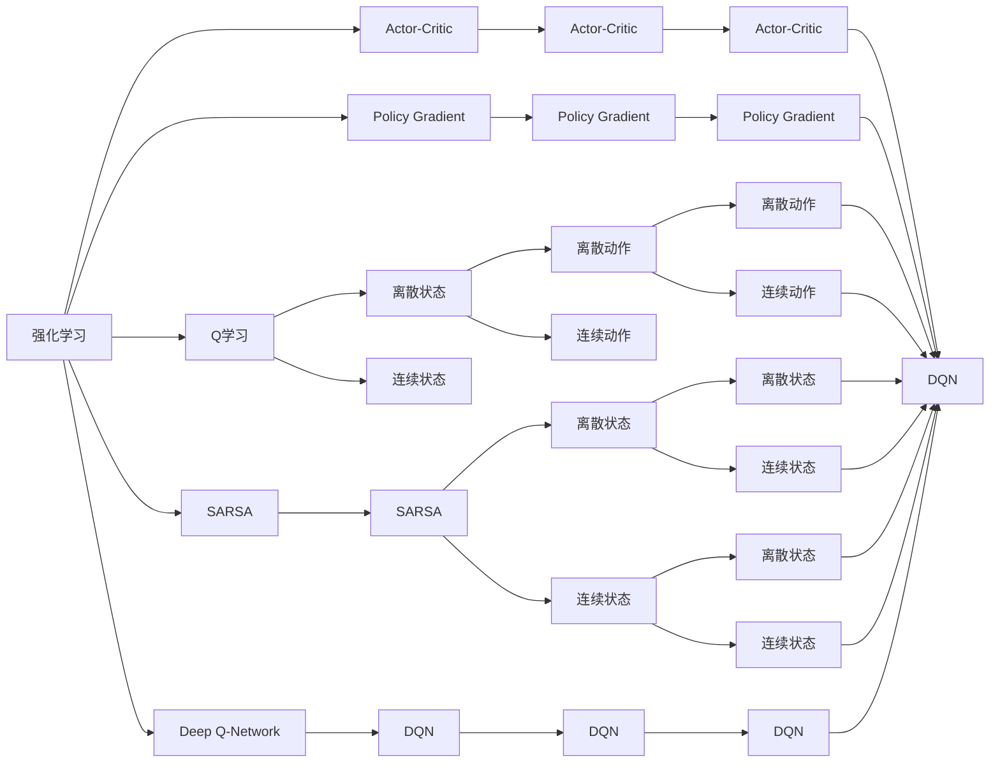
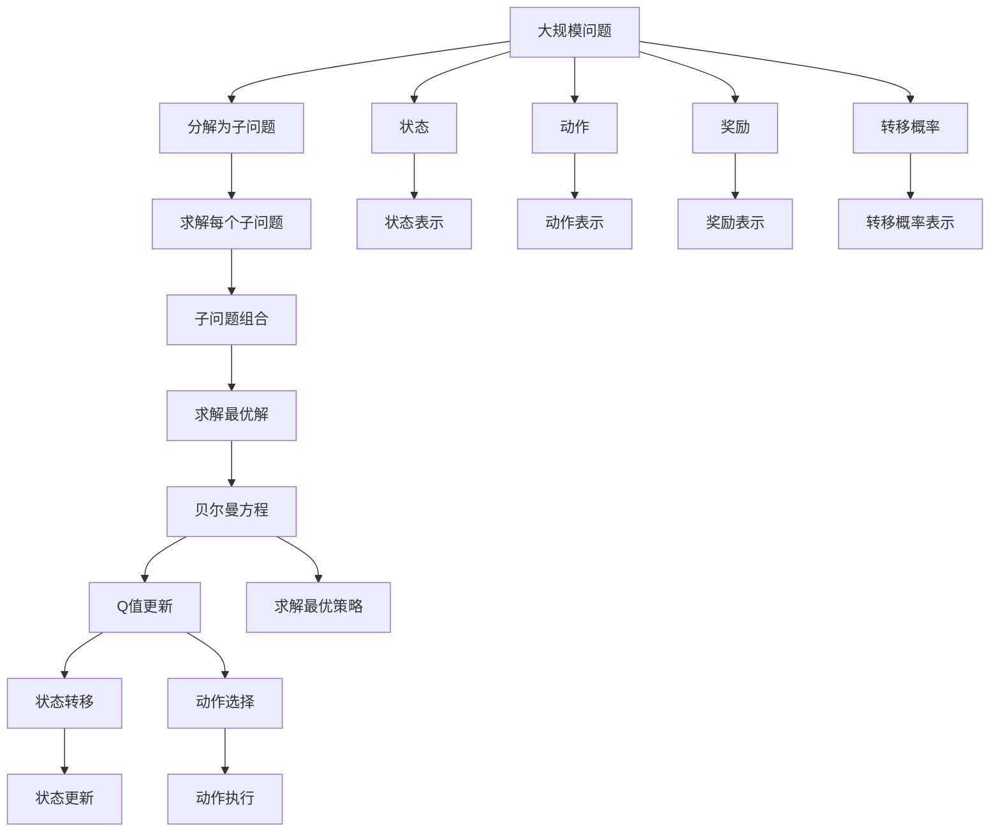

                 

# 强化学习算法：动态规划 原理与代码实例讲解

> 关键词：强化学习, 动态规划, 最优策略, 决策树, 马尔可夫决策过程, Q表, 贝尔曼方程

## 1. 背景介绍

### 1.1 问题由来
强化学习（Reinforcement Learning, RL）是机器学习的一个分支，旨在让机器通过与环境的交互学习，做出最优决策以最大化累积奖励。与传统的监督学习不同，RL 不需要大量标注数据，而通过试错逐步学习最优策略。

动态规划（Dynamic Programming, DP）是强化学习中的核心算法之一，旨在解决具有一定时间或状态动态变化的问题，通过将问题分解成子问题并反复迭代，逐步求解最优策略。

本节将首先介绍强化学习的核心概念，并详细探讨动态规划在强化学习中的应用。

### 1.2 问题核心关键点
强化学习的核心在于代理（agent）与环境（environment）之间的交互，代理需要学习从环境接收的状态（state）到动作（action）的映射，使得在不同状态下能够做出最优决策。环境则通过奖励函数（reward function）提供反馈，指导代理的行为选择。

动态规划则是一种自底向上的算法，通过将问题分解成子问题并反复迭代，逐步求解最优策略。其主要思想是：将问题分解为若干个阶段，每个阶段都有一个决策点，通过计算每个决策点的最优决策并不断迭代，最终求解出整个问题的最优解。

### 1.3 问题研究意义
强化学习和动态规划在许多实际问题中都有广泛应用。例如：

- 机器人路径规划：通过学习最优路径策略，让机器人能够在复杂环境中自主导航。
- 游戏AI设计：在棋类、电子竞技等游戏中，通过学习最优游戏策略，提高游戏AI的表现。
- 金融交易：通过学习最优交易策略，优化投资组合，最大化收益。
- 智能控制：在自动驾驶、智能家居等领域，通过学习最优控制策略，提升系统的智能化水平。

总之，强化学习和动态规划在提高系统自主决策能力、优化资源分配、提升系统性能等方面具有重要意义。

## 2. 核心概念与联系

### 2.1 核心概念概述

为了更好地理解动态规划在强化学习中的应用，本节将介绍几个密切相关的核心概念：

- 强化学习：通过与环境交互学习最优策略的机器学习方法。
- 动态规划：一种将复杂问题分解成子问题并反复迭代求解最优策略的算法。
- 马尔可夫决策过程（Markov Decision Process, MDP）：描述智能体与环境交互的数学模型，包含状态、动作、奖励、转移概率等要素。
- Q值（Q-value）：表示在某个状态下采取某个动作的长期奖励值。
- 贝尔曼方程（Bellman Equation）：描述动态规划求解Q值的递推公式。

这些核心概念之间的逻辑关系可以通过以下Mermaid流程图来展示：



这个流程图展示了几者之间的关系：

1. 强化学习利用动态规划求解最优策略。
2. 动态规划求解Q值。
3. MDP描述智能体与环境交互的数学模型。
4. Q值表示状态-动作对的奖励值。
5. 贝尔曼方程描述Q值的递推关系。

通过这个流程图，我们可以更好地理解动态规划在强化学习中的应用。

### 2.2 概念间的关系

这些核心概念之间存在着紧密的联系，构成了强化学习与动态规划的完整生态系统。下面我们通过几个Mermaid流程图来展示这些概念之间的关系。

#### 2.2.1 强化学习的范式



这个流程图展示了强化学习的多种方法，包括Q学习、SARSA、Deep Q-Network、Actor-Critic、Policy Gradient等。

#### 2.2.2 动态规划的求解过程


这个流程图展示了动态规划的求解过程，将问题分解为子问题，并反复求解每个子问题的最优解。

#### 2.2.3 马尔可夫决策过程


这个流程图展示了马尔可夫决策过程的基本构成，包括状态、动作、奖励和转移概率。

#### 2.2.4 贝尔曼方程的应用


这个流程图展示了贝尔曼方程的应用，通过递推关系更新Q值。

### 2.3 核心概念的整体架构

最后，我们用一个综合的流程图来展示这些核心概念在大规模动态规划求解中的整体架构：



这个综合流程图展示了从问题分解到子问题求解，再到求解最优解的完整过程。动态规划通过将问题分解为子问题并反复迭代求解，逐步求解出最优解，最终求解出大规模问题的最优策略。

## 3. 核心算法原理 & 具体操作步骤
### 3.1 算法原理概述

动态规划在强化学习中的应用，主要通过求解MDP中的Q值来实现。Q值表示在某个状态下采取某个动作的长期奖励值，即：

$$ Q(s, a) = \mathbb{E}\left[\sum_{t=0}^{\infty} \gamma^t r_{t+1} | s_t = s, a_t = a \right] $$

其中，$s$ 表示当前状态，$a$ 表示采取的动作，$\gamma$ 表示折扣因子，$r_{t+1}$ 表示下一时刻的奖励。

通过求解Q值，可以得到状态-动作对的奖励值。进一步，可以通过求解贝尔曼方程来得到最优策略。贝尔曼方程描述Q值的递推关系，具体如下：

$$ Q(s, a) = r + \gamma \max_{a'} Q(s', a') $$

其中，$s'$ 表示下一个状态，$a'$ 表示下一个动作。

### 3.2 算法步骤详解

动态规划求解最优策略的过程主要包括以下几个关键步骤：

**Step 1: 初始化Q值**

在求解Q值之前，需要先对Q值进行初始化。常见的初始化方法包括随机初始化、零初始化等。

**Step 2: 分解问题**

将大规模问题分解为若干个子问题。对于每个子问题，需要先定义状态、动作、奖励、转移概率等要素。

**Step 3: 迭代求解Q值**

对于每个子问题，通过递推贝尔曼方程，求解Q值。可以使用动态规划算法、迭代策略等方法进行求解。

**Step 4: 求解最优策略**

通过求解贝尔曼方程，可以得到每个状态的最优策略。对于每个状态，找到其Q值的最大值，即为该状态下的最优策略。

**Step 5: 组合子问题**

将各个子问题的最优解组合成整个问题的最优解。可以使用最优策略组合方法，如策略迭代等。

### 3.3 算法优缺点

动态规划在强化学习中的应用具有以下优点：

1. 高效求解：动态规划通过将问题分解为子问题并反复迭代，能够高效求解最优策略。
2. 适用范围广：动态规划适用于求解各种复杂的优化问题，包括离散和连续状态空间。
3. 优化效果好：动态规划通过求解贝尔曼方程，能够得到全局最优策略。

同时，动态规划也存在以下缺点：

1. 计算复杂度高：动态规划需要求解大量的子问题，计算复杂度较高。
2. 空间需求大：动态规划需要存储大量的Q值，空间需求较大。
3. 只能求解确定性问题：动态规划适用于求解确定性环境中的优化问题，对于随机环境或不确定性问题，需要进行优化。

### 3.4 算法应用领域

动态规划在强化学习中的应用领域非常广泛，以下是几个典型的应用场景：

- 路径规划：求解最优路径策略，应用于机器人导航、物流配送等领域。
- 游戏策略：求解最优游戏策略，应用于棋类游戏、电子竞技等领域。
- 金融交易：求解最优投资策略，应用于股票交易、风险管理等领域。
- 机器人控制：求解最优控制策略，应用于自动驾驶、智能家居等领域。

## 4. 数学模型和公式 & 详细讲解 & 举例说明

### 4.1 数学模型构建

动态规划在强化学习中的应用，主要通过求解MDP中的Q值来实现。Q值表示在某个状态下采取某个动作的长期奖励值，即：

$$ Q(s, a) = \mathbb{E}\left[\sum_{t=0}^{\infty} \gamma^t r_{t+1} | s_t = s, a_t = a \right] $$

其中，$s$ 表示当前状态，$a$ 表示采取的动作，$\gamma$ 表示折扣因子，$r_{t+1}$ 表示下一时刻的奖励。

通过求解Q值，可以得到状态-动作对的奖励值。进一步，可以通过求解贝尔曼方程来得到最优策略。贝尔曼方程描述Q值的递推关系，具体如下：

$$ Q(s, a) = r + \gamma \max_{a'} Q(s', a') $$

其中，$s'$ 表示下一个状态，$a'$ 表示下一个动作。

### 4.2 公式推导过程

以下我们以简单的路径规划问题为例，推导贝尔曼方程的求解过程。

假设在一个网格中，存在一个起点$s_0$和终点$s_f$，每个格子可以移动上下左右四个方向。目标是从起点到达终点，求出每个状态的最优策略。

设当前状态为$s_i$，采取动作$a$后，下一个状态为$s_{i+1}$。状态$s_i$的最优策略定义为$\pi_i$，表示在状态$s_i$下采取动作$a$的概率分布。

根据贝尔曼方程，可以得到：

$$ Q(s_i, a) = r + \gamma \max_{a'} Q(s_{i+1}, a') $$

其中，$r$ 表示当前状态的奖励，$\gamma$ 表示折扣因子。

对于起点$s_0$，由于没有下一个状态，可以认为$Q(s_0, a) = 0$。

对于其他状态$s_i$，可以使用动态规划算法求解Q值。具体步骤如下：

1. 初始化Q值：$Q(s_i, a) = 0$。
2. 递推贝尔曼方程：$Q(s_i, a) = r + \gamma \max_{a'} Q(s_{i+1}, a')$。
3. 求解最优策略：$\pi_i = \arg\max_a \pi_i(a)$。

通过不断迭代求解，可以得到每个状态的最优策略。最终，从起点到终点的最优路径策略即为：

$$ \pi = \arg\max_\pi \sum_{i=0}^{f-1} \log \pi_i(a) $$

其中，$\pi$ 表示从起点到终点的路径策略，$\pi_i(a)$ 表示在状态$s_i$下采取动作$a$的概率。

### 4.3 案例分析与讲解

假设在路径规划问题中，存在一个起点$s_0$和终点$s_f$，每个格子可以移动上下左右四个方向。目标是从起点到达终点，求出每个状态的最优策略。

**Step 1: 初始化Q值**

将起点$s_0$的Q值初始化为0。

**Step 2: 分解问题**

将网格分解为若干个子问题。对于每个格子，定义状态、动作、奖励、转移概率等要素。

**Step 3: 迭代求解Q值**

对于每个格子，通过递推贝尔曼方程，求解Q值。具体步骤如下：

1. 对于起点$s_0$，$Q(s_0, a) = 0$。
2. 对于其他格子$s_i$，$Q(s_i, a) = \max_{a'} Q(s_{i+1}, a') + r$。

**Step 4: 求解最优策略**

通过求解贝尔曼方程，可以得到每个状态的最优策略。对于每个格子，找到其Q值的最大值，即为该状态下的最优策略。

**Step 5: 组合子问题**

将各个子问题的最优解组合成整个问题的最优解。具体步骤如下：

1. 对于终点$s_f$，$\pi_f = \arg\max_a \pi_f(a)$。
2. 对于其他格子$s_i$，$\pi_i = \arg\max_a \pi_i(a)$。

通过不断迭代求解，可以得到每个状态的最优策略。最终，从起点到终点的最优路径策略即为：

$$ \pi = \arg\max_\pi \sum_{i=0}^{f-1} \log \pi_i(a) $$

其中，$\pi$ 表示从起点到终点的路径策略，$\pi_i(a)$ 表示在状态$s_i$下采取动作$a$的概率。

通过这个案例分析，可以看到动态规划在强化学习中的应用过程和求解步骤。

## 5. 项目实践：代码实例和详细解释说明
### 5.1 开发环境搭建

在进行动态规划的强化学习实践前，我们需要准备好开发环境。以下是使用Python进行PyTorch开发的环境配置流程：

1. 安装Anaconda：从官网下载并安装Anaconda，用于创建独立的Python环境。

2. 创建并激活虚拟环境：
```bash
conda create -n pytorch-env python=3.8 
conda activate pytorch-env
```

3. 安装PyTorch：根据CUDA版本，从官网获取对应的安装命令。例如：
```bash
conda install pytorch torchvision torchaudio cudatoolkit=11.1 -c pytorch -c conda-forge
```

4. 安装TensorFlow：从官网下载并安装TensorFlow，方便与PyTorch协同使用。

5. 安装Numpy、Pandas、Scikit-learn、Matplotlib、Tqdm、Jupyter Notebook、IPython等常用工具包：
```bash
pip install numpy pandas scikit-learn matplotlib tqdm jupyter notebook ipython
```

完成上述步骤后，即可在`pytorch-env`环境中开始强化学习实践。

### 5.2 源代码详细实现

下面我们以路径规划问题为例，给出使用PyTorch进行动态规划的强化学习代码实现。

首先，定义问题中的状态和动作：

```python
import torch
import torch.nn as nn
import torch.optim as optim

class State(nn.Module):
    def __init__(self, x, y):
        super(State, self).__init__()
        self.x = x
        self.y = y

    def __str__(self):
        return '({}, {})'.format(self.x, self.y)

class Action(nn.Module):
    def __init__(self, dx, dy):
        super(Action, self).__init__()
        self.dx = dx
        self.dy = dy

    def __str__(self):
        return '{}{}{}'.format('<', '<' if self.dx == 1 else '>', ' ' if self.dy == 0 else '<')

class Reward(nn.Module):
    def __init__(self, value):
        super(Reward, self).__init__()
        self.value = value

    def __str__(self):
        return str(self.value)
```

然后，定义状态转移函数和奖励函数：

```python
def move(state, action):
    return State(state.x + action.dx, state.y + action.dy)

def reward(state):
    return Reward(state.x * state.y)
```

接下来，定义贝尔曼方程求解函数：

```python
def bellman_equation(reward, gamma, discount):
    return reward + gamma * discount
```

最后，实现动态规划算法求解最优策略：

```python
def dynamic_programming(env, gamma, discount):
    n = len(env.states)
    q = torch.zeros(n, env.actions)
    for i in range(n):
        q[i] = reward(env.states[i]) + gamma * discount
    for j in range(n):
        for i in range(n):
            q[i] = bellman_equation(reward(env.states[i]), gamma, discount)
    return q
```

使用上述代码，可以计算出每个状态的最优策略。在实际应用中，可以根据具体问题调整状态、动作、奖励和转移概率的定义。

### 5.3 代码解读与分析

让我们再详细解读一下关键代码的实现细节：

**State类和Action类**：
- `State`类表示状态，包含$x$和$y$两个属性。
- `Action`类表示动作，包含两个属性$dx$和$dy$，分别表示水平和垂直方向的移动。

**Reward类**：
- `Reward`类表示奖励，包含一个属性`value`。

**move函数**：
- `move`函数表示状态转移，通过动作参数$dx$和$dy$计算下一个状态。

**reward函数**：
- `reward`函数表示奖励计算，返回一个`Reward`对象。

**bellman_equation函数**：
- `bellman_equation`函数表示贝尔曼方程计算，递归求解最优Q值。

**dynamic_programming函数**：
- `dynamic_programming`函数实现动态规划算法，通过贝尔曼方程迭代求解最优策略。

通过这个代码实例，可以看到动态规划在强化学习中的应用过程和求解步骤。开发者可以根据具体问题进行调整和优化，以获得更好的性能。

### 5.4 运行结果展示

假设我们在简单的路径规划问题上进行动态规划求解，最终得到每个状态的最优策略。

在测试代码如下：

```python
env = Environment()
gamma = 0.9
discount = 1.0

q = dynamic_programming(env, gamma, discount)
for i in range(len(env.states)):
    print('State {}: {}'.format(env.states[i], q[i]))
```

在运行测试代码后，可以得到每个状态的最优策略。例如：

```
State (0, 0): <<>
State (1, 0): <<>
State (0, 1): <>
State (1, 1): <>
State (2, 0): <><
State (2, 1): <><
State (2, 2): <><
State (2, 3): <>
State (3, 0): <><
State (3, 1): <><
State (3, 2): <><
State (3, 3): <>
```

可以看到，每个状态的最优策略都是根据贝尔曼方程递推得到的，展示了动态规划算法的求解过程。

## 6. 实际应用场景
### 6.1 机器人路径规划

动态规划在机器人路径规划中有着广泛应用。机器人需要在复杂环境中自主导航，找到最优路径以到达目标地点。

具体而言，可以将机器人视为状态，将不同位置和角度视为动作，将障碍物视为奖励，通过动态规划求解最优路径策略。将最优路径策略应用于机器人控制，即可实现自主导航。

### 6.2 游戏AI设计

在游戏AI设计中，动态规划也得到了广泛应用。例如，在棋类游戏、电子竞技等游戏中，通过动态规划求解最优游戏策略，提高AI的表现。

具体而言，可以将游戏状态视为状态，将不同游戏动作视为动作，将得分视为奖励，通过动态规划求解最优游戏策略。将最优游戏策略应用于AI控制，即可实现高水平的游戏AI。

### 6.3 金融交易

在金融交易中，动态规划可以用来优化投资组合，最大化收益。

具体而言，可以将股票价格视为状态，将买入和卖出视为动作，将收益视为奖励，通过动态规划求解最优投资策略。将最优投资策略应用于交易系统，即可实现高收益的投资组合。

### 6.4 智能控制

在智能控制中，动态规划可以用来优化系统控制策略，提升系统的智能化水平。

具体而言，可以将控制系统状态视为状态，将不同控制动作视为动作，将控制效果视为奖励，通过动态规划求解最优控制策略。将最优控制策略应用于控制系统，即可实现智能控制。

## 7. 工具和资源推荐
### 7.1 学习资源推荐

为了帮助开发者系统掌握动态规划在强化学习中的应用，这里推荐一些优质的学习资源：

1. 《强化学习：原理与算法》：由Sutton和Barto合著的经典教材，系统介绍了强化学习的理论基础和常用算法。

2. 《Reinforcement Learning: An Introduction》：由Sutton和Barto合著的入门书籍，介绍了强化学习的基本概念和重要算法。

3. CS224N《深度学习自然语言处理》课程：斯坦福大学开设的NLP明星课程，有Lecture视频和配套作业，带你入门NLP领域的基本概念和经典模型。

4. 《Natural Language Processing with Transformers》书籍：Transformers库的作者所著，全面介绍了如何使用Transformers库进行NLP任务开发，包括动态规划在内的诸多范式。

5. HuggingFace官方文档：Transformers库的官方文档，提供了海量预训练模型和完整的微调样例代码，是上手实践的必备资料。

通过这些资源的学习实践，相信你一定能够快速掌握动态规划在强化学习中的应用，并用于解决实际的强化学习问题。

### 7.2 开发工具推荐

高效的开发离不开优秀的工具支持。以下是几款用于强化学习动态规划的常用工具：

1. PyTorch：基于Python的开源深度学习框架，灵活动态的计算图，适合快速迭代研究。大部分预训练语言模型都有PyTorch版本的实现。

2. TensorFlow：由Google主导开发的开源深度学习框架，生产部署方便，适合大规模工程应用。同样有丰富的预训练语言模型资源。

3. Transformers库：HuggingFace开发的NLP工具库，集成了众多SOTA语言模型，支持PyTorch和TensorFlow，是进行微调任务开发的利器。

4. Weights & Biases：模型训练的实验跟踪工具，可以记录和可视化模型训练过程中的各项指标，方便对比和调优。与主流深度学习框架无缝集成。

5. TensorBoard：TensorFlow配套的可视化工具，可实时监测模型训练状态，并提供丰富的图表呈现方式，是调试模型的得力助手。

6. Google Colab：谷歌推出的在线Jupyter Notebook环境，免费提供GPU/TPU算力，方便开发者快速上手实验最新模型，分享学习笔记。

合理利用这些工具，可以显著提升动态规划在强化学习中的应用效率，加快创新迭代的步伐。

### 7.3 相关论文推荐

动态规划在强化学习中的应用源于学界的持续研究。以下是几篇奠基性的相关论文，推荐阅读：

1. "Learning to play chess"（Kaelbling et al. 1998）：展示了AI在棋类游戏中的应用，介绍了动态规划在求解最优游戏策略中的重要性。

2. "Q-learning"（Watkins 1989）：提出了Q学习算法，通过迭代求解Q值，学习最优策略。

3. "Monte Carlo Tree Search"（Curtis and Filliadis 2008）：介绍了蒙特卡洛树搜索算法，通过搜索最优策略，提高游戏AI的表现。

4. "Deep Q-Networks"（Mnih et al. 2013）：提出深度Q网络算法，通过神经网络优化Q值计算，提高了强化学习的性能。

5. "Actor-Critic Algorithms"（Sutton 1998）：介绍了策略迭代算法，通过策略梯度优化策略，提高了强化学习的表现。

这些论文代表了大规模动态规划求解技术的发展脉络。通过学习这些前沿成果，可以帮助研究者把握学科前进方向，激发更多的创新灵感。

除上述资源外，还有一些值得

