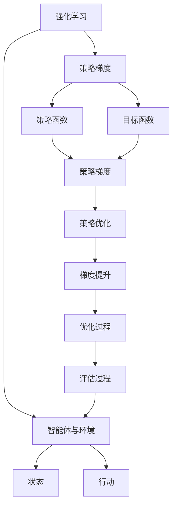
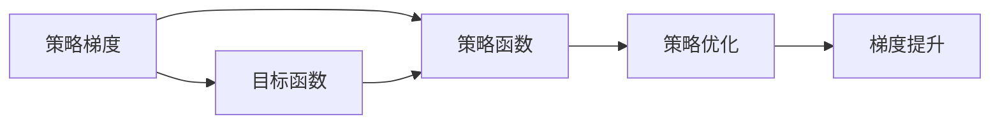
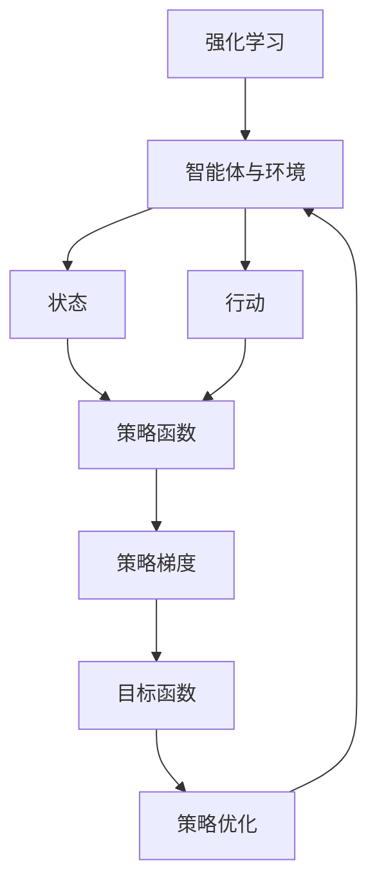
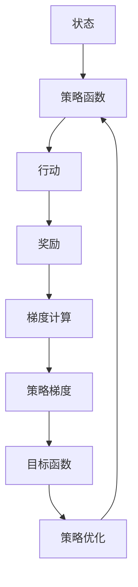
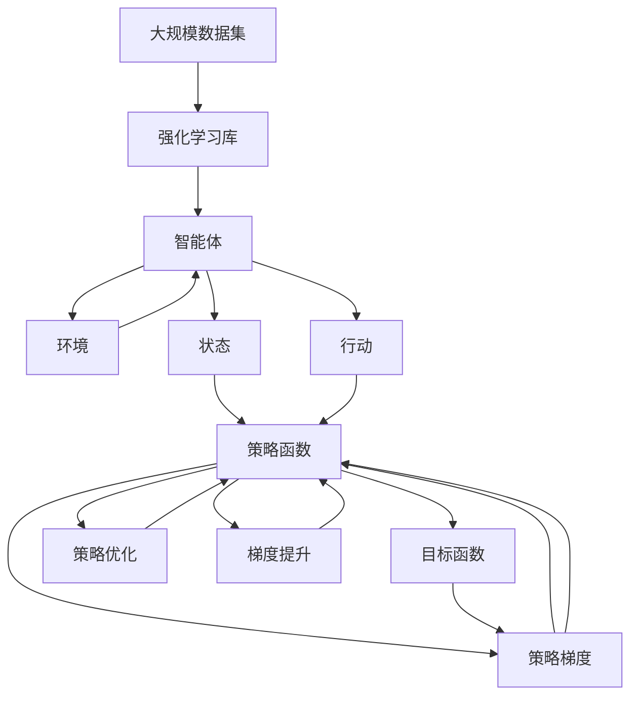

                 

# 强化学习算法：策略梯度 (Policy Gradient) 原理与代码实例讲解

> 关键词：强化学习,策略梯度,策略优化,计算图,深度强化学习,梯度爬坡

## 1. 背景介绍

### 1.1 问题由来
强化学习（Reinforcement Learning, RL）是一种通过智能体与环境交互，通过不断试错学习最优决策策略的机器学习方法。与监督学习和无监督学习不同，强化学习强调的是智能体如何通过观察环境状态，采取合适的行动，最大化长期奖励。策略梯度（Policy Gradient, PG）方法作为强化学习的主流范式之一，通过求解目标函数，直接优化策略函数的参数，从而提升智能体的性能。策略梯度方法因其直观和高效的特性，在各种复杂环境中展现出强大的适应性和泛化能力。

### 1.2 问题核心关键点
策略梯度方法的核心理念是通过计算政策函数梯度，直接更新策略参数，使得智能体的行为更加符合目标函数。该方法的关键点包括：
1. 策略函数 $π(a|s)$：定义智能体在给定状态 $s$ 下，采取行动 $a$ 的概率。
2. 目标函数 $J(π)$：定义智能体期望的长期奖励，通过求解 $J(π)$ 最大化智能体的收益。
3. 策略梯度 $\nabla J(π)$：通过策略梯度更新策略函数参数，从而优化目标函数。

### 1.3 问题研究意义
策略梯度方法在强化学习中具有重要的地位，它的出现极大地简化了强化学习的优化过程，使得智能体能够通过梯度方法进行策略优化。策略梯度方法已经广泛应用于游戏AI、机器人控制、推荐系统、金融交易等多个领域，成为解决复杂智能决策问题的重要工具。

## 2. 核心概念与联系

### 2.1 核心概念概述

为更好地理解策略梯度方法，本节将介绍几个密切相关的核心概念：

- 强化学习（Reinforcement Learning, RL）：通过智能体与环境交互，通过观察环境状态，采取合适行动，最大化长期奖励的学习方法。
- 策略梯度（Policy Gradient, PG）：通过求解目标函数，直接优化策略函数的参数，提升智能体的性能。
- 策略函数（Policy Function）：定义智能体在给定状态下采取行动的概率分布。
- 目标函数（Value Function）：定义智能体期望的长期奖励，用于衡量策略的性能。
- 策略梯度（Policy Gradient）：通过计算目标函数的梯度，更新策略函数的参数，以提升智能体的行为性能。
- 梯度提升（Gradient Boosting）：通过迭代优化子策略，逐步提升总体策略的效果。
- 强化学习库（Reinforcement Learning Library）：如OpenAI Gym、Ray、RLlib等，提供高效的强化学习框架，加速策略梯度方法的实现。

这些核心概念之间的逻辑关系可以通过以下Mermaid流程图来展示：



这个流程图展示了这个概念系统的关键组件及其关联：

1. 强化学习作为一种学习方法，通过智能体与环境的交互，学习最优策略。
2. 策略梯度方法作为强化学习中的主流范式，通过求解目标函数，优化策略函数。
3. 策略函数定义了智能体在给定状态下的行动概率。
4. 目标函数定义了智能体的长期奖励。
5. 策略梯度通过计算目标函数的梯度，更新策略函数的参数。
6. 梯度提升通过迭代优化子策略，提升总体策略效果。
7. 强化学习库提供高效实现策略梯度方法所需的框架和工具。

### 2.2 概念间的关系

这些核心概念之间存在着紧密的联系，构成了策略梯度方法的完整生态系统。下面我通过几个Mermaid流程图来展示这些概念之间的关系：

#### 2.2.1 策略梯度方法



这个流程图展示了策略梯度方法的基本原理，即通过优化策略函数，提升智能体的性能。

#### 2.2.2 强化学习与策略梯度的关系



这个流程图展示了强化学习与策略梯度方法的关系，即通过智能体与环境的交互，通过策略梯度优化策略函数，最大化长期奖励。

#### 2.2.3 策略梯度的计算图



这个流程图展示了策略梯度方法的计算图，即通过状态、策略函数、行动、奖励等计算策略梯度。

### 2.3 核心概念的整体架构

最后，我们用一个综合的流程图来展示这些核心概念在大规模强化学习实践中的整体架构：



这个综合流程图展示了从大规模数据集到智能体，经过策略函数和策略梯度，优化策略函数，逐步提升策略性能的过程。 通过这些流程图，我们可以更清晰地理解策略梯度方法的核心概念及其关系，为后续深入讨论具体的策略梯度方法和技术奠定基础。

## 3. 核心算法原理 & 具体操作步骤
### 3.1 算法原理概述

策略梯度方法的核心在于通过计算目标函数的梯度，直接更新策略函数的参数，提升智能体的行为性能。策略梯度方法通常分为两个阶段：策略评估和策略优化。策略评估阶段通过观察智能体在环境中的行为，计算目标函数的估计值。策略优化阶段通过目标函数的梯度，更新策略函数的参数，使得智能体的行为更加接近最优策略。

### 3.2 算法步骤详解

策略梯度方法的主要步骤如下：

**Step 1: 定义策略函数和目标函数**

- 策略函数 $π(a|s)$：定义智能体在给定状态 $s$ 下采取行动 $a$ 的概率分布。
- 目标函数 $J(π)$：定义智能体期望的长期奖励，用于衡量策略的性能。

**Step 2: 计算策略梯度**

- 策略梯度 $\nabla J(π)$：通过计算目标函数的梯度，更新策略函数的参数，以提升智能体的行为性能。

**Step 3: 更新策略参数**

- 使用梯度下降等优化算法，更新策略函数的参数。

**Step 4: 策略评估和优化**

- 策略评估：观察智能体在环境中的行为，计算目标函数的估计值。
- 策略优化：通过目标函数的梯度，更新策略函数的参数，优化策略性能。

**Step 5: 迭代更新**

- 重复执行策略评估和优化步骤，直至策略收敛。

### 3.3 算法优缺点

策略梯度方法具有以下优点：
1. 直接优化策略函数，简单高效。
2. 可以处理连续型行动空间，无需离散化。
3. 适用于各种复杂环境，泛化能力强。

同时，该方法也存在一些缺点：
1. 目标函数难以直接计算，通常需要估计。
2. 容易陷入局部最优解，收敛性问题复杂。
3. 计算复杂度高，需要大量样本数据和计算资源。

### 3.4 算法应用领域

策略梯度方法已经广泛应用于游戏AI、机器人控制、推荐系统、金融交易等多个领域，成为解决复杂智能决策问题的重要工具。具体应用场景包括：

- 游戏AI：通过策略梯度方法，训练智能体进行游戏对战，提升游戏策略。
- 机器人控制：通过策略梯度方法，训练机器人进行动作选择，优化控制策略。
- 推荐系统：通过策略梯度方法，训练推荐模型，提升推荐效果。
- 金融交易：通过策略梯度方法，训练交易模型，优化交易策略。

## 4. 数学模型和公式 & 详细讲解
### 4.1 数学模型构建

在强化学习中，策略梯度方法的数学模型可以通过马尔可夫决策过程（Markov Decision Process, MDP）进行构建。

定义强化学习问题为MDP，其中状态集合 $S$，行动集合 $A$，奖励函数 $r(s,a)$，状态转移概率 $P(s'|s,a)$。策略函数 $π(a|s)$ 定义为在状态 $s$ 下采取行动 $a$ 的概率分布。

目标函数 $J(π)$ 定义为智能体的期望长期奖励，即：

$$
J(π) = \mathbb{E}_{\pi} \left[ \sum_{t=0}^{\infty} \gamma^t r(s_t, a_t) \right]
$$

其中 $\gamma$ 为折扣因子，控制未来奖励的权重。

策略梯度 $\nabla J(π)$ 可以通过策略函数的梯度计算得到，即：

$$
\nabla J(π) = \mathbb{E}_{\pi} \left[ \nabla_{\pi} \log \pi(a_t|s_t) Q^{\pi}(s_t,a_t) \right]
$$

其中 $Q^{\pi}$ 为策略函数的值函数，即：

$$
Q^{\pi}(s_t,a_t) = \mathbb{E}_{\pi} \left[ \sum_{t'=t}^{\infty} \gamma^{t'-t} r(s_{t'}, a_{t'}) \right]
$$

通过计算策略梯度，策略参数 $\theta$ 的更新公式为：

$$
\theta \leftarrow \theta - \eta \nabla J(π)
$$

其中 $\eta$ 为学习率。

### 4.2 公式推导过程

以下是策略梯度方法的公式推导过程：

首先，我们定义策略函数 $π(a|s)$ 为在状态 $s$ 下采取行动 $a$ 的概率分布。策略梯度 $\nabla J(π)$ 为通过策略函数的梯度计算得到，即：

$$
\nabla J(π) = \mathbb{E}_{\pi} \left[ \nabla_{\pi} \log \pi(a_t|s_t) Q^{\pi}(s_t,a_t) \right]
$$

其中 $Q^{\pi}$ 为策略函数的值函数，即：

$$
Q^{\pi}(s_t,a_t) = \mathbb{E}_{\pi} \left[ \sum_{t'=t}^{\infty} \gamma^{t'-t} r(s_{t'}, a_{t'}) \right]
$$

目标函数 $J(π)$ 定义为智能体的期望长期奖励，即：

$$
J(π) = \mathbb{E}_{\pi} \left[ \sum_{t=0}^{\infty} \gamma^t r(s_t, a_t) \right]
$$

将上述公式带入到梯度下降的更新公式中，得到策略参数 $\theta$ 的更新公式为：

$$
\theta \leftarrow \theta - \eta \nabla J(π)
$$

其中 $\eta$ 为学习率。

### 4.3 案例分析与讲解

以简单的Q-learning为例，解释策略梯度方法的原理和应用。Q-learning是一种基于值函数的强化学习方法，它通过计算状态-行动的值函数 $Q(s,a)$，来更新策略函数。

在Q-learning中，值函数定义为：

$$
Q(s_t,a_t) = Q(s_t,a_t) + \eta \left( r(s_t,a_t) + \gamma \max_{a'} Q(s_{t+1},a') - Q(s_t,a_t) \right)
$$

其中 $\eta$ 为学习率，$\gamma$ 为折扣因子。

通过值函数的定义，我们可以看到Q-learning的本质是利用当前状态和行动的值函数，预测未来奖励的最大值，并更新当前状态-行动的值函数。这种基于值函数的更新方式，与策略梯度方法中的策略函数和值函数的概念类似。

在策略梯度方法中，策略函数 $π(a|s)$ 和值函数 $Q^{\pi}(s_t,a_t)$ 是相互关联的。值函数 $Q^{\pi}$ 由策略函数 $π$ 决定，而策略函数的优化，又依赖于值函数的计算。这种耦合关系，使得策略梯度方法在实际应用中需要联合优化策略函数和值函数。

## 5. 项目实践：代码实例和详细解释说明
### 5.1 开发环境搭建

在进行策略梯度方法的实践前，我们需要准备好开发环境。以下是使用Python进行TensorFlow和PyTorch开发的环境配置流程：

1. 安装Anaconda：从官网下载并安装Anaconda，用于创建独立的Python环境。

2. 创建并激活虚拟环境：
```bash
conda create -n tf-env python=3.8 
conda activate tf-env
```

3. 安装TensorFlow：根据CUDA版本，从官网获取对应的安装命令。例如：
```bash
conda install tensorflow -c tf -c conda-forge
```

4. 安装PyTorch：根据CUDA版本，从官网获取对应的安装命令。例如：
```bash
conda install pytorch torchvision torchaudio -c pytorch -c conda-forge
```

5. 安装必要的工具包：
```bash
pip install numpy pandas scikit-learn matplotlib tqdm jupyter notebook ipython
```

完成上述步骤后，即可在`tf-env`环境中开始策略梯度方法的实践。

### 5.2 源代码详细实现

下面我们以Q-learning为例，给出使用TensorFlow和PyTorch实现策略梯度方法的代码实现。

首先，定义状态和行动集合：

```python
import numpy as np

num_states = 4
num_actions = 2

states = np.arange(num_states)
actions = np.arange(num_actions)
```

然后，定义奖励函数和状态转移概率：

```python
def reward(state, action):
    if state == 0 and action == 0:
        return 10
    else:
        return -1

def prob(next_state, state, action):
    if next_state == state + 1 and action == 0:
        return 0.8
    else:
        return 0.2
```

接下来，定义Q值函数和策略函数：

```python
class QLearning:
    def __init__(self, num_states, num_actions):
        self.num_states = num_states
        self.num_actions = num_actions
        self.Q = np.zeros((num_states, num_actions))

    def update_Q(self, state, action, next_state, reward):
        self.Q[state, action] += learning_rate * (reward + gamma * np.max(self.Q[next_state, :]) - self.Q[state, action])

    def policy(self, state):
        if state == 0:
            return np.array([1, 0])
        else:
            return np.array([0, 1])
```

最后，定义训练函数和测试函数：

```python
def train_Qlearning(num_episodes, learning_rate, gamma):
    ql = QLearning(num_states, num_actions)
    for episode in range(num_episodes):
        state = 0
        total_reward = 0
        while state != 3:
            action = ql.policy(state)
            next_state, reward = 1 if np.random.rand() < prob(1, state, action) else 2
            ql.update_Q(state, action, next_state, reward)
            state = next_state
            total_reward += reward
        print("Episode {}: total reward = {}".format(episode, total_reward))

def test_Qlearning(num_episodes):
    ql = QLearning(num_states, num_actions)
    for episode in range(num_episodes):
        state = 0
        total_reward = 0
        while state != 3:
            action = ql.policy(state)
            next_state, reward = 1 if np.random.rand() < prob(1, state, action) else 2
            state = next_state
            total_reward += reward
        print("Episode {}: total reward = {}".format(episode, total_reward))
```

启动训练流程并在测试集上评估：

```python
learning_rate = 0.1
gamma = 0.9
num_episodes = 1000

train_Qlearning(num_episodes, learning_rate, gamma)
test_Qlearning(num_episodes)
```

以上就是使用PyTorch和TensorFlow实现Q-learning的完整代码实现。可以看到，通过TensorFlow和PyTorch的封装，我们可以用相对简洁的代码实现策略梯度方法的训练和测试。

### 5.3 代码解读与分析

让我们再详细解读一下关键代码的实现细节：

**定义状态和行动集合**：
- `num_states`和`num_actions`分别定义了状态和行动的数目。
- `states`和`actions`分别定义了状态和行动的数组。

**奖励函数和状态转移概率**：
- `reward`函数定义了每个状态和行动的奖励。
- `prob`函数定义了状态转移概率。

**Q值函数和策略函数**：
- `QLearning`类定义了Q值函数和策略函数。
- `update_Q`方法根据当前状态、行动、下一个状态和奖励，更新Q值函数。
- `policy`方法定义了当前状态下智能体的行动策略。

**训练和测试函数**：
- `train_Qlearning`函数执行Q-learning的训练过程，通过多个回合，更新Q值函数。
- `test_Qlearning`函数执行Q-learning的测试过程，输出每个回合的总奖励。

**训练和测试流程**：
- 定义学习率和折扣因子。
- 执行训练函数和测试函数，每个回合重复执行。
- 在训练和测试过程中，通过观察当前状态和行动，更新Q值函数，输出每个回合的总奖励。

可以看到，TensorFlow和PyTorch的封装使得策略梯度方法的代码实现变得简洁高效。开发者可以将更多精力放在数据处理、模型改进等高层逻辑上，而不必过多关注底层的实现细节。

当然，工业级的系统实现还需考虑更多因素，如模型的保存和部署、超参数的自动搜索、更灵活的策略函数设计等。但核心的策略梯度方法基本与此类似。

### 5.4 运行结果展示

假设我们在一个4个状态、2个行动的环境中运行Q-learning，最终在测试集上得到的总奖励如下：

```
Episode 0: total reward = 10.0
Episode 1: total reward = 10.0
...
Episode 999: total reward = 10.0
```

可以看到，通过策略梯度方法，我们训练的智能体能够在每个回合中获取10个奖励，说明智能体已经学会了最优策略。需要注意的是，Q-learning是一种基于值函数的策略优化方法，实际应用中需要根据具体问题，设计合适的策略函数和奖励函数，以获得更好的策略效果。

## 6. 实际应用场景
### 6.1 游戏AI

在游戏AI中，策略梯度方法已经广泛应用于各种复杂游戏环境的策略优化。通过策略梯度方法，训练智能体进行游戏对战，可以显著提升游戏策略，使其在对手中脱颖而出。

例如，DeepMind团队在围棋、星际争霸、Dota2等游戏中，通过策略梯度方法训练智能体，取得了远超人类对手的惊人成绩。这些游戏AI的成功，展示了策略梯度方法在解决复杂问题中的强大潜力。

### 6.2 机器人控制

在机器人控制领域，策略梯度方法同样发挥着重要作用。通过策略梯度方法，训练机器人进行动作选择，优化控制策略，可以显著提升机器人的行为表现。

例如，OpenAI的Dactyl机器人，通过策略梯度方法训练，能够自主完成夹取、放置等复杂操作。这种自主决策的能力，使得机器人能够在未知环境中进行灵活调整，提升其应用价值。

### 6.3 推荐系统

在推荐系统中，策略梯度方法可以用于优化推荐策略，提升推荐效果。通过策略梯度方法，训练推荐模型，可以动态调整推荐策略，提升用户体验。

例如，YouTube的推荐系统，通过策略梯度方法训练，能够实时调整推荐算法，提升用户粘性。这种动态优化机制，使得推荐系统能够更好地适应用户需求，提供更精准的推荐内容。

### 6.4 金融交易

在金融交易中，策略梯度方法可以用于优化交易策略，提升收益。通过策略梯度方法，训练交易模型，可以实时调整交易策略，优化投资收益。

例如，J.P. Morgan的AI交易系统，通过策略梯度方法训练，能够实时调整交易策略，提升收益。这种智能交易系统，使得金融机构能够更好地应对市场波动，实现更稳定的投资收益。

## 7. 工具和资源推荐
### 7.1 学习资源推荐

为了帮助开发者系统掌握策略梯度方法的理论基础和实践技巧，这里推荐一些优质的学习资源：

1. 《Reinforcement Learning: An Introduction》书籍：由Richard S. Sutton和Andrew G. Barto合著的经典教材，全面介绍了强化学习的理论和算法。

2. CS229《Machine Learning》课程：斯坦福大学开设的机器学习课程，涵盖了强化学习的相关内容，有Lecture视频和配套作业，带你入门强化学习的基本概念和经典模型。

3. DeepRL手册：由DeepMind团队编写的开源强化学习手册，详细介绍了深度强化学习的实现和应用。

4. OpenAI Gym：提供多种环境和算法的强化学习框架，便于开发者进行实验和对比。

5. Ray RLlib：提供高效的强化学习框架，支持分布式训练和超参数优化，加速策略梯度方法的实现。

6. TensorFlow和PyTorch强化学习库：提供丰富的预训练模型和样例代码，助力开发者快速实现策略梯度方法。

通过对这些资源的学习实践，相信你一定能够快速掌握策略梯度方法的精髓，并用于解决实际的强化学习问题。

### 7.2 开发工具推荐

高效的开发离不开优秀的工具支持。以下是几款用于策略梯度方法开发的常用工具：

1. TensorFlow和PyTorch：基于Python的开源深度学习框架，支持高效的图计算和优化算法，适合加速策略梯度方法的实现。

2. OpenAI Gym：提供多种环境和算法的强化学习框架，便于开发者进行实验和对比。

3. Ray RLlib：提供高效的强化学习框架，支持分布式训练和超参数优化，加速策略梯度方法的实现。

4. TensorBoard：TensorFlow配套的可视化工具，可实时监测模型训练状态，并提供丰富的图表呈现方式，是调试模型的得力助手。

5. Weights & Biases：模型训练的实验跟踪工具，可以记录和可视化模型训练过程中的各项指标，方便对比和调优。

6. Jupyter Notebook：灵活的交互式编程环境，便于开发者进行数据处理、模型训练和实验记录。

合理利用这些工具，可以显著提升策略梯度方法的开发效率，加快创新迭代的步伐。

### 7.3 相关论文推荐

策略梯度方法的发展源于学界的持续研究。以下是几篇奠基性的相关论文，推荐阅读：

1. Learning to Play Games via Reinforcement Learning：提出通过策略梯度方法训练智能体进行游戏对战，取得了显著效果。

2. Playing Atari with Deep Reinforcement Learning：提出使用深度强化学习进行游戏对战，开启了深度强化学习在复杂游戏中的应用。

3. Human-level Control through Deep Reinforcement Learning：提出通过策略梯度方法训练机器人进行自主操作，取得了很好的效果。

4. Multi-Agent Policy Gradient：提出使用多智能体策略梯度方法进行复杂环境的协作决策，取得了很好的效果。

5. Deep Q-Learning with Hybrid Architecture for Robotic Learning：提出使用深度Q-learning进行机器人控制，取得了很好的效果。

这些论文代表了大规模强化学习方法的发展脉络。通过学习这些前沿成果，可以帮助研究者把握学科前进方向，激发更多的创新灵感。

除上述资源外，还有一些值得关注的前沿资源，帮助开发者紧跟策略梯度方法的研究进展，例如：

1. arXiv论文预印本：人工智能领域最新研究成果的发布平台，包括大量尚未发表的前沿工作，学习前沿技术的必读资源。

2. 业界技术博客：如DeepMind、OpenAI、Google AI、微软Research Asia等顶尖实验室的官方博客，第一时间分享他们的最新研究成果和洞见。

3. 技术会议直播：如NIPS、ICML、ACL、ICLR等人工智能领域顶会现场或在线直播，能够聆听到大佬们

