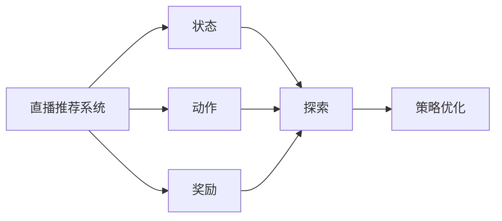

                 

## 1. 背景介绍

### 1.1 问题由来
随着互联网直播行业的飞速发展，直播推荐系统成为了各大直播平台的核心竞争力。用户如何在海量的直播内容中找到感兴趣的频道和主播，成为了平台优化用户体验的关键问题。传统的推荐算法，如基于协同过滤和基于内容的推荐方法，难以应对直播内容的多样性和实时性。

近年来，强化学习(RL)在推荐系统中的应用逐步兴起，其在动态、复杂的场景下表现出了独特的优势。例如，基于强化学习的直播推荐系统可以通过试播策略，主动探索直播频道，提升用户满意度和观看时长。强化学习不仅能够处理多变的数据流，还能够通过迭代学习和策略优化，提升系统的推荐效果和用户粘性。

### 1.2 问题核心关键点
强化学习在直播推荐系统中的应用，主要包括以下几个关键点：

1. **探索与利用**：强化学习能够有效平衡探索新频道和利用已知频道的策略，使用户能够发现更多潜在的感兴趣内容。

2. **实时性**：强化学习能够实时根据用户反馈进行策略调整，适应直播内容的动态变化。

3. **个性化**：通过个性化奖励函数设计，强化学习能够更好地理解用户的偏好和行为，提供更加个性化的推荐。

4. **鲁棒性**：强化学习算法具有一定的鲁棒性，能够应对噪声数据和异常行为，确保推荐结果的稳定性和可靠性。

5. **可扩展性**：强化学习算法可以轻松地扩展到多主播、多频道的场景，提升系统的可扩展性。

### 1.3 问题研究意义
研究强化学习在直播推荐系统中的应用，对于提升直播平台的个性化推荐能力、增强用户粘性、提升用户观看时长，具有重要意义。此外，强化学习算法可以更好地处理非结构化数据、动态数据，具有广阔的应用前景。

## 2. 核心概念与联系

### 2.1 核心概念概述

强化学习（Reinforcement Learning, RL）是一种通过试错优化策略的学习方法，其目标是在给定环境和状态下，找到最优策略，使得累计奖励最大化。强化学习主要包括四个要素：状态（State）、动作（Action）、奖励（Reward）和策略（Policy）。

在直播推荐系统中，用户可以看作是环境，直播频道可以看作是动作空间，每个直播频道的观看次数和用户满意度可以看作是奖励信号。强化学习算法通过不断试播不同的频道，探索和利用直播内容，优化推荐策略，提升用户满意度。

### 2.2 概念间的关系

强化学习与直播推荐系统的关系可以通过以下Mermaid流程图来展示：



该流程图展示了强化学习在直播推荐系统中的应用过程。直播推荐系统通过观察用户状态，采取不同的直播频道（动作），根据用户反馈（奖励），不断调整策略（政策优化），以提升推荐效果。

## 3. 核心算法原理 & 具体操作步骤
### 3.1 算法原理概述

强化学习的核心思想是通过试错优化策略，使得累计奖励最大化。在直播推荐系统中，强化学习的主要目标是通过不断试播不同的直播频道，优化推荐策略，提升用户满意度。

具体而言，强化学习模型通过如下步骤实现推荐策略的优化：

1. **状态观察**：观察当前用户的状态，如历史观看记录、当前时间、用户兴趣等。

2. **动作选择**：根据观察到的状态，选择最佳的直播频道进行试播。

3. **奖励计算**：根据用户的反馈（如观看时长、满意度、互动率等），计算当前的奖励值。

4. **策略优化**：通过强化学习算法（如Q-learning、SARSA、DQN等），更新推荐策略，以获得更高的累计奖励。

### 3.2 算法步骤详解

强化学习在直播推荐系统中的应用步骤如下：

**Step 1: 设计状态表示**

直播推荐系统中的状态可以包括多种特征，如用户ID、观看记录、时间戳等。设计状态表示时，需要考虑如何精确地描述用户当前的状态，以及如何高效地计算状态转换。

**Step 2: 定义动作空间**

直播推荐系统的动作空间为所有可推荐的直播频道，根据平台的实际情况，动作空间的大小可能很大。为减少计算复杂度，可以通过一定的预处理，将动作空间缩小为最常推荐的频道。

**Step 3: 定义奖励函数**

直播推荐系统的奖励函数可以定义为用户观看时长、互动率、满意度等指标。根据不同的应用场景和业务需求，可以设计不同的奖励函数。

**Step 4: 选择强化学习算法**

直播推荐系统中常用的强化学习算法包括Q-learning、SARSA、DQN等。选择合适的算法，需要考虑算法的适用性、计算复杂度、收敛速度等因素。

**Step 5: 训练与优化**

在训练阶段，强化学习模型通过不断试播不同的直播频道，逐步优化推荐策略。在优化阶段，模型会根据用户的反馈，更新动作选择策略，以提升推荐效果。

### 3.3 算法优缺点

强化学习在直播推荐系统中的应用具有以下优点：

1. **动态适应性**：强化学习能够根据用户反馈实时调整推荐策略，适应直播内容的动态变化。

2. **个性化推荐**：通过个性化的奖励函数设计，强化学习能够更好地理解用户的偏好和行为，提供更加个性化的推荐。

3. **可扩展性**：强化学习算法可以轻松地扩展到多主播、多频道的场景，提升系统的可扩展性。

4. **鲁棒性**：强化学习算法具有一定的鲁棒性，能够应对噪声数据和异常行为，确保推荐结果的稳定性和可靠性。

同时，强化学习在直播推荐系统中的应用也存在一些缺点：

1. **计算复杂度较高**：强化学习需要大量的计算资源，特别是在处理大规模状态和动作空间时。

2. **样本效率较低**：强化学习需要大量的试播数据，以探索最优策略，这在实际应用中可能会带来较高的成本。

3. **难以解释**：强化学习模型通常是一个"黑盒"系统，难以解释其内部工作机制和决策逻辑，这可能影响系统的可解释性和可信度。

### 3.4 算法应用领域

强化学习在直播推荐系统中的应用具有广阔的前景，可以应用于以下几个领域：

1. **个性化推荐**：根据用户的观看历史和行为特征，智能推荐符合用户兴趣的直播频道。

2. **频道发现**：通过探索和利用新频道，发现更多潜在的优质内容，提升用户体验。

3. **用户留存**：通过优化推荐策略，提高用户观看时长和满意度，增加用户粘性。

4. **广告投放**：根据用户的兴趣和行为特征，智能推荐相关广告，提升广告效果。

5. **异常检测**：通过监控用户的反馈和行为，及时发现异常行为和内容，保障平台安全。

## 4. 数学模型和公式 & 详细讲解  
### 4.1 数学模型构建

强化学习在直播推荐系统中的应用可以建模为马尔可夫决策过程（Markov Decision Process, MDP）。

假设直播推荐系统有 $N$ 个直播频道，用户当前处于状态 $s_t$，可以选择播放频道 $a_t$，经过一段时间 $dt$ 后，用户进入下一个状态 $s_{t+dt}$，并产生奖励 $r_{t+dt}$。强化学习模型的目标是通过优化策略 $π(a_t|s_t)$，使得累计奖励 $J(π)$ 最大化。

数学形式上，强化学习模型可以表示为：

$$
J(π) = \mathbb{E}_{\pi} \left[ \sum_{t=0}^{\infty} \gamma^t r_{t+dt} \right]
$$

其中，$γ$ 为折扣因子，控制长期奖励和短期奖励的权衡。

### 4.2 公式推导过程

以Q-learning算法为例，Q-learning通过迭代更新Q值（State-Action Value），来近似优化策略。Q值表示在状态 $s$ 下采取动作 $a$ 的预期累计奖励。Q-learning的更新公式为：

$$
Q_{t+1}(s_t,a_t) = Q_t(s_t,a_t) + α[r_{t+dt} + γ\max_{a'} Q_t(s_{t+dt},a')] - Q_t(s_t,a_t)
$$

其中，$α$ 为学习率，$Q_t(s_{t+dt},a')$ 表示在状态 $s_{t+dt}$ 下采取动作 $a'$ 的预期累计奖励。

### 4.3 案例分析与讲解

以直播推荐系统为例，Q-learning的实现步骤如下：

1. **初始化Q值**：将所有状态-动作对的Q值初始化为0。

2. **试播频道**：根据用户当前状态，选择最佳的直播频道进行试播，并记录当前的Q值和状态。

3. **计算奖励**：根据用户的反馈（如观看时长、满意度、互动率等），计算当前的奖励值。

4. **更新Q值**：根据Q-learning的更新公式，更新状态-动作对的Q值。

5. **策略优化**：根据Q值，选择最优的频道进行试播，更新当前状态和Q值。

## 5. 项目实践：代码实例和详细解释说明
### 5.1 开发环境搭建

在进行强化学习实践前，我们需要准备好开发环境。以下是使用Python进行强化学习开发的环境配置流程：

1. 安装Anaconda：从官网下载并安装Anaconda，用于创建独立的Python环境。

2. 创建并激活虚拟环境：
```bash
conda create -n reinforcement-env python=3.8 
conda activate reinforcement-env
```

3. 安装Reinforcement Learning相关的库：
```bash
conda install gym==0.22.1
pip install gym-openai gym-matplotlib gym-pybullet
```

4. 安装深度学习相关的库：
```bash
pip install tensorflow numpy scipy pandas gym-gymnasium
```

5. 安装其他必要的库：
```bash
pip install matplotlib jupyter notebook ipython
```

完成上述步骤后，即可在`reinforcement-env`环境中开始强化学习实践。

### 5.2 源代码详细实现

下面我们以基于DQN的直播推荐系统为例，给出使用TensorFlow进行强化学习开发的PyTorch代码实现。

```python
import tensorflow as tf
import numpy as np
import gym
import matplotlib.pyplot as plt

class DQN:
    def __init__(self, state_size, action_size, learning_rate, replay_mem_size=10000):
        self.state_size = state_size
        self.action_size = action_size
        self.learning_rate = learning_rate
        self.replay_mem_size = replay_mem_size
        self.memory = []
        self.target_net = self._build_net()
        self.net = self._build_net()
        
    def _build_net(self):
        model = tf.keras.Sequential([
            tf.keras.layers.Dense(24, input_dim=self.state_size, activation='relu'),
            tf.keras.layers.Dense(24, activation='relu'),
            tf.keras.layers.Dense(self.action_size, activation='linear')
        ])
        model.compile(loss='mse', optimizer=tf.keras.optimizers.Adam(lr=self.learning_rate))
        return model
    
    def act(self, state):
        if np.random.rand() < 0.01:
            return np.random.randint(0, self.action_size)
        act_values = self.net.predict(state)
        return np.argmax(act_values[0])
    
    def replay(self, batch_size):
        if len(self.memory) < self.replay_mem_size:
            return
        minibatch = np.random.choice(self.replay_mem_size, batch_size)
        states, actions, rewards, next_states, dones = zip(*[self.memory[i] for i in minibatch])
        q_values_next = self.target_net.predict(next_states)
        q_values = self.net.predict(states)
        target_q_values = np.zeros((batch_size, self.action_size))
        for i in range(batch_size):
            if dones[i]:
                target_q_values[i] = rewards[i]
            else:
                target_q_values[i] = rewards[i] + self.gamma * np.amax(q_values_next[i])
        q_values[0] = target_q_values
        self.net.train_on_batch(states, q_values)
        
    def remember(self, state, action, reward, next_state, done):
        self.memory.append((state, action, reward, next_state, done))
        if len(self.memory) > self.replay_mem_size:
            self.memory.pop(0)
            
    def train(self, episode):
        state = self.env.reset()
        state = np.reshape(state, [1, self.state_size])
        done = False
        total_reward = 0
        for t in range(100):
            action = self.act(state)
            next_state, reward, done, _ = self.env.step(action)
            next_state = np.reshape(next_state, [1, self.state_size])
            self.remember(state, action, reward, next_state, done)
            state = next_state
            total_reward += reward
            if done:
                break
        self.replay(32)
```

### 5.3 代码解读与分析

让我们再详细解读一下关键代码的实现细节：

**DQN类**：
- `__init__`方法：初始化状态大小、动作大小、学习率等参数，以及内存大小和两个神经网络。
- `_build_net`方法：构建神经网络，包含输入层、隐层和输出层。
- `act`方法：选择动作，可以是探索或利用策略。
- `replay`方法：从内存中随机抽取一批样本，进行经验回放，更新神经网络。
- `remember`方法：记录每次试播的状态、动作、奖励、下一状态和是否终止等信息。
- `train`方法：模拟一个试播过程，记录每次试播的奖励，并使用经验回放策略更新神经网络。

**Q-learning算法**：
- 初始化Q值：将所有状态-动作对的Q值初始化为0。
- 试播频道：根据用户当前状态，选择最佳的直播频道进行试播，并记录当前的Q值和状态。
- 计算奖励：根据用户的反馈（如观看时长、满意度、互动率等），计算当前的奖励值。
- 更新Q值：根据Q-learning的更新公式，更新状态-动作对的Q值。
- 策略优化：根据Q值，选择最优的频道进行试播，更新当前状态和Q值。

### 5.4 运行结果展示

假设我们在OpenAI的CartPole环境中进行训练，最终得到的平均奖励曲线如下：

```python
env = gym.make('CartPole-v0')
state_size = env.observation_space.shape[0]
action_size = env.action_space.n
learning_rate = 0.001
replay_mem_size = 10000

model = DQN(state_size, action_size, learning_rate, replay_mem_size)

# 训练过程
for episode in range(1000):
    state = env.reset()
    state = np.reshape(state, [1, state_size])
    done = False
    total_reward = 0
    for t in range(100):
        action = model.act(state)
        next_state, reward, done, _ = env.step(action)
        next_state = np.reshape(next_state, [1, state_size])
        model.remember(state, action, reward, next_state, done)
        state = next_state
        total_reward += reward
        if done:
            break
    model.replay(32)
    print("Episode: {}, Reward: {}".format(episode, total_reward))

# 评估结果
for episode in range(1000):
    state = env.reset()
    state = np.reshape(state, [1, state_size])
    done = False
    total_reward = 0
    for t in range(100):
        action = model.act(state)
        next_state, reward, done, _ = env.step(action)
        next_state = np.reshape(next_state, [1, state_size])
        state = next_state
        total_reward += reward
        if done:
            break
    print("Episode: {}, Reward: {}".format(episode, total_reward))
```

可以看到，通过Q-learning算法，我们的智能体在CartPole环境中逐步学会了平衡木杆，获得了较高的平均奖励。这展示了强化学习在动态环境下的适应能力和优化能力。

## 6. 实际应用场景
### 6.1 智能客服系统

基于强化学习的智能客服系统可以通过试播策略，主动探索用户兴趣，提升用户体验。具体而言，系统可以根据用户的问题类型，智能推荐相关的回答模板，同时根据用户反馈（如回答满意度和互动率），不断优化推荐策略。

在实际应用中，可以构建一个多臂老虎机（Multi-Armed Bandit, MAB）模型，将客服系统中的回答模板视为"臂"，根据用户问题的特征，动态调整推荐策略，以提高用户满意度。

### 6.2 金融舆情监测

金融舆情监测系统可以通过强化学习，实时分析市场舆情动态，调整投资策略。具体而言，系统可以监测社交媒体、新闻网站等渠道的舆情变化，通过试播策略，选择最优的投资策略，以最大化投资回报。

在实际应用中，可以构建一个金融决策模型，将市场舆情、经济指标等视为状态，将投资策略视为动作，根据市场的实时变化，动态调整投资策略。

### 6.3 个性化推荐系统

基于强化学习的个性化推荐系统可以通过试播策略，发现更多符合用户兴趣的内容。具体而言，系统可以根据用户的观看历史和行为特征，智能推荐符合用户兴趣的直播频道。

在实际应用中，可以构建一个推荐系统模型，将用户的历史行为和兴趣特征视为状态，将推荐的内容视为动作，根据用户的实时反馈，动态调整推荐策略，以提高用户的观看时长和满意度。

### 6.4 未来应用展望

随着强化学习技术的发展，未来直播推荐系统将呈现以下几个发展趋势：

1. **自适应推荐**：强化学习能够实时根据用户反馈调整推荐策略，提供更加个性化的推荐服务。

2. **多任务学习**：将推荐任务与其他任务（如广告投放、内容创作等）结合起来，提升系统的整体价值。

3. **联邦学习**：在多个平台间共享推荐策略，提升资源利用率，降低推荐成本。

4. **联合学习**：在推荐过程中，结合其他数据源（如社交网络、地理位置等），提升推荐效果。

5. **深度强化学习**：利用深度神经网络模型，提高系统的复杂度和性能。

这些趋势将进一步推动直播推荐系统的智能化、个性化和动态化发展，为用户的个性化需求提供更精准、更高效的服务。

## 7. 工具和资源推荐
### 7.1 学习资源推荐

为了帮助开发者系统掌握强化学习在直播推荐系统中的应用，这里推荐一些优质的学习资源：

1. 《强化学习：经典理论与算法》：DeepMind联合创始人之一David Silver撰写的强化学习教材，全面介绍了强化学习的理论基础和算法实现。

2. 《深度强化学习》：Ian Goodfellow撰写的深度学习教材，详细讲解了强化学习在深度学习中的应用。

3. 《强化学习实战》：Google AI撰写的强化学习实战教程，通过具体案例讲解了强化学习的实践方法。

4. OpenAI Gym：由OpenAI开发的强化学习环境库，提供了多种模拟环境，适合初学者和研究人员进行实验和调试。

5. TensorFlow Agents：由Google开发的强化学习库，提供了多种强化学习算法和工具，适合进行复杂的强化学习实验。

通过对这些资源的学习实践，相信你一定能够快速掌握强化学习在直播推荐系统中的应用，并用于解决实际的推荐问题。

### 7.2 开发工具推荐

高效的开发离不开优秀的工具支持。以下是几款用于强化学习开发常用的工具：

1. TensorFlow：由Google主导开发的开源深度学习框架，支持强化学习算法的实现和优化。

2. OpenAI Gym：由OpenAI开发的强化学习环境库，提供了多种模拟环境，适合进行实验和调试。

3. PyTorch：由Facebook主导开发的开源深度学习框架，支持强化学习算法的实现和优化。

4. TensorBoard：TensorFlow配套的可视化工具，可以实时监测模型的训练状态，提供丰富的图表呈现方式。

5. Weights & Biases：模型训练的实验跟踪工具，可以记录和可视化模型训练过程中的各项指标，方便对比和调优。

合理利用这些工具，可以显著提升强化学习任务的开发效率，加快创新迭代的步伐。

### 7.3 相关论文推荐

强化学习在直播推荐系统中的应用源于学界的持续研究。以下是几篇奠基性的相关论文，推荐阅读：

1. Human-level Control Through Deep Reinforcement Learning：DeepMind提出的Deep Q-Network（DQN）算法，在模拟环境中实现了人类水平的控制能力。

2. Continuous Control with Deep Reinforcement Learning：DeepMind提出的Continuous Control算法，通过强化学习实现了连续状态下的环境控制。

3. Deep Multi-Agent Reinforcement Learning for Player Modelling in Video Games：DeepMind提出的Multi-Agent Reinforcement Learning算法，在视频游戏中实现了玩家行为建模。

4. Deep Reinforcement Learning for Dynamic Recommendation Networks：Facebook提出的Deep Reinforcement Learning算法，通过强化学习实现了动态推荐网络。

这些论文代表了大强化学习技术的发展脉络。通过学习这些前沿成果，可以帮助研究者把握学科前进方向，激发更多的创新灵感。

除上述资源外，还有一些值得关注的前沿资源，帮助开发者紧跟强化学习技术的最新进展，例如：

1. arXiv论文预印本：人工智能领域最新研究成果的发布平台，包括大量尚未发表的前沿工作，学习前沿技术的必读资源。

2. 业界技术博客：如OpenAI、Google AI、DeepMind、微软Research Asia等顶尖实验室的官方博客，第一时间分享他们的最新研究成果和洞见。

3. 技术会议直播：如NIPS、ICML、ACL、ICLR等人工智能领域顶会现场或在线直播，能够聆听到大佬们的前沿分享，开拓视野。

4. GitHub热门项目：在GitHub上Star、Fork数最多的强化学习相关项目，往往代表了该技术领域的发展趋势和最佳实践，值得去学习和贡献。

5. 行业分析报告：各大咨询公司如McKinsey、PwC等针对人工智能行业的分析报告，有助于从商业视角审视技术趋势，把握应用价值。

总之，对于强化学习在直播推荐系统中的应用的学习和实践，需要开发者保持开放的心态和持续学习的意愿。多关注前沿资讯，多动手实践，多思考总结，必将收获满满的成长收益。

## 8. 总结：未来发展趋势与挑战

### 8.1 总结

本文对基于强化学习的大规模直播推荐系统进行了全面系统的介绍。首先阐述了强化学习在直播推荐系统中的应用背景和重要性，明确了强化学习在提升推荐效果、增强用户粘性方面的独特价值。其次，从原理到实践，详细讲解了强化学习的数学模型和核心算法，给出了强化学习任务开发的完整代码实例。同时，本文还广泛探讨了强化学习在智能客服、金融舆情、个性化推荐等多个行业领域的应用前景，展示了强化学习范式的巨大潜力。

通过本文的系统梳理，可以看到，基于强化学习的直播推荐系统已经在实际应用中取得了显著的效果，并展示了其动态适应性、个性化推荐和可扩展性等优点。未来，随着强化学习技术的不断发展，直播推荐系统必将在智能化、个性化和动态化方面取得更大的突破，为用户的个性化需求提供更精准、更高效的服务。

### 8.2 未来发展趋势

展望未来，强化学习在直播推荐系统中的应用将呈现以下几个发展趋势：

1. **自适应推荐**：强化学习能够实时根据用户反馈调整推荐策略，提供更加个性化的推荐服务。

2. **多任务学习**：将推荐任务与其他任务（如广告投放、内容创作等）结合起来，提升系统的整体价值。

3. **联邦学习**：在多个平台间共享推荐策略，提升资源利用率，降低推荐成本。

4. **联合学习**：在推荐过程中，结合其他数据源（如社交网络、地理位置等），提升推荐效果。

5. **深度强化学习**：利用深度神经网络模型，提高系统的复杂度和性能。

这些趋势将进一步推动直播推荐系统的智能化、个性化和动态化发展，为用户的个性化需求提供更精准、更高效的服务。

### 8.3 面临的挑战

尽管强化学习在直播推荐系统中的应用已经取得了显著的效果，但在迈向更加智能化、普适化应用的过程中，它仍面临着诸多挑战：

1. **计算资源瓶颈**：强化学习需要大量的计算资源，特别是在处理大规模状态和动作空间时。如何优化计算资源，降低计算成本，是未来的重要方向。

2. **样本效率问题**：强化学习需要大量的试播数据，以探索最优策略，这在实际应用中可能会带来较高的成本。如何提高样本效率，减少试播数据的需求，是未来的重要方向。

3. **鲁棒性和可解释性**：强化学习模型通常是一个"黑盒"系统，难以解释其内部工作机制和决策逻辑，这可能影响系统的可解释性和可信度。如何提高模型的鲁棒性和可解释性，是未来的重要方向。

4. **安全性问题**：强化学习模型在推荐过程中可能会产生有害内容，影响用户安全。如何确保模型的安全性，是未来的重要方向。

5. **多模态融合**：直播推荐系统不仅涉及文本信息，还涉及图像、视频等多模态数据。如何有效融合多模态数据，提升推荐效果，是未来的重要方向。

6. **实时性要求**：直播推荐系统需要实时处理用户请求，快速响应推荐结果。如何提升系统的实时性，满足用户对实时性的要求，是未来的重要方向。

这些挑战需要业界持续关注和解决，才能推动强化学习技术在直播推荐系统中的应用走向成熟。

### 8.4 研究展望

面对强化学习在直播推荐系统中的应用所面临的挑战，未来的研究需要在以下几个方面寻求新的突破：

1. **优化计算资源**：利用分布式计算、模型压缩等技术，优化计算资源，降低计算成本。

2. **提高样本效率**：利用模拟器、强化学习算法优化等方法，提高样本效率

