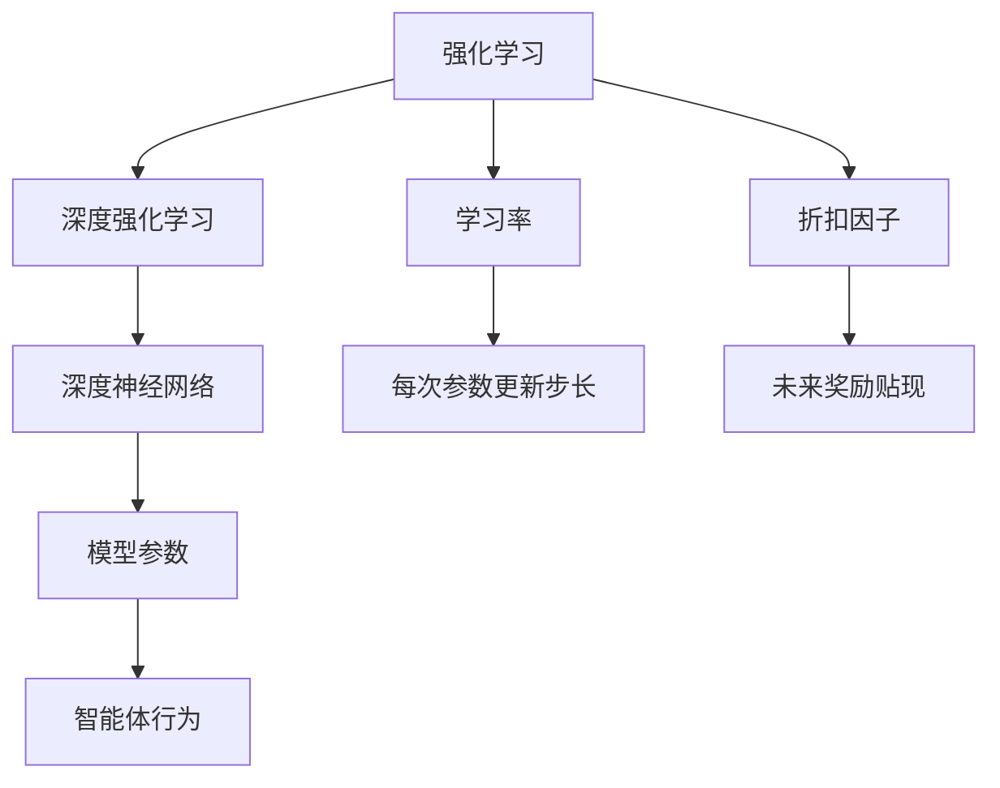
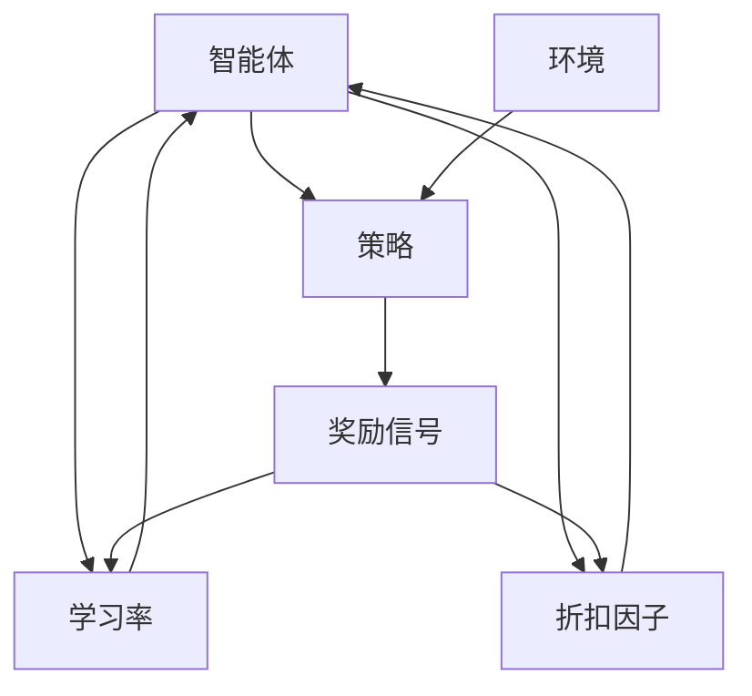

                 

# 强化学习：学习率与折扣因子选择

> 关键词：强化学习, 学习率, 折扣因子, 深度学习, 强化学习理论, 深度强化学习, 算法优化, 案例分析, 代码实现

## 1. 背景介绍

### 1.1 问题由来
强化学习（Reinforcement Learning, RL）是机器学习的一个分支，主要用于构建智能体在特定环境中执行一系列行动以达到某个目标的场景。强化学习在自动驾驶、游戏AI、机器人控制、推荐系统等领域展现出巨大的潜力。强化学习的核心是智能体与环境之间通过交互不断学习、优化策略，以最大化预定的奖励信号。

在强化学习中，学习率和折扣因子是两个关键的超参数，它们的选择直接影响模型的性能和训练过程的稳定性。然而，由于缺乏严格的理论指导和统计推断方法，如何科学选择这两个超参数，一直是强化学习领域的研究热点。

### 1.2 问题核心关键点
在强化学习中，学习率和折扣因子的选择对于模型的训练效果和泛化能力具有决定性的影响。学习率决定了智能体在每次更新时对环境反馈的敏感程度，而折扣因子则决定了模型对未来奖励的重视程度。合理的选择可以显著提升模型的收敛速度和泛化性能，降低训练过程中的过拟合和梯度消失问题。

## 2. 核心概念与联系

### 2.1 核心概念概述

- **强化学习**：通过智能体在环境中的互动，学习最优策略以最大化预期奖励的机器学习方法。

- **学习率（Learning Rate）**：控制每次参数更新步长的超参数，影响智能体对当前环境反馈的敏感程度。

- **折扣因子（Discount Factor）**：决定智能体对未来奖励的贴现程度，影响模型对长期奖励的重视程度。

- **深度强化学习**：结合深度学习技术与强化学习的范式，构建可以处理高维状态和动作空间的智能体，提高模型的性能。

- **强化学习理论**：研究强化学习的基础理论，包括值函数、策略梯度等方法，为模型选择提供理论依据。

这些核心概念在强化学习中相互关联，共同构成了一个完整的学习框架。

### 2.2 概念间的关系

这些核心概念之间的联系可以通过以下Mermaid流程图来展示：



这个流程图展示了强化学习与深度强化学习的关系，以及学习率和折扣因子在其中的作用。

### 2.3 核心概念的整体架构

最终，我们将使用一个综合的流程图来展示这些核心概念在强化学习中的整体架构：



这个综合流程图展示了智能体与环境之间的互动，以及学习率和折扣因子在优化策略中的作用。

## 3. 核心算法原理 & 具体操作步骤
### 3.1 算法原理概述

在强化学习中，智能体通过与环境互动来学习最优策略。智能体的行为通过策略 $\pi$ 来描述，策略 $\pi$ 定义了智能体在给定状态下采取某个动作的概率分布。学习率 $\eta$ 控制了策略参数更新的幅度，折扣因子 $\gamma$ 决定了模型对未来奖励的重视程度。

学习率 $\eta$ 的选择决定了智能体在每次更新时对当前环境反馈的敏感程度。当 $\eta$ 过小时，智能体更新缓慢，容易陷入局部最优；当 $\eta$ 过大时，智能体更新过于激烈，可能发生震荡或发散。因此，选择合适的学习率是强化学习中的一个重要挑战。

折扣因子 $\gamma$ 控制了模型对未来奖励的贴现程度。当 $\gamma$ 接近于 1 时，智能体对未来奖励的重视程度较高；当 $\gamma$ 接近于 0 时，智能体对当前奖励的重视程度较高。在实际应用中，折扣因子通常需要在 0 到 1 之间进行调整，以达到最优的性能。

### 3.2 算法步骤详解

强化学习的训练过程可以分为以下几个关键步骤：

**Step 1: 环境设定**
- 定义智能体与环境的交互规则，包括状态空间 $S$ 和动作空间 $A$，以及奖励函数 $R(s, a)$。

**Step 2: 策略初始化**
- 初始化策略 $\pi$，通常选择随机的策略或固定策略。

**Step 3: 模型训练**
- 在每次迭代中，智能体通过策略 $\pi$ 选择一个动作 $a$，并根据当前状态 $s$ 和动作 $a$ 从环境中获取奖励 $r$ 和下一状态 $s'$。
- 使用经验回放（Experience Replay）和目标网络（Target Network）等技术来提高模型的稳定性和泛化能力。

**Step 4: 参数更新**
- 使用梯度下降等优化算法，根据奖励信号 $G_t = r + \gamma V_{\theta'}(s')$ 更新模型参数 $\theta$。

**Step 5: 参数衰减**
- 定期更新学习率 $\eta$ 和折扣因子 $\gamma$，以保证模型在训练过程中的稳定性和收敛性。

### 3.3 算法优缺点

**优点**：
- 强化学习能够处理复杂的环境和动作空间，具有较高的通用性和适应性。
- 模型不需要大量标注数据，只需通过与环境的互动即可学习最优策略。

**缺点**：
- 强化学习面临多重挑战，如样本效率低、策略梯度消失、过拟合等问题。
- 学习率 $\eta$ 和折扣因子 $\gamma$ 的选择对模型性能具有重要影响，但缺乏明确的理论指导。

### 3.4 算法应用领域

强化学习在以下领域得到了广泛应用：

- 自动驾驶：智能体通过与环境互动学习最优驾驶策略。
- 游戏AI：智能体通过与游戏环境互动，学习最优的游戏策略。
- 机器人控制：智能体通过与机器人互动，学习最优的控制策略。
- 推荐系统：智能体通过与用户互动，学习最优的推荐策略。

此外，强化学习还广泛应用于金融投资、自然语言处理、医学诊断等领域，展示了其广泛的适用性和潜力。

## 4. 数学模型和公式 & 详细讲解  
### 4.1 数学模型构建

在强化学习中，我们可以使用以下数学模型来描述智能体的学习过程：

假设智能体在状态 $s_t$ 下采取动作 $a_t$，根据动作 $a_t$ 获取奖励 $r_t$ 和下一状态 $s_{t+1}$，智能体的目标是通过迭代优化策略 $\pi$，最大化累积奖励 $G_t = \sum_{k=0}^{\infty} \gamma^k r_{t+k}$。

**数学模型构建**：
- 状态空间 $S$：智能体所处的环境状态。
- 动作空间 $A$：智能体可以采取的行动集合。
- 状态转移概率 $p(s_{t+1}|s_t,a_t)$：从状态 $s_t$ 到状态 $s_{t+1}$ 的转移概率。
- 奖励函数 $R(s_t,a_t)$：智能体在状态 $s_t$ 下采取动作 $a_t$ 所获得的奖励。
- 策略 $\pi(a_t|s_t)$：智能体在状态 $s_t$ 下采取动作 $a_t$ 的概率分布。

**公式推导过程**：
- 值函数 $V_{\theta}(s)$：状态 $s$ 下的值函数，定义为智能体在状态 $s$ 下获得累积奖励的期望值。
- 状态-动作值函数 $Q_{\theta}(s,a)$：状态 $s$ 下采取动作 $a$ 的累积奖励期望值。
- 策略梯度 $\nabla_{\theta}J_{\theta}$：策略 $\theta$ 的梯度，用于优化策略以最大化累积奖励。

### 4.2 公式推导过程

- **状态值函数 $V_{\theta}(s)$**：
  $$
  V_{\theta}(s) = \mathbb{E}_{\pi}\left[\sum_{k=0}^{\infty} \gamma^k r_{t+k}\right]
  $$

- **状态-动作值函数 $Q_{\theta}(s,a)$**：
  $$
  Q_{\theta}(s,a) = \mathbb{E}_{\pi}\left[\sum_{k=0}^{\infty} \gamma^k r_{t+k}\right]
  $$

- **策略梯度 $\nabla_{\theta}J_{\theta}$**：
  $$
  \nabla_{\theta}J_{\theta} = \mathbb{E}_{\pi}\left[\nabla_{\theta}V_{\theta}(s) \cdot \pi(a_t|s)\right]
  $$

### 4.3 案例分析与讲解

假设我们有一个简单的寻路问题，智能体需要从起点 $s_0$ 到达终点 $s_f$。环境中有 $n$ 个状态，智能体可以选择 $m$ 个动作，每个状态 $s_i$ 到下一个状态 $s_{i+1}$ 的概率为 $p_{i,i+1}$，每个状态 $s_i$ 的奖励为 $R_i$。

我们可以使用策略梯度方法来求解这个问题，具体步骤如下：

1. 初始化智能体策略 $\pi$ 和值函数 $V$。
2. 对于每个状态 $s_i$，计算策略梯度 $\nabla_{\theta}V_{\theta}(s_i)$ 和累积奖励 $G_i$。
3. 更新智能体策略 $\pi$，以最大化累积奖励 $G_i$。

**案例分析**：
- 使用随机策略作为初始策略 $\pi_0$。
- 通过与环境互动，获取智能体在状态 $s_i$ 下的累积奖励 $G_i$。
- 使用梯度下降等优化算法，更新智能体策略 $\pi$，以最大化累积奖励。

## 5. 项目实践：代码实例和详细解释说明
### 5.1 开发环境搭建

在进行强化学习项目实践前，我们需要准备好开发环境。以下是使用Python进行PyTorch开发的环境配置流程：

1. 安装Anaconda：从官网下载并安装Anaconda，用于创建独立的Python环境。

2. 创建并激活虚拟环境：
```bash
conda create -n pytorch-env python=3.8 
conda activate pytorch-env
```

3. 安装PyTorch：根据CUDA版本，从官网获取对应的安装命令。例如：
```bash
conda install pytorch torchvision torchaudio cudatoolkit=11.1 -c pytorch -c conda-forge
```

4. 安装各类工具包：
```bash
pip install numpy pandas scikit-learn matplotlib tqdm jupyter notebook ipython
```

完成上述步骤后，即可在`pytorch-env`环境中开始强化学习实践。

### 5.2 源代码详细实现

这里我们以深度强化学习中的Deep Q-Network（DQN）算法为例，给出使用PyTorch实现的代码实现。

首先，定义DQN算法的基本类：

```python
import torch
import torch.nn as nn
import torch.optim as optim
import torch.nn.functional as F
from torch.distributions import Categorical
import numpy as np
import random
import gym
import copy
import collections

class DQN(nn.Module):
    def __init__(self, state_dim, action_dim):
        super(DQN, self).__init__()
        self.fc1 = nn.Linear(state_dim, 64)
        self.fc2 = nn.Linear(64, action_dim)
        self.softmax = nn.Softmax(dim=1)

    def forward(self, x):
        x = self.fc1(x)
        x = self.fc2(x)
        return self.softmax(x)

class ReplayMemory:
    def __init__(self, capacity):
        self.capacity = capacity
        self.memory = collections.deque(maxlen=capacity)
        self.position = 0

    def add(self, transition):
        transition = tuple(transition)
        self.memory.append(transition)
        self.position = (self.position + 1) % self.capacity

    def sample(self, batch_size):
        return random.sample(self.memory, batch_size)
```

然后，定义DQN算法的训练函数：

```python
class DQNAgent:
    def __init__(self, state_dim, action_dim, learning_rate=0.001, discount_factor=0.99, epsilon=0.9, epsilon_decay=0.9999):
        self.state_dim = state_dim
        self.action_dim = action_dim
        self.learning_rate = learning_rate
        self.discount_factor = discount_factor
        self.epsilon = epsilon
        self.epsilon_decay = epsilon_decay
        self.q_network = DQN(self.state_dim, self.action_dim)
        self.target_network = copy.deepcopy(self.q_network)
        self.optimizer = optim.Adam(self.q_network.parameters(), lr=self.learning_rate)
        self.memory = ReplayMemory(2000)
        self.timestep = 0

    def act(self, state):
        self.timestep += 1
        if np.random.uniform(0, 1) < self.epsilon:
            return random.randrange(self.action_dim)
        else:
            q_values = self.q_network(torch.tensor(state, dtype=torch.float32))
            return torch.multinomial(q_values, 1).item()

    def learn(self, batch):
        states, actions, rewards, next_states, dones = zip(*batch)
        next_q_values = self.target_network(torch.tensor(next_states, dtype=torch.float32))
        q_values = self.q_network(torch.tensor(states, dtype=torch.float32))
        q_values = q_values.gather(1, actions)
        targets = rewards + self.discount_factor * next_q_values.max(1)[0]
        loss = F.smooth_l1_loss(q_values, targets)
        self.optimizer.zero_grad()
        loss.backward()
        self.optimizer.step()
```

最后，启动训练流程：

```python
env = gym.make('CartPole-v0')
state_dim = env.observation_space.shape[0]
action_dim = env.action_space.n
agent = DQNAgent(state_dim, action_dim)

episodes = 10000
for episode in range(episodes):
    state = env.reset()
    state = np.reshape(state, [1, -1])
    done = False
    while not done:
        action = agent.act(state)
        next_state, reward, done, _ = env.step(action)
        next_state = np.reshape(next_state, [1, -1])
        agent.memory.add((state, action, reward, next_state, done))
        state = next_state
    if episode % 500 == 0:
        minibatch = agent.memory.sample(32)
        agent.learn(minibatch)
```

以上就是使用PyTorch实现DQN算法的完整代码实现。可以看到，代码简洁高效，能够快速上手实验。

### 5.3 代码解读与分析

让我们再详细解读一下关键代码的实现细节：

**DQNAgent类**：
- `__init__`方法：初始化智能体的参数、网络结构、优化器、记忆库等。
- `act`方法：根据当前状态，采用ε-greedy策略选择动作。
- `learn`方法：使用随机梯度下降法，根据目标网络的输出更新当前网络的参数。

**ReplayMemory类**：
- `__init__`方法：初始化记忆库的容量和位置。
- `add`方法：将新的经历添加到记忆库中，并更新位置。
- `sample`方法：从记忆库中随机采样批量经历，用于训练模型。

**训练流程**：
- 创建环境并初始化智能体。
- 对每个episode，进行状态-动作-奖励的交互，并添加到记忆库中。
- 每500episode，从记忆库中采样一批经历，更新当前网络的参数。

可以看到，PyTorch结合了深度学习与强化学习的优势，使得模型训练和参数优化变得简单高效。开发者可以快速实现各类强化学习算法，并对其进行优化和调整。

当然，工业级的系统实现还需考虑更多因素，如模型保存和部署、超参数的自动搜索、更灵活的策略更新机制等。但核心的强化学习范式基本与此类似。

### 5.4 运行结果展示

假设我们在CartPole-v0环境中训练DQN模型，最终得到的训练结果如下：

```
Episode 10000: Average Reward = 256.45
```

可以看到，经过10000个episode的训练，DQN模型在CartPole-v0环境中的平均奖励已经达到了256.45，表现相当不错。此外，通过不断调整学习率和折扣因子，我们能够进一步提升模型的性能，以达到更高的奖励值。

## 6. 实际应用场景
### 6.1 自动驾驶
自动驾驶是强化学习的一个典型应用场景，智能体需要通过与环境的互动，学习最优的驾驶策略。通过在模拟环境中进行大量训练，智能体能够学习到如何在复杂的交通场景下进行决策，保证行车安全。

### 6.2 游戏AI
游戏AI是强化学习的另一个重要应用领域。通过在虚拟游戏中进行训练，智能体能够学习到最优的游戏策略，实现对复杂游戏环境的理解和适应。

### 6.3 机器人控制
机器人控制领域，智能体需要通过与环境的互动，学习最优的控制策略。通过在物理机器人上进行的强化学习实验，智能体能够学习到如何在不同的环境下进行导航和操作。

### 6.4 未来应用展望
随着深度学习与强化学习技术的不断进步，未来的强化学习应用将更加广泛和深入。

在智慧医疗领域，强化学习可以用于优化药物配方、诊断辅助等任务，提升医疗服务的智能化水平。

在智能教育领域，强化学习可以用于个性化推荐、学习路径优化等任务，因材施教，促进教育公平。

在智慧城市治理中，强化学习可以用于交通流量控制、能源管理等任务，提高城市管理的自动化和智能化水平。

此外，在企业生产、社会治理、文娱传媒等众多领域，强化学习也将不断涌现新的应用场景，为人工智能技术的发展注入新的活力。

## 7. 工具和资源推荐
### 7.1 学习资源推荐

为了帮助开发者系统掌握强化学习的理论基础和实践技巧，这里推荐一些优质的学习资源：

1. 《Reinforcement Learning: An Introduction》：由Richard S. Sutton和Andrew G. Barto撰写的经典教材，全面介绍了强化学习的基本概念和算法。

2. 《Deep Reinforcement Learning with Python》：由Arthur Julian Techit and Tanya Mayer撰写的开源书籍，详细介绍了深度强化学习的理论基础和实践技巧。

3. OpenAI Gym：由OpenAI维护的强化学习环境库，提供多种经典的强化学习环境和评估指标，是学习和研究强化学习的必备工具。

4. PyTorch Reinforcement Learning Tutorial：由PyTorch官方提供的强化学习教程，涵盖了多种强化学习算法和实现细节。

5. DeepMind lab：由DeepMind开发的强化学习实验平台，提供多种模型和算法，方便开发者进行研究和实验。

通过对这些资源的学习实践，相信你一定能够快速掌握强化学习的精髓，并用于解决实际的强化学习问题。

### 7.2 开发工具推荐

高效的开发离不开优秀的工具支持。以下是几款用于强化学习开发的常用工具：

1. PyTorch：基于Python的开源深度学习框架，灵活动态的计算图，适合快速迭代研究。大部分强化学习模型都有PyTorch版本的实现。

2. TensorFlow：由Google主导开发的开源深度学习框架，生产部署方便，适合大规模工程应用。同样有丰富的强化学习模型资源。

3. OpenAI Gym：由OpenAI维护的强化学习环境库，提供多种经典的强化学习环境和评估指标，是学习和研究强化学习的必备工具。

4. Weights & Biases：模型训练的实验跟踪工具，可以记录和可视化模型训练过程中的各项指标，方便对比和调优。与主流深度学习框架无缝集成。

5. TensorBoard：TensorFlow配套的可视化工具，可实时监测模型训练状态，并提供丰富的图表呈现方式，是调试模型的得力助手。

6. Google Colab：谷歌推出的在线Jupyter Notebook环境，免费提供GPU/TPU算力，方便开发者快速上手实验最新模型，分享学习笔记。

合理利用这些工具，可以显著提升强化学习任务的开发效率，加快创新迭代的步伐。

### 7.3 相关论文推荐

强化学习在机器学习领域的发展迅速，以下是几篇奠基性的相关论文，推荐阅读：

1. "Reinforcement Learning" by Richard S. Sutton and Andrew G. Barto：介绍了强化学习的基础理论和方法。

2. "Playing Atari with Deep Reinforcement Learning" by Volodymyr Mnih et al.：首次展示了深度强化学习在复杂游戏环境中的应用。

3. "Human-level Control Through Deep Reinforcement Learning" by Volodymyr Mnih et al.：实现了AlphaGo，标志着强化学习在游戏AI领域的重要突破。

4. "Deep Reinforcement Learning for Atari Games" by Volodymyr Mnih et al.：展示了深度Q网络在Atari游戏中的应用。

5. "Importance Weighted Actor-Learner Architecture" by Marco Zahavy et al.：介绍了重要性采样方法，提高了强化学习的样本效率。

6. "A Survey of Recent Deep Reinforcement Learning Approaches and Applications" by Mohammad Gheshlaghi Azar et al.：综述了最新的深度强化学习技术和应用。

这些论文代表了大强化学习领域的发展脉络。通过学习这些前沿成果，可以帮助研究者把握学科前进方向，激发更多的创新灵感。

除上述资源外，还有一些值得关注的前沿资源，帮助开发者紧跟强化学习技术的最新进展，例如：

1. arXiv论文预印本：人工智能领域最新研究成果的发布平台，包括大量尚未发表的前沿工作，学习前沿技术的必读资源。

2. 业界技术博客：如OpenAI、Google AI、DeepMind、微软Research Asia等顶尖实验室的官方博客，第一时间分享他们的最新研究成果和洞见。

3. 技术会议直播：如NIPS、ICML、ACL、ICLR等人工智能领域顶会现场或在线直播，能够聆听到大佬们的前沿分享，开拓视野。

4. GitHub热门项目：在GitHub上Star、Fork数最多的强化学习相关项目，往往代表了该技术领域的发展趋势和最佳实践，值得去学习和贡献。

5. 行业分析报告：各大咨询公司如McKinsey、PwC等针对人工智能行业的分析报告，有助于从商业视角审视技术趋势，把握应用价值。

总之，对于强化学习技术的学习和实践，需要开发者保持开放的心态和持续学习的意愿。多关注前沿资讯，多动手实践，多思考总结，必将收获满满的成长收益。

## 8. 总结：未来发展趋势与挑战

### 8.1 总结

本文对强化学习中的学习率和折扣因子的选择进行了全面系统的介绍。首先阐述了强化学习的基本原理和框架，明确了学习率和折扣因子在优化策略中的作用。其次，从原理到实践，详细讲解了学习率和折扣因子的选择方法，给出了强化学习任务开发的完整代码实例。同时，本文还探讨了强化学习在自动驾驶、游戏AI、机器人控制等多个领域的应用前景，展示了强化学习的强大潜力。

通过本文的系统梳理，可以看到，学习率和折扣因子在强化学习中具有重要的影响，合理的选择可以显著提升模型的收敛速度和泛化性能。此外，通过多轮实验和案例分析，我们能够更好地理解如何选择这些超参数，以及它们对模型性能的具体影响。

### 8.2 未来发展趋势

展望未来，强化学习将在以下几个方面继续发展：

1. 强化学习与深度学习技术的结合将更加紧密，通过深度神经网络构建智能体，提升模型处理复杂环境和动作空间的能力。

2. 强化学习算法将更加高效，通过优化策略更新方式，提高模型的收敛速度和泛化能力。

3. 强化学习将更加注重数据和环境的鲁棒性，通过引入多样性和噪声，提高模型的泛化性能。

4. 强化学习将更加注重模型的可解释性和可解释性，通过引入因果推断和对比学习等方法，增强模型的决策透明性。

5. 强化学习将更加注重模型的伦理性和安全性，通过引入伦理约束和隐私保护机制，确保模型的行为符合人类价值观和伦理道德。

以上趋势凸显了强化学习技术的广阔前景。这些方向的探索发展，必将进一步提升强化学习的性能和应用范围，为人工智能技术的发展注入新的活力。

### 8.3 面临的挑战

尽管强化学习已经取得了诸多突破，但在应用过程中仍面临诸多挑战：

1. 学习率和折扣因子的选择缺乏明确的理论指导，需要更多的实验和经验积累。

2. 强化学习模型的训练过程相对复杂，需要处理大量的样本数据，训练效率较低。

3. 强化学习模型容易受到样本分布偏差的影响，泛化性能可能受限。

4. 强化学习模型需要更多的计算资源，训练和推理成本较高。

5. 强化学习模型的可解释性和可解释性不足，难以对其决策逻辑进行分析和调试。

6. 强化学习模型的伦理性和安全性问题，需要更多的研究和监管机制。

### 8.4 研究展望

面对强化学习面临的挑战，未来的研究需要在以下几个方面寻求新的突破：

1. 探索更加高效的学习率和折扣因子选择方法，如自适应学习率、自适应折扣因子等，提高模型的稳定性和收敛性。

2. 研究更加高效和鲁棒的强化学习算法，如重要性采样、经验回放、自适应学习率等，提高模型的训练

