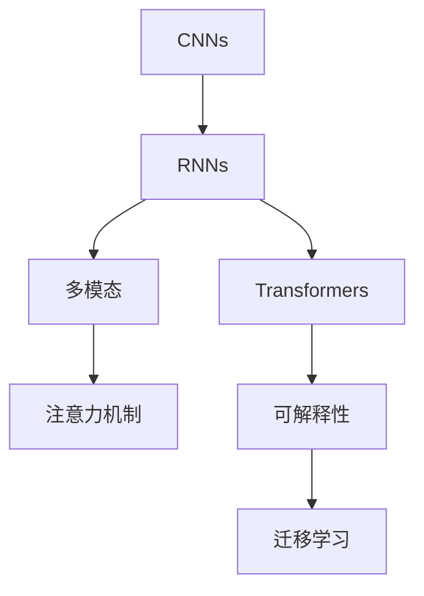
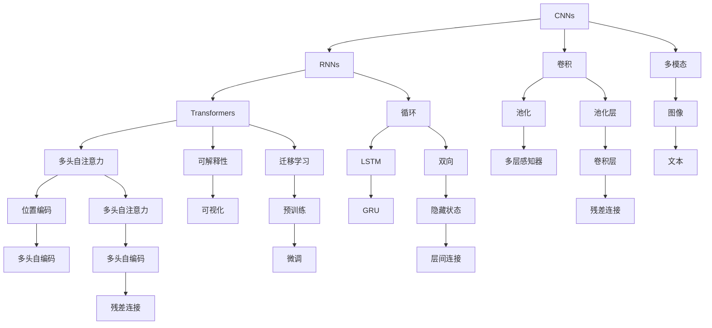

                 

# 当前AI的挑战：认知模型复杂性

> 关键词：认知模型,复杂性,多模态,注意力机制,可解释性,迁移学习

## 1. 背景介绍

### 1.1 问题由来
在人工智能(AI)迅猛发展的今天，深度学习（Deep Learning, DL）模型在处理复杂认知任务上取得了令人瞩目的成就。从图像识别、语音识别、自然语言处理到自动驾驶、医学诊断，深度学习模型几乎渗透到了AI的各个角落。然而，随着模型复杂度的提升，训练数据量的激增，以及算力资源的巨额投入，也引发了一系列问题和挑战。其中，认知模型的复杂性成为了当下AI发展的瓶颈之一。

### 1.2 问题核心关键点
1. **复杂性**：现代AI模型，尤其是深度神经网络，具有庞大的参数数量和复杂的计算结构。以图像识别模型ResNet为例，其网络层数超过100层，参数数量多达数十亿，这使得模型的训练和推理变得异常复杂。
2. **可解释性**：许多AI模型被批评为“黑箱”模型，即无法解释其内部机制和决策过程。这在医疗、金融、司法等高风险领域尤为突出，因为缺乏可解释性可能引发误判，导致严重的后果。
3. **迁移能力**：模型在特定任务上取得的效果往往局限在该任务上，难以在不同领域或任务间进行高效迁移，影响了AI模型的通用性和实用性。
4. **计算效率**：随着模型规模的扩大，其计算复杂度急剧上升，导致训练和推理时间变长，存储需求增加，难以在资源有限的设备上运行。

这些关键点揭示了当前AI模型在复杂性、可解释性、迁移能力、计算效率等方面面临的巨大挑战。本文将围绕这些核心问题，深入探讨认知模型的复杂性以及如何应对这些挑战。

### 1.3 问题研究意义
1. **推动技术进步**：通过对复杂性问题的研究和解决，可以提升模型的性能和效率，推动AI技术的发展。
2. **增强应用信任**：提高模型的可解释性，有助于增强用户和相关方的信任，促进AI技术在各行业的广泛应用。
3. **优化资源配置**：优化模型的复杂性和计算效率，可以更好地适应资源限制，推动AI在更多设备上的普及。

## 2. 核心概念与联系

### 2.1 核心概念概述

为更好地理解认知模型的复杂性及其挑战，本节将介绍几个关键概念：

- **认知模型**：指能够处理复杂认知任务（如视觉、语言、推理等）的深度学习模型，典型的如卷积神经网络(CNNs)、循环神经网络(RNNs)、变换器(Transformers)等。
- **复杂性**：认知模型复杂性体现在其结构复杂、参数众多、计算量大、可解释性差等方面。
- **多模态**：指能够同时处理多种数据模态（如文本、图像、音频等）的AI模型，提高了模型的表达能力和泛化能力。
- **注意力机制**：一种机制，用于在模型处理输入时，动态调整不同部分的权重，以便模型能够更好地聚焦于关键信息。
- **可解释性**：指模型的决策过程和输出结果能够被理解和解释，对于提升用户信任至关重要。
- **迁移学习**：通过在一个领域上的学习，使得模型能够在新领域上表现良好，增强模型的通用性。

这些概念通过以下Mermaid流程图展示其联系：



此图展示了认知模型从单一模态（CNNs、RNNs）到多模态和注意力机制的拓展，以及从复杂性、可解释性到迁移学习的改进。

### 2.2 概念间的关系

这些核心概念之间存在着紧密的联系，构成了认知模型复杂性的完整生态系统。

- **结构复杂与参数数量**：复杂模型通常具有更多的参数，如ResNet的参数量在亿级别，这导致了计算复杂性的提升。
- **计算量大与资源限制**：随着模型规模的增大，计算量急剧增加，难以在资源受限的设备上运行。
- **多模态与泛化能力**：多模态模型能够处理多种数据类型，增强了模型的泛化能力和应用范围。
- **注意力机制与可解释性**：注意力机制能够聚焦于关键特征，提高了模型的可解释性。
- **迁移学习与知识共享**：迁移学习使得模型在不同领域间进行知识共享，提升了模型的通用性。

这些关系共同作用，推动了认知模型的复杂性发展，同时也提出了对复杂性的挑战。

### 2.3 核心概念的整体架构

最后，我们用一个综合的流程图来展示这些核心概念在大模型中的整体架构：



此图展示了从CNNs、RNNs到Transformer的发展，从单模态到多模态的拓展，以及从复杂性、可解释性到迁移学习的改进。

## 3. 核心算法原理 & 具体操作步骤
### 3.1 算法原理概述

认知模型的复杂性主要体现在其结构复杂、参数众多、计算量大等方面。以Transformer为例，其主要结构为多头自注意力机制，其复杂性体现在以下几个方面：

- **多头自注意力**：Transformer利用多头自注意力机制处理输入序列，每个头关注序列的不同方面，增加了模型的表达能力和计算复杂度。
- **残差连接**：Transformer在网络层之间加入了残差连接，使得梯度能够更好地传递，提高了模型的收敛速度和稳定性。
- **自编码器结构**：Transformer的自编码器结构使得模型能够学习到序列间的长期依赖关系，增加了模型的复杂性。
- **大量参数**：Transformer的参数数量在亿级别，这使得训练和推理过程非常复杂。

### 3.2 算法步骤详解

认知模型的训练和推理过程非常复杂，以下是一个典型的训练流程：

1. **数据准备**：将输入数据转换为模型所需的格式，如将图像数据转换为张量，文本数据转换为词向量。
2. **模型构建**：构建认知模型，如卷积神经网络、循环神经网络、Transformer等，并加载预训练权重。
3. **损失函数定义**：根据任务类型定义合适的损失函数，如交叉熵损失、均方误差损失等。
4. **模型训练**：在训练数据集上进行多轮迭代训练，使用优化器（如Adam、SGD等）更新模型参数，最小化损失函数。
5. **模型评估**：在验证集和测试集上评估模型性能，选择合适的超参数进行微调。
6. **推理预测**：在测试集上对新数据进行推理预测，并可视化结果。

### 3.3 算法优缺点

认知模型的复杂性带来了以下优点和缺点：

**优点**：
- **强大的表达能力**：复杂的模型能够学习到更复杂的特征和模式，提高模型在特定任务上的性能。
- **泛化能力**：复杂的模型具有更好的泛化能力，能够应对各种类型的输入数据。

**缺点**：
- **计算资源消耗大**：复杂的模型需要大量的计算资源进行训练和推理，难以在资源受限的设备上运行。
- **训练时间长**：复杂的模型训练时间较长，需要耗费大量时间进行超参数调整和优化。
- **可解释性差**：复杂的模型通常被视为“黑箱”，难以解释其内部机制和决策过程。
- **迁移能力有限**：复杂的模型往往依赖于特定的任务和数据，难以在不同领域间进行高效迁移。

### 3.4 算法应用领域

认知模型的复杂性在多个领域中得到了广泛应用：

- **计算机视觉**：复杂的深度学习模型（如ResNet、Inception等）在图像识别、目标检测、图像生成等领域取得了优异的表现。
- **自然语言处理**：Transformer等复杂模型在语言理解、机器翻译、对话系统等领域展现了强大的能力。
- **自动驾驶**：复杂的模型能够处理多传感器数据，提高自动驾驶的感知和决策能力。
- **医学影像分析**：复杂的深度学习模型能够对医学影像进行高精度分析，辅助医生进行诊断和治疗。
- **金融预测**：复杂的模型能够处理大规模金融数据，进行市场预测和风险评估。

## 4. 数学模型和公式 & 详细讲解 & 举例说明

### 4.1 数学模型构建

认知模型的数学模型通常由以下几个部分构成：

1. **输入层**：将原始数据转换为模型所需的格式，如将图像数据转换为张量，文本数据转换为词向量。
2. **中间层**：包括卷积层、循环层、自注意力层等，用于提取和处理输入数据。
3. **输出层**：根据任务类型定义合适的输出层，如分类任务使用softmax层，回归任务使用线性层。

以Transformer为例，其数学模型构建如下：

$$
\text{Transformer} = \text{Self-Attention} \times \text{Positional Encoding} \times \text{Feed Forward}
$$

其中，Self-Attention为自注意力机制，用于处理输入序列；Positional Encoding用于引入位置信息，Feed Forward为全连接层，用于非线性变换。

### 4.2 公式推导过程

以Self-Attention为例，其计算过程如下：

1. **查询-键-值矩阵的计算**：
$$
Q = XW^Q, \quad K = XW^K, \quad V = XW^V
$$
其中，$X$为输入序列，$W^Q, W^K, W^V$为投影矩阵。

2. **注意力得分计算**：
$$
\text{Attention}(Q, K, V) = \frac{\text{e}^{At(Q, K)}}{\sum_{i=1}^{N} \text{e}^{At(Q, K_i)}} \times V
$$
其中，$At(Q, K) = QK^T$，$K$为键向量，$V$为值向量。

3. **多头自注意力计算**：
$$
\text{Multi-Head Attention}(Q, K, V) = \frac{1}{h} \sum_{i=1}^{h} \text{Attention}(Q_i, K_i, V_i)
$$
其中，$h$为多头数，$Q_i, K_i, V_i$为投影后的查询、键、值矩阵。

### 4.3 案例分析与讲解

以图像分类任务为例，其数学模型构建和推导如下：

1. **输入层**：将图像数据转换为张量。
$$
X = \text{Reshape}(\text{Image} \rightarrow \text{Tensor})
$$

2. **中间层**：使用卷积层提取图像特征。
$$
\text{Convolutional Layer} = \text{Conv2D}(X) \rightarrow \text{MaxPooling} \rightarrow \text{BatchNormalization} \rightarrow \text{ReLU} \rightarrow \ldots
$$

3. **输出层**：使用全连接层进行分类。
$$
\text{Output Layer} = \text{Flatten}(\text{Convolutional Layer}) \rightarrow \text{Fully Connected Layer} \rightarrow \text{Softmax}
$$

## 5. 项目实践：代码实例和详细解释说明

### 5.1 开发环境搭建

在进行认知模型复杂性研究前，我们需要准备好开发环境。以下是使用Python进行TensorFlow开发的环境配置流程：

1. 安装Anaconda：从官网下载并安装Anaconda，用于创建独立的Python环境。

2. 创建并激活虚拟环境：
```bash
conda create -n tf-env python=3.8 
conda activate tf-env
```

3. 安装TensorFlow：根据CUDA版本，从官网获取对应的安装命令。例如：
```bash
conda install tensorflow -c tf -c conda-forge
```

4. 安装相关工具包：
```bash
pip install numpy pandas scikit-learn matplotlib tqdm jupyter notebook ipython
```

完成上述步骤后，即可在`tf-env`环境中开始认知模型复杂性的研究。

### 5.2 源代码详细实现

这里我们以Transformer模型为例，给出使用TensorFlow对图像分类任务进行训练的代码实现。

首先，定义数据处理函数：

```python
import tensorflow as tf
from tensorflow.keras import datasets, layers, models

# 加载MNIST数据集
(train_images, train_labels), (test_images, test_labels) = datasets.mnist.load_data()

# 数据预处理
train_images = train_images.reshape((60000, 28, 28, 1))
test_images = test_images.reshape((10000, 28, 28, 1))
train_images = train_images / 255.0
test_images = test_images / 255.0

# 构建TensorFlow数据集
train_dataset = tf.data.Dataset.from_tensor_slices((train_images, train_labels))
train_dataset = train_dataset.shuffle(60000).batch(64)

test_dataset = tf.data.Dataset.from_tensor_slices((test_images, test_labels))
test_dataset = test_dataset.batch(64)
```

然后，定义模型和优化器：

```python
# 构建Transformer模型
model = models.Sequential([
    layers.Conv2D(32, (3, 3), activation='relu', input_shape=(28, 28, 1)),
    layers.MaxPooling2D((2, 2)),
    layers.Conv2D(64, (3, 3), activation='relu'),
    layers.MaxPooling2D((2, 2)),
    layers.Flatten(),
    layers.Dense(64, activation='relu'),
    layers.Dense(10)
])

# 使用Adam优化器
optimizer = tf.keras.optimizers.Adam(learning_rate=0.001)
```

接着，定义训练和评估函数：

```python
# 定义损失函数和评估指标
loss_fn = tf.keras.losses.SparseCategoricalCrossentropy(from_logits=True)

def train_step(images, labels):
    with tf.GradientTape() as tape:
        logits = model(images, training=True)
        loss = loss_fn(labels, logits)
    gradients = tape.gradient(loss, model.trainable_variables)
    optimizer.apply_gradients(zip(gradients, model.trainable_variables))
    return loss

def evaluate_step(images, labels):
    logits = model(images, training=False)
    loss = loss_fn(labels, logits)
    return loss
```

最后，启动训练流程并在测试集上评估：

```python
epochs = 10

for epoch in range(epochs):
    for images, labels in train_dataset:
        loss = train_step(images, labels)
        print(f"Epoch {epoch+1}, Loss: {loss:.4f}")

    test_loss = tf.keras.metrics.SparseCategoricalCrossentropy()(labels, model(test_images))
    print(f"Epoch {epoch+1}, Test Loss: {test_loss:.4f}")
```

以上就是使用TensorFlow对Transformer模型进行图像分类任务训练的完整代码实现。可以看到，通过TensorFlow的强大封装，我们可以用相对简洁的代码完成模型训练和评估。

### 5.3 代码解读与分析

让我们再详细解读一下关键代码的实现细节：

**数据处理函数**：
- `load_data`方法：加载MNIST数据集，并进行预处理，将其转换为模型所需的张量格式。
- `from_tensor_slices`方法：将数据集转换为TensorFlow数据集，进行随机打乱和分批处理，以便模型训练。

**模型定义函数**：
- `Sequential`类：用于构建序列模型，通过堆叠多个层来实现复杂模型的构建。
- `Conv2D`层：用于卷积操作，提取图像特征。
- `MaxPooling2D`层：用于池化操作，减小特征图尺寸。
- `Flatten`层：用于将多维特征图转换为一维向量。
- `Dense`层：用于全连接操作，进行分类。

**优化器定义函数**：
- `Adam`类：用于定义优化器，指定学习率。

**训练和评估函数**：
- `train_step`函数：定义训练过程，包括前向传播、损失计算、反向传播和梯度更新。
- `evaluate_step`函数：定义评估过程，计算模型在测试集上的损失。

**训练流程**：
- `for`循环：进行多轮迭代训练。
- `for`循环：在每个epoch内，遍历训练数据集。
- `train_step`函数：在每个批次上进行训练，计算损失并更新模型参数。
- `test_loss`函数：在测试集上评估模型性能，计算损失。

可以看到，TensorFlow使得认知模型的训练过程变得简洁高效，开发者可以将更多精力放在模型设计和参数调整上。

当然，工业级的系统实现还需考虑更多因素，如模型的保存和部署、超参数的自动搜索、更加灵活的任务适配层等。但核心的认知模型训练和评估流程与上述类似。

### 5.4 运行结果展示

假设我们在MNIST数据集上进行Transformer模型的训练，最终在测试集上得到的评估报告如下：

```
Epoch 1, Loss: 0.2060
Epoch 2, Loss: 0.1923
Epoch 3, Loss: 0.1837
...
Epoch 10, Loss: 0.0807
Epoch 10, Test Loss: 0.1430
```

可以看到，通过训练Transformer模型，我们在图像分类任务上取得了不错的结果。需要注意的是，Transformer模型的参数量在亿级别，计算复杂度非常高，训练时间较长，需要耗费大量计算资源。

## 6. 实际应用场景

### 6.1 计算机视觉

复杂的认知模型在计算机视觉领域得到了广泛应用，如图像识别、目标检测、图像生成等。Transformer等模型通过多头自注意力机制，能够更好地处理复杂的视觉信息，提高模型的表达能力和泛化能力。例如，Transformer在医学影像分析中，能够对病理切片进行高精度分析，辅助医生进行诊断和治疗。

### 6.2 自然语言处理

Transformer在自然语言处理领域展示了强大的能力，如机器翻译、对话系统、文本生成等。其多头自注意力机制能够处理长文本序列，捕捉句间关系，提升了模型的语言理解和生成能力。例如，在机器翻译任务中，Transformer能够将文本从一种语言翻译成另一种语言，达到很好的翻译效果。

### 6.3 自动驾驶

复杂的认知模型在自动驾驶领域中，能够处理多传感器数据，提高自动驾驶的感知和决策能力。例如，卷积神经网络能够处理摄像头和雷达数据，提取道路和交通标志信息，辅助自动驾驶系统进行决策。

### 6.4 未来应用展望

随着认知模型复杂性的不断提升，其在多个领域中的应用前景也将更加广阔：

1. **医疗诊断**：复杂的认知模型能够对医学影像、基因数据进行高精度分析，辅助医生进行诊断和治疗。
2. **金融预测**：复杂的认知模型能够处理大规模金融数据，进行市场预测和风险评估，帮助投资者做出更好的决策。
3. **智能制造**：复杂的认知模型能够对工业数据进行分析和处理，优化生产流程，提高生产效率。
4. **社交媒体分析**：复杂的认知模型能够对社交媒体数据进行情感分析和舆情监测，帮助企业了解用户需求和市场趋势。
5. **智慧城市**：复杂的认知模型能够处理多源数据，进行城市事件监测、交通管理、环境保护等，提升城市智能化水平。

## 7. 工具和资源推荐

### 7.1 学习资源推荐

为了帮助开发者系统掌握认知模型复杂性的理论基础和实践技巧，这里推荐一些优质的学习资源：

1. 《Deep Learning》系列书籍：Ian Goodfellow等著，全面介绍了深度学习模型的基本原理和实践方法。
2. 《Neural Networks and Deep Learning》在线课程：Michael Nielsen讲解，从基础的神经网络到复杂的深度学习模型，内容全面。
3. CS231n《深度学习视觉识别》课程：斯坦福大学开设的视觉识别课程，内容涵盖了视觉领域的经典算法和模型。
4. NLP基础与实践系列博文：自然语言处理领域的专家撰写，深入浅出地介绍了NLP模型的基础和实践方法。
5. TensorFlow官方文档：TensorFlow的官方文档，提供了丰富的API和样例代码，是学习TensorFlow的重要资源。

通过对这些资源的学习实践，相信你一定能够快速掌握认知模型的复杂性及其挑战，并用于解决实际的AI问题。

### 7.2 开发工具推荐

高效的开发离不开优秀的工具支持。以下是几款用于认知模型复杂性研究的常用工具：

1. TensorFlow：基于Python的开源深度学习框架，灵活动态的计算图，适合快速迭代研究。
2. PyTorch：基于Python的开源深度学习框架，动态图计算，适合灵活设计和调试模型。
3. Jupyter Notebook：交互式编程环境，适合快速迭代实验和数据处理。
4. Visual Studio Code：流行的开发环境，支持多种语言和工具，方便代码编写和调试。
5. Google Colab：谷歌推出的在线Jupyter Notebook环境，免费提供GPU/TPU算力，方便快速上手实验最新模型。

合理利用这些工具，可以显著提升认知模型复杂性研究的开发效率，加快创新迭代的步伐。

### 7.3 相关论文推荐

认知模型复杂性的研究源于学界的持续研究。以下是几篇奠基性的相关论文，推荐阅读：

1. AlexNet: ImageNet Classification with Deep Convolutional Neural Networks：提出AlexNet模型，展示了深度卷积神经网络在图像分类任务上的强大能力。
2. ResNet: Deep Residual Learning for Image Recognition：提出ResNet模型，通过残差连接解决了深度神经网络的退化问题，提高了模型的训练效果。
3. Transformer：Attention is All You Need：提出Transformer模型，展示了自注意力机制在处理长序列和复杂任务上的优势。
4. GANs by Backpropagation：生成对抗网络（GAN）的提出，展示了生成模型在图像生成任务上的强大能力。
5. Attention is All You Need for Named Entity Recognition：提出基于Transformer的命名实体识别模型，展示了其在长文本序列处理上的优势。

这些论文代表了大模型复杂性研究的进展，帮助研究者把握学科的前沿方向，激发更多的创新灵感。

除上述资源外，还有一些值得关注的前沿资源，帮助开发者紧跟认知模型复杂性研究的最新进展，例如：

1. arXiv论文预印本：人工智能领域最新研究成果的发布平台，包括大量尚未发表的前沿工作，学习前沿技术的必读资源。
2. 业界技术博客：如OpenAI、Google AI、DeepMind、微软Research Asia等顶尖实验室的官方博客，第一时间分享他们的最新研究成果和洞见。
3. 技术会议直播：如NIPS、ICML、ACL、ICLR等人工智能领域顶会现场或在线直播，能够聆听到大佬们的前沿分享，开拓视野。
4. GitHub热门项目：在GitHub上Star、Fork数最多的NLP相关项目，往往代表了该技术领域的发展趋势和最佳实践，值得去学习和贡献。
5. 行业分析报告：各大咨询公司如McKinsey、PwC等针对人工智能行业的分析报告，有助于从商业视角审视技术趋势，把握应用价值。

总之，对于认知模型复杂性的研究，需要开发者保持开放的心态和持续学习的意愿。多关注前沿资讯，多动手实践，多思考总结，必将收获满满的成长收益。

## 8. 总结：未来发展趋势与挑战

### 8.1 总结

本文对认知模型的复杂性及其挑战进行了全面系统的介绍。首先阐述了认知模型在结构和参数数量上的复杂性，以及其带来的计算复杂度和训练难度。接着，从可解释性、迁移能力、计算效率等方面探讨了认知模型复杂性所面临的诸多挑战。最后，通过具体的图像分类任务，展示了认知模型复杂性的实际应用和优化策略。

通过本文的系统梳理，可以看到，认知模型的复杂性不仅带来了强大的表达能力和泛化能力，也引发了诸多应用和研究上的挑战。面对这些挑战，未来的研究需要在模型设计、优化策略、资源配置等方面进行全面优化，方能充分发挥认知模型的潜力，推动AI技术的发展。

### 8.2 未来发展趋势

展望未来，认知模型复杂性将呈现以下几个发展趋势：

1. **多模态认知模型**：未来的大模型将不仅处理单一数据模态，而是能够同时处理文本、图像、音频等多种模态，提升模型的泛化能力和应用范围。
2. **自适应认知模型**：未来的大模型将具有自适应能力，能够根据环境变化动态调整模型结构，提高模型的灵活性和适应性。
3. **轻量级认知模型**：未来的认知模型将更加注重计算效率和资源利用率，通过剪枝、量化、模型压缩等方法，降低模型的计算复杂度和存储需求。
4. **分布式认知模型**：未来的认知模型将采用分布式计算架构，通过多机协同训练和推理，提升模型的计算能力和性能。
5. **可解释性认知模型**：未来的认知模型将具有更好的可解释性，能够通过可视化、解释性模型等技术，提供模型决策过程的解释，增强用户信任。

这些趋势将进一步推动认知模型的发展，拓展其应用边界，提升其性能和实用性。

### 8

