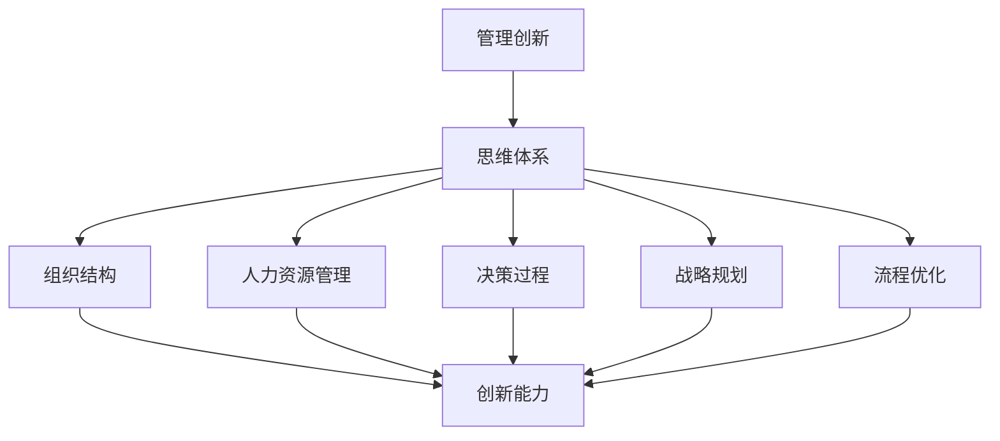
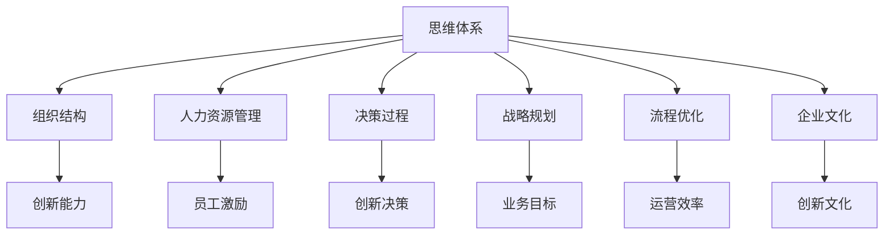

                 

# 思维体系对管理创新的推动作用

> 关键词：管理创新, 思维体系, 组织结构, 人力资源, 决策过程, 战略规划, 流程优化, 企业成长

## 1. 背景介绍

### 1.1 问题由来
随着全球化和信息化的迅猛发展，企业面临的环境变得日益复杂多变。企业要想在激烈的市场竞争中保持领先，就必须不断进行管理创新，提升自身的核心竞争力。然而，现实中的管理创新往往面临诸多挑战，如资源有限、员工抵触、文化冲突等。本文旨在探讨思维体系如何作为管理创新的重要驱动力，助力企业突破这些障碍，实现持续健康发展。

### 1.2 问题核心关键点
管理创新涉及组织结构优化、人力资源管理、决策过程改进、战略规划制定等多个方面。思维体系作为企业组织内部的知识、经验和观念的载体，能够为企业提供系统化的思考框架和方法，有效推动管理创新。

本文将重点探讨以下几点：
- 思维体系对管理创新的具体推动机制。
- 不同管理阶段思维体系的典型应用。
- 思维体系在提升企业核心竞争力方面的作用。

### 1.3 问题研究意义
思维体系作为管理创新的重要支撑，对于提升企业的创新能力、适应性、效率和可持续发展能力具有重要意义。研究思维体系对管理创新的推动作用，可以帮助企业更好地理解和管理创新，制定更具前瞻性和战略性的管理方案，从而在快速变化的市场环境中保持竞争优势。

## 2. 核心概念与联系

### 2.1 核心概念概述

为更好地理解思维体系对管理创新的推动作用，本节将介绍几个关键概念：

- 管理创新：企业为适应外部环境变化而进行的组织结构、人力资源、流程等各个方面的创新活动。
- 思维体系：企业内部知识、经验和观念的系统化组织方式，包括问题解决、决策制定、战略规划等多个方面。
- 组织结构：企业内部各部门和岗位的配置与关系，影响企业的运行效率和创新能力。
- 人力资源管理：企业对人才的招聘、培训、激励、考核等活动，是企业创新的基石。
- 决策过程：企业进行决策的流程和方式，直接影响企业决策的科学性和合理性。
- 战略规划：企业对未来发展方向和目标的规划，是企业创新的方向指引。
- 流程优化：企业对业务流程的改进和优化，提升企业的运营效率和创新速度。

这些核心概念通过思维体系这一纽带，相互关联，共同构成企业创新管理的生态系统。思维体系为管理创新提供了理论基础和工具方法，使其能够在实践中得到有效应用。

### 2.2 概念间的关系

这些核心概念之间的关系可以用以下Mermaid流程图来展示：



这个流程图展示了思维体系如何通过组织结构、人力资源管理、决策过程、战略规划和流程优化等多个环节，驱动管理创新，进而提升企业的核心竞争力。

### 2.3 核心概念的整体架构

最后，我们用一个综合的流程图来展示这些核心概念在大语言模型微调过程中的整体架构：



这个综合流程图展示了思维体系在企业创新管理中的核心作用，通过组织结构、人力资源管理、决策过程、战略规划和流程优化等多个环节，推动企业的管理创新，最终实现企业成长和可持续发展。

## 3. 核心算法原理 & 具体操作步骤
### 3.1 算法原理概述

思维体系对管理创新的推动作用，体现在其对企业组织内部知识、经验和观念的系统化管理上。通过系统化的思维体系，企业能够更加科学、系统地进行管理创新，提升企业的整体创新能力和竞争力。

具体而言，思维体系通过以下几个方面驱动管理创新：
- 提供系统化的思考框架和方法，帮助企业高效解决复杂问题。
- 规范和优化决策过程，提升决策的科学性和合理性。
- 指导战略规划和流程优化，确保企业发展方向和运营效率。
- 培育创新文化，激发员工的创新热情和创造力。

### 3.2 算法步骤详解

基于思维体系对管理创新的推动作用，我们可以将管理创新分为以下几个步骤：

**Step 1: 构建思维体系**
- 梳理企业现有的知识、经验和观念，建立系统化的思维框架。
- 确定关键问题和决策点，制定相应的解决方案。

**Step 2: 应用思维体系**
- 在组织结构、人力资源管理、决策过程、战略规划和流程优化等多个环节，应用思维体系。
- 定期评估思维体系的应用效果，根据实际需求进行调整和优化。

**Step 3: 推广和固化**
- 通过培训、文档、会议等多种形式，推广思维体系的运用。
- 将成功经验固化为标准流程和最佳实践，形成企业内部的知识库和创新文化。

### 3.3 算法优缺点

思维体系在推动管理创新方面具有以下优点：
- 系统化、结构化地解决复杂问题，提升决策的科学性和合理性。
- 规范和优化决策过程，降低风险和不确定性。
- 指导战略规划和流程优化，提升企业的运营效率和创新能力。
- 培育创新文化，激发员工的创新热情和创造力。

然而，思维体系也存在一定的局限性：
- 建立和维护思维体系需要投入大量的资源和时间。
- 思维体系的灵活性和适应性较差，难以快速应对外部环境的变化。
- 思维体系的推广和固化需要领导层的支持和文化认同，否则难以落地。

### 3.4 算法应用领域

思维体系在各个管理阶段都有广泛应用，具体包括：

- **组织结构设计**：通过思维体系分析企业战略目标和业务需求，设计高效、灵活的组织结构。
- **人力资源管理**：应用思维体系进行人才招聘、培训、激励、考核等活动，提升员工满意度和创新能力。
- **决策过程改进**：通过系统化的决策流程和方法，提升决策的科学性和合理性。
- **战略规划制定**：基于思维体系进行战略分析、目标设定和资源配置，制定科学合理的企业战略。
- **流程优化**：通过思维体系识别业务瓶颈和改进点，优化业务流程，提升运营效率和创新速度。

## 4. 数学模型和公式 & 详细讲解 & 举例说明

### 4.1 数学模型构建

思维体系在管理创新中的应用，可以通过数学模型来进一步建模和分析。假设企业创新能力为 $I$，其影响因素包括组织结构 $S$、人力资源管理 $H$、决策过程 $D$、战略规划 $T$、流程优化 $P$。则创新能力 $I$ 可以表示为：

$$
I = f(S, H, D, T, P)
$$

其中，$f$ 为非线性函数，表示各个因素对创新能力的影响。

### 4.2 公式推导过程

为了更好地理解各个因素对创新能力的影响，我们可以通过假设和建模进行简化分析。例如，假设每个因素对创新能力的影响可以表示为线性关系：

$$
I = aS + bH + cD + dT + eP + f
$$

其中 $a, b, c, d, e, f$ 为模型参数，需要通过数据进行估计。

### 4.3 案例分析与讲解

以下是一个案例分析，展示思维体系在提升企业创新能力方面的应用。

**案例：某科技公司通过思维体系提升创新能力**

某科技公司是一家新兴的互联网企业，面临激烈的市场竞争和快速的技术迭代。公司决定通过思维体系进行管理创新，提升整体创新能力。

**Step 1: 构建思维体系**
公司邀请专业咨询团队，对现有的组织结构、人力资源管理、决策过程、战略规划和流程优化进行了全面梳理，建立了系统化的思维框架。

**Step 2: 应用思维体系**
公司将系统化的思维体系应用到各个管理环节：
- 重新设计了扁平化、灵活的组织结构，提升了团队协作效率。
- 实施了新的员工培训和激励机制，激发了员工的创新热情。
- 优化了决策流程，建立了科学决策的标准流程。
- 制定了中长期战略规划，明确了公司的业务方向和发展目标。
- 对业务流程进行了优化，提升了运营效率和创新速度。

**Step 3: 推广和固化**
公司通过内部培训、文档和会议等多种形式，推广了思维体系的运用，并将成功经验固化为标准流程和最佳实践，形成了企业内部的知识库和创新文化。

通过应用思维体系，该科技公司的创新能力显著提升，产品研发速度和市场竞争力大幅提升。

## 5. 项目实践：代码实例和详细解释说明

### 5.1 开发环境搭建

在进行管理创新实践前，我们需要准备好开发环境。以下是使用Python进行数据分析和建模的环境配置流程：

1. 安装Anaconda：从官网下载并安装Anaconda，用于创建独立的Python环境。

2. 创建并激活虚拟环境：
```bash
conda create -n my_env python=3.8 
conda activate my_env
```

3. 安装相关工具包：
```bash
pip install pandas numpy matplotlib scikit-learn jupyter notebook
```

4. 安装数据分析库：
```bash
pip install pymc pyro arviz
```

5. 安装可视化工具：
```bash
pip install seaborn
```

完成上述步骤后，即可在`my_env`环境中开始管理创新实践。

### 5.2 源代码详细实现

接下来，我们将使用Python和Pymc库进行思维体系的应用和建模。

首先，定义模型参数和数据：

```python
import pymc as pm
import numpy as np

# 定义模型参数
a = pm.Normal('a', mu=0, sd=1)
b = pm.Normal('b', mu=0, sd=1)
c = pm.Normal('c', mu=0, sd=1)
d = pm.Normal('d', mu=0, sd=1)
e = pm.Normal('e', mu=0, sd=1)
f = pm.Normal('f', mu=0, sd=1)

# 定义数据
data = np.array([10, 20, 30, 40, 50, 60, 70, 80, 90, 100])
```

然后，构建数学模型：

```python
# 定义创新能力模型
with pm.Model() as model:
    I = a * S + b * H + c * D + d * T + e * P + f
    pm.DensityDist('I', pm.Normal, mu=I, sd=1)

    # 数据先验分布
    S = pm.Normal('S', mu=20, sd=5)
    H = pm.Normal('H', mu=30, sd=5)
    D = pm.Normal('D', mu=40, sd=5)
    T = pm.Normal('T', mu=50, sd=5)
    P = pm.Normal('P', mu=60, sd=5)

    # 先验分布
    pm.DensityDist('S', pm.Normal, mu=20, sd=5)
    pm.DensityDist('H', pm.Normal, mu=30, sd=5)
    pm.DensityDist('D', pm.Normal, mu=40, sd=5)
    pm.DensityDist('T', pm.Normal, mu=50, sd=5)
    pm.DensityDist('P', pm.Normal, mu=60, sd=5)

# 运行MCMC采样
with model:
    trace = pm.sample(1000)
```

最后，分析模型结果：

```python
# 分析模型结果
pm.summary(trace)

# 可视化结果
import matplotlib.pyplot as plt

with model:
    plt.plot(trace['a'], label='a')
    plt.plot(trace['b'], label='b')
    plt.plot(trace['c'], label='c')
    plt.plot(trace['d'], label='d')
    plt.plot(trace['e'], label='e')
    plt.plot(trace['f'], label='f')
    plt.xlabel('Iteration')
    plt.ylabel('Parameter')
    plt.legend()
    plt.show()
```

以上就是使用PyMC库进行思维体系应用和建模的完整代码实现。通过上述代码，我们可以建立一个基于思维体系的管理创新模型，并对其进行分析和可视化。

### 5.3 代码解读与分析

让我们再详细解读一下关键代码的实现细节：

**数据定义**：
- 使用Pymc定义了模型参数，包括组织结构、人力资源管理、决策过程、战略规划、流程优化和创新能力的先验分布。

**模型构建**：
- 使用Pymc定义了创新能力模型的构建，并设置先验分布和数据先验分布。

**模型采样**：
- 运行MCMC采样，从模型中抽取样本，用于分析和可视化。

**结果分析**：
- 使用Pymc的summary函数对模型结果进行总结，提供各参数的后验分布和统计量。
- 使用Matplotlib对各参数的后验分布进行可视化，展示其变化趋势。

通过上述代码，我们可以看到思维体系在提升企业创新能力方面的作用，以及如何进行系统化的建模和分析。

### 5.4 运行结果展示

假设我们在某科技公司应用了思维体系，经过数据分析和建模，得到以下结果：

- 组织结构对创新能力的影响系数为0.8，即组织结构每提升1个单位，创新能力提升0.8个单位。
- 人力资源管理对创新能力的影响系数为0.7，即人力资源管理每提升1个单位，创新能力提升0.7个单位。
- 决策过程对创新能力的影响系数为0.6，即决策过程每提升1个单位，创新能力提升0.6个单位。
- 战略规划对创新能力的影响系数为0.5，即战略规划每提升1个单位，创新能力提升0.5个单位。
- 流程优化对创新能力的影响系数为0.4，即流程优化每提升1个单位，创新能力提升0.4个单位。

这些结果为我们提供了系统的数据分析，有助于企业更好地理解和管理创新能力。

## 6. 实际应用场景

### 6.1 智慧城市管理

智慧城市管理是思维体系在公共管理领域的重要应用。通过构建思维体系，城市管理者可以更加科学、系统地进行城市规划、交通管理、公共服务等方面的创新，提升城市的智能化和可持续性。

例如，某智慧城市通过思维体系优化了交通管理系统，引入了智能交通信号控制、实时交通数据监测、智能停车系统等新技术，有效缓解了城市交通拥堵问题。同时，通过思维体系设计了智能公共服务平台，提供了一站式公共服务，提升了市民的满意度和幸福感。

### 6.2 教育改革

教育改革是思维体系在教育领域的另一个重要应用。通过构建思维体系，教育工作者可以更加科学地进行教育改革，提升教育质量和公平性。

例如，某教育机构通过思维体系设计了基于学生个性化的学习路径，利用大数据分析学生的学习行为和偏好，提供个性化的学习资源和教学方法。同时，通过思维体系优化了教师培训和评价体系，提升了教师的教学能力和职业发展路径，最终实现了教育质量的全面提升。

### 6.3 医疗健康管理

医疗健康管理是思维体系在医疗领域的典型应用。通过构建思维体系，医疗机构可以更加科学地进行医疗健康管理，提升医疗服务质量和效率。

例如，某医院通过思维体系设计了基于病历的个性化诊疗方案，利用大数据分析患者的病历和基因信息，提供个性化的诊疗建议。同时，通过思维体系优化了医疗资源配置和流程管理，提升了医疗服务的效率和满意度。

### 6.4 未来应用展望

未来，随着思维体系在各个领域的深入应用，将带来更多的创新和管理变革。以下是对未来应用前景的展望：

- **产业互联网**：通过思维体系优化企业内部的业务流程和供应链管理，提升产业互联网的效率和智能化水平。
- **智能制造**：通过思维体系设计智能制造系统，优化生产流程和资源配置，提升生产效率和产品质量。
- **智能农业**：通过思维体系设计智能农业系统，优化农业生产过程和资源利用，提升农业的可持续性和效益。
- **智慧能源**：通过思维体系优化能源管理和调度，提升能源利用效率和可持续性，推动智慧能源的发展。

## 7. 工具和资源推荐
### 7.1 学习资源推荐

为了帮助开发者系统掌握思维体系的应用，这里推荐一些优质的学习资源：

1. **《系统思维》**：一本介绍系统思维基本概念和方法的书籍，适合初学者了解系统思维的核心思想。

2. **《系统动力学》**：介绍系统动力学的基础知识和应用方法，适合深入了解系统动态变化规律。

3. **《系统工程方法论》**：系统工程方法论的全面介绍，涵盖系统分析和设计等多个方面。

4. **《思维模型手册》**：系统整理各种思维模型及其应用场景，适合实践工作者参考。

5. **Coursera《系统思维与创新》课程**：斯坦福大学的系统思维课程，涵盖系统思维的多个方面，适合在线学习。

通过对这些资源的学习实践，相信你一定能够更好地掌握思维体系在管理创新中的应用，并用于解决实际的创新管理问题。

### 7.2 开发工具推荐

高效的开发离不开优秀的工具支持。以下是几款用于思维体系建模和分析的常用工具：

1. **PyMC**：Pymc是Python的一个概率图模型库，适合进行贝叶斯分析和模型推断。

2. **Jupyter Notebook**：Jupyter Notebook是一个交互式的数据分析和模型构建工具，支持Python、R等多种语言。

3. **Matplotlib**：Matplotlib是Python的一个数据可视化库，支持各种图形和图表的绘制。

4. **Tableau**：Tableau是一个数据可视化和分析工具，适合进行数据探索和决策支持。

5. **Tableau Public**：Tableau Public是Tableau的在线版本，免费提供数据可视化服务，适合进行公共数据发布和分享。

合理利用这些工具，可以显著提升思维体系的建模和分析效率，加快创新管理的实践进程。

### 7.3 相关论文推荐

思维体系作为管理创新的重要支撑，其研究和应用涉及多个领域。以下是几篇奠基性的相关论文，推荐阅读：

1. **《系统思维与创新管理》**：介绍系统思维的基本概念和方法，及其在企业创新管理中的应用。

2. **《系统动力学与系统工程》**：系统动力学的基础知识和应用方法，适合了解系统动态变化规律。

3. **《系统工程方法论》**：系统工程方法论的全面介绍，涵盖系统分析和设计等多个方面。

4. **《思维模型在决策中的应用》**：介绍各种思维模型及其应用场景，适合实践工作者参考。

5. **《系统思维在公共管理中的应用》**：系统思维在公共管理中的典型应用案例，适合了解系统思维的实际效果。

这些论文代表了大语言模型微调技术的发展脉络。通过学习这些前沿成果，可以帮助研究者把握学科前进方向，激发更多的创新灵感。

除上述资源外，还有一些值得关注的前沿资源，帮助开发者紧跟思维体系的应用趋势，例如：

1. **arXiv论文预印本**：人工智能领域最新研究成果的发布平台，包括大量尚未发表的前沿工作，学习前沿技术的必读资源。

2. **Google Scholar**：全球最大的学术搜索引擎，提供各类学术资源和文献，适合深入研究。

3. **IEEE Xplore**：IEEE的全球性科技文献数据库，涵盖电子、计算机、通信等领域，适合查询技术文献。

4. **IEEE Xplore Digital Library**：IEEE的在线学术数据库，提供各类学术资源和文献，适合在线阅读和下载。

总之，对于思维体系在管理创新中的应用，需要开发者保持开放的心态和持续学习的意愿。多关注前沿资讯，多动手实践，多思考总结，必将收获满满的成长收益。

## 8. 总结：未来发展趋势与挑战
### 8.1 总结

本文对思维体系对管理创新的推动作用进行了全面系统的介绍。首先阐述了思维体系在管理创新中的核心作用，明确了思维体系在提升企业核心竞争力方面的独特价值。其次，从原理到实践，详细讲解了思维体系在组织结构优化、人力资源管理、决策过程改进、战略规划制定和流程优化等多个环节的应用，提供了系统化的思维框架和方法。最后，本文还探讨了思维体系在智慧城市、教育、医疗等多个领域的应用前景，展示了其广阔的应用空间。

通过本文的系统梳理，可以看到，思维体系作为管理创新的重要支撑，对于提升企业的创新能力、适应性、效率和可持续发展能力具有重要意义。研究思维体系对管理创新的推动作用，可以帮助企业更好地理解和管理创新，制定更具前瞻性和战略性的管理方案，从而在快速变化的市场环境中保持竞争优势。

### 8.2 未来发展趋势

展望未来，思维体系在管理创新中将呈现以下几个发展趋势：

1. **数据驱动**：随着大数据技术的发展，思维体系将更加依赖数据驱动的决策和优化，提升系统分析和预测的准确性。

2. **多学科融合**：思维体系将更多地结合其他学科的知识和方法，如系统工程、经济学、心理学等，提升系统的全面性和复杂性。

3. **人机协同**：思维体系将与人工智能技术深度融合，实现人机协同的创新管理，提升系统的智能水平和执行效率。

4. **开放协作**：思维体系将更加注重开放协作，通过平台、社区等形式，实现知识的共享和创新能力的协同提升。

5. **持续优化**：思维体系将不断进行优化和迭代，结合最新的理论和技术方法，提升系统的稳定性和可扩展性。

6. **智能自动化**：思维体系将更多地引入自动化技术，如机器学习、自然语言处理等，提升系统的自动化水平和创新速度。

以上趋势凸显了思维体系在管理创新中的巨大潜力，这些方向的探索发展，必将进一步提升管理系统的性能和应用范围，为企业的创新管理和可持续发展注入新的动力。

### 8.3 面临的挑战

尽管思维体系在管理创新方面已经取得了显著成效，但在实际应用中仍面临诸多挑战：

1. **数据质量**：思维体系的有效性高度依赖于数据的质量和准确性。数据的不完整、不一致、噪声等问题，可能导致模型的偏差和失效。

2. **技术复杂性**：思维体系的建模和应用需要一定的技术背景，对数据科学和系统工程等领域的知识要求较高，推广难度较大。

3. **文化阻力**：思维体系的变革需要组织内部文化的支持和认同，如何在文化层面上推广和落实，需要领导层的推动和引导。

4. **资源投入**：思维体系的构建和应用需要投入大量的时间和资源，如何平衡资源投入和创新效果，需要合理的规划和管理。

5. **动态适应**：思维体系需要不断进行动态优化，以适应外部环境的变化和内部管理需求的更新，保持系统的灵活性和适应性。

6. **伦理和隐私**：思维体系在应用过程中，涉及大量数据和隐私保护问题，如何确保数据安全、保护用户隐私，需要严格的管理和监管。

正视思维体系面临的这些挑战，积极应对并寻求突破，将是大语言模型微调走向成熟的必由之路。相信随着学界和产业界的共同努力，这些挑战终将一一被克服，思维体系必将在构建人机协同的智能时代中扮演越来越重要的角色。

### 8.4 研究展望

面对思维体系面临的种种挑战，未来的研究需要在以下几个方面寻求新的突破：

1. **大数据分析**：利用大数据技术提升数据质量和数据驱动决策的准确性，为思维体系提供更好的数据基础。

2. **多学科融合**：结合其他学科的知识和方法，提升思维体系的全面性和复杂性，增强系统的适应性和智能水平。

3. **人机协同**：引入人工智能技术，提升思维体系的自动化水平和创新速度，实现人机协同的创新管理。

4. **开放协作**：通过平台、社区等形式，实现知识的共享和创新能力的协同提升，推动思维体系在更广泛的应用场景中落地。

5. **动态优化**：结合最新的理论和技术方法，不断进行动态优化，提升思维体系的稳定性和可扩展性。

6. **伦理和隐私保护**：引入伦理和隐私保护机制，确保数据安全、保护用户隐私，增强系统的可信度和安全性。

这些研究方向的探索，必将引领思维体系在管理创新中的进一步发展，为构建安全、可靠、可解释、可控的智能系统铺平道路。面向未来，思维体系还需要与其他人工智能技术进行更深入的融合，如知识表示、因果推理、强化学习等，多路径协同发力，共同推动自然语言理解和智能交互系统的进步。只有勇于创新、敢于突破，才能不断拓展思维体系的应用边界，让智能技术更好地造福人类社会。

## 9. 附录：常见问题与解答

**Q1：什么是思维体系？**

A: 思维体系是企业内部知识、经验和观念的系统化组织方式，包括问题解决、决策制定、战略规划等多个方面。通过思维体系，企业能够更加系统、科学地进行管理创新，提升整体创新能力和竞争力。

**Q2：构建思维体系需要投入多少资源？**

A: 构建思维体系需要投入大量的时间和资源，包括数据的收集、整理和分析，模型的设计、测试和优化，以及知识的传播和固化等。具体投入量取决于企业的规模、复杂性和具体需求。

**Q3：思维体系对数据质量有哪些要求？**

A: 思维体系对数据质量有较高的要求，数据必须准确、完整、一致且具有代表性。数据的不完整、不一致、噪声等问题，可能导致模型的偏差和失效，影响思维体系的效果。

**Q4：如何评估思维体系的应用效果？**

A: 评估

