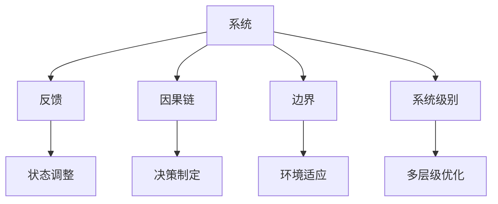

                 

# 拥有体系思维是管理者的必备能力

## 1. 背景介绍

### 1.1 问题由来

在当今复杂多变、快速迭代的技术和商业环境中，管理者面临着越来越多的挑战。从技术架构的构建到产品开发的管理，再到组织流程的优化，管理者需要在不同层面上进行决策和执行。这些任务往往需要跨领域的知识和技能，要求管理者具备系统化的思维和全局观。因此，拥有体系思维成为新时代管理者的必备能力。

### 1.2 问题核心关键点

体系思维（Systems Thinking）是一种系统化的思考方式，旨在通过识别和理解系统中的相互作用和反馈机制，来解决复杂问题。管理者在实践中往往需要构建和运用体系思维，以确保系统性的管理决策和执行。

核心关键点包括：
- **系统交互性**：理解系统内各组成部分之间的相互影响和依赖关系。
- **反馈机制**：识别和分析系统中反馈回路，及时调整策略以应对变化。
- **整体优化**：从全局角度出发，优化系统整体性能而非局部最优。
- **长远视角**：考虑系统在时间和空间上的持续性和适应性。

### 1.3 问题研究意义

1. **提升决策质量**：体系思维帮助管理者全面分析问题，避免片面决策。
2. **增强团队协作**：系统思维强调跨部门协作，促进信息共享和协同工作。
3. **优化资源利用**：通过全局视角优化资源分配，提高整体效率。
4. **应对不确定性**：通过建立系统模型，预测和应对不确定因素，提高管理灵活性。
5. **推动创新**：系统思维鼓励多角度思考，激发新的解决方案和创意。

## 2. 核心概念与联系

### 2.1 核心概念概述

为了更好地理解体系思维在管理中的应用，本节将介绍几个关键概念：

- **系统**：由若干相互依赖的元素组成的整体，具有特定的功能。
- **反馈**：系统内信息或信号的循环流动，影响系统的状态和行为。
- **因果链**：系统内各部分之间的因果关系链条，是系统交互的基础。
- **边界**：系统与外部环境的界线，影响系统的稳定性和适应性。
- **系统级别**：从个体到组织、从企业到社会的多层级结构。

### 2.2 概念间的关系

这些核心概念之间的逻辑关系可以通过以下Mermaid流程图来展示：



这个流程图展示了系统思维的各个要素及其相互关系：

1. **系统**通过**因果链**相互作用，由**反馈**机制调整状态，受**边界**影响，在不同**系统级别**上进行优化。

### 2.3 核心概念的整体架构

最后，我们用一个综合的流程图来展示这些核心概念在系统思维中的整体架构：


## 3. 核心算法原理 & 具体操作步骤

### 3.1 算法原理概述

体系思维在管理中的应用主要体现在以下几个方面：

- **系统分析**：识别和理解系统中各组成部分及其相互作用。
- **反馈优化**：通过分析反馈机制，及时调整策略和决策。
- **因果链管理**：识别和管理系统中的因果链条，确保各部分协同工作。
- **边界适应**：处理系统与环境的交互，提升系统适应性。
- **多层级优化**：从不同层级角度出发，优化系统整体性能。

### 3.2 算法步骤详解

基于体系思维的管理决策和执行通常包括以下几个关键步骤：

**Step 1: 系统定义与分析**
- 明确系统的目标和边界，列出系统中各组成部分及其相互作用。
- 使用因果图或流程图等工具，可视化系统的结构。
- 识别系统中的关键反馈回路和影响因素。

**Step 2: 反馈机制分析**
- 分析系统内反馈回路，评估其影响和作用。
- 根据反馈信息调整决策，优化系统行为。
- 使用模型预测系统状态变化，提前应对潜在问题。

**Step 3: 因果链管理**
- 明确系统内各部分之间的因果关系。
- 制定和实施措施，优化因果链，提升系统效率。
- 定期检查因果链的稳定性，及时修正偏差。

**Step 4: 边界适应**
- 分析系统与外部环境的界面，识别潜在威胁和机会。
- 设计策略，调整系统边界，增强适应性。
- 持续监测环境变化，动态调整系统策略。

**Step 5: 多层级优化**
- 从个体、团队、部门到组织的多层级视角，优化系统性能。
- 制定跨层级的协同策略，促进信息共享和协同工作。
- 使用系统级指标，衡量整体绩效，确保目标一致。

### 3.3 算法优缺点

体系思维在管理中的应用具有以下优点：

1. **全面视角**：通过系统分析，管理者能够全面理解问题的各个方面，避免片面决策。
2. **协同合作**：强调跨部门协作，促进信息共享和协同工作，提高团队效率。
3. **适应性强**：通过反馈机制和边界适应，系统能够快速响应外部变化，提升适应性。
4. **持续优化**：从多层级视角出发，优化系统整体性能，提升整体效益。

同时，体系思维也存在一定的局限性：

1. **复杂度高**：系统思维要求对系统有深入理解和分析，对管理者提出了较高要求。
2. **实施难度大**：跨层级协同和动态调整需要协调复杂的关系，实施难度较大。
3. **数据需求高**：系统分析需要大量的数据和信息，数据获取和管理成本较高。
4. **理论要求高**：需要具备系统的理论知识，才能准确识别和应用系统思维。

尽管存在这些局限性，但体系思维在现代管理中的应用日益广泛，成为管理实践中的重要工具。

### 3.4 算法应用领域

体系思维在管理中的应用广泛，涵盖多个领域，包括但不限于：

1. **技术架构管理**：识别和优化系统组件之间的依赖关系，提升技术架构的稳定性和可扩展性。
2. **产品开发管理**：从全流程视角，优化产品开发各阶段的工作，提升产品交付速度和质量。
3. **组织流程优化**：分析组织内部的流程和机制，提升资源利用效率，降低运营成本。
4. **项目管理**：通过系统思维，全面分析项目风险和机会，优化项目管理流程。
5. **组织文化建设**：识别和优化组织内部的文化因素，提升员工凝聚力和组织绩效。

## 4. 数学模型和公式 & 详细讲解 & 举例说明

### 4.1 数学模型构建

体系思维在数学上可以通过系统动力学模型（System Dynamics Model）来表达。系统动力学模型是一种描述系统动态行为的数学模型，通过反馈环路、因果链等结构来分析系统的行为和响应。

定义系统状态变量 $x(t)$，系统输入 $u(t)$，系统输出 $y(t)$，系统方程为：

$$
\dot{x}(t) = f(x(t), u(t), p(t))
$$

其中，$f$ 为系统动态函数，$u(t)$ 和 $p(t)$ 为输入和参数。

系统动力学模型中的关键概念包括：

- **状态变量**：描述系统当前状态的量。
- **输入变量**：影响系统状态的量。
- **输出变量**：系统对外部的作用量。
- **参数**：系统固有的特性量。

### 4.2 公式推导过程

考虑一个简单的控制系统，其状态方程为：

$$
\dot{x}(t) = a_1 x(t) + a_2 u(t) + a_3
$$

其中 $a_1, a_2, a_3$ 为系统参数。

假设 $u(t) = k_1 x(t) + k_2 x(t-1)$，即系统输入为状态变量和滞后一期的状态变量的线性组合。

将 $u(t)$ 代入状态方程，得：

$$
\dot{x}(t) = a_1 x(t) + a_2 (k_1 x(t) + k_2 x(t-1)) + a_3
$$

化简得：

$$
\dot{x}(t) = (a_1 + k_2) x(t) + (a_2 k_1) x(t-1) + a_3
$$

这是一个一阶线性差分方程，其解为：

$$
x(t) = e^{(a_1 + k_2)t} [x(0) + \frac{a_3}{a_1 + k_2}] + \frac{a_2 k_1}{a_1 + k_2} e^{(a_1 + k_2)(t-1)} x(1) + \frac{a_2 k_1}{a_1 + k_2} e^{(a_1 + k_2)(t-1)} e^{(a_1 + k_2)}
$$

通过这个例子，我们可以看到系统动力学模型如何通过数学表达式描述系统的动态行为，并分析系统的稳定性和响应特性。

### 4.3 案例分析与讲解

考虑一个企业的生产系统，其生产效率受多个因素影响，包括原材料供应、设备状态、员工技能等。

- **状态变量**：当前生产量 $x_1(t)$、库存量 $x_2(t)$、设备状态 $x_3(t)$。
- **输入变量**：原材料供应量 $u_1(t)$、设备维护费用 $u_2(t)$、员工培训投入 $u_3(t)$。
- **输出变量**：产品产出量 $y(t)$、产品合格率 $y_1(t)$、设备故障率 $y_2(t)$。

系统的状态方程可以表示为：

$$
\begin{align*}
\dot{x}_1(t) &= f_{11} x_1(t) + f_{12} x_2(t) + f_{13} x_3(t) + f_{14} u_1(t) + f_{15} u_2(t) + f_{16} u_3(t) \\
\dot{x}_2(t) &= f_{21} x_1(t) + f_{22} x_2(t) + f_{23} x_3(t) + f_{24} u_1(t) + f_{25} u_2(t) + f_{26} u_3(t) \\
\dot{x}_3(t) &= f_{31} x_1(t) + f_{32} x_2(t) + f_{33} x_3(t) + f_{34} u_1(t) + f_{35} u_2(t) + f_{36} u_3(t)
\end{align*}
$$

其中 $f_{ij}$ 为系统参数。

通过对系统进行建模和分析，可以识别出系统中的关键反馈回路，如原材料供应不足导致生产量下降，设备故障影响生产效率等。管理者可以根据这些反馈回路，制定相应的优化策略，如增加原材料库存、加强设备维护等，提升生产系统的整体性能。

## 5. 项目实践：代码实例和详细解释说明

### 5.1 开发环境搭建

在进行体系思维实践前，我们需要准备好开发环境。以下是使用Python进行系统动力学建模的环境配置流程：

1. 安装Anaconda：从官网下载并安装Anaconda，用于创建独立的Python环境。

2. 创建并激活虚拟环境：
```bash
conda create -n system_dynamics_env python=3.8 
conda activate system_dynamics_env
```

3. 安装Sympy和SciPy：
```bash
conda install sympy scipy
```

4. 安装Jupyter Notebook：
```bash
conda install jupyterlab
```

5. 安装Laboratory和其他必要的工具包：
```bash
pip install sympy scipy jupyterlab Laboratory
```

完成上述步骤后，即可在`system_dynamics_env`环境中开始体系思维实践。

### 5.2 源代码详细实现

这里我们以一个简单的生产系统为例，使用Sympy库进行系统动力学建模和仿真。

首先，定义系统的状态变量和输入变量：

```python
import sympy as sp
import sympy.abc as abc

x1, x2, x3 = abc.symbols('x1 x2 x3')
u1, u2, u3 = abc.symbols('u1 u2 u3')

# 系统状态方程
x1_dot = a1 * x1 + a2 * u1 + a3
x2_dot = b1 * x1 + b2 * u2 + b3
x3_dot = c1 * x1 + c2 * u3 + c3

# 系统输出方程
y = x1
y1 = x2
y2 = x3
```

然后，使用Sympy求解系统状态方程的解：

```python
# 求解系统状态方程
sol = sp.odeint(lambda x: [x1_dot, x2_dot, x3_dot], [x1, x2, x3], sp.symbols('t'), tfirst=True)
```

最后，进行系统仿真和输出分析：

```python
import matplotlib.pyplot as plt

# 模拟100个时间单位
t = sp.symbols('t')
t_values = sp.linspace(0, 100, 1000)

# 初始状态
x1_init = 100
x2_init = 50
x3_init = 0.8

# 输入变量
u1_init = 5
u2_init = 0
u3_init = 0.1

# 仿真系统行为
sol = sp.odeint(lambda x: [x1_dot, x2_dot, x3_dot], [x1_init, x2_init, x3_init], t_values, tfirst=True)

# 输出结果
plt.plot(t_values, sol[0])
plt.plot(t_values, sol[1])
plt.plot(t_values, sol[2])
plt.xlabel('Time')
plt.ylabel('System State')
plt.title('System Dynamics Simulation')
plt.show()
```

以上就是使用Sympy库进行系统动力学建模和仿真的完整代码实现。可以看到，Sympy提供了强大的符号计算和微分方程求解功能，使得系统动力学建模和分析变得相对容易。

### 5.3 代码解读与分析

让我们再详细解读一下关键代码的实现细节：

**状态方程定义**：
- 使用Sympy的符号计算功能，定义状态方程中的各变量和参数。
- 使用lambda表达式，将状态方程转化为微分方程的形式。

**求解状态方程**：
- 使用`odeint`函数，对状态方程进行求解，得到系统状态随时间的变化。

**仿真分析**：
- 使用`sp.linspace`生成时间序列。
- 初始状态和输入变量的赋值。
- 使用`solve`函数对状态方程进行仿真，得到系统行为随时间的变化。
- 使用Matplotlib进行可视化输出，展示系统的变化过程。

**仿真结果分析**：
- 通过可视化展示系统状态随时间的变化，可以帮助管理者理解系统行为，发现潜在问题。

## 6. 实际应用场景

### 6.1 智能制造系统

体系思维在智能制造系统中的应用，可以显著提升生产系统的效率和灵活性。通过系统分析和反馈优化，智能制造系统能够自适应环境变化，快速响应生产需求。

例如，一个智能工厂可以通过分析生产线的各个环节，识别出关键反馈回路，如原材料供应不足导致生产延误，设备故障影响生产效率等。系统可以自动调整原材料库存、优化设备维护计划等，确保生产系统的稳定和高效。

### 6.2 项目管理

体系思维在项目管理中的应用，能够帮助项目经理全面分析项目的各个方面，优化项目流程，提升项目管理效率。

例如，通过系统分析，项目经理可以识别出项目的各个依赖关系和关键路径，制定更合理的项目计划。通过反馈机制，项目经理可以及时发现项目中的风险和问题，进行相应的调整和优化。

### 6.3 组织文化建设

体系思维在组织文化建设中的应用，可以帮助企业管理者系统性地分析组织内部的文化和行为，提升员工凝聚力和组织绩效。

例如，通过系统分析，企业管理者可以识别出组织内部的关键反馈回路，如绩效评估机制对员工行为的影响，团队合作对项目绩效的影响等。系统可以自动调整相关机制，促进员工的积极性和组织的协同工作。

## 7. 工具和资源推荐

### 7.1 学习资源推荐

为了帮助管理者系统掌握体系思维的理论基础和实践技巧，这里推荐一些优质的学习资源：

1. 《系统动力学入门》系列博文：由系统动力学专家撰写，深入浅出地介绍了系统动力学的基本概念和应用方法。

2. CS224N《系统动力学》课程：麻省理工学院开设的高级课程，涵盖了系统动力学模型、仿真、优化等重要内容，适合深入学习。

3. 《系统思维导论》书籍：系统思维领域的经典之作，全面介绍了系统思维的基本原理和应用方法。

4. MIT Sloan Management Review：系统思维在管理中的应用案例，提供了丰富的实践经验和理论指导。

5. JSTOR上的系统思维论文：JSTOR收录了大量关于系统思维的经典论文，涵盖多个领域的应用和研究。

通过对这些资源的学习实践，相信管理者一定能够全面掌握体系思维的精髓，并用于解决实际的系统管理问题。

### 7.2 开发工具推荐

高效的开发离不开优秀的工具支持。以下是几款用于系统动力学建模和分析的工具：

1. Simulink：由MathWorks开发的系统仿真工具，支持复杂系统的建模和分析。

2. AnyLogic：由AnyLogic Software开发的离散事件仿真工具，适合于各类系统仿真和优化。

3. PTC Mathcad：PTC开发的符号计算和工程分析工具，支持系统建模和仿真。

4. Python+Sympy和SciPy：Python语言结合Sympy和SciPy，可以进行高效的系统建模和分析。

5. MATLAB：由MathWorks开发的编程语言和环境，支持系统建模和仿真。

合理利用这些工具，可以显著提升系统动力学建模和分析的效率，加快创新迭代的步伐。

### 7.3 相关论文推荐

系统思维在理论和实践方面都有许多经典的研究，以下是几篇奠基性的相关论文，推荐阅读：

1. "System Dynamics: A Unified Approach for Designing the Organizations of the Future"（《系统动力学：未来组织的统一设计方法》）：由Jay W. Forrester所著，系统动力学领域的经典之作，阐述了系统动态建模和分析的基本原理。

2. "Understanding System Dynamics"（《理解系统动力学》）：由Jay W. Forrester和Michael S. Gabler所著，系统动力学领域的入门教材，涵盖了系统动力学模型、仿真和优化等重要内容。

3. "Learning from Theories in Systems Thinking and Practice"（《从系统思维和实践中学习》）：由Johan Wackernagel和Fionauma著，探讨了系统思维在实际管理中的应用案例和方法。

4. "The Dynamics of Organizations: A Systemic View of Management"（《组织动力学：系统视角下的管理》）：由Marvin S. Weick所著，探讨了组织内部的系统动力学和行为规律。

5. "Systems Thinking and Human Systems Dynamics: Past, Present and Future"（《系统思维与人类系统动力学：过去、现在和未来》）：由Johan Wackernagel和Fionauma著，探讨了系统思维的发展历程和未来趋势。

这些论文代表了大系统思维的研究脉络，通过学习这些前沿成果，可以帮助管理者把握学科前进方向，激发更多的创新灵感。

除上述资源外，还有一些值得关注的前沿资源，帮助管理者紧跟系统思维的最新进展，例如：

1. arXiv论文预印本：人工智能领域最新研究成果的发布平台，包括大量尚未发表的前沿工作，学习前沿技术的必读资源。

2. 业界技术博客：如GE、BP、Shell等顶尖企业的系统动力学实践案例，展示了系统思维在实际应用中的成功经验和挑战。

3. 技术会议直播：如System Dynamics Conference、ISetSEM会议现场或在线直播，能够聆听到专家的前沿分享，开拓视野。

4. GitHub热门项目：在GitHub上Star、Fork数最多的系统动力学相关项目，往往代表了该技术领域的发展趋势和最佳实践，值得去学习和贡献。

5. 行业分析报告：各大咨询公司如McKinsey、PwC等针对系统思维的行业分析报告，有助于从商业视角审视技术趋势，把握应用价值。

总之，对于系统思维的学习和实践，需要管理者保持开放的心态和持续学习的意愿。多关注前沿资讯，多动手实践，多思考总结，必将收获满满的成长收益。

## 8. 总结：未来发展趋势与挑战

### 8.1 总结

本文对体系思维在管理中的应用进行了全面系统的介绍。首先阐述了体系思维的研究背景和意义，明确了体系思维在管理决策和执行中的独特价值。其次，从原理到实践，详细讲解了体系思维的数学模型和关键步骤，给出了体系思维任务开发的完整代码实例。同时，本文还广泛探讨了体系思维在智能制造、项目管理、组织文化建设等多个领域的应用前景，展示了体系思维的广阔应用空间。最后，本文精选了体系思维的学习资源，力求为管理者提供全方位的技术指引。

通过本文的系统梳理，可以看到，体系思维在现代管理中的应用日益广泛，成为管理实践中的重要工具。系统思维要求管理者具备系统化的视角和全局观，通过识别和分析系统中的相互作用和反馈机制，来解决复杂问题。管理者在实践中往往需要构建和运用体系思维，以确保系统性的管理决策和执行。

### 8.2 未来发展趋势

展望未来，体系思维在管理中的应用将呈现以下几个发展趋势：

1. **数据驱动的优化**：随着数据科学和机器学习技术的发展，体系思维将更多地依赖数据驱动的优化，提升决策的科学性和精度。

2. **跨学科融合**：体系思维将与其他学科，如工程学、心理学、社会学等进行更深入的融合，拓展其应用范围和深度。

3. **智能技术的应用**：体系思维将与人工智能技术结合，如系统动力学与优化、强化学习等，实现更加智能化和自动化。

4. **持续学习和动态调整**：体系思维将更多地强调持续学习和动态调整，提升系统的适应性和灵活性。

5. **多方协同与合作**：体系思维将更多地强调多方协同与合作，促进信息共享和协同工作，提升整体绩效。

以上趋势凸显了体系思维在现代管理中的应用前景，展示了其在系统管理中的重要价值。

### 8.3 面临的挑战

尽管体系思维在管理中的应用日益广泛，但在迈向更加智能化、普适化应用的过程中，它仍面临着诸多挑战：

1. **数据获取难度**：高质量、全面、及时的数据获取是体系思维应用的基础，但在实际应用中往往存在数据不足或数据质量不高的问题。

2. **模型复杂性**：体系思维模型往往较为复杂，难以理解和构建，对管理者的要求较高。

3. **跨学科合作**：体系思维的应用需要跨学科的合作，而不同学科之间的沟通和协作可能存在障碍。

4. **动态调整难度**：体系思维模型需要动态调整以适应环境变化，但调整的策略和方法需要精心设计和实施。

5. **技术与实践结合**：体系思维的理论与实践结合需要更多的研究和实践积累，才能更好地应用于实际管理中。

尽管存在这些挑战，但体系思维在现代管理中的应用前景广阔，成为管理者解决复杂问题的有力工具。

### 8.4 研究展望

面对体系思维面临的挑战，未来的研究需要在以下几个方面寻求新的突破：

1. **数据驱动的体系建模**：探索如何利用大数据和机器学习技术，简化体系建模过程，提高模型的精度和实用性。

2. **多学科整合与协同**：加强跨学科的整合与协同，提升体系思维的广度和深度，解决复杂问题。

3. **智能化的体系优化**：结合人工智能技术，实现体系模型的自动化优化，提升系统的智能化水平。

4. **动态调整与持续学习**：开发动态调整策略，提升体系的适应性和灵活性，促进持续学习。

5. **技术应用与实践结合**：加强技术与实践的结合，通过实际案例和应用经验，推动体系思维的广泛应用。

这些研究方向的探索，必将引领体系思维在管理中的应用迈向更高的台阶，为系统管理提供更全面、更高效的工具和方法。

## 9. 附录：常见问题与解答

**Q1：什么是体系思维？**

A: 体系思维是一种系统化的思考方式，通过识别和理解系统中的相互作用和反馈机制，来解决复杂问题。它要求管理者具备全局视角和系统化的思维，通过系统分析、反馈优化、因果链管理、边界适应和多层级优化等步骤，实现整体绩效的提升。

**Q2：体系思维在管理中的应用有哪些？**

A: 体系思维在管理中的应用广泛，涵盖技术架构管理、产品开发管理、组织流程优化、项目管理、组织文化建设等多个领域。通过系统分析和反馈优化，提升管理决策的科学性和执行的效率。

**Q3：如何构建一个有效的体系思维模型？**

A: 构建一个有效的体系思维模型需要以下步骤：
1. 定义系统的目标和边界，列出系统中各组成部分及其相互作用。
2. 使用因果图或流程图等工具，可视化系统的结构。
3. 识别系统内关键反馈回路和影响因素。
4. 分析系统内的因果链条，优化因果关系。
5. 处理系统与环境的交互，增强系统的适应性。
6. 从多层级视角出发，

