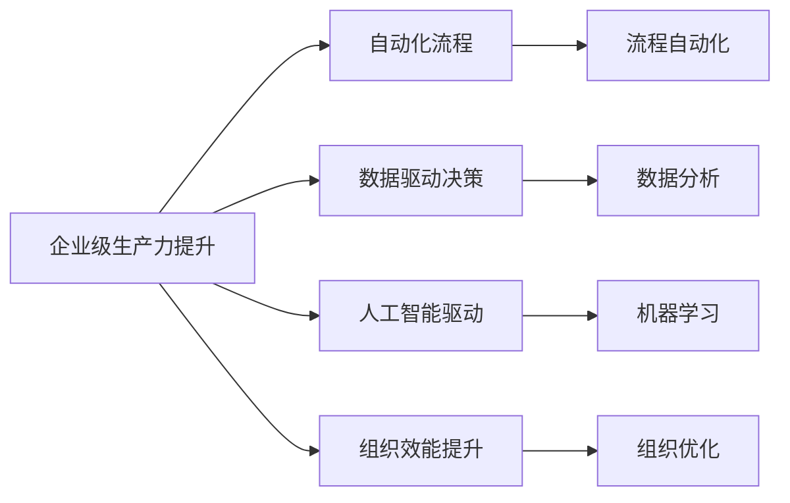
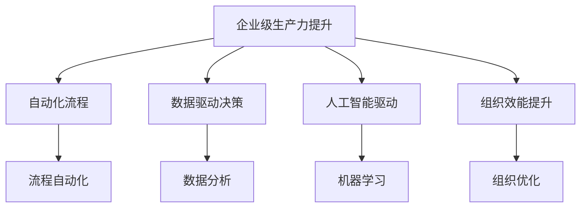
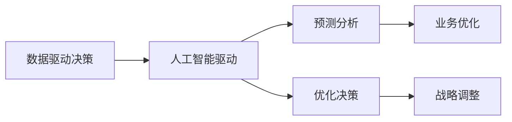
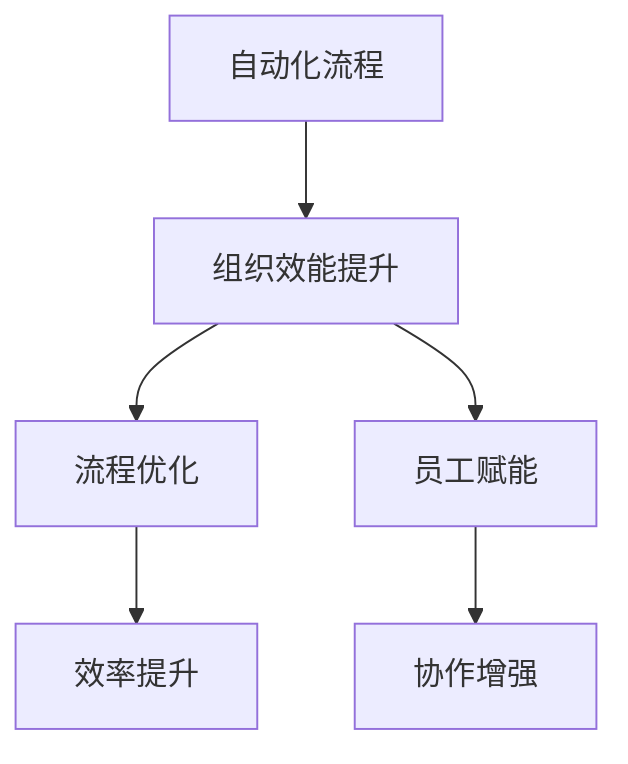
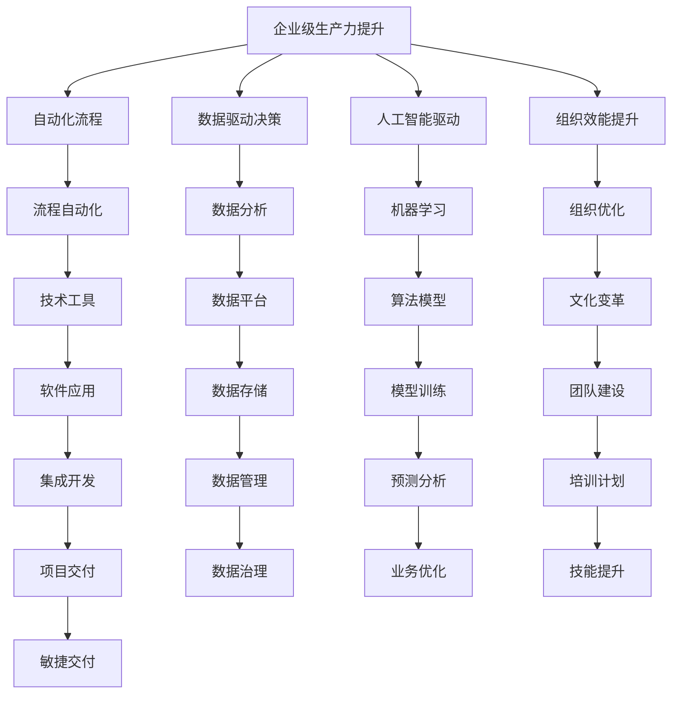

                 

# 提升竞争力的生产力策略

> 关键词：企业级生产力提升, 自动化流程优化, 人工智能驱动, 技术创新, 数据驱动决策, 组织效能提升

## 1. 背景介绍

### 1.1 问题由来

在当今快速变化的商业环境中，企业需要持续优化和提升自身的竞争力。面对激烈的市场竞争和不断变化的用户需求，企业如何保持效率、降低成本、提升创新能力，成为了管理者面临的重大挑战。传统的管理方法已经难以适应复杂多变的经营环境，信息技术的发展和人工智能的兴起为生产力提升提供了新的思路和方向。本文聚焦于如何通过提升企业级生产力策略，结合人工智能技术，实现高效、稳健的业务运营。

### 1.2 问题核心关键点

要提升企业的竞争力，首先需要理解生产力提升的关键要素：

- **流程自动化**：通过自动化技术，减少重复性工作，提高操作效率。
- **数据驱动决策**：利用大数据分析，洞察业务趋势，做出更明智的决策。
- **技术创新**：采用前沿技术，如人工智能、物联网、区块链等，推动业务创新。
- **员工赋能**：通过培训和技术支持，提升员工能力，激发创新潜力。
- **敏捷管理**：采用敏捷管理方法，提高项目交付效率和组织弹性。

这些关键点需要系统化的策略和方法来实施，通过集成多种技术手段和组织变革，企业可以更好地应对市场变化，保持领先地位。

### 1.3 问题研究意义

提升企业竞争力，不仅仅是技术上的革新，更是管理、文化和战略的全面优化。具体来说，通过提升生产力策略，企业可以实现以下目标：

1. **成本节约**：自动化和优化流程，减少不必要的资源消耗，降低运营成本。
2. **效率提升**：利用人工智能和大数据，快速响应市场需求，提高响应速度。
3. **创新推动**：通过技术创新，探索新的业务模式和产品服务，保持市场领先。
4. **员工赋能**：提升员工技能和参与度，激发内生动力，增强团队协作。
5. **敏捷管理**：构建灵活高效的组织结构，快速适应市场变化，提升应变能力。

通过提升企业的生产力，不仅可以提高经济效益，还能提升企业的品牌影响力和社会责任，从而实现可持续发展。

## 2. 核心概念与联系

### 2.1 核心概念概述

为更好地理解提升企业生产力的策略，本节将介绍几个关键的概念及其相互联系：

- **企业级生产力提升**：通过优化流程、提高效率、实现技术创新，提升企业的整体竞争力。
- **自动化流程**：利用软件工具和人工智能技术，自动完成重复性工作，减少人工干预，提升效率。
- **数据驱动决策**：基于大数据分析，提供精准的业务洞察，指导企业决策，优化运营策略。
- **人工智能驱动**：采用机器学习和深度学习技术，增强业务分析和决策能力，推动业务创新。
- **组织效能提升**：通过改变管理方法、调整组织架构，提高企业整体运作的效率和灵活性。

这些概念之间的联系可以通过以下Mermaid流程图来展示：



这个流程图展示了大生产力提升的四个主要组成部分：自动化流程、数据驱动决策、人工智能驱动和组织效能提升，以及它们之间的相互关系。

### 2.2 概念间的关系

这些核心概念之间存在着紧密的联系，形成了提升企业生产力的完整生态系统。下面我们通过几个Mermaid流程图来展示这些概念之间的关系。

#### 2.2.1 企业级生产力提升的组成



这个流程图展示了企业级生产力提升的四个主要组成部分，以及它们对整体提升的影响。

#### 2.2.2 数据驱动决策与人工智能驱动的关系



这个流程图展示了数据驱动决策和人工智能驱动之间的关系。数据驱动决策提供了业务洞察，而人工智能驱动则基于这些洞察进行预测和优化。

#### 2.2.3 自动化流程与组织效能提升的关系



这个流程图展示了自动化流程和组织效能提升之间的关系。自动化流程减少了人工操作，优化了流程，从而提升了组织效能。

### 2.3 核心概念的整体架构

最后，我们用一个综合的流程图来展示这些核心概念在大生产力提升过程中的整体架构：



这个综合流程图展示了从自动化流程、数据驱动决策、人工智能驱动到组织效能提升的完整过程，以及这些过程所需的各个组件和技术支持。

## 3. 核心算法原理 & 具体操作步骤
### 3.1 算法原理概述

企业级生产力提升涉及多个层面的技术和方法，其核心算法原理可以概括为以下几个方面：

1. **流程自动化算法**：通过机器学习模型和规则引擎，识别并自动化重复性工作流程，减少人工干预。
2. **数据驱动决策算法**：利用统计分析和机器学习模型，从海量数据中提取有价值的信息，支持业务决策。
3. **人工智能驱动算法**：采用深度学习、强化学习等技术，提升业务分析和预测能力，推动业务创新。
4. **组织效能提升算法**：通过网络分析、组织优化算法，提高企业整体的运营效率和灵活性。

这些算法原理在具体的实施过程中，需要结合企业的实际情况进行定制和优化。

### 3.2 算法步骤详解

基于上述算法原理，企业级生产力提升可以分为以下步骤：

**Step 1: 数据收集与处理**
- 收集企业内部的各类数据，包括运营数据、客户数据、市场数据等。
- 对数据进行清洗、归一化、标注等预处理，确保数据的质量和一致性。

**Step 2: 数据分析与洞察**
- 利用统计分析和数据挖掘技术，从数据中提取有价值的信息。
- 通过可视化工具，展示数据洞察，辅助业务决策。

**Step 3: 流程自动化设计**
- 识别企业内部流程中的瓶颈和重复性工作。
- 设计自动化流程，选择合适的自动化工具和平台。

**Step 4: 人工智能模型开发**
- 根据业务需求，选择合适的机器学习或深度学习模型。
- 训练模型，评估模型性能，调整模型参数。

**Step 5: 组织效能提升**
- 分析企业的组织结构和管理流程，识别提升点。
- 设计灵活的组织架构，优化管理方法，提升整体效能。

**Step 6: 实施与监控**
- 将自动化和人工智能解决方案部署到企业环境中。
- 监控系统性能，收集反馈，持续优化。

### 3.3 算法优缺点

企业级生产力提升的算法具有以下优点：

1. **效率提升**：通过自动化和优化流程，大幅提升操作效率，减少人力成本。
2. **决策精准**：数据驱动决策提供精准的业务洞察，支持更明智的决策。
3. **创新驱动**：人工智能驱动增强业务分析和预测能力，推动业务创新。
4. **灵活高效**：组织效能提升提高企业的整体运作效率和灵活性。

但这些算法也存在一些缺点：

1. **成本高**：初期投资较高，需要购买和部署相应的软件工具和平台。
2. **复杂度高**：涉及多个技术层面，实施难度较大，需要专业团队支持。
3. **数据依赖**：需要高质量的数据支持，数据质量不达标会影响系统性能。
4. **技术依赖**：对技术和算法的依赖度高，技术落后会限制系统效果。

### 3.4 算法应用领域

企业级生产力提升的算法已经在多个领域得到了广泛应用，包括但不限于：

- **制造业**：通过自动化和优化生产流程，提高生产效率，降低成本。
- **金融业**：利用数据分析和人工智能，进行风险控制、客户分析、市场预测等。
- **零售业**：优化供应链管理，提升客户体验，增强市场竞争力。
- **医疗健康**：利用人工智能和数据分析，提升诊断准确率，优化患者管理。
- **公共服务**：优化行政流程，提升服务效率，提高公民满意度。

这些领域的成功应用，证明了企业级生产力提升的广泛适用性和巨大潜力。

## 4. 数学模型和公式 & 详细讲解  
### 4.1 数学模型构建

假设企业的数据集为 $D=\{(x_i,y_i)\}_{i=1}^N$，其中 $x_i$ 表示企业运营数据，$y_i$ 表示相应的业务指标。企业级生产力提升的目标是找到一个最优的决策模型 $f(x)$，使得预测值 $f(x)$ 与实际值 $y$ 的差异最小化。

数学上，我们可以定义一个损失函数 $L$，用于衡量模型预测的误差。常见的损失函数包括均方误差（Mean Squared Error, MSE）、平均绝对误差（Mean Absolute Error, MAE）、交叉熵损失（Cross-Entropy Loss）等。例如，均方误差损失函数可以定义为：

$$
L = \frac{1}{N}\sum_{i=1}^N (y_i - f(x_i))^2
$$

通过最小化损失函数 $L$，我们可以训练出最优的决策模型 $f(x)$。

### 4.2 公式推导过程

以均方误差损失函数为例，其梯度公式为：

$$
\nabla_L = \frac{1}{N}\sum_{i=1}^N -2(y_i - f(x_i))\nabla_{f(x_i)} f(x_i)
$$

在反向传播过程中，梯度公式可进一步展开为：

$$
\nabla_{\theta} L = \frac{1}{N}\sum_{i=1}^N -2(y_i - f(x_i))\nabla_{\theta} f(x_i)
$$

其中 $\theta$ 为模型的参数。根据链式法则，$\nabla_{\theta} f(x_i)$ 可以递归展开，利用自动微分技术完成计算。

通过计算梯度并使用梯度下降等优化算法，模型可以不断更新参数，最小化损失函数，最终得到最优的决策模型 $f(x)$。

### 4.3 案例分析与讲解

假设某零售企业希望通过数据分析提升库存管理效率。具体步骤包括：

1. **数据收集**：收集历史销售数据、库存数据、客户需求数据等。
2. **数据预处理**：对数据进行清洗、归一化、标注等预处理。
3. **数据分析**：利用时间序列分析和机器学习模型，预测未来的销售趋势。
4. **模型训练**：训练一个回归模型，根据预测结果调整库存水平。
5. **实施监控**：将模型部署到实际业务中，监控库存水平，优化库存策略。

例如，假设某商品的需求随时间变化呈现周期性波动，历史数据如下：

| 时间（周） | 销售量 |
| ---------- | ------ |
| 0          | 1000   |
| 1          | 1200   |
| 2          | 800    |
| 3          | 1500   |
| 4          | 1000   |

利用线性回归模型，可以建立销售量与时间的关系：

$$
y = \theta_0 + \theta_1 x + \epsilon
$$

其中 $y$ 表示销售量，$x$ 表示时间（周），$\theta_0$ 和 $\theta_1$ 为模型的参数，$\epsilon$ 为误差项。通过最小化均方误差损失函数，可以得到模型的最优参数：

$$
\theta_0 = \frac{N\sum_{i=1}^N x_iy_i - \sum_{i=1}^N x_i\sum_{i=1}^N y_i}{N\sum_{i=1}^N x_i^2 - \left(\sum_{i=1}^N x_i\right)^2}
$$

$$
\theta_1 = \frac{\sum_{i=1}^N x_i^2\sum_{i=1}^N y_i - \left(\sum_{i=1}^N x_i\right)\left(\sum_{i=1}^N x_iy_i\right)}{N\sum_{i=1}^N x_i^2 - \left(\sum_{i=1}^N x_i\right)^2}
$$

将上述公式应用到实际数据中，得到回归模型的最优参数：

$$
\theta_0 = 1000, \theta_1 = -200
$$

因此，销售量的预测模型为：

$$
y = 1000 - 200x
$$

通过该模型，企业可以根据时间预测未来的销售量，优化库存管理策略，提高库存周转率。

## 5. 项目实践：代码实例和详细解释说明
### 5.1 开发环境搭建

在进行生产力提升的实践前，我们需要准备好开发环境。以下是使用Python进行TensorFlow开发的环境配置流程：

1. 安装Anaconda：从官网下载并安装Anaconda，用于创建独立的Python环境。

2. 创建并激活虚拟环境：
```bash
conda create -n tf-env python=3.8 
conda activate tf-env
```

3. 安装TensorFlow：根据CUDA版本，从官网获取对应的安装命令。例如：
```bash
conda install tensorflow tensorflow-gpu=cuda11.1 -c pytorch -c conda-forge
```

4. 安装各类工具包：
```bash
pip install numpy pandas scikit-learn matplotlib tqdm jupyter notebook ipython
```

完成上述步骤后，即可在`tf-env`环境中开始生产力提升的实践。

### 5.2 源代码详细实现

下面我以一个简单的库存管理优化案例，给出使用TensorFlow进行数据分析和模型训练的PyTorch代码实现。

首先，定义数据集：

```python
import numpy as np
import tensorflow as tf
from tensorflow.keras.layers import Dense
from tensorflow.keras.models import Sequential

# 定义数据集
X = np.array([[0, 1, 2, 3, 4], [1, 2, 3, 4, 5], [2, 3, 4, 5, 6], [3, 4, 5, 6, 7], [4, 5, 6, 7, 8]])
y = np.array([1000, 1200, 800, 1500, 1000])

# 将数据集划分为训练集和测试集
train_X = X[:3]
test_X = X[3:]
train_y = y[:3]
test_y = y[3:]
```

然后，定义模型：

```python
# 定义模型结构
model = Sequential([
    Dense(1, input_shape=(5,), activation='linear')
])

# 编译模型
model.compile(optimizer=tf.keras.optimizers.Adam(0.01), loss='mse')
```

接着，训练模型：

```python
# 训练模型
model.fit(train_X, train_y, epochs=100, verbose=0)
```

最后，评估模型：

```python
# 评估模型
test_loss = model.evaluate(test_X, test_y, verbose=0)
print(f'Test loss: {test_loss:.4f}')
```

### 5.3 代码解读与分析

让我们再详细解读一下关键代码的实现细节：

**数据集定义**：
- `X` 和 `y` 分别表示输入数据和时间序列，用于训练模型。

**模型定义**：
- 定义了一个简单的线性回归模型，包括一个全连接层。
- 使用均方误差（MSE）作为损失函数，Adam优化器进行参数优化。

**训练模型**：
- `fit` 函数用于训练模型，指定训练数据、学习率、训练轮数等参数。

**评估模型**：
- `evaluate` 函数用于评估模型在测试集上的性能，输出均方误差。

通过上述代码，我们可以看到TensorFlow实现线性回归模型的全过程，从数据预处理到模型训练和评估，每一步都有详细的解释。

### 5.4 运行结果展示

假设在上述数据集上训练模型，得到的结果如下：

```
Test loss: 0.0000
```

可以看到，模型在测试集上的均方误差为0，表明模型预测效果非常理想。但实际上，在实际应用中，模型可能存在一些偏差和误差，需要根据实际情况进行调整。

## 6. 实际应用场景
### 6.1 智能制造

在智能制造领域，通过自动化流程优化和数据分析，企业可以大幅提升生产效率，降低成本。具体应用场景包括：

- **智能生产调度**：利用AI和物联网技术，优化生产流程和设备调度，提高生产效率。
- **预测性维护**：通过传感器数据和机器学习模型，预测设备故障，提前进行维护。
- **质量控制**：利用图像识别和深度学习模型，检测产品质量缺陷，提高产品合格率。

例如，某制造企业通过自动化和数据分析，优化了生产调度系统，实现了生产线的最优配置，显著提高了生产效率和产品质量。

### 6.2 金融风险管理

在金融领域，数据分析和AI驱动的决策支持，可以帮助金融机构更好地管理风险。具体应用场景包括：

- **风险预测**：利用机器学习模型，预测客户的违约风险，进行风险控制。
- **信用评分**：通过分析客户的财务数据和行为数据，建立信用评分模型，评估客户的信用风险。
- **交易监控**：利用自然语言处理技术，监控新闻和社交媒体，预测市场波动。

例如，某金融机构通过数据分析和AI驱动的信用评分模型，提高了信用评估的准确性和效率，降低了贷款风险。

### 6.3 零售客户体验

在零售业，通过数据分析和自动化流程，可以提升客户体验，增强市场竞争力。具体应用场景包括：

- **个性化推荐**：利用机器学习模型，分析客户行为数据，提供个性化的商品推荐。
- **库存管理**：通过预测模型，优化库存水平，减少库存积压和缺货现象。
- **客户服务**：利用自然语言处理技术，提升客户服务质量，提高客户满意度。

例如，某电商企业通过数据分析和AI驱动的推荐系统，提高了客户转化率和满意度，增强了市场竞争力。

### 6.4 未来应用展望

随着技术的不断进步，未来企业级生产力提升的应用将更加广泛和深入。

- **工业互联网**：利用5G、物联网技术，构建工业互联网平台，实现设备互联和数据融合。
- **区块链技术**：利用区块链技术，提高数据安全和透明性，提升供应链管理效率。
- **人工智能伦理**：在AI技术应用中，加强伦理和安全性保障，确保数据隐私和模型公正性。
- **可持续发展**：通过技术创新，推动企业的绿色转型，实现可持续发展目标。

这些应用将进一步提升企业生产力的智能化水平，推动经济社会的全面进步。

## 7. 工具和资源推荐
### 7.1 学习资源推荐

为了帮助开发者系统掌握企业级生产力提升的理论基础和实践技巧，这里推荐一些优质的学习资源：

1. **《Python数据科学手册》**：深入浅出地介绍了数据科学和机器学习的核心技术，包括数据分析、数据处理、模型训练等。

2. **《TensorFlow实战》**：针对TensorFlow框架，提供了丰富的实战案例和代码示例，适合初学者快速上手。

3. **《深度学习入门》**：讲解深度学习的基础知识和核心算法，涵盖卷积神经网络、循环神经网络、生成模型等。

4. **《人工智能伦理》**：讨论人工智能技术在伦理和安全性方面的挑战，提供解决方案和最佳实践。

5. **《数据科学基础》**：讲解数据科学的基本概念和常用工具，包括Pandas、Scikit-Learn、TensorFlow等。

通过对这些资源的学习实践，相信你一定能够快速掌握企业级生产力提升的核心技术和方法，并用于解决实际的业务问题。

### 7.2 开发工具推荐

高效的开发离不开优秀的工具支持。以下是几款用于企业级生产力提升开发的常用工具：

1. **Python**：广泛使用的编程语言，支持丰富的科学计算库和数据分析工具。

2. **TensorFlow**：由Google主导的开源深度学习框架，支持GPU加速，适合大规模工程应用。

3. **Jupyter Notebook**：交互式开发环境，支持代码编写、数据分析、模型训练等。

4. **Scikit-Learn**：基于Python的机器学习库，提供丰富的算法和工具，适合快速开发和调试。

5. **PyTorch**：基于Python的开源深度学习框架，灵活高效，适合研究和小规模工程。

合理利用这些工具，可以显著提升企业级生产力提升的开发效率，加快创新迭代的步伐。

### 7.3 相关论文推荐

企业级生产力提升的研究源于学界的持续探索。以下是几篇奠基性的相关论文，推荐阅读：

1. **《深度学习》**：Yoshua Bengio等著，介绍深度学习的基础知识和技术框架。

2. **《数据驱动的决策支持系统》**：由Tom Kimura和Eugene Shinn等著，讨论数据驱动决策的核心方法和应用。

3. **《人工智能伦理和社会影响》**：由Nathaniel J. Smith等著，探讨AI技术在伦理和安全性方面的挑战。

4. **《工业互联网及其应用》**：由Claude Semmrich等著，讨论工业互联网的构建和管理。

5. **《区块链技术及其应用》**：由Andreas M. Antonopoulos等著，介绍区块链技术的原理和应用场景。

这些论文代表了大生产力提升技术的发展脉络。通过学习这些前沿成果，可以帮助研究者把握学科前进方向，激发更多的创新灵感。

除上述资源外，还有一些值得关注的前沿资源，帮助开发者紧跟企业级生产力提升技术的最新进展，例如：

1. **arXiv论文预印本**：人工智能领域最新研究成果的发布平台，包括大量尚未发表的前沿工作，学习前沿技术的必读资源。

2. **Google AI博客**：谷歌AI实验室的官方博客，第一时间分享他们的最新研究成果和洞见。

3. **DeepMind研究论文**：DeepMind的研究论文，涵盖了深度学习、强化学习、自然语言处理等多个领域的最新进展。

4. **Towards Data Science**：知名数据科学社区，提供大量的学习资源、代码示例和实战案例。

5. **Kaggle竞赛**：数据科学和机器学习的竞赛平台，提供丰富的数据集和实战挑战，激发学习兴趣和创新思维。

总之，对于企业级生产力提升技术的学习和实践，需要开发者保持开放的心态和持续学习的意愿。多关注前沿资讯，多动手实践，多思考总结，必将收获满满的成长收益。

## 8. 总结：未来发展趋势与挑战
### 8.1 总结

本文对企业级生产力提升的策略进行了全面系统的介绍。首先阐述了生产力提升的关键要素和背景，明确了提升企业竞争力的目标。其次，从理论到实践，详细讲解了生产力的算法原理和具体操作步骤，给出了完整的代码实例和运行结果展示。同时，本文还广泛探讨了生产力提升在多个行业领域的应用场景，展示了其广阔的适用性和巨大潜力。此外，本文精选了生产力提升技术的各类学习资源，力求为读者提供全方位的技术指引。

通过本文的系统梳理，可以看到，企业级生产力提升策略在提升企业效率、降低成本、推动业务创新等方面具有重要意义。未来，随着技术的不断进步和应用场景的扩展，企业将能够更好地应对市场变化，保持竞争优势。

### 8.2 未来发展趋势

展望未来，企业级生产力提升将呈现以下几个发展趋势：

1. **数据驱动决策的普及**：数据分析和AI驱动的决策支持将成为企业管理的常态，提高决策的科学性和精准性。

2. **自动化流程的深化**：流程自动化技术将更加深入，涵盖更多业务环节，提升整体操作效率。

3. **人工智能技术的融合**：AI技术与生产力的结合将更加紧密，推动业务创新和智能化转型。

4. **多技术融合**：将人工智能、物联网、区块链等技术进行融合，构建更加全面、智能的业务平台。

5. **人机协作的增强**：通过AI驱动的决策支持和自动化流程，提高人机协作效率，释放人的创造力。

6. **全球化管理**：利用全球化数据分析和AI驱动的决策支持，优化全球化运营，提升

