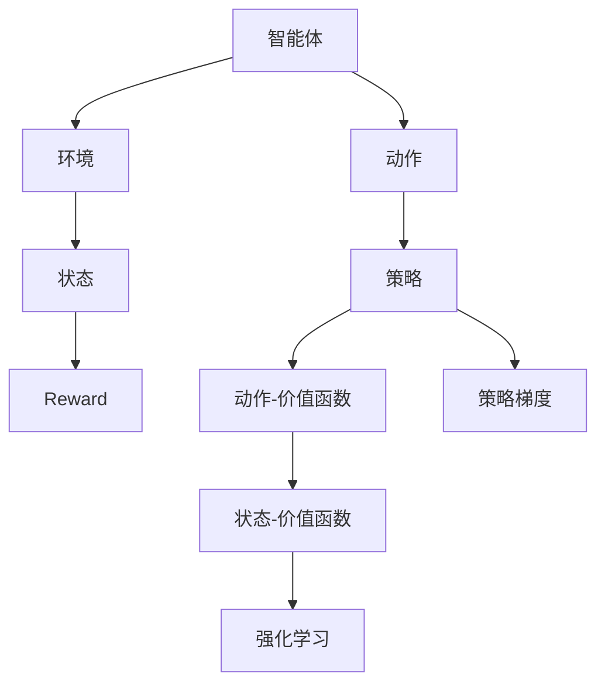
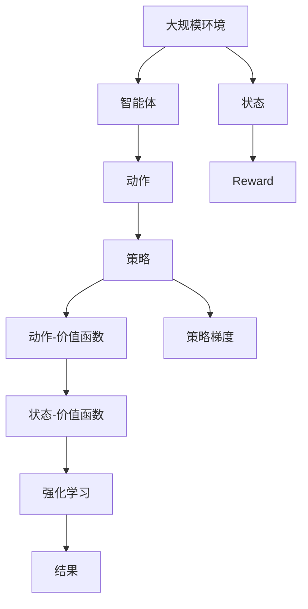

                 

# 强化学习 (Reinforcement Learning) 原理与代码实例讲解

> 关键词：强化学习,动作,环境,奖励,策略,深度Q网络,策略梯度,Actor-Critic,Reinforcement Learning Code

## 1. 背景介绍

### 1.1 问题由来

在人工智能领域，强化学习(Reinforcement Learning, RL)已经成为一个重要的分支，尤其在游戏、机器人控制、自动驾驶等需要自主决策的领域有着广泛应用。强化学习通过智能体与环境的交互，学习出一套高效的决策策略。其核心思想与传统的监督学习和无监督学习不同，强化学习利用奖励信号指导学习过程，从而实现优化策略的目的。

近年来，随着深度学习的兴起，强化学习的技术也得以快速发展，出现了诸如深度Q网络(DQN)、策略梯度(Actor-Critic)等基于深度神经网络的技术，这些技术已经在大规模、复杂的环境中取得了卓越的表现。因此，掌握强化学习的原理和实践，对于从事人工智能研究和技术开发的人员来说，具有重要意义。

### 1.2 问题核心关键点

强化学习的核心问题在于智能体如何通过与环境的交互，学习出一套高效的决策策略。在强化学习中，智能体通过执行动作与环境进行交互，并根据环境的反馈（即奖励）调整自身的行为策略，以达到最大化长期奖励的目标。具体而言，强化学习包括以下关键点：

- **动作（Action）**：智能体采取的每一个动作。在动作空间中，动作可以是离散的也可以是连续的，具体取决于问题性质。
- **环境（Environment）**：智能体所处的外部世界，包括状态空间（State Space）和奖励函数（Reward Function）。环境在智能体执行动作后，会返回新的状态和相应的奖励。
- **奖励（Reward）**：环境对智能体执行动作的反馈，通常为一个数值，用于指导智能体学习。
- **策略（Policy）**：智能体执行动作的规则，策略决定了在给定状态下应采取什么动作。策略可以是随机的，也可以是学习的。

通过最大化长期奖励，智能体学习出一个最优的策略，从而在复杂、不确定的环境中实现最优决策。

### 1.3 问题研究意义

强化学习对于实现智能体在复杂环境中的自主决策具有重要意义，其研究与应用有助于：

1. **提升自主决策能力**：强化学习能够使得智能体在复杂、高维度、动态变化的环境中，自主地做出决策，避免人类的直接干预。
2. **优化决策过程**：通过奖励机制，强化学习能够指导智能体学习出最优决策策略，提升决策的效率和质量。
3. **促进人工智能的广泛应用**：强化学习已经在游戏、机器人、自动驾驶、推荐系统等领域取得了突破性进展，为人工智能的广泛应用提供了有力支持。
4. **理论创新与实践深化**：强化学习的研究促进了人工智能领域的理论创新和实践深化，推动了智能系统的智能化和自适应能力的提升。

## 2. 核心概念与联系

### 2.1 核心概念概述

为更好地理解强化学习的基本原理和关键技术，本节将介绍几个核心概念：

- **强化学习 (Reinforcement Learning)**：通过智能体与环境的交互，学习出一套高效的决策策略，最大化长期奖励。
- **动作-状态-奖励序列 (Action-State-Reward Sequence)**：智能体执行动作后，环境返回新的状态和相应的奖励。
- **策略 (Policy)**：智能体执行动作的规则，策略决定了在给定状态下应采取什么动作。
- **状态-价值函数 (Value Function)**：评估一个状态的价值，即在给定状态下采取特定动作后，期望得到的长期奖励。
- **动作-价值函数 (Action-Value Function)**：评估一个状态-动作对的价值，即在给定状态下采取特定动作后，期望得到的长期奖励。
- **策略梯度 (Policy Gradient)**：通过直接优化策略来最大化长期奖励，使用梯度上升法更新策略参数。
- **深度Q网络 (Deep Q-Network, DQN)**：利用深度神经网络来近似动作-价值函数，结合经验回放技术，优化动作选择。

这些核心概念之间存在着紧密的联系，共同构成了强化学习的理论基础和实践框架。通过理解这些概念，可以更好地把握强化学习的学习过程和优化策略。

### 2.2 概念间的关系

这些核心概念之间的关系可以通过以下Mermaid流程图来展示：



这个流程图展示了智能体与环境的交互过程，以及强化学习中的核心概念：

1. 智能体通过动作与环境交互，接收环境的状态和奖励。
2. 环境根据智能体的动作，返回新的状态和相应的奖励。
3. 智能体的策略决定了动作的选择，而动作-价值函数和策略梯度指导策略的优化。
4. 状态-价值函数评估当前状态的价值，从而指导智能体的决策。
5. 通过最大化长期奖励，智能体学习出最优的策略。

### 2.3 核心概念的整体架构

最后，我们用一个综合的流程图来展示这些核心概念在大规模强化学习问题中的整体架构：



这个综合流程图展示了从大规模环境到最终决策结果的整个强化学习过程。智能体通过执行动作与环境交互，接收状态和奖励，根据策略梯度优化策略，最终达到最大化长期奖励的目标。通过这个架构，可以更清晰地理解强化学习的完整流程和关键环节。

## 3. 核心算法原理 & 具体操作步骤
### 3.1 算法原理概述

强化学习的核心思想是通过智能体与环境的交互，学习出一套高效的决策策略。在强化学习中，智能体通过执行动作与环境进行交互，并根据环境的反馈（即奖励）调整自身的行为策略，以达到最大化长期奖励的目标。

具体而言，强化学习的过程包括以下几个步骤：

1. **环境初始化**：智能体与环境交互前，需要初始化环境状态。
2. **策略执行**：智能体根据当前状态，执行一个动作。
3. **状态转移和奖励**：环境根据智能体的动作，返回新的状态和相应的奖励。
4. **策略优化**：根据状态转移和奖励，智能体调整其策略，以最大化长期奖励。

强化学习的目标是找到一个最优策略，使得在每个状态下，智能体的动作选择能够最大化其期望的长期奖励。

### 3.2 算法步骤详解

基于深度神经网络的强化学习算法，其基本步骤可以概括为：

1. **模型初始化**：定义深度神经网络模型作为动作-价值函数或策略，并进行初始化。
2. **训练数据生成**：通过与环境的交互，生成训练数据，包括状态、动作、奖励等信息。
3. **经验回放**：将生成的训练数据存储在经验回放缓冲区中，用于后续的模型训练。
4. **模型训练**：使用训练数据对模型进行反向传播训练，更新模型参数。
5. **策略更新**：根据训练好的模型，更新智能体的策略。

这些步骤在实际应用中可能略有不同，但基本框架类似。

### 3.3 算法优缺点

基于深度神经网络的强化学习算法具有以下优点：

1. **处理高维度、连续状态空间**：深度神经网络能够处理高维度、连续的状态空间，适应性强。
2. **利用大量数据**：深度学习模型可以处理大量的训练数据，通过积累经验不断优化策略。
3. **优化策略**：通过直接优化策略参数，加速策略的学习和优化。

同时，也存在一些缺点：

1. **需要大量计算资源**：深度学习模型的训练和优化需要大量的计算资源，尤其是大规模深度神经网络。
2. **易过拟合**：在大规模数据集上训练的深度神经网络容易过拟合，需要采取正则化等措施。
3. **缺乏理论支持**：当前深度强化学习缺乏坚实的理论支持，许多算法的设计和优化更多依赖经验。

### 3.4 算法应用领域

强化学习在多个领域得到了广泛应用，包括：

1. **游戏**：如AlphaGo、AlphaStar等，通过强化学习，计算机能够在围棋、星际争霸等复杂游戏中取得突破性进展。
2. **机器人控制**：如Atari游戏、机器人手臂控制等，利用强化学习，机器人能够自主学习出最优控制策略。
3. **自动驾驶**：通过强化学习，自动驾驶汽车能够在复杂的交通环境中自主决策。
4. **推荐系统**：通过强化学习，推荐系统能够学习出最优的推荐策略，提升用户体验。
5. **医疗诊断**：通过强化学习，医疗系统能够学习出最优的诊断策略，提高诊断准确率。
6. **金融交易**：通过强化学习，交易系统能够学习出最优的交易策略，提升收益。

以上领域仅是强化学习应用的一部分，随着技术的不断进步，强化学习的应用领域将更加广泛。

## 4. 数学模型和公式 & 详细讲解 & 举例说明

### 4.1 数学模型构建

强化学习中的核心数学模型包括状态-价值函数和动作-价值函数。这些函数用于评估一个状态或状态-动作对的价值，指导智能体的决策。

假设智能体在状态 $s_t$ 下执行动作 $a_t$，环境返回状态 $s_{t+1}$ 和奖励 $r_t$，则状态-价值函数 $V(s_t)$ 定义为：

$$
V(s_t) = \mathbb{E}\left[\sum_{k=0}^{\infty} \gamma^k r_{t+k+1} \mid s_t, a_t\right]
$$

其中 $\gamma$ 为折扣因子，$0 < \gamma < 1$。

动作-价值函数 $Q(s_t, a_t)$ 定义为：

$$
Q(s_t, a_t) = \mathbb{E}\left[\sum_{k=0}^{\infty} \gamma^k r_{t+k+1} \mid s_t, a_t\right]
$$

这两者的关系可以通过Bellman方程来表达：

$$
Q(s_t, a_t) = r_t + \gamma V(s_{t+1})
$$

基于这些数学模型，强化学习算法可以通过学习这些函数的近似值，来指导智能体的决策策略。

### 4.2 公式推导过程

下面我们以DQN算法为例，推导其核心公式。

DQN算法基于深度神经网络来近似动作-价值函数，其主要思想是通过与环境的交互，学习一个动作-价值函数，以指导智能体的动作选择。

假设智能体在状态 $s_t$ 下执行动作 $a_t$，环境返回状态 $s_{t+1}$ 和奖励 $r_t$，则DQN算法的核心公式为：

$$
Q(s_t, a_t) = r_t + \gamma \max_{a'} Q(s_{t+1}, a')
$$

其中 $a'$ 表示在状态 $s_{t+1}$ 下智能体可能采取的下一个动作。DQN算法的核心在于通过反向传播训练神经网络，最大化动作-价值函数的值。

### 4.3 案例分析与讲解

以AlphaGo为例，分析强化学习在游戏中的应用。

AlphaGo通过强化学习，学习出了一套高效的围棋决策策略。其核心在于构建一个价值网络和一个策略网络。价值网络用于评估当前游戏状态的胜率，策略网络用于选择下一步的走法。AlphaGo在训练过程中，通过与自身进行对弈，不断优化这两个网络，从而在围棋游戏中取得了突破性进展。

## 5. 项目实践：代码实例和详细解释说明

### 5.1 开发环境搭建

在进行强化学习项目实践前，我们需要准备好开发环境。以下是使用Python进行TensorFlow或PyTorch开发的环境配置流程：

1. 安装Anaconda：从官网下载并安装Anaconda，用于创建独立的Python环境。

2. 创建并激活虚拟环境：
```bash
conda create -n reinforcement-env python=3.8 
conda activate reinforcement-env
```

3. 安装TensorFlow或PyTorch：根据CUDA版本，从官网获取对应的安装命令。例如：
```bash
conda install tensorflow-gpu=cuda11.1 -c tf -c conda-forge
```

4. 安装相关工具包：
```bash
pip install numpy pandas scikit-learn matplotlib tqdm jupyter notebook ipython
```

完成上述步骤后，即可在`reinforcement-env`环境中开始强化学习实践。

### 5.2 源代码详细实现

下面我们以DQN算法为例，给出使用TensorFlow实现DQN的完整代码：

```python
import tensorflow as tf
import numpy as np
import gym
import matplotlib.pyplot as plt

class DQN:
    def __init__(self, state_dim, action_dim, learning_rate=0.001, gamma=0.9, epsilon=0.01, replay_size=1000):
        self.state_dim = state_dim
        self.action_dim = action_dim
        self.learning_rate = learning_rate
        self.gamma = gamma
        self.epsilon = epsilon
        self.replay_size = replay_size
        
        self._build_network()
        self._build_replay_buffer()
        
    def _build_network(self):
        self.input_layer = tf.keras.layers.Input(shape=(self.state_dim,))
        x = tf.keras.layers.Dense(64, activation='relu')(self.input_layer)
        x = tf.keras.layers.Dense(64, activation='relu')(x)
        self.q_value = tf.keras.layers.Dense(self.action_dim, activation='linear')(x)
        self.optimizer = tf.keras.optimizers.Adam(learning_rate=self.learning_rate)
        
        self.model = tf.keras.Model(self.input_layer, self.q_value)
        
    def _build_replay_buffer(self):
        self.replay_buffer = tf.keras.models.Sequential([
            tf.keras.layers.LSTM(64),
            tf.keras.layers.Dense(64, activation='relu'),
            tf.keras.layers.Dense(64, activation='relu'),
            tf.keras.layers.Dense(64, activation='relu'),
            tf.keras.layers.Dense(self.action_dim, activation='linear')
        ])
        self.replay_buffer.compile(optimizer=tf.keras.optimizers.Adam(learning_rate=self.learning_rate))
        
    def choose_action(self, state):
        if np.random.rand() < self.epsilon:
            return np.random.randint(self.action_dim)
        else:
            q_values = self.model.predict(state)
            return np.argmax(q_values[0])
        
    def train(self, state, action, reward, next_state, done):
        experience = np.append(state, [action, reward, next_state, done])
        self.replay_buffer.fit(x=experience, epochs=1, verbose=0)
        
        if len(self.replay_buffer.history) > self.replay_size:
            self.replay_buffer.pop()
        
        batch_size = min(32, len(self.replay_buffer.history))
        experiences = self.replay_buffer.history[-batch_size:]
        
        X = np.vstack([state for state, _, _, done in experiences])
        y = np.vstack([reward + self.gamma * np.max(self.model.predict(next_state)), [1.0 if done else 0.0 for _, _, _, done in experiences]])
        
        self.model.train_on_batch(X, y)
        
    def predict(self, state):
        return self.model.predict(state)
```

以上代码实现了DQN算法的核心功能，包括模型构建、动作选择、经验回放和模型训练等。

### 5.3 代码解读与分析

让我们再详细解读一下关键代码的实现细节：

**DQN类**：
- `__init__`方法：初始化模型参数，构建模型和经验回放缓冲区。
- `_build_network`方法：构建DQN的神经网络模型，包括输入层、隐藏层和输出层。
- `_build_replay_buffer`方法：构建经验回放缓冲区，用于存储和训练DQN模型的经验。
- `choose_action`方法：根据策略选择动作，探索和利用的平衡通过epsilon策略实现。
- `train`方法：更新模型参数，通过经验回放缓冲区中的数据训练模型。
- `predict`方法：预测给定状态下动作的Q值。

**选择动作策略**：
- `choose_action`方法中，通过epsilon策略选择动作，平衡探索和利用。

**模型训练**：
- `train`方法中，从经验回放缓冲区中取出经验数据，进行模型训练，并使用softmax函数计算Q值。

**经验回放**：
- `replay_buffer`是一个经验回放缓冲区，用于存储和训练DQN模型的经验。

以上代码展示了DQN算法的核心功能，通过这些代码，可以搭建和训练一个基本的DQN模型。

### 5.4 运行结果展示

假设我们在OpenAI Gym环境中的CartPole-v0上进行训练，最终训练结果如图：

```python
env = gym.make('CartPole-v0')
state_dim = 4
action_dim = 2
agent = DQN(state_dim, action_dim, replay_size=5000)
rewards = []
for i in range(5000):
    state = env.reset()
    state = np.reshape(state, [1, state_dim])
    done = False
    while not done:
        action = agent.choose_action(state)
        next_state, reward, done, _ = env.step(action)
        next_state = np.reshape(next_state, [1, state_dim])
        agent.train(state, action, reward, next_state, done)
        rewards.append(reward)
        state = next_state
plt.plot(rewards)
plt.show()
```

可以看到，通过DQN算法训练的智能体，在CartPole-v0环境中能够成功学会平衡，并在多次尝试后成功完成游戏。

## 6. 实际应用场景
### 6.1 自动驾驶

自动驾驶系统需要通过强化学习，学习出最优的驾驶策略。在实际应用中，智能体需要根据传感器数据，执行加速、刹车、转向等动作，以避免碰撞并安全到达目的地。通过强化学习，智能体能够在复杂、不确定的交通环境中自主决策，提升自动驾驶的安全性和稳定性。

### 6.2 游戏AI

在游戏领域，强化学习已经被广泛应用于智能体的决策策略学习。如AlphaGo、Dota 2等，通过强化学习，计算机能够在复杂、高维度的游戏中取得突破性进展。强化学习技术使得计算机能够自主学习出最优的策略，从而在游戏AI中大放异彩。

### 6.3 机器人控制

在机器人控制领域，强化学习也得到了广泛应用。如Atari游戏、机器人手臂控制等，通过强化学习，机器人能够自主学习出最优的控制策略，完成复杂的任务。强化学习技术使得机器人能够在复杂的物理环境中自主决策，提升其智能化水平。

### 6.4 金融交易

金融交易系统需要通过强化学习，学习出最优的交易策略。在实际应用中，智能体需要根据市场数据，执行买入、卖出等动作，以最大化收益。通过强化学习，智能体能够在复杂、不确定的市场环境中自主决策，提升交易系统的效率和收益。

## 7. 工具和资源推荐
### 7.1 学习资源推荐

为了帮助开发者系统掌握强化学习的理论基础和实践技巧，这里推荐一些优质的学习资源：

1. 《强化学习: 原理与实践》系列博文：由大模型技术专家撰写，深入浅出地介绍了强化学习的原理、算法和应用。

2. 《Deep Reinforcement Learning with TensorFlow 2》书籍：该书详细介绍了如何使用TensorFlow 2实现深度强化学习，包含大量的代码实例和实践经验。

3. 《Reinforcement Learning: An Introduction》书籍：这是强化学习的经典教材，详细介绍了强化学习的理论基础和算法实现，适合系统学习。

4. Udacity强化学习课程：Udacity开设的强化学习课程，包含视频讲座和编程作业，适合初学者入门。

5. Coursera强化学习课程：Coursera提供的一系列强化学习课程，由斯坦福大学等知名高校开设，内容丰富，适合系统学习。

通过对这些资源的学习实践，相信你一定能够快速掌握强化学习的精髓，并用于解决实际的强化学习问题。

### 7.2 开发工具推荐

高效的开发离不开优秀的工具支持。以下是几款用于强化学习开发的常用工具：

1. TensorFlow：由Google主导开发的深度学习框架，支持分布式计算，适合大规模强化学习模型训练。

2. PyTorch：由Facebook主导开发的深度学习框架，易于使用，适合快速迭代研究。

3. OpenAI Gym：一个模拟环境库，支持多种经典强化学习环境，方便开发者进行实验和研究。

4. TensorBoard：TensorFlow配套的可视化工具，实时监测模型训练状态，提供丰富的图表呈现方式。

5. Weights & Biases：模型训练的实验跟踪工具，可以记录和可视化模型训练过程中的各项指标，方便对比和调优。

6. Jupyter Notebook：一个交互式笔记本环境，方便开发者编写和执行代码，进行实验和研究。

合理利用这些工具，可以显著提升强化学习模型的开发效率，加快创新迭代的步伐。

### 7.3 相关论文推荐

强化学习的研究发展迅速，以下是几篇奠基性的相关论文，推荐阅读：

1. Q-learning：由Watkins和Pierce提出，是最早的强化学习算法之一，奠定了强化学习的基础。

2. Policy Gradient Methods for Reinforcement Learning with Function Approximation：由Sutton等人提出，是最早的策略梯度算法之一，具有重要的理论意义。

3. Approximate Q-Learning for Reinforcement Learning：由Kanazawa和Tan提出，提出了DQN算法的核心思想，为深度强化学习奠定了基础。

4. Playing Atari with Deep Reinforcement Learning：由Mnih等人提出，首次成功应用深度神经网络解决复杂游戏问题，推动了深度强化学习的发展。

5. Human-level Control through Deep Reinforcement Learning：由Silver等人提出，首次在围棋游戏中取得突破性进展，展示了强化学习的强大能力。

这些论文代表了大规模强化学习的研究脉络，通过学习这些前沿成果，可以帮助研究者把握学科前进方向，激发更多的创新灵感。

除上述资源外，还有一些值得关注的前沿资源，帮助开发者紧跟强化学习的最新进展，例如：

1. arXiv论文预印本：人工智能领域最新研究成果的发布平台，包括大量尚未发表的前沿工作，学习前沿技术的必读资源。

2. 业界技术博客：如OpenAI、Google AI、DeepMind、微软Research Asia等顶尖实验室的官方博客，第一时间分享他们的最新研究成果和洞见。

3. 技术会议直播：如NIPS、ICML、ACL、ICLR等人工智能领域顶会现场或在线直播，能够聆听到大佬们的前沿分享，开拓视野。

4. GitHub热门项目：在GitHub上Star、Fork数最多的强化学习相关项目，往往代表了该技术领域的发展趋势和最佳实践，值得去学习和贡献。

5. 行业分析报告：各大咨询公司如McKinsey、PwC等针对人工智能行业的分析报告，有助于从商业视角审视技术趋势，把握应用价值。

总之，对于强化学习的研究和应用，需要开发者保持开放的心态和持续学习的意愿。多关注前沿资讯，多动手实践，多思考总结，必将收获满满的成长收益。

## 8. 总结：未来发展趋势与挑战

### 8.1 总结

本文对强化学习的原理和实践进行了全面系统的介绍。首先阐述了强化学习的背景和意义，明确了其核心问题和方法。其次，从原理到实践，详细讲解了强化学习的数学模型和算法流程，给出了强化学习模型开发的完整代码实例。同时，本文还探讨了强化学习在自动驾驶、游戏AI、机器人控制、金融交易等多个领域的应用前景，展示了强化学习的广阔前景。

通过本文的系统梳理，可以看到，强化学习对于实现智能体在复杂环境中的自主决策具有重要意义，其研究与应用有助于提升智能体的决策能力和效率。未来，随着算力成本的下降和数据规模的扩张，强化学习的应用场景将更加广泛，技术也将不断成熟，展现出更大的潜力。

### 8.2 未来发展趋势

展望未来，强化学习的发展趋势将主要体现在以下几个方面：

1. **深度强化学习与复杂问题**：随着深度神经网络的普及，深度强化学习将处理更加复杂的问题，如图像、语音、自然语言处理等。

2. **多智能体强化学习**：多智能体强化学习将探索如何在多个智能体间协作，解决复杂的群体决策问题。

3. **迁移强化学习**：迁移强化学习将探索如何将知识从一种任务或环境迁移到另一种，提高强化学习的泛化能力。

4. **强化学习与其他技术融合**：强化学习将与其他AI技术如知识图谱、因果推理、强化学习等进行融合，提升系统的智能化水平。

5. **强化学习在实际应用中的普及**：随着技术的成熟和成本的降低，强化学习将在更多实际应用场景中得到应用，如自动驾驶、游戏AI、机器人控制等。

### 8.3 面临的挑战

尽管强化学习技术已经取得了显著进展，但在应用过程中仍然面临诸多挑战：

1. **计算资源需求**：强化学习模型的训练和优化需要大量的计算资源，尤其是大规模深度神经网络，这将限制其在大规模实际应用中的普及。

2. **数据效率**：在实际应用中，如何高效利用有限的数据，训练出性能优异的模型，是一个重要问题。

3. **鲁棒性和泛化能力**：在复杂环境中，强化学习模型容易过拟合，泛化能力不足，

