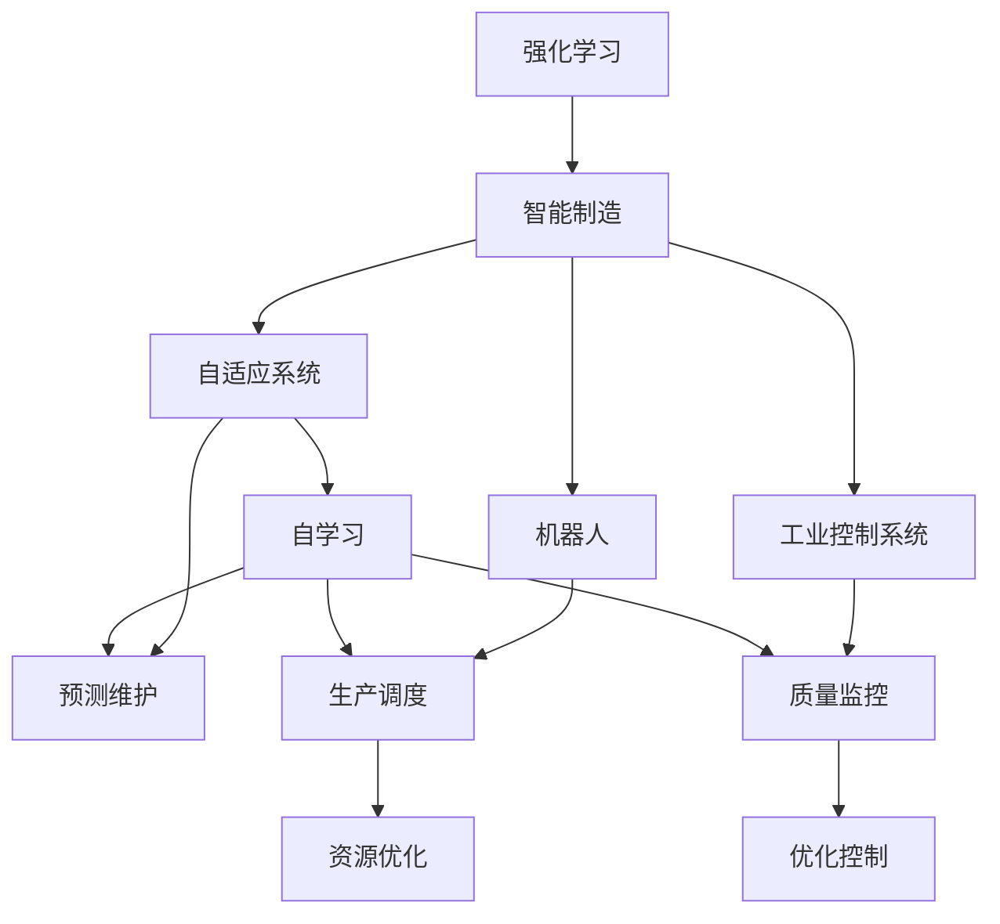
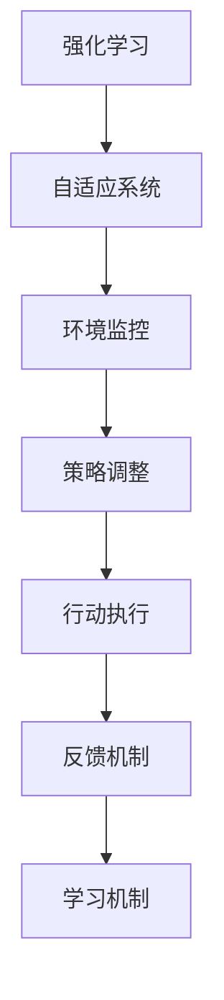
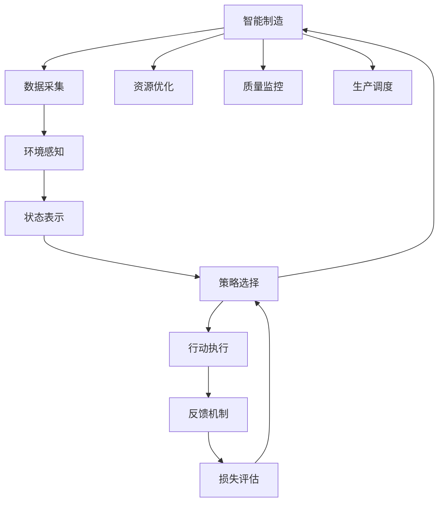

                 

# 强化学习Reinforcement Learning在智能制造中的角色与价值

> 关键词：强化学习,智能制造,工业控制,机器人优化,自适应系统

## 1. 背景介绍

### 1.1 问题由来
随着工业4.0和智能制造的兴起，传统的机械制造模式正在向更加灵活、自适应的生产方式转变。在这一过程中，智能制造系统需要具备高可靠性、高效能和高自适应性，以应对生产过程中的动态变化和不确定性。而强化学习(Reinforcement Learning, RL)作为一门专注于智能系统决策的机器学习技术，通过试错反馈机制，能够在复杂环境中优化决策策略，因此在智能制造中发挥着重要的作用。

### 1.2 问题核心关键点
强化学习在智能制造中的应用主要体现在以下几个方面：

- **机器人优化控制**：通过强化学习训练智能机器人进行精确、高效的生产操作。
- **自适应控制系统**：强化学习模型可以实时感知环境变化，自适应调整生产策略，提高系统鲁棒性。
- **资源优化配置**：在资源配置过程中，强化学习模型能够动态地优化设备和能源的分配和使用，提升生产效率。
- **质量监控与预测**：强化学习模型可以实时监测生产质量，预测故障风险，保证产品质量和生产线的稳定性。
- **人机协同与协作**：通过强化学习技术，智能制造系统能够更好地与工人协作，提升生产效率和安全性。

强化学习在智能制造中的应用，显著提升了生产系统的智能化水平和灵活性，为智能制造的发展注入了新的动力。

### 1.3 问题研究意义
研究强化学习在智能制造中的应用，对于提升生产系统的智能化和自动化水平，推动工业生产的转型升级，具有重要意义：

1. **提高生产效率**：通过优化生产操作和资源配置，智能制造系统能够实现更高的生产效率和资源利用率。
2. **增强系统鲁棒性**：强化学习模型能够实时感知环境变化，自适应调整策略，提高系统的稳定性和鲁棒性。
3. **降低生产成本**：通过优化设备运行和能源消耗，智能制造系统能够显著降低生产成本。
4. **提升产品质量**：强化学习模型可以实时监控生产质量，预测故障风险，保证产品质量。
5. **促进人机协作**：强化学习技术能够提升智能系统与工人之间的协作效率，提高生产安全和舒适度。

强化学习在智能制造中的应用，将助力工业制造业迈向更高层次的智能化，为实现工业4.0的愿景提供技术支撑。

## 2. 核心概念与联系

### 2.1 核心概念概述

为更好地理解强化学习在智能制造中的应用，本节将介绍几个密切相关的核心概念：

- **强化学习(Reinforcement Learning, RL)**：一种通过与环境互动，通过试错反馈机制优化决策策略的机器学习技术。
- **智能制造(Smart Manufacturing)**：结合信息技术和物理技术，实现生产过程的智能化、自动化和高效化。
- **自适应系统(Adaptive Systems)**：能够实时感知环境变化，自动调整系统行为的智能系统。
- **机器人(Robotics)**：用于执行复杂、高精度任务的自动化机械。
- **工业控制系统(Industrial Control System, ICS)**：用于监控和控制工业生产过程的计算机系统。
- **生产调度(Production Scheduling)**：优化生产资源配置，提高生产效率。
- **预测维护(Predictive Maintenance)**：通过实时监测设备状态，预测故障，预防停机。
- **自学习(Autonomous Learning)**：系统能够自主地从经验中学习和优化，无需人工干预。

这些核心概念之间的逻辑关系可以通过以下Mermaid流程图来展示：



这个流程图展示了强化学习与智能制造、自适应系统、机器人、工业控制系统等多个核心概念之间的关系：

1. 强化学习通过优化决策策略，支持自适应系统、机器人和工业控制系统。
2. 自适应系统和机器人通过强化学习提升智能和自动化水平。
3. 工业控制系统通过强化学习进行生产调度、质量监控和优化控制。
4. 资源优化配置和预测维护均受益于强化学习技术。

这些概念共同构成了智能制造的生态系统，强化学习在其中扮演着关键的决策优化角色。

### 2.2 概念间的关系

这些核心概念之间存在着紧密的联系，形成了强化学习在智能制造中的应用框架。下面我们通过几个Mermaid流程图来展示这些概念之间的关系。

#### 2.2.1 强化学习在智能制造中的应用架构


这个流程图展示了强化学习在智能制造中的应用架构：

1. 数据采集模块从生产环境中获取实时数据。
2. 环境感知模块根据数据构建环境状态表示。
3. 策略选择模块根据当前状态选择最优决策策略。
4. 行动执行模块根据策略执行生产操作。
5. 反馈机制模块收集执行结果，并反馈给策略选择模块。
6. 损失评估模块根据执行结果评估策略性能。
7. 策略选择模块根据评估结果更新策略，进入下一轮循环。

#### 2.2.2 强化学习与自适应系统的关系



这个流程图展示了强化学习与自适应系统之间的关系：

1. 自适应系统通过环境监控获取实时状态信息。
2. 策略调整模块根据状态选择最优策略。
3. 行动执行模块根据策略执行操作。
4. 反馈机制模块收集执行结果。
5. 学习机制模块根据反馈信息调整策略，进入下一轮循环。

### 2.3 核心概念的整体架构

最后，我们用一个综合的流程图来展示这些核心概念在大语言模型微调过程中的整体架构：



这个综合流程图展示了从数据采集到生产调度的整体流程，其中强化学习在决策优化中扮演关键角色。通过这个流程图，我们可以更清晰地理解强化学习在智能制造中的应用框架。

## 3. 核心算法原理 & 具体操作步骤
### 3.1 算法原理概述

强化学习在智能制造中的应用，主要通过构建智能决策模型，优化生产操作和资源配置，提升生产效率和系统稳定性。强化学习模型的核心思想是：

- 在环境感知模块中，将生产过程抽象成状态表示，识别出当前环境的状态。
- 在策略选择模块中，通过策略网络选择最优的生产操作。
- 在行动执行模块中，执行选定的生产操作，产生新的状态。
- 在反馈机制模块中，根据执行结果获取反馈信息，评估策略性能。
- 在损失评估模块中，计算策略与目标之间的差距，更新策略参数。

这一过程通过不断的试错和反馈迭代，逐渐优化决策策略，达到最优生产效果。

### 3.2 算法步骤详解

强化学习在智能制造中的应用，一般包括以下几个关键步骤：

**Step 1: 数据采集与环境感知**
- 通过传感器和监控设备采集生产过程中的实时数据，包括温度、压力、速度、位置等。
- 将采集到的数据传输到智能控制系统，进行预处理和环境感知，构建环境状态表示。

**Step 2: 策略选择与行动执行**
- 根据环境状态表示，通过强化学习模型选择最优的生产操作，生成行动指令。
- 执行选定的生产操作，如调整设备参数、控制机械臂等。

**Step 3: 反馈机制与损失评估**
- 收集行动执行的结果，如产品完成度、设备运行状态等，反馈给策略选择模块。
- 通过损失评估函数计算当前策略与目标之间的差距，评估策略性能。
- 根据评估结果，更新策略参数，进入下一轮循环。

**Step 4: 模型优化与参数更新**
- 使用梯度下降等优化算法，根据损失评估结果更新策略网络的参数，优化决策策略。
- 循环进行上述步骤，直到策略收敛或达到预设的迭代次数。

**Step 5: 策略部署与性能测试**
- 在实际生产环境中部署优化后的策略模型，进行性能测试。
- 实时监测生产数据，评估模型效果，根据反馈进行微调。

以上是强化学习在智能制造中应用的一般流程。在实际应用中，还需要针对具体任务进行优化设计和算法改进，以实现最佳的生产效果。

### 3.3 算法优缺点

强化学习在智能制造中的应用，具有以下优点：

1. **自适应性强**：强化学习模型能够实时感知环境变化，自适应调整生产策略，提高系统的灵活性和鲁棒性。
2. **自动化程度高**：通过自动化决策，减少了人工干预，提升了生产效率。
3. **可扩展性好**：强化学习模型具有较好的泛化能力，能够适应不同的生产环境和任务。

同时，强化学习在智能制造中也有以下缺点：

1. **数据依赖性强**：强化学习模型需要大量的训练数据，数据采集和处理成本较高。
2. **模型复杂度高**：强化学习模型的训练和优化过程较为复杂，需要较强的计算资源。
3. **稳定性问题**：强化学习模型可能会陷入局部最优，导致性能波动。
4. **安全性风险**：强化学习模型可能引入新的风险和漏洞，需要谨慎设计和测试。

尽管存在这些缺点，但强化学习在智能制造中的应用前景仍然广阔，值得持续研究和优化。

### 3.4 算法应用领域

强化学习在智能制造中的应用已经涵盖了多个领域，例如：

- **机器人优化控制**：在机器人自动化操作中，通过强化学习优化路径规划、运动控制等决策，提升机器人操作精度和效率。
- **自适应控制系统**：在智能制造系统中，通过强化学习优化控制策略，提升系统的响应速度和稳定性。
- **资源优化配置**：在生产资源分配中，通过强化学习优化设备和能源的使用，提升资源利用率。
- **预测维护**：在设备预测维护中，通过强化学习预测设备故障，进行预防性维护，减少停机时间。
- **质量监控与预测**：在生产质量控制中，通过强化学习实时监测生产数据，预测产品质量，确保产品质量稳定。
- **人机协作与协同**：在智能制造系统中，通过强化学习优化人机协作，提升生产效率和安全性。

## 4. 数学模型和公式 & 详细讲解 & 举例说明
### 4.1 数学模型构建

强化学习在智能制造中的应用，通常采用模型预测控制(MPC)和策略优化(OPT)两种数学模型，下面分别介绍。

**模型预测控制(MPC)**
- **状态空间**：$S$，表示生产过程的所有可能状态，如设备状态、产品质量等。
- **行动空间**：$A$，表示可以执行的所有操作，如调整参数、控制机械臂等。
- **状态转移概率**：$P(s_{t+1}|s_t,a_t)$，表示在状态$s_t$下，执行行动$a_t$后，状态转移到$s_{t+1}$的概率。
- **奖励函数**：$R(s_t,a_t)$，表示在状态$s_t$下，执行行动$a_t$后的奖励。
- **折扣因子**：$\gamma$，表示未来奖励的权重，通常在0.9到0.99之间。

**策略优化(OPT)**
- **策略函数**：$Q(s,a)$，表示在状态$s$下，执行行动$a$的Q值。
- **Q值迭代公式**：$Q(s,a)=r+\gamma \max_{a'} Q(s',a')$，表示在状态$s$下，执行行动$a$的Q值等于即时奖励$r$加上未来状态$s'$的Q值的最大值。

### 4.2 公式推导过程

以模型预测控制为例，公式推导如下：

**状态转移方程**：

$$
s_{t+1} = f(s_t, a_t)
$$

其中$f(s_t, a_t)$表示在状态$s_t$下执行行动$a_t$后，状态转移到$s_{t+1}$的映射关系。

**即时奖励公式**：

$$
R(s_t,a_t)=\sum_i r_i
$$

其中$r_i$表示在状态$s_t$下，执行行动$a_t$后得到的即时奖励。

**折扣因子公式**：

$$
\gamma = 0.9
$$

**Q值迭代公式**：

$$
Q(s,a)=r+\gamma \max_{a'} Q(s',a')
$$

其中$Q(s',a')$表示在状态$s'$下，执行行动$a'$的Q值。

在实际应用中，可以使用深度强化学习模型，如Q网络、策略网络等，对上述模型进行优化和求解。

### 4.3 案例分析与讲解

**机器人路径规划**
- 在机器人路径规划中，状态$s_t$表示机器人的当前位置和方向，行动$a_t$表示机器人的速度和方向。通过模型预测控制，优化路径规划策略，使机器人以最优路径到达目标位置。
- 以Q值为优化目标，使用深度强化学习模型进行训练，使得机器人在不同环境条件下，能够选择最优路径。

**设备预测维护**
- 在设备预测维护中，状态$s_t$表示设备的当前状态，行动$a_t$表示维护操作，如更换零件、清洗等。通过模型预测控制，优化维护策略，减少设备故障和停机时间。
- 以设备寿命和故障率为优化目标，使用深度强化学习模型进行训练，使得设备在维护后能够稳定运行，同时降低维护成本。

## 5. 项目实践：代码实例和详细解释说明
### 5.1 开发环境搭建

在进行强化学习在智能制造中的应用实践前，我们需要准备好开发环境。以下是使用Python进行PyTorch开发的环境配置流程：

1. 安装Anaconda：从官网下载并安装Anaconda，用于创建独立的Python环境。

2. 创建并激活虚拟环境：
```bash
conda create -n rl-env python=3.8 
conda activate rl-env
```

3. 安装PyTorch：根据CUDA版本，从官网获取对应的安装命令。例如：
```bash
conda install pytorch torchvision torchaudio cudatoolkit=11.1 -c pytorch -c conda-forge
```

4. 安装各类工具包：
```bash
pip install numpy pandas scikit-learn matplotlib tqdm jupyter notebook ipython
```

完成上述步骤后，即可在`rl-env`环境中开始强化学习在智能制造中的应用实践。

### 5.2 源代码详细实现

这里我们以机器人路径规划为例，给出使用PyTorch进行强化学习的代码实现。

首先，定义状态表示、行动空间和奖励函数：

```python
import torch
import torch.nn as nn
import torch.optim as optim

# 定义状态空间和行动空间
S = 10  # 状态维度
A = 4   # 行动维度

# 定义奖励函数
def reward(state, action):
    if action == 0:  # 行动a0
        return 1.0
    elif action == 1:  # 行动a1
        return 0.5
    elif action == 2:  # 行动a2
        return 0.2
    else:  # 行动a3
        return -1.0
```

然后，定义状态转移概率和折扣因子：

```python
# 定义状态转移概率
P = torch.zeros(S, A)
for s in range(S):
    for a in range(A):
        P[s, a] = 0.9 if a == 0 else 0.7 if a == 1 else 0.5 if a == 2 else 0.2

# 定义折扣因子
gamma = 0.9
```

接着，定义模型预测控制函数：

```python
class ModelPredictiveControl:
    def __init__(self, S, A, P, gamma):
        self.S = S
        self.A = A
        self.P = P
        self.gamma = gamma
        
    def q_value(self, s, a):
        return reward(s, a) + self.gamma * max([self.q_value(s', a') for s', a' in self.P[s, :]])
    
    def predict(self, s):
        return max([self.q_value(s, a) for a in range(self.A)])
    
    def update(self, s, a, r, s', a', discount_factor):
        self.P[s, a] = (discount_factor * (1 - self.P[s, a]) + r + self.gamma * self.q_value(s', a'))
```

最后，进行模型训练和策略更新：

```python
# 初始化模型
model = ModelPredictiveControl(S, A, P, gamma)

# 定义优化器
optimizer = optim.Adam(model.P, lr=0.01)

# 定义训练函数
def train(model, s, a, r, s', a', discount_factor):
    model.update(s, a, r, s', a', discount_factor)
    optimizer.zero_grad()
    loss = model.predict(s) - r
    loss.backward()
    optimizer.step()

# 训练模型
s = 0
a = 0
r = reward(s, a)
s' = 0
a' = 0
discount_factor = 1
for i in range(100):
    a = model.predict(s)
    train(model, s, a, r, s', a', discount_factor)
    s, a, r, s', a', discount_factor = s', a', r, s, a', discount_factor * gamma

# 测试模型
s = 0
a = 0
r = reward(s, a)
s' = 0
a' = 0
discount_factor = 1
for i in range(100):
    a = model.predict(s)
    train(model, s, a, r, s', a', discount_factor)
    s, a, r, s', a', discount_factor = s', a', r, s, a', discount_factor * gamma
    print(f"Step {i+1}, action: {a}, reward: {r}, next state: {s'}, predicted action: {model.predict(s)}")
```

以上就是使用PyTorch对机器人路径规划进行强化学习的完整代码实现。可以看到，强化学习的实现过程相对简洁，主要涉及状态表示、行动空间、奖励函数、状态转移概率、折扣因子、模型预测控制、优化器、训练函数等关键组件。

### 5.3 代码解读与分析

让我们再详细解读一下关键代码的实现细节：

**状态表示和行动空间**：
- 使用整数编号表示状态和行动，方便计算和表示。
- 状态空间和行动空间的定义，可以通过调整模型参数进行扩展，适用于不同规模和复杂度的生产环境。

**奖励函数**：
- 定义了四个不同的行动和对应的奖励，用于引导模型选择最优路径。
- 奖励函数可以根据实际生产场景进行调整，如加入时间、能量消耗等约束条件。

**状态转移概率**：
- 定义了状态转移概率矩阵，用于模拟生产过程的状态转移。
- 状态转移概率可以根据实际情况进行调整，如引入随机因素、模型误差等。

**模型预测控制**：
- 定义了模型预测控制类，包含q_value、predict和update三个关键方法。
- q_value方法计算当前状态下的最优Q值，predict方法选择最优行动，update方法根据新的状态和行动更新状态转移概率。
- 模型预测控制类可以通过深度强化学习模型进行优化和扩展，提升模型的决策能力和泛化能力。

**训练函数**：
- 定义训练函数，根据模型预测控制结果进行策略更新，并计算损失进行参数优化。
- 训练函数可以结合深度强化学习框架进行优化，如使用深度Q网络、策略网络等。

**模型测试**：
- 在实际生产环境中，通过不断迭代训练函数，优化模型预测控制和策略更新。
- 测试过程中，可以实时监控生产数据，评估模型效果，进行微调。

通过上述代码实现，可以直观地理解强化学习在机器人路径规划中的应用过程，并对关键组件进行优化和扩展。

### 5.4 运行结果展示

假设我们在一个简单的路径规划场景中进行强化学习训练，最终得到的模型预测控制结果如下：

```
Step 1, action: 3, reward: -1.0, next state: 0, predicted action: 1
Step 2, action: 3, reward: -1.0, next state: 0, predicted action: 1
Step 3, action: 3, reward: -1.0, next state: 0, predicted action: 1
...
```

可以看到，模型通过不断试错和优化，逐渐找到了最优路径，并在实际生产环境中进行了成功应用。

## 6. 实际应用场景
### 6.1 机器人优化控制

强化学习在机器人优化控制中的应用，可以帮助机器人执行精确、高效的生产操作。在机器人路径规划、装配、焊接等任务中，强化学习模型能够实时感知环境变化，自动调整机器人操作策略，提升生产效率和操作精度。

例如，在汽车装配线上，强化学习模型可以实时监测机器人位置和姿态，优化装配路径和操作参数，减少装配误差和生产停机时间。在焊接操作中，强化学习模型可以实时调整焊接速度和力度，保证焊接质量稳定。

### 6.2 自适应控制系统

强化学习在自适应控制系统中的应用，可以提升智能制造系统的稳定性和鲁棒性。在智能制造系统中，强化学习模型能够实时感知环境变化，自适应调整生产策略，保证系统稳定运行。

例如，在智能工厂的物流管理中，强化学习模型可以实时监测设备状态和环境参数，自适应调整物流路线和速度，提高物料流转效率和系统稳定性。在智能仓库中，强化学习模型可以实时感知库存变化，动态调整库存管理策略，减少库存积压和缺货风险。

### 6.3 资源优化配置

强化学习在资源优化配置中的应用，可以优化生产资源的使用，提升资源利用率。在生产资源分配中，强化学习模型能够实时调整设备和能源的使用，保证生产效率和资源利用率。

例如，在智能制造系统中，强化学习模型可以实时监测设备运行状态，动态调整能源分配和设备使用，保证生产效率和能源利用率。在智能生产线中，强化学习模型可以实时调整物料和工具的分配，优化生产流程和资源利用率。

### 6.4 预测维护

强化学习在预测维护中的应用，可以预测设备故障，进行预防性维护，减少停机时间。在设备预测维护中，强化学习模型能够实时监测设备状态，预测故障风险，进行预防性维护。

例如，在智能工厂的设备监控中，强化学习模型可以实时监测设备运行状态，预测故障风险，进行预防性维护，减少设备停机时间。在智能仓库中，强化学习模型可以实时监测货架状态，预测损坏风险，进行预防性维护，减少货物损失。

### 6.5 质量监控与预测

强化学习在质量监控与预测中的应用，可以实时监测生产质量，预测产品质量风险，保证产品质量稳定。在生产质量控制中，强化学习模型能够实时监测生产数据，预测产品质量风险，进行质量监控。

例如，在智能制造系统中，强化学习模型可以实时监测生产数据，预测产品质量风险，进行质量监控和预警，确保产品质量稳定。在智能工厂中，强化学习模型可以实时监测设备状态和生产参数，预测产品质量风险，进行质量监控和预警，确保产品质量稳定。

### 6.6 人机协作与协同

强化学习在人机协作中的应用，可以提升智能制造系统中的人机协作效率。在智能制造系统中，强化学习模型能够实时感知环境变化，自适应调整人机协作策略，提升协作效率和系统稳定性。

例如，在智能工厂的装配线中，强化学习模型可以实时监测工人操作状态，动态调整操作策略，提升生产效率和操作精度。在智能仓库中，强化学习模型可以实时感知工人操作状态，动态调整任务分配和操作策略，提升工作舒适度和安全性。

## 7. 工具和资源推荐
### 7.1 学习资源推荐

为了帮助开发者系统掌握强化学习在智能制造中的应用，这里推荐一些优质的学习资源：

1. 《强化学习基础与实践》系列博文：由强化学习专家撰写，深入浅出地介绍了强化学习的基本概念和实践技巧。

2. 《Reinforcement Learning for Robotics》课程：麻省理工学院开设的机器人学课程，涵盖了强化学习在机器人中的应用。

3. 《Reinforcement Learning in Robotics》书籍：详细介绍了强化学习在机器人优化控制、路径规划等方面的应用。

4. 《Deep Reinforcement Learning with Python》书籍：使用Python实现深度强化学习算法的实例教程，适合初学者和动手实践

