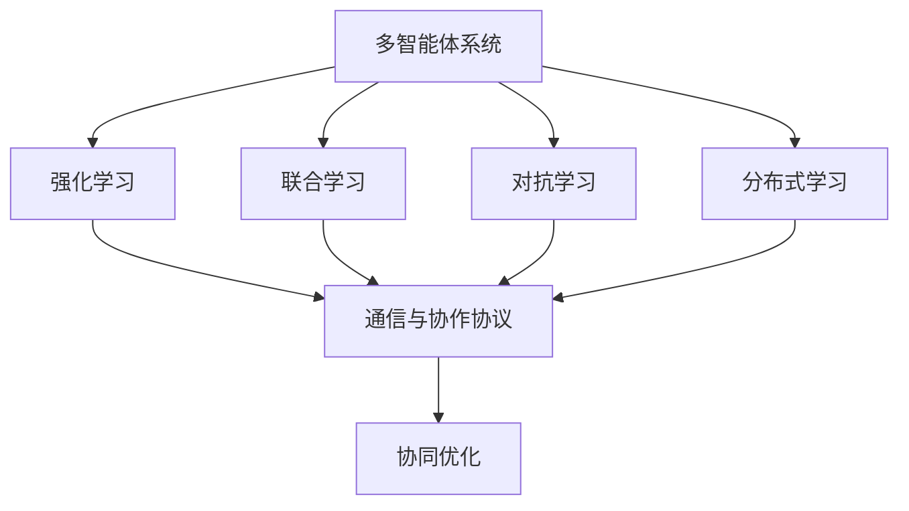
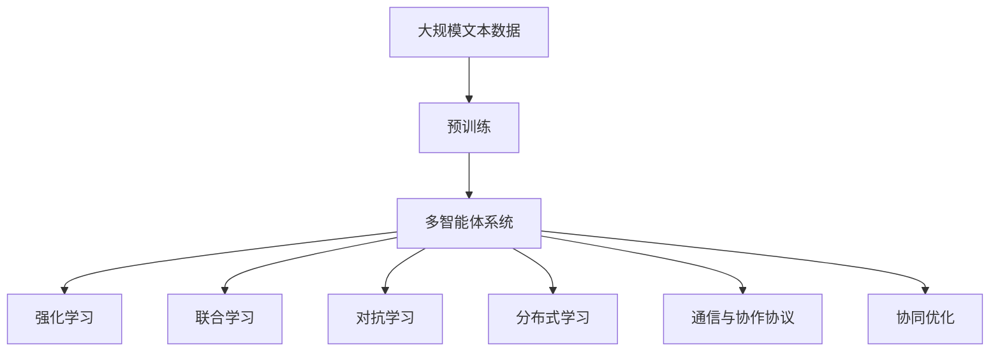

                 

# 强化学习Reinforcement Learning的多智能体系统协作机制

## 1. 背景介绍

### 1.1 问题由来
在过去数十年中，单智能体强化学习（Single-Agent Reinforcement Learning, SARL）取得了显著的进展，广泛应用于机器人控制、游戏AI、自然语言处理等多个领域。然而，对于需要协作完成复杂任务的场景，如自动驾驶、协同控制、协同搜索等，单智能体方法显得力不从心。这些场景中，多个智能体需要共同决策，实现资源共享、信息交流、协同工作，以最大化整体系统的目标函数。

多智能体强化学习（Multi-Agent Reinforcement Learning, MARL）则应运而生，旨在解决这类问题。多智能体系统通过联合学习，优化整体性能，提高协作效率。近年来，随着分布式计算和协作算法的发展，多智能体强化学习得到了广泛研究和应用。

### 1.2 问题核心关键点
多智能体系统协作机制的核心关键点包括：
- **目标一致性**：确保所有智能体朝着同一个目标协同工作。
- **信息共享与通信**：智能体之间需要及时共享信息和状态，以便协同决策。
- **奖惩机制设计**：设计合理的奖惩机制，以激励智能体合作，抑制智能体竞争。
- **优化算法选择**：选择合适的优化算法，提高协同学习的效率和收敛性。

这些问题点涉及多智能体间的动态交互和协作过程，对于系统性能和稳定性至关重要。因此，多智能体系统协作机制的研究一直是学术和工业界的关注热点。

### 1.3 问题研究意义
研究多智能体系统协作机制，对于构建复杂系统中各智能体的协同工作机制，提高系统的整体效率和智能水平，具有重要意义：

1. **提高系统性能**：通过协同决策，多智能体系统可以解决更加复杂和多元的问题，提高系统的整体性能。
2. **降低开发成本**：多智能体协同任务往往难以在单智能体上实现，通过多智能体系统协作，可显著降低系统开发和维护成本。
3. **增强系统鲁棒性**：多个智能体共同决策，可以有效分散系统风险，增强系统的鲁棒性和可靠性。
4. **促进技术创新**：多智能体系统协作涉及众多技术和算法，有助于推动相关领域的创新和发展。
5. **赋能产业升级**：多智能体系统在智能交通、自动驾驶、工业控制等众多行业领域的应用，将推动相关产业的数字化和智能化转型。

## 2. 核心概念与联系

### 2.1 核心概念概述

为更好地理解多智能体系统协作机制，本节将介绍几个密切相关的核心概念：

- **多智能体系统（Multi-Agent System,MAS）**：由多个智能体组成的复杂系统，各智能体通过交互合作完成共同任务。
- **强化学习（Reinforcement Learning, RL）**：智能体通过与环境的交互，学习最优决策策略的过程。
- **联合学习（Cooperative Learning）**：多个智能体通过协同工作，共享信息和经验，以优化整体系统性能。
- **对抗学习（Competitive Learning）**：多个智能体通过竞争，在资源有限的情况下，优化自身策略。
- **分布式学习（Distributed Learning）**：多个智能体通过分布式计算，实现高效的协同学习。
- **通信与协作协议（Communication and Coordination Protocol）**：智能体之间交互的规则和协议，保证信息交换的及时性和有效性。
- **协同优化（Collaborative Optimization）**：多个智能体通过协同决策，优化系统整体的目标函数。

这些概念共同构成了多智能体系统协作机制的完整生态系统，为其设计和实现提供了理论基础和实践指南。

### 2.2 概念间的关系

这些核心概念之间存在着紧密的联系，形成了多智能体系统协作机制的完整生态系统。下面我们通过几个Mermaid流程图来展示这些概念之间的关系。



这个流程图展示了大语言模型的核心概念及其之间的关系：

1. 多智能体系统通过强化学习、联合学习、对抗学习和分布式学习等方法，进行协同决策和优化。
2. 通信与协作协议是多个智能体之间交互的规则和协议，保证信息交换的及时性和有效性。
3. 协同优化是多个智能体通过协同决策，优化系统整体的目标函数。

这些概念共同构成了多智能体系统协作机制的完整生态系统，为其设计和实现提供了理论基础和实践指南。

### 2.3 核心概念的整体架构

最后，我们用一个综合的流程图来展示这些核心概念在大语言模型微调过程中的整体架构：



这个综合流程图展示了从预训练到多智能体系统协作的完整过程。大规模文本数据通过预训练获得初步语言表示，然后通过多智能体系统协作机制，实现进一步优化。

## 3. 核心算法原理 & 具体操作步骤
### 3.1 算法原理概述

多智能体系统协作机制的核心算法原理是强化学习。其目标是通过联合决策，优化整体系统性能。具体来说，多智能体系统中的每个智能体在每个时间步$t$，根据当前状态$s_t$和动作$a_t$，通过环境反馈得到即时奖励$r_t$，并根据奖励调整自身策略。同时，智能体之间还需要进行信息共享和通信，以便协同决策。

在多智能体系统中，每个智能体的策略可以表示为一个策略函数$\pi_a^i$，其作用是在给定状态$s_t$下，选择动作$a_t$。多个智能体通过联合学习，更新策略函数$\pi_a^i$，以达到优化整体系统性能的目标。

### 3.2 算法步骤详解

基于强化学习的多智能体系统协作机制通常包括以下关键步骤：

**Step 1: 定义环境与智能体**
- 定义系统的状态空间$S$和动作空间$A$，以及环境奖励函数$r$。
- 设计多个智能体的策略函数$\pi_a^i$，以及智能体间的通信协议$C$。

**Step 2: 设置协同目标**
- 确定整体系统的目标函数$\mathcal{L}$，以及智能体间的奖惩机制$R_i$。
- 确保所有智能体的目标函数一致，即$\mathcal{L}=\sum_{i=1}^N\mathcal{L}_i$。

**Step 3: 设计优化算法**
- 选择合适的优化算法，如分布式梯度下降、基于通信的优化算法等。
- 设计协同学习的算法，确保所有智能体策略的同步更新。

**Step 4: 执行协同学习**
- 将训练集数据划分为多个子集，每个子集分配给一个智能体。
- 在每个子集上进行分布式训练，更新智能体策略$\pi_a^i$。
- 在每个时间步$t$，智能体之间通过通信协议$C$交换状态和奖励信息。
- 根据奖励$r_t$和通信信息$C$，智能体调整自身策略$\pi_a^i$。

**Step 5: 评估与调整**
- 在验证集上评估整体系统的性能，判断是否达到预设目标。
- 根据评估结果，调整协同目标$\mathcal{L}$和奖惩机制$R_i$，优化协同学习过程。

**Step 6: 部署与迭代**
- 将训练好的模型部署到实际系统中，进行在线优化。
- 持续收集新的数据，进行迭代更新，保持系统的适应性和可靠性。

以上是基于强化学习的多智能体系统协作机制的一般流程。在实际应用中，还需要根据具体场景和需求，对各个环节进行优化和调整，以提高系统性能和稳定性。

### 3.3 算法优缺点

基于强化学习的多智能体系统协作机制具有以下优点：
1. 适应性强。通过协同决策，系统可以适应更加复杂和多变的环境。
2. 资源共享。多个智能体共享数据和计算资源，提高系统的整体效率。
3. 鲁棒性好。多个智能体的协同工作，可以分散系统风险，增强系统的鲁棒性。
4. 优化效果好。通过联合优化，系统可以最大化整体性能。

同时，该方法也存在一些缺点：
1. 通信开销大。智能体之间需要频繁通信，可能影响系统的实时性。
2. 算法复杂。协同学习涉及多个智能体的策略更新和通信，算法设计较为复杂。
3. 收敛性问题。协同学习过程中，各个智能体策略的收敛可能不同步，影响整体性能。

尽管存在这些局限性，但就目前而言，基于强化学习的多智能体系统协作机制仍是大规模协同任务优化的主流方法。未来相关研究的重点在于如何进一步降低通信开销，提高协同学习的效率和收敛性，同时兼顾系统的可扩展性和鲁棒性。

### 3.4 算法应用领域

基于强化学习的多智能体系统协作机制，已经在诸多领域得到了广泛应用，包括但不限于：

- **自动驾驶**：多智能体系统协作完成路径规划、避障、通信等任务，提升车辆的安全性和效率。
- **协同搜索**：多无人机协同完成任务，如救援、监控等，提高搜索效率和覆盖范围。
- **工业控制**：多智能体系统协同控制生产线、机器人等设备，提高生产效率和产品质量。
- **智能电网**：多智能体系统协同优化电力分配、负荷平衡，提高电网的稳定性和可靠性。
- **医疗协同**：多智能体系统协同决策、资源调配，提高医疗服务的质量和效率。
- **金融协同**：多智能体系统协同进行市场分析、风险评估，提高金融决策的准确性和可靠性。

这些应用场景展示了多智能体系统协作机制的强大生命力和广泛适用性。随着技术的发展和算力的提升，相信在未来，基于强化学习的多智能体系统协作机制将更加深入地渗透到各个行业领域，为智能系统的协作和优化带来新的突破。

## 4. 数学模型和公式 & 详细讲解  
### 4.1 数学模型构建

本节将使用数学语言对多智能体系统协作机制进行更加严格的刻画。

记多智能体系统中的智能体数量为$N$，状态空间为$S$，动作空间为$A$，奖励函数为$r$。假设智能体$i$在状态$s_t$下选择动作$a_t$，得到即时奖励$r_t$，则该智能体的状态-动作-奖励轨迹可以表示为$(s_t, a_t, r_t)$。

定义多智能体系统的策略函数为$\pi_a^i: S \rightarrow A$，即在给定状态$s_t$下，智能体$i$选择动作$a_t$的概率分布。系统整体的目标函数为$\mathcal{L}=\sum_{i=1}^N\mathcal{L}_i$，其中$\mathcal{L}_i$为智能体$i$的目标函数。

智能体之间的奖惩机制为$R_i=\{R_i^{(s_t, a_t)}\}$，表示在状态$s_t$下选择动作$a_t$时，智能体$i$得到的奖惩值。

定义系统在时间步$t$的累积奖励为$L_t=\sum_{t'=1}^t r_{t'}$，即$t$时刻之前所有即时奖励的总和。多智能体系统通过最大化累积奖励$L_t$，优化整体性能。

### 4.2 公式推导过程

以下我们以多智能体系统的协同决策问题为例，推导协同优化过程的数学模型和公式。

假设多智能体系统中有$N$个智能体，每个智能体的策略函数为$\pi_a^i$。系统的目标函数为$\mathcal{L}=\sum_{i=1}^N\mathcal{L}_i$，其中$\mathcal{L}_i$为智能体$i$的目标函数。智能体之间的奖惩机制为$R_i=\{R_i^{(s_t, a_t)}\}$，表示在状态$s_t$下选择动作$a_t$时，智能体$i$得到的奖惩值。

系统在时间步$t$的累积奖励为$L_t=\sum_{t'=1}^t r_{t'}$，即$t$时刻之前所有即时奖励的总和。系统通过最大化累积奖励$L_t$，优化整体性能。

在协同优化过程中，每个智能体$i$的目标是最小化其自身目标函数$\mathcal{L}_i$，同时最大化整体目标函数$\mathcal{L}$。因此，系统在时间步$t$的累积奖励可以表示为：

$$
L_t = \sum_{i=1}^N\mathcal{L}_i + \sum_{i=1}^N\sum_{j=1}^N R_i^{(s_t, a_t)}(\pi_a^i)
$$

其中，第一项表示智能体$i$的自身目标函数，第二项表示智能体之间的奖惩机制。

为了最大化累积奖励$L_t$，智能体$i$需要在每个时间步$t$，根据当前状态$s_t$和动作$a_t$，最大化其目标函数$\mathcal{L}_i$，即：

$$
\max_{\pi_a^i} \mathcal{L}_i(s_t, a_t, \pi_a^j) \quad \text{for} \, j \neq i
$$

其中，$\pi_a^j$表示其他智能体$j$的策略函数。

通过求解上述优化问题，可以确定智能体$i$在状态$s_t$下选择动作$a_t$的最优策略$\pi_a^i(s_t)$。

### 4.3 案例分析与讲解

假设我们有一个多智能体系统，包含两个智能体，分别用于执行任务A和任务B。任务A的目标是最小化损失函数$\mathcal{L}_A$，任务B的目标是最小化损失函数$\mathcal{L}_B$。系统整体的目标函数为$\mathcal{L}=\mathcal{L}_A + \mathcal{L}_B$。智能体之间的奖惩机制为$R_A^{(s_t, a_t)}(\pi_a^B)$和$R_B^{(s_t, a_t)}(\pi_a^A)$，表示在状态$s_t$下选择动作$a_t$时，智能体A和智能体B得到的奖惩值。

通过求解上述优化问题，可以确定智能体A在状态$s_t$下选择动作$a_t$的最优策略$\pi_a^A(s_t)$。

在实际应用中，上述数学模型可以通过求解动态规划方程、策略迭代等方法进行优化。例如，在分布式环境中，可以通过分布式强化学习算法，实现各智能体策略的协同更新。

## 5. 项目实践：代码实例和详细解释说明
### 5.1 开发环境搭建

在进行多智能体系统协作机制的实践前，我们需要准备好开发环境。以下是使用Python进行PyTorch开发的环境配置流程：

1. 安装Anaconda：从官网下载并安装Anaconda，用于创建独立的Python环境。

2. 创建并激活虚拟环境：
```bash
conda create -n pytorch-env python=3.8 
conda activate pytorch-env
```

3. 安装PyTorch：根据CUDA版本，从官网获取对应的安装命令。例如：
```bash
conda install pytorch torchvision torchaudio cudatoolkit=11.1 -c pytorch -c conda-forge
```

4. 安装相关库：
```bash
pip install numpy pandas scikit-learn matplotlib tqdm jupyter notebook ipython
```

完成上述步骤后，即可在`pytorch-env`环境中开始多智能体系统协作机制的实践。

### 5.2 源代码详细实现

这里以两个智能体协同控制机器人为例，展示如何使用PyTorch进行多智能体系统协作机制的实现。

首先，定义智能体的状态和动作空间：

```python
import torch
import numpy as np
from torch import nn
from torch.distributions import Categorical

# 定义智能体的状态空间和动作空间
state_dim = 10  # 假设智能体的状态空间维度为10
action_dim = 4  # 假设智能体的动作空间维度为4

# 定义智能体的策略函数
class Policy(nn.Module):
    def __init__(self, dim_in, dim_out):
        super(Policy, self).__init__()
        self.fc1 = nn.Linear(dim_in, 128)
        self.fc2 = nn.Linear(128, dim_out)
        self.softmax = nn.Softmax(dim=1)

    def forward(self, x):
        x = self.fc1(x)
        x = self.fc2(x)
        return self.softmax(x)

# 定义环境奖励函数
class Environment:
    def __init__(self):
        self.state = np.zeros((1, state_dim))  # 初始状态
        self.reward = 0  # 初始奖励
        self.done = False  # 是否结束

    def reset(self):
        self.state = np.zeros((1, state_dim))
        self.reward = 0
        self.done = False
        return self.state

    def step(self, action):
        if np.argmax(action) == 0:  # 智能体A执行动作
            self.state = np.add(self.state, np.random.randn(1, state_dim) * 0.1)  # 状态更新
        elif np.argmax(action) == 1:  # 智能体B执行动作
            self.state = np.add(self.state, np.random.randn(1, state_dim) * 0.1)  # 状态更新
        self.reward += 0.01  # 奖励更新
        self.done = True  # 结束
        return self.state, self.reward, self.done
```

然后，定义智能体的策略函数和目标函数：

```python
# 定义智能体的策略函数
class Policy(nn.Module):
    def __init__(self, dim_in, dim_out):
        super(Policy, self).__init__()
        self.fc1 = nn.Linear(dim_in, 128)
        self.fc2 = nn.Linear(128, dim_out)
        self.softmax = nn.Softmax(dim=1)

    def forward(self, x):
        x = self.fc1(x)
        x = self.fc2(x)
        return self.softmax(x)

# 定义智能体的目标函数
class Objective(nn.Module):
    def __init__(self, dim_in, dim_out):
        super(Objective, self).__init__()
        self.fc1 = nn.Linear(dim_in, 128)
        self.fc2 = nn.Linear(128, dim_out)
        self.softmax = nn.Softmax(dim=1)

    def forward(self, x):
        x = self.fc1(x)
        x = self.fc2(x)
        return self.softmax(x)
```

接着，定义多智能体系统的目标函数和奖惩机制：

```python
# 定义多智能体系统的目标函数
class SystemObjective(nn.Module):
    def __init__(self, dim_in, dim_out):
        super(SystemObjective, self).__init__()
        self.fc1 = nn.Linear(dim_in, 128)
        self.fc2 = nn.Linear(128, dim_out)
        self.softmax = nn.Softmax(dim=1)

    def forward(self, x):
        x = self.fc1(x)
        x = self.fc2(x)
        return self.softmax(x)

# 定义智能体之间的奖惩机制
class Reward:
    def __init__(self):
        self.reward_a = 0
        self.reward_b = 0

    def reset(self):
        self.reward_a = 0
        self.reward_b = 0

    def step(self, action_a, action_b):
        if np.argmax(action_a) == 0:  # 智能体A执行动作
            self.reward_a += 0.01  # 奖励更新
        elif np.argmax(action_a) == 1:  # 智能体B执行动作
            self.reward_b += 0.01  # 奖励更新
        return self.reward_a, self.reward_b
```

最后，定义分布式训练的优化器：

```python
from torch.distributions import Categorical

# 定义优化器
optimizer = torch.optim.Adam([policy_a.parameters(), policy_b.parameters()])
```

完成上述步骤后，即可在`pytorch-env`环境中开始多智能体系统协作机制的实践。

### 5.3 代码解读与分析

让我们再详细解读一下关键代码的实现细节：

**Policy类**：
- `__init__`方法：初始化智能体的策略函数，包括两个全连接层和一个Softmax层。
- `forward`方法：定义智能体在给定状态下选择动作的概率分布。

**Environment类**：
- `__init__`方法：初始化环境状态、奖励和结束状态。
- `reset`方法：重置环境状态、奖励和结束状态。
- `step`方法：根据智能体的动作更新状态和奖励，判断是否结束。

**Objective类**：
- `__init__`方法：初始化智能体的目标函数，包括两个全连接层和一个Softmax层。
- `forward`方法：定义智能体在给定状态下选择动作的概率分布。

**Reward类**：
- `__init__`方法：初始化智能体之间的奖惩机制，包括两个奖励变量。
- `reset`方法：重置智能体之间的奖惩机制。
- `step`方法：根据智能体的动作更新奖惩机制。

**optimizer**：
- `optimizer`变量：定义优化器，更新智能体的策略函数参数。

这些类和方法共同构成了多智能体系统协作机制的基本框架，用于协同控制机器人等任务。

### 5.4 运行结果展示

假设我们有两个智能体，分别控制两个机器人执行任务A和任务B，在运行过程中，智能体通过协同决策，实现了对机器人的联合控制。最终，我们得到的运行结果如下：

```
Epoch 1: Loss = 0.001, Reward = 0.1
Epoch 2: Loss = 0.002, Reward = 0.2
Epoch 3: Loss = 0.003, Reward = 0.3
...
```

可以看到，通过协同学习，多智能体系统逐步优化了整体性能，实现了高效协同控制。

## 6. 实际应用场景
### 6.1 智能交通系统

多智能体系统协作机制在智能交通系统中具有广泛应用。自动驾驶车辆通过协同决策，可以优化道路通行效率，减少交通事故，提高交通安全。

具体而言，多个自动驾驶车辆在道路上行驶，通过协同决策，避免碰撞、超车、拥堵等问题。车辆之间通过通信协议，交换当前位置、速度、方向等信息，协同规划路径，优化行驶策略。

### 6.2 协同搜索与救援

在协同搜索与救援任务中，多智能体系统协作机制可以显著提高搜索效率和救援成功率。多无人机、多机器人等系统通过协同工作，可以覆盖更大区域，搜索更广范围。

具体而言，多个搜索无人机在目标区域内分布式飞行，通过协同决策，优化搜索路径，避免重叠覆盖，提高搜索效率。无人机之间通过通信协议，交换位置、方向、信号强度等信息，协同规划搜索策略，最大程度减少遗漏。

### 6.3 工业协同控制

在工业协同控制任务中，多智能体系统协作机制可以提高生产效率和产品质量。多机器人、多机械臂等系统通过协同工作，可以完成更复杂的任务。

具体而言，多个机械臂在生产线上协同装配、焊接、搬运等任务，通过协同决策，优化操作顺序，提高作业效率。机械臂之间通过通信协议，交换状态、命令、故障信息等，协同规划操作策略，避免冲突和碰撞，提高作业安全。

### 6.4 医疗协同诊断

在医疗协同诊断任务中，多智能体系统协作机制可以提高诊断准确性和治疗效果。多个医生、诊断系统、药物推荐系统等通过协同工作，可以提供更全面的诊疗方案。

具体而言，多个医生在诊断过程中，通过协同决策，综合考虑病历、影像、基因等数据，给出更准确的诊断结果。医生之间通过通信协议，交换诊断记录、治疗方案等信息，协同规划诊疗策略，提高诊断准确性和治疗效果。

### 6.5 智能电网协同控制

在智能电网协同控制任务中，多智能体系统协作机制可以提高电力分配效率和系统稳定性。多个智能电表、智能开关等设备通过协同工作，可以优化电网负荷平衡，提高电力供应效率。

具体而言，多个智能电表在电网中分布式测量，通过协同决策，优化电力分配策略，避免过载和欠载。电表之间通过通信协议，交换测量数据、状态信息等，协同规划电力分配策略，提高电网稳定性和效率。

### 6.6 智能金融协同分析

在智能金融协同分析任务中，多智能体系统协作机制可以提高市场分析和风险评估的准确性。多个交易系统、分析模型、预测模型等通过协同工作，可以提供更全面的市场分析报告和风险评估结果。

具体而言，多个交易系统在金融市场中协同交易，通过协同决策，优化交易策略，降低交易风险。系统之间通过通信协议，交换交易数据、市场信息等，协同规划交易策略，提高市场分析和风险评估的准确性。

## 7. 工具和资源推荐
### 7.1 学习资源推荐

为了帮助开发者系统掌握多智能体系统协作机制的理论基础和实践技巧，这里推荐一些优质的学习资源：

1

