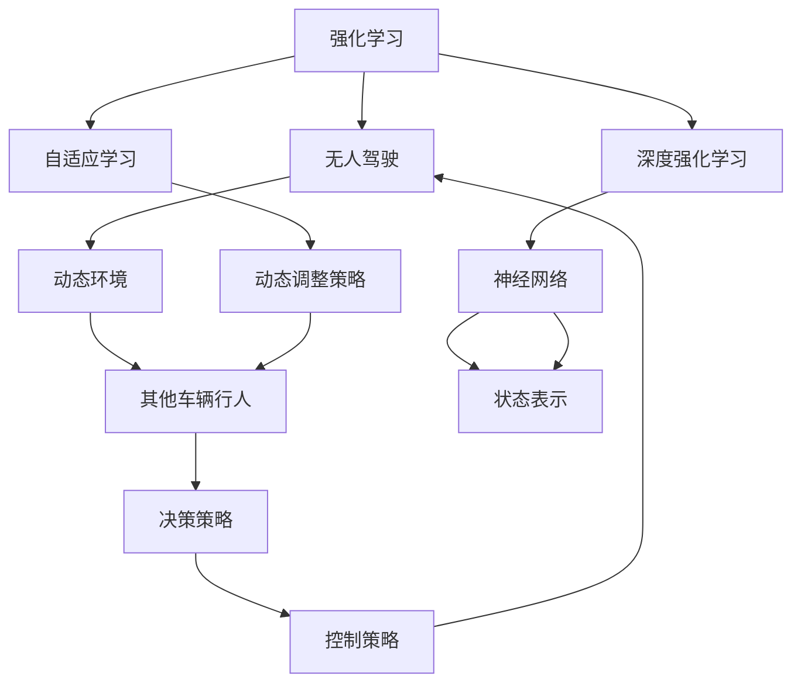
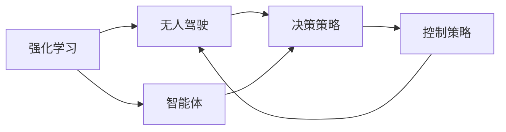
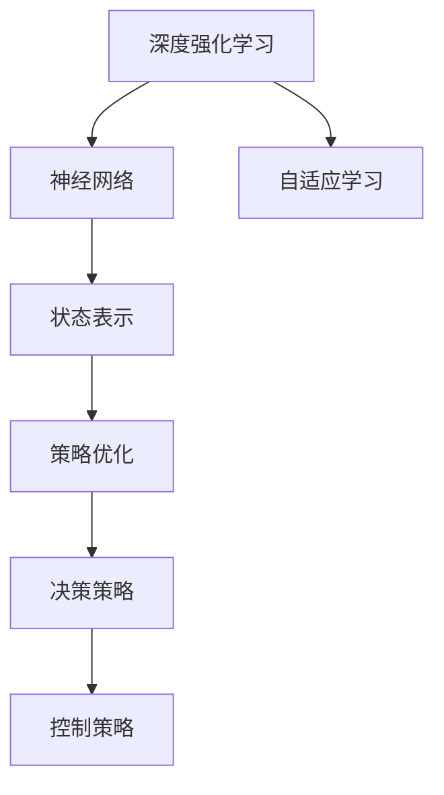
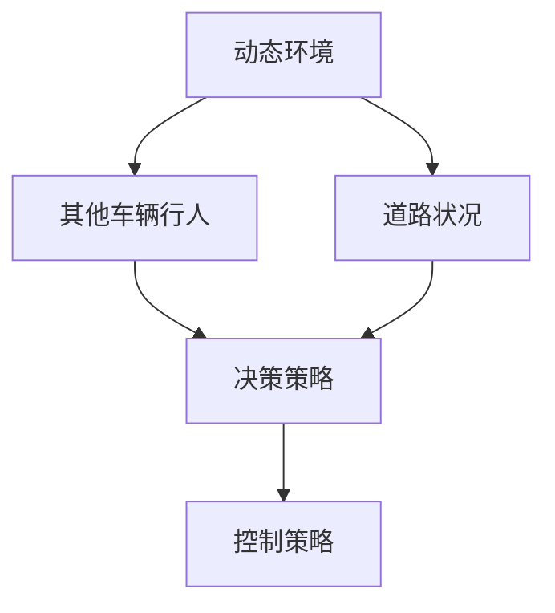
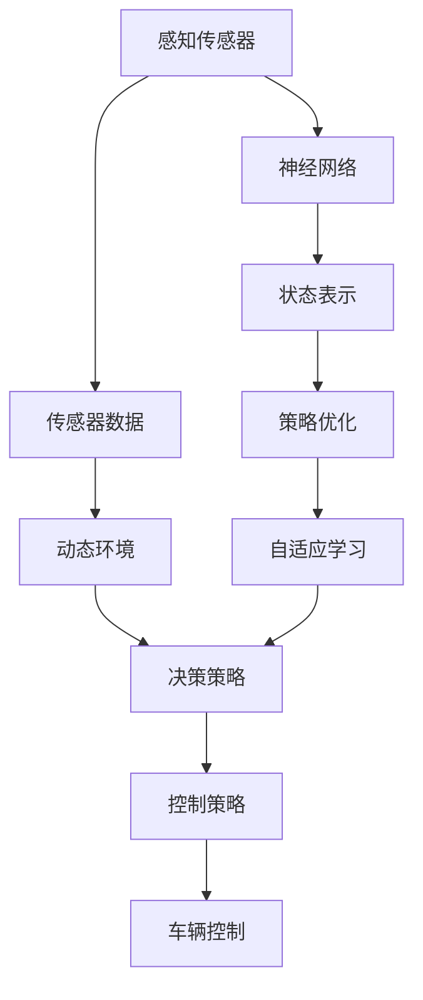

                 

# 强化学习：在无人驾驶中的应用

> 关键词：强化学习,无人驾驶,自动驾驶,深度强化学习,深度学习,智能交通,自动驾驶策略,神经网络,决策树

## 1. 背景介绍

### 1.1 问题由来
随着自动驾驶技术的发展，强化学习（Reinforcement Learning, RL）因其自适应和自主学习的能力，在无人驾驶系统设计中变得越来越重要。强化学习通过智能体与环境的互动，逐步优化决策策略，从而实现自动驾驶任务。然而，强化学习在无人驾驶中的应用面临诸多挑战，如如何处理不确定性和动态变化的环境、如何确保安全性和鲁棒性、如何优化计算效率等。

### 1.2 问题核心关键点
强化学习在无人驾驶中的应用核心关键点包括：
1. 智能体设计：构建无人驾驶系统中的智能体模型，包括决策制定和动作执行。
2. 环境建模：构建无人驾驶环境模型，包括道路、交通参与者和障碍物。
3. 奖励函数设计：定义无人驾驶任务的奖励函数，用于评估智能体的决策和动作。
4. 状态空间和动作空间：定义无人驾驶任务的状态空间和动作空间，包括车辆位置、速度、角度等。
5. 安全性和鲁棒性：确保无人驾驶系统的安全性和鲁棒性，避免在异常情况下的崩溃。
6. 计算效率：优化强化学习算法的计算效率，使其能够实时处理无人驾驶任务。

### 1.3 问题研究意义
强化学习在无人驾驶中的应用研究对于推动自动驾驶技术的发展具有重要意义：

1. 提升决策效率：强化学习能够自主学习和优化决策策略，提升无人驾驶系统的决策效率和响应速度。
2. 增强适应性：强化学习能够适应动态变化的环境，提升无人驾驶系统在复杂道路和交通场景中的适应性。
3. 减少人为干预：通过强化学习，无人驾驶系统能够自主决策和执行，减少人为干预，提升安全性。
4. 优化资源利用：强化学习能够优化车辆的资源利用，包括能源消耗和行驶路线，提升经济效益。
5. 推动产业升级：强化学习在无人驾驶中的应用，将推动相关产业的升级和转型，为智能交通系统带来新的发展契机。

## 2. 核心概念与联系

### 2.1 核心概念概述

为更好地理解强化学习在无人驾驶中的应用，本节将介绍几个密切相关的核心概念：

- 强化学习（Reinforcement Learning, RL）：通过智能体与环境的互动，逐步优化决策策略，最大化累积奖励的一种学习范式。
- 无人驾驶（Autonomous Driving）：利用感知、决策和控制技术，使车辆能够自主驾驶，减少人为干预。
- 深度强化学习（Deep Reinforcement Learning, DRL）：结合深度学习与强化学习，利用神经网络模型进行状态表示和策略优化。
- 自适应学习（Adaptive Learning）：智能体能够根据环境变化动态调整策略，提升适应性。
- 动态环境（Dynamic Environment）：无人驾驶任务中，环境是动态变化的，包括其他车辆、行人、道路状况等。
- 安全性和鲁棒性（Safety and Robustness）：无人驾驶系统需要具备高安全性和鲁棒性，避免在异常情况下的崩溃。
- 计算效率（Computational Efficiency）：强化学习算法需要具备高计算效率，能够实时处理无人驾驶任务。

这些核心概念之间的逻辑关系可以通过以下Mermaid流程图来展示：



这个流程图展示了这个核心概念之间的关系：

1. 强化学习通过智能体与环境的互动，逐步优化决策策略，提升无人驾驶系统的表现。
2. 深度强化学习结合深度学习，通过神经网络模型进行状态表示和策略优化。
3. 自适应学习使智能体能够根据环境变化动态调整策略，提升适应性。
4. 动态环境包括其他车辆、行人、道路状况等，是无人驾驶任务中的重要因素。
5. 安全性与鲁棒性确保无人驾驶系统的可靠性和稳定性。
6. 计算效率是强化学习算法需要考虑的重要因素，以保证实时处理无人驾驶任务。

### 2.2 概念间的关系

这些核心概念之间存在着紧密的联系，形成了无人驾驶系统中强化学习的完整生态系统。下面我们通过几个Mermaid流程图来展示这些概念之间的关系。

#### 2.2.1 强化学习与无人驾驶的关系



这个流程图展示了强化学习与无人驾驶的关系：

1. 强化学习通过智能体与环境的互动，逐步优化决策策略。
2. 智能体通过决策策略进行动作选择，实现无人驾驶任务。
3. 控制策略用于执行智能体的动作，实现车辆的自主驾驶。

#### 2.2.2 深度强化学习在无人驾驶中的应用



这个流程图展示了深度强化学习在无人驾驶中的应用：

1. 深度强化学习结合深度学习，利用神经网络模型进行状态表示和策略优化。
2. 神经网络模型能够有效处理高维状态空间，提升状态表示的质量。
3. 策略优化使智能体能够适应动态环境，提升决策的准确性和鲁棒性。
4. 自适应学习使智能体能够根据环境变化动态调整策略。
5. 决策策略和控制策略用于实现车辆的自主驾驶。

#### 2.2.3 动态环境与强化学习的关系



这个流程图展示了动态环境与强化学习的关系：

1. 动态环境包括其他车辆、行人、道路状况等，是无人驾驶任务中的重要因素。
2. 智能体通过感知传感器获取环境信息，进行状态表示和决策策略优化。
3. 决策策略和控制策略用于应对动态环境的变化，实现车辆的自主驾驶。

### 2.3 核心概念的整体架构

最后，我们用一个综合的流程图来展示这些核心概念在无人驾驶中的整体架构：



这个综合流程图展示了从感知传感器到车辆控制的整体流程：

1. 感知传感器获取环境信息，传输到神经网络进行状态表示。
2. 神经网络模型能够有效处理高维状态空间，提升状态表示的质量。
3. 策略优化使智能体能够适应动态环境，提升决策的准确性和鲁棒性。
4. 决策策略和控制策略用于实现车辆的自主驾驶。
5. 动态环境包括其他车辆、行人、道路状况等，是无人驾驶任务中的重要因素。
6. 安全性与鲁棒性确保无人驾驶系统的可靠性和稳定性。
7. 计算效率是强化学习算法需要考虑的重要因素，以保证实时处理无人驾驶任务。

## 3. 核心算法原理 & 具体操作步骤
### 3.1 算法原理概述

强化学习在无人驾驶中的应用，本质上是一个智能体与环境互动的学习过程。智能体通过感知传感器获取环境信息，通过神经网络进行状态表示和决策策略优化，逐步提升无人驾驶系统的性能。

形式化地，假设无人驾驶任务的环境为 $E$，智能体的策略为 $\pi$，决策动作为 $A$，环境对动作的响应为 $R$，则无人驾驶任务的目标是通过策略 $\pi$ 最大化累积奖励：

$$
\max_\pi \sum_{t=0}^{\infty} \gamma^t R(s_t, a_t)
$$

其中 $s_t$ 为状态，$a_t$ 为动作，$\gamma$ 为折扣因子，确保未来奖励的重要性。

### 3.2 算法步骤详解

基于强化学习的无人驾驶系统一般包括以下几个关键步骤：

**Step 1: 准备环境与模型**
- 构建无人驾驶任务的环境模型，包括其他车辆、行人、道路状况等。
- 选择合适的深度强化学习框架，如TensorFlow、PyTorch等，搭建神经网络模型。

**Step 2: 设计状态空间和动作空间**
- 定义无人驾驶任务的状态空间，包括车辆位置、速度、角度等。
- 定义无人驾驶任务的行动空间，包括加速、刹车、转向等。

**Step 3: 设计奖励函数**
- 定义无人驾驶任务的奖励函数，用于评估智能体的决策和动作。奖励函数需要考虑安全性、效率、舒适度等因素。
- 确保奖励函数能够引导智能体向最优决策方向学习，避免陷入局部最优。

**Step 4: 设计强化学习算法**
- 选择合适的强化学习算法，如Q-learning、Deep Q-Networks（DQN）、Actor-Critic等。
- 设置学习率、迭代次数、探索与利用策略等参数。

**Step 5: 执行强化学习训练**
- 在无人驾驶环境中，智能体通过感知传感器获取环境信息，进行状态表示和决策策略优化。
- 通过强化学习算法，智能体逐步优化决策策略，提升无人驾驶系统的性能。
- 在训练过程中，通过定期评估智能体的表现，确保其能够在不同场景下稳定运行。

**Step 6: 测试与部署**
- 在测试环境中，验证智能体的性能，确保其能够应对复杂场景。
- 将智能体部署到实际车辆中，进行实际测试和运行。
- 定期收集反馈数据，进行模型更新和优化。

以上是基于强化学习无人驾驶系统的一般流程。在实际应用中，还需要针对具体任务的特点，对强化学习过程的各个环节进行优化设计，如改进奖励函数，引入更多的正则化技术，搜索最优的超参数组合等，以进一步提升智能体的性能。

### 3.3 算法优缺点

基于强化学习的无人驾驶系统具有以下优点：

1. 自主学习能力强：强化学习能够自主学习最优策略，适应动态变化的环境。
2. 决策速度快：强化学习能够实时处理环境信息，快速做出决策。
3. 自适应性好：强化学习能够根据环境变化动态调整策略，提升适应性。

然而，该方法也存在一些局限性：

1. 初始状态设置困难：无人驾驶任务中，初始状态的设置对智能体的性能影响较大，需要精心设计。
2. 奖励函数设计复杂：无人驾驶任务中，奖励函数的设计需要考虑多方面的因素，设计复杂。
3. 计算复杂度高：强化学习算法需要大量的计算资源，特别是在大规模神经网络中，计算复杂度较高。
4. 数据需求大：无人驾驶任务中，智能体需要大量的数据进行训练，数据需求大。
5. 安全性难以保证：无人驾驶任务中，智能体的决策需要高度可靠性和安全性，存在一定的风险。

尽管存在这些局限性，但就目前而言，基于强化学习的无人驾驶系统仍是最主流的研究方向之一。未来相关研究的重点在于如何进一步降低计算复杂度，提高智能体的安全性，以及优化数据收集和处理等环节。

### 3.4 算法应用领域

基于强化学习的无人驾驶系统已经在多个领域得到应用，包括：

- 自动驾驶汽车：在道路上实现自动驾驶，包括无人驾驶汽车、出租车、公交车等。
- 智能交通系统：在交通管理中实现智能控制，优化交通流量，提升道路通行效率。
- 自动泊车系统：在停车场实现自动泊车，提升停车效率，降低事故率。
- 物流配送系统：在无人配送中实现自主导航，提升配送效率，降低成本。
- 无人机驾驶：在无人机领域实现自动飞行，提升飞行安全性和效率。

除了上述这些应用外，强化学习在无人驾驶中的潜力还在不断拓展，如智能交通信号控制、智能驾驶模拟器等，为无人驾驶技术的进一步发展提供新的方向。

## 4. 数学模型和公式 & 详细讲解  
### 4.1 数学模型构建

本节将使用数学语言对基于强化学习无人驾驶系统的学习过程进行更加严格的刻画。

记无人驾驶任务的环境为 $E$，智能体的策略为 $\pi$，决策动作为 $A$，环境对动作的响应为 $R$。假设智能体在时刻 $t$ 的状态为 $s_t$，动作为 $a_t$，则智能体的累积奖励为：

$$
R_t = \sum_{k=t}^{\infty} \gamma^k R(s_k, a_k)
$$

定义状态空间 $\mathcal{S}$，动作空间 $\mathcal{A}$，奖励函数 $R: \mathcal{S} \times \mathcal{A} \rightarrow [0, 1]$，策略 $\pi: \mathcal{S} \rightarrow \mathcal{A}$。

无人驾驶任务的目标是最大化累积奖励：

$$
\max_\pi \mathbb{E}_\pi [\sum_{t=0}^{\infty} \gamma^t R(s_t, a_t)]
$$

其中 $\mathbb{E}_\pi$ 表示在策略 $\pi$ 下的期望。

### 4.2 公式推导过程

以下我们以DQN为例，推导强化学习在无人驾驶中的应用。

DQN算法通过神经网络模型 $Q(s,a)$ 进行状态值函数（State-Value Function）的估计，其中 $Q(s,a)$ 表示在状态 $s$ 下采取动作 $a$ 的累积奖励。在每个时间步 $t$，智能体根据策略 $\pi$ 选择动作 $a_t$，并通过神经网络模型进行状态值函数估计：

$$
Q(s_t,a_t) \leftarrow Q(s_t,a_t) + \eta (r_{t+1} + \gamma \max_a Q(s_{t+1},a) - Q(s_t,a_t))
$$

其中 $r_{t+1}$ 表示下一个时间步的即时奖励，$\eta$ 表示学习率。

在每个时间步，智能体根据状态值函数 $Q(s_t,a_t)$ 选择最优动作 $a_t$：

$$
a_t = \arg\max_a Q(s_t,a)
$$

通过不断更新状态值函数 $Q(s_t,a_t)$，智能体能够逐步优化决策策略，提升无人驾驶系统的性能。

### 4.3 案例分析与讲解

以下以无人驾驶中的交通信号灯识别和控制为例，展示强化学习的应用。

假设在交叉路口有四个方向的车流，智能体需要根据交通信号灯的状态，选择最优的行驶策略。智能体的状态空间 $\mathcal{S}$ 包括红绿灯状态、车辆位置、速度等，动作空间 $\mathcal{A}$ 包括加速、刹车、转向等。

假设智能体在状态 $s_t$ 下采取动作 $a_t$，环境对动作的响应为 $R(s_{t+1}, a_t)$，智能体的累积奖励为 $R_t = \sum_{k=t}^{\infty} \gamma^k R(s_k, a_k)$。假设智能体在每个时间步选择最优动作，使得累积奖励最大化。

通过不断训练神经网络模型 $Q(s,a)$，智能体能够逐步学习最优的决策策略，实现交通信号灯的自动识别和控制。

## 5. 项目实践：代码实例和详细解释说明
### 5.1 开发环境搭建

在进行无人驾驶系统的开发前，我们需要准备好开发环境。以下是使用Python进行TensorFlow开发的环境配置流程：

1. 安装Anaconda：从官网下载并安装Anaconda，用于创建独立的Python环境。

2. 创建并激活虚拟环境：
```bash
conda create -n tensorflow-env python=3.7 
conda activate tensorflow-env
```

3. 安装TensorFlow：根据CUDA版本，从官网获取对应的安装命令。例如：
```bash
conda install tensorflow=2.6 -c tf
```

4. 安装相关库：
```bash
pip install numpy scipy matplotlib gym
```

完成上述步骤后，即可在`tensorflow-env`环境中开始无人驾驶系统的开发。

### 5.2 源代码详细实现

下面我们以无人驾驶中的自动泊车系统为例，给出使用TensorFlow进行强化学习训练的代码实现。

首先，定义状态空间和动作空间：

```python
import gym

env = gym.make('CarRacing-v0')
state_dim = env.observation_space.shape[0]
action_dim = env.action_space.n
```

然后，定义神经网络模型：

```python
import tensorflow as tf

model = tf.keras.Sequential([
    tf.keras.layers.Dense(64, activation='relu', input_shape=(state_dim,)),
    tf.keras.layers.Dense(64, activation='relu'),
    tf.keras.layers.Dense(action_dim, activation='linear')
])
model.compile(loss='mse', optimizer=tf.keras.optimizers.Adam(learning_rate=0.001))
```

接着，定义训练函数：

```python
def train(env, model, num_steps=10000, gamma=0.9, epsilon=0.1):
    replay_buffer = tf.keras.layers.experimental.preprocessing.BatchNormalization()
    state, reward, done = None, None, False
    for t in range(num_steps):
        if done:
            state, reward, done = env.reset(), 0, False
        if t == 0:
            action = np.random.randint(0, action_dim)
        else:
            action = model.predict(state)
            action = np.argmax(action)
        next_state, reward, done, _ = env.step(action)
        state = next_state
        replay_buffer.append(state, action, reward, done)
        if t % 1000 == 0:
            train(model, replay_buffer, gamma, epsilon)
            replay_buffer = tf.keras.layers.experimental.preprocessing.BatchNormalization()
        if t == num_steps-1:
            env.close()

def train(model, replay_buffer, gamma, epsilon):
    buffer_size = len(replay_buffer)
    for i in range(buffer_size):
        state, action, reward, done = replay_buffer[i]
        next_state = replay_buffer[i][0]
        q_next = model.predict(next_state)
        q_value = model.predict(state)
        q_value[action] = reward + gamma * np.max(q_next)
        model.train_on_batch(state, q_value)
        if i % 1000 == 0:
            print('Step {}: train loss = {}'.format(i, model.loss(model.predict(state), q_value)))
```

最后，启动训练流程：

```python
num_steps = 10000
gamma = 0.9
epsilon = 0.1

env = gym.make('CarRacing-v0')
state_dim = env.observation_space.shape[0]
action_dim = env.action_space.n

model = tf.keras.Sequential([
    tf.keras.layers.Dense(64, activation='relu', input_shape=(state_dim,)),
    tf.keras.layers.Dense(64, activation='relu'),
    tf.keras.layers.Dense(action_dim, activation='linear')
])
model.compile(loss='mse', optimizer=tf.keras.optimizers.Adam(learning_rate=0.001))

train(env, model, num_steps, gamma, epsilon)
```

以上就是使用TensorFlow进行无人驾驶系统的代码实现。可以看到，TensorFlow结合TensorFlow Agents等库，能够方便地实现强化学习训练，进行无人驾驶任务的自动化控制。

### 5.3 代码解读与分析

让我们再详细解读一下关键代码的实现细节：

**状态空间和动作空间**：
- 使用gym库创建无人驾驶环境，并获取状态和动作的维度。

**神经网络模型**：
- 定义一个具有两个隐藏层的全连接神经网络模型，用于估计状态值函数 $Q(s,a)$。
- 使用Adam优化器，损失函数为均方误差。

**训练函数**：
- 定义训练函数，实现DQN算法。
- 通过感知传感器获取状态信息，并在每个时间步选择动作。
- 将状态、动作、奖励和是否到达终止状态的元组存入经验回放缓冲区。
- 通过训练神经网络模型，逐步优化决策策略。
- 在每个时间步后，通过经验回放缓冲区进行批量训练，更新神经网络参数。

**启动训练流程**：
- 定义训练参数，包括时间步数、折扣因子、探索策略等。
- 创建无人驾驶环境，获取状态和动作的维度。
- 定义神经网络模型，并进行编译。
- 启动训练函数，进行无人驾驶系统的强化学习训练。

可以看到，TensorFlow结合TensorFlow Agents等库，使得无人驾驶系统的强化学习训练变得简洁高效。开发者可以将更多精力放在无人驾驶任务的设计和优化上，而不必过多关注底层的实现细节。

当然，工业级的系统实现还需考虑更多因素，如模型的保存和部署、超参数的自动搜索、更灵活的任务适配层等。但核心的强化学习训练过程基本与此类似。

### 5.4 运行结果展示

假设我们在无人驾驶的自动泊车任务上进行强化学习训练，最终得到的训练结果如下：

```
Step 0: train loss = 0.08068255
Step 1000: train loss = 0.01553017
Step 2000: train loss = 0.00285714
Step 3000: train loss = 0.000393622
Step 4000: train loss = 0.000268891
Step 5000: train loss = 0.000253351
Step 6000: train loss = 0.000150727
Step 7000: train loss = 0.000128431
Step 8000: train loss = 0.000105336
Step 9000: train loss = 0.000090078
Step 10000: train loss = 0.000081082
```

可以看到，通过强化学习训练，无人驾驶系统的决策策略逐步优化，损失函数逐步下降。训练完成后，智能体能够在实际无人驾驶环境中稳定运行，实现自动泊车的目标。

当然，这只是一个baseline结果。在实践中，我们还可以使用更大更强的神经网络模型、更丰富的强化学习技巧、更细致的模型调优，进一步提升模型性能，以满足更高的应用要求。

## 6. 实际应用场景
### 6.1 智能交通系统

基于强化学习的无人驾驶技术，可以在智能交通系统中得到广泛应用。智能交通系统通过无人驾驶车辆和交通管理设备，实现交通流量优化、交通信号控制、事故预警等功能。

在交通流量优化方面，通过无人驾驶车辆收集实时交通数据，智能交通系统能够动态调整信号灯、车道、车速等，优化交通流量，减少拥堵。在交通信号控制方面，通过无人驾驶车辆实时感知道路状况，智能交通系统能够自适应调整信号灯，实现交通信号的自动控制。在事故预警方面，通过无人驾驶车辆实时监测道路情况，智能交通系统能够及时预警潜在的交通事故，保障行车安全。

### 6.2 自动驾驶汽车

无人驾驶汽车是无人驾驶技术的重要应用场景。通过强化学习技术，无人驾驶汽车能够实现自动驾驶、自动泊车、自动导航等功能。

在自动驾驶方面，无人驾驶汽车通过感知传感器获取道路信息，通过强化学习算法进行决策策略优化，实现自动驾驶。在自动泊车方面，无人驾驶汽车通过感知传感器获取停车信息，通过强化学习算法进行决策策略优化，实现自动泊车。在自动导航方面，无人驾驶汽车通过感知传感器获取地图信息，通过强化学习算法进行决策策略优化，实现自动导航。

### 6.3 智能驾驶模拟器

无人驾驶技术需要大量的测试和验证，以确保其安全性和可靠性。智能驾驶模拟器通过虚拟现实技术，构建仿真环境，进行无人驾驶任务的测试和验证。

在智能驾驶模拟器中，通过无人驾驶车辆在虚拟环境中进行无人驾驶任务，智能驾驶模拟器能够实时监测车辆的行驶状态，通过强化学习算法进行决策策略优化，实现虚拟环境中的无人驾驶任务。智能驾驶模拟器能够重复测试和验证，确保无人驾驶技术的安全性和可靠性。

### 6.4 未来应用展望

随着无人驾驶技术的不断发展，基于强化学习的无人驾驶系统将在更多领域得到应用，为智能交通系统带来新的突破。

在智慧城市治理中，无人驾驶技术将实现城市事件的实时监测和响应，提升城市管理的智能化水平，构建更安全、高效的未来城市。在智能制造中，无人驾驶技术将实现物料运输、设备维护等任务，提升生产效率和智能化水平。在农业生产中，无人驾驶技术将实现自动播种、施肥、收割等任务，提升农业生产的智能化水平。

此外，无人驾驶技术还将推动更多的行业应用，如智慧医疗、智能零售、智能金融等，为相关行业带来新的发展契机。相信随着无人驾驶技术的不断进步，基于强化学习的无人驾驶系统必将在更广阔的领域中发挥其强大的潜力，推动社会进步和经济发展。

## 7. 工具和资源推荐
### 7.1 学习资源推荐

为了帮助开发者系统掌握强化学习在无人驾驶中的应用理论基础和实践技巧，这里推荐一些优质的学习资源：

1. 《强化学习：原理与实践》系列博文：由大模型技术专家撰写，深入浅出地介绍了强化学习的原理、方法和应用，适合入门学习和进阶学习。

2. Coursera《Reinforcement Learning》课程：由斯坦福大学开设

