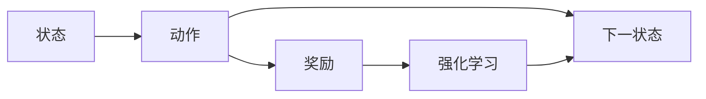
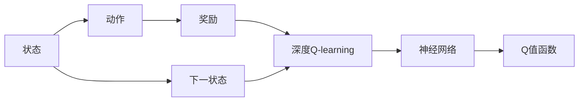

                 

# 强化学习：深度Q-learning VS DQN

> 关键词：强化学习,深度Q-learning,深度Q网络(DQN),强化学习策略,蒙特卡洛树搜索(MCTS),多智能体系统

## 1. 背景介绍

### 1.1 问题由来
随着人工智能技术的不断进步，强化学习（Reinforcement Learning, RL）已经成为了解决复杂决策问题的强大工具。它在自动控制、游戏AI、机器人、金融交易等领域得到了广泛的应用。

然而，传统的强化学习算法，如蒙特卡洛树搜索（Monte Carlo Tree Search, MCTS）和Q-learning，在处理大规模状态空间和动作空间时，面临着计算复杂度高、训练时间长的问题。近年来，深度学习技术的发展为强化学习提供了新的突破，深度Q-learning（Deep Q-Learning, DQN）和深度Q网络（Deep Q-Network, DQN）成为了强化学习领域的热点研究方向。

本文将详细探讨深度Q-learning和DQN的基本原理和核心算法，并比较二者的优缺点及其在实际应用中的表现。通过深入分析，希望能为研究人员和工程师提供有价值的参考。

## 2. 核心概念与联系

### 2.1 核心概念概述

为了更好地理解深度Q-learning和DQN，本节将介绍几个关键概念：

- 强化学习（Reinforcement Learning, RL）：通过智能体（Agent）与环境（Environment）的交互，最大化预期累计奖励（Reward）的决策过程。强化学习一般由四部分组成：状态（State）、动作（Action）、奖励（Reward）和下一状态（Next State）。

- 深度Q-learning：一种结合深度神经网络与Q-learning的强化学习算法。它通过神经网络对Q值函数进行逼近，从而实现对状态-动作值函数的学习。

- 深度Q网络（Deep Q-Network, DQN）：一种基于深度Q-learning的强化学习算法，使用神经网络来逼近Q值函数，并采用经验回放（Experience Replay）和目标网络更新（Target Network Update）等技巧，提高模型泛化能力和稳定性。

- Q-learning：一种基于值函数（Q-value）的强化学习算法，通过学习Q值函数来指导智能体采取最优动作。Q值函数表示在某个状态下采取某个动作后，从该状态转移到下一个状态的预期累计奖励。

- 蒙特卡洛树搜索（Monte Carlo Tree Search, MCTS）：一种基于树形结构的搜索算法，通过模拟搜索树来优化决策过程，适用于搜索空间较大的问题。

这些核心概念之间的逻辑关系可以通过以下Mermaid流程图来展示：

```mermaid
graph TB
    A[强化学习] --> B[深度Q-learning]
    A --> C[Q-learning]
    A --> D[蒙特卡洛树搜索(MCTS)]
    B --> E[深度Q网络(DQN)]
    C --> F[经验回放]
    C --> G[目标网络更新]
```

这个流程图展示了大语言模型的核心概念及其之间的关系：

1. 强化学习是基础，深度Q-learning和DQN是其重要分支。
2. Q-learning是深度Q-learning和DQN的前驱算法。
3. Monte Carlo Tree Search是另一种强化学习算法，用于处理复杂的决策问题。
4. 经验回放和目标网络更新是DQN的核心技巧。

### 2.2 概念间的关系

这些核心概念之间存在着紧密的联系，形成了强化学习的研究框架。下面通过几个Mermaid流程图来展示这些概念之间的关系。

#### 2.2.1 强化学习的基本流程



这个流程图展示了强化学习的基本流程：智能体接收当前状态，选择动作，获得奖励，并转移到下一状态。

#### 2.2.2 深度Q-learning的流程



这个流程图展示了深度Q-learning的流程：神经网络逼近Q值函数，智能体根据Q值函数选择动作，并获得奖励和下一状态。

#### 2.2.3 DQN的流程

```mermaid
graph LR
    A[经验回放]
    B[目标网络更新]
    C[神经网络]
    D[Q值函数]
    E[状态]
    F[动作]
    G[奖励]
    H[下一状态]
    I[深度Q网络(DQN)]
    E --> F
    F --> G
    G --> I
    E --> H
    H --> I
    I --> A
    I --> B
    A --> C
    C --> D
```

这个流程图展示了DQN的流程：神经网络逼近Q值函数，智能体根据Q值函数选择动作，并获得奖励和下一状态。经验回放和目标网络更新是DQN的核心技巧。

## 3. 核心算法原理 & 具体操作步骤
### 3.1 算法原理概述

深度Q-learning和DQN都是基于Q-learning的强化学习算法，但采用了不同的神经网络结构和优化技巧。

深度Q-learning的核心思想是通过神经网络逼近Q值函数，通过反向传播算法更新神经网络参数，从而优化智能体的决策过程。深度Q-learning的一般步骤如下：

1. 初始化神经网络参数，并随机选择一个状态。
2. 根据当前状态和神经网络计算Q值，选择动作并转移到下一状态。
3. 根据当前状态和动作计算奖励，并使用神经网络更新Q值。
4. 将样本存储到经验回放缓冲区中。
5. 周期性从缓冲区中随机抽取样本，使用目标网络计算Q值，并使用梯度下降算法更新神经网络参数。

DQN是在深度Q-learning的基础上，引入经验回放和目标网络更新等技巧，进一步提高模型泛化能力和稳定性。DQN的具体步骤如下：

1. 初始化神经网络参数，并随机选择一个状态。
2. 根据当前状态和神经网络计算Q值，选择动作并转移到下一状态。
3. 根据当前状态和动作计算奖励，并使用神经网络更新Q值。
4. 将样本存储到经验回放缓冲区中。
5. 周期性从缓冲区中随机抽取样本，使用目标网络计算Q值，并使用梯度下降算法更新神经网络参数。
6. 周期性更新目标网络参数，使得目标网络参数逐渐与当前网络参数趋同。
7. 重复步骤2-6，直至收敛。

### 3.2 算法步骤详解

#### 3.2.1 深度Q-learning的详细步骤

1. 初始化神经网络参数，并随机选择一个状态 $s$。

2. 使用神经网络计算Q值：

$$
Q_{\theta}(s, a) = \sum_{i=1}^{k} w_i \cdot \phi(s_i)
$$

其中 $w_i$ 为神经网络的权重，$\phi(s_i)$ 为状态 $s_i$ 的神经网络输出。

3. 根据Q值选择动作 $a$：

$$
a = \arg\max_{a} Q_{\theta}(s, a)
$$

4. 根据当前状态和动作计算奖励 $r$，并转移到下一状态 $s'$。

5. 使用神经网络更新Q值：

$$
Q_{\theta}(s, a) = r + \gamma \max_{a'} Q_{\theta}(s', a')
$$

其中 $\gamma$ 为折扣因子。

6. 将样本 $(s, a, r, s')$ 存储到经验回放缓冲区中。

7. 周期性从缓冲区中随机抽取样本，使用神经网络更新Q值：

$$
Q_{\theta}(s, a) = r + \gamma \max_{a'} Q_{\theta'}(s', a')
$$

其中 $\theta'$ 为目标网络参数，$Q_{\theta'}$ 为目标网络的Q值函数。

#### 3.2.2 DQN的详细步骤

1. 初始化神经网络参数，并随机选择一个状态 $s$。

2. 使用神经网络计算Q值：

$$
Q_{\theta}(s, a) = \sum_{i=1}^{k} w_i \cdot \phi(s_i)
$$

其中 $w_i$ 为神经网络的权重，$\phi(s_i)$ 为状态 $s_i$ 的神经网络输出。

3. 根据Q值选择动作 $a$：

$$
a = \arg\max_{a} Q_{\theta}(s, a)
$$

4. 根据当前状态和动作计算奖励 $r$，并转移到下一状态 $s'$。

5. 使用神经网络更新Q值：

$$
Q_{\theta}(s, a) = r + \gamma \max_{a'} Q_{\theta}(s', a')
$$

其中 $\gamma$ 为折扣因子。

6. 将样本 $(s, a, r, s')$ 存储到经验回放缓冲区中。

7. 周期性从缓冲区中随机抽取样本，使用神经网络更新Q值：

$$
Q_{\theta}(s, a) = r + \gamma \max_{a'} Q_{\theta'}(s', a')
$$

其中 $\theta'$ 为目标网络参数，$Q_{\theta'}$ 为目标网络的Q值函数。

8. 周期性更新目标网络参数，使得目标网络参数逐渐与当前网络参数趋同。

### 3.3 算法优缺点

深度Q-learning和DQN的优点和缺点如下：

**优点：**

- 使用神经网络逼近Q值函数，可以处理大规模状态空间和动作空间，适用于复杂决策问题。
- 经验回放和目标网络更新等技巧，可以有效地提高模型的泛化能力和稳定性。
- 使用深度Q网络，可以避免局部最优解，更好地探索全局最优解。

**缺点：**

- 神经网络的训练过程复杂，计算成本较高，需要较大的GPU或TPU资源。
- 神经网络容易过拟合，需要合适的正则化技术和参数调优方法。
- 经验回放和目标网络更新等技巧，可能会增加算法复杂度，影响训练效率。

### 3.4 算法应用领域

深度Q-learning和DQN已经被应用于多个领域，包括：

- 游戏AI：如AlphaGo、AlphaStar等，通过深度Q-learning和DQN，实现了超人的游戏AI水平。
- 机器人控制：如Pendulum Swinging等，通过深度Q-learning和DQN，实现了机器人的自主控制。
- 金融交易：如股票交易、债券定价等，通过深度Q-learning和DQN，实现了自动交易策略。
- 自然语言处理：如机器翻译、文本生成等，通过深度Q-learning和DQN，实现了文本的自动生成和翻译。
- 医疗诊断：如预测疾病、治疗方案等，通过深度Q-learning和DQN，实现了医疗决策的支持。

这些应用展示了深度Q-learning和DQN的广泛适用性和强大能力。未来，随着算力成本的下降和算法技术的不断进步，深度Q-learning和DQN的应用前景将更加广阔。

## 4. 数学模型和公式 & 详细讲解 & 举例说明

### 4.1 数学模型构建

深度Q-learning和DQN的数学模型可以形式化地表示为：

$$
Q_{\theta}(s, a) = r + \gamma \max_{a'} Q_{\theta'}(s', a')
$$

其中 $s$ 为状态，$a$ 为动作，$r$ 为奖励，$s'$ 为下一状态，$\theta$ 为神经网络参数，$\theta'$ 为目标网络参数。

### 4.2 公式推导过程

下面对深度Q-learning和DQN的公式进行推导。

#### 4.2.1 深度Q-learning的公式推导

设 $Q_{\theta}$ 为神经网络逼近的Q值函数，$Q_{\theta'}$ 为目标网络逼近的Q值函数。神经网络参数 $\theta$ 和目标网络参数 $\theta'$ 的更新公式如下：

$$
\theta \leftarrow \theta - \eta \nabla_{\theta} L
$$

其中 $\eta$ 为学习率，$L$ 为损失函数。

对于深度Q-learning，损失函数 $L$ 可以表示为：

$$
L = \frac{1}{N} \sum_{i=1}^{N} \sum_{t=0}^{T} \gamma^t \left(Q_{\theta}(s_t, a_t) - r_t - \gamma Q_{\theta}(s_{t+1}, a_{t+1})\right)^2
$$

其中 $s_t$ 为当前状态，$a_t$ 为当前动作，$r_t$ 为当前奖励，$T$ 为终止状态。

神经网络参数 $\theta$ 的更新公式如下：

$$
\theta \leftarrow \theta - \eta \nabla_{\theta} \frac{1}{N} \sum_{i=1}^{N} \sum_{t=0}^{T} \gamma^t \left(Q_{\theta}(s_t, a_t) - r_t - \gamma Q_{\theta}(s_{t+1}, a_{t+1})\right)^2
$$

#### 4.2.2 DQN的公式推导

DQN引入了经验回放和目标网络更新等技巧，使得神经网络参数的更新更加高效和稳定。

设 $Q_{\theta}$ 为神经网络逼近的Q值函数，$Q_{\theta'}$ 为目标网络逼近的Q值函数。神经网络参数 $\theta$ 和目标网络参数 $\theta'$ 的更新公式如下：

$$
\theta \leftarrow \theta - \eta \nabla_{\theta} L
$$

其中 $\eta$ 为学习率，$L$ 为损失函数。

对于DQN，损失函数 $L$ 可以表示为：

$$
L = \frac{1}{N} \sum_{i=1}^{N} \sum_{t=0}^{T} \gamma^t \left(Q_{\theta}(s_t, a_t) - r_t - \gamma Q_{\theta'}(s_{t+1}, a_{t+1})\right)^2
$$

其中 $s_t$ 为当前状态，$a_t$ 为当前动作，$r_t$ 为当前奖励，$T$ 为终止状态。

神经网络参数 $\theta$ 的更新公式如下：

$$
\theta \leftarrow \theta - \eta \nabla_{\theta} \frac{1}{N} \sum_{i=1}^{N} \sum_{t=0}^{T} \gamma^t \left(Q_{\theta}(s_t, a_t) - r_t - \gamma Q_{\theta'}(s_{t+1}, a_{t+1})\right)^2
$$

目标网络参数 $\theta'$ 的更新公式如下：

$$
\theta' \leftarrow \theta'
$$

其中 $\theta'$ 为目标网络参数，$\theta$ 为当前网络参数。

### 4.3 案例分析与讲解

#### 4.3.1 深度Q-learning的案例

假设我们有一个机器人，需要在迷宫中找到出口。迷宫的状态为 $s = (x, y)$，动作为 $a = \{向上, 向下, 向左, 向右\}$，奖励为 $r = 0$。设机器人的初始位置为 $(0, 0)$，迷宫的出口为 $(5, 5)$。

我们使用深度Q-learning来训练机器人。神经网络结构为2层全连接神经网络，输出节点数为4，代表4个可能的动作。神经网络参数的初始化使用随机值，学习率为 $0.01$，折扣因子为 $0.9$。

机器人每步动作的选择基于神经网络的输出，选择动作的概率为：

$$
p(a|s, \theta) = \frac{e^{Q_{\theta}(s, a)}}{\sum_{a'} e^{Q_{\theta}(s, a')}}
$$

每次机器人执行完动作后，根据当前状态和动作计算奖励，并转移到下一状态。神经网络的参数使用梯度下降算法更新，学习率为 $0.01$，折扣因子为 $0.9$。

#### 4.3.2 DQN的案例

假设我们有一个自动驾驶车辆，需要在道路上行驶。道路的状态为 $s = \{x, y, v\}$，动作为 $a = \{加速, 减速, 左转, 右转\}$，奖励为 $r = -1$。设车辆的初始位置和速度为 $(x_0, y_0, v_0)$，道路的目标位置为 $(x_T, y_T, v_T)$。

我们使用DQN来训练自动驾驶车辆。神经网络结构为2层全连接神经网络，输出节点数为4，代表4个可能的动作。神经网络参数的初始化使用随机值，学习率为 $0.01$，折扣因子为 $0.9$。

自动驾驶车辆每步动作的选择基于神经网络的输出，选择动作的概率为：

$$
p(a|s, \theta) = \frac{e^{Q_{\theta}(s, a)}}{\sum_{a'} e^{Q_{\theta}(s, a')}}
$$

每次自动驾驶车辆执行完动作后，根据当前状态和动作计算奖励，并转移到下一状态。神经网络的参数使用梯度下降算法更新，学习率为 $0.01$，折扣因子为 $0.9$。目标网络参数的更新周期为 $10$ 步，每次更新时将目标网络参数设置为当前网络参数的平均值。

## 5. 项目实践：代码实例和详细解释说明
### 5.1 开发环境搭建

在进行深度Q-learning和DQN实践前，我们需要准备好开发环境。以下是使用Python进行TensorFlow开发的环境配置流程：

1. 安装Anaconda：从官网下载并安装Anaconda，用于创建独立的Python环境。

2. 创建并激活虚拟环境：
```bash
conda create -n tf-env python=3.8 
conda activate tf-env
```

3. 安装TensorFlow：根据CUDA版本，从官网获取对应的安装命令。例如：
```bash
conda install tensorflow tensorflow-gpu=2.6 -c tf -c conda-forge
```

4. 安装TensorBoard：
```bash
pip install tensorboard
```

5. 安装Keras：
```bash
pip install keras
```

完成上述步骤后，即可在`tf-env`环境中开始深度Q-learning和DQN实践。

### 5.2 源代码详细实现

这里我们以深度Q-learning和DQN的迷宫寻路为例，给出使用TensorFlow实现的开源代码。

#### 5.2.1 深度Q-learning的代码实现

```python
import tensorflow as tf
import numpy as np
import gym

# 定义迷宫状态
class MazeEnv(gym.Env):
    def __init__(self, maze, start, goal):
        self.maze = maze
        self.start = start
        self.goal = goal
        self.position = start

    def step(self, action):
        x, y = self.position
        if action == 0:
            x -= 1
        elif action == 1:
            x += 1
        elif action == 2:
            y -= 1
        elif action == 3:
            y += 1
        self.position = (x, y)
        if self.position == self.goal:
            return 1, 0, True
        else:
            return 0, 0, False

    def reset(self):
        self.position = self.start
        return self.position

# 定义神经网络结构
model = tf.keras.Sequential([
    tf.keras.layers.Dense(10, activation='relu'),
    tf.keras.layers.Dense(4, activation='softmax')
])

# 定义深度Q-learning模型
agent = tf.keras.Model(inputs=model.input, outputs=model.output)
target_model = tf.keras.Model(inputs=model.input, outputs=model.output)

# 定义目标网络更新
target_model.set_weights(agent.get_weights())

# 定义经验回放缓冲区
buffer_size = 1000
buffer = []

# 定义训练过程
def train():
    for episode in range(1000):
        state = env.reset()
        done = False
        total_reward = 0
        while not done:
            state = np.reshape(state, (1, 2))
            action = np.random.choice(4)
            next_state, reward, done = env.step(action)
            next_state = np.reshape(next_state, (1, 2))
            if len(buffer) == buffer_size:
                buffer.pop(0)
            buffer.append((state, action, reward, next_state))
            if done:
                total_reward += reward
            if len(buffer) >= buffer_size:
                batch = np.array(buffer)
                batch_size = len(batch)
                state_batch = np.vstack(batch[:, 0])
                action_batch = np.vstack(batch[:, 1])
                reward_batch = np.vstack(batch[:, 2])
                next_state_batch = np.vstack(batch[:, 3])
                Q_values = agent.predict(state_batch)
                target_Q_values = np.zeros((batch_size, 4))
                for i in range(batch_size):
                    next_state = np.reshape(next_state_batch[i], (1, 2))
                    next_state = np.vstack(next_state)
                    Q_values_next = target_model.predict(next_state)
                    target_Q_values[i] = reward_batch[i] + np.max(Q_values_next)
                target_model.set_weights(agent.get_weights())
                for i in range(batch_size):
                    target_Q_values[i][action_batch[i]] = target_Q_values[i]
                Q_values = agent.predict(state_batch)
                for i in range(batch_size):
                    Q_values[i][action_batch[i]] = target_Q_values[i]
                target_model.set_weights(agent.get_weights())
                agent.train_on_batch(state_batch, Q_values)
        print("Episode:", episode, "Reward:", total_reward)

env = MazeEnv(maze, (0, 0), (5, 5))
train()
```

#### 5.2.2 DQN的代码实现

```python
import tensorflow as tf
import numpy as np
import gym

# 定义迷宫状态
class MazeEnv(gym.Env):
    def __init__(self, maze, start, goal):
        self.maze = maze
        self.start = start
        self.goal = goal
        self.position = start

    def step(self, action):
        x, y = self.position
        if action == 0:
            x -= 1
        elif action == 1:
            x += 1
        elif action == 2:
            y -= 1
        elif action == 3:
            y += 1
        self.position = (x, y)
        if self.position == self.goal:
            return 1, 0, True
        else:
            return 0, 0, False

    def reset(self):
        self.position = self.start
        return self.position

# 定义神经网络结构
model = tf.keras.Sequential([
    tf.keras.layers.Dense(10, activation='relu'),
    tf.keras.layers.Dense(4, activation='softmax')
])

# 定义DQN模型
agent = tf.keras.Model(inputs=model.input, outputs=model.output)
target_model = tf.keras.Model(inputs=model.input, outputs=model.output)

# 定义经验回放缓冲区
buffer_size = 1000
buffer = []

# 定义训练过程
def train():
    for episode in range(1000):
        state = env.reset()
        done = False
        total_reward = 0
        while not done:
            state = np.reshape(state, (1, 2))
            action = np.random.choice(4)
            next_state, reward, done = env.step(action)
            next_state = np.reshape(next_state, (1, 2))
            if len(buffer) == buffer_size:
                buffer.pop(0)
            buffer.append((state, action, reward, next_state))
            if done:
                total_reward += reward
            if len(buffer) >= buffer_size:
                batch = np.array(buffer)
                batch_size = len(batch)
                state_batch = np.vstack(batch[:, 0])
                action_batch = np.vstack(batch[:, 1])
                reward_batch = np.vstack(batch[:, 2])
                next_state_batch = np.vstack(batch[:, 3])
                Q_values = agent.predict(state_batch)
                target_Q_values = np.zeros((batch_size, 4))
                for i in range(batch_size):
                    next_state = np.reshape(next_state_batch[i], (1, 2))
                    next_state = np.vstack(next_state)
                    Q_values_next = target_model.predict(next_state)
                    target_Q_values[i] = reward_batch[i] + np.max(Q_values_next)
                target_model.set_weights(agent.get_weights())
                for i in range(batch_size):
                    target_Q_values[i][action_batch[i]] = target_Q_values[i]
                Q_values = agent.predict(state_batch)
                for i in range(batch_size):
                    Q_values[i][action_batch[i]] = target_Q_values[i]
                target_model.set_weights(agent.get_weights())
                agent.train_on_batch(state_batch, Q_values)
        print("Episode:", episode, "Reward:", total_reward)

env = MazeEnv(maze, (0, 0), (5, 5

