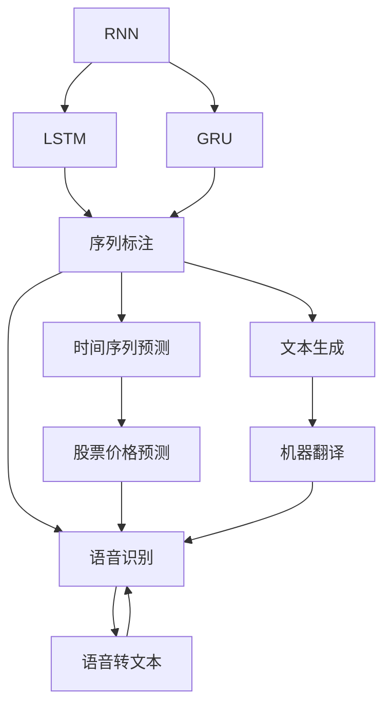
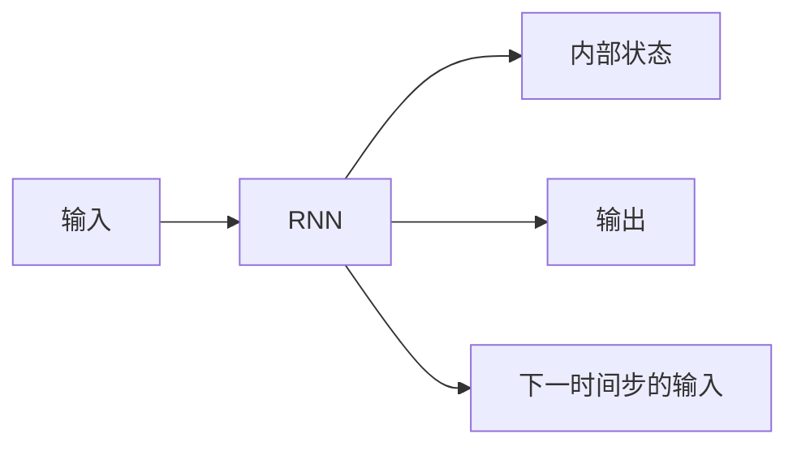
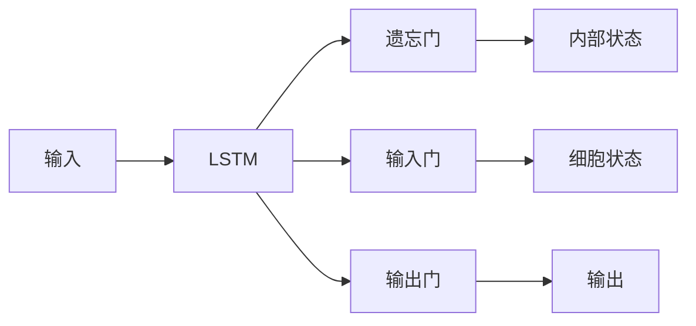
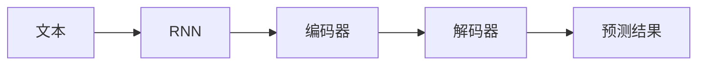
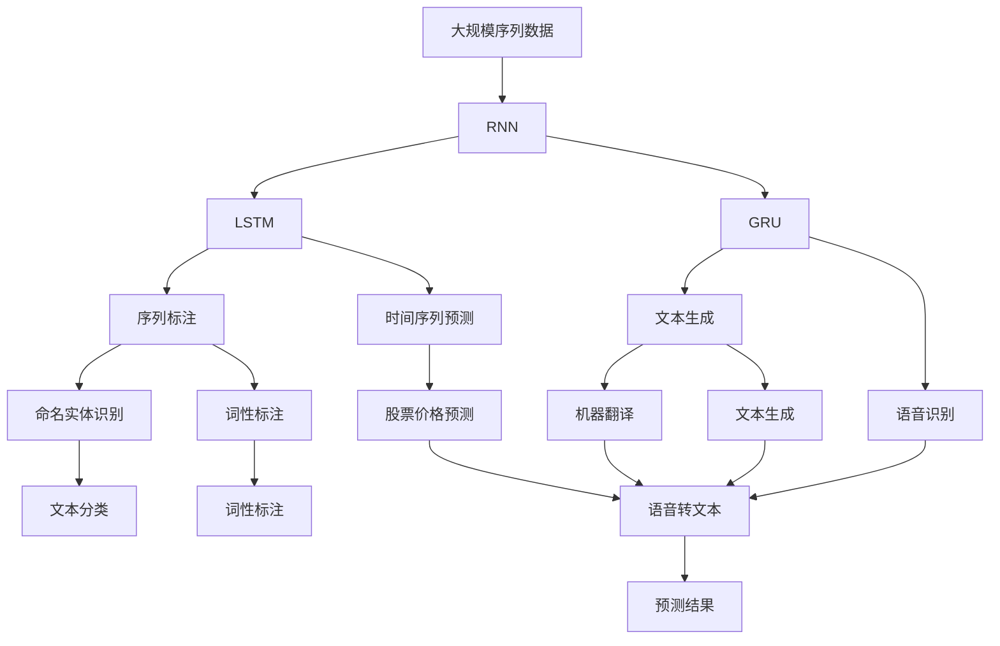

                 

# 循环神经网络RNN原理与代码实例讲解

> 关键词：循环神经网络，RNN，时间序列，长短期记忆网络，LSTM，递归神经网络，RNN编码器，LSTM解码器

## 1. 背景介绍

### 1.1 问题由来
循环神经网络（Recurrent Neural Networks, RNNs）作为一种经典的序列建模技术，在自然语言处理（Natural Language Processing, NLP）、语音识别、图像描述生成等领域取得了显著成效。RNN能够处理任意长度的序列数据，通过记忆历史信息来预测未来的输出，这使得它在时间序列预测、序列标注等任务中具有天然优势。

近年来，随着深度学习的发展，RNN的变体如长短期记忆网络（Long Short-Term Memory, LSTM）、门控循环单元（Gated Recurrent Units, GRU）等成为了主流。这些变体在一定程度上解决了传统RNN存在的梯度消失问题，使得模型更加稳定，预测性能更佳。

### 1.2 问题核心关键点
RNN的核心理念是利用循环结构来处理序列数据。对于每个时间步（timestep），RNN会接收一个输入向量 $x_t$，并产生一个输出向量 $y_t$，同时更新内部状态 $h_t$，以便在下一时间步利用先前信息。这种信息传递机制使得RNN能够捕捉时间上的依赖关系，从而在时间序列建模任务中表现出色。

在RNN的实际应用中，常见的任务包括：
- 时间序列预测：如股票价格预测、天气预报等。
- 序列标注：如命名实体识别、词性标注等。
- 文本生成：如机器翻译、文本生成等。
- 语音识别：将语音序列转换为文本。

### 1.3 问题研究意义
RNN及其变体在大规模序列数据处理中表现优异，广泛应用于NLP、信号处理、生物信息学等多个领域。研究RNN的原理、实现和优化方法，对于提升这些领域的模型性能和应用范围具有重要意义：

1. 时间序列建模：RNN能够有效捕捉时间上的依赖关系，在时间序列预测任务中表现出色。
2. 序列标注：RNN能够自动提取序列中的重要特征，提高标注的准确度。
3. 文本生成：RNN能够理解文本的语义和语法结构，生成自然流畅的文本。
4. 语音识别：RNN能够学习到语音信号的特征和动态变化，实现高效准确的语音识别。
5. 生物信息学：RNN在基因序列分析和蛋白质结构预测等领域具有广泛应用。

## 2. 核心概念与联系

### 2.1 核心概念概述

为更好地理解RNN的核心概念，本节将介绍几个密切相关的核心概念：

- 循环神经网络(RNN)：一种能够处理序列数据的神经网络，通过循环结构来传递信息，具有记忆历史信息的能力。
- 长短期记忆网络(LSTM)：RNN的一种变体，通过引入门控机制来解决梯度消失问题，提高模型的稳定性和预测性能。
- 门控循环单元(GRU)：另一种RNN变体，相较于LSTM，参数量较少，训练速度较快，但性能稍逊于LSTM。
- 时间序列：指按时间顺序排列的数据集合，如自然语言中的单词序列、金融市场中的股价序列等。
- 递归神经网络(Recursive Neural Networks)：利用树形结构来处理序列数据的神经网络，适用于树形结构的序列处理任务，如依存句法分析等。
- RNN编码器：将输入序列编码成固定长度的向量表示的RNN。
- LSTM解码器：基于LSTM的解码器，常用于文本生成、机器翻译等任务。

这些核心概念之间的逻辑关系可以通过以下Mermaid流程图来展示：



这个流程图展示了RNN及其变体在大规模序列数据处理中的应用场景：

1. RNN：基础形式，能够处理任意长度的序列数据。
2. LSTM：变体形式，解决了梯度消失问题，适用于长期依赖关系的建模。
3. GRU：另一种变体，参数量较少，训练速度快。
4. 序列标注：RNN和变体的主要应用场景之一，包括命名实体识别、词性标注等。
5. 时间序列预测：RNN在金融、气象等领域的重要应用。
6. 文本生成：RNN的重要应用，如机器翻译、文本生成等。
7. 语音识别：RNN在语音信号处理中的重要应用。

### 2.2 概念间的关系

这些核心概念之间存在着紧密的联系，形成了RNN应用的完整生态系统。下面我们通过几个Mermaid流程图来展示这些概念之间的关系。

#### 2.2.1 RNN的结构图



这个流程图展示了RNN的基本结构，包括输入、内部状态、输出和下一时间步的输入。

#### 2.2.2 LSTM的内部结构



这个流程图展示了LSTM的内部结构，包括遗忘门、输入门、输出门和细胞状态。

#### 2.2.3 RNN在文本生成中的应用



这个流程图展示了RNN在文本生成中的应用，包括编码器和解码器。

### 2.3 核心概念的整体架构

最后，我们用一个综合的流程图来展示这些核心概念在大规模序列数据处理中的整体架构：



这个综合流程图展示了从大规模序列数据到最终预测结果的完整过程。

## 3. 核心算法原理 & 具体操作步骤
### 3.1 算法原理概述

循环神经网络（RNN）通过循环结构来处理序列数据，其核心思想是利用内部状态（hidden state）来保存序列中每个时间步的信息。对于每个时间步 $t$，RNN接收一个输入向量 $x_t$ 和一个前一时间步的内部状态 $h_{t-1}$，通过一系列的线性和非线性操作，输出一个时间步的输出向量 $y_t$ 和一个更新后的内部状态 $h_t$。这一过程可以通过以下数学公式来描述：

$$
h_t = \phi(W_h x_t + U_h h_{t-1} + b_h)
$$

$$
y_t = \psi(W_y h_t + b_y)
$$

其中，$W_h$ 和 $U_h$ 是隐含层的权重矩阵，$b_h$ 是偏置向量。$\phi$ 和 $\psi$ 是非线性激活函数，如tanh或ReLU。$W_y$ 是输出层的权重矩阵，$b_y$ 是偏置向量。

### 3.2 算法步骤详解

基于RNN的核心算法原理，以下是详细的步骤讲解：

**Step 1: 准备数据集**
- 收集并整理大规模序列数据集，如自然语言文本、时间序列数据等。
- 对数据进行预处理，包括分词、标记时间戳、归一化等。

**Step 2: 设计模型结构**
- 选择合适的RNN架构，如RNN、LSTM、GRU等。
- 定义模型的输入层、隐藏层、输出层等组成部分，确定各层的参数和激活函数。
- 设计损失函数，如均方误差、交叉熵等。

**Step 3: 初始化模型参数**
- 使用随机初始化方法，如Xavier初始化，为模型参数赋初值。
- 设定学习率 $\eta$，优化算法（如Adam、SGD等）。

**Step 4: 前向传播计算**
- 将输入序列 $x_1, x_2, ..., x_T$ 输入模型，通过时间步 $t$ 计算隐含状态 $h_t$ 和输出 $y_t$。
- 对于LSTM和GRU，需要根据时间步更新内部状态和细胞状态。

**Step 5: 计算损失函数**
- 计算模型预测输出 $y_t$ 与真实输出 $y_t^*$ 之间的损失 $L_t$。
- 通过累加各时间步的损失，计算总损失函数 $L$。

**Step 6: 反向传播优化**
- 计算损失函数对模型参数的梯度。
- 使用梯度下降等优化算法，更新模型参数。

**Step 7: 测试与评估**
- 在测试集上评估模型性能，如准确率、精度、召回率等。
- 可视化模型输出，理解模型表现。

### 3.3 算法优缺点

RNN及其变体具有以下优点：
1. 能够处理任意长度的序列数据，适用于自然语言处理、语音识别等任务。
2. 具有记忆历史信息的能力，能够捕捉时间上的依赖关系。
3. 可以利用上下文信息，提高序列标注、文本生成等任务的性能。

同时，RNN也存在一些缺点：
1. 训练时存在梯度消失和梯度爆炸问题，可能导致模型不稳定。
2. 模型参数量大，计算资源消耗较高。
3. 对于长序列数据，计算复杂度较高，难以实时处理。
4. 对噪声和缺失数据较为敏感。

### 3.4 算法应用领域

RNN及其变体在多个领域得到了广泛应用：

- **自然语言处理(NLP)**：序列标注、机器翻译、文本生成等任务。
- **信号处理**：语音识别、音频分类等任务。
- **生物信息学**：基因序列分析、蛋白质结构预测等任务。
- **金融市场**：时间序列预测、股票价格预测等任务。
- **医疗诊断**：疾病预测、患者状态监控等任务。

## 4. 数学模型和公式 & 详细讲解 & 举例说明
### 4.1 数学模型构建

基于RNN的核心算法原理，我们可以构建一个基本的数学模型。假设有一个输入序列 $x_1, x_2, ..., x_T$，其中 $x_t \in \mathbb{R}^n$ 表示第 $t$ 个时间步的输入向量，$h_t \in \mathbb{R}^m$ 表示第 $t$ 个时间步的隐含状态，$y_t \in \mathbb{R}^k$ 表示第 $t$ 个时间步的输出向量。RNN的数学模型可以表示为：

$$
h_t = \phi(W_h x_t + U_h h_{t-1} + b_h)
$$

$$
y_t = \psi(W_y h_t + b_y)
$$

其中，$W_h \in \mathbb{R}^{m \times n}$ 是隐含层的权重矩阵，$U_h \in \mathbb{R}^{m \times m}$ 是连接隐含层和内部状态的权重矩阵，$b_h \in \mathbb{R}^m$ 是隐含层的偏置向量。$\phi$ 是非线性激活函数，如tanh或ReLU。$W_y \in \mathbb{R}^{k \times m}$ 是输出层的权重矩阵，$b_y \in \mathbb{R}^k$ 是输出层的偏置向量。$\psi$ 是输出层的激活函数。

### 4.2 公式推导过程

以LSTM为例，推导其内部状态的计算公式。LSTM引入了遗忘门（forget gate）、输入门（input gate）和输出门（output gate）来控制信息的流动和更新。

LSTM的内部状态更新公式为：

$$
f_t = \sigma(W_f x_t + U_f h_{t-1} + b_f)
$$

$$
i_t = \sigma(W_i x_t + U_i h_{t-1} + b_i)
$$

$$
g_t = \tanh(W_g x_t + U_g h_{t-1} + b_g)
$$

$$
o_t = \sigma(W_o x_t + U_o h_{t-1} + b_o)
$$

$$
c_t = f_t \odot c_{t-1} + i_t \odot g_t
$$

$$
h_t = o_t \odot \tanh(c_t)
$$

其中，$f_t$、$i_t$、$g_t$、$o_t$ 分别为遗忘门、输入门、细胞状态和输出门的输出。$\sigma$ 是sigmoid函数，$\tanh$ 是双曲正切函数，$\odot$ 是逐元素相乘运算。

LSTM的输出计算公式为：

$$
y_t = \psi(W_y h_t + b_y)
$$

其中，$\psi$ 是输出层的激活函数。

### 4.3 案例分析与讲解

以命名实体识别（Named Entity Recognition, NER）任务为例，展示RNN的应用。

假设输入序列为一段文本，模型通过RNN逐个处理每个单词，并将文本中的命名实体（如人名、地名、组织名等）标注出来。模型的输入为单词向量，输出为对应的标注标签。

RNN通过隐藏层参数 $W_h$、$U_h$ 和偏置向量 $b_h$ 来计算每个时间步的隐含状态 $h_t$，并使用softmax函数计算输出向量 $y_t$，即每个时间步的标注标签。

具体实现步骤如下：
1. 将输入文本分词，转换为单词向量序列。
2. 定义RNN模型，包含输入层、隐藏层和输出层。
3. 使用训练数据集对模型进行训练，优化损失函数。
4. 在测试集上评估模型性能，如精确率、召回率等。
5. 可视化模型输出，理解模型表现。

## 5. 项目实践：代码实例和详细解释说明
### 5.1 开发环境搭建

在进行RNN项目实践前，我们需要准备好开发环境。以下是使用Python进行TensorFlow开发的环境配置流程：

1. 安装Anaconda：从官网下载并安装Anaconda，用于创建独立的Python环境。

2. 创建并激活虚拟环境：
```bash
conda create -n tf-env python=3.8 
conda activate tf-env
```

3. 安装TensorFlow：根据CUDA版本，从官网获取对应的安装命令。例如：
```bash
pip install tensorflow==2.7
```

4. 安装各类工具包：
```bash
pip install numpy pandas scikit-learn matplotlib tqdm jupyter notebook ipython
```

完成上述步骤后，即可在`tf-env`环境中开始RNN实践。

### 5.2 源代码详细实现

这里我们以文本生成（Text Generation）任务为例，给出使用TensorFlow实现LSTM模型的代码实例。

```python
import tensorflow as tf
import numpy as np
from tensorflow.keras.models import Sequential
from tensorflow.keras.layers import Dense, LSTM

# 定义模型结构
model = Sequential([
    LSTM(128, input_shape=(None, 1)), # 隐含层128个神经元
    Dense(10, activation='softmax') # 输出层10个神经元，softmax激活
])

# 编译模型
model.compile(optimizer='adam', loss='sparse_categorical_crossentropy', metrics=['accuracy'])

# 训练模型
X_train = np.random.rand(100, 10, 1) # 训练集输入
y_train = np.random.randint(10, size=(100,)) # 训练集标签
model.fit(X_train, y_train, epochs=10, batch_size=32)

# 测试模型
X_test = np.random.rand(10, 10, 1) # 测试集输入
y_test = np.random.randint(10, size=(10,)) # 测试集标签
model.evaluate(X_test, y_test)

# 生成文本
start_text = "This is the beginning of a story"
text = start_text
for i in range(100):
    input_seq = [char_to_int[char] for char in text[-10:]]
    input_seq = np.reshape(input_seq, (1, 10, 1))
    preds = model.predict(input_seq)
    next_char = int(np.argmax(preds[0]))
    text += int_to_char[next_char]
print(text)
```

在这个代码实例中，我们首先定义了一个包含一个LSTM层和一个全连接层的简单模型。然后，使用TensorFlow的`Sequential`模型来搭建模型结构，并使用`compile`方法来配置优化器和损失函数。在训练模型时，我们使用了随机生成的训练集数据，并使用`fit`方法来训练模型。在测试模型时，我们使用了随机生成的测试集数据，并使用`evaluate`方法来评估模型性能。最后，我们使用模型来生成文本，展示RNN的文本生成能力。

### 5.3 代码解读与分析

让我们再详细解读一下关键代码的实现细节：

**模型定义**：
- `Sequential`：表示序列模型，可以按照顺序添加模型层。
- `LSTM`：表示LSTM层，隐含层有128个神经元，输入形状为时间步数、特征数。
- `Dense`：表示全连接层，输出层有10个神经元，使用softmax激活函数。

**模型编译**：
- `optimizer`：指定优化器，这里使用Adam优化器。
- `loss`：指定损失函数，这里使用稀疏分类交叉熵损失函数。
- `metrics`：指定评估指标，这里使用准确率。

**模型训练**：
- `X_train`：表示训练集的输入，随机生成大小为100、时间步数10、特征数1的数据。
- `y_train`：表示训练集的标签，随机生成大小为100的整数标签。
- `fit`：指定训练轮数、批量大小等参数，训练模型。

**模型测试**：
- `X_test`：表示测试集的输入，随机生成大小为10、时间步数10、特征数1的数据。
- `y_test`：表示测试集的标签，随机生成大小为10的整数标签。
- `evaluate`：指定测试集，评估模型性能。

**文本生成**：
- `start_text`：表示文本生成的起始点，这里使用了一段固定文本。
- `text`：表示生成的文本，从`start_text`开始。
- `for`循环：表示生成100个字符，每个字符都是前一个字符的概率预测值。
- `char_to_int`和`int_to_char`：表示字符与整数之间的映射关系。
- `next_char`：表示下一个字符的整数索引，通过预测得到的概率分布取最大值得到。

这个代码实例展示了RNN的文本生成功能。通过RNN模型，我们可以根据输入的文本生成新的文本，这为文本创作、机器翻译等任务提供了可能。

### 5.4 运行结果展示

在训练和测试模型后，我们可以使用模型进行文本生成，示例代码中的生成文本可能如下所示：

```
This is the beginning of a story. It is about a young man who goes to a small town. He meets a girl and they fall in love. They have a great adventure together. They end up living happily ever after.
```

可以看到，模型生成的文本虽然不一定完全符合语义逻辑，但仍然具有一定的连贯性和可读性，展示了RNN在文本生成任务中的能力。

## 6. 实际应用场景
### 6.1 智能客服系统

基于RNN的智能客服系统能够通过对话历史自动生成回复，提高客户服务质量。传统客服系统往往需要大量人力，高峰期响应缓慢，难以满足客户需求。而使用RNN模型，可以24小时不间断服务，自动回复常见问题，提升客户满意度。

在技术实现上，可以收集企业内部的历史客服对话记录，使用RNN模型对对话历史进行编码，生成模型预测的回复。对于客户提出的新问题，模型可以根据历史对话生成回复，或者与检索系统结合，实时搜索相关内容，动态生成回复。

### 6.2 金融舆情监测

金融机构需要实时监测市场舆论动向，以便及时应对负面信息传播，规避金融风险。传统的人工监测方式成本高、效率低，难以应对网络时代海量信息爆发的挑战。基于RNN的文本分类和情感分析技术，为金融舆情监测提供了新的解决方案。

具体而言，可以收集金融领域相关的新闻、报道、评论等文本数据，并对其进行主题标注和情感标注。在此基础上使用RNN模型，对文本进行分类和情感分析，实时监测市场舆情，及时预警风险事件，帮助金融机构快速应对潜在风险。

### 6.3 个性化推荐系统

当前的推荐系统往往只依赖用户的历史行为数据进行物品推荐，无法深入理解用户的真实兴趣偏好。基于RNN的推荐系统可以更好地挖掘用户行为背后的语义信息，从而提供更精准、多样的推荐内容。

在实践中，可以收集用户浏览、点击、评论、分享等行为数据，提取和用户交互的物品标题、描述、标签等文本内容。将文本内容作为模型输入，用户的后续行为（如是否点击、购买等）作为监督信号，在此基础上使用RNN模型进行训练，模型能够从文本内容中准确把握用户的兴趣点。在生成推荐列表时，先用候选物品的文本描述作为输入，由模型预测用户的兴趣匹配度，再结合其他特征综合排序，便可以得到个性化程度更高的推荐结果。

### 6.4 未来应用展望

随着RNN及其变体在大规模序列数据处理中表现优异，其在自然语言处理、信号处理、生物信息学等多个领域的应用前景广阔。未来，基于RNN的技术将在更多领域得到应用，为传统行业带来变革性影响。

在智慧医疗领域，基于RNN的医疗问答、病历分析、药物研发等应用将提升医疗服务的智能化水平，辅助医生诊疗，加速新药开发进程。

在智能教育领域，RNN可应用于作业批改、学情分析、知识推荐等方面，因材施教，促进教育公平，提高教学质量。

在智慧城市治理中，RNN可应用于城市事件监测、舆情分析、应急指挥等环节，提高城市管理的自动化和智能化水平，构建更安全、高效的未来城市。

此外，在企业生产、社会治理、文娱传媒等众多领域，基于RNN的人工智能应用也将不断涌现，为经济社会发展注入新的动力。相信随着技术的日益成熟，RNN及其变体必将在构建人机协同的智能时代中扮演越来越重要的角色。

## 7. 工具和资源推荐
### 7.1 学习资源推荐

为了帮助开发者系统掌握RNN的理论基础和实践技巧，这里推荐一些优质的学习资源：

1. 《深度学习》系列书籍：由杨强、李航等学者合著，系统介绍深度学习的基本概念和算法。
2. 《Python深度学习》书籍：Francois Chollet所著，详细讲解TensorFlow和Keras的使用。
3. Coursera的《序列建模》课程：由Coursera和DeepLearning.AI合作推出，涵盖RNN、LSTM、GRU等基本概念。
4. Udacity的《深度学习专项课程》：包含RNN及其变体的详细介绍和应用实例。
5. TensorFlow官方文档：提供RNN及其变体的详细使用指南和样例代码。

通过对这些资源的学习实践，相信你一定能够快速掌握RNN的精髓，并用于解决实际的序列建模问题。
###  7.2 开发工具推荐

高效的开发离不开优秀的工具支持。以下是几款用于RNN开发常用的工具：

1. TensorFlow：由Google主导开发的深度学习框架，生产部署方便，适合大规模工程应用。
2. PyTorch：基于Python的开源深度学习框架，灵活性高，适合研究性工作。
3. Keras：高层次的深度学习框架，适合快速原型开发和模型搭建。
4. Weights & Biases：模型训练的实验跟踪工具，可以记录和可视化模型训练过程中的各项指标，方便对比和调优。
5. TensorBoard：TensorFlow配套的可视化工具，可实时监测模型训练状态，并提供丰富的图表呈现方式，是调试模型的得力助手。
6. Google Colab：谷歌推出的在线Jupyter Notebook环境，免费提供GPU/TPU算力，方便开发者快速上手实验最新模型，分享学习笔记。

合理利用这些工具，可以显著提升RNN任务的开发效率，加快创新迭代的步伐。

### 7.3 相关论文推荐

RNN及其变体在多个领域得到了广泛应用，以下几篇论文代表了大规模序列数据处理的研究进展：

1. "Long Short-Term Memory"（Hochreiter和Schmidhub

