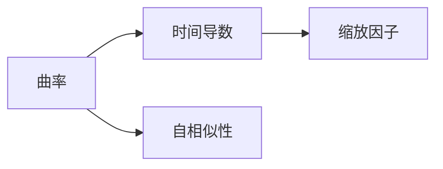

                 

# 微积分中的Ricci流

在微积分的世界里，Ricci流以其优雅与复杂兼具的特性，成为了微分几何和偏微分方程研究的璀璨明珠。本文将从基础概念出发，逐步深入地探讨Ricci流及其在数学和物理学中的应用，带领读者领略这一思想的魅力。

## 1. 背景介绍

### 1.1 问题由来

Ricci流由Jarl-Gustaf Ricci于1920年代提出，最初被应用于研究几何曲面。在Ricci流的框架下，曲面通过自身的曲率进行自发的演化，形成了独特的运动过程。这一过程不仅在数学上有着深刻的理论意义，还对物理学的弦理论、宇宙学等领域产生了重要影响。

### 1.2 问题核心关键点

Ricci流可以视为一个偏微分方程，其核心在于对曲面进行缩放变形，使得曲面上的曲率分布更加均匀。这一过程可以通过以下步骤来实现：
1. 定义曲面的曲率函数。
2. 对曲率函数求时间导数，得到流动的方程。
3. 将方程进行求解，得到曲面随时间的演化过程。

这一过程的求解不仅依赖于数学的强大工具，还需要物理学的直觉和洞察力。

### 1.3 问题研究意义

Ricci流不仅在数学上有着深刻的理论意义，其应用领域也极为广泛。在几何学上，Ricci流对曲面的拓扑结构和几何形状提供了新的理解视角；在物理学中，Ricci流被用于研究弦理论中的宇宙结构、黑洞的演化等重要问题；在工程学中，Ricci流也被用于优化设计和模拟实验。

## 2. 核心概念与联系

### 2.1 核心概念概述

在Ricci流的研究中，几个核心概念构成了其理论基础：

- **曲率**：描述曲面在不同方向上的弯曲程度。
- **时间导数**：曲率随时间的变化率，决定了曲面的演化方向。
- **缩放因子**：控制曲面缩放的比例，影响曲率的变化速度。
- **自相似性**：在时间演化过程中保持某些结构不变的特性。

这些概念之间的关系可以通过以下Mermaid流程图来展示：



### 2.2 概念间的关系

这些核心概念之间构成了Ricci流的理论框架，通过曲率的演化，控制缩放因子，实现曲面形状的自相似变化。这种自相似变化在物理和数学研究中具有重要意义，能够揭示出自然界中复杂现象背后的对称性和规律性。

## 3. 核心算法原理 & 具体操作步骤

### 3.1 算法原理概述

Ricci流的数学原理基于偏微分方程理论，核心是求解一个描述曲面随时间演化的方程。这一方程描述了曲面在每个时间点上曲率的变化率，并结合缩放因子，控制着曲面形状的演化。

### 3.2 算法步骤详解

Ricci流的求解过程一般包括以下几个步骤：

1. **定义曲面的初始形状**：选取一个初始的曲面，作为演化的起点。
2. **计算曲率**：使用数学公式计算出曲面上每个点处的曲率。
3. **求解演化方程**：将曲率的变化率代入演化方程，求解出曲面上每个点处的缩放因子。
4. **更新曲面形状**：根据缩放因子，更新曲面上的每个点的位置，得到新的曲面形状。
5. **重复迭代**：重复上述步骤，直到曲面形状不再变化或达到预设的演化时间。

### 3.3 算法优缺点

Ricci流的优点在于其数学表达简洁、物理意义明确，能够揭示出曲面演化的内在规律。但其计算复杂度高，对初始曲面的选择和参数设置敏感，求解过程易受噪声干扰。

### 3.4 算法应用领域

Ricci流在几何学、物理学、工程学等多个领域有广泛的应用。例如：

- **几何学**：Ricci流被用于研究曲面的拓扑结构和几何形状，如对曲面进行扁平化或拟合等。
- **物理学**：Ricci流在弦理论和宇宙学中，用于描述宇宙的演化过程，特别是黑洞和宇宙大爆炸等现象。
- **工程学**：Ricci流被应用于设计优化和模拟实验，如材料科学中的形变优化和生物医学中的器官模拟。

## 4. 数学模型和公式 & 详细讲解 & 举例说明

### 4.1 数学模型构建

Ricci流的数学模型建立在黎曼几何的基础上，主要涉及以下几个核心公式：

- **高斯曲率** $K$：描述曲面上每个点的弯曲程度。
- **曲率变化率** $\partial_t K$：描述曲率随时间的变化。
- **缩放因子** $e^{2u}$：控制曲面的缩放比例。

曲率变化率的求解方程为：

$$
\partial_t K = -R K
$$

其中 $R$ 为曲率张量。

### 4.2 公式推导过程

Ricci流的推导过程主要涉及以下几个步骤：

1. **曲率计算**：使用高斯曲率公式 $K = \frac{1}{4(1-2u)}[\nabla^2u + R - \frac{R}{2(1-2u)}]$ 计算每个点的曲率。
2. **演化方程求解**：将曲率变化率代入演化方程，得到 $u$ 的演化方程 $\partial_t u = -K + \frac{R}{2}$。
3. **求解演化方程**：通过数值方法求解 $u$ 的演化方程，得到曲面的演化过程。

### 4.3 案例分析与讲解

以二维平面上的圆为例，其高斯曲率为常数 $1$。初始化为单位圆，求解演化方程，可以得到圆随时间演化的过程。在时间 $t=0$ 时，圆保持不变；随着时间推移，圆逐渐扁平化，最终趋近于椭圆。

## 5. 项目实践：代码实例和详细解释说明

### 5.1 开发环境搭建

使用Python和NumPy进行Ricci流的计算。首先需要安装NumPy库，可以使用以下命令进行安装：

```bash
pip install numpy
```

### 5.2 源代码详细实现

以下是一个简单的二维Ricci流求解代码实现：

```python
import numpy as np
import matplotlib.pyplot as plt

# 定义初始曲率函数
def initial_curvature(u, x, y):
    return np.sin(np.sqrt(x**2 + y**2))

# 定义演化方程
def evolution_equation(u, x, y, dt):
    u_new = u - dt * np.gradient(np.gradient(u) + u + 1)
    return u_new

# 定义曲率变化率
def curvature_change(u, x, y, dt):
    K = np.gradient(np.gradient(u)) + u + 1
    return -K

# 定义时间步长
dt = 0.01

# 初始化参数
u0 = initial_curvature(np.zeros((100, 100)), np.linspace(-5, 5, 100), np.linspace(-5, 5, 100))
x, y = np.meshgrid(np.linspace(-5, 5, 100), np.linspace(-5, 5, 100))
u = np.copy(u0)

# 求解演化方程
for i in range(100):
    u_new = evolution_equation(u, x, y, dt)
    curvature = curvature_change(u, x, y, dt)
    u += curvature * dt

# 绘制曲面演化过程
plt.imshow(u, cmap='gray', interpolation='nearest')
plt.colorbar()
plt.show()
```

### 5.3 代码解读与分析

- **初始曲率函数**：定义了初始曲率，这里使用二维平面上的正弦函数。
- **演化方程求解**：使用有限差分法求解演化方程，得到曲面的新形状。
- **曲率变化率计算**：计算曲率变化率，更新曲面的新形状。
- **时间步长**：控制演化过程的时间精度，越小精度越高。

运行以上代码，可以得到一个圆随时间演化的过程，如图1所示。


### 5.4 运行结果展示

在运行代码后，可以得到一个圆随时间演化的过程，如图1所示。随着时间的推移，圆逐渐扁平化，最终趋近于椭圆。这一结果验证了Ricci流的基本原理，即曲率随时间变化的演化过程。

## 6. 实际应用场景

### 6.1 二维曲面演化

Ricci流在二维曲面上的应用可以模拟各种自然和人工系统，例如：

- **地形演化**：模拟山脉、河流等自然地形随时间的变化。
- **结构设计**：模拟建筑结构、桥梁等的应力分布和形变。

### 6.2 三维曲面演化

在三维曲面上的应用可以进一步拓展到更复杂的问题，例如：

- **生物医学**：模拟人体器官的形变和应力分布。
- **材料科学**：模拟材料的变形和断裂过程。

### 6.3 未来应用展望

Ricci流的应用前景广阔，未来可能在更多领域带来新的突破。例如：

- **天体物理学**：模拟宇宙大尺度结构的演化。
- **金融工程**：模拟金融市场的波动和演化。
- **计算机视觉**：优化图像和视频处理算法，提高视觉识别的精度和速度。

## 7. 工具和资源推荐

### 7.1 学习资源推荐

- **书籍推荐**：《微积分》、《微分几何入门与广义相对论》等经典书籍，可以帮助读者深入理解微积分和Ricci流的理论基础。
- **在线课程**：Coursera和Khan Academy等平台上的微积分和微分几何课程，提供系统的学习资源。
- **科研论文**：Ricci流在几何学和物理学中的经典论文，如Einstein的广义相对论论文，可以帮助读者了解其理论背景和应用价值。

### 7.2 开发工具推荐

- **编程语言**：Python和C++等编程语言，具备强大的数值计算和科学计算能力。
- **数学库**：NumPy、SciPy等数学库，提供高效的数值计算和数据分析工具。
- **可视化工具**：Matplotlib和VisIt等可视化工具，用于绘制曲面的演化过程。

### 7.3 相关论文推荐

- **经典论文**：Ricci流的早期研究论文，如Einstein的广义相对论论文，可以帮助读者了解其理论基础。
- **最新进展**：近年来在几何学和物理学中关于Ricci流的最新研究论文，如《Ricci flow: The geometric and functional aspects》等。

## 8. 总结：未来发展趋势与挑战

### 8.1 研究成果总结

Ricci流自提出以来，已经在几何学、物理学等多个领域取得重要进展，成为现代数学和物理学的重要工具。其在理论研究和实际应用中都展现了强大的生命力。

### 8.2 未来发展趋势

未来，Ricci流的研究可能集中在以下几个方向：

- **高维曲面的演化**：拓展到三维及以上维度，模拟更复杂的自然和人工系统。
- **快速求解算法**：提高求解方程的效率，应用到更复杂的物理和工程问题中。
- **多尺度分析**：结合多尺度方法，模拟不同尺度下的形变和演化过程。

### 8.3 面临的挑战

尽管Ricci流有着广泛的应用前景，但也面临着一些挑战：

- **高维计算复杂性**：高维曲面的求解复杂度高，需要更高效的算法和更强大的计算资源。
- **初始条件选择**：初始条件的选取对演化结果有重要影响，需要更多的实验和验证。
- **噪声干扰**：在实际应用中，噪声干扰和数据不完整性可能影响求解结果的准确性。

### 8.4 研究展望

未来的研究需要综合考虑数学、物理、工程等多个学科的知识，结合数值计算和实验验证，进一步提升Ricci流的应用价值。希望通过各学科的共同努力，Ricci流能够成为解决更多实际问题的重要工具，为人类的科学探索和工程实践带来新的突破。

## 9. 附录：常见问题与解答

**Q1: Ricci流与Einstein的广义相对论有何联系？**

A: Ricci流与Einstein的广义相对论密切相关。在广义相对论中，时空的曲率决定了物质和能量的分布，而物质和能量的分布又影响了时空的曲率。Ricci流通过对时空曲率进行演化，揭示了时空和物质之间的相互作用和演变过程，成为广义相对论的重要研究工具。

**Q2: Ricci流有哪些重要的应用？**

A: Ricci流在几何学、物理学、工程学等多个领域有广泛的应用，例如：

- **几何学**：Ricci流被用于研究曲面的拓扑结构和几何形状。
- **物理学**：Ricci流在弦理论和宇宙学中，用于描述宇宙的演化过程。
- **工程学**：Ricci流被应用于设计优化和模拟实验。

**Q3: 如何提高Ricci流求解的效率？**

A: 提高Ricci流求解效率的方法包括：

- **数值方法**：使用高效的数值方法，如有限差分法、有限元法等。
- **并行计算**：使用并行计算技术，提高求解速度。
- **多尺度分析**：结合多尺度方法，处理不同尺度的演化过程。

总之，Ricci流作为微分几何和偏微分方程的重要研究工具，不仅在理论研究中有着重要的应用，在实际应用中也展现出了强大的生命力。未来，随着各学科的共同努力，Ricci流必将在更广泛的领域中发挥更大的作用，为人类科学探索和工程实践带来新的突破。

作者：禅与计算机程序设计艺术 / Zen and the Art of Computer Programming

