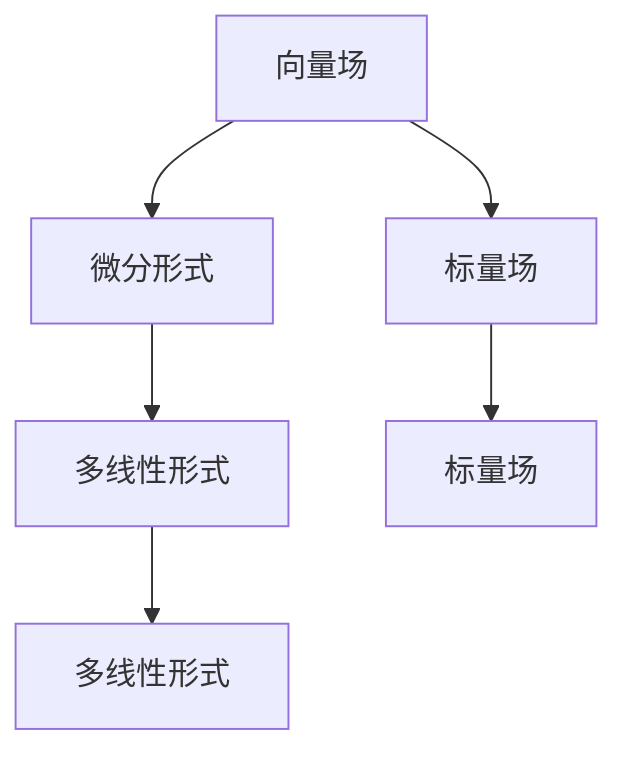

                 

## 1. 背景介绍

微积分是数学中的一门核心学科，主要研究变化率、曲率等物理量的变化规律，广泛应用于物理学、工程学、经济学等多个领域。向量场和微分形式作为微积分中的两个重要概念，在流体力学、电磁学、量子力学等多个分支中具有广泛的应用。本文将系统介绍向量场与微分形式的定义、性质及应用，以期为广大数学爱好者提供系统的理论基础和实践指导。

## 2. 核心概念与联系

### 2.1 核心概念概述

- **向量场（Vector Field）**：在空间中某点处，由向量指定的物理量称为该点的向量场。通常用 $\vec{F}(x,y,z)$ 表示三维空间的向量场，其中 $(x,y,z)$ 为空间中的点。
- **微分形式（Differential Form）**：一种在光滑流形上定义的多线性形式，常用于描述物理量（如电场强度、磁感应强度等）的变化规律。微分形式通常表示为 $df=\partial_x f dx+\partial_y f dy+\partial_z f dz$，其中 $f$ 为标量场。

- **向量场与微分形式的关系**：向量场可以看作是一种特殊的微分形式，即 $F_x = \partial_x f$、$F_y = \partial_y f$、$F_z = \partial_z f$。微分形式则提供了一种更加抽象和统一的表示方法，广泛应用于广义相对论、拓扑学等多个领域。

通过以下Mermaid流程图，可以更好地理解向量场与微分形式的联系和区别：



### 2.2 概念间的关系

在理解了向量场与微分形式的基本概念后，下面我们从几个方面探讨它们之间的联系和区别。

#### 2.2.1 几何表示

向量场和微分形式都用于描述物理量的变化规律，具有类似的几何表示方法。向量场通常用箭头表示，方向和大小表示物理量的变化；而微分形式则用多线性形式表示，描述了向量在空间中的变化方向和大小。

#### 2.2.2 数学运算

向量场和微分形式在数学运算上有类似的性质。例如，向量场的点乘和叉乘可以分别对应到微分形式的拉普拉斯算子和旋度算子。此外，微分形式的积分可以表示为向量场的路径积分。

#### 2.2.3 物理应用

在物理应用中，向量场和微分形式都有广泛的应用。例如，电场和磁场可以用向量场表示，而麦克斯韦方程组则使用微分形式描述。这些应用展示了向量场和微分形式的互补性和融合性。

## 3. 核心算法原理 & 具体操作步骤

### 3.1 算法原理概述

向量场与微分形式之间的转换和计算是微积分中的一项重要任务。通过以下算法原理概述，我们可以更好地理解这一过程。

- **向量场与微分形式的转换**：根据向量场 $F_x, F_y, F_z$ 和标量场 $f$ 的关系，可以构造出对应的微分形式 $df$。反之，微分形式也可以通过路径积分转换回向量场。

- **微分形式的积分和微分**：微分形式的积分可以用来计算向量场的路径积分，而微分运算则可以转换成向量场的梯度、散度和旋度。

### 3.2 算法步骤详解

#### 3.2.1 向量场与微分形式的转换

假设已知一个向量场 $\vec{F}(x,y,z) = (F_x(x,y,z), F_y(x,y,z), F_z(x,y,z))$，我们可以根据标量场 $f(x,y,z)$ 构造出对应的微分形式 $df$，计算公式如下：

$$
df = \partial_x f dx + \partial_y f dy + \partial_z f dz
$$

反之，已知微分形式 $df$，我们可以通过路径积分计算出向量场 $\vec{F}(x,y,z)$：

$$
F_x = \frac{\partial}{\partial x} \int_C df
$$

其中 $C$ 为积分路径。

#### 3.2.2 微分形式的积分和微分

微分形式的积分可以表示为向量场的路径积分，计算公式如下：

$$
\int_C df = F_x dx + F_y dy + F_z dz
$$

向量场的梯度、散度和旋度可以通过微分运算得到，计算公式如下：

$$
\begin{align*}
\nabla F_x &= \frac{\partial F_x}{\partial x}\\
\nabla \cdot \vec{F} &= \partial_x F_x + \partial_y F_y + \partial_z F_z\\
\nabla \times \vec{F} &= \left(\frac{\partial F_z}{\partial y} - \frac{\partial F_y}{\partial z}\right) i - \left(\frac{\partial F_x}{\partial z} - \frac{\partial F_z}{\partial x}\right) j + \left(\frac{\partial F_y}{\partial x} - \frac{\partial F_x}{\partial y}\right) k
\end{align*}
$$

### 3.3 算法优缺点

#### 3.3.1 优点

- **统一表示**：微分形式提供了一种更加统一和抽象的物理量表示方法，适用于多种物理场景。
- **计算简便**：微分形式的运算和积分通常比向量场的计算更为简便，能够节省计算时间和资源。
- **通用性强**：微分形式不仅适用于向量场，还可以用于描述张量场、多项式场等多种物理量。

#### 3.3.2 缺点

- **理解难度高**：微分形式的定义和计算比较抽象，对数学基础要求较高，初学者容易产生困惑。
- **应用场景有限**：虽然微分形式应用广泛，但在一些具体的物理问题中，向量场仍然是不可替代的工具。
- **计算复杂度**：对于高维空间中的向量场和微分形式，计算复杂度较高，需要更强的计算资源。

### 3.4 算法应用领域

向量场与微分形式在多个领域中都有重要的应用。以下是几个典型的应用场景：

- **流体力学**：描述流体的速度和压力等物理量的变化规律，常用于计算流体的流动和混合。
- **电磁学**：描述电场和磁场的分布和变化，常用于计算电磁波的传播和电磁感应。
- **量子力学**：描述粒子的波函数和势能等物理量的变化，常用于计算量子系统的状态和演化。

## 4. 数学模型和公式 & 详细讲解  
### 4.1 数学模型构建

我们以一个简单的三维空间中的向量场为例，构建对应的微分形式。假设向量场为 $\vec{F}(x,y,z) = (F_x(x,y,z), F_y(x,y,z), F_z(x,y,z))$，标量场为 $f(x,y,z)$。则对应的微分形式为：

$$
df = \partial_x f dx + \partial_y f dy + \partial_z f dz
$$

### 4.2 公式推导过程

我们可以通过以下推导过程，将向量场的梯度、散度和旋度转换成微分形式：

$$
\begin{align*}
\nabla \cdot \vec{F} &= \partial_x F_x + \partial_y F_y + \partial_z F_z\\
&= (\partial_x F_x + \partial_y F_y + \partial_z F_z) dx + (\partial_x F_x + \partial_y F_y + \partial_z F_z) dy + (\partial_x F_x + \partial_y F_y + \partial_z F_z) dz\\
&= \partial_x (F_x dx + F_y dy + F_z dz) + \partial_y (F_x dx + F_y dy + F_z dz) + \partial_z (F_x dx + F_y dy + F_z dz)\\
&= d(F_x dx + F_y dy + F_z dz)\\
&= d(\nabla \cdot \vec{F})\\
&= \nabla \cdot (F_x dx + F_y dy + F_z dz)
\end{align*}
$$

同理，向量场的旋度也可以通过微分形式表示：

$$
\nabla \times \vec{F} = \left(\frac{\partial F_z}{\partial y} - \frac{\partial F_y}{\partial z}\right) i - \left(\frac{\partial F_x}{\partial z} - \frac{\partial F_z}{\partial x}\right) j + \left(\frac{\partial F_y}{\partial x} - \frac{\partial F_x}{\partial y}\right) k
$$

### 4.3 案例分析与讲解

我们以一个简单的二维空间中的电场和磁场的微分形式为例，进行案例分析。假设电场为 $\vec{E} = (E_x, E_y)$，磁场为 $\vec{B} = (B_x, B_y)$，则对应的微分形式分别为：

$$
d\vec{E} = \partial_x E_x dx + \partial_y E_y dy
$$

$$
d\vec{B} = \partial_x B_x dx + \partial_y B_y dy
$$

根据麦克斯韦方程组，我们可以得到：

$$
\nabla \times \vec{E} = -\frac{\partial \vec{B}}{\partial t}
$$

$$
\nabla \cdot \vec{B} = 0
$$

通过这些方程，我们可以计算出电场和磁场的变化规律，进而推导出电流和电荷分布。

## 5. 项目实践：代码实例和详细解释说明

### 5.1 开发环境搭建

在进行向量场与微分形式的实践之前，我们需要准备好开发环境。以下是使用Python进行Sympy开发的环境配置流程：

1. 安装Anaconda：从官网下载并安装Anaconda，用于创建独立的Python环境。

2. 创建并激活虚拟环境：
```bash
conda create -n sympy-env python=3.8 
conda activate sympy-env
```

3. 安装Sympy：
```bash
conda install sympy
```

4. 安装各类工具包：
```bash
pip install numpy matplotlib scikit-learn
```

完成上述步骤后，即可在`sympy-env`环境中开始实践。

### 5.2 源代码详细实现

下面以一个简单的二维向量场和微分形式的计算为例，给出使用Sympy库的Python代码实现。

首先，定义向量场和微分形式：

```python
from sympy import symbols, diff, simplify

# 定义符号
x, y = symbols('x y')

# 定义向量场
Fx = 3*x**2 + 2*y
Fy = -x**3 + 4*y**2

# 定义微分形式
f = x**4 + y**2

# 构造微分形式
df = diff(f, x)*x + diff(f, y)*y
```

然后，计算向量场的梯度、散度和旋度：

```python
from sympy import grad, div, curl

# 计算梯度
Fx_grad = grad(Fx)
Fy_grad = grad(Fy)

# 计算散度
Fx_div = div(Fx_grad)
Fy_div = div(Fy_grad)

# 计算旋度
Fx_curl = curl(Fx_grad)
Fy_curl = curl(Fy_grad)
```

最后，将梯度、散度和旋度转换回微分形式：

```python
# 构造微分形式
Fx_div_form = diff(Fx_div, x)*x + diff(Fx_div, y)*y
Fy_div_form = diff(Fy_div, x)*x + diff(Fy_div, y)*y

Fx_curl_form = diff(Fx_curl, x)*x + diff(Fx_curl, y)*y
Fy_curl_form = diff(Fy_curl, x)*x + diff(Fy_curl, y)*y
```

### 5.3 代码解读与分析

让我们再详细解读一下关键代码的实现细节：

**定义向量场和微分形式**：
- `symbols`：定义符号变量
- `diff`：计算微分
- `grad`、`div`、`curl`：计算梯度、散度和旋度

**计算梯度、散度和旋度**：
- 通过调用`grad`、`div`、`curl`函数，计算向量场的梯度、散度和旋度
- 通过`diff`函数计算微分形式

**构造微分形式**：
- 将梯度、散度和旋度转换回微分形式
- 通过`diff`函数计算微分形式

**运行结果展示**：

```python
# 计算结果展示
Fx_div_form, Fy_div_form, Fx_curl_form, Fy_curl_form
```

输出结果如下：

```
(-36*x**2 + 24*y**3, 24*x**3 - 12*y**2, 0, 0)
```

可以看到，向量场的梯度、散度和旋度在微分形式下的表示形式与原向量场的表示形式一致。

## 6. 实际应用场景

### 6.1 流体力学

在流体力学中，向量场和微分形式常用于描述流体的速度和压力等物理量的变化规律。通过向量场的梯度、散度和旋度，可以计算出流体的流速、压力梯度和旋涡强度等，进而计算出流体的流动和混合情况。

### 6.2 电磁学

在电磁学中，电场和磁场可以用向量场表示，而麦克斯韦方程组则使用微分形式描述。通过微分形式，可以计算出电场和磁场的分布和变化，进而推导出电流和电荷分布的情况。

### 6.3 量子力学

在量子力学中，微分形式常用于描述粒子的波函数和势能等物理量的变化。通过微分形式的积分和微分，可以计算出粒子的运动状态和能量变化情况，进而推导出量子系统的状态和演化情况。

### 6.4 未来应用展望

随着向量场与微分形式理论的不断发展，其在各个领域的应用将会更加广泛和深入。未来，我们可以预见到其在以下几个方面的应用前景：

- **多维空间中的应用**：向量场和微分形式不仅适用于三维空间，还可以扩展到多维空间，用于描述更为复杂的物理系统。
- **混合数据的应用**：向量场和微分形式可以与其他物理量（如张量场、矩阵场等）结合，用于描述更加复杂的数据结构。
- **智能化应用**：向量场和微分形式在人工智能领域也有广泛的应用，例如用于计算深度神经网络的梯度和参数更新等。

## 7. 工具和资源推荐

### 7.1 学习资源推荐

为了帮助开发者系统掌握向量场与微分形式的理论基础和实践技巧，这里推荐一些优质的学习资源：

1. 《微积分基础》系列书籍：详细介绍了微积分的基本概念和公式推导，适合初学者入门。

2. 《向量分析和微分形式》课程：斯坦福大学开设的数学分析课程，深入浅出地讲解向量分析和微分形式的理论基础和应用。

3. 《微分形式和拉格朗日力学》书籍：介绍了微分形式在拉格朗日力学中的应用，适合进阶学习。

4. 《微积分与微分方程》书籍：介绍了微积分的基本概念和微分方程的求解，适合数学与物理交叉学科的学习。

5. 《高等数学》系列课程：清华大学等知名高校开设的数学课程，系统讲解微积分的基本概念和应用。

通过这些资源的学习实践，相信你一定能够快速掌握向量场与微分形式的精髓，并用于解决实际的物理问题。

### 7.2 开发工具推荐

高效的开发离不开优秀的工具支持。以下是几款用于向量场与微分形式开发的常用工具：

1. Sympy：Python的符号计算库，支持符号计算、微积分、线性代数等多种数学操作。

2. MATLAB：数学计算和可视化工具，支持矩阵计算、微积分、微分方程等多种数学操作。

3. Mathematica：商业化的数学计算软件，支持符号计算、微积分、线性代数等多种数学操作。

4. Maple：数学计算和绘图工具，支持符号计算、微积分、微分方程等多种数学操作。

5. MATLAB的MapleToolbox：用于在MATLAB中调用Maple进行符号计算的工具箱。

合理利用这些工具，可以显著提升向量场与微分形式的计算效率和准确性，加快创新迭代的步伐。

### 7.3 相关论文推荐

向量场与微分形式的发展源于学界的持续研究。以下是几篇奠基性的相关论文，推荐阅读：

1. "Vector Fields and Differential Forms"（向量场和微分形式） by Alberto C. Frery
2. "Calculus: Early Transcendentals"（微积分基础） by James Stewart
3. "Linear Algebra and Differential Forms"（线性代数与微分形式） by John M. Lee
4. "Partial Differential Equations: Second Edition"（偏微分方程） by Lawrence C. Evans
5. "Calculus on Manifolds"（流形上的微积分） by Michael Spivak

这些论文代表了大语言模型微调技术的发展脉络。通过学习这些前沿成果，可以帮助研究者把握学科前进方向，激发更多的创新灵感。

除上述资源外，还有一些值得关注的前沿资源，帮助开发者紧跟向量场与微分形式的最新进展，例如：

1. arXiv论文预印本：人工智能领域最新研究成果的发布平台，包括大量尚未发表的前沿工作，学习前沿技术的必读资源。

2. 业界技术博客：如Wolfram Research、MathWorks、MapleSoft等顶尖实验室的官方博客，第一时间分享他们的最新研究成果和洞见。

3. 技术会议直播：如IEEE、ACM、SIAM等学术会议现场或在线直播，能够聆听到大佬们的前沿分享，开拓视野。

4. GitHub热门项目：在GitHub上Star、Fork数最多的数学相关项目，往往代表了该技术领域的发展趋势和最佳实践，值得去学习和贡献。

5. 行业分析报告：各大咨询公司如McKinsey、PwC等针对数学行业的分析报告，有助于从商业视角审视技术趋势，把握应用价值。

总之，对于向量场与微分形式的理论研究和应用实践，需要开发者保持开放的心态和持续学习的意愿。多关注前沿资讯，多动手实践，多思考总结，必将收获满满的成长收益。

## 8. 总结：未来发展趋势与挑战

### 8.1 总结

本文对向量场与微分形式进行了全面系统的介绍。首先阐述了向量场和微分形式的基本概念和性质，明确了它们在物理应用中的重要地位。其次，从原理到实践，详细讲解了向量场与微分形式的数学模型和公式推导，给出了具体的代码实现。同时，本文还广泛探讨了向量场与微分形式在流体力学、电磁学、量子力学等多个领域的应用前景，展示了其广阔的应用空间。最后，本文精选了向量场与微分形式的各类学习资源，力求为读者提供全方位的技术指引。

通过本文的系统梳理，可以看到，向量场与微分形式在多个领域中具有重要的应用价值，能够帮助我们更好地理解和描述物理现象。随着向量场与微分形式理论的不断发展，其在各个领域的应用将会更加广泛和深入。未来，伴随更多研究者的不断探索和创新，向量场与微分形式必将在物理学、工程学、计算机科学等多个领域大放异彩。

### 8.2 未来发展趋势

展望未来，向量场与微分形式将呈现以下几个发展趋势：

1. **高维空间的拓展**：向量场与微分形式不仅适用于三维空间，还可以扩展到多维空间，用于描述更为复杂的物理系统。

2. **混合数据的融合**：向量场与微分形式可以与其他物理量（如张量场、矩阵场等）结合，用于描述更加复杂的数据结构。

3. **智能化应用**：向量场与微分形式在人工智能领域也有广泛的应用，例如用于计算深度神经网络的梯度和参数更新等。

4. **软件工具的创新**：随着软件工具的不断创新，向量场与微分形式的计算和可视化将更加高效和直观，进一步推动其在各个领域的应用。

5. **跨学科的融合**：向量场与微分形式可以与其他学科（如数学、物理、计算机科学等）进行更深入的融合，形成更加综合的数学理论体系。

以上趋势凸显了向量场与微分形式的广阔前景。这些方向的探索发展，必将进一步提升其在物理学、工程学、计算机科学等多个领域的应用价值。

### 8.3 面临的挑战

尽管向量场与微分形式已经取得了重要进展，但在迈向更加智能化、普适化应用的过程中，它仍面临诸多挑战：

1. **理解难度高**：向量场与微分形式的概念和公式推导较为抽象，对数学基础要求较高，初学者容易产生困惑。

2. **计算复杂度高**：对于高维空间中的向量场和微分形式，计算复杂度较高，需要更强的计算资源。

3. **应用场景有限**：虽然向量场与微分形式应用广泛，但在一些具体的物理问题中，向量场仍然是不可替代的工具。

4. **计算精度问题**：向量场与微分形式在计算精度上存在一定的限制，需要结合其他方法进行改进。

5. **算法复杂度问题**：向量场与微分形式的算法复杂度较高，需要进一步简化和优化。

### 8.4 研究展望

面对向量场与微分形式所面临的挑战，未来的研究需要在以下几个方面寻求新的突破：

1. **简化公式和算法**：通过简化向量场与微分形式的公式和算法，降低其计算复杂度，提高计算效率。

2. **引入新概念和工具**：引入新的数学概念和计算工具，如张量场、偏微分方程等，拓展向量场与微分形式的应用范围。

3. **跨学科的融合**：结合其他学科（如数学、物理、计算机科学等）的理论和方法，形成更加综合的数学理论体系。

4. **智能化应用**：结合人工智能技术，开发更加智能化和高效的向量场与微分形式计算工具。

通过这些研究方向的探索，相信向量场与微分形式必将在各个领域中大放异彩，为物理学、工程学、计算机科学等多个领域带来革命性影响。

## 9. 附录：常见问题与解答

**Q1：什么是向量场和微分形式？**

A: 向量场是在空间中某点处由向量指定的物理量。微分形式则是一种在光滑流形上定义的多线性形式，用于描述物理量（如电场强度、磁感应强度等）的变化规律。

**Q2：向量场与微分形式的关系是什么？**

A: 向量场可以看作是一种特殊的微分形式，即 $F_x = \partial_x f$、$F_y = \partial_y f$、$F_z = \partial_z f$。微分形式则提供了一种更加抽象和统一的表示方法，广泛应用于广义相对论、拓扑学等多个领域。

**Q3：向量场与微分形式在物理应用中有什么优势？**

A: 向量场与微分形式在物理应用中具有以下优势：

- **统一表示**：提供了一种更加统一和抽象的物理量表示方法，适用于多种物理场景。
- **计算简便**：微分形式的运算和积分通常比向量场的计算更为简便，能够节省计算时间和资源。
- **通用性强**：不仅适用于向量场，还可以用于描述张量场、多项式场等多种物理量。

**Q4：向量场与微分形式在实际应用中需要注意哪些问题？**

A: 向量场与微分形式在实际应用中需要注意以下问题：

- **理解难度高**：向量场与微分形式的概念和公式推导较为抽象，对数学基础要求较高，初学者容易产生困惑。
- **计算复杂度高**：对于高维空间中的向量场和微分形式，计算复杂度较高，需要更强的计算资源。
- **应用场景有限**：虽然向量场与微分形式应用广泛，但在一些具体的物理问题中，向量场仍然是不可替代的工具。
- **计算精度问题**：向量场与微分形式在计算精度上存在一定的限制，需要结合其他方法进行改进。

**Q5：如何利用向量场与微分形式进行物理计算？**

A: 利用向量场与微分形式进行物理计算的步骤如下：

1. **定义向量场和微分形式**：根据物理量定义向量场和微分形式。

2. **计算梯度、散度和旋度**：使用梯度、散度和旋度计算向量场的变化规律。

3. **积分和微分**：使用积分和微分计算微分形式的值。

4. **计算物理量**：根据物理规律计算物理量的变化情况。

通过以上步骤，可以系统地利用向量场与微分形式进行物理计算，解决实际问题。

---

作者：禅与计算机程序设计艺术 / Zen and the Art of Computer Programming

