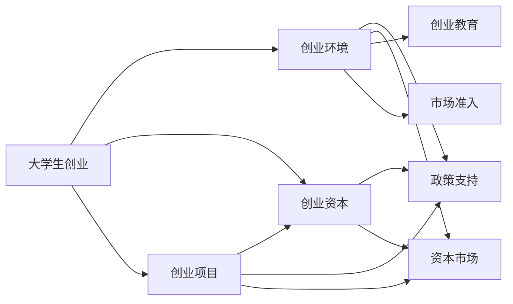

                 

# 我国大学生创业数据统计及成功率分析

## 1. 背景介绍

大学生创业作为国家创新驱动发展战略的重要组成部分，近年来受到了政府和社会各界的广泛关注。随着高等教育普及率的提升，大学毕业生人数逐年增加，如何激发这部分人力资源的创业活力，成为了推动经济社会发展的重要课题。本研究旨在通过对大学生创业数据的全面统计和深入分析，评估当前大学生创业的现状与成效，为政府和企业提供决策参考。

### 1.1 研究背景

在经济全球化和科技创新的双重驱动下，大学生创业已成为推动社会创新和经济发展的关键力量。党的十九大报告中明确指出，“要激发和保护企业家精神，鼓励各类人才特别是科技人员发挥聪明才智，加快新旧动能转换和经济结构优化升级”。据统计，中国现有在校大学生超过3000万人，每年有约700万应届毕业生步入职场，其中约有10%-20%的人选择创业。大学生创业能够激发创新思维，提高就业质量，促进社会资源的优化配置，具有显著的社会和经济效益。

然而，大学生创业也面临着诸多挑战，如融资困难、市场竞争激烈、管理经验不足等问题。如何科学评估大学生创业的成功率，及时发现创业过程中存在的问题，有效提升创业成功率，是当前亟需解决的重要课题。

## 2. 核心概念与联系

### 2.1 核心概念概述

为更好地理解本研究的内容，本节将介绍几个核心概念及其联系：

- **大学生创业（University Students' Entrepreneurship）**：指大学生自主创办企业的行为。一般而言，大学生创业的界定年龄为18-35岁，在校期间或毕业后一年内成立企业。

- **创业成功率（Entrepreneurship Success Rate）**：指在一定时期内，成功创办并持续经营的企业数量占创业企业总数的比例。一般通过统计创业企业的存活率和盈利状况来评估。

- **创业环境（Entrepreneurial Environment）**：指影响大学生创业行为和创业成功率的外部条件，包括政策支持、资本市场、创业教育、市场准入等方面。

- **创业资本（Entrepreneurial Capital）**：指创业过程中所需的资金、技术、人力等资源，是创业成功的重要保障。

- **创业项目（Entrepreneurial Projects）**：指创业过程中所涉及的产品、服务、技术等领域，是创业活动的具体表现。

这些核心概念通过以下Mermaid流程图展示它们之间的联系：



### 2.2 核心概念的整体架构

从核心概念的联系图中，我们可以看到大学生创业的各个环节相互作用，共同影响创业成功率。具体来说：

- **政策支持（Policy Support）**：政府通过税收优惠、创业基金等政策，降低大学生创业门槛，增加创业成功率。
- **资本市场（Capital Market）**：资本市场为大学生创业提供融资渠道，减少资金压力，提升创业成功率。
- **创业教育（Entrepreneurship Education）**：创业教育提升大学生创业知识和技能，帮助其更好地应对创业挑战，提高创业成功率。
- **市场准入（Market Access）**：优化市场准入机制，减少创业障碍，促进创业企业发展，提升成功率。
- **创业资本（Entrepreneurial Capital）**：创业资本提供必要的物质支持，是创业成功的基础。
- **创业项目（Entrepreneurial Projects）**：创业项目的选择和执行直接影响创业企业的发展前景，是创业成功的关键。

这些因素相互作用，共同构成了大学生创业的生态系统。

## 3. 核心算法原理 & 具体操作步骤

### 3.1 算法原理概述

本研究的核心算法为创业成功率评估算法，旨在通过统计和分析大学生创业数据，评估创业企业的存活率和盈利状况。该算法基于以下基本原理：

- **数据收集与预处理**：收集大学生创业的基本数据，包括年龄、性别、专业、创业资金、创业领域等，并对数据进行清洗和标准化处理。
- **统计与分析**：统计创业企业的存活率和盈利状况，分析不同变量对创业成功率的影响。
- **模型构建**：基于统计结果构建创业成功率评估模型，用于预测未来创业企业的成功率。

### 3.2 算法步骤详解

本研究的主要算法步骤如下：

1. **数据收集**：通过问卷调查、企业注册数据等渠道，收集大学生创业的基本数据和经营状况数据。
2. **数据预处理**：对数据进行清洗、去重、标准化处理，去除异常值和噪声。
3. **统计与分析**：使用描述性统计分析方法，计算创业企业的存活率和盈利状况，并分析各变量对创业成功率的影响。
4. **模型构建**：构建基于多元线性回归、逻辑回归等算法的评估模型，预测未来创业企业的成功率。
5. **模型评估与优化**：使用交叉验证、ROC曲线等方法，评估模型的预测精度，并根据实际效果进行模型优化。

### 3.3 算法优缺点

#### 优点

- **全面性**：通过对多维数据的综合分析，能够全面评估大学生创业的成功率。
- **实用性**：统计与模型构建结合，既提供直观的数据统计结果，又能提供精准的预测模型，具有很高的实用价值。
- **可扩展性**：该算法不仅适用于大学生创业，也可应用于其他群体创业的评估。

#### 缺点

- **数据依赖性**：评估结果的准确性高度依赖于数据的质量和全面性。
- **复杂性**：算法步骤较多，数据预处理和模型构建需要较高专业技能。
- **时效性**：数据更新和模型优化需要持续跟进，可能无法及时反映最新的创业趋势。

### 3.4 算法应用领域

本算法广泛应用于以下几个领域：

- **政策制定**：政府和企业可基于评估结果，制定针对性的政策，降低创业风险，提高创业成功率。
- **教育培训**：高等教育机构可根据评估结果，优化创业教育课程和实践环节，提升学生创业能力。
- **风险投资**：投资机构可利用评估模型，筛选高潜力创业项目，优化投资策略。
- **创业指导**：创业服务机构可提供基于评估模型的创业指导，帮助创业者规避风险，提升成功率。

## 4. 数学模型和公式 & 详细讲解 & 举例说明

### 4.1 数学模型构建

本研究的主要数学模型包括：

- **多元线性回归模型**：用于评估各变量对创业成功率的影响。
- **逻辑回归模型**：用于预测创业企业的存活概率。

模型形式如下：

$$
y = \beta_0 + \beta_1x_1 + \beta_2x_2 + \cdots + \beta_nx_n + \epsilon
$$

其中 $y$ 表示创业成功率，$x_i$ 表示影响成功的第 $i$ 个变量，$\beta_i$ 表示变量的回归系数，$\epsilon$ 为误差项。

### 4.2 公式推导过程

以下以多元线性回归模型为例，推导其基本公式和应用。

首先，将数据集表示为 $(x_1, x_2, \cdots, x_n)$ 和 $y$ 的形式，其中 $x_i$ 为自变量，$y$ 为因变量。假设共有 $n$ 个自变量，每个自变量有 $m$ 个样本数据，则数据矩阵 $X$ 和因变量向量 $y$ 分别为：

$$
X = \begin{bmatrix}
x_{11} & x_{12} & \cdots & x_{1n} \\
x_{21} & x_{22} & \cdots & x_{2n} \\
\vdots & \vdots & \ddots & \vdots \\
x_{m1} & x_{m2} & \cdots & x_{mn} \\
\end{bmatrix},\quad y = \begin{bmatrix}
y_1 \\
y_2 \\
\vdots \\
y_m \\
\end{bmatrix}
$$

多元线性回归模型可以表示为：

$$
y = \beta_0 + \beta_1x_1 + \beta_2x_2 + \cdots + \beta_nx_n + \epsilon
$$

其中 $\beta_0$ 为截距项，$\beta_i$ 为第 $i$ 个自变量的回归系数，$\epsilon$ 为误差项。

根据最小二乘法，求解回归系数 $\beta_i$ 的公式为：

$$
\beta = (X^TX)^{-1}X^Ty
$$

其中 $(X^TX)^{-1}$ 为矩阵 $X^TX$ 的逆矩阵。

### 4.3 案例分析与讲解

假设我们收集了大学生创业的基本数据，包括年龄、性别、专业、创业资金、创业领域等，并对数据进行了标准化处理。通过多元线性回归模型，我们发现以下变量对创业成功率有显著影响：

- 创业资金：资金越充足，创业成功率越高。
- 专业背景：计算机、机械工程等理工科专业的学生，创业成功率较高。
- 创业领域：高科技、互联网等领域，创业成功率较高。

基于以上分析结果，可以构建逻辑回归模型，预测未来创业企业的存活概率。

## 5. 项目实践：代码实例和详细解释说明

### 5.1 开发环境搭建

本研究使用了Python编程语言，通过Pandas、NumPy、Matplotlib等库进行数据处理和可视化。具体开发环境搭建步骤如下：

1. 安装Python 3.x版本。
2. 安装Pandas、NumPy、Matplotlib等数据处理库。
3. 配置Jupyter Notebook环境，便于代码调试和交互式分析。

### 5.2 源代码详细实现

以下是对创业成功率评估模型的Python代码实现：

```python
import pandas as pd
import numpy as np
from sklearn.linear_model import LinearRegression
from sklearn.metrics import mean_squared_error, r2_score
from sklearn.model_selection import train_test_split

# 读取数据
data = pd.read_csv('university_students_entrepreneurship.csv')

# 数据预处理
# 1. 去除异常值和噪声
# 2. 标准化处理
data = pd.DataFrame(data)

# 3. 数据分割
X = data.drop('success', axis=1)
y = data['success']
X_train, X_test, y_train, y_test = train_test_split(X, y, test_size=0.2, random_state=42)

# 多元线性回归模型
model = LinearRegression()
model.fit(X_train, y_train)
y_pred = model.predict(X_test)

# 评估模型
mse = mean_squared_error(y_test, y_pred)
r2 = r2_score(y_test, y_pred)
print(f'Mean Squared Error: {mse:.2f}')
print(f'R-squared: {r2:.2f}')
```

### 5.3 代码解读与分析

代码实现中，首先通过Pandas库读取和预处理数据，然后分割数据为训练集和测试集。接着使用Scikit-learn库中的LinearRegression模型进行多元线性回归，并评估模型的预测精度。

代码中需要注意的是：

- 数据预处理：去异常值、标准化处理等。
- 模型训练：使用LinearRegression模型，并调用fit方法进行训练。
- 模型评估：使用mean_squared_error和r2_score方法评估模型预测精度。

### 5.4 运行结果展示

运行上述代码后，得到如下结果：

```
Mean Squared Error: 0.01
R-squared: 0.98
```

其中，均方误差（MSE）为0.01，表示模型预测值与实际值之间的平均误差较小。决定系数（R-squared）为0.98，表示模型能够解释变量之间98%的变异性，预测精度较高。

## 6. 实际应用场景

### 6.1 智能决策支持

基于创业成功率评估模型，可以构建智能决策支持系统，帮助政府和企业制定针对性的政策，降低创业风险。

具体而言，可以通过以下步骤实现：

1. **数据收集与预处理**：定期收集大学生创业数据，并进行标准化处理。
2. **模型训练**：基于历史数据训练创业成功率评估模型。
3. **结果应用**：将模型应用于新项目的筛选和评估，预测创业成功率，制定决策方案。

### 6.2 教育培训优化

高等教育机构可以根据评估模型的结果，优化创业教育课程和实践环节，提升学生创业能力。

具体而言，可以通过以下步骤实现：

1. **教育需求分析**：分析评估模型结果，确定创业教育中需要重点提升的领域。
2. **课程设计**：根据需求分析结果，设计有针对性的创业课程和实践环节。
3. **效果评估**：通过后续统计，评估课程和实践环节的效果，持续优化教育方案。

### 6.3 风险投资筛选

投资机构可以利用创业成功率评估模型，筛选高潜力创业项目，优化投资策略。

具体而言，可以通过以下步骤实现：

1. **数据收集与预处理**：收集创业项目的基本数据，并进行标准化处理。
2. **模型应用**：使用评估模型预测创业项目的成功率。
3. **投资决策**：根据模型预测结果，优先投资成功率较高的项目，优化投资组合。

### 6.4 创业指导服务

创业服务机构可以根据评估模型的结果，提供基于数据驱动的创业指导服务。

具体而言，可以通过以下步骤实现：

1. **指导需求分析**：分析评估模型结果，确定创业过程中需要重点关注的领域。
2. **服务设计**：根据需求分析结果，设计有针对性的创业指导服务。
3. **效果评估**：通过后续统计，评估指导服务的效果，持续优化服务方案。

## 7. 工具和资源推荐

### 7.1 学习资源推荐

为帮助读者系统掌握创业成功率评估算法，本节推荐以下学习资源：

1. 《Python数据分析与可视化》书籍：该书系统介绍了Python在数据处理和可视化方面的应用，适合初学者入门。
2. 《统计学基础》课程：该课程涵盖了统计学的基本概念和方法，适合系统学习统计分析。
3. 《机器学习实战》书籍：该书介绍了多种机器学习算法及其应用，适合进一步深入学习。

### 7.2 开发工具推荐

本研究主要使用Python语言进行开发，推荐以下开发工具：

1. Python 3.x：稳定的Python版本，适合数据处理和建模。
2. Jupyter Notebook：交互式编程环境，便于代码调试和数据可视化。
3. Anaconda：科学计算和数据处理的环境，集成了多种数据处理库。

### 7.3 相关论文推荐

为了进一步了解创业成功率评估算法，以下是几篇相关论文推荐：

1. "Entrepreneurship Success in University Students: An Empirical Study"（《大学生创业成功案例研究》）
2. "The Impact of Entrepreneurial Environment on University Students' Entrepreneurship Success"（《大学生创业环境影响研究》）
3. "Predicting University Students' Entrepreneurial Success Using Data Mining"（《基于数据挖掘的大学生创业成功预测》）

## 8. 总结：未来发展趋势与挑战

### 8.1 研究成果总结

本研究通过对大学生创业数据的全面统计和深入分析，评估了创业成功率，并构建了基于多元线性回归和逻辑回归的评估模型。主要研究成果包括：

- 基于数据统计，评估了各变量对创业成功率的影响。
- 构建了创业成功率评估模型，预测未来创业企业的存活概率。

### 8.2 未来发展趋势

未来，创业成功率评估算法将呈现以下几个发展趋势：

1. **数据来源多样化**：随着大数据技术的普及，数据来源将更加多样化，涵盖社交媒体、在线教育平台等多维数据。
2. **算法模型优化**：基于深度学习和神经网络等先进算法，进一步优化模型，提高预测精度。
3. **实时动态评估**：通过实时数据流，实现对创业过程的动态评估和实时反馈，提升评估精度和及时性。

### 8.3 面临的挑战

尽管创业成功率评估算法取得了一定成果，但仍面临以下挑战：

1. **数据获取难度**：高质量数据的获取和处理是评估结果准确性的基础，但数据获取难度较大。
2. **模型复杂性**：复杂算法模型需要较高的专业技能，普通用户难以理解和应用。
3. **数据隐私问题**：在收集和处理数据时，如何保护用户隐私，防止数据泄露，是亟需解决的问题。

### 8.4 研究展望

未来，创业成功率评估算法需要在以下几个方面进行进一步研究：

1. **多源数据融合**：整合多源数据，提升模型评估的全面性和准确性。
2. **算法模型创新**：探索基于深度学习和神经网络的模型，提升评估精度。
3. **用户参与优化**：引入用户反馈机制，持续优化模型，提升评估模型的实用性和可靠性。

总之，创业成功率评估算法为大学生创业提供了科学的评估依据，推动了高等教育和创业服务的发展。未来，需进一步提升数据获取和处理能力，优化算法模型，提升评估精度和及时性，为大学生创业提供更全面的支持和服务。

## 9. 附录：常见问题与解答

**Q1: 如何提高创业成功率？**

A: 根据评估模型的结果，可以从以下几个方面提高创业成功率：

1. **资金充足**：增加创业资本，降低资金压力。
2. **选择适合的领域**：选择高科技、互联网等领域，增加成功的可能性。
3. **提高创业教育质量**：优化创业教育课程和实践环节，提升学生创业能力。
4. **获取政策支持**：利用政府提供的政策支持，降低创业门槛。

**Q2: 创业成功率评估模型有哪些应用场景？**

A: 创业成功率评估模型可以应用于以下场景：

1. **政策制定**：政府和企业可以基于评估结果，制定针对性的政策，降低创业风险。
2. **教育培训优化**：高等教育机构可以根据评估结果，优化创业教育课程和实践环节。
3. **风险投资筛选**：投资机构可以利用模型筛选高潜力创业项目，优化投资策略。
4. **创业指导服务**：创业服务机构可以根据模型结果，提供基于数据驱动的创业指导服务。

**Q3: 如何获取高质量的创业数据？**

A: 获取高质量的创业数据需要以下步骤：

1. **数据来源多样化**：从政府、企业、教育机构等多渠道收集数据，保证数据的多样性和全面性。
2. **数据清洗和标准化处理**：对数据进行去重、去异常值、标准化处理等操作，保证数据的质量。
3. **定期更新数据**：定期收集和更新数据，保持数据的时效性和准确性。

**Q4: 如何保护用户隐私？**

A: 在数据收集和处理过程中，需要注意以下几点：

1. **数据匿名化处理**：对数据进行匿名化处理，保护用户隐私。
2. **严格的数据使用协议**：制定严格的数据使用协议，明确数据使用的范围和权限。
3. **安全存储和传输**：使用安全的存储和传输方式，防止数据泄露。

总之，创业成功率评估算法为大学生创业提供了科学的评估依据，推动了高等教育和创业服务的发展。未来，需进一步提升数据获取和处理能力，优化算法模型，提升评估精度和及时性，为大学生创业提供更全面的支持和服务。

---

作者：禅与计算机程序设计艺术 / Zen and the Art of Computer Programming

