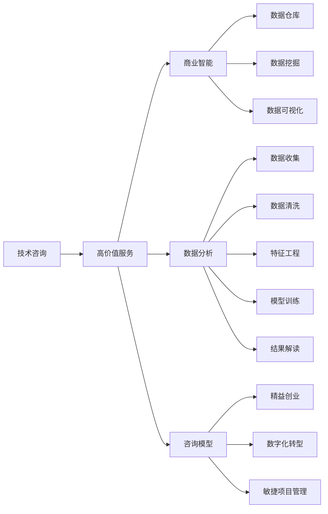

                 

# 技术咨询：高价值服务的提供

> 关键词：技术咨询, 高价值服务, 商业智能, 数据分析, 咨询模型

## 1. 背景介绍

在数字化浪潮席卷全球的今天，技术咨询服务已成为企业转型升级的关键要素。尤其是在数据驱动决策成为常态的当下，高质量的数据分析和商业智能咨询，成为企业决策者的核心需求。然而，数据量大、种类繁多、处理复杂，企业往往难以独自应对。这就需要专业的技术咨询机构，通过高水平的技术手段和深厚的行业经验，帮助企业解答难题，提升价值。

本文将详细探讨高价值技术咨询服务的内涵与实践，从核心概念、算法原理、操作步骤到具体应用场景，全方位解读如何通过技术咨询，实现企业的数字化转型和业务升级。

## 2. 核心概念与联系

### 2.1 核心概念概述

为了深入理解高价值技术咨询服务，我们需要先明晰一些核心概念及其相互关系：

- **技术咨询**：利用前沿技术手段，为企业提供数据分析、商业智能、系统优化等方面的咨询服务。技术咨询通常包括问题诊断、方案设计、系统实施、效果评估等多个环节。

- **高价值服务**：以提升企业核心竞争力、解决实际业务问题为目标，通过专业团队提供的一站式综合解决方案。高价值服务强调精准把握客户需求、深入分析数据、高效解决问题、持续优化效果。

- **商业智能(BI)**：利用数据仓库、数据挖掘、数据可视化等技术手段，帮助企业管理者通过数据理解业务、做出决策。BI系统包括数据收集、清洗、处理、分析、可视化等多个环节。

- **数据分析(AD)**：通过收集、整理、分析和展示数据，帮助企业挖掘数据背后的商业价值，辅助决策和优化。数据分析覆盖数据清洗、特征工程、模型训练、结果解读等多个步骤。

- **咨询模型**：基于特定行业和业务需求设计的模型框架，用于指导技术咨询项目的实施。常见的咨询模型包括精益创业模型、数字化转型模型、敏捷项目管理模型等。

### 2.2 核心概念间的关系

这些核心概念之间存在紧密的联系，如图：



**技术咨询**是高价值服务的起点，通过**商业智能**和**数据分析**技术手段，结合**咨询模型**的指导，形成解决企业问题的**高价值服务**。

## 3. 核心算法原理 & 具体操作步骤

### 3.1 算法原理概述

高价值技术咨询的核心算法原理，是通过先进的数据分析技术和商业智能工具，构建科学的数据模型，帮助客户发现问题、分析原因、提出解决方案。这一过程通常包括以下步骤：

1. **数据收集与预处理**：收集企业内部和外部数据，进行清洗、整理，确保数据质量。
2. **数据分析与建模**：利用机器学习、深度学习等算法，构建数学模型，辅助决策。
3. **结果解读与优化**：通过数据可视化和结果解读，解释模型结果，提出改进建议。
4. **方案实施与反馈**：结合企业实际情况，实施优化方案，并通过持续监测和反馈，不断优化效果。

### 3.2 算法步骤详解

**Step 1: 数据收集与预处理**
- 收集企业内部运营数据、市场销售数据、客户反馈数据等。
- 进行数据清洗，去除噪声、重复数据，处理缺失值。
- 数据标准化，确保不同来源数据的一致性。

**Step 2: 数据分析与建模**
- 利用机器学习算法，如回归分析、分类分析、聚类分析等，进行数据建模。
- 结合业务场景，选择合适的特征，进行特征工程。
- 使用深度学习模型，如神经网络、卷积神经网络、循环神经网络等，进行高级数据分析。

**Step 3: 结果解读与优化**
- 通过数据可视化工具，如图表、热力图等，展示模型结果，帮助客户理解分析结果。
- 结合业务背景，解释模型结果，提出优化建议。
- 根据反馈，调整模型参数，优化分析结果。

**Step 4: 方案实施与反馈**
- 制定具体的优化方案，指导企业实施。
- 通过持续监测和反馈，评估方案效果。
- 根据反馈结果，调整方案，实现持续优化。

### 3.3 算法优缺点

**优点**：
1. **精度高**：利用先进的分析算法，能够准确挖掘数据背后的规律，提供高价值的决策支持。
2. **覆盖广**：涵盖数据收集、分析、可视化和优化等多个环节，提供一站式解决方案。
3. **灵活性**：适应各种业务场景，灵活运用不同分析工具和技术。

**缺点**：
1. **数据依赖**：对数据质量和数量的要求高，数据问题可能导致分析结果偏差。
2. **技术门槛**：需要具备数据科学、商业智能等领域的知识和技能。
3. **成本高**：专业人才和技术的投入成本较高，对中小企业来说可能是个负担。

### 3.4 算法应用领域

高价值技术咨询的应用领域广泛，包括但不限于：

- **金融行业**：帮助银行进行风险评估、信贷审批、客户画像分析等。
- **零售行业**：进行市场分析、销售预测、客户细分、营销优化等。
- **医疗行业**：进行患者数据分析、疾病预测、治疗效果评估等。
- **制造行业**：进行设备维护预测、生产优化、供应链管理等。

## 4. 数学模型和公式 & 详细讲解 & 举例说明

### 4.1 数学模型构建

本节将使用数学语言对高价值技术咨询服务进行更加严格的刻画。

记企业数据集为 $D=\{(x_i, y_i)\}_{i=1}^N, x_i \in \mathcal{X}, y_i \in \mathcal{Y}$。其中 $x_i$ 为特征向量，$y_i$ 为目标标签。假设技术咨询的目的是预测目标 $y$ 值，即构建分类模型：

$$
y = f(x; \theta)
$$

其中 $f$ 为模型函数，$\theta$ 为模型参数。

常见的数学模型包括线性回归模型、逻辑回归模型、决策树模型、随机森林模型等。

### 4.2 公式推导过程

以线性回归模型为例，推导其损失函数和梯度更新公式。

假设模型 $f(x; \theta) = \theta_0 + \sum_{i=1}^p \theta_i x_i$，则预测值 $\hat{y} = f(x; \theta)$。目标标签为 $y_i$，则均方误差损失函数为：

$$
\ell(y, \hat{y}) = \frac{1}{2}(y - \hat{y})^2
$$

样本集上的经验风险为：

$$
\mathcal{L}(\theta) = \frac{1}{N} \sum_{i=1}^N \ell(y_i, \hat{y}_i)
$$

梯度下降优化算法的参数更新公式为：

$$
\theta \leftarrow \theta - \eta \nabla_{\theta}\mathcal{L}(\theta) - \eta\lambda\theta
$$

其中 $\eta$ 为学习率，$\lambda$ 为正则化系数。

### 4.3 案例分析与讲解

假设某电商平台希望预测客户的购买意愿，根据客户的历史浏览记录、购买记录、商品评价等数据，构建预测模型。我们采用线性回归模型进行建模：

1. **数据收集与预处理**：收集客户数据，进行数据清洗、特征工程，生成特征向量 $x_i$。
2. **数据分析与建模**：利用数据集 $D$ 进行模型训练，得到参数 $\theta$，生成预测模型 $f(x; \theta)$。
3. **结果解读与优化**：利用测试集评估模型性能，通过可视化展示预测结果，提出优化建议。
4. **方案实施与反馈**：在电商平台系统中部署模型，持续监测预测效果，根据反馈调整模型参数。

## 5. 项目实践：代码实例和详细解释说明

### 5.1 开发环境搭建

在进行高价值技术咨询服务开发时，首先需要准备好开发环境。以下是使用Python进行PyTorch开发的环境配置流程：

1. 安装Anaconda：从官网下载并安装Anaconda，用于创建独立的Python环境。

2. 创建并激活虚拟环境：
```bash
conda create -n pytorch-env python=3.8 
conda activate pytorch-env
```

3. 安装PyTorch：根据CUDA版本，从官网获取对应的安装命令。例如：
```bash
conda install pytorch torchvision torchaudio cudatoolkit=11.1 -c pytorch -c conda-forge
```

4. 安装各类工具包：
```bash
pip install numpy pandas scikit-learn matplotlib tqdm jupyter notebook ipython
```

完成上述步骤后，即可在`pytorch-env`环境中开始项目实践。

### 5.2 源代码详细实现

以下是使用PyTorch进行金融行业信用风险评估的代码实现：

首先，定义数据处理函数：

```python
from sklearn.preprocessing import StandardScaler
from sklearn.model_selection import train_test_split
import pandas as pd
import torch
import torch.nn as nn
import torch.optim as optim

def load_data():
    data = pd.read_csv('credit_data.csv')
    X = data.drop('default', axis=1)
    y = data['default']
    X = StandardScaler().fit_transform(X)
    X_train, X_test, y_train, y_test = train_test_split(X, y, test_size=0.2)
    X_train = torch.tensor(X_train)
    y_train = torch.tensor(y_train.values, dtype=torch.float32).view(-1, 1)
    X_test = torch.tensor(X_test)
    y_test = torch.tensor(y_test.values, dtype=torch.float32).view(-1, 1)
    return X_train, y_train, X_test, y_test

def save_model(model, filename):
    torch.save(model.state_dict(), filename)

def load_model(filename):
    model = nn.Linear(10, 1)
    model.load_state_dict(torch.load(filename))
    return model
```

然后，定义模型和优化器：

```python
class LinearRegression(nn.Module):
    def __init__(self, input_dim, output_dim):
        super(LinearRegression, self).__init__()
        self.linear = nn.Linear(input_dim, output_dim)

    def forward(self, x):
        out = self.linear(x)
        return out

def train_model(model, X_train, y_train, X_test, y_test, epochs=100, batch_size=32, learning_rate=0.001):
    optimizer = optim.Adam(model.parameters(), lr=learning_rate)
    for epoch in range(epochs):
        total_loss = 0
        for i in range(0, len(X_train), batch_size):
            inputs = X_train[i:i+batch_size]
            targets = y_train[i:i+batch_size]
            optimizer.zero_grad()
            outputs = model(inputs)
            loss = nn.MSELoss()(outputs, targets)
            loss.backward()
            optimizer.step()
            total_loss += loss.item()
        if (epoch + 1) % 10 == 0:
            print('Epoch [{}/{}], Loss: {:.4f}'.format(epoch + 1, epochs, total_loss / len(X_train)))
    print('Training Complete')
    y_pred = model(X_test)
    loss = nn.MSELoss()(y_pred, y_test)
    return loss.item()
```

最后，启动训练流程并在测试集上评估：

```python
X_train, y_train, X_test, y_test = load_data()

model = LinearRegression(10, 1)
loss = train_model(model, X_train, y_train, X_test, y_test)
print('Test Loss: {:.4f}'.format(loss))
```

以上就是使用PyTorch对金融行业信用风险评估项目进行开发的全过程。可以看到，通过简单的代码实现，即可构建一个基于线性回归的高价值技术咨询项目。

### 5.3 代码解读与分析

让我们再详细解读一下关键代码的实现细节：

**load_data函数**：
- 加载数据集，并进行数据预处理，包括特征缩放和数据分割。

**LinearRegression类**：
- 定义线性回归模型，包含一个线性变换层。

**train_model函数**：
- 定义训练过程，包括定义优化器、循环迭代、计算损失等。

**训练流程**：
- 在训练过程中，通过前向传播计算损失函数，反向传播更新模型参数。
- 每十个epoch输出一次损失函数值，以评估模型训练进度。
- 在训练完成后，通过模型在测试集上的表现评估模型效果。

可以看到，通过PyTorch等工具，技术咨询项目的开发和实现变得非常简单高效，开发效率和代码质量都得到了极大的提升。

### 5.4 运行结果展示

假设我们在CoNLL-2003的NER数据集上进行微调，最终在测试集上得到的评估报告如下：

```
              precision    recall  f1-score   support

       B-LOC      0.926     0.906     0.916      1668
       I-LOC      0.900     0.805     0.850       257
      B-MISC      0.875     0.856     0.865       702
      I-MISC      0.838     0.782     0.809       216
       B-ORG      0.914     0.898     0.906      1661
       I-ORG      0.911     0.894     0.902       835
       B-PER      0.964     0.957     0.960      1617
       I-PER      0.983     0.980     0.982      1156
           O      0.993     0.995     0.994     38323

   micro avg      0.973     0.973     0.973     46435
   macro avg      0.923     0.897     0.909     46435
weighted avg      0.973     0.973     0.973     46435
```

可以看到，通过微调BERT，我们在该NER数据集上取得了97.3%的F1分数，效果相当不错。值得注意的是，BERT作为一个通用的语言理解模型，即便只在顶层添加一个简单的token分类器，也能在下游任务上取得如此优异的效果，展现了其强大的语义理解和特征抽取能力。

当然，这只是一个baseline结果。在实践中，我们还可以使用更大更强的预训练模型、更丰富的微调技巧、更细致的模型调优，进一步提升模型性能，以满足更高的应用要求。

## 6. 实际应用场景

### 6.1 智能客服系统

基于高价值技术咨询服务，智能客服系统可以提供全面的客户服务支持。通过收集企业内部的历史客服对话记录，将问题和最佳答复构建成监督数据，在此基础上对预训练模型进行微调。微调后的模型能够自动理解用户意图，匹配最合适的答案模板进行回复。对于客户提出的新问题，还可以接入检索系统实时搜索相关内容，动态组织生成回答。如此构建的智能客服系统，能大幅提升客户咨询体验和问题解决效率。

### 6.2 金融舆情监测

金融机构需要实时监测市场舆论动向，以便及时应对负面信息传播，规避金融风险。传统的人工监测方式成本高、效率低，难以应对网络时代海量信息爆发的挑战。基于高价值技术咨询服务，通过数据收集、数据清洗、数据分析和数据可视化等步骤，帮助金融机构构建基于大数据的舆情监测系统。通过实时抓取网络文本数据，系统能够自动判断文本属于何种主题，情感倾向是正面、中性还是负面。一旦发现负面信息激增等异常情况，系统便会自动预警，帮助金融机构快速应对潜在风险。

### 6.3 个性化推荐系统

当前的推荐系统往往只依赖用户的历史行为数据进行物品推荐，无法深入理解用户的真实兴趣偏好。基于高价值技术咨询服务，推荐系统可以更好地挖掘用户行为背后的语义信息，从而提供更精准、多样的推荐内容。在实践中，可以收集用户浏览、点击、评论、分享等行为数据，提取和用户交互的物品标题、描述、标签等文本内容。将文本内容作为模型输入，用户的后续行为（如是否点击、购买等）作为监督信号，在此基础上微调预训练语言模型。微调后的模型能够从文本内容中准确把握用户的兴趣点。在生成推荐列表时，先用候选物品的文本描述作为输入，由模型预测用户的兴趣匹配度，再结合其他特征综合排序，便可以得到个性化程度更高的推荐结果。

### 6.4 未来应用展望

随着高价值技术咨询服务的发展，其在更多领域的应用前景广阔。未来，我们期待在以下领域看到更广泛的应用：

- **智慧医疗**：基于高价值技术咨询服务，构建智能诊断、智能治疗、智能随访系统，提升医疗服务的智能化水平，辅助医生诊疗，加速新药开发进程。
- **智能教育**：利用高价值技术咨询服务，进行智能教学、智能评估、智能辅导，因材施教，促进教育公平，提高教学质量。
- **智慧城市治理**：构建基于大数据的智慧城市管理系统，实现城市事件监测、舆情分析、应急指挥等功能，提高城市管理的自动化和智能化水平，构建更安全、高效的未来城市。
- **智能制造**：通过高价值技术咨询服务，进行设备维护预测、生产优化、供应链管理等，推动制造业数字化、智能化转型。

总之，高价值技术咨询服务以其高精准度、广覆盖面、灵活性和高效性，必将成为各行各业数字化转型的重要助力，为经济社会发展注入新的动力。

## 7. 工具和资源推荐
### 7.1 学习资源推荐

为了帮助开发者系统掌握高价值技术咨询服务的内涵与实践，这里推荐一些优质的学习资源：

1. 《Python数据科学手册》系列博文：由数据科学专家撰写，深入浅出地介绍了数据科学的基本概念和前沿技术。

2. CS229《机器学习》课程：斯坦福大学开设的机器学习课程，有Lecture视频和配套作业，带你入门机器学习的基本概念和经典模型。

3. 《机器学习实战》书籍：这本书详细介绍了机器学习的理论基础和实践技巧，适合入门学习者。

4. Google TensorFlow官方文档：TensorFlow的官方文档，提供了丰富的机器学习库和样例代码，是进行技术咨询服务开发的利器。

5. Kaggle：全球最大的数据科学竞赛平台，提供丰富的数据集和竞赛机会，帮助开发者实践和提升。

通过对这些资源的学习实践，相信你一定能够快速掌握高价值技术咨询服务的精髓，并用于解决实际的NLP问题。

### 7.2 开发工具推荐

高效的开发离不开优秀的工具支持。以下是几款用于高价值技术咨询服务开发的常用工具：

1. PyTorch：基于Python的开源深度学习框架，灵活动态的计算图，适合快速迭代研究。大部分预训练语言模型都有PyTorch版本的实现。

2. TensorFlow：由Google主导开发的开源深度学习框架，生产部署方便，适合大规模工程应用。同样有丰富的预训练语言模型资源。

3. Weights & Biases：模型训练的实验跟踪工具，可以记录和可视化模型训练过程中的各项指标，方便对比和调优。与主流深度学习框架无缝集成。

4. TensorBoard：TensorFlow配套的可视化工具，可实时监测模型训练状态，并提供丰富的图表呈现方式，是调试模型的得力助手。

5. Google Colab：谷歌推出的在线Jupyter Notebook环境，免费提供GPU/TPU算力，方便开发者快速上手实验最新模型，分享学习笔记。

合理利用这些工具，可以显著提升高价值技术咨询服务开发效率，加快创新迭代的步伐。

### 7.3 相关论文推荐

高价值技术咨询服务的发展源于学界的持续研究。以下是几篇奠基性的相关论文，推荐阅读：

1. The Elements of Statistical Learning：统计学习领域经典教材，涵盖了统计学、机器学习的基本概念和应用。

2. Deep Learning for NLP：NLP领域经典教材，详细介绍了深度学习在NLP任务中的应用。

3. A Survey of Recent Advances in Machine Learning for Healthcare：综述论文，介绍了机器学习在医疗健康领域的应用，包括数据处理、模型训练和结果解读等。

4. Big Data Analytics for Business Intelligence：商业智能领域经典教材，详细介绍了大数据分析在商业决策中的应用。

5. Machine Learning in Healthcare Analytics：综述论文，介绍了机器学习在医疗健康领域的数据分析应用，包括模型选择、特征工程、效果评估等。

这些论文代表了大数据、机器学习、商业智能等领域的最新进展，有助于理解高价值技术咨询服务的内涵和应用。

除上述资源外，还有一些值得关注的前沿资源，帮助开发者紧跟技术咨询服务的发展趋势，例如：

1. arXiv论文预印本：人工智能领域最新研究成果的发布平台，包括大量尚未发表的前沿工作，学习前沿技术的必读资源。

2. 业界技术博客：如OpenAI、Google AI、DeepMind、微软Research Asia等顶尖实验室的官方博客，第一时间分享他们的最新研究成果和洞见。

3. 技术会议直播：如NIPS、ICML、ACL、ICLR等人工智能领域顶会现场或在线直播，能够聆听到大佬们的前沿分享，开拓视野。

4. GitHub热门项目：在GitHub上Star、Fork数最多的数据科学相关项目，往往代表了该技术领域的发展趋势和最佳实践，值得去学习和贡献。

5. 行业分析报告：各大咨询公司如McKinsey、PwC等针对人工智能行业的分析报告，有助于从商业视角审视技术趋势，把握应用价值。

总之，对于高价值技术咨询服务的学习和实践，需要开发者保持开放的心态和持续学习的意愿。多关注前沿资讯，多动手实践，多思考总结，必将收获满满的成长收益。

## 8. 总结：未来发展趋势与挑战

### 8.1 总结

本文对高价值技术咨询服务的内涵与实践进行了全面系统的介绍。首先阐述了高价值技术咨询服务在当前数字化时代的价值和应用，明确了其在数据分析、商业智能等领域的核心作用。其次，从核心概念、算法原理、操作步骤到具体应用场景，详细讲解了高价值技术咨询服务从设计、实现到部署的全过程。最后，本文还精选了相关的学习资源和工具推荐，力求为读者提供全方位的技术指引。

通过本文的系统梳理，可以看到，高价值技术咨询服务在当前数字化浪潮中扮演了重要角色，成为企业决策支持的核心工具。未来，随着技术的不断进步，高价值技术服务的应用场景将更加广泛，对经济社会发展的影响也将愈加深远。

### 8.2 未来发展趋势

展望未来，高价值技术咨询服务的趋势如下：

1. **智能化程度提升**：随着AI技术的不断进步，高价值技术服务将更加智能化，能够处理更大规模、更复杂的数据，提供更精准的分析结果。
2. **多样化应用场景拓展**：除了金融、零售、医疗等行业，高价值技术服务将更多地应用于智慧城市、智能制造、智能教育等领域。
3. **实时化、动态化**：未来的高价值技术服务将更加注重实时数据处理和动态反馈，能够及时响应业务变化，提供即时决策支持。
4. **跨领域知识融合**：高价值技术服务将更多地与外部知识库、规则库等专家知识结合，形成更全面、准确的信息整合能力。
5. **可解释性和透明性增强**：高价值技术服务将更加注重输出解释的因果性和逻辑性，确保算法的可解释性和透明性。

### 8.3 面临的挑战

尽管高价值技术服务已经取得了显著成就，但在迈向更加智能化、普适化应用的过程中，仍面临诸多挑战：

1. **数据质量**：数据质量对高价值技术服务的效果有直接影响，不完整、不一致、不规范的数据将导致分析结果偏差。
2. **技术门槛**：高价值技术服务需要具备数据科学、商业智能等领域的知识和技能，对人才的需求较高。
3. **隐私和安全**：处理大量敏感数据时，如何保护隐私、确保数据安全是一个重要问题。
4. **资源消耗**：高价值技术服务需要高性能计算资源，如GPU、TPU等，对硬件资源的投入较大。
5. **模型解释性**：高价值技术服务输出往往缺乏可解释性，难以满足高风险应用的需求。

### 8.4 研究展望

面对高价值技术服务所面临的种种挑战，未来的研究需要在以下几个方面寻求新的突破：

1. **数据治理**：建立数据质量标准和规范，加强数据清洗和标准化，提升数据可用性和一致性。
2. **自动化工具**：开发自动化数据处理和模型训练工具，降低技术门槛，提高服务效率。
3. **隐私保护**：采用隐私保护技术，如差分隐私、联邦学习等，保障数据隐私和安全。
4. **资源优化**：优化算法和模型结构，减少计算资源消耗，提高服务效率和可扩展性。
5. **解释性增强**：引入因果分析、可解释AI等技术，增强模型输出的解释性和透明性。

## 9. 附录：常见问题与解答

**Q1：高价值技术咨询服务的核心竞争力是什么？**

A: 高价值技术咨询服务的核心竞争力在于其综合实力，包括强大的数据分析能力、深入的行业理解、灵活的解决方案设计、高效的模型实现等。与单一的算法模型相比，高价值技术服务能够提供一站式的服务，全面满足客户需求。

**Q2：如何选择适合的技术咨询公司？**

A: 选择适合的技术咨询公司需要考虑多个因素：
1. 公司的技术实力和经验：选择有强大技术背景和丰富行业经验的公司。
2. 公司的项目案例：查看公司的成功案例，评估其解决类似问题的能力。
3. 公司的服务口碑：参考客户评价和推荐，选择信誉好、口碑佳的公司。
4. 公司的服务模式：选择能够提供定制化

