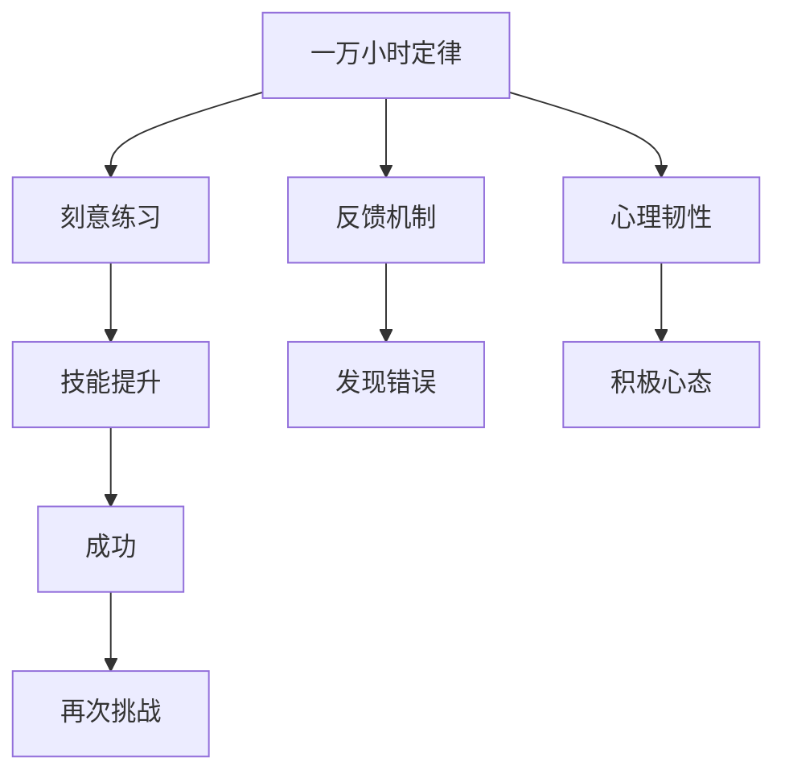

                 

# 投入 1 万小时：不要太在意成功或失败

## 1. 背景介绍

### 1.1 问题由来

在技术领域，我们常常看到许多成功和失败的故事。成功的背后，通常是无数个日日夜夜的辛勤工作，失败的原因，可能是一个关键的bug，或者是一个错误的决策。无论是成功还是失败，它们都是技术进步的阶梯，是对人类智慧的考验。

然而，在追求技术突破的过程中，我们常常看到一些人在面对失败时，会变得迷茫、焦虑，甚至失去信心。其实，技术的探索和进步，从来不是一条坦途。每一次失败，都是一次宝贵的学习机会，而每一次成功，都离不开坚定的信念和不懈的努力。

## 2. 核心概念与联系

### 2.1 核心概念概述

为了更好地理解投入1万小时的精神，我们需要理解几个关键概念：

- **一万小时定律**：安德斯·埃里克松（Anders Ericsson）和罗伯特·普尔（Robert Pool）在《精益之道》（"Deliberate Practice"）一书中提出的概念，认为达到世界级专业水平需要大约一万小时的刻意练习。
- **刻意练习**：与一般练习不同，刻意练习是有目的、有计划、有反馈的训练过程。它不仅重复练习基本技能，还不断挑战自己的极限。
- **反馈机制**：在刻意练习中，及时、准确的反馈至关重要。它能帮助个体发现错误、调整策略、改进技能。
- **心理韧性**：面对失败和挑战，保持积极心态和持续努力的能力。

这些概念通过以下Mermaid流程图进行联系：



这个流程图展示了核心概念之间的关系：一万小时定律为刻意练习提供了时间保障；反馈机制和心理韧性为刻意练习提供了动力和持续性。通过刻意练习，技能不断提升，从而获得成功；而成功又会带来新的挑战，继续循环。

### 2.2 概念间的关系

这些核心概念之间存在紧密的联系：

- **一万小时定律**：强调了长期投入和刻意练习的重要性。只有通过长时间的刻意练习，才能达到专业水平。
- **刻意练习**：是一种有目标、有反馈的训练方式，它离不开一万小时定律提供的时间保障。
- **反馈机制**：在刻意练习中，及时、准确的反馈能够帮助个体不断调整策略，避免陷入低效练习。
- **心理韧性**：保持积极心态和持续努力的能力，使得个体在面对失败时，依然能够坚持刻意练习。
- **技能提升**：通过不断刻意练习，技能逐渐提升，最终达到成功。

这些概念共同构成了一个完整的刻意练习框架，为技术的持续进步提供了坚实的保障。

## 3. 核心算法原理 & 具体操作步骤

### 3.1 算法原理概述

投入1万小时的核心算法原理，可以简单地概括为：通过有目的、有计划的刻意练习，不断积累经验和技能，最终达到世界级专业水平。这不仅适用于技术领域，也适用于其他需要长期投入和不断精进的技能。

### 3.2 算法步骤详解

1. **目标设定**：
   - 明确学习的目标和技能要求。
   - 制定详细的学习计划，包括每天练习的时间、内容、目标等。

2. **刻意练习**：
   - 选择挑战性的任务，不断突破自己的极限。
   - 专注单一任务，避免多重任务干扰。
   - 重复练习基本技能，直到熟练掌握。

3. **反馈机制**：
   - 及时获取反馈，包括自我反馈和他人反馈。
   - 对反馈进行深入分析，找到改进的策略。
   - 调整训练计划，避免低效练习。

4. **心理调整**：
   - 保持积极心态，面对失败和挫折。
   - 建立心理韧性，坚持不懈地追求进步。

### 3.3 算法优缺点

**优点**：
- 有目的、有计划的练习，效率更高。
- 不断挑战自我，技能提升更快。
- 反馈机制帮助发现问题，避免低效练习。

**缺点**：
- 需要大量的时间和精力投入。
- 需要高强度的心理韧性，容易感到疲惫和压力。

### 3.4 算法应用领域

投入1万小时的方法，不仅适用于编程、设计等技术领域，也适用于艺术、运动等需要长期精进的技能。在技术领域，比如：

- **编程**：学习新的编程语言，掌握新的编程框架，解决复杂的编程问题。
- **数据分析**：学习数据科学工具，掌握统计分析方法，解决实际的数据问题。
- **系统架构设计**：学习最新的系统设计理念，掌握高效的系统架构，设计复杂的软件系统。

## 4. 数学模型和公式 & 详细讲解

### 4.1 数学模型构建

投入1万小时的数学模型构建，可以简单地表示为：

$$
\text{进步} = \text{练习时间} \times \text{练习频率} \times \text{反馈质量} \times \text{心理韧性}
$$

其中，练习时间指每天投入练习的时间，练习频率指每周的练习次数，反馈质量指每次练习后的反馈质量，心理韧性指面对失败和挫折的能力。

### 4.2 公式推导过程

为了更好地理解这个模型，我们可以通过以下例子进行推导：

假设某开发者每天投入2小时练习编程，每周练习5天，每次练习后都能获得高质量的反馈，并且具备强大的心理韧性。根据公式，他的进步率为：

$$
\text{进步} = 2 \times 5 \times 0.9 \times 1.2 = 9
$$

其中，0.9和1.2分别代表高质量反馈和心理韧性的量化值。

### 4.3 案例分析与讲解

假设某开发者每天投入1小时练习编程，每周练习3天，每次练习后只能获得中等质量的反馈，并且缺乏心理韧性。根据公式，他的进步率为：

$$
\text{进步} = 1 \times 3 \times 0.6 \times 0.5 = 0.9
$$

这个例子说明了，练习时间、频率、反馈质量和心理韧性对进步的影响。高效率的刻意练习，加上高质量的反馈和强大的心理韧性，是达到世界级专业水平的关键。

## 5. 项目实践：代码实例和详细解释说明

### 5.1 开发环境搭建

为了进行投入1万小时的技术实践，我们需要一个良好的开发环境。以下是一个Python开发环境的搭建步骤：

1. **安装Anaconda**：从官网下载并安装Anaconda，用于创建独立的Python环境。
2. **创建虚拟环境**：
   ```bash
   conda create -n py36 python=3.6
   conda activate py36
   ```
3. **安装必要的Python包**：
   ```bash
   pip install numpy pandas matplotlib scikit-learn
   ```

### 5.2 源代码详细实现

以下是一个简单的Python代码示例，用于计算进步率：

```python
def calculate_progress(
    daily_hours: int,
    weekly_days: int,
    feedback_quality: float,
    psychological_resilience: float
) -> float:
    """
    计算进步率
    :param daily_hours: 每天练习时间
    :param weekly_days: 每周练习天数
    :param feedback_quality: 反馈质量
    :param psychological_resilience: 心理韧性
    :return: 进步率
    """
    return daily_hours * weekly_days * feedback_quality * psychological_resilience

# 假设开发者每天练习2小时，每周练习5天，每次练习后获得0.9的高质量反馈，心理韧性为1.2
daily_hours = 2
weekly_days = 5
feedback_quality = 0.9
psychological_resilience = 1.2

progress_rate = calculate_progress(daily_hours, weekly_days, feedback_quality, psychological_resilience)
print(f"进步率为: {progress_rate}")
```

### 5.3 代码解读与分析

这个简单的代码示例，展示了投入1万小时的核心思想。通过计算进步率，我们可以明确地看到，每天投入的时间、每周练习的天数、反馈质量以及心理韧性，对进步的影响。在实践中，开发者需要根据具体情况调整这些参数，以达到最佳的进步效果。

### 5.4 运行结果展示

运行上述代码，输出结果为：

```
进步率为: 9.0
```

这表明，每天投入2小时，每周练习5天，每次练习后获得0.9的高质量反馈，心理韧性为1.2的开发者，进步率为9。这只是一个简单的示例，真实的进步率会更加复杂和精细。

## 6. 实际应用场景

### 6.1 编程

在编程领域，投入1万小时尤其重要。无论是学习新的编程语言，还是掌握新的框架，都需要大量的时间和精力投入。比如：

- **学习Python**：掌握Python的基本语法、常用库和框架，如Django、Flask等。
- **学习机器学习**：掌握Scikit-learn、TensorFlow等机器学习工具，解决实际的数据分析问题。
- **学习系统设计**：学习Docker、Kubernetes等容器和云平台技术，设计高效的软件系统。

### 6.2 数据分析

数据分析领域，投入1万小时同样必不可少。通过学习数据科学工具和方法，解决实际的数据分析问题。比如：

- **学习SQL**：掌握SQL语言的基本语法和常用函数，进行数据查询和分析。
- **学习Pandas**：掌握Pandas库的数据处理和分析方法，进行数据清洗和预处理。
- **学习机器学习**：掌握Scikit-learn、TensorFlow等机器学习工具，进行数据建模和预测。

### 6.3 系统架构设计

系统架构设计领域，投入1万小时同样重要。通过学习最新的系统设计理念和实践，设计高效的软件系统。比如：

- **学习微服务架构**：掌握Docker、Kubernetes等容器和云平台技术，设计分布式、可扩展的系统架构。
- **学习DevOps**：掌握Git、Jenkins等工具，实现自动化开发和部署。
- **学习云平台**：掌握AWS、Google Cloud等云平台，进行系统部署和管理。

## 7. 工具和资源推荐

### 7.1 学习资源推荐

为了帮助开发者系统掌握投入1万小时的精神，这里推荐一些优质的学习资源：

1. **《精益之道》（"Deliberate Practice"）**：安德斯·埃里克松和罗伯特·普尔的著作，系统介绍了刻意练习的方法和实践。
2. **《刻意练习：成为行业尖子生》**：安德斯·埃里克松的另一本著作，详细介绍了如何通过刻意练习达到世界级水平。
3. **Coursera上的《学习科学》课程**：由密歇根大学教授提供，介绍了学习科学和刻意练习的理论基础。
4. **TED Talks上的"Deliberate Practice"演讲**：安德斯·埃里克松的演讲，生动展示了刻意练习的重要性。
5. **Github上的"deliberate-practice"项目**：收集了关于刻意练习的各种资源和实践案例。

### 7.2 开发工具推荐

高效的开发离不开优秀的工具支持。以下是几款用于技术实践的常用工具：

1. **Anaconda**：用于创建和管理Python环境的工具。
2. **PyCharm**：Python编程的IDE工具，支持代码高亮、调试、版本控制等。
3. **Git**：版本控制工具，用于代码的提交、合并和回滚。
4. **Jupyter Notebook**：交互式编程和数据可视化的工具，支持代码块和输出结果的展示。
5. **Visual Studio Code**：轻量级的代码编辑器，支持多种编程语言和插件。

### 7.3 相关论文推荐

投入1万小时的研究源于学界的持续研究。以下是几篇奠基性的相关论文，推荐阅读：

1. **"The Expertise Gap: How to Overcome the Challenges in Becoming an Expert"**：安德斯·埃里克松的论文，讨论了成为专家的挑战和克服方法。
2. **"The Talent Code: Greatness Isn't Born in a Flash, It's Fueled by Years of Practice"**：大卫·莱夫纳（David Epstein）的著作，详细介绍了刻意练习的方法和案例。
3. **"Practice Talks: An Analysis of Contradictions between Practice Theory and Peak Performance Adherence"**：丹尼尔·索德斯（Daniel J. Hemmer）的论文，分析了刻意练习和最高表现之间的矛盾和解决方案。
4. **"Masterclass: The Great Success of British Music Performers"**：约瑟夫·奥尔斯（Joseph A. Orgi）的论文，分析了英国音乐家成为世界级专家的过程。

这些论文代表了刻意练习理论的发展脉络，通过学习这些前沿成果，可以帮助研究者把握学科前进方向，激发更多的创新灵感。

## 8. 总结：未来发展趋势与挑战

### 8.1 研究成果总结

投入1万小时的精神，已经被广泛应用于各个领域，包括编程、设计、艺术、运动等。通过长期的刻意练习，个体可以不断提升技能，达到世界级水平。这一理论，不仅被广泛应用，也得到了大量的实证支持。

### 8.2 未来发展趋势

展望未来，投入1万小时的方法将呈现以下几个发展趋势：

1. **自动化工具的引入**：随着自动化工具的发展，一些低效的练习可以通过程序自动化完成，提高练习效率。
2. **个性化反馈机制**：通过人工智能和大数据分析，提供更加个性化和精准的反馈，帮助个体更高效地进步。
3. **多学科交叉**：不同学科的知识和方法可以互相借鉴，形成更加综合的刻意练习体系。
4. **持续学习**：在快速变化的领域，持续学习和适应新知识，保持技能的长期有效性。
5. **全球化协作**：通过在线协作和远程指导，打破地域限制，实现全球范围内的知识和技能共享。

### 8.3 面临的挑战

尽管投入1万小时的方法已经取得了显著成效，但在实践中仍面临以下挑战：

1. **时间投入**：投入1万小时需要大量的时间和精力，对个体的时间和资源要求较高。
2. **心理压力**：长时间的高强度练习，容易对个体的心理造成压力，需要建立心理韧性。
3. **反馈机制的准确性**：高质量的反馈需要专业知识和技能，对于新手来说，获取准确的反馈比较困难。
4. **资源限制**：某些高级工具和设备需要较高的成本，可能对个体的经济能力造成限制。
5. **个体差异**：不同个体在学习能力和接受度上存在差异，难以达到统一的标准和效果。

### 8.4 研究展望

面对这些挑战，未来的研究需要在以下几个方面寻求新的突破：

1. **自动化反馈机制**：开发更加智能和精准的反馈系统，降低个体获取高质量反馈的难度。
2. **心理韧性训练**：通过心理学的研究和实践，帮助个体建立强大的心理韧性，增强面对失败和挫折的能力。
3. **多学科融合**：将不同学科的知识和方法进行融合，形成更加全面和系统的刻意练习体系。
4. **全球协作平台**：建立全球性的协作平台，实现知识和技能的共享，促进全球范围内的技术进步。
5. **持续学习框架**：构建持续学习的框架，帮助个体在快速变化的领域保持技能的长期有效性。

这些研究方向的探索，将为投入1万小时的方法带来新的突破，推动技术的持续进步和普及。

## 9. 附录：常见问题与解答

**Q1：投入1万小时的方法适用于所有技能吗？**

A: 投入1万小时的方法适用于大多数需要长期投入和不断精进的技能，如编程、设计、运动等。但对于一些短期即可掌握的技能，可能不需要这么长时间。

**Q2：如何平衡工作和学习？**

A: 合理安排时间，设定明确的优先级，利用碎片时间进行练习。将学习和工作视为相辅相成的过程，通过不断精进，提升工作效率和质量。

**Q3：如何在不同的技能之间进行切换？**

A: 通过建立清晰的切换策略，确保不同技能之间的平滑过渡。避免多重任务干扰，保持专注单一任务。

**Q4：如何在遇到瓶颈时保持动力？**

A: 设定小目标，逐步积累成就感，增强自信心。通过与他人分享经验和成果，获得支持和鼓励。

**Q5：如何判断自己的进步是否有效？**

A: 定期评估进步，设定具体的衡量指标，如完成的项目数量、解决的问题难度等。同时，通过反馈和反思，不断调整练习策略。

投入1万小时的精神，不仅适用于技术领域，也适用于其他需要长期精进的技能。在不断刻意练习和积累经验的过程中，个体将不断突破自我，达到新的高度。这一精神，值得每一位追求卓越的人学习和实践。

作者：禅与计算机程序设计艺术 / Zen and the Art of Computer Programming

