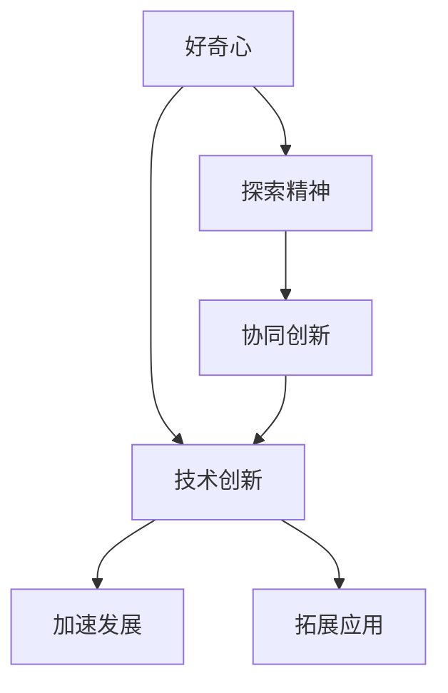

                 

# 探索与理解：好奇心的力量

> 关键词：探索,好奇心,技术创新,人工智能,算法原理

## 1. 背景介绍

### 1.1 问题由来

在现代科技的飞速发展中，人工智能(AI)正成为改变世界格局的关键力量。无论是无人驾驶、智能推荐、还是医疗诊断，人工智能正以越来越深入的方式融入我们的日常生活。然而，技术进步的背后，有一股强大的动力——好奇心，它是推动人类探索未知、追求真理的重要引擎。

本文将深入探讨好奇心的力量，如何驱动人工智能的发展，以及在技术创新中扮演的重要角色。通过分析几个典型案例，我们将看到好奇心如何激发技术进步，引领行业变革。

### 1.2 问题核心关键点

好奇心作为人类探索未知、求知欲望的源泉，在技术创新和应用中起到了不可替代的作用。技术创新往往始于一些简单的好奇心问题，如“为什么现有的算法无法解决这个问题？”“能否从另一角度解决同样的问题？”等。这些问题激发了研究人员不断探索和尝试，最终推动了技术的发展和进步。

在人工智能领域，好奇心不仅推动了技术突破，还催生了新的应用场景和商业模式。比如，对深度学习算法的好奇心，使得神经网络得到了进一步发展；对自然语言处理(NLP)的好奇心，推动了机器翻译和语音识别的进步；对图像处理的好奇心，带来了计算机视觉的突破。

### 1.3 问题研究意义

了解好奇心在技术创新中的作用，对于促进科技人员的探索精神、推动技术的发展和应用具有重要意义：

1. **激发探索精神**：好奇心能够激发人们探索未知、勇于尝试，从而推动科技的进步。
2. **加速技术创新**：在技术探索的初期，好奇心驱动的探索过程往往能加速新技术的开发和应用。
3. **拓展应用边界**：好奇心能促使研究人员关注技术在新的应用场景中的可能性，从而拓展技术的边界。
4. **形成协同创新**：好奇心驱动的研究往往需要跨学科、跨领域的合作，能够促进协同创新。
5. **提升社会效益**：好奇心驱动的技术创新往往能带来更大的社会效益，如医疗健康、教育等领域。

## 2. 核心概念与联系

### 2.1 核心概念概述

在探讨好奇心与技术创新的关系时，我们需要先了解几个核心概念：

- **好奇心**：人类对未知事物的好奇心驱动了科学和技术的探索和创新。
- **技术创新**：是指通过技术突破、新方法或新产品的开发，解决旧问题或开拓新领域的过程。
- **探索精神**：是指在科研和技术探索过程中，对未知领域持续的兴趣和热情。
- **协同创新**：指多学科、多领域交叉合作，共同解决复杂问题的创新过程。

### 2.2 概念间的关系

这些概念间的关系可以构建如下的Mermaid流程图来展示：



这个流程图展示了好奇心如何通过激发探索精神，推动技术创新，加速发展和拓展应用，并通过协同创新形成更广泛的影响。

### 2.3 核心概念的整体架构

在整体架构上，好奇心的力量体现在以下几个层次：

1. **个体层面**：好奇心驱动个体在技术探索中的持续兴趣和热情，推动个人研究和技术突破。
2. **团队层面**：好奇心激发团队成员间的协同合作，共同解决复杂问题，形成更强大的创新能力。
3. **组织层面**：好奇心推动企业在技术探索中的长远规划和持续投资，形成创新生态。
4. **社会层面**：好奇心驱动社会对科技问题的关注和解决，提升整体科技水平。

## 3. 核心算法原理 & 具体操作步骤

### 3.1 算法原理概述

好奇心驱动的技术创新过程，可以看作是不断探索、验证和优化的算法原理。核心算法原理可以概括为以下几个步骤：

1. **问题定义**：确定需要解决的问题或任务。
2. **数据收集**：获取与问题相关的数据。
3. **模型选择**：选择合适的模型或算法。
4. **模型训练**：通过数据训练模型，形成初步的解决方案。
5. **验证与优化**：通过验证和优化，不断改进模型。
6. **应用部署**：将模型部署到实际应用中，形成技术创新。

### 3.2 算法步骤详解

以下将详细介绍每一个步骤的具体内容：

#### 3.2.1 问题定义

问题定义是技术创新的起点。通常，一个好的问题定义需要满足以下几个标准：

- **明确性**：问题需要具体明确，便于后续的探索和研究。
- **可行性**：问题需要具备解决的可能性，避免过于宏大或难以实现的课题。
- **创新性**：问题需要具有一定的创新性，能够激发探索和研究的兴趣。

例如，在计算机视觉领域，问题定义可以是从零开始构建一个人脸识别系统。

#### 3.2.2 数据收集

数据收集是技术创新的关键环节。高质量的数据集是模型训练的基础。数据收集过程需要注意以下几点：

- **数据多样性**：数据集需要包含多种场景和情况，以确保模型具有泛化能力。
- **数据标注**：数据需要有准确的标注信息，便于后续的模型训练。
- **数据获取**：数据可以来自公开数据集、爬虫抓取、用户生成数据等途径。

例如，在自然语言处理(NLP)领域，数据收集可以从公开的文本数据集中获取，或通过爬虫抓取社交媒体上的文本数据。

#### 3.2.3 模型选择

模型选择是技术创新的核心。选择合适的模型能够显著提高技术创新的效率和效果。模型选择需要考虑以下几个方面：

- **模型复杂度**：模型复杂度需要与问题的复杂度相匹配，避免过于简单无法解决或过于复杂难以实现。
- **现有知识**：选择已有较为成熟的模型，可以避免从头开发，提高开发效率。
- **性能要求**：根据实际应用场景，选择性能最优的模型。

例如，在图像识别领域，可以选择卷积神经网络(CNN)模型，因其在图像处理中效果显著。

#### 3.2.4 模型训练

模型训练是技术创新的实践过程。训练过程需要不断调整模型参数，优化模型性能。训练过程包括以下几个步骤：

- **初始化**：随机初始化模型参数。
- **前向传播**：将输入数据输入模型，得到输出结果。
- **损失计算**：计算模型输出与真实标签之间的损失函数。
- **反向传播**：通过反向传播更新模型参数，最小化损失函数。
- **迭代优化**：重复前向传播、损失计算、反向传播和参数更新，直到模型收敛。

例如，在图像分类任务中，使用交叉熵损失函数，通过反向传播更新卷积神经网络中的参数，最小化损失函数。

#### 3.2.5 验证与优化

验证与优化是技术创新的检验过程。通过验证，可以评估模型的性能和鲁棒性，发现模型的问题并进行优化。验证与优化包括以下几个步骤：

- **验证集**：使用与训练集不同的数据集，评估模型的泛化能力。
- **超参数调优**：调整学习率、批大小等超参数，优化模型性能。
- **模型优化**：通过正则化、dropout等技术优化模型，避免过拟合。
- **反馈迭代**：根据验证集的结果，不断调整模型和算法，提高模型性能。

例如，在自然语言处理任务中，使用验证集评估模型的性能，通过调整学习率和正则化系数，优化模型，避免过拟合。

#### 3.2.6 应用部署

应用部署是技术创新的最终目标。将训练好的模型部署到实际应用中，形成实际的技术创新。应用部署包括以下几个步骤：

- **数据预处理**：对输入数据进行预处理，确保数据符合模型的输入要求。
- **模型集成**：将训练好的模型集成到应用系统中。
- **用户交互**：设计用户界面，方便用户使用技术创新。
- **性能优化**：对模型进行性能优化，提高应用效率。

例如，在语音识别应用中，将训练好的模型集成到手机应用中，用户可以通过语音指令控制智能设备。

### 3.3 算法优缺点

基于好奇心的技术创新方法有以下优点：

- **创新性强**：好奇心驱动的创新过程，通常能够带来颠覆性技术突破。
- **应用广泛**：好奇心可以探索各种领域的问题，推动技术在多个领域的应用。
- **加速发展**：好奇心激发研究人员持续探索，加速技术进步。

同时，也存在一些缺点：

- **资源消耗**：好奇心驱动的探索过程，通常需要大量的时间、人力和资源。
- **风险高**：探索过程具有不确定性，可能面临失败的风险。
- **协作难度**：好奇心驱动的创新，通常需要跨学科、跨领域的合作，协作难度较大。

### 3.4 算法应用领域

好奇心驱动的技术创新方法在多个领域得到了广泛应用：

- **计算机视觉**：如人脸识别、物体检测、图像分割等任务。
- **自然语言处理**：如机器翻译、文本分类、情感分析等任务。
- **语音识别**：如语音合成、语音识别、语音情感分析等任务。
- **推荐系统**：如个性化推荐、广告推荐、商品推荐等任务。
- **智能制造**：如智能监控、智能制造、工业物联网等任务。

## 4. 数学模型和公式 & 详细讲解 & 举例说明

### 4.1 数学模型构建

好奇心驱动的技术创新过程中，数学模型是不可或缺的工具。以下是一个简单的二分类问题的数学模型构建过程：

- **输入数据**：假设输入数据为向量 $x$，包含 $n$ 个特征。
- **输出标签**：假设输出标签为 $y$，取值为 $0$ 或 $1$，表示分类结果。
- **模型参数**：假设模型参数为 $\theta$，包含 $m$ 个权重。
- **损失函数**：假设损失函数为 $L(\theta)$，用于衡量模型输出与真实标签之间的差异。
- **优化目标**：最小化损失函数 $L(\theta)$，即 $\min_{\theta} L(\theta)$。

### 4.2 公式推导过程

以逻辑回归为例，推导其数学模型和损失函数的计算过程：

- **模型公式**：逻辑回归模型的输出为 $y=\sigma(\theta^Tx)$，其中 $\sigma(\cdot)$ 为sigmoid函数。
- **损失函数**：逻辑回归的损失函数为 $L(\theta)=\frac{1}{N}\sum_{i=1}^N L_i(\theta)$，其中 $N$ 为样本数，$L_i(\theta)=y_i\log\sigma(\theta^Tx_i)+(1-y_i)\log(1-\sigma(\theta^Tx_i))$。

### 4.3 案例分析与讲解

以深度学习在图像分类任务中的应用为例，解释数学模型和公式的实际应用：

- **数据集**：使用MNIST手写数字数据集，包含60000个训练样本和10000个测试样本。
- **模型选择**：选择卷积神经网络(CNN)模型。
- **模型训练**：使用交叉熵损失函数，通过反向传播算法更新模型参数，最小化损失函数。
- **验证与优化**：使用验证集评估模型性能，通过调整学习率和正则化系数优化模型。
- **应用部署**：将训练好的模型部署到实际应用中，如手写数字识别。

## 5. 项目实践：代码实例和详细解释说明

### 5.1 开发环境搭建

为了进行深度学习项目的实践，需要搭建合适的开发环境。以下是详细的步骤：

1. **安装Python**：从官网下载并安装Python 3.6或以上版本。
2. **安装NumPy和Pandas**：使用pip安装NumPy和Pandas库，安装命令为 `pip install numpy pandas`。
3. **安装TensorFlow**：使用pip安装TensorFlow，安装命令为 `pip install tensorflow`。
4. **安装Keras**：使用pip安装Keras库，安装命令为 `pip install keras`。
5. **安装Jupyter Notebook**：使用pip安装Jupyter Notebook，安装命令为 `pip install jupyter notebook`。

### 5.2 源代码详细实现

以下是一个简单的图像分类项目的实现代码，使用了卷积神经网络模型和交叉熵损失函数：

```python
import tensorflow as tf
from tensorflow.keras import layers, models

# 定义模型
model = models.Sequential()
model.add(layers.Conv2D(32, (3, 3), activation='relu', input_shape=(28, 28, 1)))
model.add(layers.MaxPooling2D((2, 2)))
model.add(layers.Conv2D(64, (3, 3), activation='relu'))
model.add(layers.MaxPooling2D((2, 2)))
model.add(layers.Conv2D(64, (3, 3), activation='relu'))
model.add(layers.Flatten())
model.add(layers.Dense(64, activation='relu'))
model.add(layers.Dense(10, activation='softmax'))

# 编译模型
model.compile(optimizer='adam', loss='categorical_crossentropy', metrics=['accuracy'])

# 训练模型
model.fit(train_images, train_labels, epochs=10, batch_size=32, validation_data=(val_images, val_labels))

# 评估模型
test_loss, test_acc = model.evaluate(test_images, test_labels)
print('Test accuracy:', test_acc)
```

### 5.3 代码解读与分析

以上代码中，我们使用了TensorFlow和Keras库构建了一个简单的卷积神经网络模型。具体解读如下：

- **定义模型**：首先定义了一个Sequential模型，包含三个卷积层和两个全连接层。
- **编译模型**：使用adam优化器和交叉熵损失函数编译模型。
- **训练模型**：在训练集上训练模型，共进行10个epoch，每个batch的大小为32。
- **评估模型**：在测试集上评估模型性能，输出测试准确率。

## 6. 实际应用场景

### 6.1 智能推荐系统

在智能推荐系统中，好奇心驱动的探索过程可以带来显著的改进。例如，通过对用户行为数据的好奇心驱动，探索用户兴趣的变化，优化推荐算法，提升推荐效果。具体步骤包括：

1. **数据收集**：收集用户浏览、购买、评分等行为数据。
2. **模型选择**：选择合适的推荐算法，如协同过滤、内容推荐等。
3. **模型训练**：使用收集到的数据训练模型，形成推荐算法。
4. **验证与优化**：通过A/B测试等手段验证推荐效果，不断优化模型。
5. **应用部署**：将优化后的推荐算法部署到实际应用中，如电商平台的商品推荐。

### 6.2 医疗影像诊断

在医疗影像诊断中，好奇心驱动的探索过程同样重要。例如，通过对医学影像数据的好奇心驱动，探索新的影像特征和诊断算法，提升诊断准确率。具体步骤包括：

1. **数据收集**：收集医学影像数据和医生诊断结果。
2. **模型选择**：选择合适的诊断算法，如卷积神经网络。
3. **模型训练**：使用收集到的数据训练模型，形成诊断算法。
4. **验证与优化**：通过验证集评估诊断准确率，不断优化模型。
5. **应用部署**：将优化后的诊断算法部署到实际应用中，如影像诊断系统。

### 6.3 自然语言处理

在自然语言处理(NLP)中，好奇心驱动的探索过程同样不可或缺。例如，通过对文本数据的好奇心驱动，探索新的NLP任务和算法，提升NLP模型的性能。具体步骤包括：

1. **数据收集**：收集文本数据，如新闻、评论、社交媒体等。
2. **模型选择**：选择合适的NLP算法，如BERT、GPT等。
3. **模型训练**：使用收集到的数据训练模型，形成NLP算法。
4. **验证与优化**：通过验证集评估模型性能，不断优化模型。
5. **应用部署**：将优化后的NLP算法部署到实际应用中，如智能客服系统。

## 7. 工具和资源推荐

### 7.1 学习资源推荐

为了帮助开发者更好地掌握好奇心驱动的技术创新，以下是一些优质的学习资源推荐：

1. **Coursera**：提供众多计算机科学和数据科学的课程，如《深度学习专项课程》等。
2. **Udacity**：提供深度学习、计算机视觉、自然语言处理等领域的纳米学位课程。
3. **Kaggle**：提供大量数据科学竞赛和数据集，可以参与实际项目锻炼。
4. **GitHub**：提供全球最优秀的开源项目，可以学习并贡献代码。
5. **Stack Overflow**：提供问答社区，可以解决技术问题，与其他开发者交流。

### 7.2 开发工具推荐

高效的工具是技术创新的必备条件。以下是几款常用的开发工具推荐：

1. **Jupyter Notebook**：交互式开发环境，方便调试和展示代码。
2. **PyTorch**：深度学习框架，支持动态计算图和灵活的模型设计。
3. **TensorFlow**：深度学习框架，支持分布式计算和大规模训练。
4. **Scikit-Learn**：机器学习库，提供丰富的数据预处理和模型评估工具。
5. **HuggingFace Transformers**：NLP工具库，提供预训练模型和微调框架。

### 7.3 相关论文推荐

以下是一些关于好奇心和技术创新研究的重要论文推荐：

1. **《深度学习的可解释性和可理解性》**：探讨了深度学习模型的可解释性和可理解性，提出了多种方法，如可视化、特征提取等。
2. **《探索性数据分析：方法和应用》**：介绍了探索性数据分析的方法和应用，有助于理解数据特性和问题定义。
3. **《协同过滤算法》**：介绍了协同过滤算法在推荐系统中的应用，探讨了数据特征和算法优化。
4. **《医疗影像中的深度学习》**：介绍了深度学习在医疗影像诊断中的应用，探讨了模型选择和数据预处理。
5. **《自然语言处理中的预训练模型》**：介绍了预训练模型在自然语言处理中的应用，探讨了模型训练和验证。

## 8. 总结：未来发展趋势与挑战

### 8.1 研究成果总结

好奇心驱动的技术创新在多个领域得到了广泛应用，取得了显著的进展。通过本文的探讨，我们可以看到，好奇心不仅能够激发探索精神，还能加速技术创新，拓展应用边界。

### 8.2 未来发展趋势

未来，好奇心驱动的技术创新将呈现以下几个发展趋势：

1. **跨领域融合**：不同领域的好奇心驱动探索将相互借鉴，形成跨领域的协同创新。
2. **数据驱动**：随着数据量的增加和数据质量的提升，数据驱动的探索将更加广泛。
3. **协作创新**：跨学科、跨领域的合作将更加频繁，推动协同创新。
4. **技术进步**：随着技术的不断进步，好奇心驱动的探索将带来更多颠覆性创新。
5. **社会影响**：好奇心驱动的探索将带来更广泛的社会影响，推动社会进步。

### 8.3 面临的挑战

虽然好奇心驱动的技术创新具有巨大的潜力，但也面临着诸多挑战：

1. **资源瓶颈**：好奇心驱动的探索需要大量时间和资源，如何高效利用资源是关键。
2. **风险高**：探索过程具有不确定性，可能面临失败的风险。
3. **协作难度**：跨学科、跨领域的合作难度较大，需要有效的协作机制。
4. **数据质量**：高质量的数据是好奇心驱动探索的基础，如何获取高质量数据是难点。
5. **应用落地**：将好奇心驱动的探索转化为实际应用，需要解决技术、市场等多方面问题。

### 8.4 研究展望

未来的研究需要在以下几个方面寻求新的突破：

1. **数据高效获取**：开发高效的数据收集和标注方法，降低探索成本。
2. **协作平台建设**：建立跨学科、跨领域的协作平台，促进知识共享和协同创新。
3. **技术优化**：优化探索过程中的算法和技术，提高探索效率和效果。
4. **社会影响研究**：深入研究好奇心驱动的探索对社会的影响，推动社会进步。

## 9. 附录：常见问题与解答

**Q1：好奇心驱动的技术创新是否适用于所有领域？**

A: 好奇心驱动的技术创新在各个领域都有广泛应用，但不同领域的好奇心驱动探索过程和应用方式可能会有所不同。例如，在医疗影像诊断中，好奇心驱动的探索主要集中于影像特征和诊断算法的改进，而在自然语言处理中，则更多关注NLP任务和算法的选择和优化。

**Q2：好奇心驱动的技术创新如何与商业化结合？**

A: 好奇心驱动的技术创新可以通过以下几个步骤与商业化结合：

1. **市场调研**：通过市场调研了解目标用户的需求和痛点，确定技术创新的方向。
2. **技术探索**：基于调研结果，进行好奇心驱动的技术探索，开发新技术或新方法。
3. **产品设计**：将技术探索成果转化为产品设计，确定产品的功能和应用场景。
4. **市场推广**：通过市场推广，让目标用户了解并使用产品，形成商业化应用。

**Q3：好奇心驱动的技术创新如何平衡探索和应用？**

A: 好奇心驱动的技术创新需要在探索和应用之间找到平衡点：

1. **明确目标**：在探索过程中，明确技术创新的目标和方向，避免无目的探索。
2. **渐进式探索**：在探索过程中，采取渐进式的方式，逐步验证和优化技术成果。
3. **反馈机制**：建立反馈机制，及时了解用户反馈和技术效果，调整探索方向。
4. **应用验证**：在探索过程中，不断将技术成果应用到实际场景中，进行验证和优化。

总之，好奇心驱动的技术创新需要在探索和应用之间找到平衡点，通过持续的探索和应用，推动技术不断进步。

**Q4：好奇心驱动的技术创新如何克服资源瓶颈？**

A: 好奇心驱动的技术创新可以通过以下几个方法克服资源瓶颈：

1. **数据共享**：建立数据共享平台，促进数据资源的流通和共享。
2. **技术优化**：优化算法和技术，提高资源利用效率，降低探索成本。
3. **协同创新**：跨学科、跨领域的协作，整合资源和技术，形成更强大的创新能力。
4. **开放创新**：开放技术资源和工具，吸引更多开发者参与创新。

通过以上方法，可以克服好奇心驱动的探索过程中的资源瓶颈，提高探索效率。

---

作者：禅与计算机程序设计艺术 / Zen and the Art of Computer Programming

