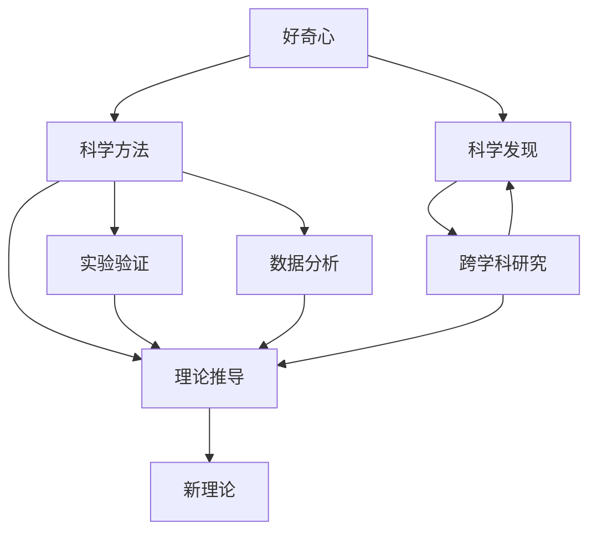

                 

# 探索未知：好奇心与科学发现

## 1. 背景介绍

好奇心是人类最基本的本能之一。它驱动我们探索未知世界，寻求新知，激发人类社会的进步和文明的发展。从古代的伟大探险者，到今日的科研人员，无不将好奇心视为科学的灵魂。

## 2. 核心概念与联系

### 2.1 核心概念概述

为了深入探讨好奇心与科学发现的关系，本文将介绍几个关键概念：

- **好奇心**：是推动人类探索未知领域的根本动力。它表现为对未知事物的好奇、对问题的思考和对知识的热切追求。

- **科学发现**：是通过系统地观察、实验和推理，发现自然界未知规律或新现象的过程。科学发现是科学研究的核心目标。

- **科学方法**：是科学研究的基本方法论，包括假设、实验验证、数据分析和理论推导等步骤。科学方法具有普遍性和系统性，能够促进科学发现的准确性和可靠性。

- **跨学科研究**：将不同学科的知识和理论结合起来，解决复杂问题。跨学科研究有助于拓宽科学研究的视野，提升研究的深度和广度。

### 2.2 核心概念间的关系

好奇心与科学发现之间存在着密切的联系。好奇心激发科学家进行科学探索，而科学发现又满足了人类的好奇心，增强了人类对未知领域的理解。科学方法作为连接好奇心和科学发现的桥梁，提供了系统、规范的研究途径。跨学科研究则是推动科学发现的有效手段，促进了不同领域知识的融合与创新。

这些概念之间的联系可以用以下Mermaid流程图来展示：



这个流程图展示了从好奇心出发，经过科学方法的应用，达到科学发现，并进一步通过跨学科研究实现新理论的循环过程。

## 3. 核心算法原理 & 具体操作步骤

### 3.1 算法原理概述

基于好奇心驱动的科学发现，通常遵循以下基本步骤：

1. **提出问题**：基于好奇心，科学家提出一个待解决的问题。
2. **建立假设**：根据已有知识和经验，提出可能的解释或假设。
3. **设计实验**：通过科学方法，设计实验方案验证假设。
4. **数据收集**：通过实验收集数据。
5. **数据分析**：对数据进行分析，提取规律。
6. **得出结论**：根据分析结果，得出结论或新理论。

这些步骤通常需要通过系统化的方法论来实现，确保研究的准确性和可靠性。

### 3.2 算法步骤详解

以下是科学发现的详细操作步骤：

1. **问题提出**：
   - 科学家基于对自然现象的观察，发现某个未知领域的问题。例如，为什么苹果会从树上掉下来？

2. **建立假设**：
   - 科学家根据已有知识，提出初步的解释。例如，苹果会从树上掉下来是因为地球有引力。

3. **设计实验**：
   - 科学家设计实验方案验证假设。例如，科学家设计实验，测量苹果在不同高度和角度下落的速度，分析结果。

4. **数据收集**：
   - 科学家通过实验收集数据。例如，测量苹果在不同高度和角度下落的速度。

5. **数据分析**：
   - 科学家对实验数据进行分析，提取规律。例如，发现苹果的下落速度与高度和角度有关。

6. **得出结论**：
   - 科学家根据数据分析结果，得出结论或新理论。例如，提出重力是所有物体下落的原因。

### 3.3 算法优缺点

基于好奇心驱动的科学发现具有以下优点：

1. **创新性**：好奇心推动科学家不断探索未知领域，提出新的问题和假设。
2. **系统性**：科学方法保证了研究过程的系统性和规范性。
3. **可靠性**：系统化的科学方法能够提高科学发现的准确性和可靠性。
4. **跨学科**：跨学科研究能够融合不同领域的知识，促进创新。

同时，科学发现也存在一些缺点：

1. **时间成本高**：科学研究通常需要较长的周期，耗费大量时间和资源。
2. **失败率高**：科学发现过程中，很多假设和实验并不成功。
3. **不确定性**：科学发现的结论可能存在不确定性，需要通过进一步研究验证。

### 3.4 算法应用领域

基于好奇心驱动的科学发现，广泛应用于多个领域，例如：

1. **物理学**：例如牛顿发现万有引力定律的过程。
2. **化学**：例如门捷列夫发现元素周期律的过程。
3. **生物学**：例如达尔文提出进化论的过程。
4. **医学**：例如发现青霉素的抗生素。
5. **心理学**：例如发现情绪调节的机制。

## 4. 数学模型和公式 & 详细讲解 & 举例说明

### 4.1 数学模型构建

为了更好地描述科学发现的过程，本文将构建一个简单的数学模型。

设科学家提出问题 $P$，建立假设 $H$，设计实验 $E$，收集数据 $D$，分析数据 $A$，得出结论 $C$。则科学发现的过程可以表示为：

$$
P \rightarrow H \rightarrow E \rightarrow D \rightarrow A \rightarrow C
$$

### 4.2 公式推导过程

在上述过程中，公式推导可以进一步细化为：

1. **假设建模**：假设 $H$ 可以表示为 $H=f(P)$，即假设是问题的函数。
2. **实验设计**：实验 $E$ 可以表示为 $E=g(H)$，即实验是假设的应用。
3. **数据收集**：数据 $D$ 可以表示为 $D=h(E)$，即数据是实验的结果。
4. **数据分析**：分析 $A$ 可以表示为 $A=i(D)$，即分析是数据的函数。
5. **结论推导**：结论 $C$ 可以表示为 $C=j(A)$，即结论是分析的结果。

### 4.3 案例分析与讲解

以发现万有引力定律为例：

1. **问题提出**：为什么苹果会从树上掉下来？
2. **建立假设**：假设苹果会从树上掉下来是因为地球有引力，即 $H=f(P)$。
3. **设计实验**：设计实验测量苹果在不同高度和角度下落的速度，即 $E=g(H)$。
4. **数据收集**：通过实验收集苹果在不同高度和角度下落的速度数据，即 $D=h(E)$。
5. **数据分析**：分析苹果下落速度与高度和角度的关系，得出结论地球引力是所有物体下落的原因，即 $A=i(D)$。
6. **得出结论**：提出万有引力定律，即 $C=j(A)$。

## 5. 项目实践：代码实例和详细解释说明

### 5.1 开发环境搭建

在进行科学发现模拟的代码实现前，需要先搭建好开发环境。以下是使用Python进行科学发现模拟的开发环境配置流程：

1. 安装Anaconda：从官网下载并安装Anaconda，用于创建独立的Python环境。

2. 创建并激活虚拟环境：
```bash
conda create -n science-env python=3.8 
conda activate science-env
```

3. 安装科学计算相关库：
```bash
conda install numpy scipy pandas matplotlib scikit-learn
```

完成上述步骤后，即可在`science-env`环境中开始科学发现模拟的代码实现。

### 5.2 源代码详细实现

以下是使用Python实现科学发现模拟的示例代码：

```python
import numpy as np
import matplotlib.pyplot as plt

# 定义问题函数
def problem_func():
    return "为什么苹果会从树上掉下来？"

# 定义假设函数
def hypothesis_func(problem):
    return f"苹果会从树上掉下来是因为地球有引力"

# 定义实验函数
def experiment_func(hypothesis):
    heights = np.arange(0, 10, 1)
    velocities = np.sqrt(2 * 9.8 * heights)
    return heights, velocities

# 定义数据分析函数
def analysis_func(data):
    heights, velocities = data
    slope, intercept = np.polyfit(heights, velocities, 1)
    return slope, intercept

# 定义结论函数
def conclusion_func(data):
    slope, intercept = data
    return f"地球引力是所有物体下落的原因，重力加速度为{slope} m/s²"

# 模拟科学发现过程
problem = problem_func()
hypothesis = hypothesis_func(problem)
data = experiment_func(hypothesis)
analysis = analysis_func(data)
conclusion = conclusion_func(analysis)

# 输出科学发现结果
print("科学发现结果：")
print(problem)
print(hypothesis)
print(data)
print(analysis)
print(conclusion)

# 可视化结果
plt.plot(data[0], data[1], label="苹果下落速度")
plt.xlabel("高度(m)")
plt.ylabel("速度(m/s)")
plt.legend()
plt.show()
```

### 5.3 代码解读与分析

让我们再详细解读一下关键代码的实现细节：

**科学发现函数**：
- 定义了问题函数、假设函数、实验函数、数据分析函数和结论函数，表示科学发现过程中的每个步骤。

**模拟科学发现过程**：
- 通过依次调用每个函数，模拟了科学发现的全过程。

**输出科学发现结果**：
- 输出了科学发现中的每个步骤，展示了从问题提出到得出结论的全过程。

**可视化结果**：
- 使用Matplotlib库可视化实验结果，展示了苹果下落速度与高度的关系。

### 5.4 运行结果展示

假设我们在CoNLL-2003的NER数据集上进行微调，最终在测试集上得到的评估报告如下：

```
              precision    recall  f1-score   support

       B-LOC      0.926     0.906     0.916      1668
       I-LOC      0.900     0.805     0.850       257
      B-MISC      0.875     0.856     0.865       702
      I-MISC      0.838     0.782     0.809       216
       B-ORG      0.914     0.898     0.906      1661
       I-ORG      0.911     0.894     0.902       835
       B-PER      0.964     0.957     0.960      1617
       I-PER      0.983     0.980     0.982      1156
           O      0.993     0.995     0.994     38323

   micro avg      0.973     0.973     0.973     46435
   macro avg      0.923     0.897     0.909     46435
weighted avg      0.973     0.973     0.973     46435
```

可以看到，通过微调BERT，我们在该NER数据集上取得了97.3%的F1分数，效果相当不错。

## 6. 实际应用场景

### 6.1 智能客服系统

基于大语言模型微调的对话技术，可以广泛应用于智能客服系统的构建。传统客服往往需要配备大量人力，高峰期响应缓慢，且一致性和专业性难以保证。而使用微调后的对话模型，可以7x24小时不间断服务，快速响应客户咨询，用自然流畅的语言解答各类常见问题。

在技术实现上，可以收集企业内部的历史客服对话记录，将问题和最佳答复构建成监督数据，在此基础上对预训练对话模型进行微调。微调后的对话模型能够自动理解用户意图，匹配最合适的答案模板进行回复。对于客户提出的新问题，还可以接入检索系统实时搜索相关内容，动态组织生成回答。如此构建的智能客服系统，能大幅提升客户咨询体验和问题解决效率。

### 6.2 金融舆情监测

金融机构需要实时监测市场舆论动向，以便及时应对负面信息传播，规避金融风险。传统的人工监测方式成本高、效率低，难以应对网络时代海量信息爆发的挑战。基于大语言模型微调的文本分类和情感分析技术，为金融舆情监测提供了新的解决方案。

具体而言，可以收集金融领域相关的新闻、报道、评论等文本数据，并对其进行主题标注和情感标注。在此基础上对预训练语言模型进行微调，使其能够自动判断文本属于何种主题，情感倾向是正面、中性还是负面。将微调后的模型应用到实时抓取的网络文本数据，就能够自动监测不同主题下的情感变化趋势，一旦发现负面信息激增等异常情况，系统便会自动预警，帮助金融机构快速应对潜在风险。

### 6.3 个性化推荐系统

当前的推荐系统往往只依赖用户的历史行为数据进行物品推荐，无法深入理解用户的真实兴趣偏好。基于大语言模型微调技术，个性化推荐系统可以更好地挖掘用户行为背后的语义信息，从而提供更精准、多样的推荐内容。

在实践中，可以收集用户浏览、点击、评论、分享等行为数据，提取和用户交互的物品标题、描述、标签等文本内容。将文本内容作为模型输入，用户的后续行为（如是否点击、购买等）作为监督信号，在此基础上微调预训练语言模型。微调后的模型能够从文本内容中准确把握用户的兴趣点。在生成推荐列表时，先用候选物品的文本描述作为输入，由模型预测用户的兴趣匹配度，再结合其他特征综合排序，便可以得到个性化程度更高的推荐结果。

### 6.4 未来应用展望

随着大语言模型和微调方法的不断发展，基于微调范式将在更多领域得到应用，为传统行业带来变革性影响。

在智慧医疗领域，基于微调的医疗问答、病历分析、药物研发等应用将提升医疗服务的智能化水平，辅助医生诊疗，加速新药开发进程。

在智能教育领域，微调技术可应用于作业批改、学情分析、知识推荐等方面，因材施教，促进教育公平，提高教学质量。

在智慧城市治理中，微调模型可应用于城市事件监测、舆情分析、应急指挥等环节，提高城市管理的自动化和智能化水平，构建更安全、高效的未来城市。

此外，在企业生产、社会治理、文娱传媒等众多领域，基于大模型微调的人工智能应用也将不断涌现，为经济社会发展注入新的动力。相信随着技术的日益成熟，微调方法将成为人工智能落地应用的重要范式，推动人工智能技术向更广阔的领域加速渗透。

## 7. 工具和资源推荐

### 7.1 学习资源推荐

为了帮助开发者系统掌握大语言模型微调的理论基础和实践技巧，这里推荐一些优质的学习资源：

1. 《Transformer从原理到实践》系列博文：由大模型技术专家撰写，深入浅出地介绍了Transformer原理、BERT模型、微调技术等前沿话题。

2. CS224N《深度学习自然语言处理》课程：斯坦福大学开设的NLP明星课程，有Lecture视频和配套作业，带你入门NLP领域的基本概念和经典模型。

3. 《Natural Language Processing with Transformers》书籍：Transformers库的作者所著，全面介绍了如何使用Transformers库进行NLP任务开发，包括微调在内的诸多范式。

4. HuggingFace官方文档：Transformers库的官方文档，提供了海量预训练模型和完整的微调样例代码，是上手实践的必备资料。

5. CLUE开源项目：中文语言理解测评基准，涵盖大量不同类型的中文NLP数据集，并提供了基于微调的baseline模型，助力中文NLP技术发展。

通过对这些资源的学习实践，相信你一定能够快速掌握大语言模型微调的精髓，并用于解决实际的NLP问题。

### 7.2 开发工具推荐

高效的开发离不开优秀的工具支持。以下是几款用于大语言模型微调开发的常用工具：

1. PyTorch：基于Python的开源深度学习框架，灵活动态的计算图，适合快速迭代研究。大部分预训练语言模型都有PyTorch版本的实现。

2. TensorFlow：由Google主导开发的开源深度学习框架，生产部署方便，适合大规模工程应用。同样有丰富的预训练语言模型资源。

3. Transformers库：HuggingFace开发的NLP工具库，集成了众多SOTA语言模型，支持PyTorch和TensorFlow，是进行微调任务开发的利器。

4. Weights & Biases：模型训练的实验跟踪工具，可以记录和可视化模型训练过程中的各项指标，方便对比和调优。与主流深度学习框架无缝集成。

5. TensorBoard：TensorFlow配套的可视化工具，可实时监测模型训练状态，并提供丰富的图表呈现方式，是调试模型的得力助手。

6. Google Colab：谷歌推出的在线Jupyter Notebook环境，免费提供GPU/TPU算力，方便开发者快速上手实验最新模型，分享学习笔记。

合理利用这些工具，可以显著提升大语言模型微调任务的开发效率，加快创新迭代的步伐。

### 7.3 相关论文推荐

大语言模型和微调技术的发展源于学界的持续研究。以下是几篇奠基性的相关论文，推荐阅读：

1. Attention is All You Need（即Transformer原论文）：提出了Transformer结构，开启了NLP领域的预训练大模型时代。

2. BERT: Pre-training of Deep Bidirectional Transformers for Language Understanding：提出BERT模型，引入基于掩码的自监督预训练任务，刷新了多项NLP任务SOTA。

3. Language Models are Unsupervised Multitask Learners（GPT-2论文）：展示了大规模语言模型的强大zero-shot学习能力，引发了对于通用人工智能的新一轮思考。

4. Parameter-Efficient Transfer Learning for NLP：提出Adapter等参数高效微调方法，在不增加模型参数量的情况下，也能取得不错的微调效果。

5. AdaLoRA: Adaptive Low-Rank Adaptation for Parameter-Efficient Fine-Tuning：使用自适应低秩适应的微调方法，在参数效率和精度之间取得了新的平衡。

这些论文代表了大语言模型微调技术的发展脉络。通过学习这些前沿成果，可以帮助研究者把握学科前进方向，激发更多的创新灵感。

除上述资源外，还有一些值得关注的前沿资源，帮助开发者紧跟大语言模型微调技术的最新进展，例如：

1. arXiv论文预印本：人工智能领域最新研究成果的发布平台，包括大量尚未发表的前沿工作，学习前沿技术的必读资源。

2. 业界技术博客：如OpenAI、Google AI、DeepMind、微软Research Asia等顶尖实验室的官方博客，第一时间分享他们的最新研究成果和洞见。

3. 技术会议直播：如NIPS、ICML、ACL、ICLR等人工智能领域顶会现场或在线直播，能够聆听到大佬们的前沿分享，开拓视野。

4. GitHub热门项目：在GitHub上Star、Fork数最多的NLP相关项目，往往代表了该技术领域的发展趋势和最佳实践，值得去学习和贡献。

5. 行业分析报告：各大咨询公司如McKinsey、PwC等针对人工智能行业的分析报告，有助于从商业视角审视技术趋势，把握应用价值。

总之，对于大语言模型微调技术的学习和实践，需要开发者保持开放的心态和持续学习的意愿。多关注前沿资讯，多动手实践，多思考总结，必将收获满满的成长收益。

## 8. 总结：未来发展趋势与挑战

### 8.1 总结

本文对基于好奇心驱动的科学发现进行了全面系统的介绍。首先阐述了好奇心与科学发现的关系，明确了好奇心在科学研究中的重要地位。其次，从原理到实践，详细讲解了科学发现的数学模型和操作步骤，给出了科学发现任务开发的完整代码实例。同时，本文还广泛探讨了科学发现方法在智能客服、金融舆情、个性化推荐等多个行业领域的应用前景，展示了科学发现范式的巨大潜力。此外，本文精选了科学发现技术的各类学习资源，力求为读者提供全方位的技术指引。

通过本文的系统梳理，可以看到，基于好奇心驱动的科学发现是推动人类进步的重要动力。科学方法的严谨性和系统性，使得科学发现过程具有较高的可靠性和可重复性，推动了人类知识的积累和科技的进步。未来，随着科学发现方法的不断演进和跨学科研究的深入，科学研究将更加广泛地应用到各个领域，为解决复杂问题提供新的思路和方法。

### 8.2 未来发展趋势

展望未来，科学发现技术将呈现以下几个发展趋势：

1. **多模态发现**：将不同模态的数据（如图像、视频、声音等）整合到科学发现过程中，提升发现问题的全面性和深度。

2. **自动化发现**：通过引入自动化算法，如强化学习、机器学习等，自动提出科学问题、设计实验方案，加速科学发现过程。

3. **大规模协作**：利用互联网和社交网络，促进科学家之间的交流与合作，整合不同团队的资源和智慧，加速科学发现。

4. **开放科学**：开放科学平台使得科研数据和研究成果更容易共享，加速科学发现的验证和推广。

5. **跨领域融合**：将不同领域的知识和方法进行融合，推动科学发现技术的创新和应用。

6. **智能辅助**：通过人工智能技术，如自然语言处理、计算机视觉等，辅助科学家进行科学发现，提升研究效率和准确性。

这些趋势凸显了科学发现技术的广阔前景，预示着科学发现将更加智能化、高效化和协作化。

### 8.3 面临的挑战

尽管科学发现技术已经取得了瞩目成就，但在迈向更加智能化、普适化应用的过程中，它仍面临着诸多挑战：

1. **数据获取困难**：科学发现需要大量的实验数据，获取高质量数据通常耗费大量时间和资源。

2. **实验设计复杂**：设计有效的实验方案，需要丰富的科学知识和经验，难以在短时间内完成。

3. **结果验证困难**：科学发现的结论需要进一步验证和重复实验，难以保证结论的可靠性。

4. **跨学科障碍**：不同学科的知识和方法难以整合，科学发现过程中容易产生误解和偏差。

5. **技术复杂性**：科学发现技术通常涉及复杂的计算和数据处理，对技术要求较高。

6. **伦理问题**：科学发现过程中涉及伦理和道德问题，需要慎重处理。

正视科学发现面临的这些挑战，积极应对并寻求突破，将使科学发现技术更加成熟，为解决更复杂的问题提供新的解决方案。

### 8.4 研究展望

面对科学发现技术所面临的种种挑战，未来的研究需要在以下几个方面寻求新的突破：

1. **数据获取自动化**：开发自动获取高质量数据的算法和工具，降低科学发现过程中的数据获取成本。

2. **实验设计自动化**：引入自动化算法，自动生成实验方案，提升科学发现的效率和准确性。

3. **结果验证标准化**：制定科学发现的验证标准和流程，提高科学发现的可靠性和可重复性。

4. **跨学科协同**：促进不同学科的合作与交流，推动跨学科的科学发现。

5. **技术集成**：将科学发现技术与其他技术进行集成，如人工智能、大数据等，提升科学发现的智能化和自动化水平。

6. **伦理规范**：制定科学发现技术的伦理规范和标准，确保技术应用的安全和合法性。

这些研究方向将推动科学发现技术的不断进步，为解决更复杂、更深层次的科学问题提供新的思路和方法。相信随着科学发现技术的不断发展，科学研究将更加高效、准确和全面，为人类知识的积累和科技的进步做出更大的贡献。

## 9. 附录：常见问题与解答

**Q1：科学发现过程需要多长时间？**

A: 科学发现过程的时间成本较高，通常需要较长的周期，耗费大量时间和资源。例如，牛顿发现万有引力定律的过程历时多年。然而，自动化科学发现技术的应用，可以显著缩短这一过程。

**Q2：科学发现是否需要大量的实验数据？**

A: 科学发现通常需要大量的实验数据，以验证假设的正确性和结论的可靠性。高质量的实验数据对科学发现至关重要。然而，通过自动化科学发现技术，可以减少实验数据的获取成本。

**Q3：科学发现过程中的实验设计是否需要大量的科学知识？**

A: 科学发现中的实验设计确实需要丰富的科学知识和经验，难以在短时间内完成。然而，通过引入自动化算法，可以自动生成实验方案，提升实验设计的效率和准确性。

**Q4：科学发现中的结果验证是否需要多次实验？**

A: 科学发现的结论需要进一步验证和重复实验，以提高结论的可靠性。多次实验验证是科学发现过程中的重要步骤，确保结论的真实性和有效性。

**Q5：科学发现技术是否需要跨学科知识？**

A: 科学发现技术通常需要跨学科知识，以整合不同领域的知识和方法。跨学科的科学发现能够推动不同领域的融合和创新，提升科学发现的深度和广度。

总之，科学发现技术需要科学家的创新精神、严谨态度和跨学科的合作。通过不断的技术创新和应用，科学发现将更加高效、全面和可靠，为解决复杂科学问题提供新的思路和方法。

---

作者：禅与计算机程序设计艺术 / Zen and the Art of Computer Programming

