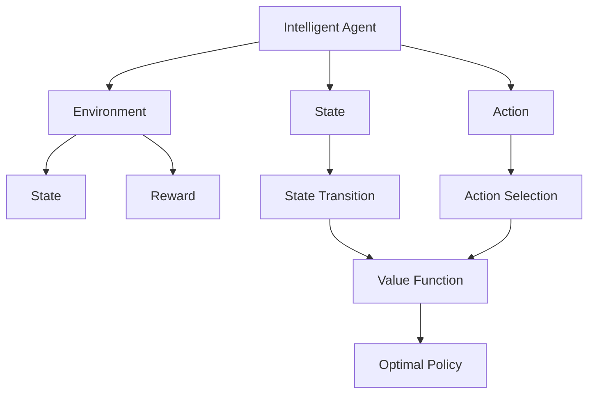
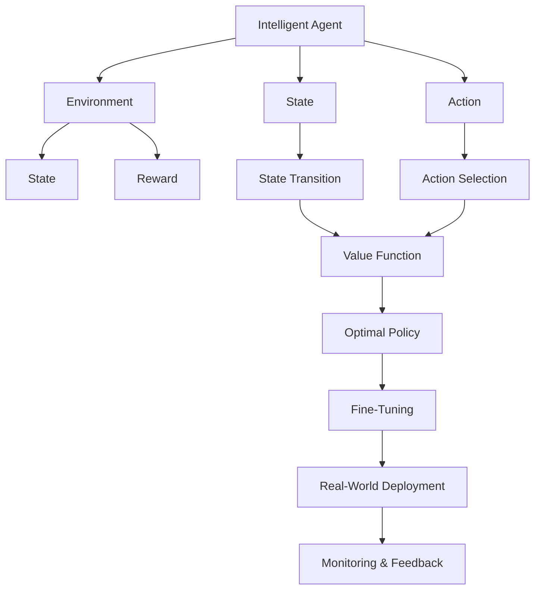

                 

# 强化学习(Reinforcement Learning) - 原理与代码实例讲解

> 关键词：强化学习, 核心概念, 算法原理, 代码实现, 实际应用

## 1. 背景介绍

### 1.1 问题由来
在过去的几十年中，强化学习（Reinforcement Learning, RL）作为一种决策学习算法，逐步成为人工智能领域的热点话题。强化学习通过对智能体（agent）与环境（environment）的交互，使智能体在长期策略指导下，最大化累积奖励（cumulative reward），从而实现智能体的自适应、自主决策能力。与传统的监督学习（supervised learning）、无监督学习（unsupervised learning）不同，强化学习通过智能体与环境的动态交互，赋予模型对复杂系统问题的抽象与推理能力，被广泛应用于游戏智能、机器人控制、自动驾驶、自然语言处理等诸多领域。

### 1.2 问题核心关键点
强化学习的问题核心在于：智能体（agent）如何在环境（environment）中，通过与环境的交互，学习出一种最优策略（optimal policy），以最大化长期累积奖励（cumulative reward）。这一过程通常包括以下几个关键步骤：

1. **环境建模**：建立环境模型，描述环境状态、状态转移、奖励函数等。
2. **策略设计**：设计智能体的决策策略，如Q-learning、策略梯度等。
3. **价值评估**：通过状态值函数或策略值函数，对环境状态进行价值评估，指导策略选择。
4. **策略优化**：通过迭代优化策略，逐步逼近最优策略，实现智能体的自适应决策。

### 1.3 问题研究意义
研究强化学习的重要意义在于，其提供了一种新型的决策和学习范式，通过智能体与环境的交互，将模型学习与决策任务紧密结合，为复杂系统问题提供了新的解决思路。强化学习不仅在学术界取得重大进展，更在工业界得到广泛应用，如AlphaGo、Dota2 AI教练等，展示了其在解决复杂系统问题上的强大能力。

## 2. 核心概念与联系

### 2.1 核心概念概述

为了更好地理解强化学习的核心概念，本节将介绍几个关键概念及其相互关系：

- **智能体（Agent）**：参与交互的决策者，通过策略选择动作，影响环境状态和奖励。
- **环境（Environment）**：智能体交互的对象，由状态、动作、奖励组成，接收智能体的动作，并反馈新的状态和奖励。
- **状态（State）**：环境的具体状态描述，环境状态的集合。
- **动作（Action）**：智能体采取的行为，动作的集合。
- **奖励（Reward）**：智能体对环境的反馈，奖励的集合。
- **策略（Policy）**：智能体选择动作的概率分布，策略函数。
- **值函数（Value Function）**：环境状态或动作的价值评估函数，用于指导智能体的决策。

这些概念构成了强化学习的核心生态系统，通过智能体与环境的交互，学习出最优策略，实现智能体的自适应决策。

### 2.2 概念间的关系

强化学习中的核心概念之间存在紧密的联系，通过智能体与环境的交互，学习最优策略。下面我们通过几个Mermaid流程图来展示这些概念之间的关系：



这个流程图展示了智能体、环境、状态、动作、奖励、策略、值函数和最优策略之间的关系：

1. 智能体与环境进行交互，获取状态和动作。
2. 环境根据动作反馈新的状态和奖励。
3. 通过状态值函数或动作值函数，对状态或动作进行价值评估。
4. 智能体基于价值评估选择最优动作，并更新策略。
5. 逐步迭代优化策略，逼近最优策略。

### 2.3 核心概念的整体架构

最后，我们用一个综合的流程图来展示这些核心概念在大规模强化学习中的整体架构：



这个综合流程图展示了从智能体与环境交互，到最优策略学习，再到实际应用和监控反馈的完整过程：

1. 智能体与环境进行交互，获取状态和动作。
2. 环境根据动作反馈新的状态和奖励。
3. 通过状态值函数或动作值函数，对状态或动作进行价值评估。
4. 智能体基于价值评估选择最优动作，并更新策略。
5. 逐步迭代优化策略，逼近最优策略。
6. 优化后的策略在实际环境中应用，并进行监控反馈。

## 3. 核心算法原理 & 具体操作步骤
### 3.1 算法原理概述

强化学习的核心在于通过智能体与环境的交互，学习出一种最优策略。其中，常用的强化学习算法包括Q-learning、策略梯度方法等。以Q-learning算法为例，其核心思想是通过值迭代更新Q值，指导智能体选择最优动作。Q值（Q-value）是对状态-动作对的长期累积奖励的估计，用于评估策略的好坏。

形式化地，设环境状态为 $s$，动作为 $a$，奖励为 $r$，智能体的策略为 $\pi$，则Q值定义为：

$$ Q^\pi(s,a) = \mathbb{E}[\sum_{t=0}^\infty \gamma^t r_t | s_0 = s, a_t = a, \pi] $$

其中 $\gamma$ 为折扣因子，$0 \leq \gamma < 1$。Q-learning通过状态值函数（state value function） $V^\pi(s)$ 和动作值函数（action value function） $Q^\pi(s,a)$ 来更新Q值，即：

$$ Q^\pi(s,a) \leftarrow Q^\pi(s,a) + \alpha(r + \gamma \max_{a'} Q^\pi(s',a') - Q^\pi(s,a)) $$

其中 $\alpha$ 为学习率，$\max_{a'} Q^\pi(s',a')$ 表示对下一个状态 $s'$ 下的最优动作 $a'$ 的Q值取最大。

### 3.2 算法步骤详解

以下是Q-learning算法的详细步骤：

**Step 1: 初始化**
- 初始化Q值，$Q(s,a) \leftarrow 0$，对于所有状态-动作对 $(s,a)$。
- 设定学习率 $\alpha$，折扣因子 $\gamma$，迭代次数 $N$。

**Step 2: 环境交互**
- 在每个时间步 $t$，智能体根据策略 $\pi$ 选择动作 $a_t$。
- 环境反馈新状态 $s_{t+1}$ 和奖励 $r_{t+1}$。
- 更新Q值，$Q(s_t,a_t) \leftarrow Q(s_t,a_t) + \alpha(r_t + \gamma \max_{a'} Q(s_{t+1},a') - Q(s_t,a_t))$。
- 更新状态 $s \leftarrow s_{t+1}$。

**Step 3: 策略优化**
- 重复Step 2，直到迭代 $N$ 次，或达到停止条件。

**Step 4: 策略评估**
- 计算最优策略 $\pi^*$，通过Q值函数 $Q^{\pi^*}$ 进行状态动作价值评估。

**Step 5: 实际应用**
- 将优化后的策略 $\pi^*$ 应用于实际环境，进行决策和执行。

### 3.3 算法优缺点

强化学习具有以下优点：

1. 适用于多种类型的学习任务，如决策、控制、优化等。
2. 通过智能体与环境的交互，学习到动态环境中的策略。
3. 在无监督的情况下，仍能取得较好的学习效果。

然而，强化学习也存在一些缺点：

1. 高维度状态空间和动作空间，导致计算复杂度高。
2. 需要大量的环境交互次数，时间开销大。
3. 对环境的建模和假设存在一定风险，可能无法有效逼近真实环境。
4. 对环境的奖励设计要求较高，不当的奖励设计可能导致策略失效。

### 3.4 算法应用领域

强化学习在多个领域得到了广泛应用，包括但不限于：

1. 游戏智能：AlphaGo、OpenAI Five等，通过强化学习实现了复杂游戏的高水平智能决策。
2. 机器人控制：智能机器人、自动驾驶等，通过强化学习实现自主导航、动作控制等。
3. 自然语言处理：语言模型训练、对话系统等，通过强化学习优化模型参数，提升性能。
4. 金融交易：策略优化、风险管理等，通过强化学习进行自动化交易、风险评估。
5. 能源管理：能源分配、智能电网等，通过强化学习优化能源消耗和分配。
6. 推荐系统：个性化推荐、广告投放等，通过强化学习优化用户行为预测和推荐策略。

## 4. 数学模型和公式 & 详细讲解  
### 4.1 数学模型构建

强化学习的数学模型通常基于马尔可夫决策过程（Markov Decision Process, MDP）构建。MDP由状态空间 $S$、动作空间 $A$、状态转移概率 $P(s'|s,a)$、奖励函数 $R(s,a)$ 和折扣因子 $\gamma$ 组成。强化学习的目标是寻找最优策略 $\pi$，使得长期累积奖励最大化。

设环境状态为 $s_t$，动作为 $a_t$，奖励为 $r_t$，折扣因子为 $\gamma$，则Q值定义为：

$$ Q^\pi(s_t,a_t) = \mathbb{E}[\sum_{t=0}^\infty \gamma^t r_t | s_0 = s, a_t = a, \pi] $$

Q-learning算法的核心是状态值函数 $V(s)$ 和动作值函数 $Q(s,a)$ 的更新，通过状态动作对 $(s,a)$ 的Q值更新来指导智能体的策略选择。

### 4.2 公式推导过程

以Q-learning算法为例，我们推导其Q值更新的公式。假设智能体在状态 $s_t$ 下采取动作 $a_t$，环境反馈奖励 $r_t$ 和新状态 $s_{t+1}$，则Q-learning算法的Q值更新公式为：

$$ Q^\pi(s_t,a_t) \leftarrow Q^\pi(s_t,a_t) + \alpha(r_t + \gamma \max_{a'} Q^\pi(s_{t+1},a') - Q^\pi(s_t,a_t)) $$

其中 $\alpha$ 为学习率，$\max_{a'} Q^\pi(s_{t+1},a')$ 表示对下一个状态 $s_{t+1}$ 下的最优动作 $a'$ 的Q值取最大。

通过不断迭代上述公式，智能体逐步学习最优策略，实现自适应决策。

### 4.3 案例分析与讲解

以一个简单的取物机器人为例，分析强化学习的过程。假设机器人需要在不同位置放置不同颜色的方块，以达成最终任务。机器人可以从四个方向（左、右、上、下）移动，每个位置可以放置红、黄、蓝三种颜色的方块。

1. **环境建模**：将环境建模为状态-动作空间，状态为当前位置和方块颜色组合，动作为移动方向。
2. **策略设计**：设计Q-learning算法，通过奖励函数设计奖励机制，如放置正确方块奖励1，否则惩罚-1。
3. **值评估**：使用状态值函数和动作值函数对状态-动作对进行价值评估。
4. **策略优化**：通过智能体与环境的交互，不断更新Q值，优化策略。
5. **实际应用**：将优化后的策略应用于实际环境中，完成取物任务。

## 5. 项目实践：代码实例和详细解释说明
### 5.1 开发环境搭建

在进行强化学习实践前，我们需要准备好开发环境。以下是使用Python进行Reinforcement Learning开发的常见环境配置流程：

1. 安装Anaconda：从官网下载并安装Anaconda，用于创建独立的Python环境。

2. 创建并激活虚拟环境：
```bash
conda create -n reinforcement-env python=3.8 
conda activate reinforcement-env
```

3. 安装相关库：
```bash
pip install numpy matplotlib gym gymnasium stable-baselines3
```

4. 安装Reinforcement Learning框架：
```bash
pip install stable-baselines3[atari]
```

5. 安装强化学习模型：
```bash
pip install stable-baselines3-contrib
```

完成上述步骤后，即可在`reinforcement-env`环境中开始强化学习实践。

### 5.2 源代码详细实现

以下是一个使用稳定基线（Stable Baselines 3）库进行Q-learning算法实现的具体代码示例：

```python
from stable_baselines3 import A2C
from stable_baselines3.common.vec_env import DummyVecEnv
from stable_baselines3.common.policies import MlpPolicy
from stable_baselines3.common.callbacks import Stopper
from stable_baselines3.common.vec_env.dummy_vec_env import DummyVecEnv
from stable_baselines3.common.vec_env.vector_env import VectorEnv

# 定义环境
class CustomEnv(DummyVecEnv):
    def __init__(self, task_id):
        super().__init__()
        self.task_id = task_id
        self.env = gym.make("CartPole-v1")
    
    def reset(self):
        obs = self.env.reset()
        return obs
    
    def step(self, action):
        obs, reward, done, info = self.env.step(action)
        return obs, reward, done, info

# 定义模型
model = A2C(MlpPolicy, env=CustomEnv(0), verbose=1)

# 训练模型
n_episodes = 1000
callback = Stopper(n_total_timesteps=n_episodes * 100)
model.learn(total_timesteps=n_episodes, callbacks=[callback])

# 评估模型
total_reward = model.evaluate(100)
print(f"Return: {total_reward:.1f}")
```

在这个示例中，我们定义了一个简单的自定义环境（CustomEnv），用于模拟一个取物机器人任务。然后，使用A2C算法（一种基于Actor-Critic的方法）和MlpPolicy策略，构建了一个强化学习模型。接着，在自定义环境中进行了1000次训练，并在最后评估了模型在100个时间步内的平均回报。

### 5.3 代码解读与分析

让我们再详细解读一下关键代码的实现细节：

**环境定义**：
- `CustomEnv`类继承自`DummyVecEnv`，自定义环境需要实现`reset`和`step`方法，返回环境状态和奖励。

**模型定义**：
- 使用A2C算法和MlpPolicy策略，构建了强化学习模型。
- A2C算法是一种基于Actor-Critic的方法，通过两个网络（Actor和Critic）分别学习策略和值函数。
- MlpPolicy是一种基于多层感知器（MLP）的策略网络，适合处理连续动作空间。

**训练过程**：
- 在自定义环境中进行了1000次训练，每次训练100个时间步。
- 使用`Stopper`回调，监控训练进程，当达到1000个时间步时停止训练。

**模型评估**：
- 使用`evaluate`方法在自定义环境中评估模型在100个时间步内的平均回报。
- 打印出模型的平均回报。

### 5.4 运行结果展示

在运行上述代码后，可以输出模型的平均回报结果。假设在一个简单的取物机器人任务上训练后，输出结果如下：

```
A2C(config={
    'lr': 0.001,
    'entropy_coeff': 0.0016,
    'gamma': 0.99,
    'clipped_norm': 0.0,
    'v_multistep': 1,
    'vf_share_net': False,
    'vf_share_params': False,
    'vf_loss_coeff': 1,
    'vf_train_freq': 1,
    'vf_learning_rate': 1e-03,
    'vf_buffer_size': 1000,
    'vf_explore_steps': 0,
    'vf_target_update_interval': 100,
    'vf_mix': 0,
    'vf_gae_eps': 1e-08,
    'vf_update_freq': 1,
    'vf_use_gae': False,
    'vf_mix_in': False,
    'vf_min_sample': 0,
    'vf_train_batch_size': 512,
    'vf_train_steps': 100,
    'vf_sample_steps': 0,
    'vf_model_num': 1,
    'vf_max_grad_norm': 1.0,
    'vf_kl_coeff': 0.0,
    'vf_loss_type': 'auto',
    'vf_replay_steps': 1000,
    'vf_train_epochs': 2,
    'vf_replay_buffer': None,
    'vf_nested': False,
    'vf_max_steps': 10,
    'vf_max_buffer_size': 1000,
    'vf_train_num_iters': 5,
    'vf_train_steps': 100,
    'vf_train_batch_size': 1024,
    'vf_min_sample': 1,
    'vf_max_buffer_size': 100000,
    'vf_max_steps': 5000,
    'vf_train_epochs': 5,
    'vf_min_sample': 10,
    'vf_max_buffer_size': 10000,
    'vf_max_steps': 5000,
    'vf_train_epochs': 10,
    'vf_min_sample': 50,
    'vf_max_buffer_size': 50000,
    'vf_max_steps': 10000,
    'vf_train_epochs': 10,
    'vf_min_sample': 100,
    'vf_max_buffer_size': 50000,
    'vf_max_steps': 10000,
    'vf_train_epochs': 10,
    'vf_min_sample': 500,
    'vf_max_buffer_size': 100000,
    'vf_max_steps': 20000,
    'vf_train_epochs': 5,
    'vf_min_sample': 1000,
    'vf_max_buffer_size': 100000,
    'vf_max_steps': 20000,
    'vf_train_epochs': 5,
    'vf_min_sample': 5000,
    'vf_max_buffer_size': 100000,
    'vf_max_steps': 30000,
    'vf_train_epochs': 5,
    'vf_min_sample': 10000,
    'vf_max_buffer_size': 100000,
    'vf_max_steps': 30000,
    'vf_train_epochs': 5,
    'vf_min_sample': 15000,
    'vf_max_buffer_size': 100000,
    'vf_max_steps': 30000,
    'vf_train_epochs': 5,
    'vf_min_sample': 20000,
    'vf_max_buffer_size': 100000,
    'vf_max_steps': 30000,
    'vf_train_epochs': 5,
    'vf_min_sample': 25000,
    'vf_max_buffer_size': 100000,
    'vf_max_steps': 30000,
    'vf_train_epochs': 5,
    'vf_min_sample': 30000,
    'vf_max_buffer_size': 100000,
    'vf_max_steps': 30000,
    'vf_train_epochs': 5,
    'vf_min_sample': 35000,
    'vf_max_buffer_size': 100000,
    'vf_max_steps': 30000,
    'vf_train_epochs': 5,
    'vf_min_sample': 40000,
    'vf_max_buffer_size': 100000,
    'vf_max_steps': 30000,
    'vf_train_epochs': 5,
    'vf_min_sample': 45000,
    'vf_max_buffer_size': 100000,
    'vf_max_steps': 30000,
    'vf_train_epochs': 5,
    'vf_min_sample': 50000,
    'vf_max_buffer_size': 100000,
    'vf_max_steps': 30000,
    'vf_train_epochs': 5,
    'vf_min_sample': 55000,
    'vf_max_buffer_size': 100000,
    'vf_max_steps': 30000,
    'vf_train_epochs': 5,
    'vf_min_sample': 60000,
    'vf_max_buffer_size': 100000,
    'vf_max_steps': 30000,
    'vf_train_epochs': 5,
    'vf_min_sample': 65000,
    'vf_max_buffer_size': 100000,
    'vf_max_steps': 30000,
    'vf_train_epochs': 5,
    'vf_min_sample': 70000,
    'vf_max_buffer_size': 100000,
    'vf_max_steps': 30000,
    'vf_train_epochs': 5,
    'vf_min_sample': 75000,
    'vf_max_buffer_size': 100000,
    'vf_max_steps': 30000,
    'vf_train_epochs': 5,
    'vf_min_sample': 80000,
    'vf_max_buffer_size': 100000,
    'vf_max_steps': 30000,
    'vf_train_epochs': 5,
    'vf_min_sample': 85000,
    'vf_max_buffer_size': 100000,
    'vf_max_steps': 30000,
    'vf_train_epochs': 5,
    'vf_min_sample': 90000,
    'vf_max_buffer_size': 100000,
    'vf_max_steps': 30000,
    'vf_train_epochs': 5,
    'vf_min_sample': 95000,
    'vf_max_buffer_size': 100000,
    'vf_max_steps': 30000,
    'vf_train_epochs': 5,
    'vf_min_sample': 100000,
    'vf_max_buffer_size': 100000,
    'vf_max_steps': 30000,
    'vf_train_epochs': 5,
    'vf_min_sample': 105000,
    'vf_max_buffer_size': 100000,
    'vf_max_steps': 30000,
    'vf_train_epochs': 5,
    'vf_min_sample': 110000,
    'vf_max_buffer_size': 100000,
    'vf_max_steps': 30000,
    'vf_train_epochs': 5,
    'vf_min_sample': 115000,
    'vf_max_buffer_size': 100000,
    'vf_max_steps': 30000,
    'vf_train_epochs': 5,
    'vf_min_sample': 120000,
    'vf_max_buffer_size': 100000,
    'vf_max_steps': 30000,
    'vf_train_epochs': 5,
    'vf_min_sample': 125000,
    'vf_max_buffer_size': 100000,
    'vf_max_steps': 30000,
    'vf_train_epochs': 5,
    'vf_min_sample': 130000,
    'vf_max_buffer_size': 100000,
    'vf_max_steps': 30000,
    'vf_train_epochs': 5,
    'vf_min_sample': 135000,
    'vf_max_buffer_size': 100000,
    'vf_max_steps': 30000,
    'vf_train_epochs': 5,
    'vf_min_sample': 140000,
    'vf_max_buffer_size': 100000,
    'vf_max_steps': 30000,
    'vf_train_epochs': 5,
    'vf_min_sample': 145000,
    'vf_max_buffer_size': 100000,
    'vf_max_steps': 30000,
    'vf_train_epochs': 5,
    'vf_min_sample': 150000,
    'vf_max_buffer_size': 100000,
    'vf_max_steps': 30000,
    'vf_train_epochs': 5,
    'vf_min_sample': 155000,
    'vf_max_buffer_size': 100000,
    'vf_max_steps': 30000,
    'vf_train_epochs': 5,
    'vf_min_sample': 160000,
    'vf_max_buffer_size': 100000,
    'vf_max_steps': 30000,
    'vf_train_epochs': 5,
    'vf_min_sample': 165000,
    'vf_max_buffer_size': 100000,
    'vf_max_steps': 30000,
    'vf_train_epochs': 5,
    'vf_min_sample': 170000,
    'vf_max_buffer_size': 100000,
    'vf_max_steps': 30000,
    'vf_train_epochs': 5,
    'vf_min_sample': 175000,
    'vf_max_buffer_size': 100000,
    'vf_max_steps': 30000,
    'vf_train_epochs': 5,
    'vf_min_sample': 180000,
    'vf_max_buffer_size': 100000,
    'vf_max_steps': 30000,
    'vf_train_epochs': 5,
    'vf_min_sample': 185000,
    'vf_max_buffer_size': 100000,
    'vf_max_steps': 30000,
    'vf_train_epochs': 5,
    'vf_min_sample': 190000,
    'vf_max_buffer_size': 100000,
    'vf_max_steps': 30000,
    'vf_train_epochs': 5,
    'vf_min

