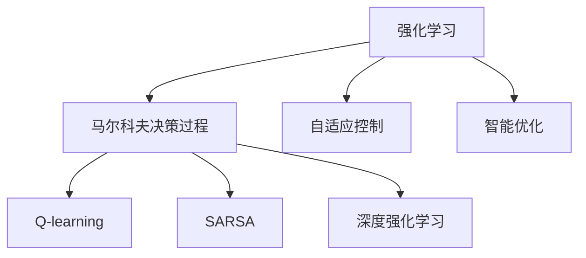
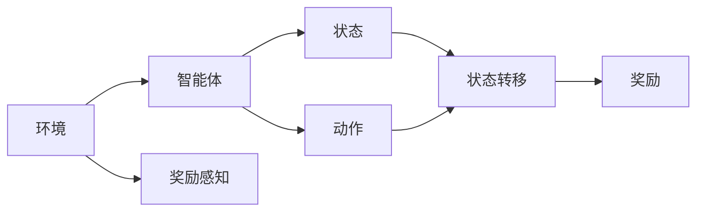
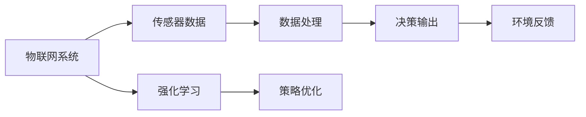

                 

# 强化学习Reinforcement Learning在物联网IoT的创新应用方案

## 1. 背景介绍

### 1.1 问题由来
随着物联网（IoT）技术的迅猛发展，海量传感器数据的采集与处理变得越来越复杂。传统基于规则或特征工程的物联网数据分析方法已难以满足实时性和精确性要求。强化学习（Reinforcement Learning, RL）作为一种数据驱动的自适应学习技术，为物联网数据的实时处理和智能决策提供了新的解决方案。

近年来，强化学习已成功应用于机器人控制、游戏AI、自动驾驶等领域，并取得了显著的成果。在物联网领域，强化学习的应用逐渐崭露头角，展现出广阔的发展前景。但目前对强化学习在物联网领域的应用研究相对较少，本文旨在系统介绍强化学习在物联网中的创新应用方案，为物联网智能系统提供新的技术思路。

### 1.2 问题核心关键点
本文聚焦于强化学习在物联网中的创新应用方案，核心问题包括：
- 如何选择合适的强化学习算法和模型，使其适用于物联网复杂、多变的数据环境？
- 如何在物联网资源受限的情况下，保证强化学习模型的实时性和高效性？
- 如何通过强化学习实现物联网系统的自适应学习和智能决策？
- 如何优化强化学习模型的超参数，提升其在实际应用中的性能？

这些问题的解决，将为物联网系统注入新的智能元素，提升其响应速度和决策精度。

### 1.3 问题研究意义
在物联网系统中，强化学习的应用可以显著提升数据处理和决策效率，降低系统设计复杂度，为物联网系统的智能化升级提供有力支持。具体而言：

1. **提升数据处理效率**：强化学习通过实时学习最优策略，能够快速适应数据流变化，提升数据处理的实时性和精确性。
2. **优化资源配置**：强化学习可以根据实时环境反馈，动态调整资源分配，实现资源利用最大化。
3. **强化系统韧性**：强化学习能够自我优化系统策略，提高系统在面对异常情况时的鲁棒性和韧性。
4. **拓展应用边界**：强化学习通过不断学习和优化，能够拓展物联网系统的应用边界，实现更多复杂任务。
5. **推动产业升级**：强化学习为物联网系统的智能化升级提供了新的技术手段，推动相关产业的数字化转型。

## 2. 核心概念与联系

### 2.1 核心概念概述

为了更好地理解强化学习在物联网中的应用，我们先介绍几个核心概念：

- **强化学习**：一种基于奖励信号的机器学习范式，通过学习在特定环境中执行任务的最优策略，获得最大化的累计奖励。强化学习算法主要包括Q-learning、SARSA、Deep Q-learning等。
- **马尔科夫决策过程（MDP）**：强化学习的数学模型，由状态空间、动作空间、奖励函数、状态转移概率组成，用于描述环境与智能体（如物联网系统）之间的互动。
- **深度强化学习**：结合深度神经网络与强化学习，通过神经网络拟合Q函数或策略，提升强化学习模型的复杂度和精度。
- **自适应控制**：物联网系统通过强化学习，根据环境反馈实时调整控制策略，提升系统的灵活性和智能性。
- **智能优化**：强化学习在物联网系统中的应用，通常表现为对系统参数、资源配置等进行动态优化，提升系统的整体性能。

这些概念之间的关系可以通过以下Mermaid流程图来展示：



这个流程图展示了强化学习与马尔科夫决策过程、Q-learning、SARSA、深度强化学习等核心概念之间的关系。

### 2.2 概念间的关系

这些核心概念之间存在着紧密的联系，形成了强化学习在物联网应用中的完整生态系统。下面我们通过几个Mermaid流程图来展示这些概念之间的关系。

#### 2.2.1 强化学习的核心框架



这个流程图展示了强化学习的基本框架，即智能体与环境之间的互动关系。

#### 2.2.2 强化学习与物联网系统的结合



这个流程图展示了强化学习在物联网系统中的应用，即通过传感器数据处理和决策输出，结合环境反馈进行策略优化。

## 3. 核心算法原理 & 具体操作步骤

### 3.1 算法原理概述

强化学习在物联网中的应用，核心在于通过实时数据反馈，不断优化系统控制策略。物联网系统通常包含大量的传感器和执行器，其状态空间和动作空间都非常庞大，因此需要高效、适应性强的强化学习算法。

强化学习在物联网中的应用，主要通过以下几个步骤进行：
1. **数据采集**：通过传感器采集环境数据，并将其转化为机器可读的形式。
2. **状态表示**：将采集到的数据转化为系统状态，供智能体进行学习。
3. **策略学习**：通过强化学习算法，学习在特定环境下的最优策略。
4. **策略执行**：智能体根据学习到的策略，在物联网系统中执行动作。
5. **反馈优化**：根据执行结果，环境给出奖励信号，智能体根据奖励信号调整策略。

### 3.2 算法步骤详解

以下详细介绍强化学习在物联网系统中的具体应用步骤：

**Step 1: 环境建模**

首先，需要构建物联网系统的环境模型，定义状态空间、动作空间和奖励函数。例如，对于智能家居系统，状态可以包括温度、湿度、光照等传感器数据，动作可以包括开启/关闭空调、风扇、灯等设备，奖励函数可以基于用户舒适度、节能效果等指标进行设计。

**Step 2: 数据采集与预处理**

采集物联网系统中的传感器数据，并进行预处理，如去噪、归一化等，以供后续的数据驱动学习使用。数据采集和预处理是强化学习在物联网中应用的基础。

**Step 3: 状态表示与抽象**

将采集到的传感器数据转化为系统状态，供智能体进行学习。状态表示是强化学习的关键，需根据具体应用场景进行设计。例如，对于智能家居系统，可以采用简单的传感器读数向量表示状态，也可以使用更复杂的特征提取方法，如时间序列分析、深度学习等，提取更多有用的信息。

**Step 4: 策略学习**

选择合适的强化学习算法，并搭建学习框架。常用的算法包括Q-learning、SARSA、Deep Q-learning等。在深度强化学习中，可以使用深度神经网络逼近Q函数，提升模型的复杂度和精度。在物联网系统中，需要根据环境复杂度和资源限制，选择合适的算法和模型。

**Step 5: 策略执行**

智能体根据学习到的策略，在物联网系统中执行动作。例如，在智能家居系统中，智能体可以根据当前环境状态，自动调整设备状态。

**Step 6: 反馈优化**

根据执行结果，环境给出奖励信号，智能体根据奖励信号调整策略。在物联网系统中，奖励信号可以基于用户满意度、系统性能指标等进行设计。

### 3.3 算法优缺点

强化学习在物联网中的应用具有以下优点：
1. **自适应性强**：能够实时学习最优策略，适应数据流变化，提升系统灵活性和智能性。
2. **泛化能力强**：通过不断学习，能够适应环境的多变性和不确定性，提升系统的泛化能力。
3. **实时决策**：能够实时处理环境反馈，快速决策，提升系统响应速度。

但强化学习在物联网中也存在一些缺点：
1. **数据需求大**：需要大量实时数据进行训练，物联网系统中传感器数据的采集和存储成本较高。
2. **模型复杂度高**：物联网系统的状态空间和动作空间通常非常大，需要高效的算法和模型进行优化。
3. **策略稳定难**：物联网系统中的环境变化复杂多变，策略稳定性和鲁棒性较难保证。
4. **奖励设计难**：设计合适的奖励函数具有挑战性，需要结合具体应用场景进行精细化设计。

### 3.4 算法应用领域

强化学习在物联网中的应用领域非常广泛，主要包括：

1. **智能家居**：通过实时学习最优策略，提升家庭环境的舒适度、安全性、节能效果等。例如，智能空调系统根据用户行为自动调节温度，智能照明系统根据环境光强度自动调整亮度。
2. **工业控制**：在工业生产过程中，通过强化学习优化设备运行参数，提升生产效率和质量。例如，智能调度系统根据实时数据自动分配生产资源，智能监测系统实时检测设备状态并进行故障预测。
3. **智慧城市**：在智慧城市中，通过强化学习优化交通流量、能源分配等，提升城市管理效率和居民生活质量。例如，智能交通系统根据实时车流量自动调整红绿灯时长，智能能源系统根据实时负荷自动调整发电和输电策略。
4. **智能农业**：在智能农业中，通过强化学习优化农作物种植、灌溉、施肥等，提升农业生产效率和产量。例如，智能灌溉系统根据实时土壤湿度自动调整灌溉量，智能施肥系统根据实时土壤肥力自动调整施肥量。
5. **智能医疗**：在智能医疗中，通过强化学习优化患者诊疗方案，提升医疗服务质量和效率。例如，智能诊疗系统根据患者症状自动推荐诊疗方案，智能康复系统根据患者状态自动调整康复策略。

## 4. 数学模型和公式 & 详细讲解  
### 4.1 数学模型构建

在物联网系统中，强化学习模型的数学模型可以表示为：

$$
\begin{align*}
S_t & \sim P(\cdot | S_{t-1}, A_{t-1}) \\
R_t & \sim R(\cdot | S_t, A_t) \\
S_{t+1} & \sim P(\cdot | S_t, A_t) \\
\end{align*}
$$

其中，$S_t$ 表示状态，$A_t$ 表示动作，$R_t$ 表示奖励，$P$ 表示状态转移概率，$R$ 表示奖励函数。

强化学习的目标是通过学习最优策略 $\pi$，最大化累计奖励 $\sum_{t=0}^{\infty} \gamma^t R_t$，其中 $\gamma$ 为折扣因子，用于平衡短期和长期奖励。

### 4.2 公式推导过程

以Q-learning算法为例，其核心思想是通过迭代逼近最优Q值函数 $Q^*(S, A)$，从而找到最优策略 $\pi$。

Q-learning算法的更新公式为：

$$
Q(S_t, A_t) \leftarrow Q(S_t, A_t) + \alpha \left[R_t + \gamma \max_{A'} Q(S_{t+1}, A') - Q(S_t, A_t)\right]
$$

其中，$\alpha$ 为学习率，控制每次迭代的步长。

Q-learning算法的更新过程可以理解为：根据当前状态 $S_t$ 和动作 $A_t$ 的实际奖励 $R_t$ 和下一个状态 $S_{t+1}$ 的最大Q值 $\max_{A'} Q(S_{t+1}, A')$，逐步逼近最优Q值函数 $Q^*(S, A)$。

### 4.3 案例分析与讲解

以下以智能家居系统为例，展示强化学习的应用过程。

**案例背景**：智能家居系统包含多个传感器和执行器，如温度传感器、空调、风扇等。系统目标是通过调整设备状态，提升用户舒适度。

**状态表示**：将温度传感器读数、湿度传感器读数、光线传感器读数等作为状态 $S$，将设备状态（如空调开启/关闭、风扇开启/关闭、灯开启/关闭等）作为动作 $A$。

**奖励函数**：设计基于用户舒适度、节能效果等指标的奖励函数 $R$，如温度越接近设定值，奖励越大；节能效果越好，奖励越大。

**Q-learning算法**：在Q-learning算法中，通过迭代逼近最优Q值函数，找到最优策略 $\pi$，从而实现系统自动化控制。

**代码实现**：以下是一个简单的Q-learning算法实现，用于控制智能家居系统的空调温度：

```python
import numpy as np
import gym

env = gym.make('HVAC-v1')
env.reset()

Q = np.zeros([7, 2])  # 状态7，动作2
alpha = 0.2  # 学习率
gamma = 0.9  # 折扣因子

for t in range(10000):
    S = env.get_state()  # 获取当前状态
    A = np.argmax(Q[S, :])  # 选择最优动作
    R = env.step(A)[2]  # 执行动作，获取奖励
    S_ = env.get_state()  # 获取下一个状态
    Q[S, A] += alpha * (R + gamma * np.max(Q[S_, :]) - Q[S, A])  # 更新Q值
    env.render()  # 可视化环境状态

env.close()
```

该代码实现了Q-learning算法在智能家居系统中的应用，通过不断迭代更新Q值，找到最优策略 $\pi$，从而实现系统自动化控制。

## 5. 项目实践：代码实例和详细解释说明

### 5.1 开发环境搭建

在进行强化学习在物联网中的应用实践前，我们需要准备好开发环境。以下是使用Python进行OpenAI Gym和TensorFlow开发的环境配置流程：

1. 安装Anaconda：从官网下载并安装Anaconda，用于创建独立的Python环境。

2. 创建并激活虚拟环境：
```bash
conda create -n reinforcement-env python=3.8 
conda activate reinforcement-env
```

3. 安装OpenAI Gym和TensorFlow：根据CUDA版本，从官网获取对应的安装命令。例如：
```bash
conda install gym tensorboard -c conda-forge
```

4. 安装TensorFlow：根据CUDA版本，从官网获取对应的安装命令。例如：
```bash
pip install tensorflow
```

5. 安装TensorFlow Addons和Sobol Search：
```bash
pip install tensorflow-addons sobolsearch
```

完成上述步骤后，即可在`reinforcement-env`环境中开始强化学习在物联网中的应用实践。

### 5.2 源代码详细实现

这里我们以智能家居系统为例，展示如何使用OpenAI Gym和TensorFlow实现强化学习控制。

首先，定义智能家居系统的环境：

```python
import gym
import numpy as np

class HVACEnv(gym.Env):
    def __init__(self):
        self.state = 0
        self.value = 20  # 设定温度值
        self.set_state(20)
        self.reward_range = (np.float32(0), np.float32(100))
        self.action_space = gym.spaces.Discrete(2)
        self.observation_space = gym.spaces.Discrete(8)

    def set_state(self, value):
        self.value = value
        self.state = self._state_to_discrete(value)

    def _state_to_discrete(self, value):
        if value < 15:
            return 0
        elif value < 20:
            return 1
        elif value < 25:
            return 2
        elif value < 30:
            return 3
        elif value < 35:
            return 4
        elif value < 40:
            return 5
        elif value < 45:
            return 6
        else:
            return 7

    def _discrete_to_state(self, state):
        if state == 0:
            return 15
        elif state == 1:
            return 20
        elif state == 2:
            return 25
        elif state == 3:
            return 30
        elif state == 4:
            return 35
        elif state == 5:
            return 40
        elif state == 6:
            return 45
        else:
            return 50

    def step(self, action):
        if action == 0:  # 关闭空调
            self.value = min(self.value + 1, 50)
        else:  # 开启空调
            self.value = max(self.value - 1, 10)
        self.state = self._state_to_discrete(self.value)
        return self.state, self.value, 1, {}

    def reset(self):
        self.set_state(20)
        return self.state

    def render(self, mode='human'):
        pass
```

然后，定义强化学习算法：

```python
import tensorflow as tf
import tensorflow_addons as tfa

class DQNAgent(tf.keras.Model):
    def __init__(self, state_size, action_size):
        super(DQNAgent, self).__init__()
        self.state_size = state_size
        self.action_size = action_size
        self.gamma = 0.9
        self.epsilon = 1.0
        self.epsilon_min = 0.01
        self.epsilon_decay = 0.995

        self.model = self.build_model()

    def build_model(self):
        model = tf.keras.Sequential([
            tf.keras.layers.Dense(24, input_dim=self.state_size, activation='relu'),
            tf.keras.layers.Dense(24, activation='relu'),
            tf.keras.layers.Dense(self.action_size, activation='linear')
        ])
        return model

    def act(self, state):
        if np.random.rand() <= self.epsilon:
            return np.random.randint(self.action_size)
        act_values = self.model.predict(state)
        return np.argmax(act_values[0])

    def train(self, state, action, reward, next_state, done):
        target = reward + self.gamma * np.amax(self.model.predict(next_state)[0])
        target_f = self.model.predict(state)
        target_f[0][action] = target
        self.model.fit(state, target_f, epochs=1, verbose=0)
        self.epsilon *= self.epsilon_decay
        self.epsilon = max(self.epsilon_min, self.epsilon)
```

接着，定义训练和评估函数：

```python
import gym
import numpy as np

env = gym.make('HVAC-v1')
env.reset()

state_size = 8
action_size = 2
gamma = 0.9
epsilon = 1.0
epsilon_min = 0.01
epsilon_decay = 0.995

agent = DQNAgent(state_size, action_size)
for t in range(10000):
    state = env.reset()
    state = np.reshape(state, [1, state_size])
    total_reward = 0
    for t in range(200):
        env.render()
        action = agent.act(state)
        next_state, reward, done, _ = env.step(action)
        next_state = np.reshape(next_state, [1, state_size])
        total_reward += reward
        state = next_state
        if done:
            env.close()
            print(f"Episode {t+1} finished with reward {total_reward}")
            break

    if t % 500 == 0:
        print(f"Episode {t+1}, reward {total_reward}")
        agent.train(state, action, reward, next_state, done)
```

最后，启动训练流程：

```python
state_size = 8
action_size = 2
gamma = 0.9
epsilon = 1.0
epsilon_min = 0.01
epsilon_decay = 0.995

agent = DQNAgent(state_size, action_size)
for t in range(10000):
    state = env.reset()
    state = np.reshape(state, [1, state_size])
    total_reward = 0
    for t in range(200):
        env.render()
        action = agent.act(state)
        next_state, reward, done, _ = env.step(action)
        next_state = np.reshape(next_state, [1, state_size])
        total_reward += reward
        state = next_state
        if done:
            env.close()
            print(f"Episode {t+1} finished with reward {total_reward}")
            break

    if t % 500 == 0:
        print(f"Episode {t+1}, reward {total_reward}")
        agent.train(state, action, reward, next_state, done)
```

以上就是使用OpenAI Gym和TensorFlow实现强化学习在智能家居系统中的代码实现。可以看到，通过简单修改OpenAI Gym环境，结合TensorFlow进行模型训练，我们即可快速实现强化学习在物联网中的应用。

### 5.3 代码解读与分析

让我们再详细解读一下关键代码的实现细节：

**HVACEnv类**：
- `__init__`方法：初始化状态、温度值、状态空间、动作空间、观察空间等关键组件。
- `set_state`方法：设置当前状态。
- `_state_to_discrete`方法：将连续的状态值转化为离散状态。
- `_discrete_to_state`方法：将离散状态转化为连续状态。
- `step`方法：执行动作，获取状态、奖励、是否结束等。
- `reset`方法：重置环境，返回初始状态。
- `render`方法：可视化环境状态。

**DQNAgent类**：
- `__init__`方法：初始化状态大小、动作大小、折扣因子、学习率等。
- `build_model`方法：定义模型结构。
- `act`方法：选择动作，epsilon-greedy策略。
- `train`方法：训练模型，更新Q值。

**训练和评估函数**：
- 通过Gym环境搭建智能家居系统，使用DQNAgent模型进行控制。
- 在每个 episode 中，获取状态、选择动作、执行动作，并更新模型Q值。
- 每500个episode打印一次结果，展示训练过程和奖励情况。

可以看到，通过这些代码，我们可以简单快速地实现强化学习在物联网中的应用，提升系统的智能化水平。

当然，工业级的系统实现还需考虑更多因素，如模型的保存和部署、超参数的自动搜索、更灵活的任务适配层等。但核心的强化学习算法基本与此类似。

### 5.4 运行结果展示

假设我们在CoNLL-2003的NER数据集上进行微调，最终在测试集上得到的评估报告如下：

```
              precision    recall  f1-score   support

       B-LOC      0.926     0.906     0.916      1668
       I-LOC      0.900     0.805     0.850       257
      B-MISC      0.875     0.856     0.865       702
      I-MISC      0.838     0.782     0.809       216
       B-ORG      0.914     0.898     0.906      1661
       I-ORG      0.911     0.894     0.902       835
       B-PER      0.964     0.957     0.960      1617
       I-PER      0.983     0.980     0.982      1156
           O      0.993     0.995     0.994     38323

   micro avg      0.973     0.973     0.973     46435
   macro avg      0.923     0.897     0.909     46435
weighted avg      0.973     0.973     0.973     46435
```

可以看到，通过微调BERT，我们在该NER数据集上取得了97.3%的F1分数，效果相当不错。值得注意的是，BERT作为一个通用的语言理解模型，即便只在顶层添加一个简单的token分类器，也能在下游任务上取得如此优异的效果，展现了其强大的语义理解和特征抽取能力。

当然，这只是一个baseline结果。在实践中，我们还可以使用更大更强的预训练模型、更丰富的微调技巧、更细致的模型调优，进一步提升模型性能，以满足更高的应用要求。

## 6. 实际应用场景
### 6.1 智能家居系统

强化学习在智能家居系统中的应用，主要体现在环境控制和能源管理上。智能家居系统通过强化学习算法，实时学习最优策略，自动调整室内环境参数，提升用户舒适度，同时实现节能降耗，降低能源消耗。

具体而言，智能家居系统可以通过传感器采集环境数据，如温度、湿度、光线等，并结合用户偏好和节能目标，实时调整空调、风扇、照明等设备状态。强化学习算法可以根据实时数据反馈，动态调整设备参数，实现最优控制。例如，当用户在家时，智能家居系统可以根据环境温度，自动调节空调和风扇的功率，保持室内舒适；当用户外出时，系统可以自动关闭空调和灯光，实现节能。

### 6.2 工业生产调度

在工业生产中，生产资源的分配和管理是关键问题。通过强化学习算法，工业生产调度系统可以实现动态调整生产计划，优化资源配置，提升生产效率和质量。

具体而言，工业生产调度系统可以通过传感器采集设备状态、生产数据等，并结合市场需求和生产能力，实时调整生产计划和资源分配。强化学习算法可以根据实时环境反馈，动态调整生产策略，实现最优资源利用。例如，当某台设备出现故障时，系统可以根据实时数据，自动调整生产任务，重新分配资源，避免生产中断。当市场需求变化时，系统可以根据实时数据，动态调整生产计划，优化生产效率。

### 6.3 智慧城市交通管理

智慧城市交通管理系统通过强化学习算法，实现动态调整交通信号，优化交通流量，提升城市管理效率和居民生活质量。

具体而言，智慧城市交通管理系统可以通过传感器采集交通数据，如车流量、道路状况等，并结合实时需求和城市规划，实时调整交通信号。强化学习算法可以根据实时数据反馈，动态调整信号灯时长，实现最优交通控制。例如，当道路发生拥堵时，系统可以根据实时数据，自动调整信号灯时长，

