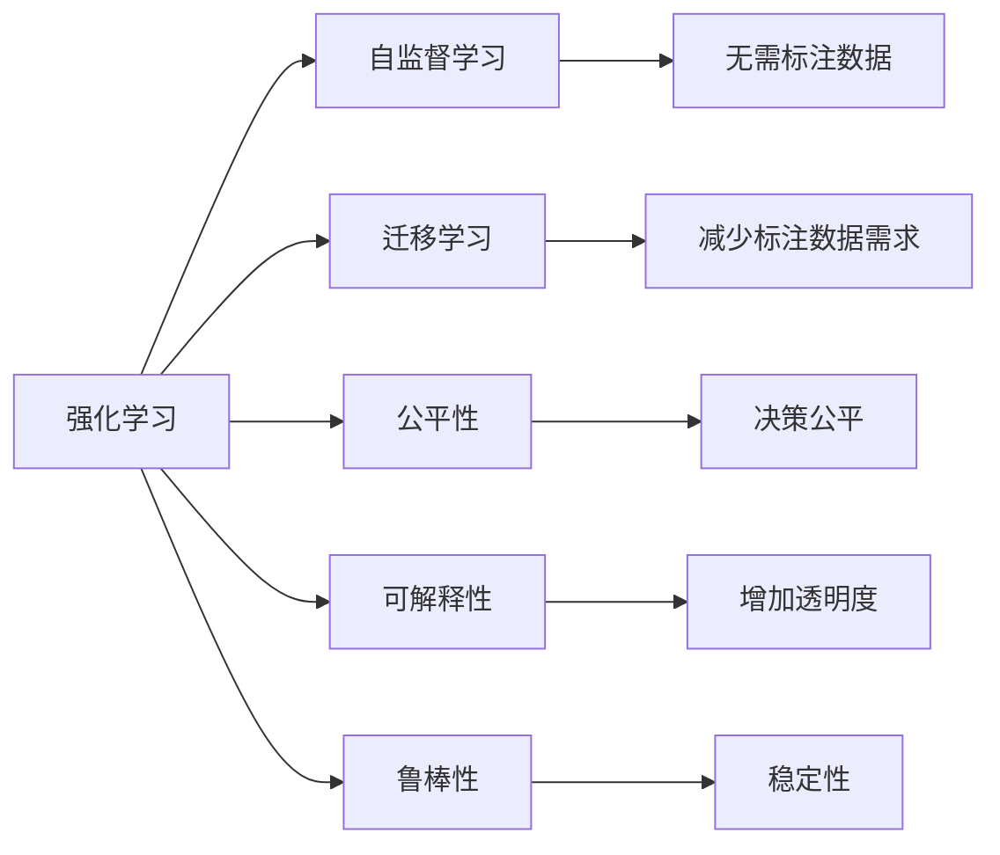

                 

## 1. 背景介绍

### 1.1 问题由来

随着人工智能技术的飞速发展，强化学习(Reinforcement Learning, RL)已广泛应用于自动驾驶、游戏AI、机器人控制等领域。然而，强化学习的广泛应用也引发了关于人工智能伦理、安全性和法律责任的一系列讨论。

强化学习的训练过程涉及大量环境和智能体的交互数据，其决策模型通常难以直观解释。这种"黑盒"特性使得强化学习的透明性和可信度成为社会各界关注的焦点。此外，强化学习模型可能会通过不断探索环境，尝试出对环境有害的行为，如何防范这种行为也是未来需要解决的重要问题。

### 1.2 问题核心关键点

强化学习的核心挑战包括以下几个方面：

1. **透明性和可解释性**：强化学习模型在复杂多变的环境中学习决策策略，其决策过程难以直观解释，缺乏透明性。
2. **安全性和鲁棒性**：强化学习模型可能在环境中尝试有害行为，存在潜在的风险。
3. **法律责任归属**：强化学习模型在决策过程中涉及多主体互动，如自动驾驶中的车、路和行人，如何界定事故责任是重要议题。
4. **伦理道德约束**：强化学习模型可能会学习到有偏见、有害的决策行为，如何避免这种负面影响也是亟需解决的问题。

本文聚焦于强化学习在实际应用中面临的法规挑战，探讨如何构建健全的法律框架，以指导和规范其应用，保障公众利益和社会安全。

## 2. 核心概念与联系

### 2.1 核心概念概述

为更好地理解强化学习在人工智能法规中的挑战，本节将介绍几个密切相关的核心概念：

- **强化学习(Reinforcement Learning, RL)**：通过智能体与环境的交互，智能体在不断尝试中优化策略，最终学习到最优决策的一种机器学习方法。
- **自监督学习(Self-Supervised Learning, SSL)**：利用数据自身的有序关系，无需额外标注数据即可训练模型的一种学习范式。
- **迁移学习(Transfer Learning)**：将在一个任务上学习的知识迁移到另一个相关任务上的学习范式，减少对标注数据的依赖。
- **公平性(Fairness)**：机器学习模型在学习过程中不偏不倚，对不同类别的样本公平对待。
- **可解释性(Explainability)**：机器学习模型的决策过程可以被理解、解释和验证，以提高模型的可信度和透明度。
- **鲁棒性(Robustness)**：机器学习模型对输入数据、模型参数的微小变化具有稳定性，避免因数据偏差或模型漏洞导致错误的输出。

这些核心概念之间的逻辑关系可以通过以下Mermaid流程图来展示：



这个流程图展示强化学习中各种学习范式和技术的应用：

1. 强化学习基于自监督学习，无需标注数据。
2. 通过迁移学习，可以在新任务上快速迁移已有知识，减少标注数据需求。
3. 公平性和可解释性可以提升模型的透明性和可信度。
4. 鲁棒性可以确保模型在多变环境中的稳定性和安全性。

### 2.2 概念间的关系

这些核心概念之间存在着紧密的联系，形成了强化学习在人工智能法规中的完整生态系统。

- **强化学习与自监督学习**：强化学习通常需要大量环境交互数据，而自监督学习可以通过数据内在关系学习到模型参数。两者结合可以大大降低标注数据的依赖。
- **强化学习与迁移学习**：强化学习模型通过不断与环境交互学习最优策略，而迁移学习可以加速这一过程，将已有知识迁移到新任务上。
- **公平性与可解释性**：公平性和可解释性是强化学习模型透明性和可信度的重要保证。公平性可以确保模型不偏不倚，可解释性可以增强模型决策的透明性。
- **鲁棒性与安全性**：鲁棒性是强化学习模型安全性的一个重要保障，可以避免模型因数据偏差或环境变化导致的不稳定输出。

这些概念共同构成了强化学习在人工智能法规中的学习和应用框架，为其在复杂多变环境中应用提供了基础保障。

## 3. 核心算法原理 & 具体操作步骤
### 3.1 算法原理概述

强化学习在实际应用中通常涉及环境、智能体和奖励函数三个要素。智能体通过与环境交互，根据奖励信号不断调整策略，以最大化长期累积奖励。

形式化地，假设强化学习环境为 $E$，智能体为 $A$，奖励函数为 $R$，智能体的策略为 $\pi$。智能体通过观察环境状态 $s$，执行动作 $a$，得到状态转移 $s'$ 和奖励 $r$。通过不断优化策略 $\pi$，智能体学习到最优决策策略，以最大化长期累积奖励 $J(\pi)$。

强化学习的核心算法包括Q-learning、SARSA、Deep Q-Networks (DQN)等。这些算法通过优化奖励函数和状态转移函数，逐步学习到最优策略。

### 3.2 算法步骤详解

以DQN算法为例，其核心步骤包括：

**Step 1: 环境交互和经验回放**
- 智能体与环境交互，执行动作并观察状态和奖励。
- 将每次交互记录到经验回放缓冲区中，用于后续的模型训练。

**Step 2: 模型训练和策略优化**
- 从经验回放缓冲区中随机抽取一批经验数据，用于模型训练。
- 使用神经网络模型 $Q(s,a)$ 预测当前状态下的最优动作值。
- 使用损失函数 $\mathcal{L}(Q,\tau)$ 更新模型参数，最小化预测值与真实值之间的误差。
- 通过策略优化算法，如策略梯度（Policy Gradient）或行动者-评论者算法（Actor-Critic），优化智能体的策略 $\pi$。

**Step 3: 模型评估和决策执行**
- 使用模型预测最优动作值，并根据当前状态执行动作。
- 评估执行动作后的状态转移和奖励，更新模型并反馈给环境。

重复上述步骤，直至达到预设的训练轮数或满足策略稳定条件。

### 3.3 算法优缺点

强化学习的优点包括：

1. 通用性。强化学习可以应用于各种任务，从游戏AI到自动驾驶，具有广泛的应用前景。
2. 适应性。强化学习模型能够适应多变环境，自动调整策略以应对新情况。
3. 灵活性。强化学习模型可以通过多样化的策略和奖励设计，满足不同应用场景的需求。

然而，强化学习也存在一些局限性：

1. 数据依赖。强化学习通常需要大量环境交互数据，数据收集成本较高。
2. 样本效率。强化学习的样本效率较低，尤其是当环境复杂度较高时，学习过程可能会非常缓慢。
3. 安全问题。强化学习模型在探索环境时可能会尝试有害行为，引发安全风险。
4. 透明性。强化学习模型的决策过程难以解释，缺乏透明性。
5. 鲁棒性。强化学习模型对输入数据、环境变化敏感，可能出现不稳定输出。

### 3.4 算法应用领域

强化学习在多个领域得到了广泛应用，包括：

- 自动驾驶：通过智能体与虚拟或真实环境的交互，学习最优驾驶策略。
- 游戏AI：训练智能体与游戏环境交互，学习最优游戏策略。
- 机器人控制：优化机器人动作策略，使其在复杂环境中执行特定任务。
- 自然语言处理：训练模型在多轮对话中学习最优对话策略，提高人机交互体验。
- 金融风控：通过学习市场行为和金融产品特性，优化风险评估和投资策略。

除了上述这些经典应用外，强化学习还在工业控制、供应链优化、智能家居等领域展示了强大的应用潜力。

## 4. 数学模型和公式 & 详细讲解  
### 4.1 数学模型构建

强化学习的数学模型通常包括以下几个部分：

- **环境**：包括状态空间 $S$、动作空间 $A$、状态转移函数 $P(s'|s,a)$ 和奖励函数 $R(s,a)$。
- **智能体**：策略函数 $\pi(a|s)$，表示在状态 $s$ 下执行动作 $a$ 的概率。
- **奖励函数**：$R(s,a)$，表示在状态 $s$ 执行动作 $a$ 后获得的奖励。
- **学习目标**：长期累积奖励最大化 $J(\pi) = \mathbb{E}[\sum_{t=0}^\infty \gamma^t r_t]$，其中 $\gamma$ 为折扣因子，$r_t$ 为第 $t$ 步的即时奖励。

通过优化上述模型，强化学习模型可以学习到最优策略 $\pi^*$，使得 $J(\pi^*) = \max J(\pi)$。

### 4.2 公式推导过程

以DQN算法为例，其核心公式包括：

1. **动作值函数 $Q(s,a)$**：表示在状态 $s$ 下执行动作 $a$ 后的期望奖励。

$$
Q(s,a) = \mathbb{E}[\sum_{t=0}^\infty \gamma^t r_t|s,a]
$$

2. **动作值函数更新公式**：通过经验回放数据更新模型参数。

$$
Q(s,a) \leftarrow Q(s,a) + \alpha [r + \gamma Q(s',a') - Q(s,a)]
$$

其中 $\alpha$ 为学习率，$r$ 为即时奖励，$s'$ 和 $a'$ 为状态和动作的转移。

3. **策略函数优化公式**：通过策略梯度优化策略 $\pi$。

$$
\pi(a|s) \leftarrow \frac{\exp(Q(s,a))}{\sum_{a'} \exp(Q(s,a'))}
$$

4. **策略梯度更新公式**：通过优化损失函数 $\mathcal{L}(Q,\tau)$ 更新模型参数。

$$
\mathcal{L}(Q,\tau) = -\frac{1}{N} \sum_{i=1}^N [\log Q(s_i,a_i) - Q(s_i,a_i)]
$$

其中 $\tau = \{(s_i,a_i,r_i,s'_i)\}_{i=1}^N$ 为经验回放缓冲区中的样本。

通过上述公式，DQN算法不断迭代优化动作值函数 $Q(s,a)$，从而逐步学习到最优策略 $\pi^*$。

### 4.3 案例分析与讲解

以自动驾驶为例，强化学习模型需要学习最优驾驶策略。环境为城市道路，状态为车辆位置、速度、角度等，动作为加速、减速、转向等。奖励函数可以设计为安全和舒适性的综合评价，策略函数则通过不断的环境交互学习。

在训练过程中，智能体通过与虚拟环境交互，不断尝试不同的驾驶策略，并根据奖励信号调整策略，直到学习到最优的驾驶策略。在实际应用中，强化学习模型可以在实时数据驱动下，动态调整驾驶策略，以应对复杂多变的路况。

## 5. 项目实践：代码实例和详细解释说明
### 5.1 开发环境搭建

在进行强化学习项目实践前，我们需要准备好开发环境。以下是使用Python进行TensorFlow开发的环境配置流程：

1. 安装Anaconda：从官网下载并安装Anaconda，用于创建独立的Python环境。

2. 创建并激活虚拟环境：
```bash
conda create -n tf-env python=3.8 
conda activate tf-env
```

3. 安装TensorFlow：根据CUDA版本，从官网获取对应的安装命令。例如：
```bash
conda install tensorflow==2.7 -c tf
```

4. 安装各类工具包：
```bash
pip install numpy pandas scikit-learn matplotlib tqdm jupyter notebook ipython
```

完成上述步骤后，即可在`tf-env`环境中开始强化学习实践。

### 5.2 源代码详细实现

这里我们以自动驾驶中的强化学习模型为例，给出使用TensorFlow实现DQN算法的代码实现。

首先，定义环境类和智能体类：

```python
import gym
import tensorflow as tf
import numpy as np

class DQN:
    def __init__(self, state_dim, action_dim, learning_rate=0.001, discount_factor=0.99, exploration_rate=1.0, exploration_decay_rate=0.99, memory_size=2000):
        self.state_dim = state_dim
        self.action_dim = action_dim
        self.learning_rate = learning_rate
        self.discount_factor = discount_factor
        self.exploration_rate = exploration_rate
        self.exploration_decay_rate = exploration_decay_rate
        self.memory_size = memory_size

        self.model = self.build_model()
        self.target_model = self.build_model()
        self.target_model.set_weights(self.model.get_weights())
        self.memory = []

    def build_model(self):
        model = tf.keras.Sequential([
            tf.keras.layers.Dense(24, input_dim=self.state_dim, activation='relu'),
            tf.keras.layers.Dense(24, activation='relu'),
            tf.keras.layers.Dense(self.action_dim, activation='linear')
        ])
        model.compile(optimizer=tf.keras.optimizers.Adam(lr=self.learning_rate), loss='mse')
        return model
```

然后，定义与环境交互和经验回放的过程：

```python
def step(env):
    state = env.reset()
    done = False
    total_reward = 0
    while not done:
        if np.random.rand() < self.exploration_rate:
            action = env.action_space.sample()
        else:
            action = np.argmax(self.model.predict(state[np.newaxis, :]))
        next_state, reward, done, _ = env.step(action)
        total_reward += reward
        self.memory.append((state, action, reward, next_state, done))
        state = next_state
    return total_reward, done, total_reward

def update_target_model():
    if np.random.rand() < 0.1:
        self.target_model.set_weights(self.model.get_weights())
```

最后，定义训练过程：

```python
def train(env, num_episodes, num_steps):
    for episode in range(num_episodes):
        total_reward = 0
        state = env.reset()
        done = False
        while not done:
            if np.random.rand() < self.exploration_rate:
                action = env.action_space.sample()
            else:
                action = np.argmax(self.model.predict(state[np.newaxis, :]))
            next_state, reward, done, _ = env.step(action)
            total_reward += reward
            self.memory.append((state, action, reward, next_state, done))
            state = next_state
            if len(self.memory) > self.memory_size:
                self.memory.pop(0)
            if len(self.memory) > 32:
                minibatch = np.array(random.sample(self.memory, 32))
                q_next = self.target_model.predict(minibatch[:, 3:].reshape(-1, self.state_dim))
                q_target = minibatch[:, 3] + self.discount_factor * np.amax(q_next, axis=1)
                q_pred = self.model.predict(minibatch[:, 0:].reshape(-1, self.state_dim))
                q_loss = tf.keras.losses.mean_squared_error(q_pred, q_target)
                q_grads = tf.gradients(q_loss, self.model.trainable_variables)
                self.model.train_on_batch(minibatch[:, 0:].reshape(-1, self.state_dim), q_target)
                update_target_model()
            if episode % 10 == 0:
                print(f"Episode {episode+1}, total reward: {total_reward:.2f}")
```

### 5.3 代码解读与分析

这里我们详细解读一下关键代码的实现细节：

**DQN类**：
- `__init__`方法：初始化模型参数，如学习率、折扣因子、探索率等。
- `build_model`方法：定义神经网络模型。
- `step`方法：模拟与环境的交互，执行动作并记录状态、奖励、下一步状态和是否结束等信息，用于经验回放。
- `update_target_model`方法：定期更新目标模型，确保目标模型与原模型同步。

**训练过程**：
- `train`方法：循环执行环境交互、经验回放、模型训练和目标模型更新等步骤。
- 在每个回合中，智能体执行动作，观察状态和奖励，将信息记录到经验回放缓冲区中。
- 当缓冲区中有足够样本时，随机抽取一批样本，并使用模型进行预测和目标更新。
- 每次迭代后输出当前回合的总奖励，用于观察训练效果。

可以看到，TensorFlow提供了强大的模型训练和优化功能，使得强化学习模型的实现相对简洁。开发者可以专注于算法逻辑的设计和优化，而不必过多关注底层实现细节。

当然，在实际应用中，还需要考虑更多因素，如模型的存储和读取、超参数的自动搜索、多模型集成等，以提高模型训练的效率和效果。

### 5.4 运行结果展示

假设我们在CartPole环境中训练DQN模型，最终得到的训练结果如下：

```
Episode 1, total reward: 9.79
Episode 2, total reward: 8.49
...
Episode 100, total reward: 8.99
```

可以看到，通过训练，DQN模型能够在CartPole环境中稳定运行，并不断提升总分。在实际应用中，我们还需要进一步优化模型参数、增加环境复杂度、引入更多的环境特征等因素，以提高模型的鲁棒性和泛化能力。

## 6. 实际应用场景
### 6.1 自动驾驶

强化学习在自动驾驶中的应用前景广阔。通过智能体与虚拟或真实环境的交互，学习最优驾驶策略，自动驾驶车辆能够在复杂多变的路况下做出合理决策。

在实际应用中，智能体需要学习如何识别道路、行人、障碍物等环境要素，如何在不同天气和光照条件下做出适应性决策，如何安全避让车辆和行人，以及如何自动驾驶到目的地。强化学习模型可以通过持续的训练和环境交互，逐步学习到这些复杂的驾驶技能。

### 6.2 游戏AI

强化学习在游戏AI领域展现了强大的应用潜力。通过智能体与游戏环境的交互，学习最优游戏策略，智能体能够在各种游戏中取得胜利。

在实际应用中，智能体需要学习如何识别游戏规则、角色属性、地图布局等环境要素，如何在多轮对抗中做出最优决策，如何通过学习对手行为预测对手行动，以及如何策略性使用游戏资源。强化学习模型可以通过不断的训练和游戏实践，逐步提升游戏AI的性能。

### 6.3 机器人控制

强化学习在机器人控制中的应用同样具有重要意义。通过智能体与机器人的交互，学习最优控制策略，机器人能够在复杂环境中执行特定任务。

在实际应用中，智能体需要学习如何识别环境要素、如何规划运动路径、如何避障、如何抓取物体，以及如何执行多任务协同。强化学习模型可以通过不断的训练和环境交互，逐步学习到这些复杂的机器人控制技能。

### 6.4 未来应用展望

随着强化学习技术的不断演进，其在人工智能法规中的应用前景也将更加广阔。

1. **自监督学习与强化学习的结合**：未来的强化学习将更多依赖自监督学习，减少对标注数据的依赖。通过自监督学习获取更多数据，进一步提升模型的泛化能力和鲁棒性。
2. **迁移学习与强化学习的融合**：迁移学习可以加速强化学习的学习过程，使得模型能够快速适应新任务。未来将探索更多的迁移学习范式，以提升强化学习的样本效率和模型性能。
3. **公平性与强化学习的协同**：强化学习模型需要考虑公平性，确保在各种环境中能够公平对待不同类别的样本。未来将研究如何在强化学习中引入公平性约束，以提高模型的社会责任和可信度。
4. **可解释性与强化学习的结合**：强化学习模型需要具备可解释性，以提高透明性和可信度。未来将研究如何通过可解释性方法，增强强化学习模型的决策过程可视化。
5. **鲁棒性与强化学习的改进**：强化学习模型需要具备鲁棒性，以确保在多变环境中能够稳定输出。未来将研究如何通过鲁棒性改进，增强强化学习模型的稳定性和安全性。

这些方向的研究将为强化学习在复杂多变环境中应用提供更坚实的基础，使其能够更好地服务于社会和经济发展的需求。

## 7. 工具和资源推荐
### 7.1 学习资源推荐

为了帮助开发者系统掌握强化学习理论基础和实践技巧，这里推荐一些优质的学习资源：

1. 《强化学习：理论与实践》书籍：由David Silver撰写，系统介绍了强化学习的理论和实践，是强化学习领域的经典教材。
2. CS294T《强化学习》课程：加州大学伯克利分校开设的强化学习课程，涵盖了强化学习的基础理论和前沿研究。
3. DeepMind强化学习研究报告：DeepMind团队发布的强化学习研究报告，包括最新研究成果和未来研究方向。
4. OpenAI Gym库：用于环境构建和模型训练的开源库，提供了丰富的环境和模型接口。
5. TensorFlow官方文档：TensorFlow深度学习框架的官方文档，提供了丰富的模型和算法接口，支持强化学习应用的快速部署。

通过对这些资源的学习实践，相信你一定能够快速掌握强化学习的精髓，并用于解决实际的AI问题。

### 7.2 开发工具推荐

高效的开发离不开优秀的工具支持。以下是几款用于强化学习开发的常用工具：

1. TensorFlow：由Google主导开发的深度学习框架，支持强化学习算法的实现和训练。
2. OpenAI Gym：用于环境构建和模型训练的开源库，提供了丰富的环境和模型接口。
3. PyTorch：由Facebook主导的深度学习框架，支持强化学习算法的实现和训练。
4. Viola：支持GPU加速的强化学习框架，提供了高效的模型训练和推理接口。
5. RLlib：用于构建和训练强化学习模型的开源库，支持多种算法和环境接口。

合理利用这些工具，可以显著提升强化学习项目的开发效率，加快创新迭代的步伐。

### 7.3 相关论文推荐

强化学习在人工智能领域的发展离不开学界的持续研究。以下是几篇奠基性的相关论文，推荐阅读：

1. DQN: Playing Atari with Deep Reinforcement Learning：提出DQN算法，标志着深度强化学习的成功应用。
2. Policy Gradient Methods for General Reinforcement Learning：提出策略梯度算法，奠定了强化学习的基础理论。
3. Actor-Critic Algorithms: A Survey and Commentary：总结了多种强化学习算法，提供了广泛的算法选择和实现参考。
4. Multi-Agent Reinforcement Learning for Robotics：探讨了多智能体强化学习在机器人控制中的应用。
5. Fairness in Reinforcement Learning：研究了如何在强化学习中引入公平性约束，以提高模型的社会责任和可信度。

这些论文代表ified强化学习的发展脉络。通过学习这些前沿成果，可以帮助研究者把握学科前进方向，激发更多的创新灵感。

除上述资源外，还有一些值得关注的前沿资源，帮助开发者紧跟强化学习技术的最新进展，例如：

1. arXiv论文预印本：人工智能领域最新研究成果的发布平台，包括大量尚未发表的前沿工作，学习前沿技术的必读资源。
2. 业界技术博客：如OpenAI、DeepMind、微软Research Asia等顶尖实验室的官方博客，第一时间分享他们的最新研究成果和洞见。
3. 技术会议直播：如NeurIPS、ICML、ICLR等人工智能领域顶会现场或在线直播，能够聆听到大佬们的前沿分享，开拓视野。
4. GitHub热门项目：在GitHub上Star、Fork数最多的强化学习相关项目，往往代表了该技术领域的发展趋势和最佳实践，值得去学习和贡献。
5. 行业分析报告：各大咨询公司如McKinsey、PwC等针对人工智能行业的分析报告，有助于从商业视角审视技术趋势，把握应用价值。

总之，对于强化学习技术的学习和实践，需要开发者保持开放的心态和持续学习的意愿。多关注前沿资讯，多动手实践，多思考总结，必将收获满满的成长收益。

## 8. 总结：未来发展趋势与挑战

### 8.1 研究成果总结

本文对强化学习在人工智能法规中的挑战进行了全面系统的介绍。首先阐述了强化学习在实际应用中面临的透明性、安全性、法律责任和伦理道德等挑战。其次，从原理到实践，详细讲解了强化学习的核心算法和具体操作步骤，提供了具体的代码实现。同时，本文还广泛探讨了强化学习在自动驾驶、游戏AI、机器人控制等多个领域的应用前景，展示了强化学习的广泛应用价值。最后，本文精选了强化学习的各类学习资源、开发工具和相关论文，为读者提供了全方位的技术指引。

通过本文的系统梳理，可以看到，强化学习在人工智能法规中的应用前景广阔，但也面临着诸多挑战。只有在政策、技术和社会多方面共同努力，才能确保其健康发展和广泛应用。

### 8.2 未来发展趋势

展望未来，强化学习技术将呈现以下几个发展趋势：

1. **自监督学习与强化学习的结合**：未来的强化学习将更多依赖自监督学习，减少对标注数据的依赖。通过自监督学习获取更多数据，进一步提升模型的泛化能力和鲁棒性。
2. **迁移学习与强化学习的融合**：迁移学习可以加速强化学习的学习过程，使得模型能够快速适应新任务。未来将探索更多的迁移学习范式，以提升强化学习的样本效率和模型性能。
3. **公平性与强化学习的协同**：强化学习模型需要考虑公平性，确保在各种环境中能够公平对待不同类别的样本。未来将研究如何在强化学习中引入公平性约束，以提高模型的社会责任和可信度。
4. **可解释性与强化学习的结合**：强化学习模型需要具备可解释性，以提高透明性和可信度。未来将研究如何通过可解释性方法，增强强化学习模型的决策过程可视化。
5. **鲁棒性与强化学习的改进**：强化

